# Fullseye ギャラリー / Gallery

このページの位置づけ(Purpose of this page): ここに載っている図版はすべて
`tools/gen_article_assets.py`(記事用モンタージュ・hero コピー・サムネ)および
`tools/gen_showcase_gifs.py`(ターンテーブル GIF)を実行すれば**再生成できる実出力**です。
モックアップ・手描き・合成画像は一切ありません(honest disclosure 規律。詳細は各生成元
スクリプトの docstring を参照)。

解説記事の側は読み込み負荷を下げるため幅 720px のサムネイル(`docs/articles/assets/thumbs/`)
を使い、フルサイズ画像と「各パネルが何を表しているか」の説明はこのページに集約しています。

---

## 1. 記事用モンタージュ(フルサイズ + パネル解説)

### 1.1 `physical_ai_montage.png` — Physical AI センサ・シミュレーション

生成元: `tools/gen_article_assets.py::build_physical_ai_montage()`。各モジュールの
`run_*_demo()` を実際に実行し、MuJoCo シーンをレンダ→センサモデルで処理した本物の出力を
2x3 グリッドに並べたもの。

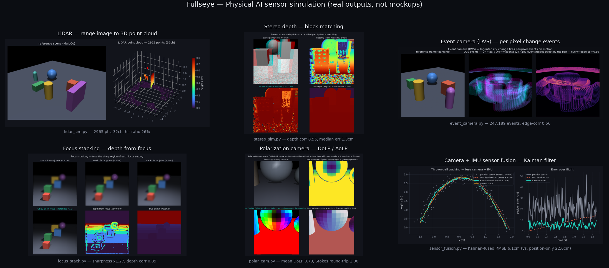

| パネル | モジュール / op | 表示されている数値の意味 |
|---|---|---|
| LiDAR — range image to 3D point cloud | `lidar_sim.py` | `n_points` = 復元した3D点数、`channels` = 走査チャンネル数(垂直分解能)、`hit_ratio` = 発射レイのうち物体にヒットした割合 |
| Stereo depth — block matching | `stereo_sim.py` | `depth_corr` = ブロックマッチング推定深度と真値の相関、`median_err_m` = 深度誤差の中央値(m) |
| Event camera (DVS) — per-pixel change events | `event_camera.py` | `n_events` = 発生したDVSイベント総数、`edge_corr` = イベント密度とエッジ強度の相関 |
| Focus stacking — depth-from-focus | `focus_stack.py` | `sharpness_gain` = フォーカススタック後のシャープネス倍率、`depth_focus_corr` = 推定深度と焦点位置の相関 |
| Polarization camera — DoLP / AoLP | `polar_cam.py` | `mean_dolp` = 平均直線偏光度(0–1)、`stokes_roundtrip` = Stokesベクトル round-trip 再構成精度(1.0=完全一致) |
| Camera + IMU sensor fusion — Kalman filter | `sensor_fusion.py` | Kalman融合後のRMSE(cm)を、位置センサ単体のRMSEと比較(融合の方が誤差が小さいことを示す) |

### 1.2 `vision_ops_montage.png` — 古典 2D ビジョン op チェーン

生成元: `tools/gen_article_assets.py::build_vision_ops_montage()`。bundled サンプル画像
`coins`(skimage.data、BSD)に `fullseye.apply()` 経由で実際の op チェーンを適用したもの。

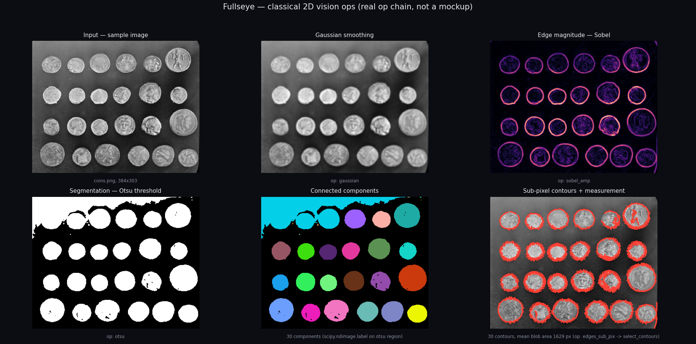

| パネル | op | 内容 |
|---|---|---|
| Input — sample image | (入力) | `coins.png` そのまま |
| Gaussian smoothing | `gaussian` | ガウス平滑化(a=0.3, b=0.0) |
| Edge magnitude — Sobel | `sobel_amp` | 平滑化画像への Sobel エッジ強度 |
| Segmentation — Otsu threshold | `otsu` | 平滑化画像への大津の二値化 |
| Connected components | `scipy.ndimage.label`(otsu領域に対して) | 連結成分数 = 検出したコイン個数 |
| Sub-pixel contours + measurement | `edges_sub_pix` → `select_contours` | サブピクセル輪郭抽出(a=0.2)後、長さ閾値 a=0.7 で短い彫刻テクスチャ由来の輪郭を除去し外周だけ残す。輪郭数と平均ブロブ面積(px)を表示 |

### 1.3 `itokawa_montage.png` — 小惑星 25143 Itokawa 実点群への 3D op

生成元: `tools/gen_article_assets.py::build_itokawa_montage()`。データは
`studio_assets/sample_3d/itokawa_points.npy`(JAXA はやぶさ / Gaskell 形状モデル由来の
実測点群、float32・3000点)。`examples_3d/itokawa_*.py` と同じ計算(curvature3d /
match3d / metrics3d)をその場で直接実行し、本物の数値をキャプションへ焼き込んだもの。

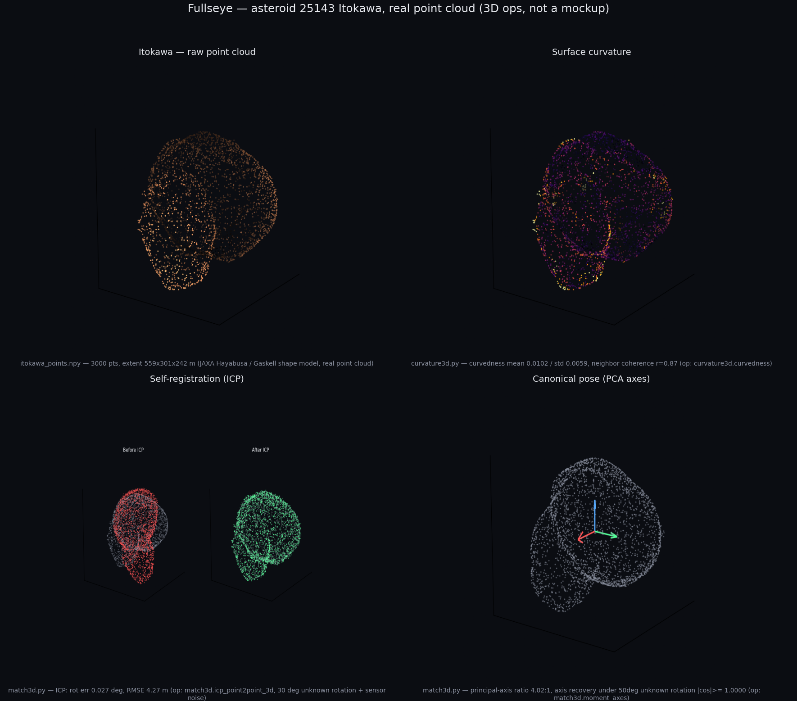

| パネル | モジュール / op | 表示されている数値の意味 |
|---|---|---|
| Itokawa — raw point cloud | `itokawa_points.npy` | 実点群をそのまま3D scatter表示(色は原点からの距離、岩石感の陰影付け)。点数と外接寸法(m) |
| Surface curvature | `curvature3d.curvedness` | 各点の曲率強度(curvedness)で着色。`mean`/`std` は分布のばらつき、`neighbor coherence r` は近傍点との曲率相関(実在表面なら高い、乱数なら~0 — 対応 `examples_3d/itokawa_curvature.py` の検証項目) |
| Self-registration (ICP) | `match3d.icp_point2point_3d` | 基準点群に未知回転30度+センサーノイズを掛けたスキャンを ICP で位置合わせ(左=前・右=後)。`rot err` = 回復した回転の真値との誤差(度)、`RMSE` = 最終残差(m) |
| Canonical pose (PCA axes) | `match3d.moment_axes` | 主慣性軸(赤=最長軸/緑/青、長さは固有値の平方根に比例)を実点群に重畳。`principal-axis ratio` = 最長:次長軸の固有値比、`axis recovery` = 50度の未知回転を掛けたあと主軸を回復できた度合い(|cos|、1.0000=完全一致) |

### 1.4 `op_taxonomy.png` — op 分類マップ(treemap)

生成元: `tools/gen_article_assets.py::build_op_taxonomy()`。`ops.REGISTRY`(2D)と
`ops3d.OPS3D`(3D)を実際に import してカテゴリ別 op 数を集計し、面積比例の
squarified treemap(外部ライブラリなし、Bruls/Huizing/van Wijk 1999 アルゴリズムを
matplotlib 上に自前実装)で描いたもの。2D は `ops.REGISTRY` を op 名でデデュープした
集合(`ops.RT` と同じ規則。REGISTRY 上は同名 op が category を跨いで4件再登録されて
いるため、後勝ちで数える)、3D は `ops3d.OPS3D`(dict、`category` フィールド)を
そのまま数える。合計が記事の実測値(2D 731 / 3D 265、カテゴリ数 46 / 55)と一致する
ことをスクリプト内で `assert` している(不一致ならレジストリか記事の数字のどちらかが
古いと分かるようにするための保険)。

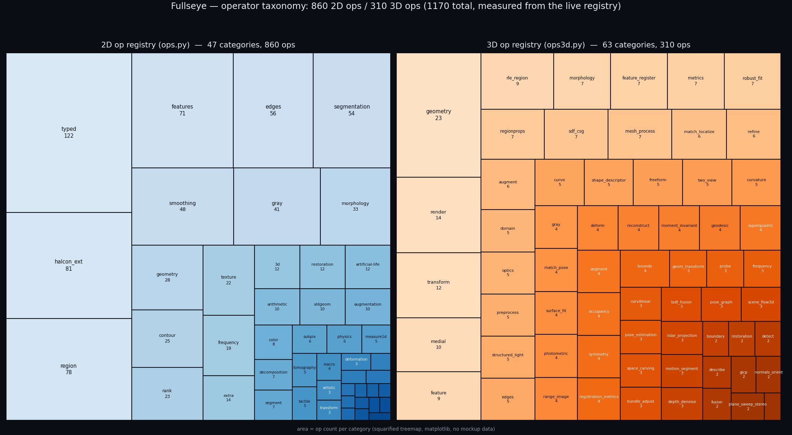

左が 2D(`ops.py`、青系)、右が 3D(`ops3d.py`、橙系)。矩形の面積 = そのカテゴリの
op 数、ラベルは「カテゴリ名 + op 数」(矩形が小さすぎる場合は読めない文字の詰め込みを
避けてラベルを省略)。2D で最大のカテゴリは `halcon_ext`(81)、`region`(76)、
`features`(71)。3D で最大は `geometry`(23)、`render`(14)、`transform`(12)。

### 1.5 `halcon_coverage_chart.png` — HALCON カバレッジの章別バー

生成元: `tools/gen_article_assets.py::build_halcon_coverage_chart()`。当初の指示は
`fullseye/data/halcon_graph.json` の `covered` フィールドを使う想定だったが、実際に
読むと 252/2313(10.9%)にしかならず記事の実測値(982/2313=42.5%)と一致しなかった
(honest disclosure — 指示された参照先を鵜呑みにせず実データで確認した結果)。
`docs/HALCON_COVERAGE.md` を実際に生成しているのは `halcon_coverage.py`
(`data/halcon_operators.json` の実スクレイプ結果 2313 op と `Op.halcon` を突合)なので、
それをその場で再実行して真の章別 covered/total を取得し、グラフ生成後に
`docs/HALCON_COVERAGE.md` に書かれている「982 / 2313 (42.5%)」の数字とも突き合わせて
`assert` している(スクリプト実行時に `cross-check OK` とログに出る)。

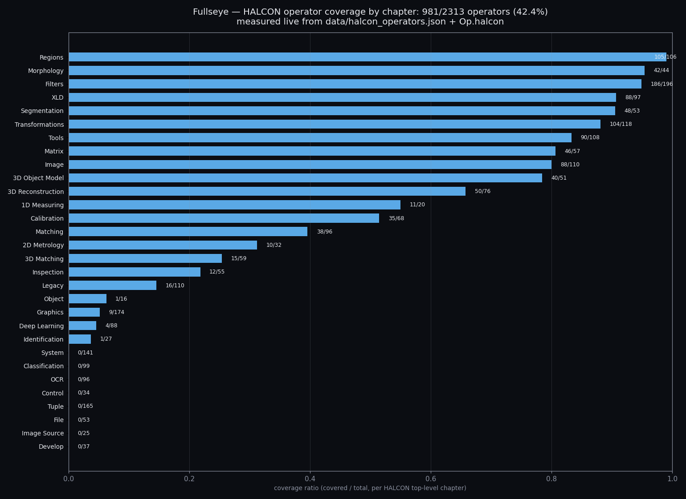

横棒はカバー率(covered/total)降順、右端に実数の `n/N` を表記。全 30 章のうち
`Regions`(105/106)`Morphology`(42/44)`Filters`(186/196)が上位、`System` `Classification`
`OCR` `Control` `Tuple` `File` `Image Source` `Develop` の8章は 0 カバー(HALCON の
非アルゴリズム系チャプターや imgevolve が未対応の領域)。数字は集計結果そのまま。

### 1.6 `op_sampler_2d.png` — 2D op 出力サンプラー(24 カテゴリ代表)

生成元: `tools/gen_article_assets.py::build_op_sampler_2d()`。bundled サンプル画像
`coins`(skimage.data、BSD)に、46 カテゴリの中から機械的に選んだ 24 カテゴリの代表 op
を実際に適用したもの。選び方は見た目で選ばず、`ops.REGISTRY` の登録順でカテゴリの
初出順を記録し、各カテゴリで最初に `fullseye.apply()` が例外なく通った op を採用する
(動かない op は同カテゴリ内の次候補へフォールバック)。

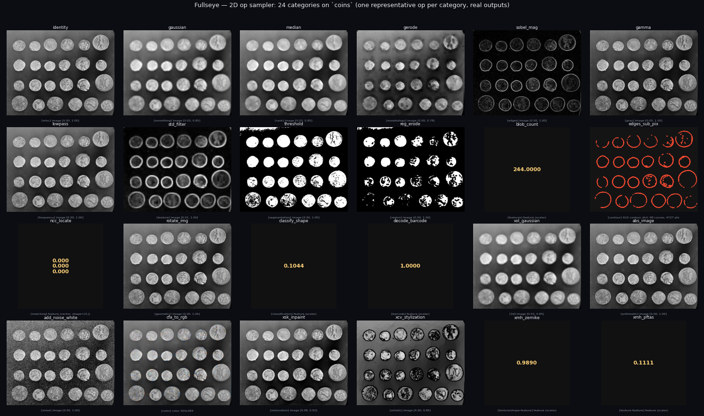

24 タイル: `identity`(misc) `gaussian`(smoothing) `median`(rank) `gerode`(morphology)
`sobel_mag`(edges) `gamma`(gray) `lowpass`(frequency) `std_filter`(texture)
`threshold`(segmentation) `reg_erode`(region) `blob_count`(features)
`edges_sub_pix`(contour) `ncc_locate`(matching) `rotate_img`(geometry)
`classify_shape`(classification) `decode_barcode`(barcode) `vol_gaussian`(3d)
`abs_image`(arithmetic) `add_noise_white`(noise) `cfa_to_rgb`(color)
`xsk_inpaint`(restoration) `xcv_stylization`(artistic) `xmh_zernike`(texture/shape-feature)
`xmh_pftas`(texture-feature)。image/region 出力はそのまま画像表示、feature(スカラー/
ベクトル)出力は数値をタイルへ焼き込み(例: `blob_count`=244 個、`classify_shape`=0.1044)、
contour 出力(`edges_sub_pix`)は XLD の実点群をオーバーレイに焼き込み(線で結ばず点その
ものを表示、走査順の点を線で繋ぐと偽の弦が出るため)。`vol_gaussian` は本来 3D volume 用
の op を 2D 画像 1 枚(1 スライス相当)にそのまま適用しており、見た目は通常の gaussian
平滑化に近い(honest — 型はゆるく通るが実質同じ計算になる、というのも実測結果として
そのまま見せている)。

### 1.7 `op_sampler_3d.png` — 3D op 出力サンプラー(余力枠)

生成元: `tools/gen_article_assets.py::build_op_sampler_3d()`。データは 1.3 と同じ
`studio_assets/sample_3d/itokawa_points.npy`(JAXA はやぶさ / Gaskell 実点群)。
`ops3d.get(name)` 経由で6op を直接実行。

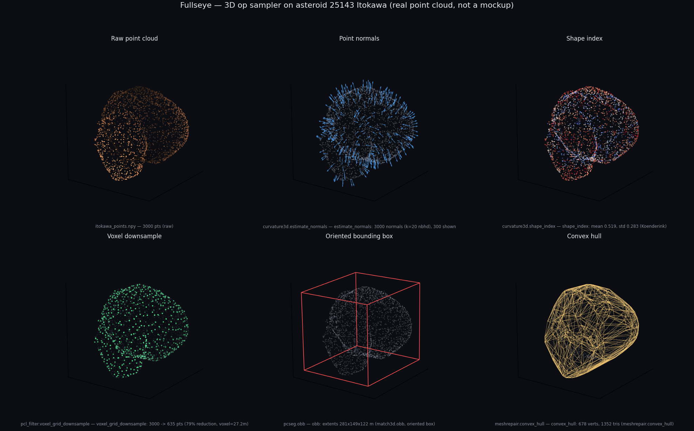

| パネル | op | 表示されている数値の意味 |
|---|---|---|
| Raw point cloud | (入力) | 実点群 3000点をそのまま scatter(色は原点距離) |
| Point normals | `curvature3d.estimate_normals` | 各点の法線ベクトル(k=20近傍からの主成分推定)を矢印で表示(見やすさのため300本間引き) |
| Shape index | `curvature3d.shape_index` | Koenderink shape index(-1=cup 〜 +1=cap)で着色。mean/std は分布の要約 |
| Voxel downsample | `pcl_filter.voxel_grid_downsample` | ボクセルサイズ(直径/25)でグリッド間引き。3000→635点(79%削減) |
| Oriented bounding box | `pcseg.obb` | 主慣性軸に沿った有向境界ボックス(赤ワイヤーフレーム)。extents = 3軸の寸法(m) |
| Convex hull | `meshrepair.convex_hull` | 点群の凸包メッシュ(黄色ワイヤーフレーム)。頂点数・三角形数 |

---

## 2. `examples_3d/_gallery/` — 3D 事例の hero 画像 / ターンテーブル GIF

全図版は `examples_3d/_gallery/` に置かれている実データ。パスはこのページからの相対パスで、
GitHub 上でそのまま表示されます。

| サムネ | ファイル | 説明 | 生成元スクリプト |
|---|---|---|---|
| 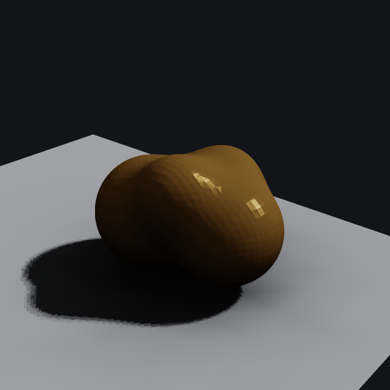 | `render_beauty_hero.png` | 全レンダリング品質層(鏡面ハイライト・アンビエントオクルージョン・接地影・SSAA・トーンマップ)を一発合成する hero レンダラ `render_beauty` の出力(peanut形メッシュ、金属マテリアル) | `examples_3d/render_beauty.py` |
| 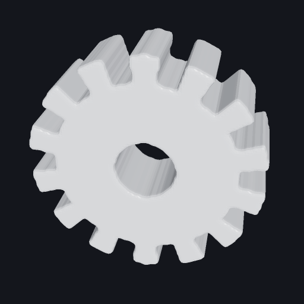 | `gear_hero.png` | 平歯車(スパーギア、12枚歯)の hero レンダ | 特定不能(推定: `examples_3d/rotational_symmetry_fold.py` の `build_gear()` 由来メッシュだが、この画像を焼いた再生成スクリプトは現在のツリーに見当たらない — honest disclosure として明記) |
| 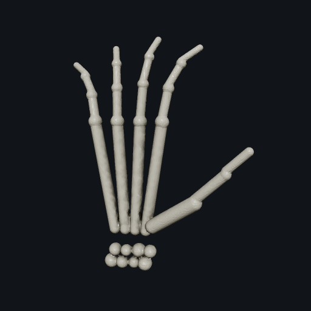 | `hand_hero.png` | 手続き的に組んだ手全体の骨格(手根骨8・中手骨5・指骨14、カプセルSDF)の hero レンダ | 特定不能(推定: `examples_3d/procedural_hand.py` の `build_hand_bones()` 由来メッシュだが、この画像を焼いた再生成スクリプトは現在のツリーに見当たらない) |
| 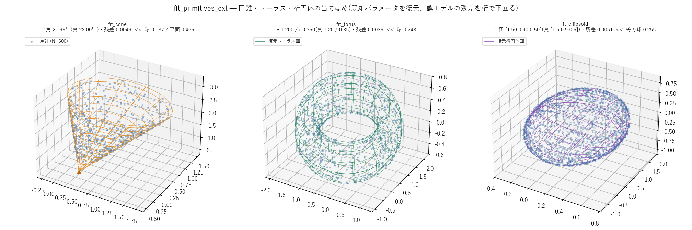 | `fit_primitives_ext.png` | 円錐・トーラス・3軸楕円体を点群に当てはめる拡張プリミティブフィッティング(円筒・球・平面までの既存RANSACでは扱えない曲率変化形状) | `examples_3d/fit_primitives_ext.py` |
| 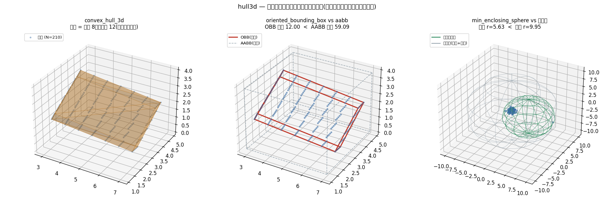 | `hull_bounds.png` | 点群を囲むプリミティブ群(convex hull / AABB / OBB は既存opの再掲、新規opは最小包含球 `min_enclosing_sphere` の1本のみ) | `examples_3d/hull_bounds.py` |
| 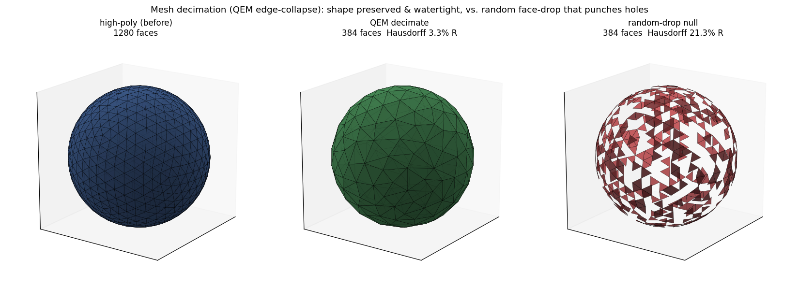 | `mesh_decimate.png` | QEM edge-collapse による境界保存・多様体厳格なメッシュ簡略化(`decimate_qem_manifold`)を、素朴なランダム間引きおよび既存opの `decimate_qem` と実測比較 | `examples_3d/mesh_decimate.py` |
| 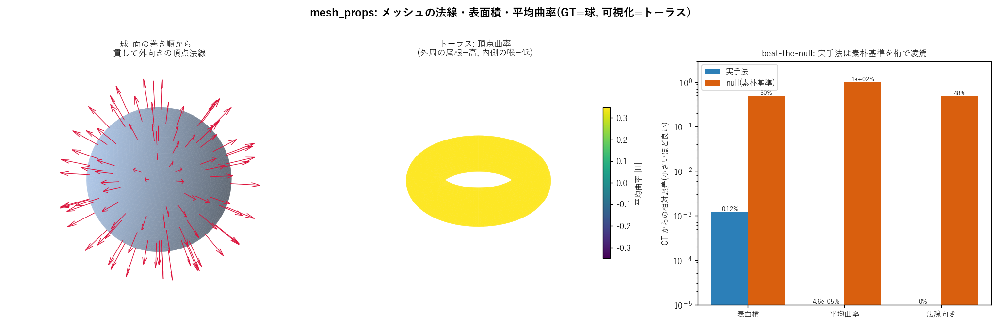 | `mesh_props.png` | 三角形メッシュの法線・表面積・平均曲率(離散Laplace-Beltrami)の計測。icosphereの解析解(4πR²)と比較 | `examples_3d/mesh_props.py` |
| 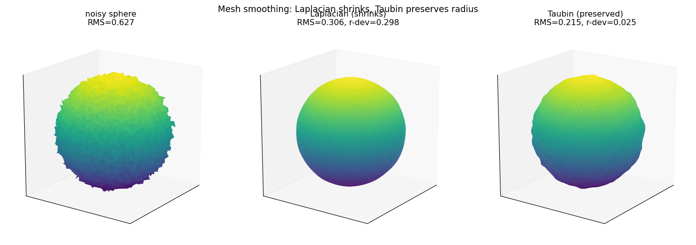 | `mesh_smooth.png` | ノイズの乗った球メッシュの平滑化。素朴なLaplacian平滑化(収縮する)とTaubin平滑化(収縮しない帯域通過フィルタ)の比較 | `examples_3d/mesh_smooth.py` |
| 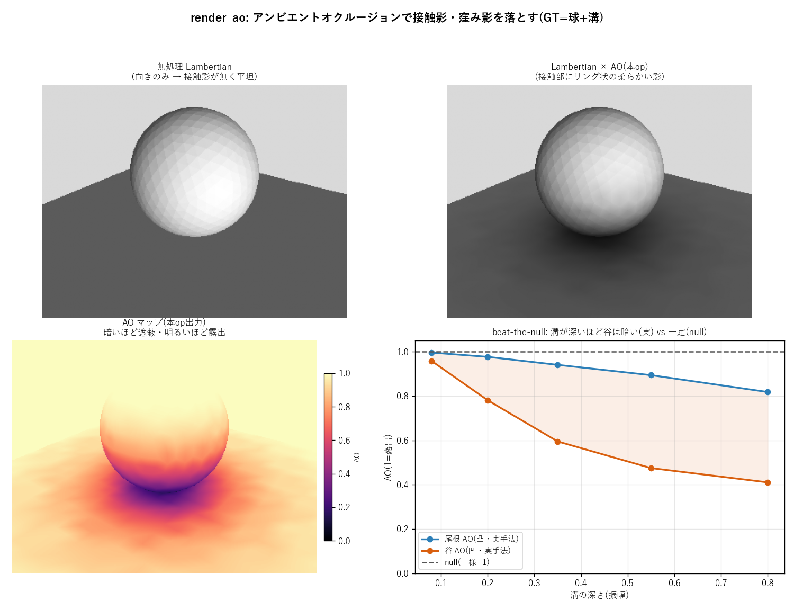 | `render_ao.png` | アンビエントオクルージョン(頂点ごとの半球レイキャストで接触部・凹部を選択的に暗化) | `examples_3d/render_ao.py` |
| 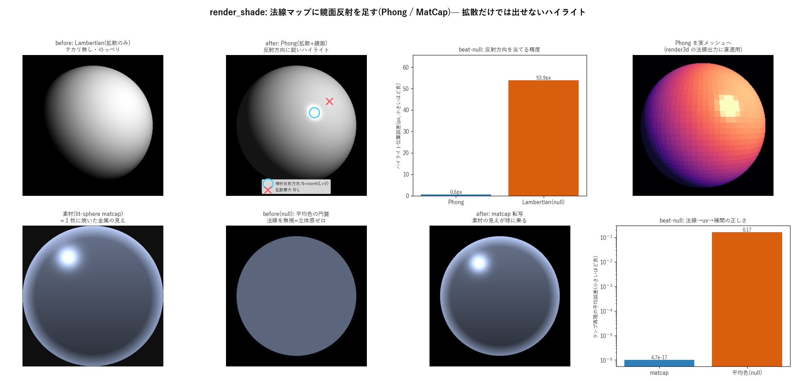 | `render_shade.png` | 法線マップへの Phong 鏡面ハイライトおよび MatCap シェーディング | `examples_3d/render_shade.py` |
| 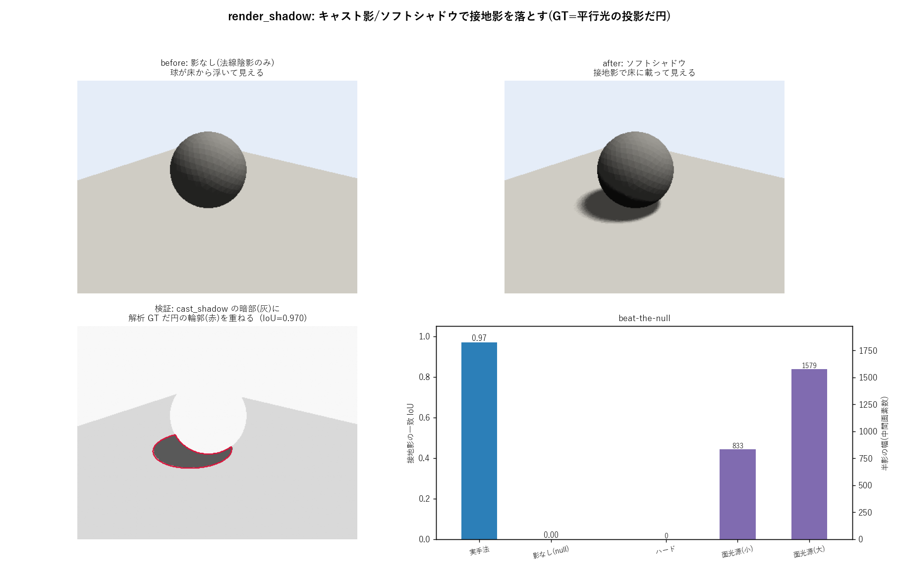 | `render_shadow.png` | shadow mapping によるキャスト影・半影(ソフトシャドウ、面光源近似) | `examples_3d/render_shadow.py` |
| 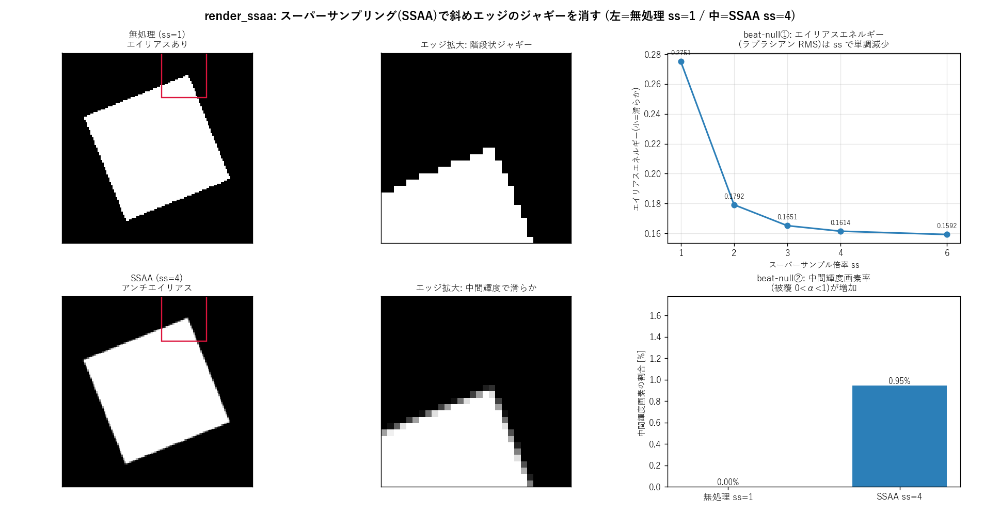 | `render_ssaa.png` | スーパーサンプリング(SSAA)によるメッシュ輪郭のジャギー除去 | `examples_3d/render_ssaa.py` |
| 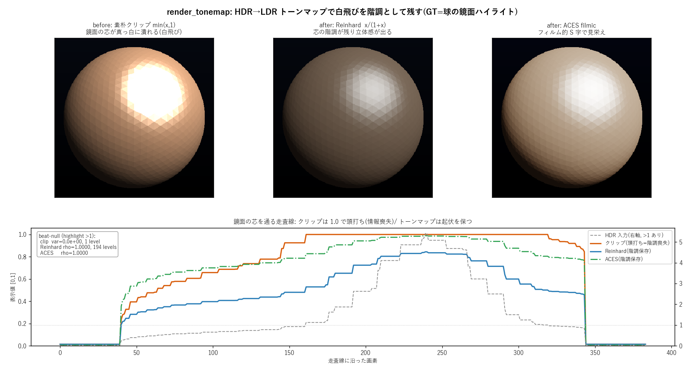 | `render_tonemap.png` | HDRレンダの Reinhard / ACES トーンマッピング(素朴クリップとの比較、階調保持を実証) | `examples_3d/render_tonemap.py` |
| 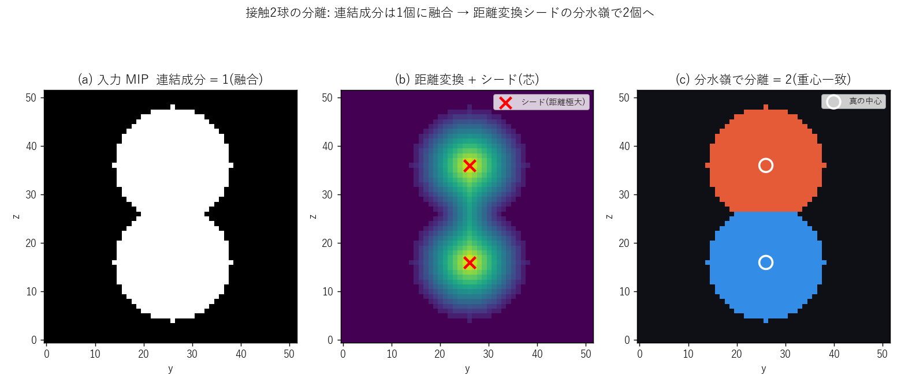 | `watershed3d.png` | 接触した2物体を距離変換+分水嶺(watershed)で分離(連結成分ラベリングでは1個に融合してしまうケース) | `examples_3d/watershed3d.py` |
| (GIF — GitHub上でアニメ表示) | `showcase_turntable_pod.gif` | SDF生成の hero pod を金属マテリアルで1回転させるターンテーブル | `tools/gen_showcase_gifs.py`(`build_pod`) |
| (GIF) | `showcase_turntable_itokawa.gif` | 小惑星 25143 Itokawa の実点群を岩石マテリアルで1回転 | `tools/gen_showcase_gifs.py`(`build_itokawa`) |
| (GIF) | `showcase_turntable_skeleton.gif` | 手骨CTボリュームを骨色マテリアルで1回転(骨格標本風) | `tools/gen_showcase_gifs.py`(`build_skeleton`、subject=hand-bone CT) |
| (GIF) | `showcase_hue_cycle.gif` | hero pod を回転させながら表面アルベドの色相を0→360で回す | `tools/gen_showcase_gifs.py`(`build_pod` + hue cycle) |
| (GIF) | `showcase_hand.gif` | 手続き的手骨格のターンテーブル(推定、`hand_hero.png` と同じ被写体) | 特定不能(再生成スクリプトが現在のツリーに見当たらない) |

`gear_hero.png` / `hand_hero.png` / `showcase_hand.gif` の3点は、被写体を生成する関数
(`build_gear()` / `build_hand_bones()`)自体はリポジトリに存在するものの、それを
`render_beauty` 等で画像化して `_gallery/` へ焼いたスクリプトが現在のツリーに残っていません。
過去セッションのアドホック実行と推定されます(推測で断定せず、事実として明記)。

---

## 3. 記事用サムネイル

`docs/articles/assets/thumbs/` に、上記モンタージュ・hero・新規図版から幅720px(アスペクト
維持、元画像が720pxより狭ければ拡大しない)で書き出したサムネがあります。容量を抑える
方針のため **JPEG(quality=85、RGB変換)** で保存しています。解説記事はこのサムネを表示し、
フルサイズは本ページ経由で参照する構成です。

- `thumbs/physical_ai_montage_720.jpg`
- `thumbs/vision_ops_montage_720.jpg`
- `thumbs/render_beauty_hero_720.jpg`
- `thumbs/itokawa_montage_720.jpg`
- `thumbs/op_taxonomy_720.jpg`
- `thumbs/halcon_coverage_chart_720.jpg`
- `thumbs/op_sampler_2d_720.jpg`
- `thumbs/op_sampler_3d_720.jpg`

---

## 4. 動画(mp4)

`docs/articles/assets/media/` に、GIF ショーケースと同一フレームから書き出した H.264 mp4
(容量が軽く、GitHub の blob ページ上でそのまま再生できる)と、Physical AI センサー系の
イベントカメラ(DVS)ストリームを可視化した動画があります。

| 動画 | 説明 |
|---|---|
| [`pod.mp4`](https://github.com/furuse-kazufumi/fullseye/blob/master/docs/articles/assets/media/pod.mp4) | SDF生成の hero pod を金属マテリアルで1回転させるターンテーブル(`showcase_turntable_pod.gif` と同一フレーム) |
| [`itokawa.mp4`](https://github.com/furuse-kazufumi/fullseye/blob/master/docs/articles/assets/media/itokawa.mp4) | 小惑星 25143 Itokawa の実点群を岩石マテリアルで1回転(`showcase_turntable_itokawa.gif` と同一フレーム) |
| [`skeleton.mp4`](https://github.com/furuse-kazufumi/fullseye/blob/master/docs/articles/assets/media/skeleton.mp4) | 手骨CTボリュームを骨色マテリアルで1回転、骨格標本風(`showcase_turntable_skeleton.gif` と同一フレーム) |
| [`hue_cycle.mp4`](https://github.com/furuse-kazufumi/fullseye/blob/master/docs/articles/assets/media/hue_cycle.mp4) | hero pod を回転させながら表面アルベドの色相を0→360で回す(`showcase_hue_cycle.gif` と同一フレーム) |
| [`dvs_stream.mp4`](https://github.com/furuse-kazufumi/fullseye/blob/master/docs/articles/assets/media/dvs_stream.mp4) | イベントカメラ(DVS)シミュレーション — MuJoCoシーンをパンしながら発生するON(明)/OFF(暗)イベントが物体エッジ上を流れる様子(`event_camera.py` と同一のログ輝度差分モデルをステップ実行、軽量版 `dvs_stream.gif` も同梱) |

生成元: `tools/gen_showcase_gifs.py::save_mp4()`(ターンテーブル4種、GIFと同一フレームを
再利用)/ `tools/gen_article_assets.py::build_dvs_stream_video()`(DVSストリーム)。

---

## 5. 自分で再生成する / Regenerate yourself

```powershell
# 記事用モンタージュ + hero コピー + 720px JPGサムネ + DVSストリーム動画(このページの §1・§3・§4)
py -3.11 tools/gen_article_assets.py

# examples_3d/_gallery/ のターンテーブル GIF 4種 + 同一フレームの mp4(このページの §2・§4、
# pod/itokawa/skeleton/hue_cycle)。repo ルートはスクリプトが自前で sys.path に足すので
# PYTHONPATH の設定は不要。
py -3.11 tools/gen_showcase_gifs.py

# 個別の 3D 事例 hero 画像(例)
py -3.11 examples_3d/render_beauty.py
py -3.11 examples_3d/render_ao.py
py -3.11 examples_3d/mesh_smooth.py
# ... 他は examples_3d/<name>.py を直接実行(各スクリプトが _gallery/<name>.png を上書き)

# Studio スクリーンショット(§6)/科学ギャラリー(§7)/学問分野横断(§8)/工業+Physical AI(§9)
py -3.11 tools/gen_studio_screenshots.py
py -3.11 tools/gen_science_gallery.py
py -3.11 tools/gen_academic_gallery.py     # DL/生成キャッシュは data/academic_samples/(再実行は課金・再DLなし)
py -3.11 tools/gen_industrial_gallery.py
```

---

## 6. Studio スクリーンショット(`studio_*.png`)

生成元: `tools/gen_studio_screenshots.py`。すべて `studio.build_window()` が組み立てた
実際の Studio UI をヘッドレスで `grab()` した本物の画面です(3D surface のみ実 GL
コンテキストでの `Q3DSurface.renderToImage`。series 構築は Studio 本体の
`_build_surface3d_series` を共有し、実機と見た目が乖離しない作り)。モックアップはありません。

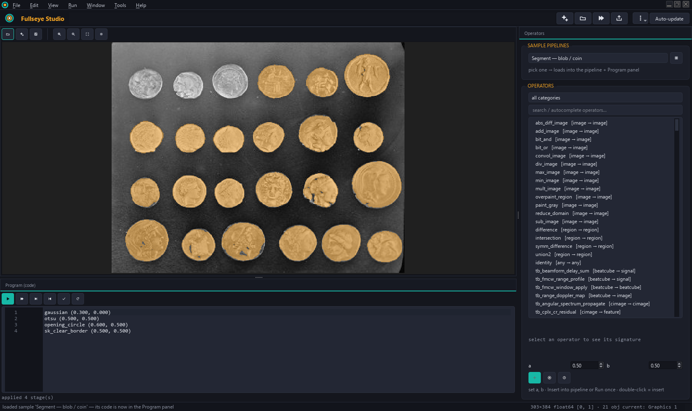

| 画像 | 内容 |
|---|---|
| `studio_main.png` | メインウィンドウ。coins サンプル画像に blob 分割パイプライン(gaussian → otsu → opening_circle → sk_clear_border)を適用し、region overlay 表示で 21 個のコインを重畳表示。下部 Program パネルに HDevelop 風のパイプラインコード、右に演算子ブラウザ(検索+シグネチャ表示)、ステータスバーに `21 obj` |
| `studio_3d_surface.png` | Ctrl+3 で開く回転可能な 3-D surface ビュー(Q3DSurface、高さ連動の地形風グラデーション)。データは小惑星イトカワの Gaskell 形状モデル(JAXA はやぶさ)を `render3d.render_mesh` で深度画像化した実データの起伏。アプリ内ではこのビューをマウスドラッグで回転・ホイールでズームできる |
| `studio_python_editor.png` | Python Editor(タブ式・複数スクリプト同時編集)。`examples_3d/itokawa_curvature.py` を開いて F5 実行した直後で、下部コンソールに実際のイトカワ曲率解析の出力(PASS, exit 0) |
| `studio_3d_examples.png` | 3-D Examples ギャラリー(105 の実データ worked example)。itokawa_curvature を選択して Run した直後で、Output タブにグラウンドトゥルース検証つきの実行結果(PASS) |
| `studio_3d_ops.png` | 3-D Operators リファレンス(265 op)。icp_point2plane の生成済みヘルプページ(シグネチャ・使い方・検証済みサンプル・型が繋がる次の op へのリンク) |

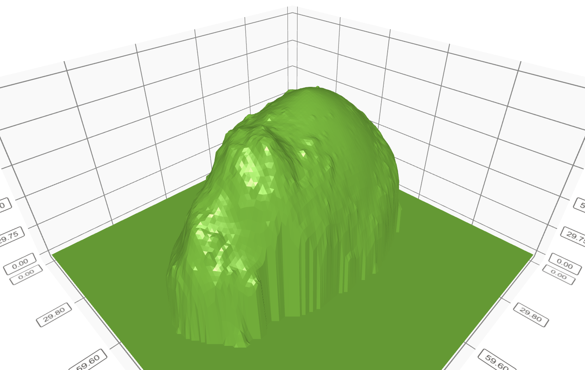
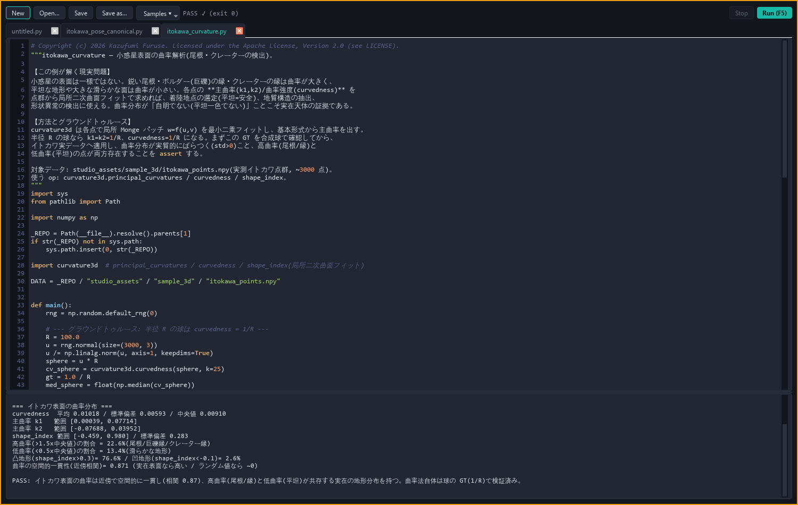
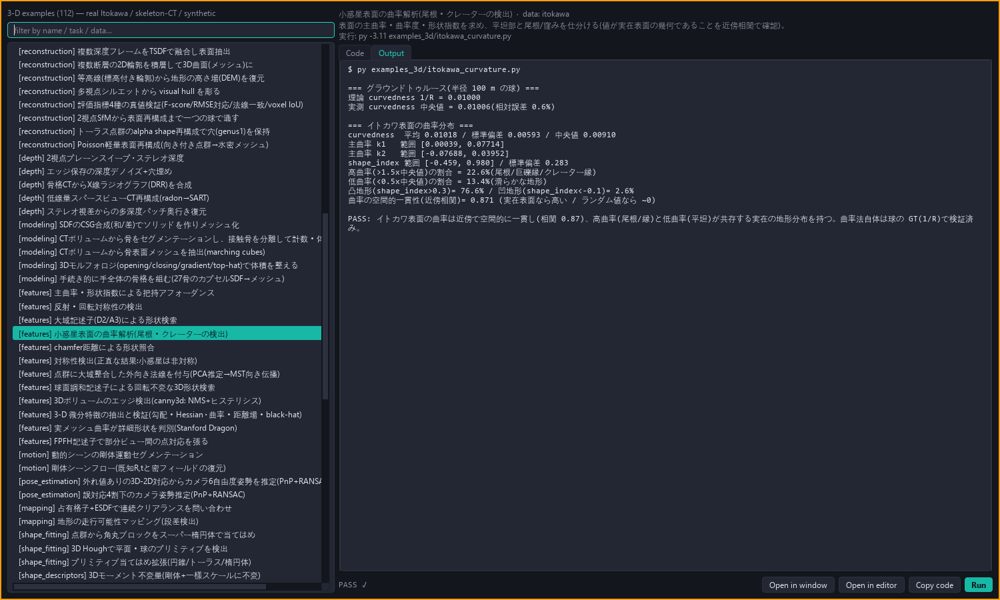
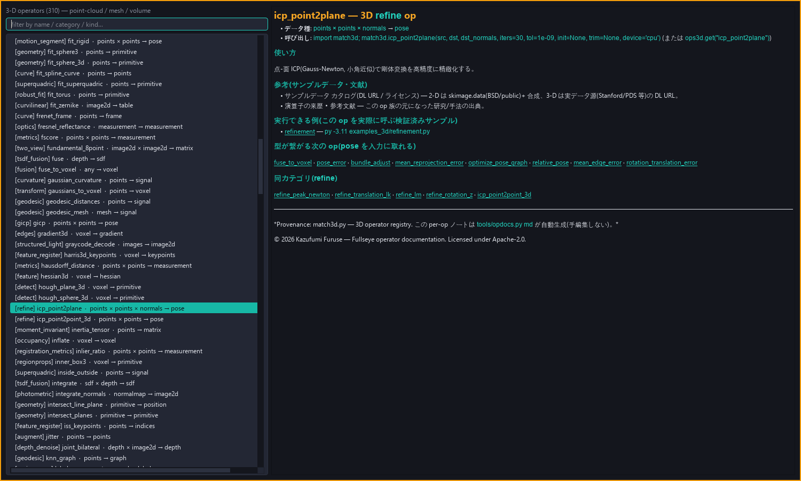

---

## 7. 科学ギャラリー(`science_*.png/gif`)

生成元: `tools/gen_science_gallery.py`(subject 単位で再生成可能:
`py -3.11 tools/gen_science_gallery.py --subjects <name,...>`)。
すべて fullseye の登録 op / facade の実出力で、モックアップはありません。
シミュレーション由来の画像はキャプションにその旨を明記しています。
サムネ(幅 720px JPG)は同ディレクトリの `*_thumb.jpg`。

| 画像 | 内容(使用 op / データ) |
|---|---|
| `science_distance_ripple.png` | コイン実写真の距離変換を虹色+波紋等高線で(otsu, fill_up, distance_transform / skimage.data coins) |
| `science_fourier_stars.png` | camera 実写真と織り目テクスチャの FFT スペクトル。織り目が星座状に光る(fft_image。織り目パネルのみ合成) |
| `science_watershed_foam.png` | コイン 24 枚を watershed で 1 枚ずつ色分け(watersheds, segment_objects, colorize_labels) |
| `science_edge_compass.png` | 輪郭の向きを色相環で塗るネオン画(sobel_dir, sobel_amp) |
| `science_alife_worlds.png` | ルール90 フラクタル/ルール30 カオス/砂山くずし/DLA 樹枝/レニア/サイクリック CA の 6 パネル(alife_* 反復適用。シミュレーション画像) |
| `science_dino_xray.png` | Smithsonian トリケラトプス骨格標本の実スキャン(CC0)をボクセル化 → vol_mip でレントゲン調(voxelize, vol_gaussian, vol_mip) |
| `science_dragon_anaglyph.png` | Stanford dragon 2 視点レンダの赤青アナグリフ(read_mesh, look_at, render_mesh) |
| `science_dino_terrain.png` | 骨格標本 60 万点群 → 標高地図 → 地形陰影着色。背骨が山脈になる(elevation_map, colorize_height) |
| `science_morph_pulse.gif` | 膨張で合体 → 収縮で痩せるモルフォロジーアニメ 26 フレーム(dilation_circle, erosion_circle) |
| `science_wobble_warp.png` | TPS/FFD/MLS 3 流儀の空間変形 before/after(deform_tps/ffd/mls) |
| `science_dino_skeleton.png` | 骨格標本の真上影絵から中心線を金色で抽出(sk_skeleton) |

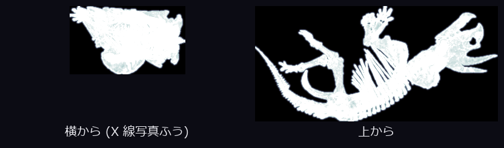
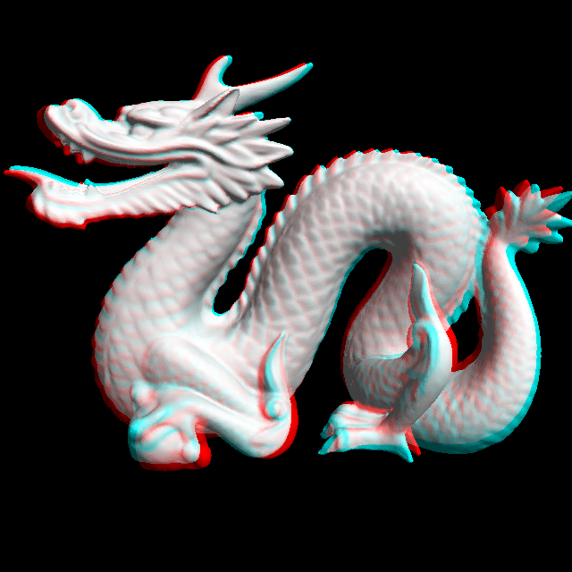

---

## 8. 学問分野横断ギャラリー(`academic_*.png`)

生成元: `tools/gen_academic_gallery.py`。**30 展示 = 実データ 8 + AI 生成 22**。
医学・考古学・生物学・宇宙・古生物学・地質学・気象学・海洋学・植物学をカバーし、
全画像に fullseye の登録 op を適用した処理前→後のペア構成です。

- **実データ**は Smithsonian(CC0)・メトロポリタン美術館(CC0)・NASA(public domain)・
  BBBC(CC-BY)のみを使用。**全素材の出典・ライセンスは
  [articles/assets/ACADEMIC_ATTRIBUTION.md](articles/assets/ACADEMIC_ATTRIBUTION.md) の帰属表を参照。**
- **AI 生成(Google gemini-2.5-flash-image)の模擬データ**は、montage の全パネル左上に
  「AI-generated」を刻印し、帰属表にも明記(実在の標本・患者・スキャンではありません)。
- この収集・処理は**実データによるバグ発見**も兼ねており、見つかった 5 件は
  [KNOWN_ISSUES.md](KNOWN_ISSUES.md) に記録済み。

代表 2 点(全 31 点は `articles/assets/academic_*.png` を直接参照):

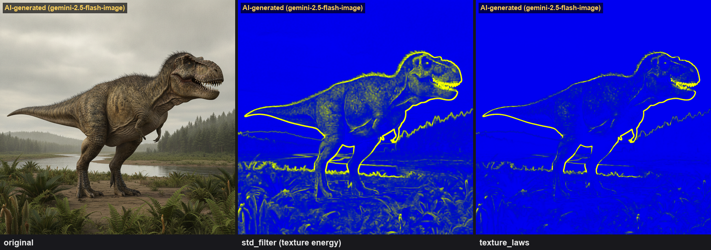
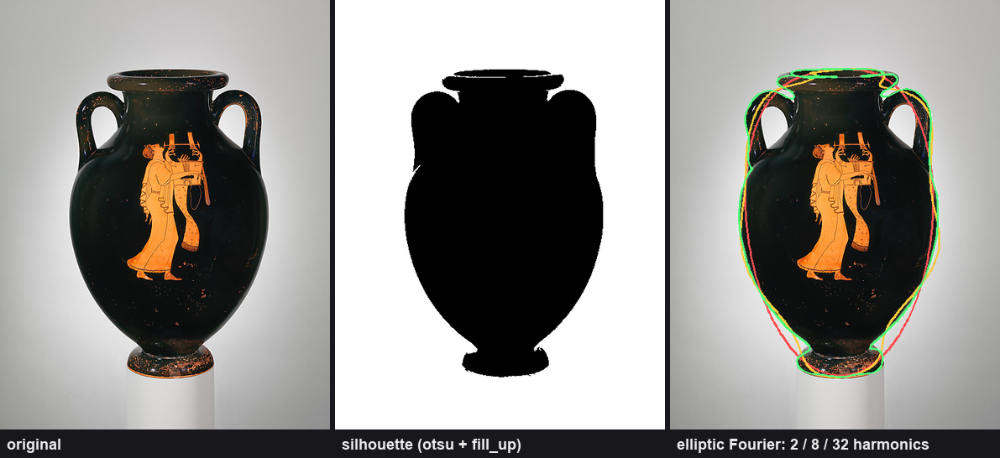

---

## 9. 工業+Physical AI ギャラリー(`industrial_*.png` / `phai_*.png`)

生成元: `tools/gen_industrial_gallery.py`(`--subjects` 選択可)。
すべて合成データ / MuJoCo シミュレーション上の実処理で、検出・計測結果は既知の真値
(配置数・描画寸法・配置姿勢)との一致を assert で確認しています。

| 画像 | 内容(検算) |
|---|---|
| `industrial_defect.png` | ヘアライン金属面の傷3・打痕2・異物1 → median 背景差分 → 赤枠+面積(6/6 検出) |
| `industrial_metrology.png` | 段付きシャフト 3 段径をサブピクセルキャリパーで実測(誤差最大 0.02px) |
| `industrial_align.png` | 回転ワーク 3 個の shape matching 位置決め(位置 0.0px・角度 0.0° 一致、別部品に無反応) |
| `industrial_blobs.png` | ペレット 60 粒(接触 6 組)をマーカー watershed で計数 60/60+サイズ 3 色分類 |
| `industrial_barcode.png` | バー 45 本のエッジ対検出(全エッジ ±1.5px)+走査線プロファイル |
| `phai_binpick.png` | MuJoCo 物理落下のばら積み → 高さマップ → 把持候補 8 件採点 |
| `phai_lidar_clusters.png` | 実レイキャスト 2.3 万本 → 地面除去 → 6 クラスタ+OBB 鳥瞰(6/6) |
| `phai_stereo_obstacles.png` | 視差 → 3D 復元 → 鳥瞰障害物マップ(4/4、地面誤差中央値 3mm) |
| `phai_focus_stack.png` | 7 焦点 → 全焦点合成(sharpness ×1.27) |
| `media/phai_bin_pick.mp4` | Panda が把持候補を選び 6-DOF IK で掴んで搬出するフルサイクル(150 フレーム、搬出成功 3/3 実測) |

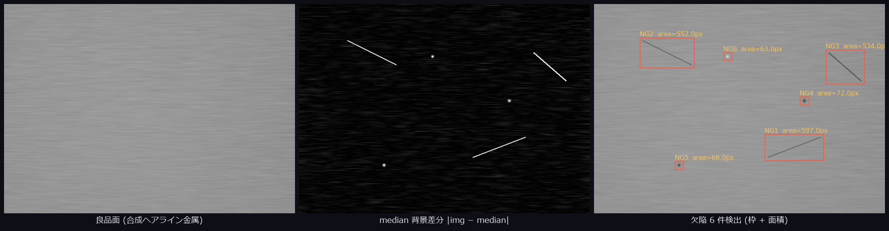
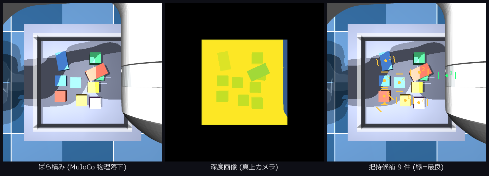
