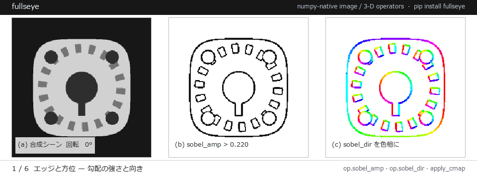

# Fullseye 文档索引

**Language:** [日本語](README.md) · [English](README.en.md) · [简体中文](README.zh.md) · [繁體中文](README.tw.md) · [한국어](README.ko.md) · [Deutsch](README.de.md)

> **请注意：**目前只有本索引页有译文，它所链接的各篇文档暂时仅有日文版。




*六幕，全部是真实算子输出：边缘方向 / 连通域筛选 / 亚像素测量 / SDF 转网格 / 点云聚类 / 镜头离焦。*

**Fullseye**（工作代号 imgevolve）是一套 HALCON/HDevelop 级别的实用工具：由 numpy 原生的图像处理算子库、HDevelop 风格的可视化流水线设计环境（Fullseye Studio）以及执行运行时（FullseyeEngine）三者组成。算子约 **897** 个（以注册表计数），其中 **979/2313** 个真实 HALCON 算子做到了 genuine（真正等效）实现，覆盖 48 个类别。

> **先从这里开始 → [GETTING_STARTED.md](GETTING_STARTED.md)（5 分钟跑起来）**

---

<!-- poc-index:start -->

## PoC 系列 — 带真值求解的 63 个实际问题

每一个都具有闭式或合成的真值，并必定附带零点(什么都不做)。失败模式分开计数，原因用对照组区分。完整列表: [examples/README.md](../examples/README.md)。

| 领域 | PoC 与其结论 |
|---|---|
| metrology (16) | [`poc_crack_width`](https://github.com/furuse-kazufumi/fullseye/blob/master/examples/poc_crack_width.py) コンクリートのひび割れ幅は 1 画素より細い(数える幅と、積分する幅)<br>[`poc_dic_strain`](https://github.com/furuse-kazufumi/fullseye/blob/master/examples/poc_dic_strain.py) DIC ひずみ計測(2 度の回転が 600 µε の嘘のひずみを作る)<br>[`poc_dimensional_inspection`](https://github.com/furuse-kazufumi/fullseye/blob/master/examples/poc_dimensional_inspection.py) 部品の寸法検査(サブピクセル計測と、埋もれていた実装の実地評価)<br>[`poc_fiber_orientation`](https://github.com/furuse-kazufumi/fullseye/blob/master/examples/poc_fiber_orientation.py) 繊維の配向分布(角度は 180 度周期。素朴に平均すると 90 度ずれる)<br>[`poc_gear_tooth_metrology`](https://github.com/furuse-kazufumi/fullseye/blob/master/examples/poc_gear_tooth_metrology.py) 歯車の歯形(偏心は 1 次、歯は z 次。歯が 1 枚欠けると両方が混ざる)<br>[`poc_interferometry_step`](https://github.com/furuse-kazufumi/fullseye/blob/master/examples/poc_interferometry_step.py) 白色干渉によるナノメートルの段差計測(どこまで測れるか)<br>[`poc_metal_grain_size`](https://github.com/furuse-kazufumi/fullseye/blob/master/examples/poc_metal_grain_size.py) 結晶粒度 G(面積法と切片法は別の崖で落ちる)<br>[`poc_particle_sizing`](https://github.com/furuse-kazufumi/fullseye/blob/master/examples/poc_particle_sizing.py) 粒度分布(D50 が合う点は「正確」ではなく打ち消し)<br>[`poc_photoelasticity`](https://github.com/furuse-kazufumi/fullseye/blob/master/examples/poc_photoelasticity.py) 光弾性(縞から応力。壊れるのは応力が大きい所ではない)<br>[`poc_screw_thread_metrology`](https://github.com/furuse-kazufumi/fullseye/blob/master/examples/poc_screw_thread_metrology.py) ねじのピッチ・フランク角・有効径(傾きは左右フランクに逆符号)<br>[`poc_star_astrometry`](https://github.com/furuse-kazufumi/fullseye/blob/master/examples/poc_star_astrometry.py) 星の位置を測る(理論下限を下回ったら、それは推定できていない印)<br>[`poc_strain_history`](https://github.com/furuse-kazufumi/fullseye/blob/master/examples/poc_strain_history.py) クリープ試験のひずみ履歴(累積か直接か。交点は時間軸には無かった)<br>[`poc_surface_roughness`](https://github.com/furuse-kazufumi/fullseye/blob/master/examples/poc_surface_roughness.py) 表面粗さ(同じデータで Sa は合格・Sz は不合格になる標本間隔がある)<br>[`poc_water_level`](https://github.com/furuse-kazufumi/fullseye/blob/master/examples/poc_water_level.py) 河川の水位を斜め写真から測る(透視を無視した行番号は弓なりに外れる)<br>[`poc_weld_bead_profile`](https://github.com/furuse-kazufumi/fullseye/blob/master/examples/poc_weld_bead_profile.py) レーザー三角測量の断面から溶接ビードを測る(測れなかったところを 0 と書く罪)<br>[`poc_wound_area_tracking`](https://github.com/furuse-kazufumi/fullseye/blob/master/examples/poc_wound_area_tracking.py) 創傷面積の経時変化(較正の誤差は面積に 2 乗で効く) |
| photometry (5) | [`poc_allsky_cloud_cover`](https://github.com/furuse-kazufumi/fullseye/blob/master/examples/poc_allsky_cloud_cover.py) 全天カメラの雲量(画素を数えると雲の位置で 1.45 倍動く)<br>[`poc_astro_photometry`](https://github.com/furuse-kazufumi/fullseye/blob/master/examples/poc_astro_photometry.py) 天体スタックの測光精度(何枚重ねるとどこまで正確に測れるか)<br>[`poc_exoplanet_transit`](https://github.com/furuse-kazufumi/fullseye/blob/master/examples/poc_exoplanet_transit.py) 系外惑星トランジットの相対測光(深さと継続時間は別々に壊れる)<br>[`poc_nuclei_ploidy`](https://github.com/furuse-kazufumi/fullseye/blob/master/examples/poc_nuclei_ploidy.py) 蛍光核の積分輝度から倍数性を出す(面積では分かれない)<br>[`poc_solar_limb_darkening`](https://github.com/furuse-kazufumi/fullseye/blob/master/examples/poc_solar_limb_darkening.py) 縁が暗い天体の輪郭はどこか(周辺減光と「50 % 法」) |
| segmentation (5) | [`poc_cell_counting`](https://github.com/furuse-kazufumi/fullseye/blob/master/examples/poc_cell_counting.py) 細胞の計数と分割(計数が合っていて分割が全部外れる点がある)<br>[`poc_leaf_disease_area`](https://github.com/furuse-kazufumi/fullseye/blob/master/examples/poc_leaf_disease_area.py) 葉の病斑面積率(等級は色の軸より葉マスクと縁の定義で決まる)<br>[`poc_mri_bias_field`](https://github.com/furuse-kazufumi/fullseye/blob/master/examples/poc_mri_bias_field.py) MRI バイアス場と組織面積(GM と WM は逆向きに壊れ、足すと隠れる)<br>[`poc_timelapse_growth`](https://github.com/furuse-kazufumi/fullseye/blob/master/examples/poc_timelapse_growth.py) 成長のタイムラプスを時空間の連結成分として測る(合体はいつ起きたか)<br>[`poc_vegetation_cover`](https://github.com/furuse-kazufumi/fullseye/blob/master/examples/poc_vegetation_cover.py) 植生被覆率(被覆率が当たっていて画素が全部外れる、が実際に起きる) |
| diagnostics (4) | [`poc_bearing_diagnosis`](https://github.com/furuse-kazufumi/fullseye/blob/master/examples/poc_bearing_diagnosis.py) 転がり軸受の異常診断(どこまで雑音に埋もれた欠陥を拾えるか)<br>[`poc_fabric_defect`](https://github.com/furuse-kazufumi/fullseye/blob/master/examples/poc_fabric_defect.py) 周期のある地に埋もれた欠陥(まとめた ROC が隠すもの)<br>[`poc_prnu_camera_fingerprint`](https://github.com/furuse-kazufumi/fullseye/blob/master/examples/poc_prnu_camera_fingerprint.py) カメラ指紋 PRNU(枚数で育ち、保存ボタンで消える)<br>[`poc_thermography_ndt`](https://github.com/furuse-kazufumi/fullseye/blob/master/examples/poc_thermography_ndt.py) パルスサーモグラフィ(『測れない欠陥』の正体が時間窓だった) |
| separation (4) | [`poc_colocalization_crosstalk`](https://github.com/furuse-kazufumi/fullseye/blob/master/examples/poc_colocalization_crosstalk.py) 蛍光の共局在と漏れ込み(Pearson と Manders は別の場所で壊れる)<br>[`poc_pigment_unmixing`](https://github.com/furuse-kazufumi/fullseye/blob/master/examples/poc_pigment_unmixing.py) 多波長で彩色層を剥がす(勝ったのは「多波長」ではなく「近赤外」だった)<br>[`poc_polarization_specular`](https://github.com/furuse-kazufumi/fullseye/blob/master/examples/poc_polarization_specular.py) 偏光による鏡面分離(分けた「拡散」は本当に拡散か)<br>[`poc_sea_ice_concentration`](https://github.com/furuse-kazufumi/fullseye/blob/master/examples/poc_sea_ice_concentration.py) 海氷密接度(混合画素をどう数えるかで答えが変わる) |
| motion (3) | [`poc_particle_tracking`](https://github.com/furuse-kazufumi/fullseye/blob/master/examples/poc_particle_tracking.py) 粒子追跡を (行, 列, 時刻) の体積として測る(誤リンクの向きは 1 種類ではない)<br>[`poc_river_surface_velocity`](https://github.com/furuse-kazufumi/fullseye/blob/master/examples/poc_river_surface_velocity.py) 河川表面流速を斜め動画から測る(速度の誤差と流量の誤差は別物)<br>[`poc_traffic_counting`](https://github.com/furuse-kazufumi/fullseye/blob/master/examples/poc_traffic_counting.py) (x, y, t) で数える(通過台数とオクルージョン、そして L/V という 1 つの定数) |
| registration (3) | [`poc_change_detection_misreg`](https://github.com/furuse-kazufumi/fullseye/blob/master/examples/poc_change_detection_misreg.py) 変化検出と位置合わせ誤差(偽陽性はエッジの帯、しかも崖つき)<br>[`poc_registration_basin`](https://github.com/furuse-kazufumi/fullseye/blob/master/examples/poc_registration_basin.py) 点群位置合わせの収束域(どれだけずれていたら失敗するか)<br>[`poc_template_tracking`](https://github.com/furuse-kazufumi/fullseye/blob/master/examples/poc_template_tracking.py) テンプレート追跡(見失うより先に、静かにずれる) |
| calibration (2) | [`poc_camera_calibration`](https://github.com/furuse-kazufumi/fullseye/blob/master/examples/poc_camera_calibration.py) カメラ校正の再投影誤差は何を保証しないか<br>[`poc_thermal_drift_metrology`](https://github.com/furuse-kazufumi/fullseye/blob/master/examples/poc_thermal_drift_metrology.py) カメラの熱ドリフトが寸法計測に効く量(分離できるのは歪みがあるから) |
| decoding (2) | [`poc_barcode_1d`](https://github.com/furuse-kazufumi/fullseye/blob/master/examples/poc_barcode_1d.py) 1 次元バーコードが読めなくなる境界(誤読と読み取り不能を分けて数える)<br>[`poc_matrix_code_reading`](https://github.com/furuse-kazufumi/fullseye/blob/master/examples/poc_matrix_code_reading.py) 2 値マトリクスコードの読取限界(何画素あれば読めるか) |
| depth (2) | [`poc_focus_stacking`](https://github.com/furuse-kazufumi/fullseye/blob/master/examples/poc_focus_stacking.py) 深度合成(絵は圧勝、深度はゼロ点に負ける場所がある)<br>[`poc_lightfield_depth`](https://github.com/furuse-kazufumi/fullseye/blob/master/examples/poc_lightfield_depth.py) ライトフィールドの深度(81 視点は 2 眼に勝てるのか) |
| geometry (2) | [`poc_panorama_drift`](https://github.com/furuse-kazufumi/fullseye/blob/master/examples/poc_panorama_drift.py) パノラマの累積ドリフト(埋もれていた既存実装はゼロ点を上回らなかった)<br>[`poc_xyt_event_surface`](https://github.com/furuse-kazufumi/fullseye/blob/master/examples/poc_xyt_event_surface.py) 到達時刻面を (x, y, t) の等値面として取り出す(2-D の動画を 1 枚の 3-D の面として測る) |
| imaging quality (2) | [`poc_moire_screen`](https://github.com/furuse-kazufumi/fullseye/blob/master/examples/poc_moire_screen.py) パネル検査のモアレは「本物のムラ」と区別できるか(打ち消しと窓長)<br>[`poc_veiling_glare`](https://github.com/furuse-kazufumi/fullseye/blob/master/examples/poc_veiling_glare.py) 迷光がコントラスト計測を壊す(MTF 合格・黒レベル不合格を同じレンズで作る) |
| morphology (2) | [`poc_bilateral_asymmetry`](https://github.com/furuse-kazufumi/fullseye/blob/master/examples/poc_bilateral_asymmetry.py) 左右非対称性の定量(対称面そのものが変形に引きずられる)<br>[`poc_vessel_network`](https://github.com/furuse-kazufumi/fullseye/blob/master/examples/poc_vessel_network.py) 血管網を抜いて分岐を測る(ヒゲ、分岐近傍の径の過大、指数の脆さ) |
| restoration (2) | [`poc_camera_shake_deblur`](https://github.com/furuse-kazufumi/fullseye/blob/master/examples/poc_camera_shake_deblur.py) 手ブレ除去はどこまで戻せるか(核が既知でも雑音が上限を決める)<br>[`poc_dehazing`](https://github.com/furuse-kazufumi/fullseye/blob/master/examples/poc_dehazing.py) 霞除去(律速は大気光ではなく透過率。薄い霞では除霞が害になる) |
| vibration (2) | [`poc_beam_modal_video`](https://github.com/furuse-kazufumi/fullseye/blob/master/examples/poc_beam_modal_video.py) 動画からのモード同定(f は当たる、ζ が先に嘘をつく)<br>[`poc_motion_magnification`](https://github.com/furuse-kazufumi/fullseye/blob/master/examples/poc_motion_magnification.py) モーション拡大の振幅精度(拡大は測るための道具か) |
| colour (1) | [`poc_white_balance`](https://github.com/furuse-kazufumi/fullseye/blob/master/examples/poc_white_balance.py) 色恒常性(どの手法にも「効く条件」があり、勝ち続ける手法は無い) |
| forensics (1) | [`poc_forensics_roc`](https://github.com/furuse-kazufumi/fullseye/blob/master/examples/poc_forensics_roc.py) 画像改ざん検出の ROC(保存ボタン 1 回で何が消えるか) |
| ranging (1) | [`poc_dtof_ranging`](https://github.com/furuse-kazufumi/fullseye/blob/master/examples/poc_dtof_ranging.py) 光子計数 dToF の距離精度(理論限界に乗るか、どこで崩れるか) |
| rectification (1) | [`poc_document_scan`](https://github.com/furuse-kazufumi/fullseye/blob/master/examples/poc_document_scan.py) 書類スキャンの台形補正と影除去(良いところ取りは無い) |
| terrain (1) | [`poc_dem_terrain`](https://github.com/furuse-kazufumi/fullseye/blob/master/examples/poc_dem_terrain.py) 地形を測る(傾斜・水の流れ・日当たりを閉形式と突き合わせる) |
| tomography (1) | [`poc_ct_fidelity`](https://github.com/furuse-kazufumi/fullseye/blob/master/examples/poc_ct_fidelity.py) CT 再構成の忠実度(投影数を減らすとどこで壊れるか) |
| super-resolution (1) | [`poc_superresolution_limits`](https://github.com/furuse-kazufumi/fullseye/blob/master/examples/poc_superresolution_limits.py) 超解像は情報を増やすか(単一画像では増えない) |

<!-- poc-index:end -->

<!-- ops-index:start -->

## 查找算子

共有 **1,854 篇算子说明**(调用形式、类型契约、HALCON 对应、参考文献、来源)与 **49 篇族指南**。按维度的入口:

**实测覆盖**: 演化算子 897/897、类型化台账 958/1002、单行门面 `fullseye.<名称>` 501/1091 —— **门面侧仅覆盖一半**。

**内容实测**: 1854 篇中，附有可运行示例的 **1825** 篇(29 篇没有)，用法说明 120 字以上的 **1854** 篇(0 篇仅一行)。结构(调用形式、类型、可衔接算子)1854 篇全有。

| 维度 | 算子数 | 入口 |
|---|---:|---|
| `2d` | 897 | [INDEX](ops/2d/INDEX.md) |
| `3d` | 347 | [INDEX](ops/3d/INDEX.md) |
| `optics` | 124 | [INDEX](ops/optics/INDEX.md) · [guide](ops/optics/guides/optics_imaging.md) |
| `annotate` | 46 | [INDEX](ops/annotate/INDEX.md) · [guide](ops/annotate/guides/figure_annotation.md) |
| `reprconv` | 42 | [INDEX](ops/reprconv/INDEX.md) |
| `gfx2d` | 32 | [INDEX](ops/gfx2d/INDEX.md) |
| `math` | 26 | [INDEX](ops/math/INDEX.md) · [guide](ops/math/guides/math_metrology.md) |
| `piv` | 26 | [INDEX](ops/piv/INDEX.md) · [guide](ops/piv/guides/piv_displacement.md) |
| `imgmetrics` | 24 | [INDEX](ops/imgmetrics/INDEX.md) · [guide](ops/imgmetrics/guides/image_difference_metrics.md) |
| `acoustics` | 19 | [INDEX](ops/acoustics/INDEX.md) · [guide](ops/acoustics/guides/acoustic_condition_monitoring.md) |
| `dem` | 19 | [INDEX](ops/dem/INDEX.md) · [guide](ops/dem/guides/dem_terrain_analysis.md) |
| `quat` | 19 | [INDEX](ops/quat/INDEX.md) · [guide](ops/quat/guides/quaternion_monogenic.md) |
| `lightfield` | 17 | [INDEX](ops/lightfield/INDEX.md) · [guide](ops/lightfield/guides/lightfield_depth.md) |
| `photon` | 17 | [INDEX](ops/photon/INDEX.md) · [guide](ops/photon/guides/photon_timeresolved.md) |
| `tomography` | 17 | [INDEX](ops/tomography/INDEX.md) |
| `imgforensics` | 16 | [INDEX](ops/imgforensics/INDEX.md) |
| `shapestat` | 16 | [INDEX](ops/shapestat/INDEX.md) · [guide](ops/shapestat/guides/shape_statistics.md) |
| `videostream` | 16 | [INDEX](ops/videostream/INDEX.md) · [guide](ops/videostream/guides/video_streaming.md) |
| `astrostack` | 14 | [INDEX](ops/astrostack/INDEX.md) |
| `measure1d` | 14 | [INDEX](ops/measure1d/INDEX.md) · [guide](ops/measure1d/guides/subpixel_measuring.md) |
| `shape2d` | 13 | [INDEX](ops/shape2d/INDEX.md) · [guide](ops/shape2d/guides/shape_description_2d.md) |
| `specular` | 13 | [INDEX](ops/specular/INDEX.md) · [guide](ops/specular/guides/specular_photometric.md) |
| `profile` | 12 | [INDEX](ops/profile/INDEX.md) · [guide](ops/profile/guides/profile_metrology.md) |
| `colortransport` | 11 | [INDEX](ops/colortransport/INDEX.md) |
| `volcolor` | 11 | [INDEX](ops/volcolor/INDEX.md) |
| `blob` | 10 | [INDEX](ops/blob/INDEX.md) · [guide](ops/blob/guides/blob_analysis.md) |
| `interferometry` | 9 | [INDEX](ops/interferometry/INDEX.md) · [guide](ops/interferometry/guides/coherence_scanning.md) |
| `motionmag` | 9 | [INDEX](ops/motionmag/INDEX.md) · [guide](ops/motionmag/guides/motion_magnification.md) |
| `rangedoppler` | 8 | [INDEX](ops/rangedoppler/INDEX.md) · [guide](ops/rangedoppler/guides/fmcw_range_doppler.md) |
| `roughness` | 6 | [INDEX](ops/roughness/INDEX.md) · [guide](ops/roughness/guides/surface_roughness.md) |
| `cadmap` | 4 | [INDEX](ops/cadmap/INDEX.md) |

按名称检索用 `py -3.11 imgevolve.py ops --search edge`;全部算子的对照表见 [OP_CATALOG.md](OP_CATALOG.md)，跨维度入口见 [ops/INDEX.md](ops/INDEX.md)。

**供 AI 检索**: 机器可读索引 [`OP_INDEX.json`](OP_INDEX.json)，用法见 [AI_RAG_GUIDE.md](AI_RAG_GUIDE.md)。

<!-- ops-index:end -->

## 用法（面向使用者 —— 先看这四篇）

| 文档 | 内容 |
|---|---|
| **[GETTING_STARTED.md](GETTING_STARTED.md)** | 5 分钟上手：安装 → 第一条流水线 → 在 Studio／CLI／代码中运行 → 查看结果 |
| **[INSTALL.md](INSTALL.md)** | 环境搭建完整指南：前置条件、`pip install -e .` 与各 extras 的取舍、Windows／Linux 安装器、最小配置与嵌入式集成、疑难排查 |
| **[STUDIO_GUIDE.md](STUDIO_GUIDE.md)** | Fullseye Studio 完整指南：三面板、算子浏览器、单步执行、参数旋钮、Inspector、感知面板、命令面板、快捷键、导出 |
| **[ENGINE.md](ENGINE.md)** | FullseyeEngine（设计 → 执行）：全部方法、在 Python 中的用法、CLI `run`、从其他项目中调用 |

---

## 算子 / API 参考

| 文档 | 内容 |
|---|---|
| [OPERATORS.md](OPERATORS.md) | 全部 897 个算子的目录（48 个类别，按 sort 分组，并列出 HALCON／OpenCV／scikit-image／MATLAB 的对应 API） |
| [EXAMPLES.md](EXAMPLES.md) | 逐个算子的示例代码（附其他库中的等价调用） |
| [OP_INDEX.json](OP_INDEX.json) | 机器可读的算子索引（用 `imgevolve.py index` 重新生成） |
| [ADDING_OPS.md](ADDING_OPS.md) | 如何新增算子（演化、codegen、目录与索引都会自动跟进） |
| [../examples/README.md](../examples/README.md) | 可直接运行的端到端示例脚本集 |

## 感知栈（机器人 / 视觉）

| 文档 | 内容 |
|---|---|
| [PERCEPTION.md](PERCEPTION.md) | 感知栈单页速查（stereo／terrain／detect／registration／pose／flow／motion） |
| [PERCEPTION_REALDATA.md](PERCEPTION_REALDATA.md) | 在实拍视频片段上的测量结果（视频 I/O ＋ 诚实给出的实测数值） |

## HALCON 对等性 / 覆盖率（诚实披露 honest disclosure）

| 文档 | 内容 |
|---|---|
| [HALCON_PARITY.md](HALCON_PARITY.md) | genuine（真正等效）实现的进展（979/2313）：不是“只有名字相同”，而是确实能做同样的处理 |
| [HALCON_COVERAGE.md](HALCON_COVERAGE.md) | 通过真实抓取官方参考手册（v2605）得到的覆盖率测量 |
| [LIB_COVERAGE.md](LIB_COVERAGE.md) | 跨多个库的覆盖情况（吸收 HALCON 之外具有特色的算子） |
| [PARITY_CROSSBACKEND.md](PARITY_CROSSBACKEND.md) | 以多个独立实现（scipy／cv2／skimage）之间的跨后端一致性来证明对等性 |

## 质量 / 溯源 / 复现

| 文档 | 内容 |
|---|---|
| [ACCURACY_BENCH.md](ACCURACY_BENCH.md) | 常设精度表：演化得到的 champion 对比 null 基线（holdout） |
| [CHAIN_FUZZ.md](CHAIN_FUZZ.md) | 链式 fuzzer——把算子串成链条施加扰动的第三层质量保障（扩散 → 收敛 → 最小复现） |
| [EVOLUTION_ENVIRONMENT.md](EVOLUTION_ENVIRONMENT.md) | 演化式算法开发环境（扩散 → 收缩 → 晋级；counterfactual utility 闸门，以及连接两个算子宇宙的桥） |
| [PROVENANCE.md](PROVENANCE.md) | 溯源：说明这些实现都是依据公开算法自行编写而成 |
| [REFERENCES.md](REFERENCES.md) | 每个算子的文献依据 |
| [REPRODUCE.md](REPRODUCE.md) | 数值复现步骤：由 seed 驱动、结果确定 |
| [STATUS.md](STATUS.md) | 项目当前所处的位置与后续计划（plan_ref） |

## 发行说明 / 设计

| 文档 | 内容 |
|---|---|
| [V13.md](V13.md) | v13 ＝ 走向实用 ＋ 跨项目 packaging ＋ 感知栈 |
| [V14.md](V14.md) | v14 ＝ 感知栈完成（运动 ＋ 健壮化） |
| [STUDIO_UX.md](STUDIO_UX.md) | Fullseye Studio 在 UX／设计上的改进意图与来龙去脉 |

---

## 快捷命令

```powershell
py -3.11 -m pip install -e ".[opencv,gui]"     # 安装（图像 I/O + Studio）
py -3.11 studio.py                              # 启动 Fullseye Studio（= fullseye-studio）
py -3.11 imgevolve.py ops --search edge         # 搜索算子（= fullseye ops --search edge）
py -3.11 imgevolve.py apply gauss_filter in.png out.png --a 0.6
py -3.11 imgevolve.py run pipeline.json in.png --out result.png
py -3.11 imgevolve.py coverage                  # 诚实的覆盖数字
```

在 Python 中：

```python
import fullseye, numpy as np
out = fullseye.run_pipeline(frame, ["gaussian", "sobel_amp", "otsu"])
eng = fullseye.FullseyeEngine.load("pipeline.json"); result = eng.run(frame)
```

---


*经典 2-D 视觉算子的真实输出*


*Physical AI 与传感器仿真的真实输出*

<!-- docmap:start -->

## 文档地图 — 共 71 篇

完整地图，确保**没有任何文档无法从索引到达**(`docs/ops/` 下的 1,854 篇算子说明与 49 篇族群指南从上面的「查找算子」进入; 文章见 [articles/](articles/README.md))。**正文多为日语。**

**Getting started**(12)

| 文档 | 内容 |
|---|---|
| [`GETTING_STARTED.md`](GETTING_STARTED.md) | はじめかた（5分で動かす） |
| [`INSTALL.md`](INSTALL.md) | インストール / 環境構築 完全ガイド |
| [`STUDIO_GUIDE.md`](STUDIO_GUIDE.md) | Fullseye Studio 完全ガイド |
| [`STUDIO_UX.md`](STUDIO_UX.md) | Fullseye Studio — UX & design pass (v15) |
| [`EXAMPLES.md`](EXAMPLES.md) | imgevolve — sample code (cross-library recipes) |
| [`EXAMPLES_3D.md`](EXAMPLES_3D.md) | Fullseye 3-D ビジョン — 事例ギャラリー(EXAMPLES_3D) |
| [`GALLERY.md`](GALLERY.md) | Fullseye ギャラリー / Gallery |
| [`REPRODUCE.md`](REPRODUCE.md) | Reproducing the numbers |
| [`CONSUMER_APPLICATIONS.md`](CONSUMER_APPLICATIONS.md) | Fullseye — per-project applications (honest, 2026-08-15) |
| [`3DGS_USAGE.md`](3DGS_USAGE.md) | Fullseye 3DGS ― 使い方(1コマンド) |
| [`TERRAIN_WALK.md`](TERRAIN_WALK.md) | 地形の上を歩かせる(sim-native, GPU 不要) |
| [`GSPLAT_NATIVE_WINDOWS.md`](GSPLAT_NATIVE_WINDOWS.md) | gsplat native を Windows(RTX 5090 / torch cu128)でビルドする — 実証済み手順 |

**Operator reference**(9)

| 文档 | 内容 |
|---|---|
| [`OPERATORS.md`](OPERATORS.md) | imgevolve — cross-library operator catalog |
| [`OP_CATALOG.md`](OP_CATALOG.md) | Fullseye Operator Catalog — AI capability ledger |
| [`OP_COMBINATION_MATRIX.md`](OP_COMBINATION_MATRIX.md) | fullseye 3D op × op 組み合わせマトリクス(実現性 × 差別化で優先度化) |
| [`CONVERSION_MATRIX.md`](CONVERSION_MATRIX.md) | 型変換の行列 ―― 穴と不具合の点検 |
| [`CONNECTIVITY.md`](CONNECTIVITY.md) | Fullseye connectivity — devices, cameras & industrial protocols |
| [`MATCH_3D_MATRIX.md`](MATCH_3D_MATRIX.md) | fullseye 3D ビジョン・ツールキット(Physical AI 向け、HALCON/OpenCV 差別化) |
| [`GENERAL_ALGORITHMS.md`](GENERAL_ALGORITHMS.md) | 汎用アルゴリズムを実装可能にする — algo-c 対応ロードマップ |
| [`ADDING_OPS.md`](ADDING_OPS.md) | Adding an operator |
| [`WAVE0_STABLE_SLOTS.md`](WAVE0_STABLE_SLOTS.md) | Wave-0: stable op slots + name-pinned champions |

**Retrieval for AI assistants**(1)

| 文档 | 内容 |
|---|---|
| [`AI_RAG_GUIDE.md`](AI_RAG_GUIDE.md) | Fullseye を AI アシスタントの RAG にする手順(Claude Code 向け) |

**Perception and sensors**(6)

| 文档 | 内容 |
|---|---|
| [`PERCEPTION.md`](PERCEPTION.md) | Fullseye perception stack — one-page reference |
| [`PERCEPTION_PHYSICAL_AI.md`](PERCEPTION_PHYSICAL_AI.md) | Physical-AI perception pipeline (fullseye / imgevolve, v18.3, 2026-08-15) |
| [`PERCEPTION_REALDATA.md`](PERCEPTION_REALDATA.md) | v15 — perception stack on real footage (video I/O + honest field measurements) |
| [`SENSOR_PLAYBOOK.md`](SENSOR_PLAYBOOK.md) | Fullseye Sensor Playbook — センサー種別ごとの推奨 op パイプライン |
| [`HIGHSPEED_VISION.md`](HIGHSPEED_VISION.md) | 高速ビジョン(1ms 視覚フィードバック)を物理シミュ上でやる — 計画 |
| [`SAMPLE_IMAGE_REFERENCES.md`](SAMPLE_IMAGE_REFERENCES.md) | Sample images — provenance, source papers & public repositories |

**HALCON correspondence**(6)

| 文档 | 内容 |
|---|---|
| [`HALCON_PARITY.md`](HALCON_PARITY.md) | HALCON parity — what imgevolve genuinely DOES (not just names) |
| [`HALCON_COVERAGE.md`](HALCON_COVERAGE.md) | HALCON operator coverage (measured vs the real reference) |
| [`HALCON_COVERAGE_HONEST.md`](HALCON_COVERAGE_HONEST.md) | HALCON カバレッジ — honest な分母(2026-08-18 更新) |
| [`HDEVELOP_FIDELITY.md`](HDEVELOP_FIDELITY.md) | Fullseye Studio — HDevelop 忠実化スペック(北極星) |
| [`HDEVELOP_DEV_OPS.md`](HDEVELOP_DEV_OPS.md) | HDevelop `dev_*` operator family — the UI/display control surface (Studio 北極星) |
| [`LIB_COVERAGE.md`](LIB_COVERAGE.md) | Multi-library coverage (imgevolve is not HALCON-only) |

**Fullseye Script**(3)

| 文档 | 内容 |
|---|---|
| [`FSCRIPT_DECISION.md`](FSCRIPT_DECISION.md) | Fullseye Script / Runtime — 要件定義と基本設計(確定案) |
| [`FSCRIPT_LANGUAGE.md`](FSCRIPT_LANGUAGE.md) | Fullseye Script — 言語 / ランタイム / ウォッチ IDE 設計仕様(北極星) |
| [`FSCRIPT_MEASUREMENTS.md`](FSCRIPT_MEASUREMENTS.md) | Fullseye Runtime — 実測記録 (2026-08-15) |

**Quality and honesty**(11)

| 文档 | 内容 |
|---|---|
| [`KNOWN_ISSUES.md`](KNOWN_ISSUES.md) | Known Issues — 実データ横断テストで発見(2026-08-30) |
| [`STATUS.md`](STATUS.md) | imgevolve — status / plan (plan_ref) |
| [`ACCURACY_BENCH.md`](ACCURACY_BENCH.md) | Accuracy benchmark — champion vs null (holdout) |
| [`BENCH_VS_OPENCV.md`](BENCH_VS_OPENCV.md) | imgevolve GPU op vs OpenCV(CPU)処理速度ベンチ |
| [`PARITY_CROSSBACKEND.md`](PARITY_CROSSBACKEND.md) | Cross-backend parity — independent implementations agree at the tested points |
| [`CHAIN_FUZZ.md`](CHAIN_FUZZ.md) | 連鎖ファザー(chain fuzz)— op を鎖にして揺さぶる第三の品質保証層 |
| [`PROVENANCE.md`](PROVENANCE.md) | Provenance |
| [`REFERENCES.md`](REFERENCES.md) | imgevolve — operator research provenance |
| [`AUDIT_2026_08_12.md`](AUDIT_2026_08_12.md) | imgevolve implementation audit — 2026-08-12 |
| [`RELEASE_CHECKLIST.md`](RELEASE_CHECKLIST.md) | リリース手順書 — 同じ間違いを繰り返さないための門 |
| [`I18N.md`](I18N.md) | Fullseye の多言語対応 — 全体設計 / Internationalisation design |

**Performance and GPU**(4)

| 文档 | 内容 |
|---|---|
| [`GPU_ACCEL_PLAN.md`](GPU_ACCEL_PLAN.md) | op の GPU 化ロードマップ(E2E の本丸) |
| [`GPU_OPTIMIZATION_PATTERNS.md`](GPU_OPTIMIZATION_PATTERNS.md) | GPU 最適化デザインパターン・カタログ(RTX 5090 / Blackwell sm_120 向け) |
| [`design/FAST_TWINS.md`](design/FAST_TWINS.md) | CPU 高速 twin(`fast.py`)— 実装記録と実測(2026-09-03) |
| [`design/PERF_MEMORY_VIDEO_SURVEY.md`](design/PERF_MEMORY_VIDEO_SURVEY.md) | op の高速化・省メモリ化・動画処理 — 実測にもとづく調査報告(2026-09-03) |

**Design and architecture**(7)

| 文档 | 内容 |
|---|---|
| [`ENGINE.md`](ENGINE.md) | FullseyeEngine — 設計したパイプラインを実行するランタイム |
| [`EVOLUTION_ENVIRONMENT.md`](EVOLUTION_ENVIRONMENT.md) | 進化型アルゴリズム開発環境 — 拡散・収縮・昇格 |
| [`INTEGRATION.md`](INTEGRATION.md) | Depending on Fullseye from another project (stability contract) |
| [`UNIFIED_API_REQUIREMENTS.md`](UNIFIED_API_REQUIREMENTS.md) | Fullseye 統一インターフェース — 要件定義書 (v0.1, 2026-08-18) |
| [`design/TRIZ_DESIGN_PATTERN_MATRIX.md`](design/TRIZ_DESIGN_PATTERN_MATRIX.md) | TRIZ 40 発明原理 × ソフトウェア設計パターン × コンテナ型 — 構造選択マトリクス(fullseye) |
| [`EVIS_VISION_OSS_GAP.md`](EVIS_VISION_OSS_GAP.md) | evis の視覚部品 — OSS/ROS2 ギャップ分析 (2026-08-17) |
| [`INDUSTRY_SIGNALS.md`](INDUSTRY_SIGNALS.md) | 業界シグナル — 展示会・アワードを op 発想の恒常的な入力にする |

**Working notes and plans (historical; numbers are as of their date)**(12)

| 文档 | 内容 |
|---|---|
| [`V13.md`](V13.md) | v13 — production hardening, cross-project packaging, perception stack |
| [`V14.md`](V14.md) | v14 — perception-stack completion: motion + robustness |
| [`SESSION_SUMMARY.md`](SESSION_SUMMARY.md) | Session Summary (auto-generated) |
| [`SESSION_2026_08_14.md`](SESSION_2026_08_14.md) | Session 2026-08-14 — Data-format expansion + Studio UI review |
| [`STUDIO_REVIEW_2026_08_14.md`](STUDIO_REVIEW_2026_08_14.md) | Fullseye Studio — verified UI review (2026-08-14) |
| [`NEXT_SESSION.md`](NEXT_SESSION.md) | 次セッション引き継ぎ — 高速化・省メモリ・動画 + 解像度管理 + 図注(2026-09-03 午前〜) |
| [`NEXT_OPS_PLAN_2026-08-31.md`](NEXT_OPS_PLAN_2026-08-31.md) | 次期 op 拡張計画(2026-08-31 調査、v0.1.4 リリース直後) |
| [`PLAN_0_1_9.md`](PLAN_0_1_9.md) | 0.1.9 → 0.1.10 の作業計画 |
| [`ARTICLE_INTEGRATION_TODO.md`](ARTICLE_INTEGRATION_TODO.md) | 記事への反映待ち(2026-09-02、可視化ウィング作業から) |
| [`ARTICLE_RESTRUCTURE_PLAN.md`](ARTICLE_RESTRUCTURE_PLAN.md) | Qiita 記事の章構成 組み替え計画(2026-09-02 起票 / **同日 実施済み** = commit 32e47171) |
| [`ARTICLE_GPU_SHAPEMATCH.md`](ARTICLE_GPU_SHAPEMATCH.md) | 記事材料: 形状マッチングを GPU に載せる —— 勾配方向スコアの conv2d 定式化 |
| [`FULLSEYE_OP_ARTICLE_SPEC.md`](FULLSEYE_OP_ARTICLE_SPEC.md) | Fullseye op カタログ画像・専用記事 仕様書(第 2 陣企画書) |

<!-- docmap:end -->
