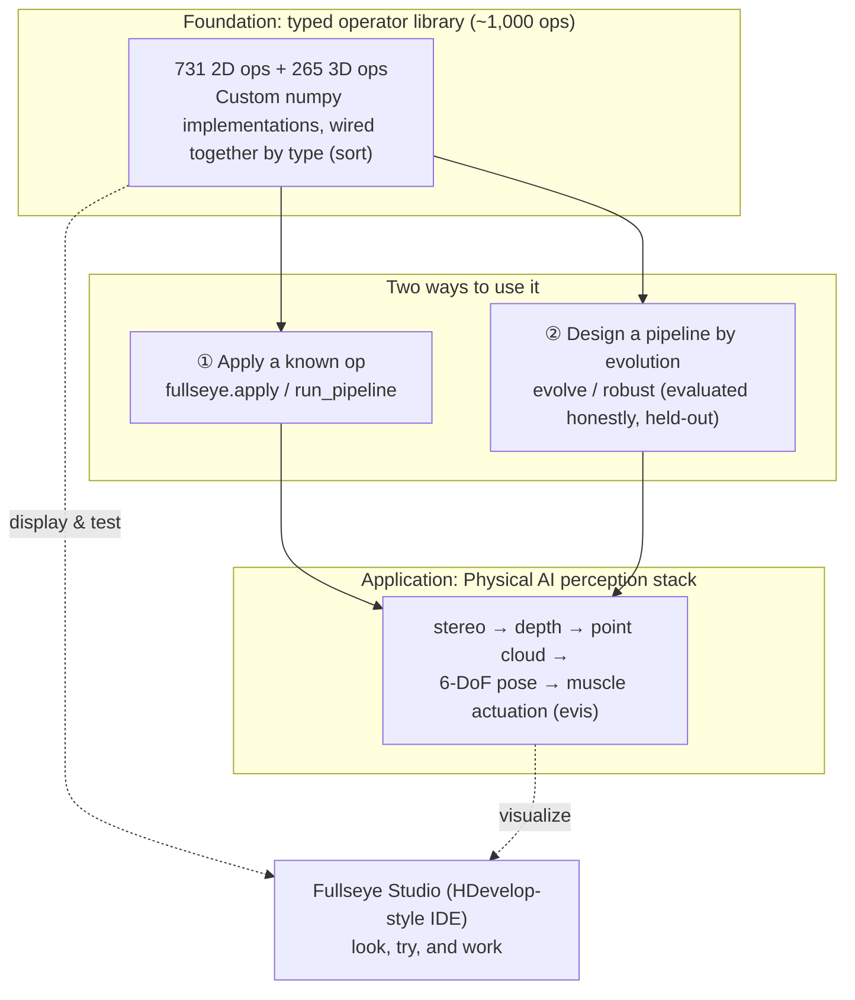
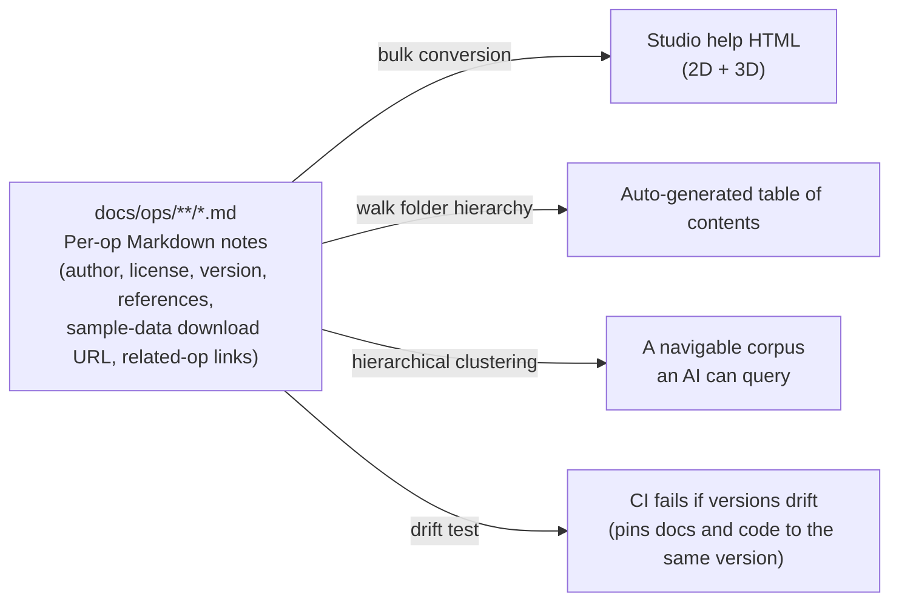

# Carrying ~1,000 Explainable Classical Vision Algorithms as "Skills" — Building Fullseye, a Self-Made Vision Workshop for Physical AI

> Japanese original: [fullseye_overview_qiita_ja.md](https://github.com/furuse-kazufumi/fullseye/blob/master/docs/articles/fullseye_overview_qiita_ja.md)


This is a real point cloud of asteroid **25143 Itokawa** — the Gaskell shape model built from Hayabusa spacecraft observations, published in the JAXA DARTS archive — spinning inside the custom 3D renderer that is the star of this article, **Fullseye**. Loading the point cloud, rendering it, the rock material, the shadows — **all of it is hand-written numpy, no external rendering library**. This is the story of how I built that "eye."

## TL;DR

- **Fullseye** (a pun on "Bullseye" — hitting dead center on a target) is a self-built library of classical image-processing and geometric-vision algorithms: **roughly 1,000 operators, all implemented in numpy from scratch, sitting behind one typed interface**. The goal is to make "explainable vision" — vision whose internals you can actually account for — something you can carry around for **Physical AI** (AI that acts in the physical world with a body, i.e. robots).
- I use **HALCON**, the industrial machine-vision standard, as a "map of coverage." As measured, Fullseye has a matching implementation for **982 of 2,313 HALCON operators (42.5%)** — not a number from memory, but a mechanical tally against an actual scraped operator list.
- On top of the library sit an **evolutionary-design mode** that "designs" algorithms through evolutionary computation, a **Physical AI perception stack** that chains stereo → depth → point cloud → 6-DoF pose, and an **HDevelop-style IDE called Fullseye Studio**.
- **The recommended way to use it is as an AI's RAG knowledge base.** Feed it to Claude Code or similar, and a plain-language request like "detect X in this image" gets you a **pipeline assembled from ~1,000 ops, executed, with results shown right in the Studio window** — that's the workflow this is designed for.
- The undercurrent of this article is **making "honest disclosure" a mechanism**, not a slogan — not cherry-picking good numbers, not hiding failures, spelling out limitations plainly. I include cases where the quality gates actually caught bugs, including **six that I fixed in the course of writing this very article**.
- Tests currently number **6,238**. All heavy dependencies (OpenCV, torch, etc.) are optional — **the core runs on nothing but numpy + scipy**.

> This article isn't a victory lap. It's a record of **why I built it this way and where it's still weak**, at a level of detail you could reproduce yourself. Every number here is measured; every limitation is stated plainly.

First, one image. This is output from Fullseye's own 3D renderer (again, hand-written numpy) — an SDF shape baked with ambient occlusion, soft shadows, and ACES tone mapping:

[](https://raw.githubusercontent.com/furuse-kazufumi/fullseye/master/docs/articles/assets/render_beauty_hero.png)

---

## What This Article Is (in Three Lines)

- This is an overview of my personal image-processing library **Fullseye** — a single article covering everything from the design philosophy to how the internals are built.
- It's aimed at anyone working in **machine vision, robot perception, or image processing**, or anyone curious about **how to design a library so it stays maintainable for the long haul**.
- Individual techniques (3D Gaussian splatting, evolutionary computation, musculoskeletal control, etc.) are covered in dedicated articles elsewhere. This one is the **map**.

Expect roughly 20 minutes of reading. It's long, so feel free to jump to whichever section interests you from the table of contents.

---

## Getting Started (Installation, Up Front)

For anyone who wants to try things hands-on while reading, installation first. It's available from the public GitHub repository and from PyPI. Since **the core runs on nothing but numpy + scipy**, I'd recommend installing it bare first and adding extras only when you need them.

```bash
# ① Get it running (core needs only numpy + scipy)
pip install fullseye

# ② Add extras if you want the Studio (IDE) or the heavier ops
pip install "fullseye[gui]"        # PySide6-based IDE only
pip install "fullseye[all]"        # OpenCV / torch / GUI / video, everything

# ③ Launch Studio
fullseye-studio
```

And **the way I'd most recommend using it is as a RAG (retrieval-augmented generation) knowledge base for an AI coding assistant like Claude Code**. A bundled setup script installs the skill in one command:

```bash
fullseye-rag              # register the op catalog as a Claude Code skill
fullseye-rag --uninstall  # remove it cleanly
```

With that in place, you can just say "detect the scratches in this image" to the AI, and it will assemble and run an appropriate pipeline out of ~1,000 ops (more on what it can and can't do in the RAG section below). If you haven't tried Claude Code yet, starting from [this referral link](https://claude.ai/referral/0sqPw8E_lw) helps fund my development budget a little — full disclosure, it's a referral link.

If you'd rather install from source (useful if you want the full corpus of ~1,000 op-docs for your RAG setup):

```bash
git clone https://github.com/furuse-kazufumi/fullseye && cd fullseye
pip install -e ".[all]"
py -3.11 tools/update_fullseye.py --check   # use the safe updater for subsequent updates
```

The updater is built to **never trash your environment** — it refuses to run if there are uncommitted changes, only ever does `--ff-only` merges, backs up the RAG skill before updating, and never touches your Studio settings. Full usage details live in the repo's `README.md`, `docs/AI_RAG_GUIDE.md` (RAG setup), and `docs/STUDIO_GUIDE.md` (IDE guide).

**A quick link set for anyone who wants the big picture first** (all readable directly on GitHub):

| What you want | Link |
|---|---|
| The full **help index** for ~1,000 ops (2D / 3D) | [docs/ops/INDEX.md](https://github.com/furuse-kazufumi/fullseye/blob/master/docs/ops/INDEX.md) |
| A **one-page catalog** of every op, with type contracts | [docs/OP_CATALOG.md](https://github.com/furuse-kazufumi/fullseye/blob/master/docs/OP_CATALOG.md) |
| A **results gallery** (full-size versions of this article's figures, with commentary) | [docs/GALLERY.md](https://github.com/furuse-kazufumi/fullseye/blob/master/docs/GALLERY.md) |
| A **catalog of where to get sample data**, with real download URLs and licenses | [docs/ops/SAMPLES.md](https://github.com/furuse-kazufumi/fullseye/blob/master/docs/ops/SAMPLES.md) |

---

## Four Words First (A Minimal Glossary)

Just four terms up front. **Every other term gets broken down inline the first time it appears**, so there's nothing else to memorize.

| Term | In short |
|---|---|
| **Fullseye** | The star of this article. A self-built library of image-processing and geometric-vision operators. The name is **a pun on Bullseye** — hitting dead center on a target (details in "The Name," below). The development repo is called `imgevolve`. |
| **Operator (op)** | "One image-processing function." Gaussian blur, Otsu thresholding, a Sobel edge filter — that kind of thing. Fullseye has roughly 1,000 of them. |
| **HALCON** | The industrial machine-vision standard from Germany's MVTec. A giant with **2,313 operators**. I use it as the **yardstick** for how much of that ground Fullseye covers with its own implementations. |
| **Studio (Fullseye Studio)** | The IDE (integrated development environment) for **looking at, trying out, and actually working with** Fullseye. The equivalent of HDevelop in industrial vision. |

---

## The Name — Fullseye = Bullseye + Eye

The name's origin, first. **Fullseye** is a pun on **Bullseye** — the dead center of a target in archery or darts, and by extension "spot on, a direct hit." The pronunciation leans into that too: "full's eye."

There's a triple meaning packed in:

- **Full (everything) + eye**: "**an eye that can see everything**." The goal itself — holding every kind of image processing and geometric vision as a "skill," all of it, in one place.
- **The precision of hitting Bullseye's dead center**. The implication that this should be an eye that's **explainable and doesn't miss** — the standard demanded of industrial inspection and robot perception.
- And a personal echo: my own surname, **Furuse**, plus **eye** — "Furuse's eye." As a solo project, I've woven myself into the name.

From a name that described the *means* — "designing by evolution" (`imgevolve`) — to a name that describes the *goal* — "an eye that hits its target" (`Fullseye`). The change in name itself mirrors the project's change in direction.

---

## Why I Built This — From "Designing by Evolution" to "An Explainable Eye"

Fullseye has a predecessor. It started life as **`imgevolve`** — an experiment in **automatically designing image-processing pipelines with evolutionary computation**. The idea: let a genetic algorithm search for "the processing sequence that maximizes this metric on this data."

The turning point was when I **redefined the direction**. To "search" via evolution, you first need the search's building blocks — the ops — to be **abundant, consistently typed, and honestly evaluated**. As I kept assembling those building blocks, I realized: **the component library itself was the real star.**

Then, in August 2026, I redefined Fullseye's mission as follows:

> **Hold every kind of image-processing and vision algorithm as a "skill," ready to use, in one comprehensive library. Build an explainable, robot-purposed "private HALCON."**

That redefinition was a big call for me. I'd been stacking general-purpose algorithms (sorting, compression, and the like) into the library, and I cut that — "that's not the right lane for this" — and decided to **concentrate entirely on image and geometric vision**. Deciding **what not to build** turned out to be the single most effective decision.

Behind this is **evis**, the musculoskeletal humanoid (a 700-muscle model, among others) I've been building in a separate series of articles — Fullseye's **first customer**. Getting a robot to pick up a bean with chopsticks, or to walk, requires **an eye that sees the world correctly**.


*↑ That "hand," seen from Fullseye's side. A procedurally generated hand skeleton (8 carpal bones, 5 metacarpals, 14 phalanges), rendered with the same custom renderer.*

Deep-learning vision is powerful, but when it **can't explain why it decided on a given pose**, it's hard to trust it with decisions that affect a body's safety. That's why I want **explainable classical vision, held as skills, entirely under my own hands** — that's the core of Fullseye.

---

## The Big Picture — Fullseye Has Three Layers



- **Layer 1: the typed operator library** — the foundation, roughly 1,000 ops connected by **type** (I call these "sorts" — the kind of data: image, region, feature, contour, volume).
- **Layer 2: two ways to use it** — most of the time you just **apply a known op** (`apply` / `run_pipeline`). Only when a single op can't solve the problem do you **design a pipeline via evolutionary computation** (`evolve` / `robust`).
- **Layer 3: the Physical AI perception stack** — the components that turn frames into geometry and objects. The toolkit a robot needs to **see, measure, and act**.
- And running across all of it, **Fullseye Studio** — an IDE, equivalent to HDevelop in industrial vision, for grasping, testing, and actually using the functionality.

Let's dig into each layer.

---

## Layer 1: A Ready-to-Use Operator Library (~1,000 Ops)

### What Is an Op? (In Three Passes)

1. **One-liner**: an op is "a single function that takes an image in and gets back an image (or a region, or a number)."
2. **A bit more**: in Fullseye, ops carry a **type (sort)**. "Image → region" (e.g. thresholding), "region → number" (e.g. counting objects) — **the input and output types are fixed**. That means you can **chain ops together like beads on a string** as long as the types line up.
3. **Precisely**: every op can be called through one unified signature, `apply(image, name, a=0.5, b=0.5)`. `a` and `b` are two dials in `[0, 1]`. Feature ops return a Python float, contour ops return a dict — a **type contract that every op honors**.

```python
import fullseye, numpy as np

frame = np.asarray(img, np.float64)              # H×W grayscale image [0,1]
edges = fullseye.apply(frame, "sobel_amp")       # image -> image (edge magnitude)
seg   = fullseye.apply(frame, "otsu")            # image -> region (binary {0,1})
n     = fullseye.apply(seg,   "count_obj")       # region -> feature (object count, float)

# Chain ops whose types line up: blur -> edges -> threshold
out = fullseye.run_pipeline(frame, ["gaussian", "sobel_amp", "otsu"])
```

Actual output is worth more than description. Here are some of the usual suspects — edge detection, segmentation, contour measurement — laid out in one montage (all real output from the `apply` / `run_pipeline` calls above):

[](https://raw.githubusercontent.com/furuse-kazufumi/fullseye/master/docs/articles/assets/vision_ops_montage.png)

A detailed breakdown of every panel (which op produced which value) lives in the repo's **[results gallery (docs/GALLERY.md)](https://github.com/furuse-kazufumi/fullseye/blob/master/docs/GALLERY.md)**.

### How Big Is It, Really? (Measured)

- **2D operators: 731** (of 735 registry entries, 731 are distinct by name), across **46 categories**.
- **3D operators: 265** (point clouds, meshes, volumes, SDFs, and more), across **55 categories**.
- Roughly **1,000 total**, covering denoising / smoothing / sharpening / thresholding & segmentation / morphology / edge, corner, and blob detection / distance transforms / color spaces / texture and shape features / contours / 3D geometry.

### The Yardstick Is HALCON (42.5%, Measured)

To avoid claiming "coverage" subjectively, I use the industrial-vision giant **HALCON** as a yardstick. Against **2,313 operators** scraped from HALCON's official documentation, every Fullseye op that corresponds to a real HALCON operator is tagged, and the tally is done mechanically.

> **imgevolve maps to 982 / 2313 HALCON operators (42.5%)** — not a figure from memory, but a measurement against an actual scraped list.

To be honest, that's **still under half**. Chapters like Tuple handling, System, Classification, and OCR are almost entirely untouched (they sit outside the core of image processing, so I've deprioritized them). Matching, Morphology, Filtering, and geometric measurement, on the other hand, are well filled in. The point of this number isn't the percentage itself — it's that **I keep a per-chapter table open, showing exactly what's filled in and what's empty, all the time.**

### Making Docs a Single Source of Truth (md = SoT)

With ~1,000 ops, **help text isn't optional — without it, the library is unusable**. But maintaining help HTML and AI-facing descriptions as two separate things guarantees one of them will rot. So the approach I took was **making Markdown the single source of truth (SoT)**.



- **A Markdown note per op** (roughly 1,000 of them) is the source of truth. Frontmatter carries **author, license (Apache-2.0), library version, references, a real sample-data download URL, and links to related ops**.
- From there, **Studio's help HTML is generated in bulk** (2D and 3D go through the same pipeline). **There is no dual maintenance.**
- **The table of contents is generated by walking the folder hierarchy.** Zero hand-written indices.
- **Version pinning** matters more than it sounds. Image processing is the kind of domain where a tiny spec change changes results outright. So CI runs a **drift test that compares "the committed notes" against "notes freshly regenerated from the current registry," with no side effects** — if an op's behavior changes, its note falls out of sync and the test fails, which **pins the docs and the code to the same version**.

This move to "md as source of truth" was actually finished during **the very work of writing this overview article** — related-op links, references (Tomasi & Manduchi 1998, Serra 1982, Sobel & Feldman 1968, and so on — **real classical papers, cited accurately, no fabricated DOIs**), and real sample-data URLs, all brought into a shape meant to **stay maintainable for years**.

---

## Layer 2: Designing Pipelines by Evolution (with Honest Evaluation)

Only when a single op can't solve the problem — "I want to find the processing sequence that maximizes this metric on this data" — does **evolutionary computation** come in.

```bash
py -3.11 baseline.py --problem denoise --workdir out/mine     # measure an honest floor first
py -3.11 evolve.py   --problem denoise --workdir out/mine --gens 40 --pop 24
py -3.11 robust.py   --problem denoise --workdir out/mine --seeds 5
```

The thing I care most about here is **honesty in evaluation**.

- **Fitness is measured only on the training split.**
- **The held-out split is tracked, but never used for selection.**

This keeps the generalization performance I report from being "overfit to the evaluation set" — it stays an **honest number**. "When results look too good, doubt the breakdown before feeling like you've won" is a house rule across my whole development practice, not just here.

---

## Layer 3: The Physical AI Perception Stack (a Robot's Eyes)

The components that turn frames into **geometry and objects**. A toolbox for a robot to see, measure, and act.

```python
import fullseye as fs
disp  = fs.disparity_map(left, right, max_disp=16)          # stereo disparity
Z     = fs.depth_from_disparity(disp, focal=f, baseline=B)  # depth  Z = f*B/d
pts   = fs.reproject_to_points(Z, fx=f, fy=f)               # point cloud (N,3)
grid,_= fs.elevation_map(world_pts, cell=0.05)              # 2.5D elevation map
ok    = fs.traversability(grid, cell=0.05, max_step=0.1)    # foothold/obstacle mask
objs  = fs.segment_objects(frame, threshold="otsu")        # per-object geometry + descriptors
```

This layer also includes a **full sensor-simulation suite**. Without owning any actual hardware, you can synthesize the output of **pseudo-LiDAR, stereo cameras, event cameras (DVS), photometric stereo, TSDF fusion, polarization cameras, and focus stacking** from a synthetic scene, and develop and validate a perception pipeline **without hardware in the loop** — a practice ground for Physical AI development. Every image below is real output from Fullseye's own ops:

[](https://raw.githubusercontent.com/furuse-kazufumi/fullseye/master/docs/articles/assets/physical_ai_montage.png)

Panel-by-panel explanations, and other results (3D rendering, mesh processing, turntable GIFs, etc.) live in the **[results gallery (docs/GALLERY.md)](https://github.com/furuse-kazufumi/fullseye/blob/master/docs/GALLERY.md)**.

One of these, the **event camera (DVS)** — a sensor that asynchronously emits nothing but per-pixel brightness changes — is easiest to appreciate in motion. As the camera pans, ON events (cyan) and OFF events (magenta) stream along the edges:


A smoother **mp4 version**, along with turntable videos including the Itokawa one, live in the repo's [docs/articles/assets/media/](https://github.com/furuse-kazufumi/fullseye/tree/master/docs/articles/assets/media) (playable directly on GitHub).

### How Far the 3D Stack Goes Custom-Built (the Biggest Differentiator)

I think Fullseye's differentiation shows up most in the **3D side**. Running actual 3D ops on the same real Itokawa point cloud from the opening GIF gives you this:

[](https://raw.githubusercontent.com/furuse-kazufumi/fullseye/master/docs/articles/assets/itokawa_montage.png)

On a real point cloud of 3,000 points: **curvature analysis** (neighborhood-curvature correlation r=0.87 — evidence this is a real surface), **ICP self-registration** (recovering an unknown 30° rotation plus noise down to 0.027° rotation error), **PCA canonical pose** (fully recovering the principal axes after an unknown 50° rotation). All of these are measured values, run live for this article.

3D ops currently number 265. Spanning point clouds, meshes, volumes, and SDFs, the library covers **3D feature descriptors** like SHOT, FPFH, and spin images, **TSDF fusion**, **fringe projection**, **photometric stereo**, **superquadric fitting**, **medial axis**, **geodesic distance**, **visual hull**, and **QEM mesh simplification** (boundary-preserving, strictly manifold). A few concrete examples:


*↑ 3D watershed segmentation — splitting two touching objects along the "valley" of the distance transform. This is the tool for that classic bin-picking situation where parts overlap.*


*↑ A measured comparison of QEM mesh simplification. It decimates while continuously checking, with actual measurements, that boundaries are preserved and manifoldness isn't broken — this op is also where Bug 6, below, plays out.*


*↑ An anatomical hand-bone mesh (derived from the MS-Human-700 musculoskeletal model), voxelized into a synthetic CT volume, meshed via marching cubes, and spun like a skeleton specimen. Volume → mesh → render, entirely in one pipeline.* Individual algorithms like these are scattered across PCL (C++) and Open3D, but **one library covering this range as "pure numpy, typed, with a machine-readable note for every op" is not something I've seen much of.** The goal is for the same feel to carry you from industrial fringe-projection measurement all the way to a robot's grasp pose.

The **3D data to try this on is available free from public sources.** The usual suspects:

- **[Stanford 3D Scanning Repository](https://graphics.stanford.edu/data/3Dscanrep/)** — bunny, dragon, armadillo. The "Lenna" images of 3D processing.
- **[JAXA DARTS Hayabusa archive](https://data.darts.isas.jaxa.jp/pub/hayabusa/shape/gaskell/)** — the source of this article's Itokawa shape model ([the PDS-side documentation is here](https://sbn.psi.edu/pds/resource/itokawashape.html)).
- **[NASA 3D Resources](https://nasa3d.arc.nasa.gov/)** — 3D models of spacecraft, terrain, and other space-related subjects.
- **[The Cancer Imaging Archive (TCIA)](https://www.cancerimagingarchive.net/)** — research-grade CT/MRI **DICOM volumes** (real data for the volume sort).
- **Robot models** are also freely available: **[MuJoCo Menagerie](https://github.com/google-deepmind/mujoco_menagerie)** (high-quality MJCF for real robots), **[MyoSuite](https://github.com/MyoHub/myosuite)** (musculoskeletal models), **[LocoMuJoCo](https://github.com/robfiras/loco-mujoco)** (locomotion benchmark environments).

A curated list of licenses and direct download URLs lives in the repo's [docs/ops/SAMPLES.md](https://github.com/furuse-kazufumi/fullseye/blob/master/docs/ops/SAMPLES.md), and anything fetchable with a one-liner like `sample_data.download('bunny', yes=True)` is also registered in code (fail-closed by design — it errors explicitly rather than fetching anything on its own if you haven't asked for it).

This layer's first customer is **evis**, the musculoskeletal humanoid. Its vision pipeline runs **stereo → depth → point cloud → segmentation → 6-DoF pose → motion planning → realization through 700 muscles**. This layer supplies the "eyes" for tasks like getting a robot to use chopsticks or to walk.

What I care about here is **not reinventing OSS**. Standards like PCL, OpenCV, and MoveIt2 are used as **a map of fidelity and coverage, plus a thin adapter** — hidden behind the **unified interface**, so the caller never has to care whether the implementation underneath is hand-written numpy or an OSS wrapper. Either way, it's called the same way.

---

## Fullseye Studio — an IDE for Looking, Trying, and Working

Having the algorithms isn't enough on its own. You need a layer for **"seeing it and confirming it works."** That's **Fullseye Studio**. Its positioning:

> **A fusion of HDevelop (the 2D-image IDE from industrial vision) and RViz2 (the robotics visualization tool for point clouds, depth, 6-DoF pose axes, and terrain layers).**

- On the left, an **operator/sample list**; in the center, **code editing plus parameter sliders**; on the right, a **drawing pane**. Pick a sample, code appears, hit Run for instant rendering, drag a slider for instant re-rendering.
- Every one of the ~1,000 ops has a **generated help page**, and **both 2D and 3D** pull from the same help dictionary (unified during the work on this overview article).
- Hovering over an image shows **pixel coordinates and values**, and detected regions can be **overlaid on the input image** — HDevelop-style "inspection" conventions carried over into Studio.
- And a **Python Editor** (a Qt-Creator-style edit-and-run environment). Previously, sample code could only be **read, or called as a pipeline**; now you can open a gallery's worked example **in an editable editor, modify it, and run it instantly with F5** (syntax highlighting, line numbers, and a run console included; execution runs in a subprocess, so the UI never freezes). Just like HDevelop's "main script plus sub-scripts," you can **open and edit multiple scripts in tabs at once**, and samples can be opened as **any number of independent MDI windows side by side**, so you can copy fragments while you write. The goal is to let the **staircase from learning to real work — "run the sample as-is, then tweak it toward your own problem" — happen entirely inside Studio** (added during work on this overview article).
- I also added **debugger-level execution control and variable watching**. You can pause at a breakpoint, **resume from the current line (Continue)**, or **restart from any given line (Run from here)**. Variables can be **right-clicked to pop up an inspection view**, and **watch expressions** (arbitrary expressions like `v.mean()` or `np.percentile(v, 99)`) get **automatically re-evaluated against the selected variable every time the pipeline changes**.
- **Multiple drawing windows can be controlled from a script.** Following HDevelop's convention, `dev_open_window(row, col, width, height)` in your program opens and places a window, `dev_set_window` switches between them, and `dev_set_window_extents` moves one. In real image-processing work, laying input, intermediate, and result images out in separate windows is an everyday need, so I made that reproducible from code (a configurable cap prevents opening too many, default 256).

---

## Design Philosophy (Four Pillars)

The backbone that keeps Fullseye from becoming "just a pile of functions."

1. **Honest by construction**
   Held-out data is never used for selection. Coverage and benchmarks are **measured, never merely claimed**. Limitations are **disclosed, not hidden**. When a result looks too good, I doubt the breakdown.
2. **A unified interface**
   Whether the implementation underneath is hand-written or an OSS wrapper, **the caller uses the same naming and signature conventions**. And it should be **an API that reads naturally when a human writes it** — something like `fs.stereo.SGM(num_disparities=128).compute(l, r)`, readable and completion-friendly (with any mechanical string dispatch hidden behind it). This is something I specifically cared about.
3. **Every heavy dependency is optional**
   **The core runs on nothing but numpy + scipy.** OpenCV, scikit-image, torch, and GPU support are all opt-in; without them, the affected ops just quietly disable themselves (graceful degradation).
4. **Reimplemented from public knowledge**
   Everything is implemented from **public knowledge — papers, OSS, and the like**. Nothing is derived from any specific commercial product. That line is drawn clearly.

---

## Letting AI Do Image Processing — Using Fullseye as a RAG Knowledge Base

This is Fullseye's hidden advantage. As mentioned earlier, each of the ~1,000 ops carries a **Markdown note** (usage, type contract, related ops, references), and the algorithms themselves are **classical, explainable ones by design**. Put those two together, and the library works out of the box as a **RAG (retrieval-augmented generation) knowledge base for AI coding assistants like Claude Code**.

Broken down in three passes:

1. **One-liner**: ask an AI to "detect X in this image," and it **retrieves** Fullseye's op documentation, composes a pipeline out of matching ops, **writes and runs it**.
2. **A bit more**: because the AI can read an op's **type (sort)**, it can pick ops in an order where the types actually connect — "image → region → feature" — and it can follow related-op links to suggest alternatives. Unlike a deep-learning black box that's one opaque function, **each stage is explainable and its intermediate output can be inspected**, so when the AI gets something wrong, **you can see exactly where it went off track**.
3. **Why it works**: the documentation is a machine-readable single source of truth (md = SoT), and the ops are deterministic, typed, and contract-tested. That combination makes it **a parts bin that's easy for an AI to retrieve from, easy to compose with, and easy to verify.** A human trying things in Studio and an AI composing a pipeline via RAG are both working from **the same ops and the same documentation**.

In other words, Fullseye is a "library for humans to use" and, at the same time, **"a foundation for letting an AI do image processing freely."** Assembling explainable classical vision as a set of skills turns out to translate directly into how well it works with AI.

And this RAG-based mode is **the workflow I actually recommend**. Pair it with Studio, and an AI agent (Claude Code, say) can put the results of the pipeline it assembled **right in front of a human, in an image window or a 3D view** — it doesn't have to stay closed inside code and conversation; a human can inspect "what the AI is looking at" on the same screen. The position I'm aiming for is **an integrated environment for Physical AI (robot perception)**.

Concretely: open Studio next to Claude Code and ask it, "count the parts in this bin and give me a graspable pose for each." The AI retrieves the relevant op notes, writes and runs a segmentation-then-6-DoF-pose-estimation pipeline, and the results show up in Studio's image window and 3D view. The human looks at the screen and, if something's off, asks for a redo in plain language. **The workflow this is designed for is image processing that runs entirely on conversation and a screen** — all the pieces introduced in this article (~1,000 ops, type contracts, machine-readable notes, and Studio's rendering layer) are what make it possible.

For what it's worth, this development itself is done in partnership with Claude Code. If you'd like to try it, starting from [the author's referral link](https://claude.ai/referral/0sqPw8E_lw) helps this project's continued development a little (full disclosure: it's a referral link).

One more thing I've kept in mind is **academic use**. Every op carries a machine-readable note with real references (md = SoT), each version is pinned to code with a fingerprint, and evaluation is done honestly with held-out data — meaning it's built from the start to be **citable and reproducible**. The repo includes a `CITATION.cff`, and every reference cites a real classical work, never a fabricated DOI. If this ends up used and cited as a research tool, that would make me genuinely happy — that's the design intent.

---

## Building "Honesty" Into the System — Bugs It Actually Caught

Throughout this project I've placed what I call **honest gates** — checkpoints where an expected behavior has to be verified numerically before it's accepted. And whether they're actually working should be judged by **the bugs they've caught**.

**In the course of preparing this overview article alone, the quality checks caught six confirmed bugs.** I'm reporting them without hiding anything. The first two came from ways a test could be technically passing but still wrong; the last four came from **having AI perform an adversarial code review, then manually verifying each finding against first principles before acting on it** — each one taught a lesson.

### Bug 1: The Hessian in 3D topographic classification was asymmetric

An op that classifies terrain bumps into "peak, valley, ridge, saddle" was pulling the **cross term of the Hessian matrix** from the **wrong axis** of `np.gradient`. `np.gradient` returns values in `[∂/∂y, ∂/∂x]` order, but the code was picking up ∂²/∂y² (a duplicate of a different term) where it meant to compute the cross term ∂²/∂x∂y.

- **Impact**: for structure diagonal to the axes, eigenvalues would be cut in half or flip sign, causing misclassification.
- **How I confirmed it (reproducible)**: a correct classification should be **invariant under transpose** (an image and its transpose shouldn't swap "peak" and "valley"). Measured: the old code misclassified **46 out of 576 pixels** on a 24×24 diagonal structure; the fixed version is **perfectly transpose-symmetric**.
- **Fix**: pull the cross term from the correct axis, and **pin transpose symmetry as a regression test**.

### Bug 2: Studio's op-help dropdown was broken for every op

While unifying op help lookup across 2D and 3D, a `(dimension, name)` tuple was being **unpacked directly into `display_fn(name, dimension)`** — the argument order was reversed. Since both are strings, **it never raised an error** — instead, every op you selected showed an empty card, a **user-visible bug**.

- **Why the test missed it**: the existing test called the display function **directly, with the correct argument order**, and never exercised the actual dropdown interaction (via its signal).
- **Fix**: corrected the argument order, and added a **regression test that reproduces the actual dropdown interaction**. Since "the same bug tends to recur in similar spots," I also **audited every other dispatch site for the same class of argument-order mistake** (confirmed none elsewhere).

### Bug 3: PCA pose estimation silently returned "do-nothing rotation" about half the time

An op that aligns a point cloud's principal axes to estimate its pose (rotation) wasn't accounting for the **handedness (right- or left-handed) of the frame** returned by eigendecomposition (`eigh`). Mathematically, in the configuration used to build sign candidates, the determinant of the candidate matrix came out **identically +1** — so whenever a left-handed frame was drawn, all four candidates got **rejected**, and the code **silently fell back to the identity rotation (i.e. doing nothing), with no error and no warning**.

- **Measured**: across 200 trials of random point clouds and rotations, **92 (46%)** returned the identity rotation. After the fix: **200/200** recovered to machine precision (around 1e-15).
- **Why the test missed it**: the existing test's random seed happened to land on the "lucky 54%" side. **Passing with one seed doesn't mean it's not broken for half the inputs.**
- **Fix**: canonicalize the frame to right-handed immediately after decomposition. The regression test now **sweeps 40 random trials**, guaranteeing it hits both handednesses.

### Bug 4: Curvature's "absolute value" was off by a factor of 32 (only the ratio was correct)

An op computing surface curvedness was mixing a **gradient filter with a gain of 32** (a deliberate convention, correctly compensated for by dividing by 32 elsewhere) with an **already-normalized Hessian**. The shape classification (shape index), which is a **ratio**, came out correctly, but the **absolute value alone was off by 1/32** — a sphere of radius R should have curvature 1/R, but it was coming out as 1/(32R).

- **How I found it**: I checked the **absolute value** on a synthetic sphere of known radius — measured 0.0022 versus a true value of 0.0714, exactly a **32.2× discrepancy** (matching the gain's origin, 2×4×4=32).
- **Lesson**: the "ratio test" had been passing all along. Some bugs are **only caught by validating absolute values against ground truth, not just ratios**. After the fix, c·R = 1.004 on the measured spherical shell, and the regression test now pins the **absolute value**.

Bugs 3 and 4 came from a different path than 1 and 2: **having AI perform an adversarial code review, then never taking its findings at face value — manually reproducing them numerically first, and only then acting.** AI review findings are often wrong, so I always insert a gate: **"finding → reproduce it myself → only then adopt it."**

A **second, pre-publication pass** in the same spirit caught two more confirmed bugs. **Bug 5: point-cloud normal viewpoint sign was reversed** (in a single-viewpoint scan — literally the intended use case for the `viewpoint` argument — every point's normal was flipped. The existing test absorbed the sign with `abs()`, the same kind of "test that hides a coin flip" as Bug 3). **Bug 6: mesh-simplification boundary preservation broke down at high compression ratios** (an ill-conditioned quadric solve placed a solution several edge-lengths away from where it should be, and the "boundary-preserving" rim collapsed. Fixed by hardening the outlier-position guard and pinning the breaking condition itself as a regression test). What both have in common isn't that the old tests were "lucky" — it's that they were replaced with tests that check **signed values, absolute values, and the exact conditions that break**, instead of tests that merely happen to pass.

These six bugs are the kind of thing **that would never make it into an article that only shows good results**. But I think they're exactly the kind of thing worth keeping — **proof that the quality assurance here is actually doing its job.**

---

## An Honest Word on Performance (GPU)

Being honest about "fast," too. The default per-frame path runs on scipy/OpenCV. A batched, faster `torch` path (`--device cuda`) accelerates the heavy, vectorizable ops.

- **On CPU**, heavy ops see roughly **1.6–2.2×**. But **light pixel-wise operations actually get slower** (the overhead of the tensor conversion outweighs the gain).
- **The real payoff is on GPU**, where that overhead gets amortized over much greater parallelism.

I won't claim "everything gets faster." Writing down **where it helps and where it costs you** is what honest disclosure means here.

---

## Limitations and What's Next (No Hiding)

- **HALCON coverage is still 42.5%.** OCR, Classification, and System-level chapters are nearly untouched. I'm not changing the strategy of thickening the image/geometry core, but "under half" is the fact of the matter.
- **The unified API is still mid-migration.** Historical conventions differ across the image registry, the algorithms, and the perception facade, and I'm **gradually migrating them** toward the Qt-style natural API.
- **GPU work is still mid-way on the main effort.** I'm building toward a per-op GPU-resident pipeline (end to end), but real throughput numbers are gated on real hardware (an RTX 5090). **Never present CPU numbers as if they were GPU numbers** — that's the discipline here.
- **3D visualization inside Studio** is also still being grown, mainly around integration with existing viewers (Open3D, RViz2).

There's a lot left to do, but **the foundation — typed ops, honest evaluation, docs with md as the source of truth, and 6,238 tests — is solid.** From here, the work is extending coverage and the natural API.

---

## Summary

**Fullseye** is a numpy-native, self-built library that carries roughly **1,000 explainable classical vision algorithms as "skills,"** and lets you choose, behind one typed interface, whether to

- **use them directly (apply / pipeline)**,
- **design with them via evolution (evolve, with honest evaluation)**, or
- **use them as a robot's eyes (the Physical AI perception stack)**.

**42.5% coverage against HALCON as a yardstick (measured)**, **6,238 tests**, a documentation system with **Markdown as its single source of truth**, and an **HDevelop-style Studio**. Every heavy dependency is optional, and **the core runs on nothing but numpy + scipy**.

The thing I most want to convey isn't the scale or the coverage number — it's the practice of **making honesty a mechanism**. Held-out data never gets used for selection. Coverage gets disclosed as measured fact. **When a bug is found, the whole quality-assurance apparatus that found it gets written up too.** More than flashiness, I've been steadily building toward something whose internals are **explainable, reproducible, and maintainable for the long haul.**

If this made you want to try it, installation is about five minutes away in the "[Getting Started](#getting-started-installation-up-front)" section near the top. The most rewarding way to use it is the combination of **Claude Code + `fullseye-rag`** (turning it into an AI's toolbox). If you haven't set up Claude Code yet, [the author's referral link](https://claude.ai/referral/0sqPw8E_lw) is there if you'd like to start.

---

## To Be Continued

This article was a map. Next, I want to walk some of its terrain. Candidates:

- **What happens when you add one op** — the machinery by which the registry, evolution, code generation, and documentation all follow automatically.
- **How to push HALCON coverage past 42.5%** — a build log of closing uncovered operators one by one through the honest gate.
- **Physical AI's eyes** — evis's vision pipeline end to end, from stereo all the way through 6-DoF pose to "picking something up" with 700 muscles.

Thanks for reading. If there's a part you'd like to see explored further, that'll be the next article.
