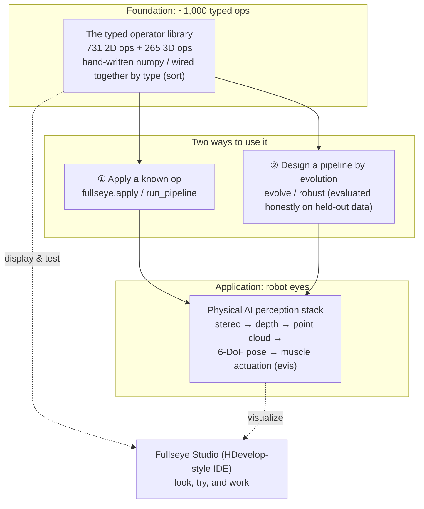
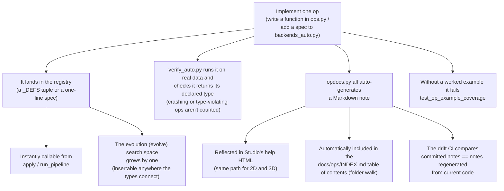
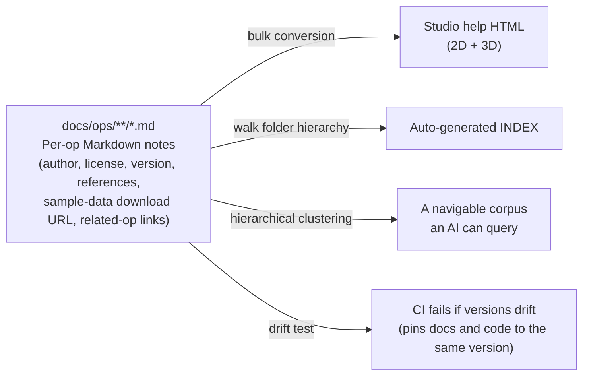

# Carrying ~1,000 Explainable Classical Vision Algorithms as "Skills" — Building Fullseye, a Self-Made Vision Workshop for Physical AI

> Japanese original: [fullseye_overview_qiita_ja.md](https://github.com/furuse-kazufumi/fullseye/blob/master/docs/articles/fullseye_overview_qiita_ja.md)


This is a real point cloud of asteroid **25143 Itokawa** — the Gaskell shape model built from Hayabusa spacecraft observations, published in the JAXA DARTS archive — spinning inside the custom 3D renderer of this article's protagonist, **Fullseye**. Loading the point cloud, rendering it, the rock material, the shadows — **all of it is hand-written numpy**. This is the story of how I've been building that "eye."

## TL;DR

- **Fullseye** (a pun on "Bullseye" — the dead center of a target) is a self-built library of classical image-processing and geometric-vision algorithms: **roughly 1,000 operators, implemented from scratch in numpy, sitting behind one typed interface**. The goal is to make "explainable vision" — vision whose internals you can actually account for — something you can carry around as the eyes of **Physical AI** (AI that acts in the physical world with a body, i.e. robots).
- I use **HALCON**, the industrial machine-vision standard, as a "map of coverage." As measured, Fullseye has a self-built counterpart for **982 of 2,313 HALCON operators (42.5%)** — not a number from memory, but a mechanical tally against the operator list from the official reference.
- On top of the library sit an **evolutionary mode that "designs" algorithms through evolutionary computation**, a **Physical AI perception stack** that chains stereo → depth → point cloud → 6-DoF pose, and an **HDevelop-style IDE, Fullseye Studio**.
- **The single most recommended way to use it is as an AI's RAG knowledge base.** Feed it to Claude Code or similar, and a plain conversational request like "detect X in this image" gets you a **pipeline assembled from ~1,000 ops, executed, with the results appearing on Studio's screen** — that's the foundation this is designed to be.
- The undercurrent of this article is **making "honest disclosure" a mechanism** — never showing only the good numbers, never erasing failures, always stating the limitations. I include cases where the quality gates actually caught bugs, **including six I fixed just now**, exactly as they happened.
- Tests currently number **6,238**. Every deep dependency (OpenCV, torch, etc.) is optional — **the core runs on nothing but numpy + scipy**.

> This article isn't a victory lap over something finished. It's a record of **why I shaped it this way and where it's still weak**, at a granularity you could reproduce yourself. Every number is measured; no limitation is hidden.

First, one image. This is output from Fullseye's 3D renderer (hand-written numpy, of course) — an SDF-built shape baked with ambient occlusion, soft shadows, and ACES tone mapping:

<!-- Post-publication check: the raw URL must return HTTP 200. Images are lightweight thumbnails that click through to full size (to keep the article's memory footprint down) -->
[](https://raw.githubusercontent.com/furuse-kazufumi/fullseye/master/docs/articles/assets/render_beauty_hero.png)

---

## What This Article Is (in Three Lines)

- This is an overview of my personal image-processing library **Fullseye** — a compilation covering everything **from the design philosophy to how the internals are built**.
- It's aimed at anyone working in **machine vision, robot perception, or image processing**, or anyone curious about **how to design a library so it stays maintainable for the long haul**.
- Individual techniques (3D Gaussian splatting, evolutionary computation, musculoskeletal control, etc.) are covered in depth in separate articles. This one is the **map**.

Expect roughly 20 minutes of reading. It's long, so feel free to jump from the table of contents to whichever layer interests you.

### Sorting the Claims by Maturity, Up Front

This is a long article, so let me sort **which claims sit at which stage** before we start. The same Status labels appear at the top of the relevant chapters.

| Tier | Status label | What it covers in this article |
|---|---|---|
| **Implemented & reproducible** | `Production-ready / Verified` | The 731 2-D + 265 3-D ops, type contracts and the unified interface, Studio, the PyPI release, 6,238 tests, the machine-tallied 982/2,313 HALCON mapping, and the real outputs behind every exhibit and demo |
| **Under validation** | `PoC / Research prototype` | Evolutionary pipeline design (hold-out evaluated, bounded settings), natural-language-to-pipeline via RAG, and the Physical AI perception stack (validated in simulation; real hardware and sim-to-real are untouched) |
| **Future vision** | `Roadmap / Design proposal` | A comprehensive op foundation for robots, an AI autonomously selecting and running the ~1,000 ops, and a shared perception base for industrial inspection and Physical AI |

Every number is a real measurement. This sorting is itself one of the mechanisms for not overselling.

---

## Getting Started (Installation, Up Front)

For anyone who wants to try things hands-on while reading, installation first. It's available from the public GitHub repository and from PyPI. Since **the core runs on nothing but numpy + scipy**, I'd recommend installing it bare first and adding extras (the optional dependencies) only when you need them.

```bash
# ① Get it running (core needs only numpy + scipy)
pip install fullseye

# ② Add extras if you want the Studio (IDE) or the heavier ops
pip install "fullseye[gui]"        # PySide6-based IDE only
pip install "fullseye[all]"        # OpenCV / torch / GUI / video, everything

# ③ Launch Studio
fullseye-studio
```

Let me be a bit more concrete about what command ① actually does. `pip install fullseye` pulls in **only numpy and scipy** as dependencies (no OpenCV, no torch, no PySide6). Even in this state, `import fullseye` works and **more than 500 ops are immediately usable**. As the chapters "An Honest Word on Performance (GPU)" and "The Night Before Release" will describe, this claim — "the bare install runs a working minimum" — is itself something **CI executes and verifies on every run**; it isn't a verbal promise. The extras in ② are positioned as an **add-on choice** you reach for when you need them.

And **the single most recommended way to use it is as a RAG (retrieval-augmented generation) knowledge base for an AI coding assistant such as Claude Code**. A bundled setup script installs the skill in one command:

```bash
fullseye-rag              # register the op catalog as a Claude Code skill
fullseye-rag --uninstall  # remove it cleanly
```

With that in place, you can just say "detect the scratches in this image" to the AI, and it will assemble and run an appropriate pipeline out of ~1,000 ops (more on what it can and can't do in the RAG section below). If you haven't tried Claude Code yet, starting from [this referral link](https://claude.ai/referral/0sqPw8E_lw) helps fund the author's development budget (i.e. wallet) a little.

If you'd rather install from source (for anyone who wants the full corpus of ~1,000 op docs for RAG):

```bash
git clone https://github.com/furuse-kazufumi/fullseye && cd fullseye
pip install -e ".[all]"
py -3.11 tools/update_fullseye.py --check   # use the safe updater for subsequent updates
```

The updater is built on a **never-trash-your-environment** policy (it refuses to run if there are uncommitted changes, only ever does `--ff-only`, backs up the RAG skill before updating, and never touches your Studio settings). Full usage details live in the repo's `README.md`, `docs/AI_RAG_GUIDE.md` (RAG setup), and `docs/STUDIO_GUIDE.md` (IDE guide).

The four constraints just listed (refusing uncommitted changes, fast-forward only, back up before updating, hands off Studio settings) are each unglamorous tricks on their own. I still spelled them out side by side because of one self-awareness: **an update script whose job is to grow an AI's foundation can itself become the offender that destroys a human's work.** If the RAG setup script or the Studio setup — tools that are supposed to help development — carelessly wiped unsaved changes or overwrote hand-tuned settings, the whole point would be defeated. The fail-closed designs introduced later in this article are, at bottom, the same idea repeated over and over.

**A quick link set for anyone who wants the big picture first** (all readable directly on GitHub):

| What you want | Link |
|---|---|
| The full **help index** for ~1,000 ops (2D / 3D) | [docs/ops/INDEX.md](https://github.com/furuse-kazufumi/fullseye/blob/master/docs/ops/INDEX.md) |
| A **one-page catalog** of every op, with type contracts | [docs/OP_CATALOG.md](https://github.com/furuse-kazufumi/fullseye/blob/master/docs/OP_CATALOG.md) |
| A **results gallery** (full-size versions of this article's figures, with commentary) | [docs/GALLERY.md](https://github.com/furuse-kazufumi/fullseye/blob/master/docs/GALLERY.md) |
| A **catalog of where to get sample data** (real download URLs and licenses) | [docs/ops/SAMPLES.md](https://github.com/furuse-kazufumi/fullseye/blob/master/docs/ops/SAMPLES.md) |

---

## Four Words First (A Minimal Glossary)

Just the four most frequent terms up front. **Every other term gets broken down inline the first time it appears**, so there's nothing else to memorize.

| Term | In short |
|---|---|
| **Fullseye** | The star of this article. A self-built operator library for image processing and geometric vision. The name is **a pun on Bullseye — the dead center of a target in darts or archery** (details in "The Name," below). The development repo is called `imgevolve`. |
| **Operator (op)** | "One image-processing function." Examples: Gaussian blur, Otsu thresholding, Sobel edges. Fullseye has roughly 1,000 of them. |
| **HALCON** | The industrial machine-vision standard from Germany's MVTec. A giant with **2,313 operators**. Fullseye uses it as the **yardstick** for measuring "how much of this ground have I covered with my own implementations?" |
| **Studio (Fullseye Studio)** | The IDE (integrated development environment) for **looking at, trying out, and doing real work with** Fullseye. The equivalent of HDevelop in industrial vision. |

---

## The Name — Fullseye = Bullseye + Eye

The name's origin, first. **Fullseye** is a pun on **Bullseye** — the dead center of a target in archery or darts, and by extension "spot on, a direct hit." The pronunciation leans into that too: "full's eye."

There's a triple meaning packed in:

- **Full (everything) + eye**: "**an eye that can see everything**." The goal itself — holding every kind of image processing and geometric vision as a "skill," all of it.
- **The precision of hitting Bullseye's dead center**. The implication that this should be an eye that's **explainable and doesn't miss** — the standard demanded by industrial inspection and robot perception.
- And the echo of my own surname, **Furuse**, joined to **eye** — "Furuse's eye." As a solo project, I've woven myself into the name.

From a name that described the *means* — "designing by evolution" (`imgevolve`) — to a name that describes the *goal* — "an eye that hits its target" (Fullseye). The change in name itself mirrors the project's change in direction.

Keeping the development repo named `imgevolve` is, in fact, deliberate. Changing the name doesn't mean I want to erase the accumulation that led here — the assets and lessons from the era when evolutionary computation searched over ops. The public product name switches to Fullseye, while the internal name keeps a trace of the original idea — I think of this, too, as a kind of provenance record.

---

## Why I Built This — From "Designing by Evolution" to "An Explainable Eye"

Fullseye has a predecessor. It started life as **`imgevolve`** — an experiment in **automatically designing image-processing pipelines with evolutionary computation**. The idea: let a genetic algorithm search for "the processing sequence that maximizes this metric on this data."

The turning point was when I **redefined the direction**. To "search" via evolution, you first need the search's building blocks — the ops — to be **abundant, consistently typed, and honestly evaluated**. As I kept assembling those building blocks, I realized: **the component library itself was the real star.**

Then, in August 2026, I redefined Fullseye's mission as follows:

> **Hold every kind of image-processing and vision algorithm as a "skill," ready to use, in one comprehensive library. Build an explainable, robot-purposed "private HALCON."**

That redefinition was a big call for me. I'd been stacking up general-purpose algorithms (sorting, compression, and the like), and I cut that — "that's the wrong lane" — and decided to **concentrate entirely on image and geometric vision**. Deciding **what not to build** turned out to be the single most effective decision.

Behind this is **evis**, the musculoskeletal humanoid (a 700-muscle model, among others) I've been building in a separate series of articles — Fullseye's **customer number one**. Getting a robot to pick up a bean with chopsticks, or to walk, requires **an eye that sees the world correctly**.


*↑ That "hand," seen from Fullseye's side. A procedurally generated hand skeleton (8 carpal bones, 5 metacarpals, 14 phalanges), rendered — again — with the custom renderer.*

Deep-learning vision is powerful, but when it **can't explain why it decided on a given pose**, it's hard to trust it with decisions that affect a body's safety. That's why I want **explainable classical vision, held entirely in hand as a set of skills** — that's the core of Fullseye.

To break it down a bit further, the reasoning goes in this order. Whether a robot is picking up a bean with chopsticks or walking on two legs, nothing starts until it knows "what is in front of me right now, and where." **Seeing (perception) has to come before moving (control)** — obvious as that sounds, there were many moments across the evis experiments where this hit home hard. However clever the motion planner, if the input point cloud is warped or the pose estimate is flipped, everything stacked on top loses its meaning. That's exactly why I decided to build the perception foundation **first, not later, and as an independent library**. A customer named evis raises the requirements, and a supplier named Fullseye answers them — with the same one person wearing both hats. That's the most accurate description of how this actually runs.

Here is that "pick up a bean with chopsticks" experiment, seen through Fullseye's eye (click to play the video):

[](https://github.com/furuse-kazufumi/fullseye/blob/master/docs/articles/assets/media/evis_bean_track_fullseye.mp4)

*↑ ▶ Chopstick-tip camera footage from the ChopMimic experiment (experimental material from the evis_chopstick project), with Fullseye's `segment_objects → draw_objects` applied every frame to track the bean. Left = third-person view (context, unprocessed); right = the bean bbox Fullseye detected. Detected in all 163 frames where the bean is visible (100% visible-frame detection rate; centroid error vs. ground truth: median 0.10px, max 14.5px on partially occluded frames). No detections in the 78 frames where it's genuinely occluded by chopsticks or plate — nothing is fabricated.*

---

## The Big Picture — Fullseye Has Three Layers



- **Layer 1: the typed operator library** — the foundation, roughly 1,000 ops connected by **type** (I call these "sorts" — the kind of data: `image / region / feature / contour / volume`).
- **Layer 2: two ways to use it** — most of the time you just **apply a known op** (`apply` / `run_pipeline`). Only when a single op can't solve the problem do you **design a pipeline via evolutionary computation** (`evolve` / `robust`).
- **Layer 3: the Physical AI perception stack** — the components that turn frames into geometry and objects. The toolkit a robot needs to **see, measure, and act**.
- And running across all of it, **Fullseye Studio** — an IDE, equivalent to HDevelop in industrial vision, for grasping, testing, and using the functionality in real work.

One tip for reading this diagram. Read the arrows not as "the direction data flows" but as **"the direction types are guaranteed."** Every Layer-1 op, called through `apply`, returns a typed result — which is why the evolutionary computation in Layer 2 can search over "arrangements of ops whose types connect" without caring what's inside each part. For the same reason, the Physical AI perception stack in Layer 3 can call Layer-1 ops **directly as components**. If Layer 1 offered no type guarantee, Layers 2 and 3 would both be stuck in a state of "you don't know if it actually works until you try it, every time." The reason a library at the ~1,000-op scale keeps growing without collapsing is that **every one of these arrows is backed by a type contract** — hold that thought, and the layer-by-layer explanations below should click together.

Let's dig into each layer.

---

## Layer 1: A Ready-to-Use Operator Library (~1,000 Ops)

> **Status: Production-ready / Verified** — installable from PyPI; 6,238 tests; every number is machine-tallied.

### What Is an Op? (In Three Passes)

1. **One-liner**: an op is "a single function — image in, image (or region, or number) out."
2. **A bit more**: in Fullseye, ops carry a **type (sort)**. "Image → region" (e.g. thresholding), "region → number" (e.g. counting objects) — **the input and output types are fixed**. That means ops whose types line up can be **chained like beads on a string**.
3. **Precisely**: every op can be called through one unified signature, `apply(image, name, a=0.5, b=0.5)`. `a` and `b` are two dials in `[0,1]`. Feature ops return a Python float, contour ops return a dict — a **type contract that every op honors**.

```python
import fullseye, numpy as np

frame = np.asarray(img, np.float64)              # H×W grayscale image [0,1]
edges = fullseye.apply(frame, "sobel_amp")       # image -> image (edge magnitude)
seg   = fullseye.apply(frame, "otsu")            # image -> region (binary {0,1})
n     = fullseye.apply(seg,   "count_obj")       # region -> feature (object count, float)

# Chain ops whose types line up: blur -> edges -> threshold
out = fullseye.run_pipeline(frame, ["gaussian", "sobel_amp", "otsu"])
```

A word on the two dials `a, b` that appeared in the code. Why **exactly two knobs, `a, b ∈ [0,1]`, shared by every op**, instead of free-form parameter names per op? The reason is simple: so that **when evolutionary computation (Layer 2) searches over pipelines, it can search mechanically without knowing what any parameter means**. `gaussian`'s `a` is "blur strength"; `otsu`'s `a` might be a meaningless dummy that gets ignored, or repurposed as a threshold adjustment — the meaning differs per op, but **from the searcher's point of view, every op is just "two knobs between 0 and 1."** Standardizing the parameter count and range means the evolution code never has to care about any op's internals. This, too, is a design decision on the same line as Layer 1's "connect by type" philosophy.

Actual output is worth more than description. Here are the usual suspects — edge detection, segmentation, contour measurement — laid out in one montage (all real output from the `apply` / `run_pipeline` calls above; the input is the `coins` sample image bundled with scikit-image):

[](https://raw.githubusercontent.com/furuse-kazufumi/fullseye/master/docs/articles/assets/vision_ops_montage.png)

A detailed breakdown of every panel (which op produced which value) lives in the repo's **[results gallery (docs/GALLERY.md)](https://github.com/furuse-kazufumi/fullseye/blob/master/docs/GALLERY.md)**.

### The Type (Sort) as a Backbone

Having 1,000 ops means nothing if each is an isolated island. What actually makes this work is one thing: **connecting by type (sort)**. Let me dig into that.

1. **One-liner**: every Fullseye op takes one of **six types** — `image / color / region / feature / contour / volume` — at its entrance, and returns one of them at its exit. "Thresholding (`otsu`) eats an image and spits out a region"; "counting objects (`count_obj`) eats a region and spits out a number" — the input/output types are **fixed** per op.
2. **A bit more**: the constraint that only type-compatible ops can be **chained** works in your favor. Just as a chessboard is readable because each piece has fixed moves, the rule "after this type, only that type can follow" means pipelines can be **searched without getting lost, even inside a combinatorial explosion**. The search space of Layer 2's evolutionary computation is, at bottom, an enumeration of "arrangements of ops whose types connect."
3. **Precisely**: type consistency is enforced as a **contract** by `tests/test_op_contracts.py`. `image`/`color` are floats in `[0,1]`, `region` is binary `{0,1}`, `feature` is a scalar float, `contour` is a dict with `{"shape","cs"}`, `volume` is a 3-dimensional float stack — **the shape of the output is itself the spec**. And the spec also demands finiteness (never return NaN/Inf) and determinism (same input, same knobs, same output). Ops that lean on luck, or ops that occasionally break, **cannot be registered in the first place**.

How type-incompatible connections get rejected matters just as much. Try to feed the output of `otsu` (image → region) straight into `sobel_amp` (image → image), and `run_pipeline` **fails explicitly, right there**. Not "it sort of runs but the numbers are wrong," but "the types don't connect, so it's refused before execution" — in cooking terms, it's like keeping the cutting board for raw fish separate from the one for bread. Things that must not be mixed are made **physically** unmixable. The fail-closed design philosophy (an idea that recurs throughout this article) does its first work at this smallest unit: the seam between op and op.

### The Six Types, Seen Through Concrete Connections

`image / color / region / feature / contour / volume` — six names alone won't mean much, so here's how they actually connect.

- **`image`**: an H×W float array in `[0,1]`. Ops like `gaussian` and `sobel_amp` that take an image and return an image belong here. It's exactly the first code example in Layer 1.
- **`color`**: the 3-channel version of `image` (H×W×3). Separating grayscale-only ops from color-only ops at the type level catches the classic accident — passing a color image where a grayscale one was expected — before execution.
- **`region`**: a binary `{0,1}` array. It's the exit of thresholding ops like `otsu` (image → region), and the entrance of measurement ops like `count_obj` (the HALCON counterpart; region → feature). Think of it as the type that answers "which pixels are the object?"
- **`feature`**: a single scalar float. It's often a pipeline's **final output**. "Object count," "mean brightness," "curvature correlation coefficient" — most of the measured values in the Layer-3 sections arrive as this `feature` type.
- **`contour`**: a dict with `{"shape", "cs"}`. It's the exit of edge-detection ops (`edges_sub_pix`) and the entrance of contour-selection ops (`select_contours`). The flow shown in the opening montage — subpixel contour extraction, then dropping short contours — is relayed precisely through this type.
- **`volume`**: a 3-dimensional float stack. The type for data with resolution along depth, like a CT volume. Many of the ops in the Layer-3 3D sections pass through it.

Line the types up and you notice that **common processing flows read directly as type sequences**: `image → region → feature` ("take a picture → separate out the objects → count them"), or `image → contour → feature` ("take a picture → extract contours → measure them"). Conversely, once you can read the types, you can **guess what could follow a given op without reading its implementation**. That reading works identically whether an AI is choosing ops as a RAG or a human is assembling a pipeline in Studio.

### What Happens When You Add One Op

Writing "there are 1,000 ops" makes it sound like they appeared all at once, but in reality this is the accumulated history of **adding them one at a time**. So what happens behind the scenes when you add one? Here it is, at a granularity a reader could retrace (`docs/ADDING_OPS.md` is the actual procedure; what follows is that, broken down).



**There are two entrances for adding an op.** **Path A** (hand-written): write a function `_myop(v, a, b)` in `ops.py` and add one tuple to `_DEFS` — `("myop", "category", "halcon-name-or-empty", input sort, output sort, _myop)`. The `REGISTRY` is **rebuilt automatically** from these tuples, so there's nothing else to touch. **Path B** (data-driven) applies when the op fits one of the **already-validated templates**: pointwise / linfilter / rank / graymorph / edge / freq / diffusion / texture / geom / threshold / segment / binmorph / region_trans / region_feat / img_feat / xld. No code — add a **spec** with just a name, shape, and parameters, and it becomes an op. If it claims a HALCON alias, it is **checked against the list of real operators**, and if the operator doesn't exist, the spec is **dropped on the spot** (fail-closed, to prevent padding the count).

From here on, **everything follows automatically, with no human involvement**.

- **The evolution search space**: a new op becomes a candidate that can be inserted anywhere the types connect. Layer 2's `evolve.py` is a program that "searches for good arrangements of the ops that exist," so adding one op **silently widens the search space by one step** — the same feeling as dropping a new Lego brick into the bin.
- **The functional gate**: `verify_auto.py` runs the op, on the spot, against real image / region / contour data and confirms it **actually returns its declared type**. Ops that crash, or ops that betray their type, **are not counted**. It's the mechanism that keeps "the number registered = the number that works," by measurement.
- **Documentation**: running `py -3.11 tools/opdocs.py all` auto-generates the **Markdown note**, and from it, **Studio's help HTML** (2D and 3D through the same path) and the **table of contents (INDEX.md)** are updated in one sweep. Zero hand-written indices, as noted earlier — this auto-generation is what's behind that.
- **The CI drift test** (`tests/test_opdocs.py`) compares — with no side effects — "the committed notes" against "notes regenerated from the current registry," and fails CI on any mismatch. It mechanically prevents the **classic form of rot**: changing an op's spec and forgetting to update its note.
- Finally, `tests/test_op_example_coverage.py` checks: "does this op have a worked example with ground truth?" **An op without an example fails CI** — the last gate, which refuses to let "an op that works but that nobody knows how to use" exist.

Add one op, and the registry, the search space, code generation, documentation, the table of contents, CI, and Studio help all **update in a chain** — this "touch one point and the whole follows" design is exactly why a library at the 1,000-op scale **can be maintained by one person**. The fewer places a human hand has to intervene, the less room there is for the **seeds of rot** — "only the docs are stale," "only this op has no example" — to sprout.

### How Big Is It, Really? (Measured)

- **2D operators: 731** (of 735 registry entries, 731 are distinct by name), across **46 categories**.
- **3D operators: 265** (point clouds, meshes, volumes, SDFs, and more), across **55 categories**.
- Roughly **1,000 total**, covering denoising / smoothing / sharpening / thresholding & segmentation / morphology / edge, corner, and blob detection / distance transforms / color spaces / texture and shape features / contours / 3D geometry.

This "breadth" is faster to see than to describe, so here's a **treemap tallied mechanically from the actual registries** (area = number of ops per category; the script asserts the totals match 731/46 and 265/55 before drawing — a construction that can't inflate the numbers).

[](https://raw.githubusercontent.com/furuse-kazufumi/fullseye/master/docs/articles/assets/op_taxonomy.png)

*↑ Op taxonomy treemap — left, the 2D registry (halcon_ext 81, region 76, features 71, ...); right, the 3D registry (geometry 23, render 14, ...). Area = op count.*

And "what does the output actually look like?" in one image too: a sampler that **mechanically picks one representative op from each of 24 categories and applies it, for real, to the same coin photo** (zero skips; ops that return contours have their real XLD points baked in, and ops that return numbers — counting, matching, shape descriptors — are applied "the proper way" and shown as input + detection overlay + measured value: `blob_count` reads **count = 24 on a preprocessed region (asserted to equal the number of coins)**, `ncc_locate` draws a box at the position found with a real template, and `decode_barcode` runs on a synthetic barcode input, reading bars = 12).

[](https://raw.githubusercontent.com/furuse-kazufumi/fullseye/master/docs/articles/assets/op_sampler_2d.png)

*↑ The 2D op sampler — from `gaussian` to `decode_barcode` to `xmh_zernike` (Zernike moments), 24 categories, 24 ways of "seeing." All real output.*

### The Workhorses of Factory Inspection Lines, One pip Away

Fullseye's op system, at bottom, was built having learned a great deal from **the HALCON lineage of industrial machine vision**. So ops corresponding to the "standard jobs" that have run on factory inspection lines come with a bare `pip install fullseye`. Let me be specific, with the names of implemented ops.

- **Defect detection**: `tophat` / `bothat` (grayscale-morphology top-hat and bottom-hat — the standard trick for lifting unevenness and small scratches off the background) and `morph_grad` (morphological gradient), plus **blob detection** (`xsk_blob_log` / `xsk_blob_dog` / `xsk_blob_doh`, which pick out blob-like defect candidates from scale-space extrema) and `blob_count` (the counterpart of HALCON's `count_obj`) — combine them and you have the inspection-line staple, "detect and count small stains, holes, and scratches."
- **Subpixel dimensional metrology**: counterparts of HALCON's `measure_pos` / `measure_thresh` / `measure_pairs` / `fuzzy_measure_pos` (**caliper measurement** — finding edge positions at subpixel precision inside a specified search window, to measure dimensions and positions) are implemented as `m1_measure_pos` / `m1_measure_thresh` / `m1_measure_pairs` / `m1_fuzzy_measure_pos`. The `subpix` op family — `sp_local_max_sub_pix` / `sp_saddle_points_sub_pix` / `sp_critical_points_sub_pix`, which find contour extrema and saddle points at subpixel precision — is there too.
- **Alignment (shape matching)**: `ncc_locate` (the counterpart of HALCON's `find_ncc_model`, template matching by normalized cross-correlation) and `shape_locate` (the counterpart of HALCON's `find_shape_model`, contour-based shape matching) handle **position and orientation finding** — the job at the entrance of every inspection line, working out "where is it right now?" before a robot grabs a part.
- **Code reading**: `decode_barcode` (the counterpart of HALCON's `find_bar_code`) covers **barcode reading** as well.

Individually these are unglamorous ops, but **the bulk of what actually runs day after day on factory inspection lines is, at bottom, combinations of exactly this kind of unglamorous classic**. There are still plenty of sites where combining **explainable, lightweight, deterministic** ops beats training a deep-learning object detector. Fullseye does lean toward Physical AI in Layer 3, that's true — but **the op system at its foundation has stood on the industrial-vision lineage from the very beginning** — which also resonates with the name's implication: "Bullseye = precision that doesn't miss."

The reason classical algorithms are still on active duty on inspection lines is simple. **On an inspection jig with fixed lighting and a fixed camera, looking for a known defect on a known part**, there's usually just not enough complexity to justify the cost of collecting training data and retraining. What matters more, on a mass-production line, is being able to **explain outright, in the language of thresholds and algorithms, why this part was judged defective**. As written in Layer 1's "The Type (Sort) as a Backbone," Fullseye's ops are deterministic — same input, same knobs, always the same result. That's a property trained models don't have, and it matters more the more a site is held accountable for its **inspection criteria**.

Words alone stay abstract, so here are these "inspection-line standards" actually assembled and run (all real processing on synthetic data; detection and measurement results are checked against known ground truth — for example, defect detection is confirmed at 6/6 and particle counting at 60/60 by asserts).

[](https://raw.githubusercontent.com/furuse-kazufumi/fullseye/master/docs/articles/assets/industrial_defect.png)

*↑ **Surface defect inspection** — 3 scratches, 2 dents, and 1 foreign particle on a synthetic metal surface: estimate the base texture with a median filter → difference heatmap → blob analysis detects 6/6. A truth-free feature classifier (eccentricity, redness) then assigns **the correct type to every defect** — shown with type-colored boxes and 3× zoom insets. Ops used: `median_image`, `dilation_circle`, `segment_objects`.*

[](https://raw.githubusercontent.com/furuse-kazufumi/fullseye/master/docs/articles/assets/industrial_metrology.png)

*↑ **Subpixel dimensional metrology** — edge pairs extracted by subpixel interpolation of the derivative extrema of the gray profile along a measurement rectangle. The diameters of a 3-step shaft are measured, with a maximum error of 0.02px against the drawn dimensions. The same manner as HALCON's 1D Measuring. Ops used: `m1_measure_pairs` and others.*

[](https://raw.githubusercontent.com/furuse-kazufumi/fullseye/master/docs/articles/assets/industrial_align.png)

*↑ **Alignment** — an edge-gradient shape model matched by pyramid search detects the position and angle of 3 rotated workpieces (agreeing with ground truth to 0.0px and 0.0°). It does not react to the confusable decoy parts — the disk and the rectangle. Ops used: `create_shape_model`, `find_shape_model`.*

[](https://raw.githubusercontent.com/furuse-kazufumi/fullseye/master/docs/articles/assets/industrial_blobs.png)

*↑ **Particle counting** — 60 particles (6 pairs touching) split apart by marker-based watershed, counted 60/60, and color-coded into 3 sizes by area. The standard pattern for quality inspection of powders and granules. Ops used: `otsu`, `xcv_watershed_markers`, `segment_objects`.*

[](https://raw.githubusercontent.com/furuse-kazufumi/fullseye/master/docs/articles/assets/industrial_barcode.png)

*↑ **Bar detection** — just like a real reader, bar edge pairs are detected from the gray profile along a scanline. Both ends of all 45 bars located within ±1.5px (this is the raw material for bar detection and width measurement, not a full decoder). Ops used: `decode_barcode`, `m1_measure_pairs`.*

### The Yardstick Is HALCON (42.5%, Measured)

To avoid talking about "coverage" subjectively, I use the industrial-vision giant **HALCON** as a yardstick. Against the list of **2,313 operators** compiled from the official reference, each Fullseye op is tagged with "which real operator does this correspond to?", and the tally is done mechanically.

Let me pause on why a yardstick is needed at all. "There are about 1,000 ops" tells a reader nothing on its own — is that a lot, or a little? **The number 1,000 has no meaning until it's compared against something.** But declaring "it's comprehensive" subjectively would violate this article's undercurrent, honest disclosure. So the method I chose was: **measure with the same yardstick as the giant actually used in industry, and produce the number by mechanical tally**. I picked HALCON not merely because it's famous, but because **its operator list is organized and published as an official reference** — that is, for its high comparability.

> **imgevolve maps to 982 / 2313 HALCON operators (42.5%)** — not from memory, but measured against the scraped list.

To be honest, that's **still under half**. Chapters like Tuple handling, System, Classification, and OCR are almost entirely untouched (they sit outside the core of image processing, so I've deprioritized them). Matching, Morphology, Filtering, and geometric measurement, on the other hand, are where I've built thick. The heart of this number is that **a per-chapter table showing "what's filled in and what's empty" stays open for anyone to see, at all times.**

### The Per-Chapter Map — Thick Spots and Empty Spots

HALCON's 2,313 operators are divided into **30 chapters**. Fullseye's 982 counterparts are **not** spread evenly across them.

Where I've built thick is the chapters at the heart of image processing: **Filtering** (smoothing, edges, frequency-domain filters), **Morphology** (dilation, erosion, opening, closing), **Regions** (region operations and feature measurement), **Segmentation** (thresholding and region splitting), and **Matching** (template and deformable matching) — all painted **far denser** than the overall 42.5% average. The thin spots are chapters like **Tuple handling** (numeric-tuple operations, the programming-language side of HDevelop), **System** (process and thread control), and **Classification / OCR** (machine-learning-based classification and character recognition). Those are nearly untouched — that's the honest state of things.

The skew described in words is disclosed as-is in a **per-chapter coverage bar chart** (the drawing script asserts agreement with the measured numbers in `docs/HALCON_COVERAGE.md`).

[](https://raw.githubusercontent.com/furuse-kazufumi/fullseye/master/docs/articles/assets/halcon_coverage_chart.png)

*↑ The thick spots (Regions 105/106, Morphology 42/44, Filters 186/196) and the deliberately empty ones (System 0/141, OCR 0/96, Tuple 0/165) are visible at a glance.*

This skew is not because **I haven't gotten around to it** — it's a skew **I aimed for from the start**. The next section explains the reasoning behind that call.

### Deciding What Not to Build

The moment you pick HALCON as a yardstick, a question arises: "So — are you going to build all 2,313?" The answer is **no**.

Chapters like Tuple, System, File, Develop, and Control are **not image processing itself — they're the plumbing that runs HDevelop, the development environment**. Launching processes, opening files, saving variables — these are areas Python's ecosystem is already good at, and there's little point in a numpy-based vision-skill library reinventing them. Classification, OCR, and Deep Learning are a different domain that **requires trained models**, falling outside Fullseye's very axis of "classical algorithms whose internals can be explained." Legacy is, literally, deprecated.

This is the same call, repeated, as the **change of direction** described in "Why I Built This" (the redefinition from `imgevolve` to Fullseye). Just as when I cut general-purpose algorithms (sorting, compression, and so on), the house rule at work here is: **deciding what not to build does more than deciding what to build**. Widening the scope would grow the headline number, but it would mean **scattering shots away from the target of image and geometric vision — the very target the name Fullseye is about**. I write "still under half" about the 42.5% while refusing to widen the scope, because **the denominator of that number is itself deliberately narrowed**.

Of course, this wasn't a monolithic, obvious call. A design aiming for "full HALCON compatibility, Tuple and System included" was conceivable in principle. I didn't choose it because Fullseye's reason for existing is not "build a HALCON substitute" but "**make explainable algorithms something you can carry around as a robot's eyes**." Borrow HALCON as a yardstick, but never try to become HALCON — and keeping that line **permanently disclosed, in the form of the per-chapter table**, is, I believe, the plainest and most effective mechanism for "not inflating claims of coverage."

### Making Docs a Single Source of Truth (md = SoT)

With 1,000 ops, **the library is unusable without help text**. But maintaining help HTML and AI-facing descriptions as two separate things guarantees one of them rots. So the approach I took was **making Markdown the single source of truth**.



- **A Markdown note per op** (roughly 1,000 of them) is the source of truth. Frontmatter carries **author, license (Apache-2.0), library version, references, real sample-data download URLs, and links to related ops**.
- From there, **Studio's help HTML is generated in bulk** (2D and 3D through the same path). **There is no dual maintenance.**
- **The table of contents is auto-generated by walking the folder hierarchy.** Zero hand-written indices.
- **Version pinning** matters more than it sounds. Image processing is a domain where "a tiny spec change translates directly into different results." So CI includes a **drift test that compares "committed notes == notes regenerated from the current registry," with no side effects** — change an op's spec, and the notes fall out of sync and the test fails. In other words, **docs and code stay pinned to the same version**.

This "md as source of truth" work was finished during **the very sequence of work that produced this overview article** — related-op links, references (Tomasi & Manduchi 1998, Serra 1982, Sobel & Feldman 1968, and so on — **real classical papers, cited accurately, no fabricated DOIs**), and real sample-data URLs, all brought into a shape that can **stay maintainable for years**.

(One more word, from experience.) I once tried "write the help HTML by hand, write the AI-facing descriptions separately." The result was an instructive failure. Change one op parameter, and you **fix the HTML, feel satisfied**, and forget the AI-facing description. Or fix the AI-facing one and forget the HTML. Within half a year, **even the author can no longer tell which one to believe** — dual-maintained documentation always ends up here if left alone. Unless the structure makes one the truth and the other a mere projection, **both gradually start lying**.

Since moving to md=SoT, this class of accident — "one side quietly went stale" — has become structurally impossible. Fix the note, and the HTML and the table of contents follow. Forget to fix the note, and the CI drift test **tells you** (it fails, so you can't not notice). Replacing "be careful" with "guaranteed by a mechanism" — this shares a root with the article's undercurrent, honest disclosure. Don't rely on human attentiveness.

Having read Layer 1 this far, I hope it's visible that the three ideas — "type (sort)," "the chain of automation when one op is added," and "md=SoT" — are really **three faces of one and the same design decision**. Types guarantee the seams between op and op; md=SoT guarantees the seam between code and documentation — each **by mechanical contract, not human attentiveness**. It's because this foundation exists that Layer 2's evolutionary computation and Layer 3's Physical AI perception stack can be stacked on top without worrying about Layer 1's internals. In Layer 2, next, a different kind of honesty is demanded: honesty in "searching for good arrangements" on top of that foundation.

---

## Layer 2: Designing Pipelines by "Evolution" (with Honest Evaluation)

> **Status: PoC** — validated in **bounded settings** with hold-out evaluation. I'm not yet claiming general-purpose automatic design.

Only for problems a single op can't solve — "I want to find the processing sequence that maximizes this metric on this data" — does **evolutionary computation** come in. As stated in Layer 1, "most of the time you just apply a known op": this is **a supporting role, not the lead**. Picking and chaining from 1,000 ops covers most needs; the search machinery is kept in reserve for the cases where even that falls short — where the optimal combination is hard for human intuition to find.

```bash
py -3.11 baseline.py --problem denoise --workdir out/mine     # measure an honest floor first
py -3.11 evolve.py   --problem denoise --workdir out/mine --gens 40 --pop 24
py -3.11 robust.py   --problem denoise --workdir out/mine --seeds 5
```

The thing I care most about here is **honesty in evaluation**.

- **Fitness is measured only on the training split.**
- **The hold-out split is tracked, but never, ever used for selection.**

This keeps the generalization performance I report from being "overfit to the evaluation set" — it stays an **honest number**. "When a good result comes in, doubt the breakdown before feeling like you've won" — that's a house rule for the whole development effort.

### What Each of the Three Commands Does

Let's break those three command lines down one more level.

1. **`baseline.py`** — first, measure **what score you get by doing nothing, or by the most naive method**. In Go or shogi terms, it's like first measuring how well a novice who knows no established openings can play. Without this, "evolutionary computation produced a good number" is undecidable — is it **impressive, or just what anyone would get?** "Measure the baseline first" is, of the house rules that recur throughout this article, the plainest and the most effective. When an unusually good number appears, the first response is "and the baseline was...?" — that's the habitual retort inside this development team (of, effectively, one).
2. **`evolve.py`** — a **genetic algorithm** evolves the arrangement of ops (the pipeline) itself. Each generation (`--gens`), a population of pipelines (`--pop`) is mutated and crossed over, and the individuals with the best fitness on the training data survive. The key point: **the object of the search is "an arrangement of ops," not "the weights of one giant model."** The solutions that come out are **human-readable sequences of ops**, so why a solution works can be **verified after the fact**.
3. **`robust.py`** — runs `evolve` independently multiple times with multiple seeds (`--seeds`), and picks one best individual **selected on the training data** (best-of-N, train-selected). The goal is to average out the luck of the random draw.

The `--problem denoise` in the example specifies noise removal as the objective — one example among several. `baseline.py` first measures the score of a naive method (say, a single Gaussian blur with fixed parameters); `evolve.py` starts from there and searches, generation by generation, for a **better pipeline** chaining Layer-1 ops (a combination like "median filter → bilateral filter → unsharp mask," for instance). Some combinations a human would think of from the start; others come out in an **order that surprises a human** — that's the fun of using a genetic algorithm, and being able to read back, op by op, *why* that order works is the payoff of Layer 1's typed design.

### Why "Never Select on Held-Out Data" Works (Intuitively)

Why is this seemingly roundabout rule — "track the hold-out but never use it for selection" — necessary? Let me attempt an intuitive explanation.

Imagine a student cramming for an exam who **solves past papers over and over until they've memorized the answers**. Their score on the past papers (the training data) keeps rising — but is that "deeper understanding" or "mere memorization"? The past papers alone can't tell you. The only way to tell is to measure on **new problems they haven't seen (the hold-out)**. Here's the trap: if you re-select your study method in the direction that "raises the hold-out score" — say, by repeatedly keeping only the textbooks that scored well on the hold-out — then **the hold-out itself becomes something being memorized**, and it loses its meaning as a measurement.

The same thing happens in evolutionary computation. If per-generation selection (which individuals survive) is driven by the hold-out score, then over many generations, **the only pipelines left standing are the ones that "work on" that one particular hold-out dataset**. That isn't generalization — it's **overfitting to the hold-out**. So in Fullseye, selection is always done on training data alone, and the hold-out sits **outside the selection process**, as "the window you peek through at the end to see whether it truly generalizes." Think of it as the evolutionary-computation version of the statistical-testing discipline "don't run multiple comparisons on the data you set aside for validation."

To be honest, keeping this discipline tends to make **the headline numbers more modest**. There really have been moments where selecting toward the hold-out would have made the reported performance look better. I still don't use the hold-out for selection, because a number that **won't betray you later** is worth far more, for keeping development going, than a number that flatters you now.

---

## Layer 3: The Physical AI Perception Stack (a Robot's Eyes)

> **Status: Research prototype** — everything demonstrated in this chapter runs **in simulation**. Real hardware and sim-to-real are untouched.

The components that turn frames into **geometry and objects**. The toolbox a robot needs to see, measure, and act.

```python
import fullseye as fs
disp  = fs.disparity_map(left, right, max_disp=16)          # stereo disparity
Z     = fs.depth_from_disparity(disp, focal=f, baseline=B)  # depth  Z = f·B/d
pts   = fs.reproject_to_points(Z, fx=f, fy=f)               # point cloud (N,3)
grid,_= fs.elevation_map(world_pts, cell=0.05)              # 2.5D terrain height map
ok    = fs.traversability(grid, cell=0.05, max_step=0.1)    # foothold/obstacle mask
objs  = fs.segment_objects(frame, threshold="otsu")        # per-object geometry + descriptors
```

These six lines actually run the whole way from **"seeing" to one step short of "walking / grasping."** From the two camera images (`left, right`), compute the disparity `disp`; convert it to depth `Z` (this is exactly the $Z = f \cdot B / d$ introduced in the stereo section below); back-project the depth into a 3D point cloud `pts`. From there, build the terrain height map `grid`, and let `traversability` decide "where can be walked and where can't." The last line, `segment_objects`, splits the image into objects and extracts each one's geometry (position, size, and so on) and descriptors (the features used for identification) — in factory bin-picking terms, this is precisely the "which part is where?" computation. What these six lines expose is the structure: Layer 3 calls Layer-1 ops **through a thin facade (an outer interface) renamed to match the purpose**.

This layer also includes a **full sensor-simulation suite**. Without owning any hardware, you can synthesize the output of **pseudo-LiDAR, stereo cameras, event cameras (DVS), photometric stereo, TSDF fusion, polarization cameras, and focus stacking** from a synthetic scene, and develop and validate perception pipelines **with no hardware in the loop** — a practice ground for Physical AI development. Every image below is real output from Fullseye's own ops:

[](https://raw.githubusercontent.com/furuse-kazufumi/fullseye/master/docs/articles/assets/physical_ai_montage.png)

Panel-by-panel explanations, and the other results (3D rendering, mesh processing, turntable GIFs, etc.), live in the **[results gallery (docs/GALLERY.md)](https://github.com/furuse-kazufumi/fullseye/blob/master/docs/GALLERY.md)**.

### The Six Sensors, One at a Time

The montage's six panels are six independent sensor simulations. The point of the picture: take the same synthetic MuJoCo scene (a green box, a yellow cylinder, a blue sphere, an orange crate, a purple slab) and see how it changes through the eyes of six different sensors. Let's take them one by one — each principle broken down in three passes, with the measured values baked into each panel.

#### LiDAR (Light-Based Ranging)

1. **One-liner**: a sensor that fires laser light in all directions and measures **distance** from the time (or phase) it takes to bounce back. The thing on the roof of self-driving cars.
2. **A bit more**: Fullseye's simulation renders the scene as a **range image** (an image where each pixel holds a distance) and **back-projects it into a 3D point cloud**. Just as a real LiDAR's resolution is set by its channel count (how many lasers are stacked vertically), the simulation mimics **32 channels**.
3. **Measured**: the output of `lidar_sim.py` shows **2,965 points, 32 channels, hit ratio 26%**. Hit ratio is "of the rays fired, the fraction that actually struck an object" — the other 74% flew into the background or out of the field of view, which is **natural for an indoor scene of sparse objects**. In a scene crowded with dense objects, the ratio climbs.

#### Stereo Depth (Two-Camera Depth Estimation)

1. **One-liner**: computing distance from the **offset (disparity)** between the images of two cameras — the same principle as your own two eyes.
2. **A bit more**: find the same pattern in the left and right images (block matching) and measure the offset (disparity). The closer the object, the larger the offset; the farther, the smaller — and the formula $Z = f \cdot B / d$ (focal length × baseline ÷ disparity) converts that into distance $Z$. This is exactly the `depth_from_disparity` from this layer's opening code example.
3. **Measured**: `stereo_sim.py` outputs **depth corr 0.55, median err 1.3cm**. Depth corr is the correlation between estimated depth and true depth (the answer MuJoCo knows); median err is the median of the error. **Matching is hard on low-texture flat surfaces (the white block at the top center of the montage), and error creeps in there** — a classic weakness of stereo vision, and one that shows honestly in the numbers.

#### Event Camera (DVS — a Sensor That Emits Only Motion)

1. **One-liner**: instead of spitting out "30 frames per second" like an ordinary camera, each pixel emits an event asynchronously **only at the moment its brightness changes**.
2. **A bit more**: each pixel independently fires one event — + (brighter / ON) or − (darker / OFF) — whenever its log-luminance changes past a threshold. No motion, no output — **it fundamentally cannot see a static scene, but it is extremely strong on motion** (microsecond-order temporal resolution, wide dynamic range).
3. **Measured**: `event_camera.py` outputs **247,189 events, edge-corr 0.56**. Edge-corr is the correlation between "where events fired densely" and "the edge strength at that location (contour strength à la Sobel)" — corroborating that **events fire along contours**. The number matches intuition, but "back up designs that seem intuitively right with measurements anyway" is how honest disclosure works.

This DVS is **easiest to appreciate in motion**, so a streaming gif follows below.

#### Focus Stacking (and Depth-from-Focus)

1. **One-liner**: shoot many frames while varying the focus distance, then **collect from each photo only the places that are in focus** and stitch them together. Common in macro photography and microscopy.
2. **A bit more**: from the image at each focus distance, measure per-pixel **sharpness (local contrast)**, adopt the sharpest focus position, and stitch — the result is an **all-in-focus image** (focus stacking). At the same time, if you record per pixel *which* focus distance was sharpest, that is directly an **estimate of the distance to that pixel** (depth-from-focus).
3. **Measured**: `focus_stack.py` composites from 3 focus distances — near (0.91m), middle (3.33m), far (5.74m) — with a **sharpness gain of ×1.27 and depth corr 0.89**. The ×1.27 is "how much sharper the composite is than any single-focus frame"; depth corr is the correlation between depth back-computed from focus and MuJoCo's ground-truth depth. **0.89 is on the high side among the six panels** — it stands to reason that using multiple focus distances is steadier than single-shot stereo.

#### Polarization Camera (DoLP / AoLP — Seeing Light's "Oscillation Direction")

1. **One-liner**: an ordinary camera sees only light's **intensity**; a polarization camera also sees its **oscillation direction (polarization)**. At equal brightness, reflected light polarizes differently depending on **surface orientation** — so this oddball sensor can recover **normals (surface orientation) even on smooth, textureless surfaces**.
2. **A bit more**: from images taken through polarizers at 4 orientations, reconstruct the Stokes vector, and from it compute **DoLP (degree of linear polarization, 0–1)** and **AoLP (angle of linear polarization)**. Following the Fresnel reflection equations, DoLP lets you back out the **surface tilt (zenith angle)** and AoLP the **tilt direction (azimuth)** — that's the physical model.
3. **Measured**: `polar_cam.py` outputs **mean DoLP 0.79, Stokes round-trip 1.00**. Round-trip 1.00 means the round conversion — build the Stokes vector from the 4 polarizer images, then recompute the original 4 images from it — **matched perfectly** (an internal consistency check of the implementation). The high DoLP is consistent with physics: the montage's sphere material is on the glossy side, and **polarization gets stronger near grazing angles (viewing directions nearly parallel to the surface)**.

#### Camera + IMU Sensor Fusion (Kalman Filter)

1. **One-liner**: the classic technique of fusing a camera-only position estimate (noisy) with an IMU-only estimate (drifting — error accumulating over time) so that **each covers the other's weakness**.
2. **A bit more**: a Kalman filter alternates "predict" and "correct with an observation." Predict the motion from the IMU, correct with the camera's observation — both sources are imperfect, but **their error characters differ (noise vs. drift)**, and exploiting that difference produces an estimate better than either alone.
3. **Measured**: `sensor_fusion.py` is a demo tracking the parabolic flight of a thrown ball. Against a **position-sensor-only RMSE of 22.6cm** and an **IMU-dead-reckoning-only RMSE of 8.4cm**, **Kalman fusion lands at RMSE 6.1cm**. Smaller error than either source alone — one picture that shows the payoff of sensor fusion, in numbers.

Six different principles, but the implementation footing is shared: **no external simulator or sensor-vendor SDK is being called — every sensor model is written in the same numpy as Layer 1's typed ops**. The LiDAR raycasts, the stereo block matching, the polarization Stokes-vector math — at bottom, each is nothing more than a composition of "functions that take arrays and return arrays." Wildly different physical phenomena being simulated per sensor, yet **the way you call them and the way you verify them is uniform** — I take that as evidence that the design principles repeated throughout Layer 1 ("connect by type," "verify via md=SoT") keep functioning, unbroken, even when carried into the more complex destination that is Physical AI.

### Simulation and the Factory Line Stand on the Same Op System

The six sensors above were introduced in a Physical AI (robot perception) context, but the same ops are built to serve just as well in the context of **factory inspection and picking lines**.

- **Stereo disparity → depth → point cloud** (the same path as this section's `stereo_sim.py`) feeds directly into **bin picking**. In fact, a worked example ships with the library (`examples_3d/object_segmentation.py`) for the workflow "remove the table plane, then split the objects into clusters" using `euclidean_cluster` (an op that distance-clusters a point cloud via connected components of a proximity graph). It also includes the honest-gate comparison against the "do nothing" zero point: cluster without removing the table plane, and every object fuses into a single blob.
- **Clustering LiDAR point clouds** is the same `euclidean_cluster`'s territory. There's a worked example for the outdoor-scene case — ground removal followed by object segmentation, the situation robots in warehouses and open yards actually face (`examples_3d/lidar_scene_segmentation.py`). In this example, a LiDAR cloud of 5,316 points covering 4 objects (sphere, box, cylinder, cone) resting on sloped ground (about 5.4°) is processed by detecting the ground with `fit_plane_ransac`, keeping only points above it, then splitting with `euclidean_cluster`. As measured, the number of detected clusters matches the true object count (4), and cluster centroids map one-to-one onto the true objects with a maximum error of 0.128m. **Skip the ground removal and cluster all points as-is, and every object fuses into one blob** — the comparison against this "do nothing" case backs the value of that one extra step with numbers.
- For **grasp-point detection**, there's a path using curvature analysis (`principal_curvatures` / `gaussian_curvature`) — the `curvature_grasp` worked example. It's the classical approach of narrowing candidate points from the target's shape: "a graspable spot = a smoothly convex spot."
- The **event camera (DVS)** also gets along well with the industrial side, in the role of **capturing motion without blur on high-speed conveyor lines** (by principle, it has no motion blur at all).

A robot-vision pipeline grown inside simulation can be reused, as-is, as a component of an inspection line — that's not a bonus; it's a direct consequence of the design: **both stand on the same typed op system.**

Here is that consequence, actually assembled and run in simulation (all real processing on MuJoCo physics, real raycasts, real renders; cluster counts and object counts checked against ground truth).

[](https://raw.githubusercontent.com/furuse-kazufumi/fullseye/master/docs/articles/assets/phai_binpick.png)

*↑ **The front half of bin picking** — 10 parts dropped into a bin under physics simulation, observed by an overhead depth camera → depth segmentation → 8 grasp candidates scored by "surrounding clearance + height" (green = top priority). Gripper-jaw orientation comes from the long axis of a rectangle fit. Ops used: `segment_objects`, `fit_rectangle2`, `colorize_depth`.*

And from these scores there's also a video of the **full cycle — actually grasping and carrying out with 6-DoF IK** → [phai_bin_pick.mp4 (plays inline on GitHub)](https://github.com/furuse-kazufumi/fullseye/blob/master/docs/articles/assets/media/phai_bin_pick.mp4). Plain physics with no adhesion tricks, and only parts that end up outside the bin count as successes: 3 parts carried out, honestly tallied.

[](https://raw.githubusercontent.com/furuse-kazufumi/fullseye/master/docs/articles/assets/phai_lidar_clusters.png)

*↑ **LIDAR obstacle recognition** — over 20,000 rays actually cast, mimicking a ring LiDAR; RANSAC ground removal → Euclidean clustering resolves 6 objects into 6 clusters. Each cluster gets an OBB, shown in bird's-eye view. Ops used: `remove_ground`, `euclidean_clusters`, `obb`.*

[](https://raw.githubusercontent.com/furuse-kazufumi/fullseye/master/docs/articles/assets/phai_stereo_obstacles.png)

*↑ **Stereo obstacle map** — disparity → depth via $Z = f \cdot B / d$ → 3D point cloud → clustering everything above 12cm resolves 4 objects into 4 clusters (the reconstructed ground height has a median error of 3mm). The disparity panel shows only the disparities that survive a speckle filter + confidence gate — invalid pixels are masked gray. Ops used: `disparity_subpixel`, `disparity_confidence`, `euclidean_clusters`.*

[](https://raw.githubusercontent.com/furuse-kazufumi/fullseye/master/docs/articles/assets/phai_focus_stack.png)

*↑ **Focus stacking** — from 7 frames with swept focus positions, pick the sharpest per pixel and composite (sharpness 1.27× a single shot). The mechanism used in microscope inspection and PCB inspection.*

One of these, the **event camera (DVS)** — the sensor that asynchronously emits nothing but per-pixel brightness changes — is easiest to appreciate in motion. As the camera pans, ON events (cyan) and OFF events (magenta) stream along the edges:


A smoother **mp4 version**, along with the turntable videos including Itokawa, lives in the repo's [docs/articles/assets/media/](https://github.com/furuse-kazufumi/fullseye/tree/master/docs/articles/assets/media) (playable directly on GitHub).

### How Far the 3D Stack Goes Custom-Built (the Biggest Differentiator)

I think Fullseye's differentiation shows up most in the **3D side**. Classical 2D image processing is already broadly covered by powerful OSS — OpenCV and scikit-image. Merely stacking numpy reimplementations there would, frankly, invite a fair accusation of "reinventing the wheel." 3D is different: it spans multiple data formats — point clouds, meshes, volumes — and as far as I've been able to find, there aren't many libraries that cover that ground while holding the whole set of conditions "typed, pure numpy, with machine-readable notes." That's why this section runs a bit longer than the other layers and spends its pages on demonstrations with real data.

Apply 3D ops to the real Itokawa point cloud from the opening GIF, and you get this:

[](https://raw.githubusercontent.com/furuse-kazufumi/fullseye/master/docs/articles/assets/itokawa_montage.png)

On a real point cloud of 3,000 points: **curvature analysis** (neighborhood-curvature correlation r=0.87 — evidence of a real surface), **ICP self-registration** (recovering an unknown 30° rotation plus noise down to 0.027° rotation error), **PCA canonical pose** (fully recovering the principal axes after an unknown 50° rotation). All measured values, executed on the spot.

Let's look at the four panels a bit more carefully.

- **① The raw point cloud**: `itokawa_points.npy` holds 3,000 points, with a bounding extent of **559×301×242 m** — Itokawa is an elongated, "sea-otter-shaped" asteroid just under 600m along its long axis, and these dimensions capture that shape well. Color encodes distance from the origin (near the centroid); the rocky shading comes from the 3D renderer.
- **② Curvature analysis**: `curvature3d.curvedness` is an op that quantifies each point's **degree of bending** (one of the curvature notions touched on again in the Layer-3 details). Measured: **mean curvedness 0.0102, standard deviation 0.0059**, and **curvature correlation with neighboring points r=0.87**. Put into words, a high correlation here means "adjacent points bend in similar ways" — a property **peculiar to a real, continuous surface**. If this were just a random scatter of points, curvatures would be all over the place and the correlation would sit near zero. r=0.87 is indirect but quantitative evidence that this point cloud **was sampled from the surface of a real rock**.
- **③ ICP self-registration**: make a copy of the same cloud with an **unknown 30° rotation and sensor noise** added, and test whether it can be registered back onto the original (ICP — Iterative Closest Point). Measured: **rotation error 0.027°, RMSE 4.27m**. For a sense of how small 0.027° is: it's roughly **1/13,000 of a full 360° turn** — under noisy conditions, essentially a complete recovery.
- **④ PCA canonical pose**: compute the cloud's principal inertial axes (three orthogonal axes, the eigenvectors of the moment of inertia) and test whether they can be recovered after an **unknown 50° rotation**. Measured: **principal-axis ratio 4.02:1** (the eigenvalue ratio of the longest to the next-longest axis — a number expressing Itokawa's elongation), **axis recovery |cos| ≥ 1.0000** (the principal axes recovered with perfect alignment even after the 50° rotation).

The heart of it: all three analyses cross-examine **the same 3,000-point real cloud from different angles for realness and reproducibility**. Curvature asks "is this consistent as a surface?", ICP asks "can this be identified as the same object?", PCA asks "can orientation be recovered when it's been lost?" — each with different mathematics (differential geometry, nearest-neighbor search, eigendecomposition). Rather than just enumerating 3D op coverage, I believe **cutting into the same data from multiple angles, live**, conveys the value of explainable vision better.

### The Renderer Is Custom Too — Decomposing "Appearance" Into Measurable Parts

The image at the top of this article (SDF smooth union + AO + soft shadows + ACES) and the Itokawa turntable GIF are both output of the **custom renderer**. What matters here is less "it looks pretty" than the fact that **every element that produces the "appearance" is decomposed into its own independent op**. The results gallery (`docs/GALLERY.md`) carries figures where each element can be verified on its own.

- **Ambient occlusion (AO)**: fire rays per vertex into the hemisphere, measure how occluded the surroundings are, and selectively darken contact areas and concavities. Easier to grasp as visualizing "places where light has trouble arriving because something is there" than as a shadow.
- **Shading**: Phong specular highlights over normal maps, and MatCap shading (approximating material response with a spherical texture that has the environment pre-baked in) — held as separate ops.
- **Shadow mapping**: cast shadows determined by visibility from the light source, with soft shadows (blurred-edge shadows) available by approximating an area light.
- **SSAA (supersampling anti-aliasing)**: render at higher resolution and downscale, erasing the jaggies along mesh silhouettes.
- **Tone mapping**: compress HDR renders (wide exposure range) into the normal display range while **preserving gradation**, via Reinhard or ACES, where naive clipping would blow out highlights and crush shadows. The gradation preservation is confirmed by measurement against the naive clip.

These are not "decoration for looks" — **each is an independently verifiable op**. For AO, "are the more-occluded vertices actually darker?"; for tone mapping, "is gradation restored in regions that used to blow out?" — both check out numerically. Behind the single hero image at the top of the article sits a stack of **measurable parts written as typed ops** — Layer 1's "type (sort) as a backbone" philosophy applied consistently even to rendering, a field that looks far removed from it.

3D ops currently number 265. Spanning point clouds, meshes, volumes, and SDFs, the library carries **3D feature descriptors** like SHOT, FPFH, and spin images, **TSDF fusion**, **fringe projection**, **photometric stereo**, **superquadric fitting**, **medial axis**, **geodesic distance**, **visual hull**, and **QEM mesh simplification (boundary-preserving, strictly manifold)**.

There's also a one-image sampler that **applies the basic 3D ops in sequence to the same real Itokawa cloud** (normal estimation, shape index, voxel decimation 3,000 → 635 points, OBB, convex hull — all actual execution results).

[](https://raw.githubusercontent.com/furuse-kazufumi/fullseye/master/docs/articles/assets/op_sampler_3d.png)

*↑ The 3D op sampler — the measured OBB extents are 281×149×122 m. Not a textbook figure: numbers measured on this asteroid's real data.*

A few more, in the flesh:


*↑ 3D watershed segmentation — splitting two touching objects along the "valleys" of the distance transform. The tool for that bin-picking situation where parts overlap.*


*↑ A measured comparison of QEM mesh simplification. Decimating while confirming, by measurement, that boundaries are preserved and manifoldness isn't broken — this op is also the stage for Bug 6 in this article (later).*


*↑ The procedurally generated hand skeleton (8 carpals, 5 metacarpals, 14 phalanges = 27 bones in all — the same subject as `hand_hero.png` from "The Name" section), its SDF dropped into an occupancy voxel grid, meshed with `marching_cubes` (isosurface level 0.5), and spun like a skeleton specimen. Laid palm-up and rotated once under a high-angle view. Volume → mesh → render, straight through.*

The individual algorithms are scattered across PCL (C++) and Open3D, but **one library holding this range as "pure numpy, typed, with machine-readable notes on every op" is a configuration I don't see much of**. The aim is for the same writing feel to reach from industrial fringe-projection metrology to a robot's grasp pose.

The **3D data to try this on is available free from public sources.** The usual suspects:

- **[Stanford 3D Scanning Repository](https://graphics.stanford.edu/data/3Dscanrep/)** — bunny / dragon / armadillo. The "Lenna" images of the 3D world.
- **[JAXA DARTS Hayabusa archive](https://data.darts.isas.jaxa.jp/pub/hayabusa/shape/gaskell/)** — the source of this article's Itokawa shape model ([the PDS-side documentation is here](https://sbn.psi.edu/pds/resource/itokawashape.html)).
- **[NASA 3D Resources](https://nasa3d.arc.nasa.gov/)** — 3D models of spacecraft, terrain, and other space-related subjects.
- **[The Cancer Imaging Archive (TCIA)](https://www.cancerimagingarchive.net/)** — research-grade CT/MRI **DICOM volumes** (a real-data source for the volume sort).
- **Robot models** are publicly available too: **[MuJoCo Menagerie](https://github.com/google-deepmind/mujoco_menagerie)** (high-quality MJCF of real robots), **[MyoSuite](https://github.com/MyoHub/myosuite)** (musculoskeletal models), **[LocoMuJoCo](https://github.com/robfiras/loco-mujoco)** (locomotion benchmark environments).

A curated list of licenses and direct download URLs lives in the repo's [docs/ops/SAMPLES.md](https://github.com/furuse-kazufumi/fullseye/blob/master/docs/ops/SAMPLES.md), and anything fetchable with the one-liner `sample_data.download('bunny', yes=True)` is registered in code as well (explicit error if not yet downloaded — never fetching on its own; fail-closed by design).

This layer's customer number one is **evis**, the musculoskeletal humanoid. Its vision pipeline runs **stereo → depth → point cloud → segmentation → 6-DoF pose → motion planning → realization through 700 muscles**. This layer supplies the "eyes" for tasks like getting a robot to use chopsticks or to walk.

Here are the first two stages — **stereo → depth** — demonstrated with evis's own two eyes (click to play the video):

[](https://github.com/furuse-kazufumi/fullseye/blob/master/docs/articles/assets/media/evis_stereo_fullseye.mp4)

*↑ ▶ The ChopMimic scene — evis striking a bean with chopsticks — captured by evis's own binocular cameras (64mm interpupillary distance), 241 real experiment frames, with Fullseye's `disparity_sgm → speckle_filter → fill_disparity → depth_from_disparity` applied to every frame. Left = evis's left-eye view; center = the disparity Fullseye computed; right = depth. The "distance to bean" HUD reads $Z = f \cdot B / d$ from the disparity of `segment_objects` centroids in each eye; error vs. simulator ground truth over 229 frames: median 0.66%, max 1.91% (the 12 frames where the bean is occluded by chopsticks honestly display "bean not in view").*

What I care about here is **not reinventing OSS**. Standards like PCL, OpenCV, and MoveIt2 are used as **a map of fidelity and coverage, plus thin adapters** — hidden behind the **unified interface**, so the caller never has to care whether the implementation underneath is hand-written numpy or an OSS wrapper. It's the same writing feel either way.

The call described in "the HALCON coverage story" — **deciding what not to build** — surfaces here too. There's no need to wholesale-replace the areas PCL and MoveIt2 already cover (parts of point-cloud processing, parts of motion planning) with in-house implementations. The value Fullseye should add there is "making it callable with the same writing feel," not "adding one more implementation to the world." Where to draw the line between hand-written numpy and thin adapters is **a decision that touches all four pillars of the design philosophy**, and here again the honest-disclosure spirit applies — "this one is in-house, this one is an OSS wrapper," always distinguished and disclosed in the machine-readable notes (Layer 1's md=SoT).

---

## Fullseye Studio — an IDE for Looking, Trying, and Working

> **Status: Production-ready** — ships with v0.1.3. Every screenshot in this chapter is a real screen.

Having the algorithms isn't enough. You need a layer for **seeing and confirming**. That's **Fullseye Studio**. Its positioning:

> **A fusion of HDevelop (industrial vision's 2D-image IDE) and the robot world's RViz2 (3D perception visualization: point clouds, depth, 6-DoF pose axes, terrain layers).**

- On the left, an **operator/sample list**; in the center, **code editing plus parameter sliders**; on the right, a **drawing pane**. Pick a sample → the code appears → Run renders instantly, and sliders re-render instantly.
- Every one of the ~1,000 ops has a **generated help page**, and **both 2D and 3D** pull from the same help dictionary (the 3D side was unified during the work on this overview).
- Hovering over an image shows **pixel coordinates and values**, and detected regions can be **overlaid on the input image** — the HDevelop-style "inspection" conventions are in here too.
- And a **Python Editor** (a Qt-Creator-style edit-and-run environment). Previously, sample code could only be **read, or invoked as a pipeline**; now you can open a gallery's worked example **in an editable editor, rewrite it, and run it instantly with F5** (syntax highlighting, line numbers, and a run console included; execution runs in a subprocess, so the UI never freezes). Just like HDevelop's "main plus sub-scripts," you can **open and edit multiple scripts in tabs at once**, and samples open as **independent MDI windows, as many as you like, side by side**, so you can select-copy fragments while you write. It's the layer that lets the **staircase between learning and real work** — "run the sample as-is → tweak it toward your own problem" — complete entirely inside Studio (added during the work on this overview).
- **Debugger-grade execution control and a variable watch** went in too. Pause at a breakpoint, **resume from the current line (Continue)**, **restart from an arbitrary line (Run from here)**. Variables can be **right-clicked for a popup inspection of their contents**, and **watch expressions** (arbitrary expressions like `v.mean()` or `np.percentile(v, 99)`) are **automatically re-evaluated against the selected variable on every pipeline change**.
- **Multiple drawing windows can be driven from a script.** In the same manner as HDevelop, `dev_open_window (row, column, width, height)` in a program opens and places a window, `dev_set_window` switches between them, and `dev_set_window_extents` moves one. In real image-processing work, "input, intermediate, and result in separate windows side by side" is everyday practice, so this is reproducible from code (the cap against opening too many is adjustable in system settings, default 256).

Here's the actual screen (not a mockup — a straight capture of the real UI assembled by `studio.build_window()`). Result view on the left (wheel to zoom, drag to pan), Program panel at the bottom, operator browser on the right; pick ops, wire them up, turn the knobs, and the result updates live.


*↑ The Studio main window — a blob-splitting pipeline (gaussian → otsu → opening_circle → sk_clear_border) applied to the coins sample, with the 21 detected coins overlaid as a region overlay. The status bar reads "21 obj."*

### The Tabbed Editor — Inheriting HDevelop's "Main Plus Sub-Scripts"

For readers who have used HDevelop, here's how Studio's Python Editor maps onto it.

In HDevelop, the standard style is one main program calling several sub-programs (subroutines), each edited in its own tab. Studio's **Python Editor** (`File ▸ Python Editor…`, or "Open in editor" from the gallery) follows the same idea: **multiple Python scripts open and editable in tabs at once**. **F5 (Run)** executes the current tab in a subprocess — and because it's a subprocess, heavy jobs never freeze the main UI. The repository lands on `PYTHONPATH` automatically, so `import fullseye` just works in every tab. Unsaved buffers execute as a **scratch copy**, so "rewrite it a little and see what happens" never forces a save first.


*↑ The Python Editor — right after running `itokawa_curvature.py` with F5 (PASS, exit 0). The console below streams curvature statistics from the real data.*

There's one more option: **MDI code windows** ("Open in window" from the gallery). These let you lay out any number of samples as **independent windows**, and `Window ▸ Tile/Cascade` arranges them. Tabs suit "reading and writing in sequence"; MDI windows suit "comparing several samples while copying fragments" — the two uses are kept deliberately distinct.

### The Variable Watch and Debugger-Grade Execution Control

One of HDevelop's strengths is executing a program line by line while **peeking into variables on the spot**. Studio has the same kind of machinery.

- **Breakpoints**: click the gutter (left of the line numbers) and execution pauses at that line.
- **Continue**: resume from the paused line to the next breakpoint or the end.
- **Run from here / Run to here**: right-click a stage to **restart execution from an arbitrary line** (or run **up to** it). When you want to iterate on just the back half of a pipeline, you're spared re-running it from the top every time.
- **Variable watch**: register **arbitrary expressions** in the Variables window — `v.mean()`, `np.percentile(v, 99)`, `(v > 0.5).sum()` — where `v` is the selected variable, `np` is numpy, `img` is the input image. These expressions **re-evaluate automatically every time the selection changes or the pipeline changes**. If an expression fails, that row just gets a warning marker — the panel as a whole never crashes.
- **Right-click ▸ Inspect in popup…**: right-click a variable for an instant type-aware inspection popup (shape, min/max/mean, percentiles, a value preview).

One honest caveat here too. Watch expressions are **evaluated synchronously on the GUI thread**, so registering a **heavy expression** that scans a huge array end to end will make the UI wait for it. For heavy aggregations, the practical tip is to lighten the expression or run it in the Python Editor instead.

### Turning It by Hand — the 3D Surface (Ctrl+3)

Studio's right panel can **open the current result as a rotatable 3D surface** (`Ctrl+3` under `DISPLAY & PERCEPTION`; internally a best-effort implementation on Qt's `Q3DSurface`). Usage is simple. When the displayed result carries **one height value per pixel** — a depth map, a terrain height map, a curvature-colored height field — press `Ctrl+3` and it opens in a separate window as **solid terrain**.

From there, **dragging the mouse swings the viewpoint around** and **the wheel zooms in and out** — instead of squinting at a colormap thinking "that's probably a dent," you can **actually grab the thing, change the angle, and confirm the relief by watching how the light falls on it**. The places where stereo-depth error creeps in, the steps in a terrain height map, the ridges and valleys of a curvature map — these can **look flat in a single static color image**. Rotate the same data and re-light it, and the shadows make them jump out. The single step from "staring at results as a still image" to "picking results up and checking them by hand" is plain, but it earns its keep in real work. (In environments where a real offscreen GPU context can't be acquired, the feature disables itself safely — best-effort; if it's not there, it's quietly not there.) Height is colored with a terrain-style gradient (low = deep blue → green → sand → summit = white), so high and low read off the colors as well.


*↑ The Ctrl+3 3D surface view — the relief of a depth render of asteroid Itokawa's real shape model (JAXA Hayabusa / Gaskell model). In the app you rotate this very scene by mouse drag and zoom with the wheel (the image is a `renderToImage` still of the same GL scene).*

### Meshes and Point Clouds You Can Spin — the Interactive 3D Viewer (Ctrl+4)

The 3D surface (Ctrl+3) was height-fields only. In the final stretch of this compilation's work I added an **interactive 3D viewer that lets you spin meshes and point clouds directly with the mouse** (`Ctrl+4`, or the View menu): left-drag orbits, wheel zooms, Shift+drag pans, R resets, W toggles wireframe.

[](https://raw.githubusercontent.com/furuse-kazufumi/fullseye/master/docs/articles/assets/studio_3d_viewer.png)

*↑ The interactive 3D viewer showing the real Itokawa mesh (24,578 vertices, 49,152 faces). You turn it with the mouse and read the relief from how the Lambert lighting falls.*

Honestly stated, the implementation is a **software rasterizer — no GPU**. The choice was made by measurement, not resignation: a GL implementation's test path dies completely in CI's offscreen environment and is fragile over remote desktop, while the software path means **tests and the real machine share one code path**. Measured: 66 ms at 200k points, 349 ms at 1M (480px) — 1M points is not interactive at full resolution, so during drag/zoom the viewer shows a uniform 250k-point decimated preview (honestly labeled in the HUD) and re-renders in full the moment you release. Mesh drawing is a Lambert splat of vertices + face centroids, not filled-triangle rendering (high-quality stills remain the job of the existing `render3d.render_mesh`).

(A depth-sort inversion bug in the viewer's first version was proven and fixed during pre-publication adversarial review, and is pinned by an occlusion regression test.)

### Crossing Between Regions and Features — Feature Inspection (Ctrl+F5)

One of HDevelop's staple tools inspects the features of multiple labeled regions in a table. Studio now has the same (`Ctrl+F5`, Tools menu).

[](https://raw.githubusercontent.com/furuse-kazufumi/fullseye/master/docs/articles/assets/studio_feature_inspection.png)

*↑ 2D Feature Inspection — pick features from the checklist (area, centroid, circularity, eccentricity, gray statistics and more — reusing the existing regionprops / gray_features implementations) and get a sortable table of rows = regions, columns = features. **Select a row and the matching region lights up amber in the image; click the image and the table jumps to that region's row.** CSV copy included.*

[](https://raw.githubusercontent.com/furuse-kazufumi/fullseye/master/docs/articles/assets/studio_feature_inspection_3d.png)

*↑ The same dialog's 3D tab — cluster a point cloud with `euclidean_clusters` and tabulate per-cluster point counts, centroid, extents, and OBB dimensions (strictly what the existing ops3d ops provide). **Selecting a row highlights that cluster in the embedded interactive 3D viewer.***

The same idiom works from scripts too. A **disp directive family** matching HDevelop's `disp_image` / `disp_object_model_3d` (`disp_image (n)` / `disp_region (n)` / `disp_points3d ('file')` / `disp_mesh3d ('file')`) now rides the dev-window system, so a program can lay out "input, intermediate, result in separate windows" in 3D as well as 2D (Python API: `studio.disp_points3d(P)` etc. Being side-effecting display operators, they are deliberately kept out of the pure-transform op registry — and out of the HALCON coverage count).

### System Settings — the Settings Tree

`Tools ▸ System settings…` (`Ctrl+,`) is a category-tree settings screen. **Execution** (worker thread count, operator timeout), **Windows** (the cap on graphics windows), **Display** (default colormap, region drawing mode), **Editor** (font size, the Python Editor's interpreter) — the settings corresponding to HDevelop's `set_system`, gathered on one screen. The **Command palette** on `Ctrl+P` fuzzy-searches any action or any operator by name and runs it immediately, so a full session's worth of operations can stay on the keyboard without walking menus.

### The Gallery and Help — 105 Worked Examples and a 265-Op Reference

On the 3D side, 105 worked examples (real Itokawa point cloud, skeleton volume, synthetic data) can be picked from the gallery and Run on the spot, and each of the 265 3D ops has a generated help page (signature, usage, links to verified samples, and the type-compatible next ops).


*↑ The 3D Examples gallery — right after selecting and running itokawa_curvature (Output shows a PASS with ground-truth verification).*


*↑ The 3D Operators reference — the help page for `icp_point2plane`.*

### One Workflow, Followed From an Inspection-Line Practitioner's Seat

Here's how the features above chain together in real work — written for someone who has built inspection programs in HDevelop.

Search the left **OPERATORS** panel for `shape_locate` or `m1_measure_pos` and double-click to insert into the pipeline. Move the knobs a, b in the central **SELECTED STAGE / KNOBS** while checking the result in the right **IMAGE** panel each time. Once the thresholds are settled, `Ctrl+E` (Export) writes out both the `--ops` string and a Python function, ready to embed into your own inspection program. If dialing in a parameter takes a while, register `region.sum()` or `np.percentile(v, 95)` in the **variable watch** and watch the statistics move in real time as you slide the threshold. If some stage misbehaves, right-click it and **Run from here** to redo just that part — anyone who has built inspection programs in HDevelop's Program window with breakpoints will find this whole sequence immediately familiar.

**Design in Studio, run in code** — the same division of labor as exporting from HDevelop to HDevEngine. Trial and error in the GUI; integration into the production line via the exported Python function or JSON. Because both share the same ops and the same parameters, **"it runs on the floor exactly as confirmed in Studio"** is guaranteed by construction.

Layer the RAG from the "Letting AI Do Image Processing" section over this flow, and it gets one step shorter still. Ask Claude Code to "build a pipeline that detects scratches in this image, and make it inspectable in Studio," and the AI drafts pipeline candidates from `docs/ops` and saves them in Studio's JSON format — from there, a human fine-tunes in Studio. This division — **the AI drafts, the human finishes in Studio** — also stands only because both share the same ops and the same parameter space. The "unified interface" from the design-philosophy section is what lets Studio, the AI, and the production line speak the same language.

---

<!-- EXHIBITS:BEGIN (generated by tools/build_exhibits.py — do not edit by hand) -->

## A Science Museum on Paper — 141 Exhibits of Playing With Ops

Time to relax the shoulders a little. This corner is meant to be wandered **the way you'd wander the exhibit halls of a science museum**. Everything below is **real output** from Fullseye's registered ops — not a single mockup. The provenance of the materials splits two ways:

- **Real data**: public data from the Smithsonian (CC0), the Metropolitan Museum of Art (CC0), and NASA (public domain) only. Source links are in the captions. (One cell-microscopy dataset was initially included under a CC-BY label, but checking its official page revealed it is actually CC BY-NC-SA — incompatible with this repository's licensing — so the exhibit was withdrawn before publication. That kind of check-and-retract is part of honest disclosure too.)
- **AI-generated simulated data**: for fields where license-clean real data is hard to find (medical imaging, for example), the materials were produced with an image-generation AI (Google gemini-2.5-flash-image), and **"AI-generated" is stated both inside the image and in the caption**. These are not real specimens, patients, or scans.

The star throughout is **the processing**. Each caption names the ops used, so you can reverse-look-up "which op makes this picture?" Full resolution and additional exhibits are in the [results gallery (docs/GALLERY.md)](https://github.com/furuse-kazufumi/fullseye/blob/master/docs/GALLERY.md).

### The Science-Museum Wing — Image-Processing Principles as "Beautiful Pictures"

[](https://raw.githubusercontent.com/furuse-kazufumi/fullseye/master/docs/articles/assets/science_distance_ripple.png)

*↑ **Rainbow ripples of the distance transform** — split a coin photo into black and white, then paint "how many pixels from the edge?" in rainbow colors, and ripple-like contour lines emerge. Ops used: `otsu`, `fill_up`, `distance_transform`.*

[](https://raw.githubusercontent.com/furuse-kazufumi/fullseye/master/docs/articles/assets/science_fourier_stars.png)

*↑ **The Fourier world** — view an image in frequency space, and "what fineness of pattern, in what direction" becomes points of light. A regular weave glows like a constellation (the weave panel only is synthetic). Op used: `fft_image`.*

[](https://raw.githubusercontent.com/furuse-kazufumi/fullseye/master/docs/articles/assets/science_watershed_foam.png)

*↑ **Watershed's coloring-book segmentation** — mimic water flowing downhill and pooling, and each coin gets its own color. Ops used: `otsu`, `distance_transform`, `watersheds`, `colorize_labels`.*

[](https://raw.githubusercontent.com/furuse-kazufumi/fullseye/master/docs/articles/assets/science_edge_compass.png)

*↑ **The edge compass** — paint contour direction with the colors of a hue wheel, and lines pointing the same way glow the same color. Ops used: `sobel_amp`, `sobel_dir`.*

[](https://raw.githubusercontent.com/furuse-kazufumi/fullseye/master/docs/articles/assets/science_alife_worlds.png)

*↑ **Six universes born from simple rules** — from nothing more than "look at your neighbors and decide your own color" come fractals, chaos, sandpile mandalas, dendrites, and coral patterns (simulation imagery). Ops used: `alife_wolfram1d`, `alife_sandpile`, `alife_dla`, `alife_lenia`, `alife_cyclic_ca`.*

[](https://raw.githubusercontent.com/furuse-kazufumi/fullseye/master/docs/articles/assets/science_dino_xray.png)

*↑ **An X-ray photograph of a Triceratops** — pack the Smithsonian's real skeleton scan (CC0) into voxels and take a maximum-intensity projection (MIP), and it comes out looking just like an X-ray. Ribs and horns both show. Ops used: `voxelize`, `vol_gaussian`, `vol_mip`.*

[](https://raw.githubusercontent.com/furuse-kazufumi/fullseye/master/docs/articles/assets/science_dragon_anaglyph.png)

*↑ **A dragon that pops out with red-blue glasses** — the real Stanford dragon scan rendered from 2 viewpoints and overlaid in red-cyan as an anaglyph. Put on red-blue glasses and it floats. Ops used: `read_mesh`, `look_at`, `render_mesh`.*

[](https://raw.githubusercontent.com/furuse-kazufumi/fullseye/master/docs/articles/assets/science_dino_terrain.png)

*↑ **The Triceratops mountain range** — turn the skeleton into a 600,000-point cloud and build an elevation map from directly above, and the spine becomes a mountain range, the ribs its ridgelines. The same ops a robot uses to read terrain. Ops used: `sample_surface`, `elevation_map`, `colorize_height`.*


*↑ **Shapes growing and shrinking** — coins puff up and merge under dilation, then slim down under erosion. Fundamental ops used in factory image inspection too. Ops used: `dilation_circle`, `erosion_circle`.*

[](https://raw.githubusercontent.com/furuse-kazufumi/fullseye/master/docs/articles/assets/science_wobble_warp.png)

*↑ **Space gone wobbly** — imagine an invisible rubber sheet under the image, then pinch and pull it in three different styles: TPS / FFD / MLS. Ops used: `deform_tps`, `deform_ffd`, `deform_mls`.*

[](https://raw.githubusercontent.com/furuse-kazufumi/fullseye/master/docs/articles/assets/science_dino_skeleton.png)

*↑ **Extracting a skeleton from a dinosaur silhouette** — the centerline (skeleton) of a Triceratops skeleton's shadow, extracted at 1-pixel width. Legs, horns, and tail remain like wirework. Ops used: `sk_skeleton`, `distance_transform`, and others.*

### The Museum Wing — 30 Exhibits Across the Academic Disciplines

Now the discipline-by-discipline exhibit rooms. Medicine, archaeology, biology, space, paleontology, geology, meteorology, oceanography, botany — this corner exists to show that **the same op system cuts straight into images from any field**. Caption conventions from here on are the same as above (real data gets a source link; AI-generated is labeled as such).

#### Paleontology

[](https://raw.githubusercontent.com/furuse-kazufumi/fullseye/master/docs/articles/assets/academic_paleo_ammonite_real.png)

*↑ The spiral of an ammonite fossil ([Smithsonian Open Access, CC0](http://n2t.net/ark:/65665/34afa6692-b3f9-408d-90dc-cc53097171b6)) extracted with `canny`. Ops used: `rgb1_to_gray`, `canny`, `overlay_mask`.*

[](https://raw.githubusercontent.com/furuse-kazufumi/fullseye/master/docs/articles/assets/academic_paleo_trex.png)

*↑ Skin texture of a Tyrannosaurus life reconstruction analyzed with `std_filter` / `texture_laws`. The material is **AI-generated (gemini-2.5-flash-image) simulated data** (not a real specimen).*

[](https://raw.githubusercontent.com/furuse-kazufumi/fullseye/master/docs/articles/assets/academic_paleo_triceratops.png)

*↑ A Triceratops life reconstruction region-classified by multi-Otsu. The material is **AI-generated simulated data**. Ops used: `xsk2_multiotsu`, `colorize_labels`.*

[](https://raw.githubusercontent.com/furuse-kazufumi/fullseye/master/docs/articles/assets/academic_paleo_feathered.png)

*↑ The flow of a feathered dinosaur's plumage analyzed with Gabor filters. The material is **AI-generated simulated data**. Ops used: `sk_gabor`, `std_filter`.*

[](https://raw.githubusercontent.com/furuse-kazufumi/fullseye/master/docs/articles/assets/academic_paleo_ammonite_section.png)

*↑ The logarithmic spiral of an ammonite cross-section observed through its FFT spectrum. The material is **AI-generated simulated data**. Ops used: `cv_clahe`, `cx_fft`, `cx_magnitude`.*

[](https://raw.githubusercontent.com/furuse-kazufumi/fullseye/master/docs/articles/assets/academic_paleo_trilobite.png)

*↑ A trilobite's body segments relief-enhanced with `gray_tophat`. The material is **AI-generated simulated data**.*

#### Space

[](https://raw.githubusercontent.com/furuse-kazufumi/fullseye/master/docs/articles/assets/academic_space_carina.png)

*↑ The filament structure of the Carina Nebula ([NASA/STScI Webb, public domain](https://images.nasa.gov/details/carina_nebula)) extracted with `sk_frangi` — an op originally for enhancing blood vessels. A case of a medical op cutting into astronomy.*

[](https://raw.githubusercontent.com/furuse-kazufumi/fullseye/master/docs/articles/assets/academic_space_mars.png)

*↑ The texture of Martian dunes ([NASA/JPL-Caltech/Univ. of Arizona, public domain](https://images.nasa.gov/details/PIA18244)) analyzed with `std_filter` / `texture_laws`.*

[](https://raw.githubusercontent.com/furuse-kazufumi/fullseye/master/docs/articles/assets/academic_space_galaxy.png)

*↑ The frequency structure of a spiral galaxy ([NASA GSFC, public domain](https://images.nasa.gov/details/hubble-sees-a-galactic-sunflower_21136469209_o)) visualized with `cx_fft`.*

#### Medicine (Everything in This Block Is AI-Generated Simulated Data)

[](https://raw.githubusercontent.com/furuse-kazufumi/fullseye/master/docs/articles/assets/academic_med_chest_xray.png)

*↑ A chest-X-ray-**style** image enhanced and edge-extracted with `cv_clahe` + `sobel_amp`. **AI-generated simulated data** (not a real patient or scan).*

[](https://raw.githubusercontent.com/furuse-kazufumi/fullseye/master/docs/articles/assets/academic_med_histology.png)

*↑ An H&E-tissue-section-**style** image tissue-classified by multi-Otsu. **AI-generated simulated data**.*

[](https://raw.githubusercontent.com/furuse-kazufumi/fullseye/master/docs/articles/assets/academic_med_brain_mri.png)

*↑ A brain-MRI-**style** image with tissue contrast enhanced by `cv_clahe` + `unsharp`. **AI-generated simulated data**.*

[](https://raw.githubusercontent.com/furuse-kazufumi/fullseye/master/docs/articles/assets/academic_med_blood_smear.png)

*↑ Blood cells in a blood-smear-**style** image segmented and counted (131 detected). **AI-generated simulated data**. Ops used: `segment_objects(otsu)`, `colorize_labels`.*

[](https://raw.githubusercontent.com/furuse-kazufumi/fullseye/master/docs/articles/assets/academic_med_anatomy_heart.png)

*↑ The contours of an anatomical-illustration-**style** image extracted with `canny`. **AI-generated simulated data**.*

#### Biology

[](https://raw.githubusercontent.com/furuse-kazufumi/fullseye/master/docs/articles/assets/academic_bio_neuron.png)

*↑ The dendrites in a neuron fluorescence image traced with `sk_frangi`. **AI-generated simulated data**.*

[](https://raw.githubusercontent.com/furuse-kazufumi/fullseye/master/docs/articles/assets/academic_bio_diatoms.png)

*↑ A diatom micrograph segmented and counted (123 detected). **AI-generated simulated data**.*

[](https://raw.githubusercontent.com/furuse-kazufumi/fullseye/master/docs/articles/assets/academic_bio_deepsea.png)

*↑ The dark regions of a deep-sea creature enhanced with `cv_clahe`. **AI-generated simulated data**.*

[](https://raw.githubusercontent.com/furuse-kazufumi/fullseye/master/docs/articles/assets/academic_bio_butterfly.png)

*↑ The periodic structure of a butterfly's wing scales analyzed with `sk_gabor`. **AI-generated simulated data**.*

#### Archaeology

[](https://raw.githubusercontent.com/furuse-kazufumi/fullseye/master/docs/articles/assets/academic_arch_amphora.png)

*↑ The silhouette of an amphora ([The Metropolitan Museum of Art Open Access, CC0](https://www.metmuseum.org/art/collection/search/254896)) shape-reconstructed with elliptic Fourier descriptors (EFD). Raising the harmonics 2 → 8 → 32 makes the curve cling ever closer to the contour — a method actually used in archaeological pottery-shape classification. Ops used: `otsu`, `fourierdesc.elliptic_fourier`, `fourierdesc.reconstruct`.*

[](https://raw.githubusercontent.com/furuse-kazufumi/fullseye/master/docs/articles/assets/academic_arch_relief.png)

*↑ The carving of an Assyrian stone relief ([The Metropolitan Museum of Art, CC0](https://www.metmuseum.org/art/collection/search/322611)) relief-enhanced with `gray_tophat`.*

[](https://raw.githubusercontent.com/furuse-kazufumi/fullseye/master/docs/articles/assets/academic_arch_cave_painting.png)

*↑ The fading pigments of a cave painting enhanced with decorrelation stretch (the same family of technique as DStretch, the rock-art survey standard). **AI-generated simulated data**. Op used: `principal_comp`.*

[](https://raw.githubusercontent.com/furuse-kazufumi/fullseye/master/docs/articles/assets/academic_arch_cuneiform.png)

*↑ The character impressions of a cuneiform clay tablet enhanced with `gray_tophat`. **AI-generated simulated data**.*

#### Geology, Meteorology, Oceanography, Botany

[](https://raw.githubusercontent.com/furuse-kazufumi/fullseye/master/docs/articles/assets/academic_geo_earth.png)

*↑ The lithology in a satellite image ([NASA JSC, public domain](https://images.nasa.gov/details/SL2-04-018)) enhanced with decorrelation stretch (a remote-sensing standard).*

[](https://raw.githubusercontent.com/furuse-kazufumi/fullseye/master/docs/articles/assets/academic_geo_mineral.png)

*↑ The facet ridgelines of an amethyst crystal extracted with `canny`. **AI-generated simulated data**.*

[](https://raw.githubusercontent.com/furuse-kazufumi/fullseye/master/docs/articles/assets/academic_geo_thin_section.png)

*↑ A rock thin section (polarized-microscope style) classified into mineral grains by multi-Otsu. **AI-generated simulated data**.*

[](https://raw.githubusercontent.com/furuse-kazufumi/fullseye/master/docs/articles/assets/academic_met_hurricane.png)

*↑ The vortex structure of a hurricane ([NASA JSC, public domain](https://images.nasa.gov/details/iss056e162187)) visualized with a gradient-direction wheel (`sobel_dir` + `colorize_flow`).*

[](https://raw.githubusercontent.com/furuse-kazufumi/fullseye/master/docs/articles/assets/academic_met_supercell.png)

*↑ A supercell thunderstorm structure-enhanced with `cv_clahe` + `unsharp`. **AI-generated simulated data**.*

[](https://raw.githubusercontent.com/furuse-kazufumi/fullseye/master/docs/articles/assets/academic_ocean_coral.png)

*↑ A coral reef coverage-classified by multi-Otsu (marine-survey style). **AI-generated simulated data**.*

[](https://raw.githubusercontent.com/furuse-kazufumi/fullseye/master/docs/articles/assets/academic_bot_fern.png)

*↑ The leaf veins of a fern extracted with `sk_frangi`. **AI-generated simulated data**.*

[](https://raw.githubusercontent.com/furuse-kazufumi/fullseye/master/docs/articles/assets/academic_bot_pollen.png)

*↑ A pollen-SEM-**style** image segmented and counted (41 detected). **AI-generated simulated data**.*

Across these 41 exhibits, **every piece of real data carries its source and license** (the detailed attribution table is in [ACADEMIC_ATTRIBUTION.md](https://github.com/furuse-kazufumi/fullseye/blob/master/docs/articles/assets/ACADEMIC_ATTRIBUTION.md)), and **every AI-generated piece is labeled as such**. One bonus — this exercise of "running diverse real data through the ops" turned out to be a **bug detector** in its own right. Five op defects that had never surfaced on synthetic data showed up on real data, and **all five were fixed before publication** (the discovery stories and regression tests are in [docs/KNOWN_ISSUES.md](https://github.com/furuse-kazufumi/fullseye/blob/master/docs/KNOWN_ISSUES.md)). Behind the pretty exhibits, it doubled as a test — two birds with one stone.

---

### The Classic 2-D Operator Wing — Checking the Textbook Ops Against Numbers

<!-- English caption drafts for the "classic 2-D operator" wing of the paper science
     museum. The Japanese source (`wing2d.ja.md`) is generated by
     tools/gen_wing2d_gallery.py; this file is written by hand from the same
     measurements, which live in `docs/articles/assets/_wing2d_meta.json`.
     The article bodies (docs/articles/*.md) are not edited here. -->

# A Paper Science Museum — the Classic 2-D Operator Wing (14 exhibits)

A wing built only from **classic 2-D operators**, chosen so that it does not overlap
the existing Science-Museum wing (11 exhibits) or Museum wing (30). Every picture is
the real output of a registered Fullseye op; the material is either synthetic or
`skimage.data` (BSD / public domain). Every number in a caption was **measured at
generation time**, and the raw arrays are in
`docs/articles/assets/_wing2d_meta.json`.

Three ways of bundling: **tiles** (things you compare side by side), **flip-book
GIFs** (a process advancing at constant frame size), and **sweep GIFs** (where a
labelled graph is the point). One sheet or one GIF counts as one exhibit.

Regenerate with `py -3.11 tools/gen_wing2d_gallery.py` (`--subjects <name,...>` for
a single exhibit).


## 1. The 4 morphology siblings — which of them removes what


*↑ **The 4 morphology siblings — which of them removes what** — a figure carrying bars 2/4/6/8/10 px wide and slits 2/4/6 px wide, hit by the 4 morphology ops at radii 1→4 px. Dilation grows the area 39148→47296 px, erosion shrinks it 33212→25456 px. Opening keeps the area almost unchanged and drops only the thin bars (at r=1 the 4/6/8/10 px bars survive, at r=4 only the 10 px one), while closing fills only the thin gaps (at r=1 the 2 px slit disappears, at r=4 the 2/4/6 px slits do). Ops used: `threshold`, `erosion_circle`, `dilation_circle`, `opening_circle`, `closing_circle`, `morph_grad`.*

## 2. What a frequency filter actually does


*↑ **What a frequency filter actually does** — the same photograph through a low-pass, a high-pass and a band-pass, with the cut-off swept 0.05→0.45 (normalised). Raising the low-pass cut-off from 0.05 to 0.45 takes the PSNR against the original from 22.33 to 36.13 dB, and yet the spectral energy already inside the pass band at a cut-off of 0.05 is 98.27 % — "almost all the energy sits at low frequency, but the appearance is decided by the high frequencies" falls straight out of the numbers. Cutting a band always produces a signed response, and `highpass` / `bandpass_image` return it as [0,1] with 0 mapped to 0.5: across all 9 points of this sweep the minima are 0.0201 / 0.0205 and the fraction of negative pixels is 0.0 % (this is no longer the implementation that silently crushed about half the pixels to black). Ops used: `fft_image`, `lowpass`, `highpass`, `bandpass_image`.*

## 3. Denoising compared — median / bilateral / NLM


*↑ **Denoising compared — median / bilateral / NLM** — 6 panels: white noise of σ=0.020→0.220 on the same photograph, then median, bilateral and non-local means at fixed parameters, PSNR measured. Under weak noise (σ=0.020) bilateral wins at 30.00 dB, under strong noise (σ=0.220) median takes over at 23.09 dB — "which one is strongest" depends on how much noise there is and on the settings, and the ranking changed hands 2 times over the sweep. The noisy image itself goes 34.04→14.34 dB. Handing the same images to `estimate_noise` returns 0.0263→0.1920, that is 131 %→87 % of the true σ; 0 of the 9 points sit at the top of the range, and a σ 3 times larger gives a different answer (this op now returns σ itself). Ops used: `add_noise_white`, `median`, `bilateral`, `sk_nlm`, `estimate_noise`.*

## 4. Histogram shaping — sweeping clahe's clip limit


*↑ **Histogram shaping — sweeping clahe's clip limit** — the contrast of a document image is crushed 1.00→0.16 and we watch whether `equalize` and `clahe` bring it back. The thing to look at is clahe's second argument `b` = the **clip limit** (a multiple 256^b of the mean bin count: b=0 → ×1 = no enhancement at all, b=1 → ×256 = clipping never bites, i.e. plain AHE; OpenCV's default clipLimit=40 is about b≈0.665). While the input standard deviation falls 0.2228→0.0356, b=0.00 gives 0.2169→0.0537, b=0.50 gives 0.2403→0.1709 and b=1.00 gives 0.2379→0.2510. On one and the same frame the pixel difference between b=0 and b=1 opens up to 0.7169 — a single knob decides how far the collapsed input gets lifted. `equalize` flattens the whole image through one mapping, so it holds its width to the end (0.2931→0.2994), but the uneven illumination survives with it. Ops used: `equalize`, `clahe`, `gray_histo_abs`, `entropy_gray`.*

## 5. Elliptic Fourier descriptors — how many harmonics bring the shape back


*↑ **Elliptic Fourier descriptors — how many harmonics bring the shape back** — a 1557-point contour turned into elliptic Fourier descriptors and rebuilt while harmonics 1 to 24 are added. At order 1 (a single ellipse) the nearest-neighbour RMS error is 25.39 px, at order 15 it drops below 1 px, and at 24 it is 0.45 px. The error falls hardest when orders 2, 4 and 6 are added: an even order buys 1.955 px of improvement on average against 0.134 px for an odd one — because r = 146 + 40sin3θ + 20cos5θ + 12sin9θ appears, for a closed curve, at orders n±1 (that is, at even orders). Ops used: `gen_region_polygon_filled`, `gen_contour_region_xld`, `elliptic_fourier`, `reconstruct`.*

## 6. Landmark morphing — and how it differs from a plain cross-fade


*↑ **Landmark morphing — and how it differs from a plain cross-fade** — 6 panels morphing face A into face B from 11 landmarks alone (8 on the outline ellipse plus both eyes and the mouth). The cross-fade that uses no correspondences goes double-imaged half way through, while piecewise affine and TPS move outline, eyes and mouth continuously and in correspondence. Both ends reproduce the inputs exactly (α=0 against A gives PSNR 99.0 dB, α=1 against B gives 99.0 dB — the value this pipeline caps identity at), and the two warps differ by only 0.00802 on average at α=0.5. Ops used: `morph (imagemorph)`, `warp_piecewise_affine`, `warp_tps_image`, `blend`.*

## 7. Blob analysis — sorting grains by circularity


*↑ **Blob analysis — sorting grains by circularity** — a synthetic scene of 8 circles, 1 ellipse, 1 square, 2 plates and 1 triangle, thresholded, hole-filled and labelled; blob_count says 13. Cutting at a circularity of 0.85 splits it cleanly into 8 accepted (circularity 0.912–0.916) and 5 rejected (0.416–0.797) — and the scatter plot in feature space shows the two groups do not overlap across the threshold either. The crosses in the fifth frame are the centres returned by `area_center`, which gives 3 components (area fraction, row, column) normalised to [0,1]; converted back to pixels and compared with an independently computed centroid the difference is at most 0.000 px, and all 13 land on their own grain. Ops used: `threshold`, `fill_up`, `blob_count`, `colorize_labels`, `circularity`, `eccentricity`, `rectangularity`, `area_center`.*

## 8. Sub-pixel metrology — measuring finer than the pixel


*↑ **Sub-pixel metrology — measuring finer than the pixel** — the true position of a Gaussian-blurred edge is moved across one whole pixel in steps of 0.05 px, and `measure_pos` is compared with "the pixel of maximum gradient". The sub-pixel estimate errs by RMS 0.0119 px and at most 0.0170 px; the per-pixel estimate by RMS 0.282 px and at most 0.50 px. Same image, same edge, a **24×** difference — the pixel grid is not the limit of how finely you can measure. Ops used: `gen_measure_rectangle2`, `measure_pos (m1_measure_pos)`.*

## 9. Shape matching — finding it even when it is turned


*↑ **Shape matching — finding it even when it is turned** — a shape model built from a 96×96 px template, searching 16 scenes for a part rotated in steps of 23° (an angle deliberately off the 5° search grid). With the angle searched at a 5° pitch the angular error is at most 2.0° (the 2.5° half-grid is the floor to begin with), the positional error is at most 0 px, and the score never drops below 0.864. About 2.4 s per scene (CPU, including the search over 72 angles). Ops used: `create_shape_model`, `find_shape_model (with an angle search)`.*

## 10. Deskewing a form → binarising → counting the bars


*↑ **Deskewing a form → binarising → counting the bars** — a synthetic form is tilted 0→42° while the rotation angle is swept in 0.5° steps looking for "the angle that maximises the variance of the row profile". The estimate errs by at most 0.0° over the whole range (at 11° it returns exactly 11.0°), and after correction `decode_barcode` returns the true 8 bars at every tilt. Without correction it drops to 7 bars at 30° and loses down to 5 by 42° — one pre-processing step changes the answer the same op gives. Note that `rotate_image` is reshape=False + mode='reflect', so turning the page folds the original text back into the corners as mirror writing (left in place here). Ops used: `rotate_image`, `otsu`, `decode_barcode`.*

## 11. Fitting a contour, and the residual


*↑ **Fitting a contour, and the residual** — 6 frames fitting a circle and a line to the contours of a disc with a 72 px notch out of its rim. Fitted on every contour point the radius comes out at 206.95 px against a true 210.0 px (error -3.05 px, residual RMS 12.96 px) — the edge of the notch is pulling the fit — and dropping the 91 points beyond 3σ of the residual and refitting recovers 209.19 px (error -0.81 px, RMS 6.21 px). The line reads 73.21° against a true 73.20° (error +0.006°). There is more information in where the fit failed than in the value it returned. Ops used: `threshold`, `opening_circle`, `gen_contour_region_xld`, `sobel_amp`, `fit_circle`, `fit_line`.*

## 12. A tour of colour spaces — which one lets you separate it

[](https://raw.githubusercontent.com/furuse-kazufumi/fullseye/master/docs/articles/assets/wing2d_colour_tour.png)

*↑ **A tour of colour spaces — which one lets you separate it** — 9 panels showing, in 6 channels, a synthetic scene where 2 discs painted the same red are lit at 0.35× on the left and 1.0× on the right. Measuring by IoU whether a single threshold can take both red discs, HSV's H (hue) and Lab's a (red–green) reach 1.000, while Lab's L (lightness) peaks at 0.250 — in any channel that carries brightness, one colour splits in two under uneven light. Note that HSV's H comes from cv2 as 0..179 divided by 255, i.e. degrees ÷ 510 (pure green at 120° returns 0.2353 — a unit confirmed by measurement). Ops used: `trans_from_rgb`, `access_channel`, `rgb1_to_gray`.*

## 13. Telling textures apart — separating patterns with features

[](https://raw.githubusercontent.com/furuse-kazufumi/fullseye/master/docs/articles/assets/wing2d_texture_zoo.png)

*↑ **Telling textures apart — separating patterns with features** — 3 patterns cut into 48 tiles of 64×64 px, described by 8 features (GLCM energy, entropy, standard deviation, noise estimate and Gabor response in 4 orientations) and classified by leave-one-out nearest centroid: 47/48 = 97.9 % correct. They look alike, yet the GLCM energies are 0.236 / 0.148 / 0.212 apart — a "pattern" can be turned into numbers. The four Gabor orientations map directly onto whether a pattern has a direction: brick is dominated by its horizontal mortar lines, with mean responses of 0.01072 / 0.00680 / 0.02997 / 0.00676 at θ=0°/45°/90°/135° (max ÷ min 4.43), whereas the weave, which carries both directions at once, gives 0.01763 and 0.01778 — practically equal — and the directionless 1/f grain stays at the same ratio of 1.35. **What separates the weave from the grain, then, is the absolute size of the response** (0.01763 against 0.01292 at θ=0°), and that is a quantity which survives only because `gabor` returns a fixed scale divided by the kernel's L1 norm — normalising by each image's own maximum divides every orientation and every pattern by a different number and erases the difference. Ops used: `cooc_feature_matrix`, `entropy_gray`, `gray_histo_abs`, `estimate_noise`, `gabor`, `sk_lbp`.*

## 14. What gets lost if you keep turning it (resampling loss)

[](https://raw.githubusercontent.com/furuse-kazufumi/fullseye/master/docs/articles/assets/wing2d_resample_loss.png)

*↑ **What gets lost if you keep turning it (resampling loss)** — rotate the same image by 10° 36 times and the geometry comes full circle, but the pixels do not come back. Measured on the centre alone the PSNR against the original is 26.81 dB and the central "fineness" (the standard deviation of image minus low-pass) has fallen to 64.4 % of the original (23.98 dB over the whole image; most of that gap is the border treatment — rotate_image is reshape=False + mode='reflect' — and not interpolation loss). Measured in passing: the 3 ops `zoom_image_factor` / `zoom_image_size` / `rescale_img` are each a separate implementation, with maximum differences on the same input (a=0.9, b=0.5) of 0.973 between factor and size and 0.966 between factor and rescale. Ops used: `rotate_image`, `gauss_image`, `zoom_image_factor`, `zoom_image_size`, `rescale_img`.*

### The 3-D Metrology Wing — Measuring Voxels and Point Clouds

<!-- Generated by tools/gen_wing3d_gallery.py. The article body (docs/articles/*.md) is left untouched. Every number is measured at generation time; the same values are in `_wing3d_meta.json`. -->

# A Science Museum on Paper — the 3-D Metrology Wing

A wing about **measuring** voxels and point clouds. Every picture is the real output of a registered Fullseye op, on synthetic data only (no real scans and no AI-generated material). Every number burned into a figure is computed on the spot, and the seed is pinned to `20260902`, so a regeneration is byte-identical.

Anything that steps through slices is a GIF rather than a still. Each frame carries its position, units and measured values, so a single paused frame still reads.


*↑ **A processing domain cuts memory to 1/84** — A synthetic part floating in a 192³ field, stepped through slice by slice, with the full volume, the domain mask, the cropped sub-volume and the pasted-back result side by side. Only 0.42 % of the field is foreground, so `vol_crop_domain` takes memory from 56.62 MB to 0.678 MB (**1/83.5**), and the very same `vol_gradient_magnitude` now touches 84,747 voxels instead of 7,077,888 — the same **1/83.5**. (The measured wall-clock times live in `_wing3d_meta.json` instead of being burned into the picture, so the image stays byte-reproducible.) `vol_uncrop` puts it back bit-identically. Ops used: `vol_bounding_box`, `vol_crop_domain`, `vol_reduce_domain`, `vol_uncrop`, `vol_gradient_magnitude`.*


*↑ **Keep only the boundary and the shape drops to 6 %** — A solid ball (267,731 voxels) reduced by `vol_boundary` to its inner one-voxel shell keeps only **6.1 %** (16,418 voxels). Feeding that shell through `vol_boundary_points` (mm coordinates) into `fit_sphere3` recovers the centre with an error of **0.000 mm** (truth (25.6, 25.6, 25.6) mm). The radius is off by -0.175 mm — because the shell sits one layer inside — and that bias is written on the figure rather than hidden. Ops used: `vol_boundary`, `vol_boundary_points`, `fit_sphere3`.*

[](https://raw.githubusercontent.com/furuse-kazufumi/fullseye/master/docs/articles/assets/wing3d_rle_compression.png)

*↑ **Run-length regions: 1/71 the memory** — Holding a 256³ synthetic part as run-lengths costs **1/71** of the dense mask (16.78 MB to 0.237 MB, 19,764 runs). And nothing has to be decoded: the volume of 1,610,948 voxels, the bounding box, the centroid and the set operations (ball ∪ axle = 1,508,456 voxels) are all answered on the runs themselves, with no bitmap ever materialised. The decode round-trip is bit-identical. (The measured speed-ups are in `_wing3d_meta.json` — wall-clock numbers are kept out of the picture so it stays byte-reproducible.) Ops used: `vol_rle_encode`, `vol_rle_decode`, `vol_rle_volume`, `vol_rle_bbox`, `vol_rle_centroid`, `vol_rle_union`, `vol_rle_intersect`, `vol_rle_difference`.*


*↑ **One CT volume, three windows, three different bodies** — The same synthetic HU volume seen through three `vol_window_level` windows while the slice steps back and forth. In the soft-tissue window 67.1 % of the volume collapses to black and the ribs blow out to white; the bone window brings the blow-out down to 0.0 % so the bone reads; the lung window has only 0.0 % crushed to black and shows what is inside the lungs. The polyline underneath is the window itself — a linear HU → [0,1] map plus a clip. Ops used: `vol_window_level`.*

[](https://raw.githubusercontent.com/furuse-kazufumi/fullseye/master/docs/articles/assets/wing3d_vesselness_control.png)

*↑ **Frangi vs Sato — only a negative control (blobness) settles it** — A synthetic CT holding one straight tube and two balls, run through two tubeness filters and one blobness filter. `vol_frangi` answers **1.26x** stronger on the tube than on the balls, but `vol_sato` gives **0.97x** — it barely tells them apart. The negative control `vol_hessian_blobness` gives **0.32x**, i.e. it prefers the balls, so the direction cleanly reverses. "The vessels lit up" is not by itself evidence of tubeness — that obvious point, drawn. Ops used: `vol_frangi`, `vol_sato`, `vol_hessian_blobness`.*


*↑ **Turning a 3-D skeleton into a graph** — A synthetic branching structure (8,690 voxels) put through `skeletonize_vol` becomes a one-voxel-wide wire of 192 voxels (**2.21 %**), from which **4 branches**, **1 junction** and **4 endpoints** are extracted as a graph. White marks junctions, rose marks endpoints, and branches are coloured per connected component. One turn of the turntable is enough to read how it is wired. Ops used: `skeletonize_vol`, `skeleton_branches3d`, `skeleton_junctions3d`, `skeleton_endpoints3d`.*

[](https://raw.githubusercontent.com/furuse-kazufumi/fullseye/master/docs/articles/assets/wing3d_wall_thickness.png)

*↑ **A virtual probe reads a 2.000 mm wall (truth 2.000 mm)** — One probe pushed through a synthetic pipe of 10.000 mm outer / 8.000 mm inner diameter. `vol_edge_probe` picks up four edges at sub-sample precision and `vol_wall_thickness` pairs rising→falling to return **2.0000 mm / 2.0000 mm** (truth 2.000 mm). Raise the smoothing sigma to 3.0 and it fattens to 2.1252 mm (**+6.3 %**) — the noise remedy turns straight into a dimensional bias, which is the other half of the lesson. Ops used: `vol_profile_line`, `vol_edge_probe`, `vol_wall_thickness`.*


*↑ **Richardson-Lucy — forward consistency 0.033x, but RMSE to truth only 0.689x** — A synthetic volume blurred by a sigma-2.0 Gaussian PSF and deconvolved iteratively with `vol_richardson_lucy`. Re-blurring the estimate and comparing it with the observation — the **forward consistency — drops to 0.033x** almost immediately, while the **RMSE against the ground truth only reaches 0.689x**. What is left is the staircase at the balls' rims: "it explains the observation well" is not "it is close to the truth", and the counter-example is the exhibit. Ops used: `vol_gaussian_psf`, `vol_richardson_lucy`.*


*↑ **Visual hull — carving a shape out of stacked shadows** — An L-shaped synthetic object carved by `visual_hull` from silhouettes taken in 16 directions. One view gives a column-like blob at **5.12x** the true volume; adding views shrinks it to **1.24x** (IoU 0.755) at 16 views. The concave notch of the L, though, never fills in no matter how many views are stacked — that is not implementation slop but the principled limit of a visual hull, and the figure shows the convergence target is not the truth. Ops used: `visualhull.look_at`, `synthesize_silhouette`, `visual_hull`.*


*↑ **The box that holds it (OBB) and the box that fits inside (inner_box3)** — A synthetic cuboid tilted 30° about z (13,617 voxels) with three boxes drawn on it at once, turned through a full revolution. The axis-aligned AABB swells to **1.99x** the voxel count, while `obb` (a PCA-oriented bounding box) shrinks to **0.94x** with half-extents 19.99 / 10.00 / 8.00 voxels (truth 20 / 10 / 8). It reads below 1.0 because the point set is voxel *centres* and the box bounds those (the half-voxel rim is outside). The largest inscribed box from `inner_box3` goes the other way, down to **0.32x**. Grip width: OBB. Will the part pass through: inner box. Ops used: `obb`, `inner_box3`, `vol_bounding_box`.*


*↑ **Point-cloud registration — ICP in 29 iterations, GICP in 5** — A synthetic surface cloud of 3100 points, rotated by 22° and translated, put back by `icp_point2point_3d`. The initial RMSE of 3.804 falls to 1.8e-14 in **29 iterations**, and the recovered pose is off by 1.7e-06 degrees and 5.6e-15 in translation. `gicp`, which uses the local surface covariances, reaches the same answer in **5 iterations**. Ops used: `icp_point2point_3d`, `gicp`.*

[](https://raw.githubusercontent.com/furuse-kazufumi/fullseye/master/docs/articles/assets/wing3d_anisotropic_voxel.png)

*↑ **Anisotropic voxels — forget the spacing and the volume is 4.17x off** — A synthetic ellipsoid sampled at (1.5, 0.4, 0.4) mm/voxel — coarse in z only — with a true volume of 19301.9 mm³. Hand `vol_region_props` the spacing and it answers 19273.2 mm³ (**-0.15 %**); forget to and it answers 80305 (**+316 %**, 4.17x). No exception is raised. A plausible number is returned quietly — which is the whole point of this exhibit. Ops used: `vol_label`, `vol_region_props`, `vol_boundary_points`.*


*↑ **A turntable of MIP and X-ray projection** — A synthetic CT volume (96³) turned through a full revolution by `render_volume_projection`. On the left, maximum-intensity projection (MIP, bone window) keeps only the brightest sample along each ray, so bone floats out; on the right, attenuation summing (X-ray) accumulates along the ray, so thickness shows. 72 projections in all (the wall-clock cost is in `_wing3d_meta.json`, not in the picture). The normalisation ceiling is shared across all frames on purpose — normalise per frame and the brightness flickers as it turns, which is indistinguishable from the shape changing. Ops used: `vol_window_level`, `render_volume_projection`.*


*↑ **Local thickness from a distance transform (max inscribed radius 4.528 mm)** — Run `vol_distance_transform` over three synthetic tubes and every voxel becomes "how many mm am I from the edge". Its maximum is the radius of the largest inscribed ball — the local thickness — measured at **4.5277 mm** (truth 4.500 mm, off by +0.0277 mm because the edge lands half a voxel inside on a discrete grid). The rainbow contours step every 0.5 mm. Ops used: `vol_distance_transform`.*

[](https://raw.githubusercontent.com/furuse-kazufumi/fullseye/master/docs/articles/assets/wing3d_boundary_connectivity.png)

*↑ **Change only the connectivity and the shell gets 1.9x thicker** — The shell of a synthetic ball of radius 30 voxels (112,931 voxels), taken six ways by varying nothing but `vol_boundary`'s `connectivity` (6 / 18 / 26) and `side` (inner / outer). The 6-neighbour inner shell — face contact only — is 9,170 voxels (8.12 %); the 26-neighbour outer shell, which counts diagonal contact too, is 17,570 voxels (15.56 %). **The same shape, 1.92x apart.** Six panels showing that "the number of surface voxels" means nothing without the definition. The near half is cut away so the thickness is visible. Ops used: `vol_boundary`.*


*↑ **From a lump of CT to a dimension, in 7 steps** — The seven steps that turn a noisy synthetic CT (176³, 0.6 mm spacing) into a dimension, bundled as a flip-book. Window → threshold → labelling (1 connected component) → largest component (5816.9 mm³, sphericity 0.4702) → `vol_crop_domain` for **1/7.7** the memory → thinning (5 branches / 2 junctions / 4 endpoints) → distance transform giving a maximum inscribed radius of **4.8374 mm** (truth 4.800 mm). Every frame carries its step name and progress, so a paused frame still reads. Ops used: `vol_window_level`, `vol_label`, `vol_region_props`, `vol_crop_domain`, `vol_uncrop`, `skeletonize_vol`, `skeleton_branches3d`, `skeleton_endpoints3d`, `skeleton_junctions3d`, `vol_distance_transform`.*


*↑ **Stepping through slices — `z = 48 / 95` means 38.40 mm** — A synthetic CT (96×128×128, spacing (0.8, 0.3, 0.3) mm) stepped one slice at a time for 96 frames. Every frame carries **both the index and the physical position** (`z = 48 / 95` = 38.40 mm) plus a position bar. One slice step is 0.80 mm while one in-plane pixel is 0.30 mm — **0.37x** — so, as the plot below shows, "move the index by one" means a different distance on every axis. The easiest step to trip over in an anisotropic CT. Ops used: `vol_window_level`.*


*↑ **Three orthogonal planes (MPR) and a crosshair** — One point seen from three directions. Axial (`vol[z]`), coronal (`vol[:, y, :]`) and sagittal (`vol[:, :, x]`) side by side, with three crosshairs moving together as they track a helical marker. Each panel states **which axis is horizontal and which is vertical**, and the volume carries deliberately asymmetric landmarks — a ball at `+x`, a bar at `-y`, a ring at `+z` — so a swapped axis or a mirrored view would immediately show up as those three landing in the wrong place. (The three planes are plain array slices; the contrast comes from `vol_window_level` and the lines from `imagedraw` ops.) Ops used: `vol_window_level`, `imagedraw.draw_line`.*


*↑ **Cut it obliquely and the circle becomes an ellipse (major axis grows as 1/cos)** — A synthetic cylinder of radius 5.00 mm, cut by a plane tilted from 0° to 70° (done by counter-rotating with `vol_rotate`). The minor axis stays at 10.000 mm whatever the angle, while the major axis follows **2r / cos θ** and reaches 29.238 mm at 70° — 2.92x. Across all 36 angles the measurement is within 0.0000 mm (0.00 pixels) of theory. A reminder never to take "the diameter I measured on an oblique slice" as a dimension. Ops used: `vol_rotate`.*


*↑ **Sweeping the CT window — what you can see is decided by the window** — The same single slice with nothing but the `vol_window_level` window changed, 70 ways. Moving the centre shifts the brightness reference; moving the width changes how much is thrown away. Every frame carries the real centre / width values, the fraction crushed to black and blown to white, and what colour each of six tissues currently reads as. In the soft-tissue window bone saturates at 1.00; in the bone window soft tissue and lung sink towards 0 — both are discarding information, and one clip shows it. Ops used: `vol_window_level`.*


*↑ **An isosurface grows, necks and breaks as the threshold moves** — Two blurred, overlapping balls run through `voxel_to_mesh` (marching cubes) with the level stepped from 0.06 to 0.82 in 40 stages. The surface area shrinks from 6679 to 2842 voxel², and past level 0.742 the one surface **breaks into two**. Each frame carries the level, vertex and triangle counts, surface area and number of connected components. Which is also to say: a 3-D measurement that does not state its threshold cannot be reproduced. Ops used: `voxel_to_mesh`, `mesh_area`.*


*↑ **Reslicing along a vessel — cut off-axis and the bore reads 1.13x too wide** — A synthetic tube tilted 28° with a stenosis in the middle, stepped through 49 cross-sections. The minor axis measured on planes orthogonal to the tube axis returns the true bore almost exactly (mean error **0.0206 mm**), while the major axis of a naive z-slice stretches by 1/cos θ = **1.133x** and is off by 0.5776 mm on average. At the stenosis a true 2.801 mm reads as 3.217 mm — the narrowing looks milder than it is. Ops used: `vol_rotate`.*

### The Tomography Wing — Making the Slice From Projections


*↑ **From projections to voxels, the whole CT road** — phantom, projection, sinogram, reconstruction, window, segmentation, voxels, mesh, in eight steps. A part whose volume is known in closed form (16839 mm³) rebuilt from 128 projections measures 16896 mm³ (+0.3%); reconstruction nRMS 0.0177, 67744 mesh faces, 27696 boundary points. Ops used: `radon_volume`, `fbp_volume`, `vol_window_level`, `vol_label`, `vol_region_props`, `marching_cubes`, `vol_boundary_points`.*


*↑ **More projections, and the image stands up — but the volume never says so** — the same object at 8, 16, 32, 64 and 128 views. **From 16 views on**, reconstruction nRMS improves 0.2341 → 0.0334, a factor of 7.0, while the volume moves by only 0.04% (+0.38% → +0.34%): streaks appear symmetrically in sign around the object, so they cancel inside a single integrated quantity. **The 8-view point is different** — there the measure itself is untrustworthy (its +3.4% does not reproduce; the same part on a 128-pixel grid gives -0.0%). What does reveal the damage is the component count (175 against 1). Ops used: `projection_angles`, `ellipse_sinogram`, `filtered_backprojection`.*

[](https://raw.githubusercontent.com/furuse-kazufumi/fullseye/master/docs/articles/assets/wingct_view_tiles.png)

*↑ **The same thing as a tile** — the truth top left, then 8 / 16 / 32 / 64 / 128 views. Labels carry the reconstruction nRMS and the volume error. At 8 views the inside of the skull is lost entirely in streaks and at 16 the fringes are still visible, yet the volume error is already +0.38% at 16 views and indistinguishable from the +0.34% at 128 — **the visible improvement does not show up in the number**. Ops used: `ellipse_phantom`, `ellipse_sinogram`, `filtered_backprojection`.*


*↑ **Half a pixel of centre error is already a double image** — 0, 0.5, 1 and 2 px. Reconstruction nRMS goes 0.0250 → 0.0537 → 0.1016 → 0.1630: **half a pixel costs 2.1x the error** while looking merely soft rather than wrong. `sinogram_center_of_rotation` recovers it from the centre-of-mass identity to within 0.0029 px. Ops used: `sinogram_center_shift`, `sinogram_center_of_rotation`.*

[](https://raw.githubusercontent.com/furuse-kazufumi/fullseye/master/docs/articles/assets/wingct_limited_angle.png)

*↑ **A limited angular range deletes specific directions, not detail in general** — 180, 120, 90 and 60 degrees. By the central-slice theorem the unmeasured wedge of the Fourier plane is simply empty. Measured as retained energy per 30-degree sector, a 90-degree scan holds 0.96 on the side it measured and falls to 0.07 on the side it did not. The surviving directions stay sharp, which is exactly what makes such a reconstruction convincing. Ops used: `ellipse_sinogram`, `filtered_backprojection`.*

[](https://raw.githubusercontent.com/furuse-kazufumi/fullseye/master/docs/articles/assets/wingct_beam_hardening.png)

*↑ **Beam hardening — the centre of a uniform disc sinks** — a real X-ray beam is not monochromatic, so a ray that survives a thicker path is harder and attenuates less per unit length, and the line integral stops being proportional to path length. The disc's centre-to-rim ratio drops 1.0006 → 0.9335, and `beam_hardening_correct` returns it to 1.0006. The difference panel (blue = lost, orange = gained) shows that only the centre sank. Ops used: `beam_hardening_apply`, `beam_hardening_correct`.*

[](https://raw.githubusercontent.com/furuse-kazufumi/fullseye/master/docs/articles/assets/wingct_rings.png)

*↑ **Ring artefacts — one bad detector pixel becomes one perfect circle** — a detector bin with gain g is offset, after the logarithm, by **the same constant at every angle**. Back-projecting a constant column smears it into a circle about the rotation axis. A 2 % gain spread takes nRMS 0.0250 → 0.0643 (2.6x), and `ring_artifact_remove` brings it to 0.0358, undoing 72% of the damage. Ops used: `ring_artifact_apply`, `ring_artifact_remove`.*

[](https://raw.githubusercontent.com/furuse-kazufumi/fullseye/master/docs/articles/assets/wingct_volume_check.png)

*↑ **Checking the volume — what matters, and what does not** — the closed-form truth is 16839 mm³, and merely digitising it on this grid already gives 16863 mm³. On the left, sweeping the view count from 16 to 128 moves the answer by 8 mm³ (including the 8-view point makes it 522 mm³, but that point does not reproduce on a different grid); on the right, sweeping the binarisation threshold from 0.30 to 0.70 moves it by 533 mm³. **The arbitrariness of the threshold matters 71x more than the view count**, so the number to publish alongside a volume is which threshold cut it, not how many views took it. Ops used: `radon_volume`, `fbp_volume`, `vol_label`, `vol_region_props`.*

### The Representation-Conversion Wing — Round-Tripping to Expose the Lie

<!-- Generated by tools/gen_wingconv_gallery.py. A candidate for insertion into the article; not the article itself. Every number is measured at generation time. -->
# The Representation-Conversion Wing — exhibit captions

Generated by `tools/gen_wingconv_gallery.py`. Every picture is drawn with fullseye's own ops
(`reprconv` / `imagedraw`) and numpy compositing — no matplotlib — and every number burnt
into a figure was measured by calling the op at generation time. Seeds and geometry are fixed,
so regeneration is byte-identical (`--verify`).

This wing makes one claim: **a conversion's lie shows up in the round trip.** A conversion op
asserts both an input type and an output type, so it has two faces on which to lie. Hence the
lead exhibits are `A → B → A'` flipbooks whose last frame carries the residual and its number:
**reversible → the residual is black**, **lossy → the loss is quantified**.

## 1. Reversible — normals ⇄ (azimuth, elevation) in degrees


*↑ **Reversible — normals ⇄ (azimuth, elevation) in degrees** — The dead-end type `normals` now has an exit. Converting to azimuth and elevation (**both in degrees**) and back returns 9216 normals to **max|Δ| = 2.289e-12** (1.207e-06 deg of angular error). The residual panel is black because it is drawn on a **fixed 0..1 scale**; auto-scaling would turn double-precision rounding into a visible pattern and make a reversible conversion look broken.*

- GIF: `docs/articles/assets/media/wingconv_roundtrip_normals.gif` (4 frame(s), 792x532 px, 0.14 MB)
- Thumbnail: `docs/articles/assets/thumbs/wingconv_roundtrip_normals_thumb.jpg`
- SHA-256: `596e13795efe1cb08b5cd3ece7a414e76b261dc2d94ad62cf28f79ffac4580f4`

## 2. Reversible — principal curvatures ⇄ shape index (exact at umbilics)


*↑ **Reversible — principal curvatures ⇄ shape index (exact at umbilics)** — Four patches (sphere, saddle, cylinder, plane; 9216 points of which 4608 are umbilic or flat) map to shape index S and curvedness C and back to **max|Δ| = 2.220e-16**. The textbook form `atan((k1+k2)/(k1-k2))` divides by zero at umbilics; the `atan2` form keeps sphere S=+1, saddle S=0 and cylinder S=+0.5 exact everywhere.*

- GIF: `docs/articles/assets/media/wingconv_roundtrip_curvature.gif` (4 frame(s), 792x532 px, 0.26 MB)
- Thumbnail: `docs/articles/assets/thumbs/wingconv_roundtrip_curvature_thumb.jpg`
- SHA-256: `49783cc6f12b4829dcf731f0e771082a3629a2b7564c9fa1c97afbdb55d0d7c7`

## 3. Lossy — keypoints ⇄ pixel raster (measure what is lost)


*↑ **Lossy — keypoints ⇄ pixel raster (measure what is lost)** — 900 keypoints on a 4 px lattice, rasterised and picked back up, land **0.2925 px** RMS per axis (uniform-quantisation theory 1/√12 = 0.2887) and 0.4136 px in 2-D distance (theory √(2/12) = 0.4082). Random placement merges 120 → 111 points — **quantisation (displacement) and merging (disappearance) are different losses** and collapsing them into one RMS hides which one dominates.*

- GIF: `docs/articles/assets/media/wingconv_roundtrip_keypoints.gif` (5 frame(s), 792x532 px, 0.14 MB)
- Thumbnail: `docs/articles/assets/thumbs/wingconv_roundtrip_keypoints_thumb.jpg`
- SHA-256: `945237fc3c62ab0cf43d0830dc6992ac56ed353dd6fa0ca6b5b12a17bbc589ff`

## 4. Lossy — points → gaussians → volume (measured by mass)


*↑ **Lossy — points → gaussians → volume (measured by mass)** — `gaussians` had **no producing op at all**; this adds the entrance. Centres round-trip bit-identically (max|Δ| = 0.000e+00); sigma and w are information *added*, not lost. Splatting to a volume keeps **99.192%** of the mass under a 3σ **box** truncation — first written as the 3σ **ball** value 97.07%, then refuted by refining the grid from 1.0 to 0.125, which converges to the box.*

- GIF: `docs/articles/assets/media/wingconv_roundtrip_gaussians.gif` (4 frame(s), 792x532 px, 0.10 MB)
- Thumbnail: `docs/articles/assets/thumbs/wingconv_roundtrip_gaussians_thumb.jpg`
- SHA-256: `9e19ef2fa00ecb2688237735f958c2ba8e22c477ebb4334c81e81fc97d79319d`

## 5. Around the representations — what survives and what does not


*↑ **Around the representations — what survives and what does not** — voxel → mesh → points → gaussians → voxel. A solid of 5444 voxels loses its interior at the mesh stage (3268 vertices / 6584 faces, area 2461.8), loses connectivity and orientation at the points stage, and comes back as a shell: interior fill goes **100.0% → 38.2%**. Yet the centroid moves only 1.2925 voxel. **Reporting both an agreeing and a disagreeing metric** is what keeps 'it came back' from being a lie. This claim cannot be made from a maximum-intensity projection — a thin shell still looks solid in MIP — so it is shown on a central slice.*

- GIF: `docs/articles/assets/media/wingconv_cross_loop.gif` (5 frame(s), 792x532 px, 0.12 MB)
- Thumbnail: `docs/articles/assets/thumbs/wingconv_cross_loop_thumb.jpg`
- SHA-256: `fdefdaff55bb3f304a665ed94a74476b979ec3d54d64af23cdf7623273fd7d8a`

## 6. The dead type `flow` becomes visible
[](https://raw.githubusercontent.com/furuse-kazufumi/fullseye/master/docs/articles/assets/wingconv_flow_colorwheel.png)

*↑ **The dead type `flow` becomes visible** — `flow` was a complete island: no single-input op produced or consumed it. Dense scene flow [3, 24, 96, 96] now exits as magnitude (voxel) and as a colour wheel (rgbimage), **with the colour legend burnt into the same figure**. In this repo `flow` holds two different things under one name — dense (3,D,H,W) and scattered (N,3) — so the dense ops ['flow_magnitude', 'flow_to_rgbimage'] and scattered ops ['flow_speed', 'flow_apply'] are separate and fail closed on the other shape.*

- PNG: `docs/articles/assets/wingconv_flow_colorwheel.png` (1 frame(s), 676x820 px, 0.07 MB)
- Thumbnail: `docs/articles/assets/wingconv_flow_colorwheel_thumb.jpg`
- SHA-256: `ce75caad5b7d998107f9c879883e480fb2da06c7b04bef349cad4d9c20e15ebf`

## 7. Axis, unit and spacing mix-ups pass without raising
[](https://raw.githubusercontent.com/furuse-kazufumi/fullseye/master/docs/articles/assets/wingconv_axis_unit_traps.png)

*↑ **Axis, unit and spacing mix-ups pass without raising** — Reading (u,v) as (v,u) shifts the centroid by 39.5 px and drops the overlap with the original to 0.0%; leaving `spacing` at its default puts the peak at [10, 12, 14] instead of [4, 5, 6]; passing π/6 radians as degrees rotates by 0.5236 degrees; reading the gate as 1 s instead of 1 ms multiplies counts by 1000. **None of these raise; all return finite, plausible pictures** — which is why the axis is in the op name and the unit is an explicit argument.*

- PNG: `docs/articles/assets/wingconv_axis_unit_traps.png` (1 frame(s), 636x1126 px, 0.03 MB)
- Thumbnail: `docs/articles/assets/wingconv_axis_unit_traps_thumb.jpg`
- SHA-256: `1a8a74cd5671f2ea3baf3509509f198334d266dc3e94d16de3d28a6672411d61`

## 8. Dead vocabulary — types that are produced but lead nowhere
[](https://raw.githubusercontent.com/furuse-kazufumi/fullseye/master/docs/articles/assets/wingconv_dead_vocabulary.png)

*↑ **Dead vocabulary — types that are produced but lead nowhere** — Counting the 515-op catalogue for 'single input, in type ≠ out type = a conversion' found **25 types** with no outgoing conversion at all. The 42 ops of `reprconv` open **16** of them; conversion pairs go 121 → 159 and dead ends 25 → 9. The 9 that remain carry a written reason for **not** filling them — deciding not to is also a decision.*

- PNG: `docs/articles/assets/wingconv_dead_vocabulary.png` (1 frame(s), 1180x720 px, 0.09 MB)
- Thumbnail: `docs/articles/assets/wingconv_dead_vocabulary_thumb.jpg`
- SHA-256: `ea4ab5aa16bebdd20e8741aab277db3e5ccab6dbc8ca78c1000a265ebf4faf90`

### The Studio and 3-D Display Wing — Noticing by Looking

# The Studio-Screen / 3-D-Display Wing — exhibit captions (English)

Generated by `tools/gen_wingstudio_gallery.py` (re-running rebuilds every exhibit).
Every Studio screenshot is a `widget.grab()` (offscreen) of the **real UI** assembled by `studio.build_window()` — there are no mock-ups.
The 3-D exhibits are drawn with fullseye ops and numpy compositing alone (no matplotlib; Pillow only for text). **Every number is measured.**

**This file is delivery copy: transcribe it into the article markdown by hand** (the articles themselves were deliberately left untouched). The Japanese version is `wingstudio.ja.md`.

---

## Spinning a CT — surface and grain, at the same angle


*↑ **Spinning a CT — surface and grain, at the same angle** — The bundled skeleton CT (20×97×28 voxels) meshed at the iso-level mean+std = 0.5108 into 9,710 triangles / 4,866 vertices, shown beside the boundary shell of that same threshold — 2,759 shell voxels — **spun at the same yaw and the same elevation**. Surface on the left, grains on the right. The same shape turning the same way is the best evidence there is that no axis got swapped (36 frames). Ops / features: `marching_cubes`, `phong_shade`, `vol_boundary`, `render_points_frame`.*

<sub>`wingstudio_volume_turntable.gif` — 36 frames / 12 fps / 996×431 px / 1.12 MB / SHA-256 `1cb0def25c830444`</sub>

---

## One z slice at a time


*↑ **One z slice at a time** — The same CT, one slice at a time from z = 0 to 19 (all 20 frames; the bar shows the current position). On the right is the MIP over every z. The single slice on the left carries a per-frame measurement of the bone fraction and the min / max / mean, so an off-by-one — **a missing or a duplicated end slice** — cannot hide here. The magnification is nearest-neighbour ×6 (no interpolation — the coarseness of the pixels is itself information). Ops / features: `vol_mip`, `apply_cmap`, nearest-neighbour integer upscaling.*

<sub>`wingstudio_zslices.gif` — 20 frames / 5 fps / 896×726 px / 1.30 MB / SHA-256 `1241579b9480c167`</sub>

---

## Registering point clouds — from initial offset to convergence


*↑ **Registering point clouds — from initial offset to convergence** — Real data (the Itokawa surface, 3,000 points) displaced by a known rigid transform of 22 degrees plus a translation of 42.451, with isotropic noise σ = 1.2160; trimmed ICP then runs **one iteration at a time**, 48 times. The raw mean point-to-point distance before any correspondence is 74.763, the first iteration gives 22.770 and the last 1.754 (13.0× better) — it settles almost exactly on the σ that was injected. If the curve bottoms out but the orange has not landed on the blue, you have converged without aligning — a failure the numbers alone will not show you, and the picture will. Ops / features: `registration.icp` (trimmed), `render_points_frame`, `imagedraw.draw_polyline`.*

<sub>`wingstudio_registration.gif` — 48 frames / 6 fps / 972×500 px / 0.52 MB / SHA-256 `995ef59ea259ded0`</sub>

---

## The colour of normals — the first picture to look at when debugging 3-D

[](https://raw.githubusercontent.com/furuse-kazufumi/fullseye/master/docs/articles/assets/wingstudio_normals.png)

*↑ **The colour of normals — the first picture to look at when debugging 3-D** — itokawa_f0049152.stl (JAXA はやぶさ Gaskell 形状モデル) (49,152 triangles / 24,578 vertices, surface area 0.399) shot from the front and from 180 degrees behind, with the shading placed beside **the world normals taken straight to RGB**. A world normal is "colour = direction", so a surface that joins smoothly joins smoothly in colour too; a salt-and-pepper mottle is the sign of broken winding. Measured: 48,639 / 49,152 = 98.96 % of the faces point outward (the remaining 1 % is what an "outward from the centroid?" test misses on a non-convex asteroid). Coverage is 38,540 px from the front and 39,686 px from the back. Ops / features: `render_mesh`, `phong_shade`, world normals as RGB.*

<sub>`wingstudio_normals.png` — 1840×600 px / 339 kB / SHA-256 `155b586afb9f5615`</sub>

---

## Moving the viewpoint in a light field — shooting with 49 cameras


*↑ **Moving the viewpoint in a light field — shooting with 49 cameras** — A synthetic light field of 7×7 = 49 views × 128×128 pixels; the clip walks once around the rim of the aperture (all 24 frames). Nearer things move further — the difference against the centre view *is* the picture of what lies in front. The measured maximum disparity is 21.33 px, and the slope of the lines in the EPI (row y = 64) corresponds to it. The refocused variance is 0.00682 at slope = 0 and 0.01487 at slope = 3. Ops / features: `lf_synthesize`, `lf_subaperture`, `lf_epi`, `lf_refocus`, `lf_stats`.*

<sub>`wingstudio_lightfield.gif` — 24 frames / 8 fps / 864×484 px / 2.33 MB / SHA-256 `bcca4f45d63d9d65`</sub>

---

## Lifting a depth map into 3-D


*↑ **Lifting a depth map into 3-D** — itokawa_f0049152.stl rendered to a 200×200 px depth image, of which the 9,715 valid pixels (24.3 %) — and only those — are back-projected into a solid. Depth runs 0.7363 to 0.8827. What matters here is the **pixel-centre convention**: `render3d`, `camera.depth_to_points` and `cadmap` all put pixel centres on **integer indices**, so projecting the back-projected points again leaves a residual of 1.31e-14 px rms — rounding error. Add 0.5 by mistake and the whole cloud shifts 0.00229 world units, every point to the same side. Ops / features: `render_mesh`, `camera.backproject`, `render_points_frame`.*

<sub>`wingstudio_depth3d.gif` — 30 frames / 10 fps / 812×620 px / 0.68 MB / SHA-256 `6ed4d91ac7009986`</sub>

---

## Mapping defects back onto CAD faces, and counting the faces never seen


*↑ **Mapping defects back onto CAD faces, and counting the faces never seen** — A stepped part built from an SDF (1,400 triangles, surface area 8856.6) imaged by a 240×240 px inspection camera, in four panels: ① what the camera sees ② pixel → CAD face ID ③ the inverse mapping of the 4 defect labels drawn on the image ④ faces seen (green) versus faces never seen (red). 15,980 pixels hit (27.7 %). 48.3 % of the area faces the camera, but the tower hides its own base, so **only 46.8 % was actually seen** (608 / 1,400 = 43.4 % by face count). 26,000 surface points agree: 41.3 % visible / 58.7 % occluded. Defects #3 and #4 fall outside the CAD (0 hits) and stay at 0 real area — the point being that they do not quietly disappear. Ops / features: `cad_pixel_to_surface`, `cad_defect_to_cad`, `cad_visible_faces`, `cad_surface_to_pixel`.*

<sub>`wingstudio_cadmap.gif` — 24 frames / 10 fps / 1200×518 px / 0.50 MB / SHA-256 `eda5aa159d5dd0c4`</sub>

---

## A 3-D processing domain — crop it, process it, paste it back


*↑ **A 3-D processing domain — crop it, process it, paste it back** — Cropping y ∈ [20, 56) with margin 2 out of the 20×97×28 CT gives 20×40×28 (offset (z,y,x) = (0, 18, 0)). The gradient is computed inside that box alone and pasted back into the original coordinate frame; the four stages are shown in 3-D (on the right the original whole is overlaid in grey). The round trip measures **max 0 outside the box (exactly zero) / a maximum difference of 0 against the original inside it (bit-identical)**. A one-voxel slip on the paste-back is invisible in a 2-D table, and obvious the moment you overlay and spin. Ops / features: `vol_crop_domain`, `vol_gradient_magnitude`, `vol_uncrop`, `vol_boundary`.*

<sub>`wingstudio_crop3d.gif` — 36 frames / 8 fps / 976×491 px / 0.46 MB / SHA-256 `3902cbec3f013592`</sub>

---

## Walking inside 3-D data with the F key (the real Studio screen)


*↑ **Walking inside 3-D data with the F key (the real Studio screen)** — The real Fullseye Studio (1280×800 px, offscreen) with Itokawa's actual shape model open (vertices 24,578 / triangles 49,152, 73,730 splat points), driven by **genuine QKeyEvents**: F, then W to walk forward, drag to look around, +/- for the field of view, A to strafe left, R for the entrance, F back to the orbit camera — 24 frames. The projection is perspective, so what is near grows as you approach, and changing the field of view changes the sense of depth itself. One tap = radius/50 = 0.00592 of a step (default FOV 70 degrees, adjustable 40–100). The thin band along the bottom is this GIF's progress bar, not part of the UI. Ops / features: the first-person mode of Studio's 3-D viewer (`render_points_frame_fp`), `viewer3d_project_persp`.*

<sub>`wingstudio_studio_walk.gif` — 24 frames / 4 fps / 1280×800 px / 2.93 MB / SHA-256 `bec27bc1ab57984b`</sub>

---

## Spinning with the orbit camera — opening a volume straight in the 3-D viewer


*↑ **Spinning with the orbit camera — opening a volume straight in the 3-D viewer** — The bundled skeleton CT (20×97×28) through exactly the path Studio takes when it opens a "volume file". Otsu's threshold 0.5389 picks the foreground, and **only its boundary shell** is dropped into 2,733 physical-coordinate points (decimation 1/1) for display. The rotation is not synthesised: it is 30 **real left-drags** (one = yaw +12 degrees), ending at yaw 35 degrees. Ops / features: `volume_to_shell_points` (Otsu → boundary shell), the orbit camera of Studio's 3-D viewer.*

<sub>`wingstudio_studio_turntable.gif` — 30 frames / 10 fps / 1280×800 px / 0.92 MB / SHA-256 `02c1ff44094868fe`</sub>

---

## Opening the new families' op help inside Studio


*↑ **Opening the new families' op help inside Studio** — Light field → FMCW range-Doppler → quaternion monogenic → photon counting (SPAD) → acoustic beamforming → interferometry (angular-spectrum propagation) → 3-D ICP and principal curvatures: 8 pages actually opened and scrolled from top to bottom, 24 frames. The help text is generated from `docs/ops/**/*.md` into real files (2D 879 / 3D 310). The per-family directories hold 155 pages in all, of which only the 45 reachable through `tb_*` typed ops can be opened from Studio; the other 110 still cannot be reached from the screen (interferometry: 0 of 9). Ops / features: Studio's help dialog (`op_help_html` / `op_help_html_3d`), HTML generated by `tools/opdocs.py`.*

<sub>`wingstudio_studio_help.gif` — 24 frames / 3 fps / 1000×720 px / 0.53 MB / SHA-256 `c61185a31e5cbf8d`</sub>

---

## Write it, run it with F5, watch the result arrive


*↑ **Write it, run it with F5, watch the result arrive** — 18 lines typed into the tabbed editor, run with F5, and the output console read down to the end — 24 frames (a 1060×740 px dialog). The run is a real child process, not a mock, and the status reads "PASS ✓ (exit 0)". The last of the 6 output lines are `foreground fraction = 0.2995` / `objects = 21` / `area  min/median/max = 1118 / 1494 / 3084` — the result of segmenting the coins. Ops / features: Studio's Python editor (tabs + F5), `fullseye.apply`, `fullseye.segment_objects`.*

<sub>`wingstudio_studio_editor.gif` — 24 frames / 6 fps / 1060×740 px / 0.36 MB / SHA-256 `fc35f56ab0340f6f`</sub>

---

## From 900-plus ops to the one you want


*↑ **From 900-plus ops to the one you want** — Typing "watershed" one character at a time into the search box narrows a list of 903 ops down to 4 (measured: (empty):903 → w:79 → wa:11 → wat:4 → wate:4 → water:4 → waters:4 → watersh:4 → watershe:4 → watershed:4). Selecting one puts its `in_sort → out_sort` signature in the bottom right — the types are visible, so what can be attached next is answered on the spot. A final search for "cad" returns 0. Ops / features: Studio's operator search (across name / HALCON alias / category / docstring).*

<sub>`wingstudio_studio_opsearch.gif` — 17 frames / 4 fps / 1280×800 px / 0.54 MB / SHA-256 `8270e44188b4b2a6`</sub>

---

## Building a pipeline — a type mismatch shows up in Problems


*↑ **Building a pipeline — a type mismatch shows up in Problems** — `gaussian → otsu → opening_circle → sk_clear_border` is added to the coins sample one stage at a time; at ⑤ `circularity_xld` (which takes a contour) is added on purpose, and it **cannot accept a region**. Problems then says "stage 4 (sk_clear_border) outputs 'region' but circularity_xld expects 'contour'" — Fullseye does not fall over after you connect things, it tells you about the type mismatch the moment you connect them. Removing it at ⑥ returns to "no problems" (all 24 frames). Ops / features: Studio's Program panel (HDevelop-style) + Problems, `engine.diagnose_stages`.*

<sub>`wingstudio_studio_pipeline.gif` — 24 frames / 4 fps / 1280×800 px / 0.54 MB / SHA-256 `0fdcb11fdc1bceca`</sub>

---

## Appendix: the "visual anomalies" found while building these exhibits — and what happened next

These exhibits were built on the assumption that a visualisation is also a debugging
tool. Every number below is **measured**. Of the eight items reported, **five have
been fixed** in the library, **two are still open**, and one turned out to be
intended behaviour. The fixed ones are kept in a "it was like this → it was fixed
like this" form, because deleting them would erase the reason the code looks the way
it does now.

### Fixed (5)

#### 1. The GIF writer folded runs of identical frames into one

**It was like this** — the GIF path of `video.write_video` (Pillow) merges a frame
that is pixel-identical to its predecessor, so lining up the same grab to create a
pause meant **writing 18 frames and reading back 6**. Nothing catches that unless
you read the file back and compare the count.

**It was fixed like this** — GIFs are now written by `video._write_gif_all_frames`,
which drives Pillow directly and stores duplicates one by one (the cost is file
size). Same reproduction, measured:

```python
seq = [base] * 6 + [other] * 6 + [base] * 6      # 18 frames, three identical runs
video.write_video(path, seq, fps=6)
# measured: wrote 18 frames -> read back 18
```

`save_gif` in this script still reads every GIF back and checks the count — there is
no reason to drop a check that costs nothing.

#### 2. A volume opened in the 3-D viewer lay on its side

**It was like this** — `studio.volume_to_shell_points` returned points in `(z, y, x)`
order while every consumer (`render_points_frame` / `viewer3d_project`) treats the
**third** component as world up, so the slice axis lay across the screen. The default
viridis height ramp coloured by the x index for the same reason.

**It was fixed like this** — the function is now the boundary between voxel order and
viewer world, and returns world `(x, y, z)`. `spacing` (`(sz, sy, sx)`) is reversed
together with the indices.

```python
v = np.zeros((40, 8, 8)); v[:, 3:5, 3:5] = 1.0      # a bar extending along z
P, C, info = studio.volume_to_shell_points(v)
P.max(0) - P.min(0)      # measured [1.0, 1.0, 39.0] — the third (up) axis is the long one
info["axis_order"]       # measured "xyz" — an assertable marker of the convention
studio.volume_to_shell_points(v, spacing=(2.0, 1.0, 1.0))   # measured [1.0, 1.0, 78.0]
```

The "orbit camera" exhibit goes through exactly this path, so its orientation is
fixed too.

#### 3. Two pixel-centre conventions met, and cost half a pixel

**It was like this** — `render3d.render_mesh` shot its rays through "index + 0.5"
while `camera.depth_to_points` back-projected from the integer index, so connecting
them naively moved the whole cloud by half a pixel — and moved **every point to the
same side**, which reads as a bias rather than as noise.

**It was fixed like this** — `render3d`, `camera` and `cadmap` now share one
convention, **integer indices** (the principal point too, at `(w - 1) * 0.5`), so
back-projection and re-projection close. Measured on this exhibit:

| Quantity | Measured |
|---|---|
| residual of back-projection → re-projection | **1.31e-14 px** (rounding error) |
| shift if 0.5 is added by mistake | 0.00229 world units (half a pixel, fx = 241.42) |

#### 4. `cadmap` quietly accepted a closed mesh wound inward

**It was like this** — with `cull_backfaces=True` (the default) the faces that should
have occluded were culled instead, rays went straight through, and the visible
fraction came out at **0.857**. That is above the 0.517 of "area facing the camera",
which is physically impossible — occlusion can only ever remove visibility. That
inequality is what gave the bug away.

**It was fixed like this** — winding is checked in exactly one place, and a mesh that
is closed yet has a negative signed volume is **repaired and reported through
`winding_fixed`**. `cad_visible_faces` refuses it by default, and `strict=True` makes
all three raise. Measured on the stepped part (1,400 faces, signed volume ±37290.4):

| Call | Inward mesh | Outward mesh |
|---|---|---|
| visible fraction from `cad_surface_to_pixel` | **0.4129** (`winding_fixed=True`) | 0.4129 (`winding_fixed=False`) |
| `cad_surface_to_pixel(strict=True)` | `ValueError` | 0.4129 |
| `cad_visible_faces` (default) | `ValueError` | 608 faces |

The **caller still has to be careful**, though. `V[:, ::-1]` for `(z,y,x) -> (x,y,z)`
is not an axis swap but a **mirror** (determinant -1), so flipping the coordinates
alone flips the winding of every triangle. `voxel_mesh_to_world` in this script
flips the face winding at the same time to cancel it out.

```python
Vz, F = render3d.marching_cubes(vol, 0.0)         # 35,746 interior voxels
signed_volume(Vz, F)                     # measured +37294.7
signed_volume(Vz[:, ::-1], F)            # measured -37294.7  <- now wound inward
signed_volume(Vz[:, ::-1], F[:, ::-1])   # measured +37294.7  <- cancelled out
```

#### 5. Stage numbers mixed 0-based and 1-based inside one Problems line

**It was like this** — the message from `engine.diagnose_stages` was 0-based while
the heading of Studio's Problems list was 1-based, so a single line carried two
numbering systems and sent the reader to the wrong stage.

```
! stage 5 (circularity_xld): stage 3 (sk_clear_border) outputs 'region' but ...
```
(`sk_clear_border` is the **4th** stage, both in the Program panel and in the
Problems heading.)

**It was fixed like this** — `message` is prose for a human and is **uniformly
1-based**; the machine-readable `index` / `prev_index` (0-based, usable directly to
select a row) and `prev_op` are carried separately. Exhibit ⑤ now measures:

```
! stage 5 (circularity_xld): stage 4 (sk_clear_border) outputs 'region' but circularity_xld expects 'contour'
```

### Still open (2)

#### 6. 110 of the 155 generated help pages cannot be reached from the screen

`studio_assets/op_help/<family>/` holds 155 HTML pages generated by
`tools/opdocs.py`, but Studio's help search only looks up 2-D and 3-D op names, so
only the 45 registered as `tb_*` typed ops can be opened (this regeneration measures
the same breakdown).

| Family | Generated | Reachable via `tb_*` | Unreachable |
|---|---|---|---|
| acoustics | 19 | 3 | 16 |
| interferometry | 9 | 0 | **9** |
| lightfield | 17 | 8 | 9 |
| math | 26 | 6 | 20 |
| motionmag | 9 | 2 | 7 |
| optics | 18 | 1 | **17** |
| photon | 17 | 6 | 11 |
| quat | 19 | 12 | 7 |
| rangedoppler | 8 | 4 | 4 |
| specular | 13 | 3 | 10 |
| **total** | **155** | **45** | **110** |

On top of that, the 45 that do open have an empty "runnable examples" section, and
their "same category" row lists unrelated ops because the typed ops all share one
category — both visible in the exhibit itself.

#### 7. The normalisation in `vol_mip` is not documented in `ops.py` itself

`ops.RT["vol_mip"]` returns the projection rescaled into `[0, 1]` for display, so
using it as the **denominator** of a cumulative-MIP reach ratio pushes the result
above 100 %. Measured on the bundled skeleton CT (20×97×28, raw values up to 1.2264):

| Denominator | Reach of the complete cumulative MIP |
|---|---|
| `ops.RT["vol_mip"](vol, 0.0, 0.0)` | **122.64 %** |
| `vol.max(axis=0)` (the raw projection) | 100.00 % |

The module docstrings of `volops.py` and `volio.py` now carry the note, but neither
the body of `_vol_mip` nor the registry table in `ops.py` says anything, so a reader
who only opens `ops.py` will not see it. The op itself is not wrong — normalising is
what a display projection should do — this is a **missing note about which one to
use when**.

### Intended behaviour (1)

* **There is no "tree" in the operator browser** — the implementation is a single
  list plus a search box and a category combo; a tree view never existed. The
  exhibit caption calls it a list, too.

### Reproducibility (everything generated twice, and measured)

**11 of the 14 exhibits match down to the SHA-256**; three do not:

| Exhibit | What moves | Measured |
|---|---|---|
| `studio_editor` | the temporary file name `scratch_<pid>.py` Studio runs, printed to the output console | one 8×27 px region of one frame, up to 191 levels |
| `studio_pipeline` | the per-stage **wall-clock ms** shown in the Pipeline panel | 444 px inside the list box |
| `studio_opsearch` | paint-timing jitter (no localised text difference) | 13,317 of 17.41 M pixels, at most 29 levels |

The remaining differences are GIF palette re-quantisation (median 1–2 levels): **the
picture itself is identical**. `studio_pipeline` lost its bit-reproducibility in this
pass because the Problems panel was brought to the front, which also brings the
measured milliseconds into shot — showing the point of the exhibit (that one
type-mismatch line) wins over reproducing bytes.

### The Optical Design and Inspection Wing — Deciding Visibility Before You Buy

<!-- The English counterpart of wingopt.ja.md, which tools/gen_wingopt_gallery.py generates.
     The prose is written by hand; every number, unit and op name is the same measurement
     as the ja source. The article body (docs/articles/*.md) is never edited here. -->

# The Optical-Design and Inspection Wing — exhibit captions

Regenerate the figures with `py -3.11 tools/gen_wingopt_gallery.py` (one exhibit at a time with `--exhibits <name,...>`).
Every number burnt into a figure was measured by actually calling `optics` / `visiondesign` / `defectgen` / `visionlab`, and the results are deterministic (`--verify` checks the SHA-256 matches).

## The one road from design to verdict


*↑ **The one road from design to verdict** — 6 steps, "design → limit → virtual part → capture → inspect → verdict", cut into frames you can stop on 1 at a time. Fixing the system fixes **16.264 µm/pixel**, out of which comes an optical limit of **32.53 µm** (sampling-bound); a 120 µm scratch is then 7.38 pixels, and at the end an IoU of **0.4228** calls it detected — the scoring works because **the ground-truth mask does not move when the capture blurs it** (the verdict is `marginal`). Ops used: `system_geometry`, `resolving_power`, `system_feasibility`, `surface_texture`, `defect_scratch`, `composite_defect`, `defect_stats`, `image_formation`, `draw_polyline`, `draw_circle`.*

<small>A single frame still reads (still thumbnail: `https://raw.githubusercontent.com/furuse-kazufumi/fullseye/master/docs/articles/assets/thumbs/wingopt_pipeline_flow_thumb.jpg`). 6 frames / 700 ms per frame / 940×514 px / 0.30 MB.</small>

## A sample book of the defect generator

[](https://raw.githubusercontent.com/furuse-kazufumi/fullseye/master/docs/articles/assets/wingopt_defect_atlas.png)

*↑ **A sample book of the defect generator** — 5 defect kinds (scratch / pits / crack / blob / composite) captured through the same system (**16.264 µm/pixel**); the left column is what the camera sees, the right column is the **pixel-exact ground-truth mask**. The mask is built from the geometry *before* capture, so blur never moves the truth and **there is no annotation work at all** — the mask areas measure 682 / 949 / 441 / 2318 / 1749 pixels row by row, and the optical limit is 32.53 µm (sampling-bound). Ops used: `defect_scratch`, `defect_pits`, `defect_crack`, `defect_blob`, `surface_texture`, `composite_defect`, `defect_stats`, `image_formation`.*

<small>Click for full size (998×882 px / 146 kB).</small>

## The limits change places


*↑ **The limits change places** — sweep the working distance from 120 to 320 mm and **the diffraction limit and the sampling limit swap over**. Solved in closed form the crossing sits at **WD 157.64 mm**, where both limits agree at **24.18 µm** (magnification 0.28539). The 44-step sweep in the article body first reports the swap at 160.5 mm — that gap is not physics, it is **the coarseness of the grid**. Ops used: `system_geometry`, `resolving_power`, `thin_lens`, `draw_polyline`, `draw_line`.*

<small>A single frame still reads (still thumbnail: `https://raw.githubusercontent.com/furuse-kazufumi/fullseye/master/docs/articles/assets/thumbs/wingopt_limit_crossover_thumb.jpg`). 42 frames / 10 fps / 1000×474 px / 0.46 MB.</small>

## The cos⁴ law of relative illumination


*↑ **The cos⁴ law of relative illumination** — shortening the focal length from 42 to 8 mm widens the half field angle from 5.91° to 33.45°, and the corner of the field darkens to **0.9789 → 0.4846** of the centre. The curve on the right is the raw output of `relative_illumination`; the map on the left evaluates the same cos⁴ in sensor coordinates — **two independent routes whose corner values differ by at most 0.0e+00** (built so that either one breaking would show). Ops used: `relative_illumination`, `thin_lens`, `system_feasibility`, `draw_polyline`.*

<small>A single frame still reads (still thumbnail: `https://raw.githubusercontent.com/furuse-kazufumi/fullseye/master/docs/articles/assets/thumbs/wingopt_cos4_falloff_thumb.jpg`). 36 frames / 10 fps / 1000×494 px / 1.66 MB.</small>

## The diffraction-limited MTF


*↑ **The diffraction-limited MTF** — stopping down from f/1.4 to f/22.0 drops the cutoff frequency 1/(λN) from **1299 to 83 cyc/mm**. The bars on the left are not decoration: **their amplitude is the contrast read straight off the curve on the right**, and the 200 cyc/mm bar that stood at 0.805 at f/1.4 is 0.000 at f/22.0 — gone completely. Ops used: `mtf_diffraction`, `draw_polyline`, `draw_markers`.*

<small>A single frame still reads (still thumbnail: `https://raw.githubusercontent.com/furuse-kazufumi/fullseye/master/docs/articles/assets/thumbs/wingopt_mtf_thumb.jpg`). 34 frames / 10 fps / 1000×536 px / 0.99 MB.</small>

## Depth of field and the circle of confusion


*↑ **Depth of field and the circle of confusion** — depth of field is **not a property of the lens; it is a decision you make**, namely the acceptable circle of confusion. Widening that circle from 1 pixel to 10 pixels stretches the depth from **0.7435 mm to 7.4377 mm** (ratio 10.0034), almost exactly proportionally. The light-field gain table in the article (6.0016x for a 6×6 array) is **this same straight line read twice**, and the required 1 mm tolerance first fits at a circle of 1.345 pixels. Ops used: `depth_of_field`, `draw_polyline`, `draw_line`.*

<small>A single frame still reads (still thumbnail: `https://raw.githubusercontent.com/furuse-kazufumi/fullseye/master/docs/articles/assets/thumbs/wingopt_dof_coc_thumb.jpg`). 37 frames / 10 fps / 1000×496 px / 0.44 MB.</small>

## Lateral resolution against depth of field


*↑ **Lateral resolution against depth of field** — lateral resolution and depth of field are **two independent axes**. A 60 µm defect stays resolvable **up to f/7.82**, while the part's 1 mm tolerance only fits **from f/5.38** — so the usable window is the band **f/5.38 to f/7.82** and nothing else. Fold that into a single `resolvable` flag and it reports "the optical limit was not reached", at which point **the reader goes shopping for a lens** (when what needs fixing is the aperture, the tolerance or the focus mechanism). Ops used: `resolving_power`, `depth_of_field`, `system_geometry`, `draw_polyline`.*

<small>A single frame still reads (still thumbnail: `https://raw.githubusercontent.com/furuse-kazufumi/fullseye/master/docs/articles/assets/thumbs/wingopt_res_vs_dof_thumb.jpg`). 43 frames / 10 fps / 1000×548 px / 0.33 MB.</small>

## The Airy pattern and the Rayleigh criterion


*↑ **The Airy pattern and the Rayleigh criterion** — bring two points together in the Airy image of a circular pupil and the dip between them fills in **continuously, not off a cliff**. The first dark ring measures **3.760 µm** (theory 1.2197λN = 3.757 µm), the dip at the Rayleigh separation of 3.758 µm measures **0.7336** (textbook 0.735), and a dip only begins to appear at all from 3.000 µm. Ops used: `airy_pattern`, `draw_polyline`, `draw_line`.*

<small>A single frame still reads (still thumbnail: `https://raw.githubusercontent.com/furuse-kazufumi/fullseye/master/docs/articles/assets/thumbs/wingopt_airy_rayleigh_thumb.jpg`). 33 frames / 10 fps / 1000×516 px / 2.31 MB.</small>

## Killing the shine on metal with polarisation


*↑ **Killing the shine on metal with polarisation** — the specular reflection (fully polarised) goes through a Jones matrix, the diffuse reflection (unpolarised) through a Mueller matrix, and the analyser turns from 0° to 180°. By Malus's law the transmitted specular intensity runs **1.0000 → 0.0000 (exactly 0)** while the diffuse component stays at 0.5 regardless of angle — clipped pixels fall from **18.14 % to 0.00 %**, and the scratch that was drowning in the glare recovers from an IoU of **0.140 to 0.787**, which turns it into a detection. Ops used: `jones_element`, `jones_apply`, `stokes_from_jones`, `mueller_element`, `mueller_apply`, `defect_scratch`, `surface_texture`, `image_formation`, `draw_circle`.*

<small>A single frame still reads (still thumbnail: `https://raw.githubusercontent.com/furuse-kazufumi/fullseye/master/docs/articles/assets/thumbs/wingopt_polarizer_thumb.jpg`). 31 frames / 10 fps / 1000×492 px / 2.65 MB.</small>

## Thin lens / the ABCD matrix


*↑ **Thin lens / the ABCD matrix** — trace three rays through the ABCD matrix while the object distance moves, and at the conjugate plane **the B element goes to 0 and the exit height stops depending on the entrance angle** — which is the definition of "it is imaging". The sensor is pinned at 42.424 mm, so the blur circle grows as the object moves back and forth, and **the range over which ray tracing says the blur stays within one pixel, 199.6–200.4 mm**, agrees with the independent closed form `depth_of_field` (199.629–200.372 mm) to within the step of the grid. Ops used: `abcd_matrix`, `abcd_trace`, `thin_lens`, `depth_of_field`, `draw_line`.*

<small>A single frame still reads (still thumbnail: `https://raw.githubusercontent.com/furuse-kazufumi/fullseye/master/docs/articles/assets/thumbs/wingopt_abcd_rays_thumb.jpg`). 39 frames / 10 fps / 1000×474 px / 0.53 MB.</small>

## A map of the detection limit

[](https://raw.githubusercontent.com/furuse-kazufumi/fullseye/master/docs/articles/assets/wingopt_detect_map.png)

*↑ **A map of the detection limit** — measure the detection rate over the plane of defect size (horizontal, logarithmic) against contrast (vertical) and **the optical limit of 32.53 µm (sampling-bound) stands still as a vertical line**, while the actual detection boundary (the white line = the measured 50 % contour) moves from 53.2 to 27.7 µm on contrast alone. At a contrast of 0.06 it takes 53 µm (1.64x the limit); raise the contrast to 0.40 and 28 µm (0.85x) is enough — in 4 of the 13 rows the boundary comes out **to the left** of the limit (detection here is a hit test at IoU ≥ 0.1, not resolution: not "resolved into two separate pixels"). **The right-hand side is not a lens problem**. Ops used: `render_part`, `system_geometry`, `resolving_power`, `draw_polyline`, `draw_line`.*

<small>Click for full size (1028×488 px / 40 kB).</small>

## What changing the illumination lets you see


*↑ **What changing the illumination lets you see** — the same 60 µm scratch, same geometry, shown bright-field style (a dark scratch on a bright surface) beside dark-field style (a glowing scratch on a dark ground), sweeping the contrast. Bright-field style reaches 50 % detection at |contrast| **0.044**, dark-field style at **0.018**, and both clear the 32.53 µm optical limit with room to spare — **the difference is not the lens, it is the presentation** (this is `defectgen`'s appearance model, that is, a sign and an exposure, not a light-transport calculation for a ring light). Ops used: `render_part`, `defect_scratch`, `image_formation`, `draw_polyline`.*

<small>A single frame still reads (still thumbnail: `https://raw.githubusercontent.com/furuse-kazufumi/fullseye/master/docs/articles/assets/thumbs/wingopt_illumination_thumb.jpg`). 33 frames / 10 fps / 1000×502 px / 0.30 MB.</small>

## Pixel pitch and sampling


*↑ **Pixel pitch and sampling** — hold a 130 µm scratch fixed and coarsen only the pixel pitch: the defect **drops below 2 pixels at a pitch of 13.79 µm** (the Nyquist boundary), while measured 50 % detection survives to a pitch of **15.02 µm**. The zoom is nearest-neighbour, so **the squares you see are the real pixels** — no interpolation was added to make them look smooth. Ops used: `render_part`, `system_geometry`, `resolving_power`, `draw_polyline`.*

<small>A single frame still reads (still thumbnail: `https://raw.githubusercontent.com/furuse-kazufumi/fullseye/master/docs/articles/assets/thumbs/wingopt_pixel_pitch_thumb.jpg`). 40 frames / 10 fps / 1000×502 px / 0.58 MB.</small>

---

## The generated files (measured)

| Exhibit | Format | Pixels | Frames | Size | SHA-256 (first 16) |
|---|---|---|---|---|---|
| The one road from design to verdict | GIF | 940×514 | 6 | 303 kB | `46c1de110827b53c` |
| A sample book of the defect generator | PNG | 998×882 | 1 | 146 kB | `c732c5100726f75c` |
| The limits change places | GIF | 1000×474 | 42 | 459 kB | `353cbabaa24686ab` |
| The cos⁴ law of relative illumination | GIF | 1000×494 | 36 | 1661 kB | `50142cb5931e55a0` |
| The diffraction-limited MTF | GIF | 1000×536 | 34 | 991 kB | `b52ec1dd5cf66bd8` |
| Depth of field and the circle of confusion | GIF | 1000×496 | 37 | 439 kB | `0f2b9c69b1bb6dc5` |
| Lateral resolution against depth of field | GIF | 1000×548 | 43 | 327 kB | `b89bed20b13b8978` |
| The Airy pattern and the Rayleigh criterion | GIF | 1000×516 | 33 | 2312 kB | `5d8a032aef0b8560` |
| Killing the shine on metal with polarisation | GIF | 1000×492 | 31 | 2651 kB | `7201c5f510b43e36` |
| Thin lens / the ABCD matrix | GIF | 1000×474 | 39 | 533 kB | `9b69c483a02265f2` |
| A map of the detection limit | PNG | 1028×488 | 1 | 40 kB | `81b870b0b2bbbd90` |
| What changing the illumination lets you see | GIF | 1000×502 | 33 | 297 kB | `9de5ff51d03720e0` |
| Pixel pitch and sampling | GIF | 1000×502 | 40 | 577 kB | `54e2158fdb88a94a` |

### The Signal, Acoustics and 1-D Wing — Hearing the Fault in a Waveform

<!-- The English counterpart of wing1d.ja.md, which tools/gen_wing1d_gallery.py generates.
     The prose is written by hand; every number, unit and op name is the same measurement
     as the ja source, and the fact blocks are copied verbatim from it. -->

# The Signal, Acoustics and 1-D Wing — exhibit captions

Generated from `tools/gen_wing1d_gallery.py` (`py -3.11 tools/gen_wing1d_gallery.py`).
Every image is drawn with fullseye's own `imagedraw` ops and numpy compositing — no matplotlib —
and every number burnt into a figure was measured on the spot by calling the op. Seeds are fixed
and so are the sweep grids, so a regeneration is byte-identical (checked with `--verify`).

Bundling follows the 3 forms in `tools/exhibit_tile.py` — a **flipbook GIF** (`flipbook`, for
sweeps and processes; each frame carries the step name and an `i/N` progress bar, so a frame that
is stopped on still means something), a **tile** (`contact_sheet`, for small plots that put
parameter variants on the same axes), and **1 full-size sheet** (the claim itself, where the
figure is pointless unless the axes and the numbers can be read). Stills are all shown as
**a thumbnail linking to the full-size image**.

## 1. The defect frequency is not in the raw spectrum

[](https://raw.githubusercontent.com/furuse-kazufumi/fullseye/master/docs/articles/assets/wing1d_defect_not_in_raw.png)

*↑ **The defect frequency is not in the raw spectrum** — a bearing signal whose 3000 Hz resonance is amplitude-modulated at the 107 Hz defect rate (25600 Hz × 1 s, modulation depth 0.5). The raw spectrum on top holds only 4.292e-16 at 107 Hz; the energy sits in the carrier at 1.000000 and the sidebands at 0.250000 / 0.250000 (exactly m/2). The envelope spectrum below, from the same record, returns amplitude 0.499677 at 107.000000 Hz — the modulation depth itself (band_fraction 0.999853). Ops used: `synthesize_bearing_signal`, `spectrum`, `envelope_spectrum`.*

- PNG (full size, 1 sheet): `docs/articles/assets/wing1d_defect_not_in_raw.png` (1120x800 px, 57 kB)
- Thumbnail (this is what the article shows): `docs/articles/assets/wing1d_defect_not_in_raw_thumb.jpg` (41 kB)
- Bundling: still
- SHA-256: `7767132cd2edab83b38d3bca9e247c2cacd471e3fac0ca424971b1f6a93b2990`

<details><summary>The measured values burnt into this figure</summary>

```json
{
  "rate_hz": 25600.0,
  "duration_s": 1.0,
  "carrier_hz": 3000.0,
  "defect_hz": 107.0,
  "modulation": 0.5,
  "resolution_hz": 1.0,
  "raw_amplitude_at_defect": 4.2916623928040632e-16,
  "raw_amplitude_at_carrier": 0.9999999999999983,
  "raw_sideband_lower": 0.2499999999999956,
  "raw_sideband_upper": 0.24999999999999925,
  "envelope_peak_freq": 107.0,
  "envelope_peak_amplitude": 0.4996770222507938,
  "envelope_band_fraction": 0.999853069632174,
  "envelope_prominence": 10018.617709142389
}
```

</details>

## 2. Spectral kurtosis picks the demodulation band


*↑ **Spectral kurtosis picks the demodulation band** — when nobody knows where the resonance is, let the machine decide which band to demodulate. Spectral kurtosis is laid over the STFT plane (129 bins × 199 interior frames, out of 203 in total) and a 800 Hz wide demodulation band is swept across it. The SK maximum is 3.1037 @ 2400 Hz (window 64 = 2.50 ms, bin 400 Hz, estimator standard deviation 0.1001), and that band's band_fraction is 0.4495. **The number says the band choice is doing work**: of the 24 bands swept, only 9 return the defect rate; the other 15 return some other plausible figure between 6 and 428 Hz (no exception, no NaN). The peak frequency alone cannot separate them — band_fraction is what does: the hits run 0.1732 to 0.6830, the misses 0.1473 to 0.1645. Ops used: `synthesize_bearing_signal`, `stft`, `spectral_kurtosis`, `envelope_spectrum`.*

- GIF: `docs/articles/assets/media/wing1d_kurtosis_band.gif` (24 frames, 1000x668 px, 2.00 MB, 220 ms/frame, last frame 1400 ms)
- Thumbnail: `docs/articles/assets/thumbs/wing1d_kurtosis_band_thumb.jpg`
- Bundling: gif
- SHA-256: `c5d99ab9b37c33e0120328c4517e86d94cfe66402e7f17b069af75a4752b0e90`

<details><summary>The measured values burnt into this figure</summary>

```json
{
  "sk_max_kurtosis": 3.1037019867062785,
  "sk_max_freq": 2400.0,
  "sk_win": 64,
  "sk_window_ms": 2.5,
  "sk_bin_hz": 400.0,
  "sk_frames": 1597,
  "sk_noise_sigma": 0.10009388204226968,
  "stft_bins": 129,
  "stft_interior_frames": 199,
  "stft_total_frames": 203,
  "band_width_hz": 800.0,
  "best_band_centre": 3034.782608695652,
  "best_band_fraction": 0.6829578565909229,
  "bands_total": 24,
  "bands_returning_defect_rate": 9,
  "bands_returning_something_else": 15,
  "miss_peak_freq_range": [
    6.0,
    428.0
  ],
  "hit_band_fraction_range": [
    0.17317467053263255,
    0.6829578565909229
  ],
  "miss_band_fraction_range": [
    0.14732009808588267,
    0.16450564153139283
  ],
  "sk_band_fraction": 0.4494574621219424,
  "sk_band_peak_freq": 107.0,
  "worst_band_fraction": 0.14732009808588267
}
```

</details>

## 3. Get the window length wrong and the kurtosis goes negative


*↑ **Get the window length wrong and the kurtosis goes negative** — the window is swept from 16 to 512 on a bearing signal whose impacts arrive every 9.346 ms (true resonance 3000 Hz). Once the window is longer than the interval between impacts, every frame contains exactly 1 impact, and the band looks "stationary" by construction. At window 256 (10.00 ms) the maximum SK is -0.1269 — a negative value, reported at 12200 Hz, 9200 Hz away from the resonance. No exception is raised. Sweeping the window is part of how this op is used, not an optimisation. Ops used: `synthesize_bearing_signal`, `spectral_kurtosis`.*

- GIF: `docs/articles/assets/media/wing1d_window_sweep.gif` (22 frames, 1000x668 px, 0.69 MB, 380 ms/frame, last frame 1800 ms)
- Thumbnail: `docs/articles/assets/thumbs/wing1d_window_sweep_thumb.jpg`
- Bundling: gif
- SHA-256: `507eb1647e166c69a178c59880d785e0ef0baca7523f32ed8c8d7b5b1f0815c2`

<details><summary>The measured values burnt into this figure</summary>

```json
{
  "impact_period_ms": 9.345794392523365,
  "true_resonance_hz": 3000.0,
  "table": [
    {
      "win": 16,
      "ms": 0.625,
      "max": 29.57722851209217,
      "at": 6400.0,
      "bin": 1600.0,
      "frames": 6397
    },
    {
      "win": 24,
      "ms": 0.9375,
      "max": 19.135220536597547,
      "at": 1066.6666666666667,
      "bin": 1066.6666666666667,
      "frames": 4263
    },
    {
      "win": 32,
      "ms": 1.25,
      "max": 12.854675024003651,
      "at": 1600.0,
      "bin": 800.0,
      "frames": 3197
    },
    {
      "win": 48,
      "ms": 1.875,
      "max": 7.878291532367296,
      "at": 533.3333333333334,
      "bin": 533.3333333333334,
      "frames": 2130
    },
    {
      "win": 64,
      "ms": 2.5,
      "max": 5.379627792794402,
      "at": 2000.0,
      "bin": 400.0,
      "frames": 1597
    },
    {
      "win": 96,
      "ms": 3.75,
      "max": 2.9401849728142526,
      "at": 2400.0,
      "bin": 266.6666666666667,
      "frames": 1063
    },
    {
      "win": 128,
      "ms": 5.0,
      "max": 1.660833522213224,
      "at": 1600.0,
      "bin": 200.0,
      "frames": 797
    },
    {
      "win": 192,
      "ms": 7.5,
      "max": 0.45085212215713133,
      "at": 8666.666666666668,
      "bin": 133.33333333333334,
      "frames": 530
    },
    {
      "win": 256,
      "ms": 10.0,
      "max": -0.12685129658601135,
      "at": 12200.0,
      "bin": 100.0,
      "frames": 397
    },
    {
      "win": 384,
      "ms": 15.0,
      "max": -0.5784282950393185,
      "at": 266.6666666666667,
      "bin": 66.66666666666667,
      "frames": 263
    },
    {
      "win": 512,
      "ms": 20.0,
      "max": -0.4994481614669002,
      "at": 800.0,
      "bin": 50.0,
      "frames": 197
    }
  ],
  "negative_windows": [
    {
      "win": 256,
      "ms": 10.0,
      "max": -0.12685129658601135,
      "at": 12200.0
    },
    {
      "win": 384,
      "ms": 15.0,
      "max": -0.5784282950393185,
      "at": 266.6666666666667
    },
    {
      "win": 512,
      "ms": 20.0,
      "max": -0.4994481614669002,
      "at": 800.0
    }
  ]
}
```

</details>

## 4. Order tracking — the two swap places in the angle domain


*↑ **Order tracking — the two swap places in the angle domain** — a run-up record from 600 to 1800 rpm (4 s, 5000 Hz, orders 1.0 and 3.5, a fixed 400 Hz resonance, 79.9940 revolutions in total) slid through a 1.2 s window. In the plain spectrum order 3.5 is smeared down to 0.070203 (7 % of its true 1.0) and its −3 dB width spreads to 66.50 Hz. Resample into the angle domain and the same component comes back at 0.999371 with a width of 0 bins (0.00000 orders). The 400 Hz fixed resonance goes the other way: on the order axis it scatters to order 20.00 at the mean speed (amplitude 0.025386). That reversal *is* the diagnosis. Ops used: `synthesize_speed_ramp`, `spectrum`, `angular_resample`, `order_spectrum`.*

- GIF: `docs/articles/assets/media/wing1d_order_tracking.gif` (30 frames, 1000x668 px, 1.08 MB, 220 ms/frame, last frame 1400 ms)
- Thumbnail: `docs/articles/assets/thumbs/wing1d_order_tracking_thumb.jpg`
- Bundling: gif
- SHA-256: `db0ab726f8e966c9517713b93d9f90a4d4bc6031dede54761c5e31fa685b1780`

<details><summary>The measured values burnt into this figure</summary>

```json
{
  "rpm_start": 600.0,
  "rpm_end": 1800.0,
  "duration_s": 4.0,
  "rate_hz": 5000.0,
  "total_revolutions": 79.9940001,
  "ordinary_order35_amp": 0.07020339787092662,
  "ordinary_order35_hz": 101.5,
  "ordinary_order35_width_hz": 66.5,
  "order_spectrum_order35_amp": 0.9993710550504145,
  "order_spectrum_order35_width": 0.0,
  "order_spectrum_order35_bins": 1,
  "resonance_order_at_mean_rpm": 20.00050001250031,
  "resonance_amp_in_order_domain": 0.025386071643316462,
  "window_s": 1.2,
  "frames": 30,
  "shaft_hz_first": 12.999500000000001,
  "shaft_hz_last": 26.9995
}
```

</details>

## 5. Defect frequencies from the bearing geometry


*↑ **Defect frequencies from the bearing geometry** — for a bearing at 1800 rpm with a 40 mm pitch diameter, the rolling-element count, then the contact angle, then the element diameter are swept in turn (36 frames). BPFO moves from 84.0000 to 177.8261 Hz and BPFI from 126.0000 to 270.3260 Hz. Across every frame the largest absolute value of `BPFO + BPFI − N·f_r` is 0.000e+00 and of `BPFO − N·FTF` is 0.000e+00 — exactly zero in float64, and these are identities that break the moment d and D are swapped. That sentence is only writable because the frequencies are re-derived from the geometry rather than read off a table. Ops used: `bearing_defect_frequencies`.*

- GIF: `docs/articles/assets/media/wing1d_bearing_geometry.gif` (36 frames, 1000x668 px, 1.40 MB, 200 ms/frame, last frame 1400 ms)
- Thumbnail: `docs/articles/assets/thumbs/wing1d_bearing_geometry_thumb.jpg`
- Bundling: gif
- SHA-256: `d103e560a0874ab32633502199f072429b0e212941bcfd62da99b5403ed4e8c3`

<details><summary>The measured values burnt into this figure</summary>

```json
{
  "rpm": 1800.0,
  "pitch_diameter_mm": 40.0,
  "frames": 36,
  "first": {
    "n_elements": 7,
    "element_diameter": 8.0,
    "contact_angle_deg": 0.0,
    "ratio": 0.2,
    "shaft_hz": 30.0,
    "ftf_hz": 12.0,
    "bpfo_hz": 84.0,
    "bpfi_hz": 126.0,
    "bsf_hz": 72.0
  },
  "last": {
    "n_elements": 14,
    "element_diameter": 15.0,
    "contact_angle_deg": 40.0,
    "ratio": 0.28726666616961677,
    "shaft_hz": 30.0,
    "ftf_hz": 10.691000007455747,
    "bpfo_hz": 149.67400010438047,
    "bpfi_hz": 270.32599989561953,
    "bsf_hz": 36.69911450031176
  },
  "max_abs_identity_1": 0.0,
  "max_abs_identity_2": 0.0,
  "bpfo_range": [
    84.0,
    177.8261333890029
  ],
  "bpfi_range": [
    126.0,
    270.32599989561953
  ]
}
```

</details>

## 6. A- and C-weighting — 1 kHz is exactly 0 dB by construction


*↑ **A- and C-weighting — 1 kHz is exactly 0 dB by construction** — the weighting curves are built by **dividing by their own value at 1 kHz** rather than by adding a published offset constant, so A(1000) and C(1000) are exactly 0.0 as Python floats, not as a rounding (measured: `== 0.0` is True / True). Sweeping 34 pure tones and checking `equivalent_level`'s weighted difference `L_A − L_Z` against the curve value `A(f)`, the largest discrepancy is 7.11e-15 dB (4.88e-15 dB for C-weighting). The `L_eq(Z)` of a sine of amplitude 1 is the closed form 10log10(A²/2) = -3.010300 dB, and the measurement agrees. **But all of that holds only while the tone sits on a bin centre** (an integer number of periods in the record): shift the same tone by 1 Hz and the same difference opens to 2.86 dB at 21.0 Hz (the red curve, lower panel). Because the leakage of the rectangular window is weighted at about 0 dB near 1 kHz, the low end — where A-weighting is steep — **returns a value larger than the truth**. No exception, no NaN. Ops used: `weighting_response`, `apply_weighting`, `equivalent_level`.*

- GIF: `docs/articles/assets/media/wing1d_weighting_ac.gif` (34 frames, 1000x668 px, 1.42 MB, 220 ms/frame, last frame 1400 ms)
- Thumbnail: `docs/articles/assets/thumbs/wing1d_weighting_ac_thumb.jpg`
- Bundling: gif
- SHA-256: `4a0d21838a07ff9682b8a19d68bc658780b48ef1cc35a660f07b7d1a5ad96872`

<details><summary>The measured values burnt into this figure</summary>

```json
{
  "a_at_1k": 0.0,
  "c_at_1k": 0.0,
  "a_at_1k_is_exact_zero": true,
  "c_at_1k_is_exact_zero": true,
  "leq_z_closed_form_db": -3.010299956639812,
  "leq_z_measured_range": [
    -3.010299956639841,
    -3.0102999566398
  ],
  "max_abs_a_mismatch_db": 7.105427357601002e-15,
  "max_abs_c_mismatch_db": 4.884981308350689e-15,
  "bin_hz": 2.0,
  "off_bin_offset_hz": 1.0,
  "off_bin_max_abs_a_mismatch_db": 2.860008933302616,
  "off_bin_worst_freq_hz": 21.0,
  "n_tones": 34,
  "rate_hz": 48000.0,
  "duration_s": 0.5,
  "sample_points": {
    "20.0": {
      "A": -50.39042947681086,
      "C": -6.218824484255237
    },
    "68.0": {
      "A": -24.957730538737856,
      "C": -0.7009469720092589
    },
    "228.0": {
      "A": -9.544886650342692,
      "C": -0.011744795957637682
    },
    "766.0": {
      "A": -0.9765777140127547,
      "C": 0.02141634305233592
    },
    "2584.0": {
      "A": 1.2696291823486323,
      "C": -0.3201711900758198
    },
    "8714.0": {
      "A": -1.6153870384934494,
      "C": -3.521450393344838
    }
  }
}
```

</details>

## 7. The analytic ground truth of funct1d

[](https://raw.githubusercontent.com/furuse-kazufumi/fullseye/master/docs/articles/assets/wing1d_funct1d_truth.png)

*↑ **The analytic ground truth of funct1d** — 1 sheet built only from inputs whose answer is known in advance. The largest difference between `derivate_funct_1d(sin)/dx` and cos is 1.008e-04 (grid dx = 0.024592; the central difference is 2nd order, so the residual goes as dx²). Interpolated linearly, the 3 crossings `zero_crossings_funct_1d` returns are 1.000000π, 2.000000π and 3.000000π — at most 7.397e-08 away from the integer multiples. From a damped oscillation come a period of 0.199500 s (true 0.200000), a half period of 0.100000 s (true 0.100000), a time constant of 0.406307 s (true 0.4) and a delay of 25 samples (true 25, matched after whitening by differentiation). Ops used: `derivate_funct_1d`, `integrate_funct_1d`, `zero_crossings_funct_1d`, `local_min_max_funct_1d`, `smooth_funct_1d_gauss`, `abs_funct_1d`, `get_pair_funct_1d`, `distance_funct_1d`, `match_funct_1d_trans`, `create_funct_1d_array`.*

- PNG (full size, 1 sheet): `docs/articles/assets/wing1d_funct1d_truth.png` (1160x786 px, 78 kB)
- Thumbnail (this is what the article shows): `docs/articles/assets/wing1d_funct1d_truth_thumb.jpg` (60 kB)
- Bundling: still
- SHA-256: `99ae8b3fff2af82965dbdb1341b2b9673d1f5a40917c214da746e2f2d26d0a27`

<details><summary>The measured values burnt into this figure</summary>

```json
{
  "derivative_max_error": 0.00010078909493371757,
  "dx": 0.024591723315771374,
  "zero_crossing_indices": [
    127,
    255,
    383
  ],
  "zero_crossing_x_over_pi": [
    0.9999999260312996,
    2.0,
    3.000000073968701
  ],
  "zero_crossing_max_deviation": 7.39687009421175e-08,
  "round_trip_max_error": 0.000151179880499952,
  "period_s": 0.1995,
  "period_true_s": 0.2,
  "half_period_s": 0.1,
  "half_period_true_s": 0.1,
  "tau_s": 0.40630736789098154,
  "tau_true_s": 0.4,
  "match_shift": 25,
  "match_shift_true": 25,
  "match_score": 0.7996386353789152,
  "n_peaks": 5,
  "n_zero_crossings": 8
}
```

</details>

## 8. The smoothing trade-off


*↑ **The smoothing trade-off** — a damped 5 Hz oscillation plus N(0, 0.06), Gaussian-smoothed with σ swept over 31 steps. On the raw signal `local_min_max_funct_1d` reports 196 maxima against a true 6 (it uses strict inequalities and has no noise model). The RMS error bottoms out at 0.021952 for σ = 3.219 (2.73x better than raw), and at that point the peak height is -2.77 % off the truth. Overdo it and σ = 40.0 takes the RMS error up to 0.249561 with the peak blunted by -59.56 %. Noise falls but extrema blunt — there is a minimum, and it is not free. Ops used: `smooth_funct_1d_gauss`, `local_min_max_funct_1d`.*

- GIF: `docs/articles/assets/media/wing1d_smoothing_tradeoff.gif` (32 frames, 1000x668 px, 1.06 MB, 220 ms/frame, last frame 1600 ms)
- Thumbnail: `docs/articles/assets/thumbs/wing1d_smoothing_tradeoff_thumb.jpg`
- Bundling: gif
- SHA-256: `98a6eaff19a41a10f97d71410a577d5c54de58fd2574f66dc729f0aa38cd03da`

<details><summary>The measured values burnt into this figure</summary>

```json
{
  "true_maxima": 6,
  "true_peak": 0.8851703018329985,
  "raw_rmse": 0.05997372648665996,
  "raw_maxima": 196,
  "raw_peak": 0.9290455796778364,
  "best_sigma": 3.2189538239993025,
  "best_rmse": 0.021951581267836598,
  "best_peak": 0.8606477705412539,
  "best_maxima": 12,
  "best_gain": 2.7320914040271584,
  "best_peak_loss_pct": -2.77037438343376,
  "over_sigma": 39.99999999999999,
  "over_rmse": 0.24956077599878743,
  "over_peak": 0.3579369203167514,
  "over_peak_loss_pct": -59.562931610387224,
  "frames": 32
}
```

</details>

## 9. Sampling and aliasing


*↑ **Sampling and aliasing** — the 300 Hz tone is never changed; only the sampling rate is lowered, from 1300 Hz to 340 Hz in 31 steps (0.5 s record, 2 Hz bins). Folding starts at fs = 596 Hz (Nyquist 298 Hz), and by the end, at fs = 340 Hz, a line of amplitude 1.000000 stands at 40.00 Hz — full height, and only the frequency is a lie. Across all 31 steps the measured peak differs from the folding prediction |f − fs·k| by at most 0.000 Hz. Everything to the right of the Nyquist line is burnt into the figure as a region that cannot exist in this record even in principle. Ops used: `spectrum`.*

- GIF: `docs/articles/assets/media/wing1d_aliasing.gif` (31 frames, 1000x668 px, 1.14 MB, 260 ms/frame, last frame 1800 ms)
- Thumbnail: `docs/articles/assets/thumbs/wing1d_aliasing_thumb.jpg`
- Bundling: gif
- SHA-256: `221239e2f9d4e21e0f353b38e8621bf18b7c046d8d8b24f15bd0aa8c46d38176`

<details><summary>The measured values burnt into this figure</summary>

```json
{
  "true_tone_hz": 300.0,
  "duration_s": 0.5,
  "rate_first": 1300.0,
  "rate_last": 340.0,
  "n_rates": 31,
  "first_alias_rate": 596.0,
  "first_alias_nyquist": 298.0,
  "max_abs_prediction_error_hz": 5.684341886080802e-14,
  "bin_resolution_hz": 2.0,
  "last": {
    "fs": 340.0,
    "nyquist": 170.0,
    "peak_hz": 40.0,
    "peak_amp": 1.0000000000000007,
    "expected": 40.0
  },
  "table": [
    {
      "fs": 1300.0,
      "nyquist": 650.0,
      "peak_hz": 300.0,
      "expected": 300.0,
      "peak_amp": 0.9999999999999993
    },
    {
      "fs": 1172.0,
      "nyquist": 586.0,
      "peak_hz": 300.0,
      "expected": 300.0,
      "peak_amp": 1.0000000000000013
    },
    {
      "fs": 1044.0,
      "nyquist": 522.0,
      "peak_hz": 300.0,
      "expected": 300.0,
      "peak_amp": 0.9999999999999993
    },
    {
      "fs": 916.0,
      "nyquist": 458.0,
      "peak_hz": 300.0,
      "expected": 300.0,
      "peak_amp": 0.9999999999999996
    },
    {
      "fs": 788.0,
      "nyquist": 394.0,
      "peak_hz": 300.00000000000006,
      "expected": 300.0,
      "peak_amp": 1.0000000000000002
    },
    {
      "fs": 660.0,
      "nyquist": 330.0,
      "peak_hz": 300.0,
      "expected": 300.0,
      "peak_amp": 0.999999999999999
    },
    {
      "fs": 532.0,
      "nyquist": 266.0,
      "peak_hz": 232.0,
      "expected": 232.0,
      "peak_amp": 1.0000000000000009
    },
    {
      "fs": 404.0,
      "nyquist": 202.0,
      "peak_hz": 104.0,
      "expected": 104.0,
      "peak_amp": 0.9999999999999986
    }
  ]
}
```

</details>

## 10. Where a 1-D profile comes from

[](https://raw.githubusercontent.com/furuse-kazufumi/fullseye/master/docs/articles/assets/wing1d_profile_sources.png)

*↑ **Where a 1-D profile comes from** — a measurement line across a 2-D image (the real photograph coins, 373 samples, strongest edge at index 220.0), a probe through a 3-D volume (92 samples, wall thicknesses 14.00 / 17.00 / 14.00 voxels), and a sensor time series (500 samples, rms 0.2687, spectral centroid 387.0 Hz). All 3 arrive as plain 1-D float64, so `funct1d` eats them with no adapter. That is why the 1-D wing was given no type of its own — **any real 1-D array really is a legitimate profile whatever instrument it came from**, and carving out a type would only cost you the connection. Ops used: `line_profile`, `profile_stats`, `vol_profile_line`, `vol_wall_thickness`, `signal_features`, `create_funct_1d_array`, `num_points_funct_1d`, `x_range_funct_1d`, `y_range_funct_1d`, `zero_crossings_funct_1d`, `local_min_max_funct_1d`.*

- PNG (full size, 1 sheet): `docs/articles/assets/wing1d_profile_sources.png` (1200x980 px, 176 kB)
- Thumbnail (this is what the article shows): `docs/articles/assets/wing1d_profile_sources_thumb.jpg` (85 kB)
- Bundling: still
- SHA-256: `63ede6fea12f329925659543e61d942c94e337a620dc99ed0e22d1d8b852f328`

<details><summary>The measured values burnt into this figure</summary>

```json
{
  "image_source": "studio_assets/sample_images/coins.png (skimage coins, real photo)",
  "profile2d": {
    "n": 373,
    "min": 0.08627450980392157,
    "max": 0.9529411764705882,
    "mean": 0.54881984965568,
    "edge_at": 220.0
  },
  "profile3d": {
    "n": 92,
    "length_voxels": 91.0,
    "min": 0.08,
    "max": 0.83,
    "wall_thicknesses": [
      14.0,
      17.0,
      14.0
    ]
  },
  "sensor": {
    "n": 500,
    "rate_hz": 2000.0,
    "rms": 0.268716,
    "zcr": 0.366733,
    "crest_factor": 3.9493,
    "centroid_hz": 386.98,
    "peak_freq_hz": 300.0,
    "bandwidth_hz": 237.537
  },
  "funct1d": [
    {
      "name": "2D image, measurement line",
      "op": "measure.line_profile",
      "n": 373,
      "xr": [
        0.0,
        372.0
      ],
      "yr": [
        0.08627450980392157,
        0.9529411764705882
      ],
      "nzc": 0,
      "nmax": 92
    },
    {
      "name": "3D volume, probe line",
      "op": "volprobe.vol_profile_line",
      "n": 92,
      "xr": [
        0.0,
        91.0
      ],
      "yr": [
        0.08,
        0.83
      ],
      "nzc": 0,
      "nmax": 0
    },
    {
      "name": "sensor time series",
      "op": "acoustics.synthesize_bearing_signal",
      "n": 500,
      "xr": [
        0.0,
        499.0
      ],
      "yr": [
        -0.9770901925470433,
        1.0612360539292967
      ],
      "nzc": 183,
      "nmax": 112
    }
  ]
}
```

</details>

## 11. Peak detection and matching


*↑ **Peak detection and matching** — Gaussian peaks are raised at 4 known positions (60, 150, 245, 330) and noise is added over 30 steps from σ = 0 to 0.42. Because `local_min_max_funct_1d` uses strict inequalities, the raw waveform's maxima blow up from 4 to 132. Put it through a σ = 3 Gaussian smoothing and a height gate of 0.45 and it settles at 6 to the very end ([58, 149, 243, 254, 329, 337]). As long as the window and the template are the same length, `match_funct_1d_trans` returns lag = 0 exactly for all 4 positions in 12 of the 30 steps (up to σ 0.159). Ops used: `smooth_funct_1d_gauss`, `local_min_max_funct_1d`, `match_funct_1d_trans`.*

- GIF: `docs/articles/assets/media/wing1d_peak_match.gif` (30 frames, 1000x668 px, 1.45 MB, 240 ms/frame, last frame 1600 ms)
- Thumbnail: `docs/articles/assets/thumbs/wing1d_peak_match_thumb.jpg`
- Bundling: gif
- SHA-256: `d14889843693fa5a0da90e3affd43d08409e16fb91c4990499b22e06b9238139`

<details><summary>The measured values burnt into this figure</summary>

```json
{
  "true_centres": [
    60,
    150,
    245,
    330
  ],
  "peak_sigma_samples": 9.0,
  "template_length": 81,
  "n_frames": 30,
  "sigma_max": 0.42,
  "raw_maxima_first": 4,
  "raw_maxima_last": 132,
  "smoothed_maxima_last": 22,
  "accepted_last": 6,
  "positions_last": [
    58,
    149,
    243,
    254,
    329,
    337
  ],
  "exact_lag_levels": 12,
  "total_levels": 30,
  "exact_lag_up_to_sigma": 0.1593103448275862
}
```

</details>

## 12. Clip the end off the envelope and it is 76 % wrong


*↑ **Clip the end off the envelope and it is 76 % wrong** — within a 12 µm scan (241 planes × 0.05 µm), the surface is walked in 32 steps from 6.0 µm at the centre to 0.30 µm at the very end. Centred, the error is 2.2e-14 µm. With the surface at 0.500 µm, `csi_peak_position` returns 0.1190 µm — finite, plausible, and 76 % wrong. Worse, the envelope's argmax is the 2nd of the 241 planes, i.e. **interior**, so the obvious "refuse anything pinned to an edge" check never fires (the worst point of the sweep is 84 % at 0.30 µm, and even there the argmax is plane 1). The op does start refusing from a surface of 2.69 µm, where the median-referenced edge level passes 0.0539 (the values in the figure were forced out with `max_edge_envelope=1.0`). Ops used: `csi_signal_simulate`, `csi_envelope`, `csi_peak_position`.*

- GIF: `docs/articles/assets/media/wing1d_envelope_truncation.gif` (32 frames, 1000x668 px, 1.43 MB, 240 ms/frame, last frame 2000 ms)
- Thumbnail: `docs/articles/assets/thumbs/wing1d_envelope_truncation_thumb.jpg`
- Bundling: gif
- SHA-256: `ce035df03e06ff0c2e1b5ce485f16e45782ef8613f1475b1371d1d93c74e3612`

<details><summary>The measured values burnt into this figure</summary>

```json
{
  "scan_planes": 241,
  "z_step_um": 0.05,
  "z_range_um": 12.0,
  "wavelength_um": 0.6,
  "n_frames": 32,
  "surface_first": 6.0,
  "surface_last": 0.3,
  "first_refusal_surface": 2.690323,
  "first_refusal_edge": 0.05392259854284297,
  "worst_surface": 0.3,
  "worst_returned": 0.04768769253057824,
  "worst_rel_pct": -84.10410248980725,
  "worst_argmax_plane": 1,
  "documented_surface": 0.5,
  "documented_returned": 0.11898968048241321,
  "documented_rel_pct": -76.20206390351736,
  "documented_edge": 0.636140666887029,
  "documented_argmax_plane": 2,
  "centred_error_um": 2.220446049250313e-14,
  "centred_edge": 0.0,
  "table": [
    {
      "surface": 6.0,
      "edge": 0.0,
      "returned": 6.000000000000022,
      "rel_pct": 3.7007434154171886e-13,
      "argmax": 120,
      "refused": false
    },
    {
      "surface": 5.080645,
      "edge": 0.0,
      "returned": 5.080647081606085,
      "rel_pct": 4.0971295686360194e-05,
      "argmax": 102,
      "refused": false
    },
    {
      "surface": 4.16129,
      "edge": 0.0,
      "returned": 4.161139025318186,
      "rel_pct": -0.0036280740302651357,
      "argmax": 83,
      "refused": false
    },
    {
      "surface": 3.241935,
      "edge": 0.0,
      "returned": 3.239315199806879,
      "rel_pct": -0.08080976926190077,
      "argmax": 65,
      "refused": false
    },
    {
      "surface": 2.322581,
      "edge": 0.06881176874572165,
      "returned": 2.31045038505397,
      "rel_pct": -0.522290285937501,
      "argmax": 46,
      "refused": true
    },
    {
      "surface": 1.403226,
      "edge": 0.3399177997568482,
      "returned": 1.359190567949887,
      "rel_pct": -3.1381567937105688,
      "argmax": 27,
      "refused": true
    },
    {
      "surface": 0.5,
      "edge": 0.636140666887029,
      "returned": 0.11898968048241321,
      "rel_pct": -76.20206390351736,
      "argmax": 2,
      "refused": true
    }
  ]
}
```

</details>

## 13. How the defect frequency comes out (the process)


*↑ **How the defect frequency comes out (the process)** — a bearing record deliberately excited at the outer-race pass frequency the geometry gives, BPFO = 108.0000 Hz, is taken to a diagnosis in 7 steps. In the raw spectrum the defect rate carries an amplitude of only 1.19e-02; what stands out is the 3024 Hz structural resonance (0.1175). Spectral kurtosis (window 64, maximum 4.5956 @ 2000 Hz) picks the demodulation band 1600–2400 Hz — 1000 Hz below the true 3000 Hz resonance, because **SK returns a band, not a line** — and band-pass → envelope → transform gives 108.0000 Hz, which matches the geometric BPFO of 108.0000 Hz to 0.0000 %. **The honest breakdown**: that band's band_fraction is 0.2250, indistinguishable from the 0.2348 of white noise put through the same band. What separates them is the prominence instead, 30582 against 2666 (a human picking 2600–3400 Hz, straddling the resonance, raises band_fraction to 0.8368). Hand-assembling the same thing from `dsp.bandpass` + `dsp.envelope` + rfft agrees with the op's return to 0.0e+00 — the proof that nothing was rebuilt. Ops used: `bearing_defect_frequencies`, `synthesize_bearing_signal`, `spectrum`, `spectral_kurtosis`, `bandpass`, `envelope`, `envelope_spectrum`.*

- GIF: `docs/articles/assets/media/wing1d_envelope_flow.gif` (7 frames, 940x522 px, 0.18 MB, 1500 ms/frame, last frame 3000 ms)
- Thumbnail: `docs/articles/assets/thumbs/wing1d_envelope_flow_thumb.jpg`
- Bundling: gif
- SHA-256: `b437cde7351aeaac59a4aed6f0a757a0cdd6f5d019d1a97f7ab392e2c141dc04`

<details><summary>The measured values burnt into this figure</summary>

```json
{
  "rpm": 1800.0,
  "n_elements": 9,
  "element_diameter_mm": 8.0,
  "pitch_diameter_mm": 40.0,
  "bpfo_hz": 108.0,
  "bpfi_hz": 162.0,
  "ftf_hz": 12.0,
  "bsf_hz": 72.0,
  "synth_defect_hz": 108.0,
  "carrier_hz": 3000.0,
  "rate_hz": 25600.0,
  "duration_s": 1.0,
  "raw_amplitude_at_defect": 0.011914549427139143,
  "raw_peak_amplitude": 0.11751702164005307,
  "raw_peak_hz": 3024.0,
  "sk_max_kurtosis": 4.595572911742822,
  "sk_max_freq": 2000.0,
  "sk_bin_hz": 400.0,
  "sk_win": 64,
  "band_low_hz": 1600.0,
  "band_high_hz": 2400.0,
  "envelope_peak_freq": 108.0,
  "envelope_peak_amplitude": 0.04283185557071618,
  "envelope_band_fraction": 0.22500945540780717,
  "envelope_prominence": 30581.617076490267,
  "envelope_resolution_hz": 1.0,
  "control_band_fraction": 0.23476298878207671,
  "control_prominence": 2665.7791158181667,
  "control_peak_freq": 335.0,
  "resonance_band": [
    2600.0,
    3400.0
  ],
  "resonance_band_fraction": 0.8367515281311655,
  "resonance_band_peak_freq": 108.0,
  "resonance_band_peak_amplitude": 0.19825734899498038,
  "resonance_band_prominence": 11164.842724089745,
  "manual_vs_operator_max_abs_diff": 0.0,
  "closest_rate_name": "BPFO",
  "closest_rate_hz": 108.0,
  "closest_rate_error_pct": 0.0,
  "steps": 7
}
```

</details>

## 14. Fractional-octave bands — the even fractions have no 1 kHz band

[](https://raw.githubusercontent.com/furuse-kazufumi/fullseye/master/docs/articles/assets/wing1d_octave_family.png)

*↑ **Fractional-octave bands — the even fractions have no 1 kHz band** — 6 sheets measuring a 1000 Hz pure tone of amplitude 0.7 in 1/1, 1/2, 1/3, 1/6, 1/12 and 1/24 octaves. Every fraction returns the closed form 10log10(A²/2) = -6.108339 dB for the band level (largest difference 0.0e+00 dB). What differs is **which band** reports it: for the odd fractions [1, 3] there is a band centred on exactly 1000.000 Hz, while for the even ones [2, 6, 12, 24] the exponent offset puts 1000 Hz on a band **edge**, so the same energy is reported from an awkward band centred at 1188.50 Hz, 944.06 Hz, 971.63 Hz or 1014.50 Hz. That is a definition and not a defect, but quoting "the level at 1 kHz" without knowing it makes the quote a lie. Empty bands fall to the floor (−200 dB) rather than to −inf. Ops used: `octave_bands`, `octave_spectrum`.*

- PNG (tile): `docs/articles/assets/wing1d_octave_family.png` (1458x868 px, 54 kB, 6 panels / 3  columns)
- Thumbnail (this is what the article shows): `docs/articles/assets/wing1d_octave_family_thumb.jpg` (47 kB)
- Bundling: sheet
- SHA-256: `986bd447a3a01fe7fb0ead8a50aea99bec869fb81a57752a74916f0ae4c83c72`

<details><summary>The measured values burnt into this figure</summary>

```json
{
  "tone_hz": 1000.0,
  "tone_amplitude": 0.7,
  "rate_hz": 48000.0,
  "duration_s": 0.5,
  "closed_form_db": -6.108339156354676,
  "max_abs_diff_from_closed_db": 0.0,
  "fractions_with_exact_1k": [
    1,
    3
  ],
  "fractions_without_exact_1k": [
    2,
    6,
    12,
    24
  ],
  "table": [
    {
      "fraction": 1,
      "n_bands": 10,
      "max_level": -6.108339156354676,
      "max_center": 1000.0,
      "exact_1k": true,
      "diff_from_closed": 0.0,
      "clamped": 9,
      "total_level": -6.108339156354676,
      "nominal_at_max": 1000.0,
      "bandwidth_at_max": 704.5917602386166
    },
    {
      "fraction": 2,
      "n_bands": 20,
      "max_level": -6.108339156354676,
      "max_center": 1188.5022274370185,
      "exact_1k": false,
      "diff_from_closed": 0.0,
      "clamped": 19,
      "total_level": -6.108339156354676,
      "nominal_at_max": 1190.0,
      "bandwidth_at_max": 412.53754462275447
    },
    {
      "fraction": 3,
      "n_bands": 30,
      "max_level": -6.108339156354676,
      "max_center": 1000.0,
      "exact_1k": true,
      "diff_from_closed": 0.0,
      "clamped": 29,
      "total_level": -6.108339156354676,
      "nominal_at_max": 1000.0,
      "bandwidth_at_max": 230.76751616821775
    },
    {
      "fraction": 6,
      "n_bands": 59,
      "max_level": -6.108339156354676,
      "max_center": 944.0608762859234,
      "exact_1k": false,
      "diff_from_closed": 0.0,
      "clamped": 58,
      "total_level": -6.108339156354676,
      "nominal_at_max": 944.0,
      "bandwidth_at_max": 108.74906186625446
    },
    {
      "fraction": 12,
      "n_bands": 118,
      "max_level": -6.108339156354676,
      "max_center": 971.6279515771062,
      "exact_1k": false,
      "diff_from_closed": 0.0,
      "clamped": 117,
      "total_level": -6.108339156354676,
      "nominal_at_max": 972.0,
      "bandwidth_at_max": 55.939123714076686
    },
    {
      "fraction": 24,
      "n_bands": 237,
      "max_level": -6.108339156354676,
      "max_center": 1014.4952080687361,
      "exact_1k": false,
      "diff_from_closed": 0.0,
      "clamped": 236,
      "total_level": -6.108339156354676,
      "nominal_at_max": 1010.0,
      "bandwidth_at_max": 29.200527194428332
    }
  ]
}
```

</details>

### The Voxel-Colouring Wing — Colour a 3-D Labelling Before You Cut It

<!-- Generated by tools/gen_wingvox_gallery.py. This file is a draft to paste into the article, not the article itself; every number was measured at generation time. -->

# The Voxel-Colouring Wing — exhibit caption drafts

Generated by `tools/gen_wingvox_gallery.py` (`py -3.11 tools/gen_wingvox_gallery.py`).
Every image is drawn with fullseye's own ops (`volcolor` / `volops` / `render3d`)
and numpy compositing — no matplotlib — and every number burned into a figure was
measured by calling the op at generation time. Seeds and geometry are fixed, so a
regeneration is byte-identical (checked with `--verify`).

This wing makes one claim: **a 3-D labelling has to be coloured before it is cut.**
Colour each slice on its own and the numbering is redrawn every slice, so the same
part comes out a different colour layer by layer. Exhibit 2 counts that difference.

Bundling follows the three forms in `tools/exhibit_tile.py`. Stills are shown
as **a thumbnail linking to the full-size PNG**.

## 1. Flipping through colour-coded voxel slices


*↑ **Flipping through colour-coded voxel slices** — 16 particles labelled with 26-connectivity, coloured **as a volume** and only then cut into 24 slices. Each particle keeps one colour from first slice to last (measured: all 16 components have exactly one colour). At a spacing of (0.50, 0.20, 0.20) mm they total 62.560 mm3. Ops used: `vol_label`, `vol_colorize_labels`, `vol_label_slice_rgb`, `vol_label_shape_stats`, `vol_label_palette`.*

- GIF: `docs/articles/assets/media/wingvox_slice_flow.gif` (24 frames, 432x616 px, 0.33 MB)
- Thumbnail: `docs/articles/assets/thumbs/wingvox_slice_flow_thumb.jpg`
- Bundling: Flipbook GIF (a process advancing at one fixed size)
- SHA-256: `769ad42caa6786932daf625bafa14a34686fc299dc96b23a11404564b9343228`

<details><summary>The measured values burned into this figure</summary>

```json
{
 "components": 16,
 "slices": 24,
 "shape": [
  24,
  48,
  48
 ],
 "spacing_mm": [
  0.5,
  0.2,
  0.2
 ],
 "total_volume_mm3": 62.56,
 "colours_per_component": 1
}
```

</details>

## 2. Flicker, side by side — the only difference is the order


*↑ **Flicker, side by side — the only difference is the order** — On the left each slice is labelled in 2-D and coloured on its own, so the numbering is redrawn every slice: on **20 of 24 slices** at least one particle changes colour (62 of 108 (particle, slice) pairs = 57.4 %, and all 16 particles change at least once). On the right the volume is coloured first and cut afterwards: **0 slices, 0 pairs**. Same palette, same seed — only the order differs. Ops used: `vol_label`, `vol_label_color_flicker`, `vol_colorize_labels`, `vol_label_slice_rgb`, `colorize_labels`.*

- GIF: `docs/articles/assets/media/wingvox_flicker.gif` (24 frames, 596x468 px, 0.37 MB)
- Thumbnail: `docs/articles/assets/thumbs/wingvox_flicker_thumb.jpg`
- Bundling: Flipbook GIF (both halves composited into one frame so they advance together)
- SHA-256: `b22e88054154f9ce33e1504ed9e4b109955e2e7f86d24227cdff77f8fd732a41`

<details><summary>The measured values burned into this figure</summary>

```json
{
 "components": 16,
 "slices": 24,
 "per_slice_changed_slices": 20,
 "per_slice_changed_pairs": 62,
 "pairs_checked": 108,
 "per_slice_changed_components": 16,
 "flicker_rate_pct": 57.4,
 "volume_changed_slices": 0,
 "volume_changed_pairs": 0,
 "burned_in_running_total": 20
}
```

</details>

## 3. 6 / 18 / 26 connectivity — the neighbourhood decides the count

[](https://raw.githubusercontent.com/furuse-kazufumi/fullseye/master/docs/articles/assets/wingvox_connectivity.png)

*↑ **6 / 18 / 26 connectivity — the neighbourhood decides the count** — The same two cubes: touching at a single corner they are 2 components under 6-connectivity, 2 under 18 and **1** under 26; touching along an edge, 2 / **1** / 1. The number of colours follows the number of components exactly — merge two blobs and one colour disappears. Ops used: `vol_label`, `vol_label_volume_render`, `vol_label_palette`.*

- PNG (contact sheet): `docs/articles/assets/wingvox_connectivity.png` (774x692 px, 31 kB, 6 panels / 3 columns)
- Thumbnail (shown in the article): `docs/articles/assets/wingvox_connectivity_thumb.jpg` (57 kB)
- Bundling: Contact sheet (6 panels comparing neighbourhood definitions on the same body)
- SHA-256: `1e71d481fec54a3b648163520a0c954e2077d102f7859d1b9da06e36196a01d6`

<details><summary>The measured values burned into this figure</summary>

```json
{
 "corner": {
  "6": 2,
  "18": 2,
  "26": 1
 },
 "edge": {
  "6": 2,
  "18": 1,
  "26": 1
 }
}
```

</details>

## 4. Sieving by volume without moving a single colour


*↑ **Sieving by volume without moving a single colour** — ``min_volume`` rises from 0 to 9.320 mm3 in 17 steps, dropping the particles one at a time. Those that fall out become background, but **the survivors do not change colour by a single pixel** (checked on all 17 frames). That holds because the labels are not renumbered (``relabel=False``); renumbering shifts the palette rows and repaints everything. Ops used: `vol_label`, `vol_label_shape_stats`, `vol_select_labels`, `vol_label_volume_render`, `vol_colorize_labels`.*

- GIF: `docs/articles/assets/media/wingvox_sieve.gif` (17 frames, 432x616 px, 0.30 MB)
- Thumbnail: `docs/articles/assets/thumbs/wingvox_sieve_thumb.jpg`
- Bundling: Flipbook GIF (the threshold advances)
- SHA-256: `ed2622bdcb2dbbd98d792fb9c4e15c65ef20c0c688f4e3f272345affcfc97bd6`

<details><summary>The measured values burned into this figure</summary>

```json
{
 "components": 16,
 "steps": 17,
 "volumes_mm3": [
  0.56,
  0.56,
  0.66,
  0.66,
  1.62,
  1.88,
  1.88,
  3.42,
  3.42,
  3.48,
  5.14,
  5.76,
  5.76,
  9.22,
  9.22,
  9.32
 ],
 "all_colours_unchanged": true,
 "sweep": [
  {
   "min_volume_mm3": 0.0,
   "kept": 16,
   "colours_unchanged": true
  },
  {
   "min_volume_mm3": 0.56,
   "kept": 16,
   "colours_unchanged": true
  },
  {
   "min_volume_mm3": 0.56,
   "kept": 16,
   "colours_unchanged": true
  },
  {
   "min_volume_mm3": 0.66,
   "kept": 14,
   "colours_unchanged": true
  },
  {
   "min_volume_mm3": 0.66,
   "kept": 14,
   "colours_unchanged": true
  },
  {
   "min_volume_mm3": 1.62,
   "kept": 12,
   "colours_unchanged": true
  },
  {
   "min_volume_mm3": 1.88,
   "kept": 11,
   "colours_unchanged": true
  },
  {
   "min_volume_mm3": 1.88,
   "kept": 11,
   "colours_unchanged": true
  },
  {
   "min_volume_mm3": 3.42,
   "kept": 9,
   "colours_unchanged": true
  },
  {
   "min_volume_mm3": 3.42,
   "kept": 9,
   "colours_unchanged": true
  },
  {
   "min_volume_mm3": 3.48,
   "kept": 7,
   "colours_unchanged": true
  },
  {
   "min_volume_mm3": 5.14,
   "kept": 6,
   "colours_unchanged": true
  },
  {
   "min_volume_mm3": 5.76,
   "kept": 5,
   "colours_unchanged": true
  },
  {
   "min_volume_mm3": 5.76,
   "kept": 5,
   "colours_unchanged": true
  },
  {
   "min_volume_mm3": 9.22,
   "kept": 3,
   "colours_unchanged": true
  },
  {
   "min_volume_mm3": 9.22,
   "kept": 3,
   "colours_unchanged": true
  },
  {
   "min_volume_mm3": 9.32,
   "kept": 1,
   "colours_unchanged": true
  }
 ]
}
```

</details>

## 5. Overlaying colour labels on the original CT — sweeping alpha


*↑ **Overlaying colour labels on the original CT — sweeping alpha** — At slice z=8 alpha sweeps from 0 to 1 and back. The mean change over the foreground runs 0.0000 -> 0.0262, **linear** in alpha, while the **background never moves at any alpha (0.0000)** — colour only lands on labelled voxels. In ``mode='boundary'`` only 1648 of the 3128 foreground voxels (52.7 %) are painted, so the structure underneath stays visible. Ops used: `vol_label`, `vol_label_overlay`, `vol_label_slice_rgb`.*

- GIF: `docs/articles/assets/media/wingvox_overlay_alpha.gif` (20 frames, 432x616 px, 0.99 MB)
- Thumbnail: `docs/articles/assets/thumbs/wingvox_overlay_alpha_thumb.jpg`
- Bundling: Flipbook GIF (alpha swept up and back)
- SHA-256: `fcb879348b2dcf66cdf37bc2aad03a7cc786499ee3c358d304a6d6f6636c1ca7`

<details><summary>The measured values burned into this figure</summary>

```json
{
 "slice": 8,
 "components": 16,
 "frames": 20,
 "sweep": [
  {
   "alpha": 0.0,
   "fg_mean_abs_diff": 0.0,
   "bg_mean_abs_diff": 0.0
  },
  {
   "alpha": 0.1,
   "fg_mean_abs_diff": 0.0262,
   "bg_mean_abs_diff": 0.0
  },
  {
   "alpha": 0.2,
   "fg_mean_abs_diff": 0.0524,
   "bg_mean_abs_diff": 0.0
  },
  {
   "alpha": 0.3,
   "fg_mean_abs_diff": 0.0786,
   "bg_mean_abs_diff": 0.0
  },
  {
   "alpha": 0.4,
   "fg_mean_abs_diff": 0.1048,
   "bg_mean_abs_diff": 0.0
  },
  {
   "alpha": 0.5,
   "fg_mean_abs_diff": 0.131,
   "bg_mean_abs_diff": 0.0
  },
  {
   "alpha": 0.6,
   "fg_mean_abs_diff": 0.1572,
   "bg_mean_abs_diff": 0.0
  },
  {
   "alpha": 0.7,
   "fg_mean_abs_diff": 0.1834,
   "bg_mean_abs_diff": 0.0
  },
  {
   "alpha": 0.8,
   "fg_mean_abs_diff": 0.2096,
   "bg_mean_abs_diff": 0.0
  },
  {
   "alpha": 0.9,
   "fg_mean_abs_diff": 0.2358,
   "bg_mean_abs_diff": 0.0
  },
  {
   "alpha": 1.0,
   "fg_mean_abs_diff": 0.262,
   "bg_mean_abs_diff": 0.0
  },
  {
   "alpha": 0.9,
   "fg_mean_abs_diff": 0.2358,
   "bg_mean_abs_diff": 0.0
  },
  {
   "alpha": 0.8,
   "fg_mean_abs_diff": 0.2096,
   "bg_mean_abs_diff": 0.0
  },
  {
   "alpha": 0.7,
   "fg_mean_abs_diff": 0.1834,
   "bg_mean_abs_diff": 0.0
  },
  {
   "alpha": 0.6,
   "fg_mean_abs_diff": 0.1572,
   "bg_mean_abs_diff": 0.0
  },
  {
   "alpha": 0.5,
   "fg_mean_abs_diff": 0.131,
   "bg_mean_abs_diff": 0.0
  },
  {
   "alpha": 0.4,
   "fg_mean_abs_diff": 0.1048,
   "bg_mean_abs_diff": 0.0
  },
  {
   "alpha": 0.3,
   "fg_mean_abs_diff": 0.0786,
   "bg_mean_abs_diff": 0.0
  },
  {
   "alpha": 0.2,
   "fg_mean_abs_diff": 0.0524,
   "bg_mean_abs_diff": 0.0
  },
  {
   "alpha": 0.1,
   "fg_mean_abs_diff": 0.0262,
   "bg_mean_abs_diff": 0.0
  }
 ],
 "bg_untouched_at_every_alpha": true,
 "boundary_voxels": 1648,
 "fill_voxels": 3128,
 "boundary_share_pct": 52.7
}
```

</details>

## 6. A turntable of colour-coded meshes


*↑ **A turntable of colour-coded meshes** — Marching cubes runs on each component's padded bounding box, giving 16 meshes and 7088 triangles for the 16 components. Vertices are in physical coordinates (spacing (0.50, 0.20, 0.20) mm) and the frames are composited through ``render3d.render_mesh``'s z-buffer. The grains look stretched along z because they **are** — the slice pitch is 2.5x the in-plane pitch, the same point exhibit 4 makes. **The colours are the same palette rows as the slice views**, so the same particle can be followed between the cut and the rotation. Ops used: `vol_label`, `vol_labels_to_meshes`, `look_at`, `intrinsics_from_fov`, `render_mesh`.*

- GIF: `docs/articles/assets/media/wingvox_mesh_turntable.gif` (24 frames, 380x538 px, 0.45 MB)
- Thumbnail: `docs/articles/assets/thumbs/wingvox_mesh_turntable_thumb.jpg`
- Bundling: Flipbook GIF (the azimuth advances)
- SHA-256: `4a2ba556d6751c838b4b68264026913f89e33a444e67eb73fc2606ec9d344240`

<details><summary>The measured values burned into this figure</summary>

```json
{
 "components": 16,
 "meshes": 16,
 "triangles": 7088,
 "azimuth_steps": 24,
 "render_px": 380,
 "spacing_mm": [
  0.5,
  0.2,
  0.2
 ],
 "colours_match_slices": true
}
```

</details>

## 7. A measurement table with its legend — which colour is which particle

[](https://raw.githubusercontent.com/furuse-kazufumi/fullseye/master/docs/articles/assets/wingvox_legend.png)

*↑ **A measurement table with its legend — which colour is which particle** — A colour-coded figure without a legend is merely decorative. This table lists all 16 particles: swatch, volume in mm3, share of the total, equivalent diameter, sphericity, elongation and whether the particle touches the field of view. Total 62.5600 mm3, shares summing to 1.000000, one voxel = 0.020000 mm3. The largest is #2ddc8a at 9.3200 mm3, the smallest #15d4c9 at 0.5600 mm3. Ops used: `vol_label`, `vol_region_props`, `vol_label_shape_stats`, `vol_label_legend`, `vol_label_palette`.*

- PNG (full size): `docs/articles/assets/wingvox_legend.png` (900x626 px, 104 kB)
- Thumbnail (shown in the article): `docs/articles/assets/wingvox_legend_thumb.jpg` (79 kB)
- Bundling: Full size (the numbers are the point — shrinking makes them unreadable)
- SHA-256: `996d79e05286f61b29e5add295e2a5519b6e7b87a2eede1d8e5fdec023a2e504`

<details><summary>The measured values burned into this figure</summary>

```json
{
 "components": 16,
 "spacing_mm": [
  0.5,
  0.2,
  0.2
 ],
 "total_volume_mm3": 62.56,
 "share_sum": 1.0,
 "voxel_volume_mm3": 0.02,
 "largest": {
  "label": 5,
  "hex": "#2ddc8a",
  "volume_mm3": 9.32
 },
 "smallest": {
  "label": 16,
  "hex": "#15d4c9",
  "volume_mm3": 0.56
 },
 "sphericity_range": [
  0.587,
  0.662
 ]
}
```

</details>

<!-- EXHIBITS:END -->

## Design Philosophy (Four Pillars)

The backbone that keeps Fullseye from becoming "just a pile of functions."

1. **Honest by construction**
   Hold-out data is never used for selection. Coverage and benchmarks are **measured, never merely claimed**. Limitations are **disclosed, not hidden**. Results that look too good get their breakdowns doubted.
2. **A unified interface**
   Whether the implementation underneath is hand-written or an OSS wrapper, **the caller uses the same naming and signature conventions**. And it must be **an API that's natural for a human to write** — something like `fs.stereo.SGM(num_disparities=128).compute(l, r)`, readable and completion-friendly (with any mechanical string dispatch hidden behind it). This is a point I especially cared about.
3. **Every heavy dependency is optional**
   **The core runs on nothing but numpy + scipy.** OpenCV, scikit-image, torch, and GPU support are opt-in; without them, only the affected ops quietly disable themselves (graceful degradation).
4. **Reimplemented from public knowledge**
   Everything is implemented from **public knowledge — papers, OSS, and the like**. Nothing is derived from any specific commercial product (that line is drawn clearly).

I wrote "four pillars," but in truth they aren't four independent columns — it's closer to **one spine with branches reaching in four directions**. Let me dig a little deeper.

**"Honest by construction"** is the thickest trunk, showing its face in nearly every section of this article. Layer 2's hold-out discipline, the per-chapter HALCON coverage disclosure, the "Night Before Release" CI chapter, the reproduction notes for Bugs 1–6 — they all share one root: the wariness that "if you show only the good numbers, eventually you fool yourself too." I think of this less as a technical choice than as **a lifestyle habit for keeping development going long-term**. Producing one good number once is easy; repeating the same discipline a hundred times doesn't happen unless the structure forces it.

The reason I insisted on **"a unified interface"** is that Fullseye is ultimately aimed at being used as **an AI's toolbox**. A library where the calling convention changes depending on whether the internals are hand-written numpy or an OpenCV wrapper means **more to memorize — for humans and for AIs alike**. With one uniform calling convention, an AI can go from "I want to do this processing" straight to the correct call without getting lost. The insistence on a writing feel like `fs.stereo.SGM(num_disparities=128).compute(l, r)` comes from wanting **Python's completion machinery to function as documentation in its own right**. If the IDE tells you the types, that by itself is a minimal onboarding.

**"Every heavy dependency is optional"** looks unglamorous, but it's actually the pillar that sits closest to honest disclosure. Rather than the honest-but-blunt "it doesn't work without torch," it opts for a **graduated honesty**: "without torch it runs on the numpy path; with torch, a faster path opens up." The flip side: many of the CI bugs recounted in "The Night Before Release" grew precisely out of **lapses in operating this pillar** (missing guards on optional imports). Raising a pillar is easy; **verifying you're actually honoring the pillar you raised** is a separate job — the CI episode drove that home.

[](https://raw.githubusercontent.com/furuse-kazufumi/fullseye/master/docs/articles/assets/fig_optional_extras.png)

*↑ This pillar as a picture — the only required dependencies are numpy + scipy; OpenCV / scikit-image / torch / GUI / point-cloud I/O / industrial I/O are all opt-in extras. Generated mechanically from the actual `pyproject.toml` definitions (if an extra is added and the figure goes stale, the generating script fails).*

**"Reimplemented from public knowledge"** is the plainest pillar and the least negotiable line. Lifting code from commercial industrial software might have let me "catch up" faster on the surface. I don't do it because it's an **ethical line**, and at the same time **the road on which my own understanding deepens over the long run**. By never skipping the step of reading the paper and rewriting the algorithm with my own hands, I keep myself in a state where I can **genuinely explain** why a given op returns a given result.

---

## Letting AI Do Image Processing — Using Fullseye as a RAG

> **Status: PoC** — the RAG setup itself ships and is verified to work. **Letting an AI pick ops and run them autonomously** is still experimental.

This is Fullseye's hidden advantage. As mentioned earlier, each of the ~1,000 ops carries a **Markdown note** (usage, type contract, related ops, references), and the algorithms themselves are **classical and explainable**. Put those two together, and the library functions as-is as a **RAG (Retrieval-Augmented Generation) knowledge base for AI coding assistants like Claude Code**.

Broken down in three passes:

1. **One-liner**: ask the AI to "detect X in this image," and it **retrieves** Fullseye's op documentation, **writes and runs** a pipeline combining the appropriate ops.
2. **A bit more**: because the AI can read each op's **type (sort)**, it can pick ops in an order where the types connect — "image → region → feature" — and follow related-op links to offer alternatives. Unlike deep learning's "one black-box function," **each stage is explainable and intermediate results can be inspected**, so when the AI goes wrong, **you can see exactly where it went off track**.
3. **Why it works**: because the documentation is a machine-readable single source of truth (md=SoT), and the ops are deterministic, typed, and contract-tested. It's **a parts bin that's easy for an AI to retrieve from, compose with, and verify against.** A human trying things in Studio and an AI composing via RAG stand on **the same ops and the same documentation**.

### What SKILL.md Pins Down

"The AI retrieves Fullseye's op docs" doesn't happen on slogans alone. Here's how it's actually pinned down.

Run `fullseye-rag` in a `pip install fullseye` environment, and the bundled skill `skills/fullseye-ops` is copied to `~/.claude/skills/fullseye-ops`. At that moment, **the single line `FULLSEYE_REPO =` in the skill's `SKILL.md` is automatically rewritten to the corpus location for that environment**. What this means: the AI (Claude Code), **whatever project folder it's working in**, knows without hesitation "the Fullseye op corpus is here." If the path weren't pinned, the AI would hunt for the repository every time — and retrieve nothing when it couldn't find it. **One pinned path line** is what separates a RAG that works in practice from one that doesn't.

One more fail-closed touch: if the corpus itself (`docs/ops` or `OP_CATALOG.md`) can't be found, the installation is **refused outright**. If a skill already exists, it's **set aside with a timestamp** before being overwritten, so a reinstall (i.e. an update) never silently erases hand edits. Never create the half-state of "installed, but empty inside" — if it goes in, it goes in working; if it can't work, it doesn't go in. That's the discipline.

### Checkout Mode and Wheel Mode — Two Ways In

`fullseye-rag` (in reality `fullseye/rag_setup.py`) **looks at how the package was installed and adapts the corpus contents automatically**.

- **Checkout mode**: in a git-cloned or `pip install -e .` environment, `docs/ops/INDEX.md` really exists next to the package. In that case the **full corpus of `docs/ops` (about 1,000 per-op notes)** is pinned as-is.
- **Wheel mode**: in an environment that only ran `pip install fullseye` from PyPI, `docs/ops` isn't bundled (the corpus is repository content, not wheel content). In that case the package-bundled **`OP_CATALOG.md` (the one-page all-ops catalog for AI)** is pinned instead, and the SKILL.md gets an explicit note written into it: "if you want the full per-op notes, clone the repository."

In either mode, if the corpus body (`docs/ops/INDEX.md` or `OP_CATALOG.md`) can't be found, installation is **refused on the spot** — never install an empty skill and let someone puzzle over "it doesn't work" later. Fail-closed, all the way through.

### What Actually Comes Back When You Ask

Here's the concrete feel, with real example prompts. Run `pip install fullseye` once and `fullseye-rag` once, and from then on, in whatever directory you open Claude Code, exchanges like this work:

> **Human**: "I want to detect scratch-like defects in this PCB image."
>
> **AI (via the `fullseye-ops` skill)**: searches `docs/ops` and picks ops whose `in:`/`out:` types chain as "image → image (enhance) → region (binarize) → contour (measure)." For example: "`bilateral` or `gaussian` for noise suppression, `sobel_amp` or `dog` (Difference of Gaussians) for edge enhancement, `otsu` or adaptive thresholding for binarization, `edges_sub_pix` → `select_contours` for contour extraction" — presenting the candidates **grounded in each op's type contract and HALCON alias**, then writing and running the `fullseye.run_pipeline(img, [...])` code on the spot.

One more, on the industrial side:

> **Human**: "This part isn't placed in a fixed orientation — before grasping it, I first need its position and orientation."
>
> **AI (via the `fullseye-ops` skill)**: pulls the `matching` category of `docs/ops` and offers `shape_locate` (the counterpart of HALCON's `find_shape_model`, contour-based shape matching) or `ncc_locate` (the counterpart of HALCON's `find_ncc_model`, template matching) as candidates. After confirming the types chain as `image → match`, it writes and runs code that returns position and angle.

In both examples, what the AI grounds itself in is **the same corpus (`docs/ops`) and the same type contracts**. "Defect detection on an inspection line" and "alignment for a robot" are, from the AI's seat, **the same kind of question answered by the same RAG** — the op system from Layer 1 serving both Physical AI and industrial vision owes a lot to this RAG machinery.

What the AI is doing behind these responses is not vector search, not embedding-similarity computation. **It greps `docs/ops` and reads each note's `in:`/`out:` lines to chain the types — that's all** (the "Retrieval recipes" in SKILL.md are the literal procedure). Which is exactly why no special vector DB or embedding service is needed: **any environment that can grep functions as the RAG**. In a checkout environment it draws evidence from ~1,000 per-op notes; in a wheel environment, from the `OP_CATALOG.md` listing. Nor do you have to take the proposed code on faith. **Every op ships with a ground-truth-verified worked example**, so a self-verification loop — the AI itself runs `py -3.11 examples/<id>.py` and confirms "PASS" before replying — can be built right in.

[](https://raw.githubusercontent.com/furuse-kazufumi/fullseye/master/docs/articles/assets/fig_rag_corpus.png)

*↑ The RAG corpus itself — `docs/ops/2d/smoothing/bilateral.md` with its frontmatter (type contract `in:`/`out:`, HALCON alias, author/license/version) and the "next ops whose types connect" links. Right: the three steps the AI performs; the PASS line in step 3 is the actual output of running the worked example while generating this figure.*

And what if the AI mistakenly picks an op whose type doesn't connect? The answer is as simple as the "type contract" section in Layer 1 said: `run_pipeline` **fails explicitly at run time**. For the AI, that's not an unfriendly error aimed at humans — it is itself **machine-readable feedback: "the types don't connect here."** The AI reads the error message and re-selects an op whose type connects — a correction loop that can run **without a human stepping in**. Unlike a deep-learning function that "returns a vaguely wrong answer," a type contract **refuses to swallow mistakes silently and surfaces them on the spot**, which makes "where did it get lost?" easy to trace — for the AI and for the human alike.

### Fail-Closed Design — No Silent Giving-Up When the Corpus Is Missing

The RAG machinery, too, is threaded through with the fail-closed philosophy that recurs across this article. Installation is refused in environments where the corpus body can't be found. The update script (`tools/update_fullseye.py`) **refuses to run when there are uncommitted changes**, advances only via `--ff-only` (fast-forward), updates the RAG skill **only after taking a backup**, and never touches Studio settings. The accident where "an update meant to strengthen the AI's foundation destroys the human's working environment" is made structurally impossible.

So Fullseye is a "library for humans" and, at the same time, **"a foundation for letting an AI do image processing freely."** Assembling explainable classical vision as skills turns out to translate directly into affinity with AI.

And **the recommended mode of operation is this RAG style**. Combine it with Studio, and the results of a pipeline assembled by an AI agent (Claude Code, say) can be **put in front of a human as image windows and 3D views** — not closed off inside code and conversation; the human can inspect "what the AI is seeing" on the same screen. The position I'm aiming for: **an integrated environment for Physical AI (robot perception)**.

Concretely, the picture looks like this. Ask Claude Code, with Studio open alongside: "count the parts in this bin, and give me poses I can grasp them at" → the AI pulls the op notes, writes and runs a segmentation → 3D-pose-estimation pipeline → the results land in Studio's image window and 3D view → the human looks at the screen and, if something's off, asks for a redo in plain language. **Image processing that runs on conversation and a screen** — that's the operation this is built for (and every part of it was introduced in this article: ~1,000 ops × type contracts × machine-readable notes × Studio's rendering layer).

Incidentally, this development itself proceeds the same way — the design calls and direction stay with me, with Claude Code as the implementation partner. If you'd like to try it, starting from [the author's referral link](https://claude.ai/referral/0sqPw8E_lw) chips in a little toward keeping this development going (honest disclosure: it's a referral link).

One more thing I keep in mind is **academic use**. Every op has a machine-readable note with references (md=SoT), versions are pinned to code by fingerprint, and evaluation is honest with held-out data — in other words, it's built from the start to be **citable and reproducible**. The repo carries a `CITATION.cff`, and the references cite only real classical works (no fabricated DOIs). Used as a research tool, and cited — if that happens, I'll be glad. That's the design.

Academic use and RAG operation are, in fact, a good match. When trying a new preprocessing pipeline in research, comparisons against existing methods eat your time — with Fullseye, ask the AI to "assemble a preprocessing pipeline close to this paper's method," and it proposes candidates from **ops whose sources are explicitly cited**. The code that comes out is a composition of parts verified by worked examples, so **the anxiety of "is this baseline even implemented correctly?" no longer has to be re-checked from zero**. From the standpoint of research reproducibility, this is another place the md=SoT structure pays off directly.

---

## Building "Honesty" Into the System — Bugs It Actually Caught

Throughout this project I've placed what I call **honest gates** — checkpoints where expected behavior must be verified numerically before it's accepted. And whether they actually work should be judged by **the record of bugs they've caught**.

**In the course of preparing this overview article alone, the quality checks caught six confirmed bugs.** I'm publishing them without hiding anything. The first two are lessons in how tests get slipped past; the latter four are lessons in a discovery route — **have an AI do adversarial review, then manually verify each finding against primary evidence**.

### Bug 1: The Hessian in 3D Topographic Classification Was Asymmetric

An op that classifies terrain relief into "peak, valley, ridge, saddle" was pulling the **cross term of the Hessian matrix** from the **wrong axis** of `np.gradient`. `np.gradient` returns `[∂/∂y, ∂/∂x]` in that order, but where the code meant to compute the cross term ∂²/∂x∂y, it was picking up ∂²/∂y² (a duplicate of a different term).

- **Impact**: on structure diagonal to the axes, eigenvalues would halve or flip sign, causing misclassification.
- **How to confirm it (reproducible)**: a correct classification should be **the same under transpose** (an image and its transpose don't swap "peak" and "valley"). Measured: the old code misclassified **46 of 576 pixels** on a 24×24 diagonal structure; the fixed version is **perfectly transpose-symmetric**.
- **Fix**: take the cross term from the correct axis, and **pin transpose symmetry as a regression test**.

The choice of "how to confirm it" is itself a good expression of the honest-gate mindset, I think. Directly re-deriving whether the Hessian cross term is computed correctly is hard work if you're just eyeballing formulas. Far better to **find one symmetry that must hold if the code is correct, and check mechanically that it isn't broken** — a much more reproducible test. That mixing up the axes breaks transpose symmetry is a check **derivable deductively from this op's mathematics** — a different animal from a test that concludes "it ran, so it's correct."

### Bug 2: Studio's Op-Help Dropdown Was Broken for Every Op

While unifying op-help lookup across 2D and 3D, a `(dimension, name)` tuple was being **unpacked directly into `display_fn(name, dimension)`** — arguments reversed. Both being strings, **no error was ever raised** — instead, every op you selected showed an empty card: a **user-visible defect**.

- **Why the tests missed it**: the existing tests called the display function **directly, with the correct argument order**, and never went through the actual dropdown interaction (via the signal).
- **Fix**: corrected the argument order and added a **regression test that reproduces the actual dropdown interaction**. And since "the same failure recurs in similar places," I **swept every dispatch site for the same class of argument-order mistake** (confirmed there were no others).

This one leaves a different kind of lesson than Bug 1 (the mixed-up axis in a formula). Bug 1 was wrong **computation**; Bug 2's computation was fine — the **GUI wiring** (which value gets passed in which position) was wrong. And since `(dimension, name)` and `(name, dimension)` are both just pairs of strings, Python raises no type error at all. Breakage of the form **"correct as a type, swapped as a meaning"** lies outside what Layer 1's type contracts (the `image`/`region`/`feature` sorts) can detect. Unit tests that call functions directly aren't enough — you have to go as far as **exercising the real GUI path (signal → slot)** to catch this class of wiring mistake. That's the lesson.

### Bug 3: PCA Pose Estimation Silently Returned a "Do-Nothing Rotation" About Half the Time

An op that aligns a point cloud's principal axes to estimate its pose (rotation) wasn't accounting for the **handedness (right- or left-handed) of the frame** returned by eigendecomposition (`eigh`). Mathematically, the construction was such that the determinant of the sign-candidate matrix came out **identically +1** — so whenever a left-handed frame was drawn, all four candidates were **rejected**, and the code **fell back to the identity rotation (i.e. doing nothing) with no error and no warning**.

- **Measured**: 200 trials with random point clouds and rotations → **92 (46%) returned the identity rotation**. After the fix: **200/200 recover to machine precision (order 1e-15)**.
- **Why the tests missed it**: the existing test's random seed happened to land on the "lucky 54%" side. **Passing on one seed does not mean it isn't broken for half of all inputs.**
- **Fix**: canonicalize the frame to right-handed immediately after decomposition. The regression test now **sweeps 40 random trials**, guaranteed to step on both handednesses.

### Bug 4: Curvature's "Absolute Value" Was Off by 32× (Only the Ratio Was Right)

An op computing surface curvedness was mixing a **gradient filter with a gain of 32** (a deliberate convention — other consumers explicitly divide by 32 to compensate) with an **already-normalized Hessian**. The surface-shape classification (shape index), being a **ratio**, came out correct — but **the absolute value alone was off by 1/32**: a sphere of radius R should have curvature 1/R, and it was coming out 1/(32R).

- **How it was found**: check the **absolute value** on a synthetic sphere of known radius — measured 0.0022 vs. true 0.0714, **precisely a 32.2× gap** (matching the gain's origin, 2×4×4=32).
- **Lesson**: the "ratio tests" had been passing. Some bugs are **only caught once you verify units and absolute values against ground truth**. After the fix, c·R = 1.004 (measured on the spherical shell), and the regression test now pins the **absolute value**.

[](https://raw.githubusercontent.com/furuse-kazufumi/fullseye/master/docs/articles/assets/fig_bug4_curvature.png)

*↑ Post-fix verification, re-measured for this figure: running `curvedness` on synthetic spheres of radius R (2,000 points) puts the measured medians on the theoretical 1/R line (median × R = 1.009). The dashed line marks the pre-fix systematic error 1/(32R) — ratios were right, absolute values off by 32×.*

The discovery route for Bugs 3 and 4 differs from 1 and 2: **have an AI do adversarial code review, then never swallow its findings — manually verify each one against primary evidence (numerical reproduction) before fixing anything.** AI-review findings are often wrong, so the gate — **"finding → reproduce it myself → only then adopt"** — is always inserted.

A **pre-publication full sweep (round 2)** in the same style caught and fixed two more confirmed bugs. **Bug 5: the viewpoint sign on point-cloud normals was inverted** (in a single-viewpoint scan — precisely the intended use of the `viewpoint` argument — every point's normal faced backwards. The existing test absorbed the sign with `abs()`: the same species as Bug 3, "a test that hides the coin flip"). **Bug 6: mesh simplification's boundary preservation self-destructed at high decimation ratios** (the solution of an ill-conditioned quadric was placed several edge-lengths away from where it belonged, and the rim that was supposed to "preserve the boundary" collapsed. The outlier-position guard was hardened, and the breaking condition itself pinned as a regression test). In both cases, the essence was replacing **"tests that happen to pass" with tests that verify signs, absolute values, and the conditions under which things break**.

Bugs 5 and 6 deserve their "how to confirm it" notes at the same granularity as 1–4.

### How to Confirm Bug 5 (Reproducible)

A point cloud's normal vectors should, by rights, be aligned "outward as seen from the sensor (viewpoint)." In a single-viewpoint scan — in the real world, a point cloud captured by one camera or LiDAR seeing one side — the `viewpoint` argument exists precisely to enforce that outward alignment. The bug was that this sign-alignment logic pointed the wrong way: **every point's normal faced away from the viewpoint** — a breakage that's hard to notice by eye.

- **Why the tests missed it**: the existing tests looked only at the normals' **absolute values** (`abs()`). Whether a normal points the right way or exactly backwards, its components' absolute values don't change — so **the tests stayed green even with the sign flipped**. Exactly the same species as Bug 3 (PCA handedness): "a test that looks at only one side of the coin flip."
- **Fix**: replaced it with a regression test that explicitly verifies the sign relative to `viewpoint` — making **the sign itself** the test subject. Round things off with absolute values, and in many geometric operations the "orientation" information vanishes wholesale — the lesson from Bug 3, reappearing verbatim in another op.

### How to Confirm Bug 6 (Reproducible)

QEM (Quadric Error Metric) edge-collapse is the simplification algorithm that thins a mesh's triangles while preserving shape as well as possible. When collapsing an edge, "where should the merged vertex go to minimize error?" is solved as the **minimization of a quadratic form (the quadric)**. The bug: at **high decimation ratios** (aggressive thinning), this quadric became ill-conditioned, and its solution **jumped to a position several edge-lengths away** from where it belonged. Result: the rim — the part meant to "preserve the boundary (the mesh's edge)" — crumbled more the harder you compressed.

- **How it was found**: this op is the very stage of this article's `mesh_decimate.png` (from "How Far the 3D Stack Goes Custom-Built"), which compares naive random decimation, the existing `decimate_qem`, and the boundary-preserving `decimate_qem_manifold` side by side. Adversarial review flagged the high-decimation regime as suspect, and actually confirming the boundary collapse was the starting point of the discovery.
- **Fix**: added an **outlier-position guard** that checks the quadric's solution stays within a sane range, and pinned the exact high-decimation condition where the collapse reproduces as a **regression test**. Even when the design intent "preserve the boundary" is right, **the numerically ill-conditioned regime needs its own guard** — a case of an honest gate revealing the "edge where the optimization stops working."

For both 5 and 6, the essence is the same: **doubt the assumptions of tests that happened to be passing, and re-verify against the concrete ways things break — sign, absolute value, ill-conditioning.**

These six are stories that **would never appear in an article that only shows good results**. But I believe stories like these are exactly what's worth keeping — as **evidence that the quality assurance actually runs**.

---

## The Night Before Release — the Story of CI Digging Up 80 Landmines

Having read this far, you might be thinking, "this person talks with a lot of confidence." What follows is the opposite kind of story. In the same session in which I was finishing this overview, I ran GitHub Actions CI in earnest for the first time, heading toward the PyPI release — and **a huge number of tests in the full suite failed**. I eventually drove it to zero, but many of the mines found along the way were of the kind that had "never caused a single problem locally." Following the honest-disclosure house rule, here is what actually happened — recorded **not celebratorily, but plainly and with interest**. CI failures aren't a disgrace; they're **proof the quality gates actually did their job**.

Let me first be honest about why I hadn't been running CI seriously until now. In solo development, the temptation is constant: **if the local full suite passes, that's good enough**. Your own PC is the environment you know best; dependencies and the GPU are always lined up the same way. Setting up CI is **unglamorous work, easy to defer**, compared with adding one more feature. But publishing to PyPI is a promise that the thing will run **in environments you know nothing about, in combinations you never anticipated**. The comfort of having verified only the single point called "local" becomes **no guarantee at all** the moment you publish — this whole sequence of events was the work of closing that gap the hard way.

### Wave 1: Dependencies "Resident" Locally Get Peeled Away by CI for the First Time

The first wall: on the initial CI run (GitHub Actions, ubuntu, no torch), **the full suite failed en masse**. Tracing the cause: the 3D feature-descriptor modules — `feat_harris` / `feat_spin` / `feat_shot` / `feat_fpfh` — were **importing torch unconditionally at the top of the file**. In an environment without torch installed, the error fires at that import statement, and **`import ops3d` — the load of the entire 3D registry — dies on the spot**. One module's carelessness was dragging down the loading of all 265 3D ops with it.

My development machine has torch permanently installed, so this problem **never once surfaced locally**. The lesson, put into words: **"optional dependencies that are resident locally get peeled away for the first time by CI."** "It runs on my PC" and "the assumptions under which it runs are correct" are different things. The fix: **guard** the torch imports, and raise a **clear ImportError** — "please install `fullseye[gpu]`" — at the moment of actual use. With one deliberate exception: the predicate function `is_tensor` alone **plainly returns False** in torch-less environments. It's used by the numpy path's input guard (the branch "is this a torch tensor? if not, treat it as numpy"), and throwing there would break things that work perfectly well in a numpy-only environment.

### Wave 2: The Remaining 9 — Ratios Pass; Absolute Values and Signs Catch

Clearing Wave 1 still left **nine** failures. From here, each one is a different species of breakage.

**(a) numpy 2.x removed `np.cross`'s support for 2D vectors.** In numpy's major-version bump, the cross product of 2D vectors (`np.cross` — nominally for 3D, but it had historically worked in 2D) became unsupported. Sweeping for call sites that actually passed 2D vectors: **of about 180 `np.cross` calls overall, exactly 2 were affected** — both in the contour Douglas-Peucker (line-segment approximation) code. The fix was local: replace just those two with the **explicit scalar cross product z = ax·by − ay·bx**. This one is an example of a dependency's **breaking change** being caught by tests — the kind of failure whose origin is momentarily hard to place, because "my code didn't change, yet CI fails." Locating 2 sites out of 180 was possible because **I traced from the exact lines the error messages pointed to** — not because I eyeballed all 180.

**(b) `fit_plane_3d` returns `nan` only on CI.** Fit a plane to a perfectly flat point cloud, and the **smallest eigenvalue** of the cloud's covariance matrix is theoretically zero. The computation takes a square root of a quantity derived from that eigenvalue — and **the local BLAS (basic linear-algebra library) implementation rounds that eigenvalue to the +ε side (a tiny positive value)**, while **the BLAS used by the CI runner can round it to the −1e-16 side (a tiny negative value)**. The square root of a negative number is `nan`. Same formula, same input — yet **the direction of the rounding error depends on the runtime's BLAS implementation**. This is a class of breakage that simply does not reproduce locally. The fix: clamp the eigenvalue non-negative with `max(w, 0)` — simple, but it works. Because the root cause was that **the dev machine and the CI runner run different BLAS implementations outright**, no amount of re-running the same test locally would reproduce it. The general rule you can extract: whenever code handles "a value that should theoretically be zero," write the guard on the assumption that **in practice it will not be exactly zero**.

**(c) The camera degeneracy check (rejecting pure-rotation pairs) slips through only on Python 3.12.** When triangulating with two cameras, if the cameras have **rotated but not translated** (a degenerate stereo pair), the triangulated points should theoretically fly off **to infinity**. But digging in revealed something: a point that has flown to infinity, when **reprojected (projecting the 3D point back into the 2D image), lands exactly back on the original pixel**. In other words, "reprojection error" — a metric that looks perfectly natural — **cannot detect** this degenerate case. The final fix was a different method: **test for the existence of parallax (disparity) itself**. Take the sets of viewing-direction vectors (the direction each camera sees) in both images, try to overlay them exactly with a single rotation (an optimal rotation alignment via the Kabsch algorithm), and look at the **median residual**. In the degenerate (pure-rotation) case this residual is **3.5×10⁻¹⁶**; in the healthy case, **1.8×10⁻²** — a decision with **fully 14 orders of magnitude of margin**. A plausible-looking metric (reprojection error) turned out useless, and only switching to a different cut — testing for the existence of parallax — made the decision reliable; personally, this was the most interesting debugging of the batch.

Why reprojection error can't see through the degeneracy, in three passes. ① **One-liner**: a point at infinity photographs onto the same pixel from any angle. ② **A bit more**: even when triangulation fails and the point flies to infinity, reprojecting that "wrong" point back through the camera lands, **by the peculiar property of points at infinity, exactly on the original pixel**. So "run input through to output and measure the loop error" — a verification move that works in many situations — is, in this one situation, **not measuring the thing it needs to measure**. ③ **Why the parallax test does see through it**: parallax is itself the evidence that "both cameras are seeing the same point from different angles." If the camera motion is pure rotation, the two sets of viewing vectors **coincide completely under a single rotation**, leaving no residual (no parallax). If reprojection error is "checking the answer," the parallax-existence test is **the check one step earlier** — "does the problem even exist to be solved?"

[](https://raw.githubusercontent.com/furuse-kazufumi/fullseye/master/docs/articles/assets/fig_kabsch_margin.png)

*↑ The parallax-existence test, re-measured for this figure: median Kabsch residual is 4.9×10⁻¹⁶ for the degenerate (pure-rotation) pair vs 1.5×10⁻² for the healthy pair — a margin of about 13.5 orders of magnitude, matching the 3.5×10⁻¹⁶ / 1.8×10⁻² reported in the text. The 1e-9 threshold sits comfortably far from both.*

**(d) zig/GCC's UBSan misses float→int cast overflow.** The UBSan (Undefined Behavior Sanitizer — a tool for detecting undefined behavior) used by the C code-generation tests turns out to **differ in what it detects by compiler**. GCC's `-fsanitize=undefined` **does not include** the case of a **float-to-int cast overflowing** (`float-cast-overflow`) — clang does. Worse, GCC also showed behavior ignoring no-recover (the directive to stop at the first error). The difference reproduced on real GCC 13.3 under WSL, and the fix was to add the explicit flags `-fsanitize=float-cast-overflow -fsanitize-trap=...`. "We use a sanitizer" is not enough — unless you confirm **what that sanitizer detects and doesn't detect, per compiler and version**, holes remain. This is part of the test layer supporting Fullseye's C code generation (emitting real C from an op's `c_stmt` and bit-comparing against the Python version), the layer that mechanically checks "does the generated C step on undefined behavior?" Don't trust the tool itself — **verify the tool's coverage too**: a lesson one level more abstract.

**(e) On shared CI runners, the sparse solver is slower than dense.** The sparse-matrix solver that's supposed to improve performance measured **slower than dense on shared CI runners** (measured 1.8–3.2s vs. 0.2–0.3s). Not a bug — just the plain fact that **CI's shared machines differ from a dedicated box in hardware and load**. From this I reconfirmed the discipline: "performance claims are verified only on dedicated machines." The same spirit as this article's "An Honest Word on Performance (GPU)." Shared runners fight countless other jobs for the physical machine, so **cache hit rates and memory bandwidth are a different world from a dedicated box**. This isn't something to fix; it's handled on the **operating-rules side**: "never use CI-side timing measurements as performance claims." The design decision to keep timing out of test pass/fail (benchmarks are managed separately, on dedicated hardware) also came from this incident.

### The Final Wave: "All Tests Pass" and "pip install Just Works" Are Different Gates

With Wave 2 cleared, **CI went all green**, and I published `v0.1.0` to PyPI. It would have been easy to relax there — but right after publishing I ran one more verification: **`pip install fullseye` into a clean venv (a pristine Python virtual environment) and run it**. That caught the last bug.

`recon3d` (the 3D reconstruction module) was **importing `scikit-image` unconditionally**. `scikit-image` is an extras-side dependency — a bare `pip install fullseye` (numpy + scipy only) doesn't bring it in. Result: **`import ops3d` dies on a bare install** — **exactly the same shape of bug** as Wave 1's torch, this time with scikit-image, and — the important part — **CI didn't detect it; it was found only by manual post-release verification**. CI's full suite ran in an environment with the opencv/skimage extras installed, so **CI itself was blind to this class of bug**. I fixed it and published `v0.1.1` **the same day**, this time confirming with the **full smoke-test run in a clean venv** — 0.1.1, numpy 2.4.6, 502 ops, pipeline execution, the 265 ops of ops3d, and the console scripts, all PASS together.

"All tests passing" and "working from a bare pip install" are separate verifications — that's the lesson the final wave carved in.

The reason CI missed it is simple: the full suite ran with the extras installed (scikit-image always present), so the unconditional import **never had a chance to fail**. The bare-install `core-minimal` job's scope was widened in `v0.1.1`, and CI now catches this class on its own.

### The Trajectory in Numbers, and the Lessons in Words

[](https://raw.githubusercontent.com/furuse-kazufumi/fullseye/master/docs/articles/assets/fig_ci_waterfall.png)

*↑ Failing-test count across the three waves (about 80 → 9 → 1 → 0): wave 1 = an unconditional torch import, wave 2 = nine failures caught by absolute values and signs, final wave = an unconditional scikit-image import found by clean-venv verification. Numbers are the actual counts reported in this article.*

The failing-test trajectory ran **~80 → 9 → 1 → 0** across three waves (plus one final-check item). The full suite passes locally at **6,224**. CI itself runs a **Python 3.10 / 3.11 / 3.12 matrix**, plus an independent minimal-configuration job that **actually executes, on every run, the claim "it runs on numpy + scipy alone"** (this job is what makes the next accident of the scikit-image class something CI itself catches).

Four lessons from this sequence, put into words:

1. **Optional dependencies resident locally, and gitignored runtime data, get peeled away for the first time by CI.** That it runs in your environment doesn't mean the assumptions under which it runs are correct.
2. **Ratio tests pass. Absolute values and units catch.** This is the **same shape of lesson** as this article's Bug 4 (the curvature absolute value off by 32×), reappearing in the different context of CI.
3. **Exact zero checks break at the mercy of BLAS rounding direction.** When writing code on the premise "this should theoretically be zero," suspect that the sign can flip depending on the runtime environment.
4. **"Tests green" and "works from pip" are different gates.** If the dependency combination your test suite verifies differs from the combination end users actually get, the tests are powerless.

The interesting part: lessons 1 and 4 are **the same accident in the same shape**. The unconditional torch import (Wave 1) and the unconditional scikit-image import (final wave) differ in cause and location, yet their skeleton is identical: **"a dependency that was supposed to be optional had quietly become mandatory."** Even after horizontally deploying the Wave-1 lesson (guard it; raise a clear error) across every site, **add one new module and the same hole can open again**. You could say this was re-learning, on the larger stage called CI, the house rule that appears throughout this article: "found one bug → suspect the same class of bug sleeping in sibling code." Don't stop at one fix — go as far as **embedding into CI itself a mechanism that plugs the same shape of hole** (here: the minimal-configuration job that executes "runs on numpy+scipy alone" every time). Only then can you call it recurrence prevention.

Stories like this may feel "uncool" to some, frankly. I still believe **the record of CI actually digging up mines is itself the evidence that the quality gates truly function**. An article that shows only good numbers would not contain this chapter.

---

## An Honest Word on Performance (GPU)

> **Status: Verified (measured on a real RTX 5090)** — though op coverage is still in progress (see the next chapter).

Being honest about "fast," too. The default frame-at-a-time path runs on scipy / OpenCV. The batched, fast `torch` path (`--device cuda`) accelerates the heavy, vectorizable ops.

- **On CPU**, heavy ops see roughly **1.6–2.2×**. But **light pixel-wise operations actually get slower** (the tensor-conversion overhead lands on top).
- **On GPU (a real RTX 5090), the ops that are already ported are genuinely fast, as measured**: 26 dense pixel-parallel accel ops (median **60×**, percentile **46.6×**), 3D volume operations **~64×**, the shape-matching suite **44–88×** (detected positions match the CPU), NCC matching 4–6× (argmax positions identical), and an end-to-end GPU-resident pipeline (one transfer, chained ops) at **12.6× vs CPU**. All of these sit behind a **faithfulness gate** — an op only rides the GPU if it matches the CPU implementation within interior error < 5e-3.
- The honest limitation today is **coverage**: GPU support spans only part of the ~1,000 ops so far. Pipelines that mix unported ops simply run those segments on CPU (nothing breaks).

I won't write "everything gets faster." Writing down **where it's fast (with measurements) and what still runs on CPU** is what honest disclosure means.

---

## Limitations and What's Next (No Hiding)

> **Status: Roadmap / Design proposal** — from here on, the article covers current limits and pre-implementation plans.

- **HALCON coverage is still 42.5%.** OCR, Classification, and System chapters are nearly empty. The policy of thickening the image/geometry core stays, but "under half" is the fact.
- **The unified API is still mid-migration.** Conventions historically diverged across the image registry, the algorithms, and the perception facade, and the move to the Qt-style natural API is **proceeding in stages**.
- **GPU coverage is still in progress.** The ported parts already exist with real RTX 5090 measurements (see "An Honest Word on Performance" above), but **the full ~1,000 ops aren't covered yet**. **Never pass off CPU numbers as GPU numbers** — that's the discipline.
- **3D visualization inside Studio** is also still being grown, centered on integration with existing viewers (Open3D / RViz2).

A bit more honesty on each.

The 42.5% HALCON coverage sits, as the "coverage story" section explained, on a **deliberately narrowed denominator** — but even so, the work of thickening the Filtering / Morphology / Regions / Segmentation core has no visible finish line yet. In particular, chapters that lean toward machinery — Matching (template and deformable matching), 3D Reconstruction — **don't fit comfortably in a single `fn(v, a, b)`**, and involve design decisions about how to extend the type contracts. They're not the kind of thing that grows just by adding ops.

On the unified-API migration, honestly, a large part of it is **cleaning up after history**. The naming conventions from the `imgevolve` era and the ones added while growing the Physical AI perception facade aren't fully aligned. Realizing the "readable, completion-friendly writing feel" from the design-philosophy section across the whole surface means converging **gradually**, without breaking existing callers — plodding work, more so than feature-building.

On GPU work, the accurate picture is: **the usable parts already exist and are fast, as measured on a real RTX 5090** — it's just that **the full ~1,000-op catalog isn't covered yet**. Every GPU-ported op passes a faithfulness gate (interior error < 5e-3 against the CPU implementation), because "faster but with different answers" is exactly the kind of accident this library refuses to create. The remaining work is widening coverage in the order ops are actually used.

The pile of work is tall, but **the foundation — typed ops, honest evaluation, md-as-source-of-truth docs, 6,238 tests — is set**. From here, the work is extending coverage and the natural API.

---

## Adding Measurement Modalities — What the Eight New Operator Families Let You Do

This section covers the **8 families / 111 ops** added after release. None of them were added because they were new: each one was added only after **measuring where the existing approach breaks, on the same footing**. The typed catalogue is now **511 ops** and the evolution registry **847** (`pip install -U fullseye`).

### What you can do now

| Family | What it lets you do | Entry points |
|---|---|---|
| Coherence scanning interferometry | Measure step height and surface form without phase unwrapping | `csi_stack_simulate` / `csi_height_map` |
| Acoustics & vibration diagnostics | Pull a rotating machine's defect frequency out from under a resonance | `envelope_spectrum` / `order_spectrum` |
| Light field | Change the focal plane and the viewpoint *after* a single exposure | `lf_from_mla` / `lf_refocus` / `lf_depth_from_focus` |
| Photon counting / time-resolved | Count light as particles: range, fluorescence lifetime, Poisson error bars | `tcspc_simulate` / `dtof_depth` / `photon_uncertainty` |
| Quaternion images | 3-D rotation in colour space — an operation per-channel gains cannot express | `rgb_to_quaternion` / `quat_color_rotate` |
| FMCW range-Doppler | Range, velocity and angle of arrival from one beat cube | `fmcw_beat_simulate` / `range_doppler_map` |
| Specular separation | Remove glare; recover normals that survive occluded lights | `specular_diffuse_split` / `photometric_stereo_robust` |
| Motion magnification | Measure and show a 0.2-pixel vibration you cannot see | `displacement_series` / `motion_magnify` |

For each family below: **what you can see**, and **where it breaks**. The second half is usually the more useful one. Full argument lists and units live in the Studio op help and in the 24 guides under `docs/ops/<family>/guides/`, so only the **one- or two-line entry point** appears here.

### Measuring step height — phase shifting breaks at exactly λ/4

White-light interferometry decides height from the **position of the envelope peak**, not from the fringe **phase**. Feed both methods the same input and the breaking point appears exactly where the closed form says it should.

| True step | Phase shifting | Coherence scanning |
|---|---|---|
| 0.15 µm | error 0.0000 | error 0.0000 |
| 0.20 µm | **returns −0.1000** (−λ/2) | error 0.0000 |
| 0.30 µm | **returns −0.0000** (−λ/2) | error 0.0000 |
| 1.00 µm | **returns +0.1000** (−3λ/2) | error 0.0000 |

It starts failing at **λ/4 = 0.15 µm exactly**, and the error is always an integer multiple of λ/2 — fringe orders skip, so this is a **structured lie with no exception, no NaN and no warning**. Change λ to 0.8 µm and the breaking point moves to 0.20 µm. **If your steps exceed λ/4, phase shifting is not an option.**

```python
h = fs.csi_height_map(stack, z_step_um=0.05, wavelength_um=0.6, mode="gaussian")
```

Every unit here is **µm**, and `z_step_um` must match the **actual scan step** — get that wrong and the height scales proportionally, again without an exception. `csi_design` gives you the limits before you buy anything; if you cannot scan at all, `chromatic_confocal_height` returns height from the spectral peak wavelength alone.

### Listening to a rotating machine — the defect frequency is not in the raw spectrum

An outer-race spall in a rolling bearing does not ring at the defect frequency. A structural resonance in the kHz range arrives **amplitude-modulated at a defect frequency below 200 Hz**. Staring at the raw spectrum will never show it.

| Where you look | Amplitude at 107 Hz |
|---|---|
| Raw spectrum | **4.3e-16** ← the component is not there |
| Envelope spectrum | **0.499677** (peak at **107.000000 Hz**) |

*(The raw figure is `dsp.spectrum(...)[1] * 2/N` — after conversion to a single-sided amplitude. The bare return of `dsp.spectrum` is `5.493328e-12`, with the carrier at 12800 and the sidebands at 3200 in the same run. **The ratio is unchanged, so the claim stands**, but the first published version omitted that `× 2/N` and therefore did not reproduce from the call as printed.)*

```python
sk  = fs.spectral_kurtosis(x, 25600.0)                      # let the machine pick the band
env = fs.envelope_spectrum(x, 25600.0, sk["band_lo"], sk["band_hi"])
print(env["peak_freq"], env["band_fraction"])               # 107.0 and ~1.0 = genuine
```

Cross-check against the frequencies the geometry predicts (`bearing_defect_frequencies(1800.0, 9, 8.0, 40.0)` → outer race 108.0 Hz, inner race 162.0 Hz) and you also know *which* part it is. When the shaft speed varies, a naive spectrum collapses to 7 % of the true amplitude and smears over 66.5 Hz. Move to the angle domain with `order_spectrum` and you get **0.999371 with a 0-bin width**.

**The dangerous argument in this family is a scalar, not an array.** Read the same recording as `rate=48000` and the defect is reported at **200.625 Hz** instead of 107 Hz — no exception. That is why the guard lives on `rate`: any real 1-D array genuinely *is* a valid acoustic signal, so declaring a separate type would protect nothing.

### Changing the focal plane after the exposure

A light field is 4-D — (view V, view U, height H, width W). The **input differs** from stereo (two eyes) or a focus stack (a real camera refocusing), so it carries its own type.

```python
sharp = fs.lf_refocus(lf, slope=2.0)                        # pick the focal plane afterwards
slope, conf = fs.lf_depth_from_focus(lf, np.linspace(-4.0, 4.0, 81))
z = fs.lf_disparity_to_depth(slope, focal_px=..., baseline=...)   # to mm
```

Decoding from the raw MLA image (`lf_from_mla` / `lf_to_mla`) **round-trips bit-exactly**, zero disparity (infinity) raises ValueError rather than a silent inf, and the camera itself is designed with `lf_plenoptic_design`.

**What you gain and what you pay come out of the same calculation.** The depth-of-field gain from refocusing matches the angular resolution exactly.

| Angular resolution | DoF (pixel-based) | DoF (after refocus) | Ratio |
|---|---|---|---|
| 6×6 | 1.656 mm | 9.939 mm | **6.0016** |
| 8×8 | 1.656 mm | 13.254 mm | **8.0038** |
| 10×10 | 1.656 mm | 16.573 mm | **10.0075** |

The ratio is not hard-coded: it is **two calls to `depth_of_field` with different circles of confusion** (the 0.0016 in 6.0016 *is* the difference between those two calculations). The price is on the other side of the same table — spatial resolution drops from 2048×2448 to 341×408 / 256×306 / 204×244. **Put those two columns side by side before you buy the camera.**

### Counting light — error bars without calibration

Photon counting is where light stops being a continuous brightness and becomes **countable particles**. Because the Poisson distribution has variance = mean, **your error bars come out without any calibration**. The noise model differs from `aug_read_noise` (additive Gaussian read noise); the two only meet in the generalised Anscombe transform.

```python
clean = fs.tcspc_background_subtract(hist, "median")        # subtract outdoor sunlight
print(fs.dtof_depth(clean, bin_ps=100.0, mode="gaussian"))  # ≈ 3.0 m
sigma = fs.photon_uncertainty(counts)                       # sqrt(N) — error bars, no calibration
```

If `photon_statistics(counts)["fano_factor"]` sits near 1.0, it really is Poisson. SPAD dead-time correction matches the textbook `m = n/(1+nτ)` **bit for bit**, the inverse round-trips at 1.7e-16, and dToF ranging returns **1.5000003 m** when you order 1.5 m.

**There is one specific way to break it.** Dead time applies to the detector's **rate stream** (Hz), not per-bin to a time-bin histogram (counts). Pass a histogram to `spad_deadtime_correct` and you get **no exception and a value indistinguishable from the identity** (relative change 1.1e-4) where a genuine count rate (1e3–1e7 Hz) would change by 33.3 %. **Saturation, the fail-closed path and the non-injective regime are never once exercised.** That is why the types are separate — without that split, this plausible pass is undetectable forever.

### An honest answer to "could quaternion images do something interesting?"

**Yes — for exactly one reason.**

A complex pixel is a 2-D value with a single rotation axis. The pure imaginary part of a quaternion, `(0,R,G,B)`, is a 3-D vector, and `q·x·q*` is a **3-D rotation in colour space**. Turning pure red 90° about the blue axis into green **cannot be produced by any per-channel gain** (the best diagonal approximation is off by `‖P−diag(P)‖₂ = 0.6667`). That is the only genuine capability difference.

```python
import fullseye as fs

q = fs.rgb_to_quaternion(rgb)
turned = fs.quaternion_to_rgb(fs.quat_color_rotate(q, (0.0, 0.0, 1.0), 1.57))
chroma = fs.quat_color_filter(q, (1.0, 1.0, 1.0), "remove")  # drop the grey axis
spec = fs.qft2(q, "left"); back = fs.iqft2(spec, "left")     # side is required; round-trip on the same side
```

**Everything else failed to sell.**

- The same rotation works with a 3×3 matrix (agreeing to 2.22e-16). The quaternion-specific gain is closure of the representation, nothing more.
- **The quaternion Fourier transform buys nothing.** It agrees with a per-channel FFT reassembly to 1.14e-13 and is **2.4× slower**. The only genuinely quaternionic property is that left and right multiplication differ.
- **The Riesz / monogenic signal lost to the complex steerable version built the same day.** With two orientations in the same octave the error is **1.30e-01 vs 4.4e-16**. Two octaves apart both reach machine precision, which pins the cause: the single-plane-wave model is false within a radial band. 25 % of pixels came out rank 0, and the theoretical win (a diagonal lattice) did not materialise either. **It wins twice only** — about 2× under noise, and 2.21× faster at magnification.

**So: narrow-band subjects → `riesz_displacement_series`; broadband → `motion_magnify` below. If you need a rotation in colour space, quaternions are the only option.**

### Far, fast, glossy, barely moving — the remaining three families

**FMCW range-Doppler (8 ops)** gets range, velocity and angle of arrival out of one beat cube. The window function's effect is measurable: a **−45 dB target is buried under −24.57 dB of leakage with a rectangular window** and comes back at **−43.56 dB** with a Hann window.

```python
rdmap = fs.range_doppler_map(fs.fmcw_window_apply(cube, "hann"), normalize=True)
peaks = fs.range_doppler_peaks(rdmap, dr, dv, n_peaks=2)["peaks"]   # dr, dv = bin widths
```

**Without `dr, dv`, the returned `range_m` is a bin index, not metres** (3.0 vs 3.5131928671875). The unit trap is concentrated in this one place.

**Specular separation (13 ops)** either removes glare by colour (one material, white illuminant) or recovers normals from multiple lights.

The first published version **had the breaking point wrong**, so here it is with the correction. It originally said "**once 4 of 8 lights are occluded, it collapses**". That number was real — 70.5° mean normal error at k=4. But at the same moment, **the estimator reported that it trusted all 8 lights**. At its most wrong, the diagnostic warned about nothing.

The root cause is in Woodham's model, `I = a·max(n·L, 0)`. **A measured zero is the inequality `n·L ≤ 0`**, and a linear solver reads it as the equality `n·L = 0`. Worse, the zero-albedo degenerate solution **reproduces every blacked-out frame exactly**, so the set of occluded lights can outscore the truth **as a self-consistent hypothesis**. Median and RANSAC alike were choosing the blacked-out side as the majority.

Changing the rule to "**the fit explains it within tolerance, and the measurement itself is further from zero than that same tolerance**" gives:

| Occluded lights | Mean error before | After |
|---|---|---|
| 0–3 | 0.0001° | 0.0001° |
| **4** | **70.5°** (reported 8/8 lights trusted) | **0.000115°** |
| 6 (2 live lights) | 8.99° (**answers**) | **NaN everywhere** (says it cannot be solved) |

The last row is the point. Two live lights means **3 unknowns and 2 equations** — not solvable in principle. Before the fix it returned a plausible 8.99°, which was only close because the surface was a shallow dome; on another shape it would have been quietly far off.

**And the real breaking point is not occlusion but highlight contamination.** Adding a positive outlier of `+3.0` to 4 of 8 lights gives 65.4° for RANSAC and 7.4° for median (0.0001° at 1–3 lights). **The median's breakdown point is exactly 50 %, so failing at 4/8 is theory, not a bug.** Occlusion turned out to be a misread model; contamination remains as the genuine limit.

**Motion magnification (9 ops)** measures and displays a 0.2-pixel vibration. The important part is that **the cliff has a closed form**: the phase reference follows `c·J₀(k·A)`, so beyond the first zero at **2.4048/k = 3.0619 pixels** the measurement inverts.

```python
print(abs(fs.displacement_series(clip, 3.0, 5.0, 32.0)[:, 0]).max())   # 0.2003 px (true 0.2)
r = fs.motion_magnify(clip, alpha=8.0, f_lo=3.0, f_hi=5.0, fps=32.0)   # band in Hz, plus fps
print(r["motion_snr_change_db"], r["band_power_ratio"])                # -2.18 dB, 0.629
```

**The cost of magnification is inside the same return value.** SNR always drops — it never rises. The further `band_power_ratio` is from 1, the further you are from the linear assumption.

### Not carrying big 3-D data around — domain, boundary, run-length

Loading a 512³ CT volume into RAM in full is usually pure waste. **Three separate tools cut "where to compute", "what to keep" and "how much to hold at once".**

```python
part, offset = fs.vol_crop_domain(vol, mask)     # (1) where to compute
back = fs.vol_uncrop(heavy_3d_op(part), offset, vol.shape)    # exact restoration
pts  = fs.vol_boundary_points(mask, spacing=(0.5, 0.2, 0.2))  # (2) shell only, (z,y,x) mm/voxel
print(fs.vol_rle_volume(fs.vol_rle_encode(mask)))             # (3) voxel count, no dense array
```

Measured: cropping a sphere out of a 96³ synthetic CT gives **1/34 the memory**; keeping only the shell of a solid sphere leaves **19 %**; run-length encoding a 384³ part mask gives **1/145 of dense**. Volume and bounding box straight off the runs are **300–1000× faster**, and union / intersection / difference on two 192³ regions take **3.1 ms**.

**A shell reporting a slightly smaller radius is correct behaviour.** Fitting a sphere to the thinned cloud closes with a centre error of 0.000 mm and a radius of 4.33 vs 4.5 mm — the inner-boundary voxel centres sit half a voxel inside the surface. That systematic error is written into the example. **Don't chase it as a precision bug.**

This period also added CT windowing to the 3-D side (machine-verified: bone saturates in a soft-tissue window, soft tissue merges into the background in a bone window), geometric transforms, a virtual probe (2.042 mm wall thickness from one probe against a true 2.000 mm), 3-D FFT filtering and Richardson–Lucy deconvolution. On RL: the docstring claimed "RMSE halves in 10 iterations" and **the measurement was 0.81×**. It was rewritten with the reason it does not halve (the residual is dominated by the staircase at edges, which RL only fixes slowly), and replaced with what RL actually optimises — forward consistency, where re-blurring the estimate matches the observation to 0.021×. **Measure before you write a number in a docstring.**

**Looking at the data changed too.** The Studio 3-D viewer enters **first-person mode with the F key** — WASD to walk, drag to look, wheel to change walking speed, R to return to the entrance. The core of the immersion is **perspective projection**, and because that projection is our own software rasteriser, it was independently verified to agree with the analytic pinhole camera to **10⁻¹³**. Walking through a CT volume looking for defects, or through a point-cloud scan of a ruin — when "looking at data" becomes "standing inside data", you notice different things.

### Reading a skeleton as a graph, and one catalogue for 1-D

**Skeletons**: `fs.apply(mask, "em_skeleton")` thins (a clean-room implementation of the Eckhardt–Maderlechner method, 1993), `junctions_skeleton` / `r2_endpoints_skeleton` give junctions and endpoints, and on the 3-D side `skeleton_junctions3d` / `skeleton_endpoints3d` / `skeleton_prune3d` / `skeleton_branches3d` return nodes, branches and endpoints — a thick volume is thinned by the Lee method (1994) first. **Graphing a voxel skeleton is for vessel, porous-media and root-system network analysis**, and 2-D and 3-D now share one vocabulary.

Verification was a pixel-by-pixel comparison against the published EM93 results (test shape 1: 724/724 pixels, zero difference; the other two match the published pixel counts 2434/3895). That comparison is burned into the regression tests. **The one thing not done is a direct comparison against a HALCON installation** (no licence here).

[](https://raw.githubusercontent.com/furuse-kazufumi/fullseye/master/docs/articles/assets/science_physarum_skeleton.png)

*↑ **A skeleton graph pulled out of a slime-mould tube network** — a mathematical model of *Physarum* (tubes carrying more flow thicken; unused tubes decay) grown in simulation, then read with `em_skeleton` (cyan) and `junctions_skeleton` (white = junctions). Left is the exploring mesh, right is after convergence — **only the shortest path survives**. Ops used: `binary_threshold`, `em_skeleton`, `junctions_skeleton`, `dilation_circle`. The slime-mould simulation is experimental data from a separate "evolving brain" project, which will get its own article.*

**On the 1-D side the problem was not "missing" but "not connected".** The implementation matching the 1-D function family (smoothing, differentiation, extrema, matching — 23 functions) was a **complete orphan** inside the repository: imported by nobody, registered nowhere, no tests, no catalogue entry. And the facade's dispatch table already referenced that module — meaning that **in the version installed from PyPI, those 23 ops died with `ModuleNotFoundError`** (fixed as a shipping bug).

Together with 16 signal-processing functions it is now a **unified 1-D catalogue of 37 ops**, pinned by 41 analytic ground-truth tests (derivative of sin ≈ cos, zero crossings at kπ, period / time constant / delay recovered exactly from a damped oscillation). **2-D `measure1d`, the 3-D probe and sensor series all converge on "extract a profile (x, y)", and this catalogue is what comes next in that chain.**

> **The gap-audit rule**: hunting for "missing ops" is not enough. Hunt for **ops that exist but are not connected to the world** — implemented, worth testing, but with the chain broken somewhere in the catalogue, the package or the facade. That brought 23+16 functions back to life.

## Checking "Will It Even Be Visible?" Before You Buy Any Parts

The first thing an inspection system design has to settle is: **with this configuration, how small a defect can we see?** No catalogue answers that. So this layer returns **limits rather than images**.

### Start with the video


Left is the virtual part as photographed; right is the inspector's answer overlaid on the ground-truth mask. As the defect grows **from 20 µm to 400 µm across 48 steps**, detection starts abruptly at a point. Every number on screen is computed on the spot.

For this system (f=35 mm, working distance 200 mm, f/4, 3.45 µm pixel pitch, 2448×2048):

| Quantity | Value | Where it comes from |
|---|---|---|
| Object-side pixel size | **16.264 µm/px** | magnification 0.21212 from the Gaussian imaging equation |
| Sampling limit (Nyquist) | **32.53 µm** | twice the pixel pitch, projected to object space |
| Diffraction limit (Airy criterion) | **30.67 µm** | 2.44λN(1+m), effective f-number 4.848 |
| **Optical limit (sampling-limited)** | **32.53 µm** | the larger of the two above |
| **Measured onset of detection** | **45.80 µm** (2.82 px) | 5 seeds × 48 sizes |

The answer for this configuration is **1.41× the optical limit**. **That ratio is the whole reading**: much larger means the algorithm or the lighting is the problem; close to 1 means the lens is.


The second sweep runs the other way: hold the defect at 100 µm and move the working distance from 120 mm to 700 mm. Pixel size swells from 8.38 to 65.55 µm and the optical limit degrades from 18.40 to 131.13 µm. Three things to watch — **the binding constraint swaps over** (diffraction-limited to sampling-limited at 160.5 mm), **the optical limit passes 100 µm at about 551.6 mm** (beyond that it is unsolvable in principle), and **detection actually holds only to about 403.3 mm**. The practical limit arrives about 150 mm before the theoretical one.

### How to call it

```python
import numpy as np, fullseye as fs

system = fs.VisionSystem(focal_mm=35.0, working_distance_mm=200.0,
                         pixel_pitch_um=3.45, width_px=2448, height_px=2048,
                         f_number=4.0, depth_tolerance_mm=1.0)

sweep = fs.inspection_sweep(system, np.linspace(20.0, 400.0, 48),
                            kind="scratch", seeds=5, contrast=-0.25)
print(fs.detection_report(sweep))
```

`defect_um_grid` is in **µm**; `depth_tolerance_mm` is how far the part may drift off the focal plane, in **mm**. Pass your own inspection function as `detector=` and you get **your algorithm's onset of detection** on the same footing. `kind` is `scratch` / `pits` / `crack` and so on, with defects generated as stochastic geometry (scratches as random walks, pitting as a point process, cracks as branching paths). **The point of that view is not that the pictures look nice — it is that a pixel-perfect ground-truth mask falls out of the definition for free.** There is no annotation step.

There are three layers: `visiondesign` holds the closed-form optics (Gaussian imaging equation, Nyquist, Airy criterion, circle of confusion, cos⁴ law), `defectgen` generates defects, and `visionlab` chains design → limits → build the part → image it → inspect → decide. **Having no renderer** is what settled the design: Monte-Carlo light transport fits neither the dependency policy nor the compute policy. Resolution, depth of field, vignetting and contrast transfer have all been in textbooks for decades, so the implementation is **just an arrangement of them**.

### Never fold the optical limit and the detection limit into one verdict

The worst bug in this layer: **the report said "optical limit not reached" while the lens was resolving perfectly well.** One verdict, `resolvable`, had folded together two independent axes — **lateral resolution** and **depth of field**.

In one configuration the lateral limit was 30.7 µm, so a 60 µm defect was resolved with room to spare, but a depth of field of 0.52 mm fell short of the 1.00 mm tolerance — so no size was ever promoted to `resolvable`, and the headline read "optical limit not reached". **Anyone reading that goes shopping for a lens, when what needs changing is the aperture, the tolerance or the focus mechanism.**

Now they are always reported separately:

```
optical limit  : 30.7 um (diffraction-limited)
detection limit: 60.0 um
depth of field : 0.52 mm < 1.00 mm required — resolvable laterally, but the part drifts out of focus
  -> nothing is rated "resolvable" for that reason alone; the lens is not the thing to change.
```

A second bug of the same character: the sweep tally was mixing **"too small to render at sub-pixel size"** and **"the externally supplied detector threw"** into a 0 % detection rate. `unrenderable` and `detector_failed` are now counted separately, and if zero trials could be evaluated the rate is `None`, not `0%`.

> **Rule**: when you tally failures, **do not mix in the reason for the failure**. Mixing blames the design or the algorithm unfairly. And a quantity with a closed form always produces a number — there is no place to write "not reached".

### Making industry primary sources a standing input for op ideas

`docs/INDUSTRY_SIGNALS.md` is a procedure for reading industrial-vision trade shows and awards as primary sources when looking for op ideas. The reason is that **the criterion differs from a paper corpus**. A reviewer asks "is this academically novel?"; a judge asks "**has industry decided, right now, that this is worth paying for?**" The latter means **the specification is settled and there are numbers to verify against**.

The inventory trap is written into the procedure too. **Never conclude "zero" from a single keyword** — searching `hyperspect` and `spectral` almost led to "we have no hyperspectral", when in fact 14 ops carried a `spec_` prefix. So findings are recorded not as a binary present/absent but in **four states**, including "present but unregistered" and "present but off-convention".

And **13 rejected candidates are kept with their reasons**. Camera transport interfaces are permanently out of scope ("a transport layer, not an op"); edge AI processors are hardware; learning-based defect classification violates the dependency policy and admits no closed-form ground truth; a light-transport renderer is an honest "cannot". **Without that record, you make the same round trip again next time.**

## The Third Layer of QA — Shaking Ops as a Chain

After unit tests and adversarial review, a third layer hunts **bugs that only appear when ops are chained**. And then it turned out that **that layer lies too**. This section is a procedure for anyone putting the same thing on their own library.

### How it works, and how to run it

**Typed pool + random chaining + signature convergence.** Following each op's declaration (in-type → out-type), draw arguments from the pool, chain ops at random (**diffusion**), and put the products back. Every exception or anomaly is collapsed into a **signature** — (class, op, exception, message) — and counted (**convergence**).

The classification is the heart of it.

| Class | Meaning |
|---|---|
| **CONTRACT** | A documented ValueError = clean |
| **SUSPECT** | A raw TypeError / IndexError = a hole in the contract |
| **TYPEMISS** | Returned a type other than declared = the type is lying |
| **NONFINITE** | Silent NaN / Inf |
| **GROWTH** | A product exceeded the pool cap (recorded, never silently dropped) |

```bash
py -3.11 tools/chain_fuzz.py --chains 1500 --length 6 --seed 7001 \
    --coverage-out coverage.json --explore 0.3
py -3.11 tools/chain_fuzz.py --minimize findings.jsonl --only fit_zernike   # shrink to a minimal repro
py -3.11 tools/chain_fuzz.py --replay 7001 --script "op_a,op_b,op_c"        # confirm the repro
```

`--coverage-out` is the point of this section. `--explore` is the probability of preferring ops that produce types not yet in the pool; 0 is uniform (the old behaviour).

**The fuzzer itself was hardened twice in the field.** The first run hit exponential volume growth from a chain of upsampling ops and stalled with a radius-1 morphology pinned to a 34 GB voxel array for 20 minutes. The second stalled when **a TPS fit over 40,000 control points allocated a 12 GB dense matrix internally** — which a pool cap cannot prevent. **Small input, enormous internal allocation** is its own family of adversarial finding. The same pattern was swept out of PSF generation (an order-of-magnitude σ gives 64 GB) and the CPD correspondence matrix; the ops got fail-closed caps, and the TPS warp was chunked into bounded memory **bit-for-bit identically**.

**One representative catch.** `fit_zernike` occasionally returned all-NaN coefficients — never reproducible in isolation, carried as "grey" across three waves. The chain trace pinned it: **a value of order 1e39, finite in float64 (a product of amplifying chains), becomes inf when cast to float32 on the torch path**, after which `grid_sample` and `lstsq` return NaN **silently**. The fix is one helper that validates finiteness after the cast — but the same cast appears in 20 places, so **1e39 was actually pushed through each of them** and only the 4 ops that produced silent NaN were changed (`sobel3d` and others measured clean and were left alone).

**A second lesson: inf is not a bug — the question is whether it is a contract.** `sdf_subtract`'s inf output came from `esdf`'s **documented** contract ("+inf if everything is free space"), propagated with mathematical precision by min/max algebra — innocent. But `sdf_smooth_union` in the same family is arithmetic internally (inf−inf, inf×0) and returned **all-NaN on inf input** — a real bug, fixed by degenerating exactly to `min` where the blend band |a−b|<k degenerates. **Don't blame the op that emitted a non-finite value; trace where it came from and whether that is a contract.**

### "Zero findings" is not robustness — four disguises and how to detect them

**This is the part of the article that transfers most directly to other projects.** A fuzzer's "zero findings" disguises **never-executed** as **robust** in four different ways. All four were hit in a single project.

**1. Arguments with defaults could not be overridden at all.** An op whose default clashes with the pool's dimensions is rejected with ValueError every time and counted as "zero findings" **without ever running**. Concretely: `lf_from_mla`'s default `angular=(5,5)` does not divide 32×32, and it never ran once in 1200 chains.
→ **Detection**: let op-targeted hints override defaults too (name-level hints are left alone, since applying those to defaults would shift the behaviour of every existing op at once).

**2. Coverage reported only a count.** "304/417" does not say whether the remaining 113 are **robust** or **unreachable**.
→ **Detection**: break it down per family. The moment that appeared, the photon family showed `10/17` — **fail-closed working so well that 7 ops had never executed** (the generic `signal` pool is a sine wave with negative values, and non-negativity is a contract for photon counts, so they were cleanly rejected every time). **The defence worked perfectly, and therefore nothing behind the defence was ever tested.**

**3. Signatures split on numbers inside the message.** The better the error message, the more likely it contains **run-specific numbers** ("127 negative bins, min −1.176"), so one issue produces a new signature every run. Almost the entire growth from 99 to 238 signatures was this.
→ **Detection**: mask numbers before forming the signature. 238 → **40**.

**4. Required arguments could not be bound, and it was skipped without a record.** The 3-D family ran only 204 of 310 ops in 1500 chains — not because the ops were robust, but because the fuzzer was silently skipping them.

```
skipped silently, could not bind a required argument   70
input type absent from the pool (must be chained)      21
bindable (simply never drawn)                           9
```

What was missing were ordinary arguments: camera intrinsics, a pose, a RANSAC threshold, voxelisation bounds and resolution. The moment hints opened those paths, **five genuine type mismatches came out of code that had never run**.

```
project_points        declared out image2d -> actually a tuple (uv(160,2), depth(160,))
alpha_shape_boundary  declared out points  -> actually indices (38,) int64
segment_rigid_motions declared out labels  -> actually dict{labels, motions}
pnp_ransac            declared in image2d  -> 2nd argument is actually 2-D points -> raw IndexError
surface type          folded a polynomial model and a B-spline model under one name
```

A health check across the whole ledger then found **seven more of the same class**. The three that could not be fixed are listed with reasons, and the check asserts **exactly that set** — it fails if a listed one is fixed but left in, and it fails if a new divergence appears.

**Reachability is not a guess; it is a fixed point.** Start from the initial pool's types, add the output types of every op whose inputs are all present, and repeat until closed. Measured across 434 ops, **exactly one was structurally unreachable**. Everything else had simply never been drawn.

A run looks like this:

```
== diffusion 1500 chains x len 6 (seed 7001, 45s)
== op coverage: 321/434
== per-family: 1d 34/34  2d 12/12  3d 204/310  lightfield 17/17  math 20/26  optics 17/18  photon 17/17
== findings (raw): {'CONTRACT': 284} / 40 signatures
```

### When to split a type — does mixing raise, or return a plausible wrong number?

"Same shape, so same type" builds systems that are quietly wrong. **There is one criterion.**

> **If mixing them raises, one type is fine. If mixing them returns a plausible wrong number, split them.**

The strongest example was polarisation. **A polariser sweep and a multi-light stack are both non-negative `(N,H,W)` arrays and structurally indistinguishable.** And mixing them **lies silently in both directions**.

- Feed a genuine light stack to polarisation separation and it **fabricates 5.4 % degree of polarisation** with no polariser and no polarised light anywhere in the scene (50 of 50 random light layouts accepted).
- Feed a genuine polariser sweep to photometric stereo and it returns a normal **34° off** from the true `(0,0,1)` of a flat surface, at 21 % residual. The same op on genuine photometric data gives 0.000115°. **A factor of 296,000** (independently re-measured at 35.15° vs 0.000000°).

No exception, no NaN — a confident lie. The same judgement was applied to time-first video (T,H,W) vs spatial voxels, time-of-arrival cubes (H,W,T), colour quaternions vs monogenic signals, complex beat cubes vs real photon histograms, and z-scan stacks — **six times, each backed by measurement**.

**The counter-example is the acoustic signal**, which was *not* split: any real 1-D array genuinely is a valid acoustic signal, so declaring a type would not be a lie but would also protect nothing. The danger was in a scalar, so the guard went there instead.

**One pitfall when you do split**: **always place the entry op and the consuming ops in the same mode, together.** Adding only the consumers means nothing ever produces that type, so all you gain is **dead vocabulary that is permanently unreachable** — the same trap as in the fuzzer.

## An Evolutionary Algorithm Development Environment — Vocabulary and Workload

> **Status: PoC** — demonstrated on four problems. General-purpose automatic design is still not claimed here.

This continues Layer 2. **Widening the vocabulary to 511 ops does nothing if there is no work that uses it.** Here are the measurements.

### The vocabulary did not actually grow

Right after 34 ops were added to the catalogue, **the evolution search vocabulary had grown by exactly zero.** Zero bridging ops. The reason came in two stages.

First, there was no corresponding type on the evolution side. That part is easy to add. But adding it was not enough, because **each family's entry op** (image → light field, depth → time-of-arrival cube) **takes an existing image type as input**. Putting those into the default vocabulary shifts the candidate list of an existing type, **which changes the genome→op mapping and silently rewrites past champions**.

The conclusion is the same as the previous section: **entry and consumers together, in the same mode**. The default vocabulary was left at 801 ops with nothing moved (preserving mapping invariance), while the wide (opt-in) vocabulary went 873 → **890 ops** and the bridges into the new families 5 → **22**. The invariant is pinned by a test: it fails whenever **an op that consumes a type is in the vocabulary while no op produces it**.

### The problems only accepted old types

Running the evolution loop, the top reason for rejection was this:

```
rejected  5  problem does not accept this input type (histcube)
rejected  4  problem does not accept this input type (lightfield)
rejected  2  problem does not accept this input type (counts)
```

**All 12 problems used old types.** Four problems on the new types were added; the ground truth for each is constructed exactly from a forward model (synthesise the input knowing the answer).

### Scoring on a locked holdout — two wins, one loss

```bash
py -3.11 robust.py --problem photon_denoise --seeds 3 --gens 12 --pop 12 --isolate \
    --workdir out/rb_2026_09_02_A      # the workdir must be empty (see below)
```

`robust.py` runs N independent seeds, **selects strictly on TRAIN**, and reports the **locked holdout** — the genuinely untouched split, scored exactly once against the final champion — together with the seed-to-seed spread.

| Problem | Identity | Hand (best single existing op) | Evolved | vs hand | seed std | beat hand |
|---|---|---|---|---|---|---|
| Photon histogram denoising | 0.4174 | 0.5536 | **0.7845** | **+41.7 %** | 0.0608 | 3/3 |
| Map of where things vibrate | 0.0000 | 0.7163 | **0.8941** | **+24.8 %** | 0.0006 | 3/3 |
| Light-field disparity map | 0.0000 | 0.5219 | 0.5465 | +4.7 % | 0.0224 | 1/3 |
| Specular removal | 0.4905 | 0.8343 | 0.6277 | **−24.8 %** | 0.1900 | 0/3 |

**The same table on the observed split reads differently.**

| Problem | Identity | Hand | Evolved | vs hand |
|---|---|---|---|---|
| Photon histogram denoising | 0.3265 | 0.4433 | 0.7944 | **+79.2 %** |
| Map of where things vibrate | 0.0000 | 0.6791 | 0.8783 | +29.3 % |
| Light-field disparity map | 0.0000 | 0.4882 | 0.5075 | +4.0 % |
| Specular removal | 0.4422 | 0.8730 | 0.7761 | −11.1 % |

**The photon result splits into +41.7 % and +79.2 %.** And **even the identity score moves — 0.4174 vs 0.3265**. Nothing is applied at all in that row, so that movement is not performance: it is **the draw itself** (8 items per split). Publishing one side alone means **reporting the luck of the draw as capability**.

The photon champion is **a composition closed entirely within the photon family**:

```
irf_convolve → background_subtract → deadtime_correct
```

That is the first case where a new family delivered value **as a chained procedure** rather than as an individually useful op.

**The most useful row is the loss.** For specular removal, evolution found a champion that **crosses families through the quaternion ops** (colour image → quaternion → colour-space rotation → colour image). On the observed split it read 0.7761, close to the hand baseline of 0.8730 — **on the untouched split it fell to 0.6277**, with a seed-to-seed standard deviation of 0.190 and **not one of the three seeds beating the hand baseline**. The winning vibration map, by contrast, had a standard deviation of 0.0006 and beat the hand baseline 3 times out of 3.

> **Rule**: looking only at the observed split, this reads as "so close". **Until you report the locked holdout and the spread together, nothing has been won.**

### This table was itself built by breaking that rule once

A correction. **The first published version of the table above took its baseline and its champion from different draws, within a single row.**

After publication the table turned out not to reproduce against the current code. An exhaustive search found where the old numbers came from: the baselines `0.2664 / 0.5371` match the locked split at **cfg seed 2**, while `0.6973`, `0.5794` and `0.4115 / 0.8406` match the locked split at **cfg seed 1** — and the champions were run at **cfg seed 0**. So the baseline and the evolved value came from different draws, **with a different cfg seed per problem**. The evolved column itself (`0.7760 / 0.8868 / 0.5907 / 0.6039`) reproduces at no cfg seed and appears in none of the saved artifacts. What *was* saved (`0.7845 / 0.8941 / 0.5465 / 0.6277`) matches today's re-measurement to four digits.

**An article that tells you to compare on the same split had broken that rule in its headline table.**

The hole is identifiable. If the baseline file was missing, `robust.py` carried on with **an empty dict and wrote the baselines out as `null`**. No exception. And in fact no baseline file existed in any of those run directories — **nobody had measured them**. The numbers in the table were not read from the artifacts; they were computed separately, which is exactly why they could not be checked afterwards.

Three things changed. `robust.py` now **measures the baselines itself before evolution starts** (resolving the split by the same rule `evolve.run` uses); a leftover `null` **aborts** (fail-closed); and if a baseline file on disk disagrees, **both values are kept** rather than one silently winning.

One more trap surfaced. **If a baseline JSON is present in the workdir, `evolve.run` replaces individual 0 of the initial population with a randomly-sampled best genome — so the evolution result itself changes.** That is why the command above names an empty directory.

## Building "Honesty" Into the System (continued)

Continuing the chapter of the same name earlier. Three cases of **turning a discipline into a check**.

### Turning provenance discipline from prose into a test

The answer to "is it a problem to implement something under the same name?" is: **however independently the code was written, provenance is whatever you wrote down**. In practice, a commercial product name ended up in a new module's docstring as *the reason the module exists*. The code was raised independently from public literature, and the provenance record was polluted anyway.

The discipline was rewritten as a three-way split:

| Use | Verdict | Reason |
|---|---|---|
| Attaching another company's name to **something of ours** (module name, op name, API name, "why this exists") | **Forbidden** | It creates a false provenance record regardless of how the code was actually written |
| **An interoperability identifier** (a string that selects a device driver, an alias table for people arriving from another tool) | Allowed | It is the de-facto name of something that really exists over there; removing it lowers availability without raising independence |
| **An attributed citation** (recording which award went to whom, with a URL) | Allowed | This is a citation; removing it makes the claim unverifiable. **Attribution is the opposite of plagiarism** |

The test is "**does this name refer to something of ours, or to something of theirs?**" Pointing at theirs with attribution is citation; pasting theirs onto ours is the thing you must never do.

**The old rule said "never write it anywhere in the documentation" — and the repository itself did not comply.** A rule nobody can follow cannot be audited either. It was rewritten to match reality and then turned into a machine check, scanning four surfaces (module names, function names, module docstrings, public docstrings), with a written reason required for every exemption.

```bash
py -3.11 -m pytest tests/test_provenance_naming.py -q      # 7 passed
```

### Building a fidelity gate? Then attack the gate itself

GPU acceleration runs behind a fidelity gate: **only ops that numerically match the CPU reference get loaded**. That gate had three holes. **Here they all are, for anyone building the same thing.**

**1. `reflect` padding is not the same in torch and scipy.** Whether the edge pixel is duplicated differs. The fix for that difference had only been applied to some kernels; applying it everywhere brought **7 ops including sobel and median into exact agreement out to the edges**. It also turned out that DoG (difference of Gaussians), which had been **excluded with the conclusion that it was impossible to make faithful in principle**, had this padding as its real culprit. **When a port disagrees at the border, suspect the padding convention first.**

**2. The gate tested at a single parameter point.** With large kernels the edge intrudes into the inspection margin. Strengthened to a 5-point sweep with a margin tied to kernel radius.

**3. The strengthened version had a second hole.** **On a flat (constant) image, normalisation amplifies float32 rounding noise to full scale.** It breaks spectacularly — canny turns a constant input entirely into foreground. Constant and quantised images were added to the inspection set, and **all 90 mappings now agree**.

**The automated alias search had the same trap.** Ops with identical implementations under different names were mined by brute-force comparison of every unsupported op against every GPU kernel — but the first test image was **binary salt noise**, and the degeneracy "erode it and everything vanishes" **mass-produced false matches**: **all-zero agrees with all-zero for any reason at all.** Re-run on a structured blob image, only the 42 confirmed at 5 parameter points were adopted (one that behaves differently on greyscale was rejected despite matching numerically). GPU coverage across the 20 shipping recipes went **45 % → 79 %**.

### Five rules that decide whether a number can be trusted

Five of my own and the AI's errors from this period, stated as **rules** rather than stories.

1. **Always compare on the same split.** A hand baseline of 0.3945 next to an evolved 0.546 was nearly written up as "+38 %" — **those two numbers came from different draws**. Re-measured on the same split it is +2.0 %. **Comparing across draws inflates by nearly 20×.**
2. **The hand baseline is not "the first op you thought of" but "the best existing op".** The promotion gate searched exhaustively and found an op more than twice as strong as the one placed by hand. A weak baseline makes the problem look easier than it is.
3. **Write type predicates on shape, not on type.** A `pose` check written with `isinstance(np.ndarray)` flagged 6 items, of which 4 were the predicate's own fault — GPU-capable ops return torch tensors by convention here. Rewritten on shape, the remaining 3 were genuine (one declared `pose` while carrying neither R nor t).
4. **Re-measure the numbers that favour you, first.** A report claimed quaternion superiority: "composing quaternions 100,000 times drifts by 0.0; matrices by 4.4e-10". That 4.4e-10 came from a *different* bug in `pose_quat` (adding 1e-12 to the denominator during normalisation) feeding it non-orthogonal matrices. The correct figure is **4.33e-14** — four orders smaller, plain rounding error, and no advantage at all.
5. **A number written in a comment is, at the time of writing, unmeasured.** Writing a guide surfaced an unmeasured value; measuring it showed the behaviour was **worse than written at high padding** (reporting a strong transient of +4.09 that does not exist in pure white noise) and **milder at low padding**. One invented pair of numbers cannot convey that scale dependence.

### The API had 28 unwired functions the day after release

Checking the inventory during the quaternion discussion revealed that **28 quaternion and dual-quaternion functions existed and not one was reachable from either facade**. Wiring them up immediately surfaced three silent errors.

- `quat_normalize([0,0,0,0])` returned `[0,0,0,0]`, which becomes the **identity matrix** as a rotation — "rotation undefined" turns into "no rotation".
- A rotation request about a zero axis produced a non-unit quaternion of norm 0.878.
- `|RᵀR − I| = 4.0e-12` — not rounding error but a **one-directional shrink**, accumulating with every composition.

The cause was dividing by `norm + 1e-12`. **Making zero length fail-closed and using exact division brings the orthogonality error to 4.4e-16.** The 4.0e-12 figure, it turned out, arose because `quat_to_hom_mat3d` calls `quat_normalize` internally, so **ε was applied twice**; reproducing only the outer formula does not show it in the current code.

**Sweep the same class of miss through sibling code.** A size cap that took effect **after promotion to float64**, and therefore failed to prevent the allocation it existed to prevent, was fixed in two modules (verified with a 0-byte view rejected in 0.0000 s).

Across the 8 families, adversarial review found and fixed **more than 30 real bugs** — every one of them the "**silently returns a wrong number**" kind rather than the "raises" kind: an angle folded by a sine so that 95° and 85° become **bit-identical**, an array with no aperture **confidently returning −90°**, a frame straddling a pad looking the most dramatic and **reporting a transient that does not exist**, an envelope clipped at the edge **returning a height that is 76 % wrong**, an nm/µm wavelength mix-up that is **completely asymptomatic**. None of these are visible without running and measuring.

### What you get today

Here is what `pip install -U fullseye` gives you, listed by capability.

| What you want | Entry point | The number to remember |
|---|---|---|
| Step height / surface form, no unwrapping | `csi_stack_simulate` / `csi_height_map` | phase shifting breaks at **λ/4** |
| Rotating-machine defect diagnosis | `envelope_spectrum` / `order_spectrum` | the defect frequency is **not in** the raw spectrum |
| Change focus and viewpoint afterwards | `lf_refocus` / `lf_depth_from_focus` | gain = angular resolution; you pay in spatial resolution |
| Photon-level metrology with error bars | `tcspc_simulate` / `dtof_depth` / `photon_uncertainty` | Poisson: variance = mean (no calibration) |
| 3-D rotation in colour space | `rgb_to_quaternion` / `quat_color_rotate` | the **only** quaternion-specific gain |
| Range, velocity, angle of arrival | `fmcw_beat_simulate` / `range_doppler_map` | without bin widths, the units are bin indices |
| Glare removal / robust normals | `specular_diffuse_split` / `photometric_stereo_robust` | occlusion is solvable; the limit is **highlight contamination at 4/8** |
| Measure and show invisible vibration | `displacement_series` / `motion_magnify` | the cliff is **3.0619 px** (first zero of J₀) |
| Not carrying big 3-D data around | `vol_crop_domain` / `vol_boundary` / `vol_rle_encode` | 1/34 · 19 % · 1/145 |
| Reading a skeleton as a graph | `apply(mask, "em_skeleton")` / `junctions_skeleton` / `skeleton_branches3d` | pixel-exact against EM93 |
| 1-D profile analysis | `derivate_funct_1d` / `zero_crossings_funct_1d` and 37 ops | converges with 2-D measure1d and the 3-D probe |
| Digging out chained bugs | `tools/chain_fuzz.py --coverage-out` | always read the coverage **breakdown** |
| Designing pipelines by evolution | `robust.py --problem <name>` | locked holdout and spread, together |

Per-family usage in detail (units, breaking conditions, comparisons against existing methods) lives in 24 guides under `docs/ops/<family>/guides/`. The test suite stands at **8,169 passing**.

## Summary

**Fullseye** carries roughly **1,000 explainable classical-vision algorithms as "skills,"** and lets you choose, behind one typed interface, whether to

- **use them directly (apply / pipeline)**,
- **design with them by evolution (evolve, with honest evaluation)**, or
- **use them as a robot's eyes (the Physical AI perception stack)** —

a numpy-native, self-built library. **42.5% against the HALCON yardstick (measured)**, **6,238 tests**, a documentation system with **Markdown as its single source of truth**, and the **HDevelop-style Studio**. Every deep dependency is optional, and **the core runs on nothing but numpy + scipy**.

What I most want to convey is neither the scale nor the coverage rate, but the stance of **making honesty a mechanism**. Hold-out data never selects. Coverage is disclosed as measured. **When a bug is found, the article keeps the bug — together with the quality assurance that caught it.** Over flash, the priorities are being **explainable, reproducible, and maintainable for the long haul** — built up steadily.

The CI story in "The Night Before Release" connects to the same root. Publishing the whole path from ~80 failures down to zero, without hiding it, is this discipline in practice: **keep the evidence that quality assurance actually works, with the same standing as the good numbers**.

One more thing worth adding: Fullseye is a library with **footholds in both the industrial-vision lineage and Physical AI**. As the section "The Workhorses of Factory Inspection Lines, One pip Away" describes, the inspection-line staples — defect detection, subpixel metrology, shape matching, blob analysis — carry straight over into Physical AI robot perception (object separation for bin picking, LiDAR clustering, grasp-point detection). Rather than saying the two were deliberately balanced, the more accurate phrasing is: **build one "system of ops connected by types," and it naturally reaches both floors.**

This is a fresh release, so **there may still be a few rough edges**. It's built to be touched, spun, and verified though — so please do give it a casual try (and if you catch something misbehaving, an [issue](https://github.com/furuse-kazufumi/fullseye/issues) would make my day). If this made you want to try it, installation is about five minutes away in the "[Getting Started](#getting-started-installation-up-front)" section near the top. The tastiest way to use it is the combination of **Claude Code + `fullseye-rag`** (turning it into an AI's toolbox). If you haven't set up Claude Code yet, [the author's referral link](https://claude.ai/referral/0sqPw8E_lw) is there if you'd like to start.

---

## To Be Continued

One preview of the next installment's protagonist (click to play the video):

[](https://github.com/furuse-kazufumi/fullseye/blob/master/docs/articles/assets/media/evis_muscle_heatmap.mp4)

*↑ ▶ The body of Fullseye's customer number one, evis — a muscle-activation heatmap where the colors of all 700 tendons update every frame from real activations (d.act) during a real physics re-simulation (arm raise → walking). **This is a re-encode of experimental footage from the evis-side project; no Fullseye processing is involved** — supplying this body with "eyes" is exactly what Fullseye's layer ③ is for.*

This article was the "map." Next, I'll walk its regions. Candidates:

- **What happens when you add one op** — the internals of the machinery by which the registry, evolution, code generation, and documentation all follow automatically.
- **How to grow HALCON's 42.5%** — a build log of filling uncovered operators one by one through the honest gate.
- **Physical AI's eyes** — evis's vision pipeline end to end, from stereo through 6-DoF pose to "pinching" with 700 muscles.
- **Technical follow-ups on the mines CI dug up** — each bug from "The Night Before Release," down to the fix commits and how the tests were written.

This ran much longer than originally planned. From Layer 1's type contracts through the six sensors, Studio's working workflow, AI-as-RAG operation, and the mines CI dug up — the reason for packing it all into one article is that I wanted to show, without carving it apart, that **inside the single library called Fullseye, all of these rest on the same design decisions**. Each topic alone is a pile of unglamorous craft; lined up together, one thread runs through them — "make honesty structural." If that came through, I'm glad.

Thank you for reading. If there's a "tell me more about this part," that will become the next article.

---

<!--
Publication notes (not shown in the article body):
- All numbers are measured (ops 735/731, 3D 265, HALCON 982/2313=42.5%, tests 6238). Re-measure before updating any of them.
- Prefer Mermaid over images where possible (native to Qiita; avoids SVG path/cache issues). If figures become SVG, always apply raw absolute URL + HTTP 200 check + ?v=N cache-bust.
- Apache-2.0 and reimplemented-from-public-knowledge are stated explicitly (the no-derivation-from-commercial-products line).
- Release logistics: queue as a private draft, and publish when a slot opens, avoiding Qiita's consecutive-post 502.
-->
