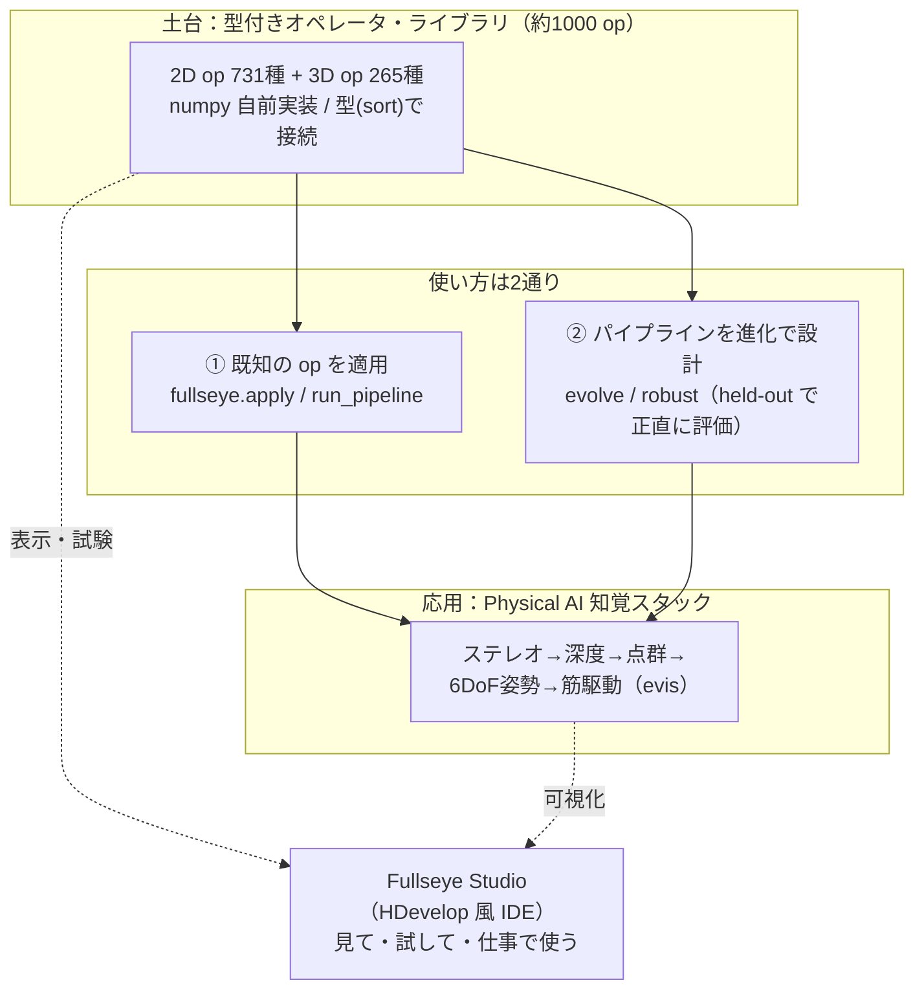
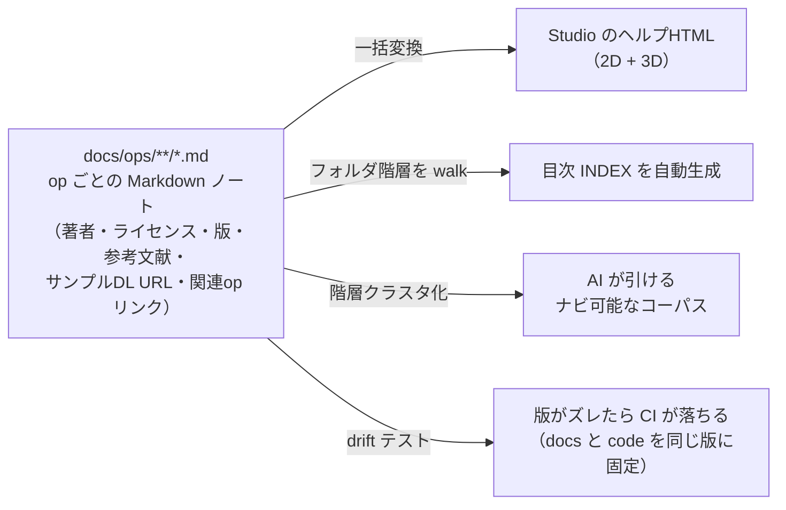

# 説明できる古典画像処理を「スキル」として1000個持ち歩く ―― Physical AI のための自作ビジョン工房 **Fullseye** をつくっている話

> English version: [fullseye_overview_qiita_en.md](https://github.com/furuse-kazufumi/fullseye/blob/master/docs/articles/fullseye_overview_qiita_en.md)


これは小惑星 **25143 イトカワ**の実データ点群(はやぶさ探査機の観測から作られた Gaskell 形状モデル、JAXA DARTS アーカイブ公開)を、本記事の主役 **Fullseye** の自作 3D レンダラで回しているところです。点群の読み込みからレンダリング・岩石マテリアル・影まで、**すべて numpy の自前実装**。この「目」をどう作ってきたかの話をします。

## TL;DR

- **Fullseye（フルズアイ／"Bullseye = 的のど真ん中" のもじり）** は、古典的な画像処理・幾何ビジョンのアルゴリズムを **numpy で自前実装し、1本の型付きインターフェースの裏に約1000個そろえた自作ライブラリ**です。「中身が説明できる（explainable）ビジョン」を、**Physical AI**（物理世界で身体を持って動く AI ―― つまりロボット）の目のために持ち歩けるようにするのが狙いです。
- 産業用マシンビジョンの定番 **HALCON** を「網羅の地図」として使い、実測で **982 / 2313 operator（42.5%）** に自作の対応物を用意しました（この数字はメモリ頼みでなく、実際にスクレイプした一覧に対して機械集計したものです）。
- ライブラリの上には、**アルゴリズムを進化計算で"設計"するモード**と、**ステレオ→深度→点群→6自由度姿勢**とつなぐ **Physical AI 知覚スタック**、そして **HDevelop 風の IDE「Fullseye Studio」** が乗っています。
- **いちばんの推奨運用は AI の RAG 知識ベース**。Claude Code などに読ませると、「この画像から○○を検出して」という**会話だけで約1000個の op からパイプラインが組まれ、実行され、Studio の画面に結果が出る** ―― そういう下地として設計しています。
- 本記事の裏テーマは **「正直さ（honest disclosure）を仕組みにする」** こと ―― 良い数字だけ見せない・失敗も消さない・限界は明記する、という規律です。品質ゲートが実際にバグを捕まえた例を、**今まさに直した6件**を含めてそのまま載せます。
- テストは現在 **6238 件**。深い依存（OpenCV / torch など）は全部オプションで、**numpy + scipy だけでコアが動く**設計です。

> この記事は「完成した自慢」ではありません。**なぜこの形にしたのか・どこがまだ弱いのか**を、追試できる粒度で残すものです。数字はすべて実測、限界は隠さず書きます。

まず1枚。これは Fullseye の 3D レンダラ（もちろん numpy 自前実装）が、SDF で作った形状に環境光遮蔽・ソフトシャドウ・ACES トーンマップまでかけて焼いた出力です：

<!-- 公開後チェック: raw URL が HTTP 200 を返すこと。画像は軽量サムネ+クリックでフルサイズ(記事のメモリ負荷対策) -->
[](https://raw.githubusercontent.com/furuse-kazufumi/fullseye/master/docs/articles/assets/render_beauty_hero.png)

---

## この記事は何？（3行で）

- 個人開発の画像処理ライブラリ **Fullseye** の全体像を、**設計思想から中身の作りまで**まとめた総集編です。
- 読者として想定しているのは、**マシンビジョン / ロボット知覚 / 画像処理**に関わる人、または「ライブラリをどう設計すると長く保守できるか」に興味がある人。
- 個々の技術（3DGS、進化計算、筋骨格制御…）は別記事で深掘りしています。ここは **地図** です。

所要時間の目安は 20 分ほど。長いので、目次から興味のある層に飛んでもらって構いません。

---

## 使ってみる ―― 導入方法(先に置いておきます)

読みながら手元で試したい人のために、導入を先に。公開リポジトリ（GitHub）と PyPI から入れられます。**numpy + scipy だけでコアが動く**ので、まず素で入れて、必要になったら extras（オプションの追加依存）を足すのがおすすめです。

```bash
# ① まず動かす（コアは numpy + scipy のみ）
pip install fullseye

# ② Studio（IDE）や重い op も使うなら extras を足す
pip install "fullseye[gui]"        # PySide6 の IDE だけ
pip install "fullseye[all]"        # OpenCV / torch / GUI / 動画など全部入り

# ③ Studio を起動
fullseye-studio
```

そして **いちばんおすすめの使い方が、AI コーディングアシスタント（Claude Code など）の RAG（検索拡張生成）知識ベースにすること**です。同梱のセットアップスクリプトが1コマンドでスキルを配置します：

```bash
fullseye-rag              # op カタログを Claude Code のスキルとして登録
fullseye-rag --uninstall  # きれいに外す
```

これで「この画像から傷を検出して」と AI に話しかけるだけで、AI が約1000個の op から適切なパイプラインを組んで実行してくれるようになります（何がどこまで出来るかは後述の RAG の節で）。Claude Code をまだ使っていない方は、[こちらの紹介リンク](https://claude.ai/referral/0sqPw8E_lw)から始めてもらえると、作者の開発費（お財布）がちょっと助かります。

ソースから入れる場合（op ドキュメント約1000枚のフルコーパスを RAG に使いたい人向け）：

```bash
git clone https://github.com/furuse-kazufumi/fullseye && cd fullseye
pip install -e ".[all]"
py -3.11 tools/update_fullseye.py --check   # 以後の更新は安全アップデータで
```

アップデータは**環境をつぶさない**方針で作ってあります（未コミットの変更があれば拒否・`--ff-only` のみ・RAG スキルはバックアップしてから更新・Studio の設定には触れない）。使い方の詳細は、リポジトリの `README.md` と `docs/AI_RAG_GUIDE.md`（RAG 化手順）、`docs/STUDIO_GUIDE.md`（IDE ガイド）にまとまっています。

**全体像を先に掴みたい人向けのリンク集**（すべて GitHub 上でそのまま読めます）：

| 見たいもの | リンク |
|---|---|
| 約1000 op の**ヘルプ総目次**（2D / 3D） | [docs/ops/INDEX.md](https://github.com/furuse-kazufumi/fullseye/blob/master/docs/ops/INDEX.md) |
| 全 op の**一枚カタログ**（型契約つき） | [docs/OP_CATALOG.md](https://github.com/furuse-kazufumi/fullseye/blob/master/docs/OP_CATALOG.md) |
| **処理結果ギャラリー**（本記事の図版のフルサイズ＋解説） | [docs/GALLERY.md](https://github.com/furuse-kazufumi/fullseye/blob/master/docs/GALLERY.md) |
| **サンプルデータの入手先カタログ**（実 DL URL・ライセンスつき） | [docs/ops/SAMPLES.md](https://github.com/furuse-kazufumi/fullseye/blob/master/docs/ops/SAMPLES.md) |

---

## まず言葉を4つだけ（最小用語集）

頻出する4語だけ先に。**それ以外の用語は、本文の初出時にその場でかみくだいて説明します**ので、覚えなくて大丈夫です。

| 用語 | ざっくり言うと |
|---|---|
| **Fullseye（フルズアイ）** | この記事の主役。画像処理・幾何ビジョンの自作オペレータ・ライブラリ。名前は **Bullseye（ブルズアイ＝射的の的のど真ん中）のもじり**（詳細は下の「名前の話」）。開発リポジトリ名は `imgevolve`。 |
| **オペレータ（operator, op）** | 「1つの画像処理関数」。例：ガウスぼかし、大津の二値化、Sobel エッジ。Fullseye では約1000個。 |
| **HALCON（ハルコン）** | 独 MVTec 社の産業用マシンビジョンの定番ソフト。**2313 個**の operator を持つ巨人。Fullseye はこれを「どこまで自作でカバーできたか」を測る**物差し**に使っています。 |
| **Studio（Fullseye Studio）** | Fullseye を**見て・試して・仕事で使う**ための IDE（統合開発環境）。産業ビジョンの HDevelop に相当。 |

---

## 名前の話 ―― Fullseye = Bullseye ＋ eye

名前の由来を先に。**Fullseye（フルズアイ）** は **Bullseye（ブルズアイ）** のもじりです。Bullseye は射的やダーツの**的のど真ん中**、転じて「ど真ん中・大当たり」。発音もそれに寄せて「フルズ・アイ」。

そこに三重の意味を込めています：

- **full（全部）＋ eye（目）** で、「**何でも見える目**」。あらゆる画像処理・幾何ビジョンを"スキル"として全部持つ、という狙いそのもの。
- **Bullseye の"ど真ん中を射抜く"精度**。産業検査やロボット知覚で求められる、**説明できて外さない**目でありたい、という含意。
- そして、作者である私の名字 **Furuse** ＋ **eye** をつないだ響き ―― 「Furuse の目」。個人開発として、名前に自分を編み込んでいます。

「進化で設計する（imgevolve）」という手段の名前から、「**的を射抜く目（Fullseye）**」という目的の名前へ ―― 名前の変化そのものが、このプロジェクトの方向転換を映しています。

---

## なぜ作ったのか ―― 「進化で設計する」から「説明できる目」へ

Fullseye には前身があります。もともとは **`imgevolve`**、つまり **「画像処理パイプラインを進化計算で自動設計する」** 実験でした。「このデータでこの指標を最大化する処理手順」を、遺伝的アルゴリズムに探させる ―― という発想です。

ここで**方向を決め直した**のが転機でした。進化で"探す"には、まず**探索の部品（op）が豊富で、型が揃っていて、正直に評価できる**必要がある。部品をそろえていくうちに、**「部品ライブラリそのものが主役だ」** と気づいたわけです。

そして 2026 年 8 月、私は Fullseye のミッションをこう定義し直しました：

> **あらゆる画像処理・視覚アルゴリズムを「スキル」として保持し、即使える包括的なライブラリにする。中身が説明できる、ロボットのための"専用 HALCON"を作る。**

この再定義は自分にとって大きな判断でした。汎用的なアルゴリズム（ソートや圧縮など）を積みかけていたのを「それは筋が違う」と切り、**画像・幾何ビジョンに一点集中**すると決めた。**何を作らないかを決める**のが、実は一番効きました。

背景には **evis（エビス）** の存在があります。私が別シリーズの記事で進めている**筋骨格ヒューマノイド**（700 筋モデルなど）の実験群で、Fullseye の"お客さん第一号"です。ロボットに箸で豆をつまませたり、歩かせたりするには、**「世界を正しく見る目」** が要る。


*↑ その「手」を Fullseye 側から見た一枚。手続き生成した手の骨格（手根骨8・中手骨5・指骨14）を、これも自前レンダラで描画しています。*

深層学習の目も強力ですが、**"なぜその姿勢だと判断したのか"が説明できない**と、身体の安全に関わる判断は任せづらい。だから **説明できる古典ビジョンを、スキルとして手元に全部持っておきたい** ―― これが Fullseye の芯です。

---

## 全体像 ―― Fullseye は3つの層でできている



- **層①：型付きオペレータ・ライブラリ** ―― 約1000個の op を、`image / region / feature / contour / volume` といった**型（sort と呼んでいます。画像・領域・特徴量・輪郭・体積という「データの種別」）**でつなげる土台。
- **層②：2つの使い方** ―― ほとんどの場合は **既知の op を適用**（`apply` / `run_pipeline`）。単発の op で解けないときだけ、**進化計算でパイプラインを設計**（`evolve` / `robust`）。
- **層③：Physical AI 知覚スタック** ―― フレームを幾何と物体に変える部品群。ロボットが**見て・測って・動く**ための道具。
- そして全体を横断する **Fullseye Studio**。産業ビジョンの HDevelop に相当する、機能を把握・試験・実務で使う IDE です。

以下、層ごとに掘っていきます。

---

## 層①：即使えるオペレータ・ライブラリ（約1000個）

### op とは何か（3段階でかみくだく）

1. **ひとことで**：op は「画像を入れると画像（や領域・数値）が出てくる1つの関数」。
2. **もう少し**：Fullseye では op が**型（sort）**を持っています。「画像 → 領域」（例：二値化）、「領域 → 数値」（例：物体数を数える）というふうに、**入口と出口の型が決まっている**。だから型が合う op を**数珠つなぎ**にできます。
3. **正確には**：各 op は `apply(image, name, a=0.5, b=0.5)` という統一シグネチャで呼べます。`a, b` は `[0,1]` の2つのツマミ。特徴量 op は Python の float を、輪郭 op は dict を返す ―― という**型の契約**が全 op で守られています。

```python
import fullseye, numpy as np

frame = np.asarray(img, np.float64)              # H×W グレー画像 [0,1]
edges = fullseye.apply(frame, "sobel_amp")       # 画像 → 画像（エッジ強度）
seg   = fullseye.apply(frame, "otsu")            # 画像 → 領域（二値 {0,1}）
n     = fullseye.apply(seg,   "count_obj")       # 領域 → 特徴量（物体数, float）

# 型が合う op をつなぐ：ぼかし → エッジ → 二値化
out = fullseye.run_pipeline(frame, ["gaussian", "sobel_amp", "otsu"])
```

実際の出力を見てもらうのが早いでしょう。エッジ検出・セグメンテーション・輪郭計測など、定番どころを1枚に並べるとこうなります（すべて上の `apply` / `run_pipeline` の実出力）：

[](https://raw.githubusercontent.com/furuse-kazufumi/fullseye/master/docs/articles/assets/vision_ops_montage.png)

各パネルの詳しい説明（何の op がどの数値を出しているか）は、リポジトリの **[処理結果ギャラリー（docs/GALLERY.md）](https://github.com/furuse-kazufumi/fullseye/blob/master/docs/GALLERY.md)** にまとめてあります。

### どれくらいの規模か（実測）

- **2D オペレータ：731 種**（レジストリ登録 735 エントリのうち、名前で distinct なもの 731。46 カテゴリ）
- **3D オペレータ：265 種**（点群・メッシュ・ボリューム・SDF など、55 カテゴリ）
- 合わせて **約1000個**。denoise / 平滑化 / 先鋭化 / 二値化・セグメンテーション / モルフォロジー / エッジ・コーナー・ブロブ検出 / 距離変換 / 色空間 / テクスチャ・形状特徴 / 輪郭 / 3D幾何 ―― をカバーします。

### 物差しは HALCON（実測 42.5%）

「網羅」を主観で語らないために、産業ビジョンの巨人 **HALCON** を物差しにしています。HALCON の公式ドキュメントをスクレイプして得た **2313 operator** に対し、Fullseye の各 op が「どの実在 operator に相当するか」をタグ付けし、機械集計しています。

> **imgevolve maps to 982 / 2313 HALCON operators（42.5%）** ―― これは記憶でなく、スクレイプした一覧に対する実測です。

正直に言えば、**まだ半分未満**です。Tuple 処理・System・Classification・OCR といった章はほぼ手つかず（画像処理の芯から外れるので優先度を下げています）。逆に Matching / Morphology / Filtering / 幾何計測は厚くしてきました。**"どこが埋まっていて、どこが空か"を章別の表で常に開示**しているのが、この数字の肝です。

### ドキュメントを「1つの真実源」にする（md=SoT）

op が1000個もあると、**ヘルプが無いと使い物になりません**。かといってヘルプ HTML と AI 用の説明を二重管理すると、必ず片方が腐ります。そこで採ったのが **Markdown を単一真実源（Single Source of Truth）にする** 設計です。



- **op ごとの Markdown ノート**（約1000枚）が真実源。frontmatter に**著者名・ライセンス（Apache-2.0）・ライブラリ版・参考文献・サンプルデータの実 DL URL・関連 op へのリンク**を持ちます。
- そこから **Studio のヘルプ HTML を一括生成**（2D も 3D も同じ経路）。**二重管理はしません**。
- **目次はフォルダ階層を walk して自動生成**。手書き目次はゼロ。
- **版接続**が地味に大事です。画像処理は「わずかな仕様変更が結果の違いに直結」しやすい。だから **「commit 済みノート == 現レジストリから生成したノート」を副作用なしで比較する drift テスト**を CI に入れ、op の仕様が変わればノートがズレてテストが落ちる ―― つまり **ドキュメントとコードが同じ版に固定**されるようにしています。

この「md=真実源」化は、まさに**この総集編を書いている一連の作業**で仕上げました。関連 op リンク・参考文献（Tomasi & Manduchi 1998、Serra 1982、Sobel & Feldman 1968… と**実在する古典を正確に**、DOI を捏造せず）・サンプルデータの実 URL まで含めて、**長く保守できる形**にしてあります。

---

## 層②：パイプラインを"進化"で設計する（正直な評価つき）

単発の op で解けない課題 ―― 「このデータでこの指標を最大化する処理手順を見つけたい」 ―― のときだけ、**進化計算**の出番です。

```bash
py -3.11 baseline.py --problem denoise --workdir out/mine     # まず"正直な床"を測る
py -3.11 evolve.py   --problem denoise --workdir out/mine --gens 40 --pop 24
py -3.11 robust.py   --problem denoise --workdir out/mine --seeds 5
```

ここで一番こだわっているのは **評価の正直さ**です。

- **適合度は訓練（train）分割だけで測る。**
- **hold-out（取り置き）分割は追跡するが、選択には絶対使わない。**

こうすることで、報告する汎化性能が「評価セットへの過剰適合」ではなく、**正直な数字**になります。「良い結果が出たら、勝った気になる前に必ず内訳を疑う」 ―― これは開発全体の家訓でもあります。

---

## 層③：Physical AI 知覚スタック（ロボットの目）

フレームを**幾何と物体**に変える部品群です。ロボットが見て・測って・動くための道具箱。

```python
import fullseye as fs
disp  = fs.disparity_map(left, right, max_disp=16)          # ステレオ視差
Z     = fs.depth_from_disparity(disp, focal=f, baseline=B)  # 深度  Z = f·B/d
pts   = fs.reproject_to_points(Z, fx=f, fy=f)               # 点群 (N,3)
grid,_= fs.elevation_map(world_pts, cell=0.05)              # 2.5D 地形ハイトマップ
ok    = fs.traversability(grid, cell=0.05, max_step=0.1)    # 足場/障害物マスク
objs  = fs.segment_objects(frame, threshold="otsu")        # 物体ごとの幾何＋記述子
```

この層には**センサー・シミュレーション一式**も含まれます。実機を持っていなくても、**疑似 LiDAR・ステレオカメラ・イベントカメラ（DVS）・フォトメトリックステレオ・TSDF 融合・偏光カメラ・焦点合成**といったセンサーの出力を合成シーンから作り、知覚パイプラインを**実機なしで開発・検証**できる ―― Physical AI 開発の"練習場"です。すべて Fullseye 自身の op の実出力です：

[](https://raw.githubusercontent.com/furuse-kazufumi/fullseye/master/docs/articles/assets/physical_ai_montage.png)

パネルごとの説明と、これ以外の処理結果（3D レンダリング・メッシュ処理・ターンテーブル GIF など）の一覧は **[処理結果ギャラリー（docs/GALLERY.md）](https://github.com/furuse-kazufumi/fullseye/blob/master/docs/GALLERY.md)** へ。

この中の1つ、**イベントカメラ（DVS）** ―― 画素ごとの輝度変化だけを非同期に吐くセンサー ―― は、動きで見るのが一番わかりやすい。カメラがパンすると、エッジに沿って ON イベント（シアン）と OFF イベント（マゼンタ）が流れます：


より滑らかな **mp4 版**と、イトカワ等のターンテーブル動画は、リポジトリの [docs/articles/assets/media/](https://github.com/furuse-kazufumi/fullseye/tree/master/docs/articles/assets/media) に置いてあります（GitHub 上でそのまま再生できます）。

### 3D をここまで自作している話（いちばんの差別化ポイント）

Fullseye の差別化がいちばん出るのは **3D 系**だと思っています。冒頭の GIF に出てきた小惑星イトカワの実点群に、3D op を実際に当てるとこうなります：

[](https://raw.githubusercontent.com/furuse-kazufumi/fullseye/master/docs/articles/assets/itokawa_montage.png)

実点群 3000 点に対して、**曲率解析**（近傍曲率の相関 r=0.87 ―― 実在表面である証拠）、**ICP 自己レジストレーション**（未知の 30° 回転＋ノイズから回転誤差 0.027° で復元）、**PCA 正準姿勢**（未知の 50° 回転後も主軸を完全回復）。全部この場で実行した実測値です。

3D op は現在 265 個。点群・メッシュ・ボリューム・SDF を跨いで、SHOT / FPFH / スピンイメージといった **3D 特徴記述子**、**TSDF 融合**、**縞投影（fringe projection）**、**フォトメトリックステレオ**、**スーパークアドリク当てはめ**、**メディアル軸**、**測地距離**、**ビジュアルハル**、**QEM メッシュ簡略化（境界保存・多様体厳格）** まで揃えています。いくつか実物を：


*↑ 3D 分水嶺（watershed）分割 ―― くっついた 2 物体を距離変換の「谷」で切り分ける。ビンピッキングで部品が重なる、あの状況の道具です。*


*↑ QEM メッシュ簡略化の実測比較。「境界を保つ」「多様体を壊さない」を実測で確認しながら削る ―― この op は本記事のバグ⑥の舞台でもあります（後述）。*


*↑ 解剖学的な手骨メッシュ（MS-Human-700 筋骨格モデル由来）をボクセル化した合成 CT ボリュームから、マーチングキューブでメッシュ化して骨格標本風に回したもの。ボリューム→メッシュ→レンダまで一気通貫です。*個々のアルゴリズムは PCL（C++）や Open3D に散在しますが、**「純 numpy・型付き・全 op に機械可読ノート付き」で1つのライブラリがこの範囲を持っている構成は、あまり見ない**と思います。産業の縞投影計測からロボットの把持姿勢まで、同じ書き味で届くのが狙いです。

試すための **3D データは、公開ソースから無料で手に入ります**。定番どころ：

- **[Stanford 3D Scanning Repository](https://graphics.stanford.edu/data/3Dscanrep/)** ―― bunny / dragon / armadillo。3D 処理界の「Lenna」たち
- **[JAXA DARTS はやぶさアーカイブ](https://data.darts.isas.jaxa.jp/pub/hayabusa/shape/gaskell/)** ―― 本記事のイトカワ形状モデルの出どころ（[PDS 側の解説はこちら](https://sbn.psi.edu/pds/resource/itokawashape.html)）
- **[NASA 3D Resources](https://nasa3d.arc.nasa.gov/)** ―― 探査機や地形など、宇宙関連の 3D モデル
- **[The Cancer Imaging Archive (TCIA)](https://www.cancerimagingarchive.net/)** ―― 研究用 CT/MRI の **DICOM ボリューム**（volume sort の実データ源）
- **ロボットのモデル**も公開で揃います：**[MuJoCo Menagerie](https://github.com/google-deepmind/mujoco_menagerie)**（実機ロボットの高品質 MJCF 群）、**[MyoSuite](https://github.com/MyoHub/myosuite)**（筋骨格モデル）、**[LocoMuJoCo](https://github.com/robfiras/loco-mujoco)**（歩行ベンチマーク環境）

ライセンスと直 DL URL を整理した一覧はリポジトリの [docs/ops/SAMPLES.md](https://github.com/furuse-kazufumi/fullseye/blob/master/docs/ops/SAMPLES.md) にあり、`sample_data.download('bunny', yes=True)` の1行で取得できるものはコード側にも登録済みです（未取得なら明示エラー、勝手に拾わない fail-closed 設計）。

この層の"お客さん第一号"が **evis**（筋骨格ヒューマノイド）です。evis の視覚パイプラインは、**ステレオ → 深度 → 点群 → セグメント → 6自由度（6DoF）姿勢 → 動作計画 → 700筋での実現**、という流れ。ロボットに箸を使わせる・歩かせるといった課題の"目"を、この層が担います。

大事にしているのは **OSS を再発明しないこと**。PCL / OpenCV / MoveIt2 といった標準は、**忠実性とカバレッジの地図＋薄いアダプタ**として使う。**統一インターフェースの裏に隠す**ので、使う側は「中身が自作 numpy か OSS ラッパか」を気にせず、同じ書き味で呼べます。

---

## Fullseye Studio ―― 見て・試して・仕事で使う IDE

アルゴリズムを揃えるだけでは足りません。**「見て確かめる」層**が要る。それが **Fullseye Studio** です。位置づけは：

> **産業ビジョンの HDevelop（2D 画像の IDE）＋ ロボットの RViz2（3D 知覚の可視化：点群・深度・6DoF姿勢の軸・地形レイヤ）の融合。**

- 左に**オペレータ／サンプル一覧**、中央に**コード編集＋パラメータのスライダ**、右に**描画ペイン**。サンプルを選ぶ → コードが出る → Run で即描画、スライダで即再描画。
- 約1000個の op それぞれに**生成済みヘルプページ**が付き、**2D も 3D も**同じヘルプ辞書から引けます（この総集編の作業で 3D 側も統一しました）。
- 画像上を hover すると**画素座標と値**が出る、検出領域を入力画像に**重畳**する ―― といった HDevelop 由来の"検査"の作法も入れています。
- そして **Python Editor**（Qt Creator 風の編集＋実行環境）。以前はサンプルコードを**読むだけ・パイプラインとして呼ぶだけ**でしたが、いまはギャラリーの worked example を**編集可能なエディタに開いて、書き換えて、F5 で即実行**できます（構文ハイライト・行番号・実行コンソール付き。実行はサブプロセスなので UI は固まりません）。HDevelop の「メイン＋サブスクリプト」と同じく**複数のスクリプトをタブで同時に開いて編集**でき、サンプルは**独立した MDI ウィンドウとして何枚でも並べて**、断片を選択コピーしながら書けます。「サンプルをそのまま動かす → 少し変えて自分の問題に寄せる」という**学習と実務の間の階段**を、Studio 内で完結させるための層です（この総集編の作業で追加）。
- **デバッガ級の実行制御と変数ウォッチ**も入れました。ブレークポイントで止め、**実行行から再開（Continue）**、**任意の行からやり直し（Run from here）**。変数は**右クリックで中身をポップアップ検査**でき、**ウォッチ式**（`v.mean()` や `np.percentile(v, 99)` など任意の式）が選択変数に対して**パイプラインの変更のたびに自動再評価**されます。
- **複数の描画ウィンドウをスクリプトから制御**できます。HDevelop と同じ流儀で、プログラム中の `dev_open_window (行, 列, 幅, 高さ)` がウィンドウを開いて配置し、`dev_set_window` で切り替え、`dev_set_window_extents` で動かせる。画像処理の実務では「入力・中間・結果を別ウィンドウに並べる」が日常なので、これをコードで再現可能にしています（開き過ぎ防止の上限は環境設定で調整可能、既定 256）。

---

## 設計思想（4本の柱）

Fullseye が「ただの関数の寄せ集め」にならないための背骨です。

1. **正直さを構造に（honest by construction）**
   hold-out は選択に使わない。カバレッジもベンチも**主張でなく実測**。限界は**隠さず開示**。良すぎる結果は内訳を疑う。
2. **統一インターフェース（unified I/F）**
   中身が自作でも OSS ラッパでも、**使う側は同じ命名・シグネチャ規約で呼べる**。しかも**人間が書いて自然な API**であること ―― `fs.stereo.SGM(num_disparities=128).compute(l, r)` のような、補完が効いて読める書き味を目指しています（機械的な文字列ディスパッチは裏に隠す）。これは私が特にこだわった点です。
3. **重い依存はぜんぶオプション**
   **numpy + scipy だけでコアが動く**。OpenCV / scikit-image / torch / GPU は opt-in で、無ければその op だけが静かに無効化される（graceful degradation）。
4. **公開知識からの再実装**
   すべて**論文・OSS などの公開知識**から実装。特定の商用製品から派生させたものではありません（この一線は明確に引いています）。

---

## AI に画像処理をさせられる ―― RAG として使う

これは Fullseye の隠れた優位点です。前述の通り、約1000個の op はそれぞれ **Markdown ノート**（使い方・型契約・関連 op・参考文献つき）を持ち、しかも**中身が説明できる古典アルゴリズム**です。この2つがそろうと、**AI コーディングアシスタント（Claude Code など）の RAG（Retrieval-Augmented Generation、検索拡張生成）知識ベース**としてそのまま機能します。

3段階でかみくだくと：

1. **ひとことで**：「この画像から○○を検出して」と AI に頼むと、AI が Fullseye の op ドキュメントを**引いて（retrieve）**、適切な op を組み合わせたパイプラインを**書いて実行**してくれる。
2. **もう少し**：AI は op の**型（sort）**を読めるので、「画像 → 領域 → 特徴量」と**型が繋がる順に op を選べる**。関連 op リンクをたどって代替案も出せる。深層学習の「ブラックボックスな1関数」と違い、**各段が説明でき、途中結果を検査できる**ので、AI が誤った時も**どこで外したかが分かる**。
3. **なぜ効くか**：ドキュメントが機械可読な単一真実源（md=SoT）で、op が決定論的・型付き・contract-tested だから。**AI にとって"引きやすく・組みやすく・検証しやすい"部品箱**になっている。人間が Studio で試すのと、AI が RAG で組むのが、**同じ op・同じドキュメント**の上で成り立ちます。

つまり Fullseye は「人間が使うライブラリ」であると同時に、**「AI に画像処理を自由にさせるための下地」**でもある。説明できる古典ビジョンをスキルとして揃えたことが、そのまま AI との相性の良さに直結しています。

そして **推奨する運用はこの RAG 型**です。その上で Studio を組み合わせると、AI エージェント（Claude Code など）が組んだパイプラインの結果を**画像ウィンドウや 3D 表示画面として人間の目の前に出せる** ―― コードと会話だけで閉じず、「AI が見ているもの」を人間が同じ画面で検査できる。狙っている位置づけは、**Physical AI（ロボット知覚）の統合環境**です。

具体的な絵で言うとこうです。Studio を横に開いた Claude Code に「このビンの中の部品を数えて、つまめる姿勢まで出して」と頼む → AI が op ノートを引いてセグメンテーション→3D 姿勢推定のパイプラインを書いて実行 → 結果が Studio の画像ウィンドウと 3D 表示に出る → 人間は画面を見て、おかしければ日本語でやり直しを頼む。**会話と画面だけで画像処理が回る**、という運用を狙って作ってあります（部品は全部この記事で紹介したもの ―― 約1000 op×型契約×機械可読ノート×Studio の描画層）。

ちなみにこの開発自体も Claude Code と組んで進めています。試してみたい方は[作者の紹介リンク](https://claude.ai/referral/0sqPw8E_lw)から始めてもらえると、この開発の継続にちょっと貢献できます（正直な開示：紹介リンクです）。

もうひとつ意識しているのが**学術利用**です。全 op が参考文献つきの機械可読ノート（md=SoT）を持ち、版が fingerprint で code に固定され、評価は hold-out で正直 ―― つまり**引用でき、追試できる**形を最初から作ってあります。リポジトリには `CITATION.cff` を置き、文献は実在する古典（DOI を捏造しない）だけを引いています。研究の道具として使われ、参照される ―― そうなったら嬉しい、という設計です。

---

## 「正直さ」を仕組みにする ―― 実際にバグを捕まえた話

この開発では **honest gate**（正直ゲート）という考え方を随所に置いています。「期待挙動を数値で検証してから採用する」関門です。そして本当に効いているかは、**バグを捕まえた実績**で判断すべきです。

**この総集編を準備する一連の作業だけで、品質チェックが確定バグを6件見つけました。** 隠さず載せます。前半2件はテストのすり抜け方が、後半4件は「AI に敵対的レビューをさせ、その指摘を人手で一次検証する」という発見経路が、それぞれ教訓になっています。

### バグ①：3D トポグラフィック分類の Hessian が非対称になっていた

地形の凸凹を「山・谷・尾根・鞍点」に分類する op で、**ヘッセ行列（Hessian）の交差項**を `np.gradient` の**間違った軸**から取っていました。`np.gradient` は `[∂/∂y, ∂/∂x]` の順で返すのに、交差項 ∂²/∂x∂y のつもりで ∂²/∂y²（別の項の重複）を拾っていたのです。

- **影響**：軸に対して斜めの構造で、固有値が半減したり符号が飛んだりして、分類を誤る。
- **確かめ方（追試可能）**：正しい分類は**転置に対して同じ**になるはず（画像とその転置は「山・谷」が入れ替わらない）。実測すると、旧コードは 24×24 の斜め構造で **576 画素中 46 画素を誤分類**、修正版は**完全に転置対称**になりました。
- **対策**：交差項を正しい軸から取り、**転置対称性を回帰テストに固定**。

### バグ②：Studio の op ヘルプ・ドロップダウンが全 op で壊れていた

2D と 3D をまたいで op ヘルプを引けるようにした際、内部で `(次元, 名前)` のタプルを、`表示関数(名前, 次元)` に**そのまま展開して渡していた**（引数が逆）。両方とも文字列なので**エラーにならず**、どの op を選んでも空のカードが出る、という**ユーザーに見える不具合**でした。

- **なぜテストをすり抜けたか**：既存テストは表示関数を**正しい引数順で直接呼んで**いて、実際のドロップダウン操作（シグナル経由）を通していなかった。
- **対策**：引数順を修正し、**実際のドロップダウン操作を再現する回帰テスト**を追加。さらに「同じ失敗は似た箇所で再発する」ので、**同種の引数順ミスを全ディスパッチ箇所で洗い直し**（他にないことを確認）。

### バグ③：PCA 姿勢推定が、約半分の確率で「何もしない回転」を黙って返していた

点群の主軸を合わせて姿勢（回転）を推定する op で、固有ベクトル分解（`eigh`）が返す枠の**掌性（右手系か左手系か）**を考慮していませんでした。数学的には、符号候補を作る行列の行列式が**恒等的に +1** になってしまう構成で、左手系の枠を引くと4つの候補が**全部棄却**され、**エラーも警告もなく恒等回転（＝何もしない）にフォールバック**していたのです。

- **実測**：ランダムな点群と回転で 200 試行 → **92 回（46%）が恒等回転**。修正後は **200/200 で機械精度（1e-15 台）の復元**。
- **なぜテストをすり抜けたか**：既存テストの乱数 seed が、たまたま「運のいい 54%」側に落ちていた。**1つの seed で通ったことは、半分の入力で壊れていないことを意味しない**。
- **対策**：分解直後に枠を右手系へ正準化。回帰テストは**ランダム 40 試行を掃く**形にして、両方の掌性を必ず踏むようにしました。

### バグ④：曲率の「絶対値」が32倍ずれていた（比率だけは合っていた）

曲面の曲がり具合（curvedness）を出す op が、**利得 32 の勾配フィルタ**（意図的な規約で、他の消費側は明示的に 32 で割って補正済み）と**正規化済みのヘッセ行列**を混ぜていました。曲面の形の分類（shape index）は**比**なので正しく出る一方、**絶対値だけが 1/32** ―― 「半径 R の球なら曲率 1/R」のはずが 1/(32R) になっていた。

- **見つけ方**：半径既知の合成球で**絶対値**を検算 ―― 実測 0.0022 vs 真値 0.0714、**きっちり 32.2 倍差**（利得の由来 2×4×4=32 と一致）。
- **教訓**：「比率のテスト」は通っていました。**単位系・絶対値の真値まで検証して初めて捕まるバグ**がある。修正後は c·R = 1.004（球殻の実測）で、回帰テストも**絶対値**で固定しました。

バグ③④の発見経路は①②と違い、**AI に敵対的なコードレビューをさせ、その指摘を鵜呑みにせず人手で一次検証（数値再現）してから直す**、という流れです。AI レビューの指摘は外れることも多いので、**「指摘→自分で再現→初めて採用」の関門**を必ず挟みます。

同じ流れの**公開前の総ざらい（第2ラウンド）**では、さらに2件の確定バグを捕まえて直しました。**⑤点群法線の視点符号が逆**（単一視点スキャン ―― まさに `viewpoint` 引数の本来の用途 ―― で全点の法線が裏返っていた。既存テストは絶対値 `abs()` で符号を吸収していて、③と同型の「コイン投げを隠すテスト」だった）。**⑥メッシュ簡略化の境界保存が高圧縮比で自壊**（悪条件になった二次形式の解が数エッジ長も飛んだ位置に置かれ、「境界を保つ」はずのリムが崩れていた。外れ位置ガードを強化し、崩れる条件そのものを回帰テストに固定）。どちらも**「たまたま通るテスト」ではなく「符号つき・絶対値・壊れる条件」を検証するテスト**に置き換えたのが本質です。

この6件は、**「良い結果だけ見せる」記事なら絶対に載らない**話です。でも私は、**品質保証が本当に動いている証拠**として、こういう話こそ残す価値があると思っています。

---

## 性能の正直な話（GPU）

「速い」も正直に言います。既定の1枚ずつの経路は scipy / OpenCV。バッチ化した `torch` の速い経路（`--device cuda`）は、重い・ベクトル化できる op を加速します。

- **CPU 上**では、重い op で **約 1.6〜2.2 倍**。ただし**軽い画素演算では逆に遅くなる**（テンソル変換のオーバーヘッドが乗るため）。
- **本当の効きどころは GPU**。そのオーバーヘッドが**大きな並列度で償却される**ときに効きます。

「全部速くなる」とは書きません。**どこで速く、どこで損をするか**まで書くのが honest disclosure です。

---

## 限界と、これから（隠さず）

- **HALCON カバレッジはまだ 42.5%。** OCR・Classification・System 系はほぼ空。画像・幾何の芯を厚くする方針は変えませんが、"半分未満"は事実です。
- **統一 API はまだ移行の途中。** 画像レジストリ・アルゴリズム・知覚 facade で歴史的に規約が分かれていて、Qt 風の自然な API へ**段階的に載せ替え中**です。
- **GPU 化は本丸が途上。** op ごとの GPU 常駐パイプライン（E2E）を進めていますが、実速度は実機（RTX 5090）ゲート。**CPU の数字を GPU の数字と偽らない**のが規律です。
- **3D 可視化の Studio 統合**も、既存ビューア（Open3D / RViz2）連携を軸に育てている最中。

やることは山積みですが、**土台（型付き op・正直な評価・md=真実源のドキュメント・6238 テスト）は据わりました**。ここから網羅と自然 API を伸ばしていきます。

---

## まとめ

**Fullseye** は、**説明できる古典ビジョンのアルゴリズムを「スキル」として約1000個持ち歩き**、それを

- **即使うか（apply / pipeline）**、
- **進化で設計するか（evolve、正直な評価つき）**、
- **ロボットの目として使うか（Physical AI 知覚スタック）**、

を1本の型付きインターフェースの裏で選べる、numpy ネイティブの自作ライブラリです。**HALCON を物差しに 42.5%（実測）**、**テスト 6238 件**、**Markdown を単一真実源にしたドキュメント体系**、そして **HDevelop 風の Studio**。深い依存は全部オプションで、**numpy + scipy だけでコアが動きます**。

一番伝えたいのは、規模でも網羅率でもなく、**「正直さを仕組みにする」** という姿勢です。hold-out を選択に使わない。カバレッジは実測で開示する。**バグを見つけたら、それを見つけられた品質保証ごと記事に残す**。派手さより、**中身が説明でき、追試でき、長く保守できる**こと ―― それを地道に積んでいます。

使ってみたくなったら、導入は前半の「[使ってみる](#使ってみる--導入方法先に置いておきます)」節から5分ほどで。いちばんおいしい使い方は **Claude Code＋`fullseye-rag`** の組み合わせ（AI の道具箱化）です。Claude Code が未導入なら[作者の紹介リンク](https://claude.ai/referral/0sqPw8E_lw)からどうぞ。

---

## 次回に続く

この記事は"地図"でした。次はこの地図の各所を歩きます。候補は：

- **op を1つ足すと何が起きるか** ―― レジストリ・進化・コード生成・ドキュメントが自動で追従する仕組みの中身。
- **HALCON 42.5% をどう伸ばすか** ―― 未カバー operator を honest gate で1つずつ埋める実装記。
- **Physical AI の目** ―― ステレオから 6DoF 姿勢、そして 700 筋で"つまむ"まで、evis の視覚パイプラインを通しで。

読んでくださってありがとうございました。「ここをもっと詳しく」があれば、それを次の一本にします。

---

<!--
公開メモ（本文には出しません）:
- 数字はすべて実測（op 735/731・3D 265、HALCON 982/2313=42.5%、テスト 6238）。更新時は再測定してから差し替える。
- 画像は使わず Mermaid のみ（Qiita ネイティブ・SVG のパス/キャッシュ問題を回避）。図を SVG 化する場合は raw 絶対 URL + HTTP 200 + ?v=N cache-bust を必ず適用。
- Apache-2.0・公開知識からの再実装であることを明記済み（商用製品非派生の一線）。
- 公開の運び：限定公開で在庫に積み、Qiita の連続投稿 502 を避けて枠が空いたら出す。
-->
