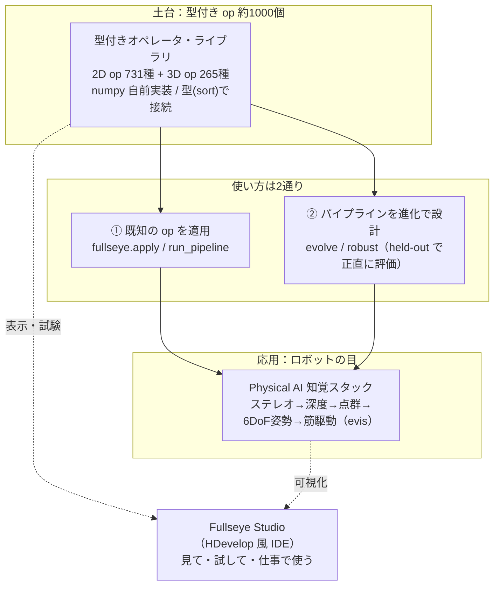
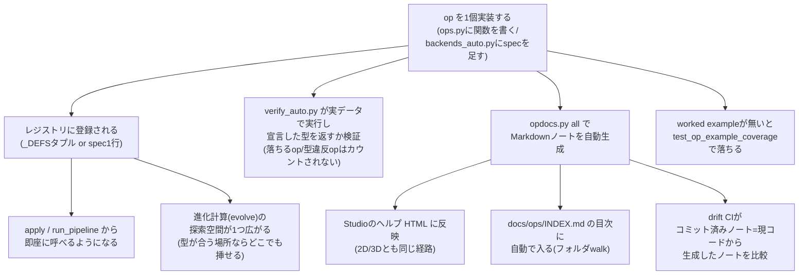
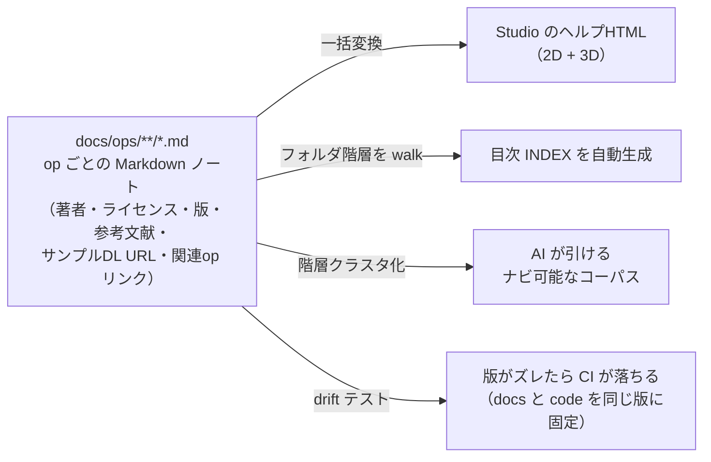

# 説明できる古典画像処理を「スキル」として1000個持ち歩く ―― Physical AI のための自作ビジョン工房 **Fullseye** をつくっている話

> English version: [fullseye_overview_qiita_en.md](https://github.com/furuse-kazufumi/fullseye/blob/master/docs/articles/fullseye_overview_qiita_en.md)


これは小惑星 **25143 イトカワ**の実データ点群(はやぶさ探査機の観測から作られた Gaskell 形状モデル、JAXA DARTS アーカイブ公開)を、本記事の主役 **Fullseye** の自作 3D レンダラで回しているところです。点群の読み込みからレンダリング・岩石マテリアル・影まで、**すべて numpy の自前実装**。この「目」をどう作ってきたかの話をします。

## TL;DR

- **Fullseye（フルズアイ／"Bullseye = 的のど真ん中" のもじり）** は、古典的な画像処理・幾何ビジョンのアルゴリズムを **numpy で自前実装し、1本の型付きインターフェースの裏に約1000個そろえた自作ライブラリ**です。「中身が説明できる（explainable）ビジョン」を、**Physical AI**（物理世界で身体を持って動く AI ―― つまりロボット）の目のために持ち歩けるようにするのが狙いです。
- 産業用マシンビジョンの定番 **HALCON** を「網羅の地図」として使い、実測で **982 / 2313 operator（42.5%）** に自作の対応物を用意しました（この数字は記憶頼みでなく、公式リファレンスの operator 一覧に対して機械集計したものです）。
- ライブラリの上には、**アルゴリズムを進化計算で"設計"するモード**と、**ステレオ→深度→点群→6自由度姿勢**とつなぐ **Physical AI 知覚スタック**、そして **HDevelop 風の IDE「Fullseye Studio」** が乗っています。
- **いちばんの推奨運用は AI の RAG 知識ベース**。Claude Code などに読ませると、「この画像から○○を検出して」という**会話だけで約1000個の op からパイプラインが組まれ、実行され、Studio の画面に結果が出る** ―― そういう下地として設計しています。
- 本記事の裏テーマは **「正直さ（honest disclosure）を仕組みにする」** こと ―― 良い数字だけ見せない・失敗も消さない・限界は明記する、という規律です。品質ゲートが実際にバグを捕まえた例を、**今まさに直した6件**を含めてそのまま載せます。
- テストは現在 **6238 件**。深い依存（OpenCV / torch など）は全部オプションで、**numpy + scipy だけでコアが動く**設計です。

> この記事は「完成した自慢」ではありません。**なぜこの形にしたのか・どこがまだ弱いのか**を、追試できる粒度で残すものです。数字はすべて実測、限界は隠さず書きます。

まず1枚。これは Fullseye の 3D レンダラ（もちろん numpy 自前実装）が、SDF で作った形状に環境光遮蔽・ソフトシャドウ・ACES トーンマップまでかけて焼いた出力です：

<!-- 公開後チェック: raw URL が HTTP 200 を返すこと。画像は軽量サムネ+クリックでフルサイズ(記事のメモリ負荷対策) -->
[](https://raw.githubusercontent.com/furuse-kazufumi/fullseye/master/docs/articles/assets/render_beauty_hero.png)

---

## この記事は何？（3行で）

- 個人開発の画像処理ライブラリ **Fullseye** の全体像を、**設計思想から中身の作りまで**まとめた総集編です。
- 読者として想定しているのは、**マシンビジョン / ロボット知覚 / 画像処理**に関わる人、または「ライブラリをどう設計すると長く保守できるか」に興味がある人。
- 個々の技術（3DGS、進化計算、筋骨格制御…）は別記事で深掘りしています。ここは **地図** です。

所要時間の目安は 20 分ほど。長いので、目次から興味のある層に飛んでもらって構いません。

### 主張の「確からしさ」を先に仕分けます

長い記事なので、**どの主張がどの段階にあるのか**を最初に仕分けておきます。該当する章の冒頭にも同じ Status ラベルを置きました。

| 階層 | Status ラベル | 本記事での中身 |
|---|---|---|
| **実装済み・再現可能** | `Production-ready / Verified` | 2D 731 + 3D 265 の op、型契約と統一インターフェース、Studio、PyPI 配布、テスト 6238 件、HALCON 対応 982/2313 の機械集計、展示・デモの実出力 |
| **実証途上** | `PoC / Research prototype` | 進化によるパイプライン設計(hold-out 評価つき・限定条件)、RAG 経由の自然言語→パイプライン生成、Physical AI 知覚スタック(シミュレーション実証。実機投入・Sim-to-Real は未着手) |
| **将来構想** | `Roadmap / Design proposal` | ロボット向けの包括的な op 基盤、AI が約 1000 op を選んで自律実行する運用、産業検査と Physical AI の共通知覚基盤 |

数字はすべて実測です。この仕分け自体も「盛らない」ための仕組みのひとつです。

---

## 使ってみる ―― 導入方法(先に置いておきます)

読みながら手元で試したい人のために、導入を先に。公開リポジトリ（GitHub）と PyPI から入れられます。**numpy + scipy だけでコアが動く**ので、まず素で入れて、必要になったら extras（オプションの追加依存）を足すのがおすすめです。

```bash
# ① まず動かす（コアは numpy + scipy のみ）
pip install fullseye

# ② Studio（IDE）や重い op も使うなら extras を足す
pip install "fullseye[gui]"        # PySide6 の IDE だけ
pip install "fullseye[all]"        # OpenCV / torch / GUI / 動画など全部入り

# ③ Studio を起動
fullseye-studio
```

①のコマンドだけで何が起きるか、少し具体的に書いておきます。`pip install fullseye` は、依存として **numpy と scipy だけ**を引っ張ってきます（OpenCV も torch も PySide6 も入りません）。この状態でも `import fullseye` は通り、**500種類以上の op がすぐに使える状態**になっています。「性能の正直な話（GPU）」や「公開前夜」の章で触れる通り、この「素のインストールで最低限が動く」という主張自体が、CI の中で**毎回実行して確かめられている**もので、口約束ではありません。②の extras は、必要になったときに足す**後乗せの選択肢**という位置づけです。

そして **いちばんおすすめの使い方が、AI コーディングアシスタント（Claude Code など）の RAG（検索拡張生成）知識ベースにすること**です。同梱のセットアップスクリプトが1コマンドでスキルを配置します：

```bash
fullseye-rag              # op カタログを Claude Code のスキルとして登録
fullseye-rag --uninstall  # きれいに外す
```

これで「この画像から傷を検出して」と AI に話しかけるだけで、AI が約1000個の op から適切なパイプラインを組んで実行してくれるようになります（何がどこまで出来るかは後述の RAG の節で）。Claude Code をまだ使っていない方は、[こちらの紹介リンク](https://claude.ai/referral/0sqPw8E_lw)から始めてもらえると、作者の開発費（お財布）がちょっと助かります。

ソースから入れる場合（op ドキュメント約1000枚のフルコーパスを RAG に使いたい人向け）：

```bash
git clone https://github.com/furuse-kazufumi/fullseye && cd fullseye
pip install -e ".[all]"
py -3.11 tools/update_fullseye.py --check   # 以後の更新は安全アップデータで
```

アップデータは**環境をつぶさない**方針で作ってあります（未コミットの変更があれば拒否・`--ff-only` のみ・RAG スキルはバックアップしてから更新・Studio の設定には触れない）。使い方の詳細は、リポジトリの `README.md` と `docs/AI_RAG_GUIDE.md`（RAG 化手順）、`docs/STUDIO_GUIDE.md`（IDE ガイド）にまとまっています。

ここで挙げた4つの制約（未コミット拒否・fast-forward のみ・バックアップしてから更新・Studio 設定に触れない）は、どれも単体では地味な工夫です。それでも並べて書いたのは、**「AI 用の下地を育てるための更新スクリプト」自体が、人間の作業を壊す加害者になり得る**という自覚があるからです。RAG 化のスクリプトも、Studio のセットアップも、開発を助けるはずの道具が、うっかり未保存の変更を消したり、手で調整した設定を上書きしたりすれば、本末転倒です。この後の節で紹介する fail-closed の設計も、突き詰めれば同じ発想の繰り返しです。

**全体像を先に掴みたい人向けのリンク集**（すべて GitHub 上でそのまま読めます）：

| 見たいもの | リンク |
|---|---|
| 約1000 op の**ヘルプ総目次**（2D / 3D） | [docs/ops/INDEX.md](https://github.com/furuse-kazufumi/fullseye/blob/master/docs/ops/INDEX.md) |
| 全 op の**一枚カタログ**（型契約つき） | [docs/OP_CATALOG.md](https://github.com/furuse-kazufumi/fullseye/blob/master/docs/OP_CATALOG.md) |
| **処理結果ギャラリー**（本記事の図版のフルサイズ＋解説） | [docs/GALLERY.md](https://github.com/furuse-kazufumi/fullseye/blob/master/docs/GALLERY.md) |
| **サンプルデータの入手先カタログ**（実 DL URL・ライセンスつき） | [docs/ops/SAMPLES.md](https://github.com/furuse-kazufumi/fullseye/blob/master/docs/ops/SAMPLES.md) |

---

## まず言葉を4つだけ（最小用語集）

頻出する4語だけ先に。**それ以外の用語は、本文の初出時にその場でかみくだいて説明します**ので、覚えなくて大丈夫です。

| 用語 | ざっくり言うと |
|---|---|
| **Fullseye（フルズアイ）** | この記事の主役。画像処理・幾何ビジョンの自作オペレータ・ライブラリ。名前は **Bullseye（ブルズアイ＝射的の的のど真ん中）のもじり**（詳細は下の「名前の話」）。開発リポジトリ名は `imgevolve`。 |
| **オペレータ（operator, op）** | 「1つの画像処理関数」。例：ガウスぼかし、大津の二値化、Sobel エッジ。Fullseye では約1000個。 |
| **HALCON（ハルコン）** | 独 MVTec 社の産業用マシンビジョンの定番ソフト。**2313 個**の operator を持つ巨人。Fullseye はこれを「どこまで自作でカバーできたか」を測る**物差し**に使っています。 |
| **Studio（Fullseye Studio）** | Fullseye を**見て・試して・仕事で使う**ための IDE（統合開発環境）。産業ビジョンの HDevelop に相当。 |

---

## 名前の話 ―― Fullseye = Bullseye ＋ eye

名前の由来を先に。**Fullseye（フルズアイ）** は **Bullseye（ブルズアイ）** のもじりです。Bullseye は射的やダーツの**的のど真ん中**、転じて「ど真ん中・大当たり」。発音もそれに寄せて「フルズ・アイ」。

そこに三重の意味を込めています：

- **full（全部）＋ eye（目）** で、「**何でも見える目**」。あらゆる画像処理・幾何ビジョンを"スキル"として全部持つ、という狙いそのもの。
- **Bullseye の"ど真ん中を射抜く"精度**。産業検査やロボット知覚で求められる、**説明できて外さない**目でありたい、という含意。
- そして、作者である私の名字 **Furuse** ＋ **eye** をつないだ響き ―― 「Furuse の目」。個人開発として、名前に自分を編み込んでいます。

「進化で設計する（imgevolve）」という手段の名前から、「**的を射抜く目（Fullseye）**」という目的の名前へ ―― 名前の変化そのものが、このプロジェクトの方向転換を映しています。

開発リポジトリ名を `imgevolve` のまま残しているのも、実は意図的です。名前を変えたからといって、そこに至るまでの積み重ね（進化計算で op を探索していた時代の資産や教訓）を無かったことにはしたくない。表に出す製品名は Fullseye に切り替えつつ、内部の呼び名には最初の発想の痕跡を残しておく――これも一種の来歴の記録だと捉えています。

---

## なぜ作ったのか ―― 「進化で設計する」から「説明できる目」へ

Fullseye には前身があります。もともとは **`imgevolve`**、つまり **「画像処理パイプラインを進化計算で自動設計する」** 実験でした。「このデータでこの指標を最大化する処理手順」を、遺伝的アルゴリズムに探させる ―― という発想です。

ここで**方向を決め直した**のが転機でした。進化で"探す"には、まず**探索の部品（op）が豊富で、型が揃っていて、正直に評価できる**必要がある。部品をそろえていくうちに、**「部品ライブラリそのものが主役だ」** と気づいたわけです。

そして 2026 年 8 月、私は Fullseye のミッションをこう定義し直しました：

> **あらゆる画像処理・視覚アルゴリズムを「スキル」として保持し、即使える包括的なライブラリにする。中身が説明できる、ロボットのための"専用 HALCON"を作る。**

この再定義は自分にとって大きな判断でした。汎用的なアルゴリズム（ソートや圧縮など）を積みかけていたのを「それは筋が違う」と切り、**画像・幾何ビジョンに一点集中**すると決めた。**何を作らないかを決める**のが、実は一番効きました。

背景には **evis（エビス）** の存在があります。私が別シリーズの記事で進めている**筋骨格ヒューマノイド**（700 筋モデルなど）の実験群で、Fullseye の"お客さん第一号"です。ロボットに箸で豆をつまませたり、歩かせたりするには、**「世界を正しく見る目」** が要る。


*↑ その「手」を Fullseye 側から見た一枚。手続き生成した手の骨格（手根骨8・中手骨5・指骨14）を、これも自前レンダラで描画しています。*

深層学習の目も強力ですが、**"なぜその姿勢だと判断したのか"が説明できない**と、身体の安全に関わる判断は任せづらい。だから **説明できる古典ビジョンを、スキルとして手元に全部持っておきたい** ―― これが Fullseye の芯です。

もう少し噛み砕くと、こういう順番の話です。ロボットが箸で豆をつまむにも、二足で歩くにも、まず「今、目の前に何があって、どこにあるか」が分からないと話になりません。**動く（制御）より先に、見える（知覚）が要る**――当たり前のようですが、evis の実験群を積み重ねる中で、これを痛感する場面が何度もありました。動作計画がどれだけ賢くても、入力の点群が歪んでいたり、姿勢推定が裏返っていたりすれば、その上に積んだものは全部意味を失います。だからこそ、知覚の土台を**後回しにせず、最初に、独立したライブラリとして**作る、という判断をしました。evis という"お客さん"が要求を出し、Fullseye という"納品先"がそれに応える――この関係を、同じ人間が両方の帽子をかぶって回している、というのが実態に近い言い方です。

その「箸で豆をつまむ」実験を、実際に Fullseye の目で見た映像がこれです（クリックで動画再生）：

[](https://github.com/furuse-kazufumi/fullseye/blob/master/docs/articles/assets/media/evis_bean_track_fullseye.mp4)

*↑ ▶ ChopMimic 実験（evis_chopstick プロジェクトの実験素材）の箸先カメラ映像に、Fullseye の `segment_objects → draw_objects` を毎フレーム適用して豆を追跡した実出力。左=三人称視点（文脈用、無加工）、右=Fullseye が検出した豆の bbox。豆が写っている 163 フレームすべてで検出（可視フレーム検出率 100%、重心誤差は真値比で中央値 0.10px・最大 14.5px＝部分遮蔽フレーム）。隠れて見えない 78 フレームは検出なし ―― 捏造はありません。*

---

## 全体像 ―― Fullseye は3つの層でできている



- **層①：型付きオペレータ・ライブラリ** ―― 約1000個の op を、`image / region / feature / contour / volume` といった**型（sort と呼んでいます。画像・領域・特徴量・輪郭・体積という「データの種別」）**でつなげる土台。
- **層②：2つの使い方** ―― ほとんどの場合は **既知の op を適用**（`apply` / `run_pipeline`）。単発の op で解けないときだけ、**進化計算でパイプラインを設計**（`evolve` / `robust`）。
- **層③：Physical AI 知覚スタック** ―― フレームを幾何と物体に変える部品群。ロボットが**見て・測って・動く**ための道具。
- そして全体を横断する **Fullseye Studio**。産業ビジョンの HDevelop に相当する、機能を把握・試験・実務で使う IDE です。

この図を眺めるときのコツを1つ書いておきます。矢印を「データが流れる向き」ではなく、**「型が保証されている向き」**として読んでください。層①の op はすべて `apply` を通れば型付きの結果を返す――だから層②の進化計算は、部品の中身を気にせず「型が繋がる op の並べ方」だけを探索できます。同じ理由で、層③の Physical AI 知覚スタックも、層①の op を**そのまま部品として**呼び出せます。もし層①に型の保証が無ければ、層②も層③も「実際に動くかどうか毎回試すまで分からない」状態になっていたはずです。1000個規模のライブラリが破綻せずに育っているのは、**この矢印1本1本が型契約で裏打ちされている**からだ、と考えてもらえれば、以降の各層の説明が繋がりやすくなると思います。

以下、層ごとに掘っていきます。

---

## 層①：即使えるオペレータ・ライブラリ（約1000個）

> **Status: Production-ready / Verified** ―― PyPI から導入可。テスト 6238 件、数字は機械集計です。

### op とは何か（3段階でかみくだく）

1. **ひとことで**：op は「画像を入れると画像（や領域・数値）が出てくる1つの関数」。
2. **もう少し**：Fullseye では op が**型（sort）**を持っています。「画像 → 領域」（例：二値化）、「領域 → 数値」（例：物体数を数える）というふうに、**入口と出口の型が決まっている**。だから型が合う op を**数珠つなぎ**にできます。
3. **正確には**：各 op は `apply(image, name, a=0.5, b=0.5)` という統一シグネチャで呼べます。`a, b` は `[0,1]` の2つのツマミ。特徴量 op は Python の float を、輪郭 op は dict を返す ―― という**型の契約**が全 op で守られています。

```python
import fullseye, numpy as np

frame = np.asarray(img, np.float64)              # H×W グレー画像 [0,1]
edges = fullseye.apply(frame, "sobel_amp")       # 画像 → 画像（エッジ強度）
seg   = fullseye.apply(frame, "otsu")            # 画像 → 領域（二値 {0,1}）
n     = fullseye.apply(seg,   "count_obj")       # 領域 → 特徴量（物体数, float）

# 型が合う op をつなぐ：ぼかし → エッジ → 二値化
out = fullseye.run_pipeline(frame, ["gaussian", "sobel_amp", "otsu"])
```

コード例に出てきた `a, b` という2つのツマミについて、一言補足しておきます。なぜ「op ごとに自由なパラメータ名」ではなく、**全 op 共通で `a, b ∈ [0,1]` の2つだけ**にしたのか。理由は単純で、**進化計算（層②）がパイプラインを探索するとき、パラメータの意味を知らなくても機械的に探索できる**ようにするためです。`gaussian` の `a` は「ぼかしの強さ」、`otsu` の `a` は（意味を持たないダミーとして無視される、あるいは別の閾値調整として使われる）というように、op ごとに意味は違いますが、**探索する側から見ればどれも「0から1の間のツマミを2つ回すだけ」**。パラメータの数と範囲を揃えることで、進化計算のコード自体は op の中身を一切気にしなくて良くなります。これも層①の「型で繋ぐ」思想の延長線上にある設計判断です。

実際の出力を見てもらうのが早いでしょう。エッジ検出・セグメンテーション・輪郭計測など、定番どころを1枚に並べるとこうなります（すべて上の `apply` / `run_pipeline` の実出力。入力は scikit-image 同梱のサンプル画像 `coins`）：

[](https://raw.githubusercontent.com/furuse-kazufumi/fullseye/master/docs/articles/assets/vision_ops_montage.png)

各パネルの詳しい説明（何の op がどの数値を出しているか）は、リポジトリの **[処理結果ギャラリー（docs/GALLERY.md）](https://github.com/furuse-kazufumi/fullseye/blob/master/docs/GALLERY.md)** にまとめてあります。

### 型（sort）という背骨

op が1000個あっても、それぞれが独立した孤島では意味がありません。効いているのは、**型（sort）で繋ぐ**という一点です。もう少し掘っておきます。

1. **ひとことで**：Fullseye の全 op は `image / color / region / feature / contour / volume` という**6種類の型**のどれかを入口に取り、どれかを出口として返します。「二値化 (`otsu`) は画像を食べて領域を吐く」「物体数を数える (`count_obj`) は領域を食べて数値を吐く」――この入出力の型が、op ごとに**固定**されています。
2. **もう少し**：型が合う op だけを**数珠つなぎ**にできる、という制約が逆に効きます。将棋の駒に動ける方向が決まっているから盤面が読めるのと同じで、「この型の次にはこの型しか繋げない」というルールがあるから、パイプラインは**組み合わせ爆発の中でも迷わず探索できる**。層②で出てくる進化計算の探索空間も、突き詰めれば「型が繋がる op の並べ方」を数え上げている、と言えます。
3. **正確には**：型の整合性は `tests/test_op_contracts.py` が**契約**として強制します。`image`/`color` は `[0,1]` の float、`region` は `{0,1}` の二値、`feature` はスカラー float、`contour` は `{"shape","cs"}` を持つ辞書、`volume` は3次元の float スタック――という具合に、**出力の形そのものが仕様**です。そして仕様は「有限であること（NaN/Inf を返さない）」「同じ入力・同じつまみなら同じ出力になること（決定論的）」も要求します。乱数任せの op や、たまに壊れる op は**そもそも登録できません**。

型が合わない接続をどう弾くかも大事な設計です。`otsu`（画像→領域）の出力を、いきなり `sobel_amp`（画像→画像）に食わせようとすると、`run_pipeline` はそこで**明示的に落ちます**。「なんとなく動くけど数値がおかしい」ではなく、「型が合わないので実行前に拒否する」――これは料理で言えば、生の魚を切ったまな板と、パンを切るまな板を分けておくようなものです。混ぜてはいけないものを、混ぜられないように**物理的に**しておく。fail-closed という設計哲学（本記事の随所に出てくる考え方）は、まずこの一番小さな単位、op と op の継ぎ目に効いています。

### 6種類の型を、具体的な繋がりで見る

`image / color / region / feature / contour / volume` という6種類、名前だけ聞いてもピンと来ないと思うので、実際にどう繋がるかを具体的に書きます。

- **`image`（画像）**：H×W の float 配列 `[0,1]`。`gaussian` や `sobel_amp` のように、画像を受け取って画像を返す op はここに属します。層①の最初のコード例そのものです。
- **`color`（カラー画像）**：`image` の3チャンネル版（H×W×3）。グレースケール前提の op とカラー前提の op を型で分けておくことで、「グレー画像のつもりでカラー画像を渡してしまう」というありがちな事故を、実行前に検出できます。
- **`region`（領域）**：`{0,1}` の二値配列。`otsu`（画像→領域）のような二値化 op の出口であり、`count_obj`（HALCON 相当、領域→特徴量）のような計測 op の入口でもあります。「どこが物体か」を表す型、と考えると分かりやすいと思います。
- **`feature`（特徴量）**：スカラーの float 1個。パイプラインの**最終出力**になることが多い型です。「物体数」「平均輝度」「曲率の相関係数」――層③の各論で出てきた実測値の多くは、この `feature` 型として出てきます。
- **`contour`（輪郭）**：`{"shape", "cs"}` を持つ辞書。エッジ検出 op（`edges_sub_pix`）の出口であり、輪郭選別 op（`select_contours`）の入口でもあります。冒頭のモンタージュで紹介した「サブピクセル輪郭抽出→短い輪郭を除去」という流れは、まさにこの型でリレーされています。
- **`volume`（体積）**：3次元の float スタック。CT ボリュームのような、奥行き方向にも解像度を持つデータの型です。層③3D の節で出てくる op の多くがこの型を経由します。

型を並べて眺めると、`image → region → feature`（「画像を撮る→どこが物体か分ける→数える」）や `image → contour → feature`（「画像を撮る→輪郭を取る→測る」）といった**よくある処理の流れ**が、そのまま型の並びとして読めることに気づきます。逆に言えば、型が読めれば「この op の次に何を置けそうか」を、実装の中身を読まなくても**当てられる**ようになります。これは AI が RAG として op を選ぶときにも、人間が Studio でパイプラインを組むときにも、同じように効く読み方です。

### op を1個足すと何が起きるか

「op が1000個ある」と書くと、まるで最初から1000個並べたように聞こえますが、実際には**1個ずつ足してきた**歴史の積み重ねです。では、1個足すと裏側で何が起きるのか。読者が追体験できる粒度で書いておきます（`docs/ADDING_OPS.md` が実際の手順書で、以下はそれをかみくだいたものです）。



**op を足す入口は2つ**あります。**Path A**（手書き）は `ops.py` に `_myop(v, a, b)` という関数を書き、`_DEFS` に `("myop", "category", "halcon名かカラ", 入力sort, 出力sort, _myop)` というタプルを1行足すだけ。`REGISTRY` はこのタプル群から**自動で再構築**されるので、他に触る場所はありません。**Path B**（データ駆動）は、pointwise / linfilter / rank / graymorph / edge / freq / diffusion / texture / geom / threshold / segment / binmorph / region_trans / region_feat / img_feat / xld といった、**すでに検証済みの型枠**にハマる場合に使います。コードを書かず、名前・形・パラメータだけの**仕様（spec）**を足せば op になる。HALCON エイリアスを名乗るなら、実在する operator 一覧と**照合**され、存在しなければ**そのまま落とされます**（水増し防止の fail-closed）。

ここから先は**人間が何もしなくても自動で追従します**。

- **進化の探索空間**：新しい op は、型が合う場所ならどこでも挿さる候補になります。層②の `evolve.py` は「今ある op から良い並びを探す」プログラムなので、op を1個足すだけで**探索空間が黙って1段広がる**――新しいレゴブロックを箱に足すのと同じ感覚です。
- **機能ゲート**：`verify_auto.py` が実際の画像・領域・輪郭データに op をその場で走らせ、**宣言した型をちゃんと返すか**を確認します。クラッシュする op、型を裏切る op は**カウントされません**。「登録した数＝動く数」を実測で担保する仕組みです。
- **ドキュメント**：`py -3.11 tools/opdocs.py all` を実行すると、**Markdown ノート**が自動生成され、そこから**Studio の HTML ヘルプ**（2D も 3D も同じ経路）と**目次（INDEX.md）**が一括で更新されます。手書きの目次はゼロ、というのは前述の通りですが、その裏にはこの自動生成があります。
- **CI の drift テスト**（`tests/test_opdocs.py`）が、「コミットされているノート」と「今のレジストリから再生成したノート」を**副作用なしで比較**し、ズレていれば CI を落とします。op の仕様を変えたのにノートを更新し忘れる、という**よくある腐り方**を機械的に防いでいます。
- 仕上げに、`tests/test_op_example_coverage.py` が「この op には ground-truth 付きの worked example があるか」をチェックします。**例が無い op は CI を落とす**――「動くけど誰も使い方を知らない op」を作らせない、という最後の関門です。

op を1個足すだけで、レジストリ・探索空間・コード生成・ドキュメント・目次・CI・Studio ヘルプまでが**連鎖して更新される**――この「1点を触ると全体が追従する」設計こそが、1000個規模のライブラリを**1人で保守できている**理由です。裏で人手を介する箇所を減らすほど、「ドキュメントだけ古い」「この op だけ例が無い」という**腐食の芽**が生まれる余地が減ります。

### どれくらいの規模か（実測）

- **2D オペレータ：731 種**（レジストリ登録 735 エントリのうち、名前で distinct なもの 731。46 カテゴリ）
- **3D オペレータ：265 種**（点群・メッシュ・ボリューム・SDF など、55 カテゴリ）
- 合わせて **約1000個**。denoise / 平滑化 / 先鋭化 / 二値化・セグメンテーション / モルフォロジー / エッジ・コーナー・ブロブ検出 / 距離変換 / 色空間 / テクスチャ・形状特徴 / 輪郭 / 3D幾何 ―― をカバーします。

この「幅」は言葉より図の方が早いので、**実レジストリから機械集計したツリーマップ**を貼っておきます（面積＝カテゴリの op 数。スクリプトが 731/46・265/55 と一致することを assert してから描いています ―― 数字を盛れない作りです）。

[](https://raw.githubusercontent.com/furuse-kazufumi/fullseye/master/docs/articles/assets/op_taxonomy.png)

*↑ op 分類ツリーマップ ―― 左が 2D レジストリ（halcon_ext 81・region 76・features 71…）、右が 3D レジストリ（geometry 23・render 14…）。面積＝op 数。*

「では実際にどんな出力になるのか」も1枚で。**24 カテゴリから代表 op を1個ずつ機械選出して、同じコイン写真に実適用**したサンプラーです（スキップゼロ。輪郭を返す op は実 XLD 点を焼き込み、数値を返す op ―― 計数・マッチング・形状記述など ―― は「正規の使い方」で適用して入力+検出オーバーレイ+実測値で見せています。たとえば `blob_count` は前処理後の region で **count = 24（コイン枚数と一致することを assert）**、`ncc_locate` は実テンプレートで見つけた位置に枠、`decode_barcode` は合成バーコードを入力にして bars = 12 です）。

[](https://raw.githubusercontent.com/furuse-kazufumi/fullseye/master/docs/articles/assets/op_sampler_2d.png)

*↑ 2D op サンプラー ―― gaussian から decode_barcode、`xmh_zernike`（Zernike モーメント）まで、24 分類 24 通りの「見え方」。全部実出力です。*

### 工場の検査ラインで使われてきた処理が、pip 一発で

Fullseye の op 体系は、突き詰めると **HALCON という産業用マシンビジョンの系譜**から多くを学んで作られています。だから、工場の検査ラインで使われてきた"定番の仕事"に相当する op が、素の `pip install fullseye` だけで手に入ります。実装済みの op 名を挙げて具体的に書きます。

- **欠陥検出**：`tophat` / `bothat`（グレースケール・モルフォロジーのトップハット/ボトムハット、ムラや小傷を背景から浮かせる定番手法）、`morph_grad`（モルフォロジー勾配）に加えて、**ブロブ検出**（`xsk_blob_log` / `xsk_blob_dog` / `xsk_blob_doh`、スケール空間の極値からブロブ＝染み状の欠陥候補を拾う）と `blob_count`（HALCON の `count_obj` 相当、検出数を数える）を組み合わせれば、「小さな染み・穴・傷を検出して数える」という検査ラインの基本形が組めます。
- **サブピクセル寸法計測**：HALCON の `measure_pos` / `measure_thresh` / `measure_pairs` / `fuzzy_measure_pos`（**キャリパー計測**――指定した探索窓の中でエッジ位置をサブピクセル精度で求め、寸法や位置を測る手法）に相当する `m1_measure_pos` / `m1_measure_thresh` / `m1_measure_pairs` / `m1_fuzzy_measure_pos` を実装済みです。輪郭の極値・鞍点をサブピクセルで求める `sp_local_max_sub_pix` / `sp_saddle_points_sub_pix` / `sp_critical_points_sub_pix` などの `subpix` op 群も揃っています。
- **位置決め（shape matching）**：`ncc_locate`（HALCON `find_ncc_model` 相当、正規化相互相関によるテンプレートマッチング）と `shape_locate`（HALCON `find_shape_model` 相当、輪郭ベースの形状マッチング）で、部品の**位置・姿勢決め**（ロボットが掴む前に「今どこにあるか」を求める、検査ラインの入口の仕事）ができます。
- **コード読み取り**：`decode_barcode`（HALCON `find_bar_code` 相当）で、**バーコード読み取り**も対応済みです。

これらは個別に見れば地味な op ですが、**工場の検査ラインで実際に日々回っている処理の大半は、突き詰めるとこの手の"地味な古典"の組み合わせ**です。深層学習の物体検出モデルを1つ学習させるよりも、こうした**説明できる・軽い・決定論的な** op を組み合わせる方が向いている現場は、今でも数多くあります。Fullseye が層③で Physical AI 側に倒れているのは事実ですが、**土台にある op 体系そのものは、最初から産業ビジョンの系譜の上に立っている**――これは名前の由来にある「Bullseye ＝ 的を外さない精度」という含意とも重なります。

検査ラインで古典アルゴリズムがいまだに現役である理由は、単純です。**照明とカメラを固定した検査治具の上で、決まった部品の決まった欠陥を探す**という状況では、学習データを集めて再学習するコストに見合うだけの複雑さが、そもそも要らないことが多い。むしろ「なぜこの部品を不良品と判定したのか」を、しきい値とアルゴリズムの言葉で**そのまま説明できる**ことの方が、量産ラインの現場では価値を持ちます。層①の「型（sort）という背骨」の節に書いた通り、Fullseye の op は決定論的で、同じ入力・同じつまみなら必ず同じ結果を返す――これは学習済みモデルには無い性質で、**検査基準の説明責任**が問われる現場ほど効いてくる特性だと思っています。

言葉だけだと抽象的なので、この"検査ラインの定番"を実際に組んで動かした画を並べます（すべて合成データ上の実処理。検出・計測結果は既知の真値と照合済みで、たとえば欠陥検出は 6/6 件・粒子計数は 60/60 粒が assert で確認されています）。

[](https://raw.githubusercontent.com/furuse-kazufumi/fullseye/master/docs/articles/assets/industrial_defect.png)

*↑ **表面欠陥検査** ―― 合成した金属面の傷 3・打痕 2・異物 1 を、median フィルタで地合いを推定 → 差分ヒートマップ → blob 解析で 6/6 件検出。さらに真値を使わない特徴量分類（離心率・色み）で傷/打痕/異物の**種別まで全件一致**させ、種別ごとに色分け枠+拡大インセットで表示しています。使用 op: `median_image`, `dilation_circle`, `segment_objects`。*

[](https://raw.githubusercontent.com/furuse-kazufumi/fullseye/master/docs/articles/assets/industrial_metrology.png)

*↑ **サブピクセル寸法計測** ―― 測定矩形に沿ったグレープロファイルの微分極値をサブピクセル補間してエッジ対を抽出。段付きシャフト 3 段の径を実測し、描画寸法との誤差は最大 0.02px。HALCON の 1D Measuring と同じ流儀です。使用 op: `m1_measure_pairs` ほか。*

[](https://raw.githubusercontent.com/furuse-kazufumi/fullseye/master/docs/articles/assets/industrial_align.png)

*↑ **位置決め** ―― エッジ勾配ベースの形状モデルをピラミッド探索で照合し、回転したワーク 3 個の位置と角度を検出（真値と 0.0px・0.0° 一致）。円板や長方形の紛らわしい別部品には反応しません。使用 op: `create_shape_model`, `find_shape_model`。*

[](https://raw.githubusercontent.com/furuse-kazufumi/fullseye/master/docs/articles/assets/industrial_blobs.png)

*↑ **粒子計数** ―― 60 粒（うち 6 組は接触）をマーカー式 watershed で切り分けて 60/60 計数し、面積で 3 サイズに色分け。粉粒体の品質検査の型です。使用 op: `otsu`, `xcv_watershed_markers`, `segment_objects`。*

[](https://raw.githubusercontent.com/furuse-kazufumi/fullseye/master/docs/articles/assets/industrial_barcode.png)

*↑ **バー検出** ―― 実際のリーダーと同じく走査線のグレープロファイルからバーのエッジ対を検出。45 本全ての両端を ±1.5px 以内で特定（フル復号器ではなくバー検出・幅計測の素材です）。使用 op: `decode_barcode`, `m1_measure_pairs`。*

### 物差しは HALCON（実測 42.5%）

「網羅」を主観で語らないために、産業ビジョンの巨人 **HALCON** を物差しにしています。公式リファレンスから整理した **2313 operator** の一覧に対し、Fullseye の各 op が「どの実在 operator に相当するか」をタグ付けし、機械集計しています。

なぜ物差しが要るのか、を少し立ち止まって書いておきます。「op が約1000個あります」だけでは、それが多いのか少ないのか、読者には判断のしようがありません。**1000個という数字自体には、他と比べない限り意味がない**からです。かといって「網羅している」と主観で言い切ってしまうのは、本記事の裏テーマである honest disclosure に反します。そこで、**業界で実際に使われている巨人と同じ物差しで測り、数字を機械集計で出す**、という方法を選びました。HALCON を選んだのは、単に有名だからではなく、**operator の一覧が公式リファレンスとして整理されて公開されている**という、比較可能性の高さゆえです。

> **imgevolve maps to 982 / 2313 HALCON operators（42.5%）** ―― これは記憶でなく、スクレイプした一覧に対する実測です。

正直に言えば、**まだ半分未満**です。Tuple 処理・System・Classification・OCR といった章はほぼ手つかず（画像処理の芯から外れるので優先度を下げています）。逆に Matching / Morphology / Filtering / 幾何計測は厚くしてきました。**"どこが埋まっていて、どこが空か"を章別の表で常に開示**しているのが、この数字の肝です。

### 章別の地図 ―― 厚い所と空の所

HALCON の 2313 operator は、**30 の章（chapter）**に分かれています。Fullseye の 982 対応も、この章をまたいで**均等に**付いているわけではありません。

厚くしてきたのは、画像処理の芯にあたる章です。**Filtering**（平滑化・エッジ・周波数フィルタ）、**Morphology**（膨張・収縮・オープニング・クロージング）、**Regions**（領域演算・特徴計測）、**Segmentation**（二値化・領域分割）、そして **Matching**（テンプレート・変形マッチング）――このあたりは、実測 42.5% という全体平均よりもずっと**濃く**塗られています。逆に薄いのは、**Tuple 処理**（数値タプルの操作、プログラミング言語的な部分）、**System**（プロセス・スレッド制御）、**Classification / OCR**（機械学習ベースの分類・文字認識）といった章です。ここはほぼ手つかず、というのが正直なところです。

言葉で書いた偏りを、**章別カバレッジの棒グラフ**でそのまま開示します（`docs/HALCON_COVERAGE.md` の実測と一致することを描画スクリプトが assert しています）。

[](https://raw.githubusercontent.com/furuse-kazufumi/fullseye/master/docs/articles/assets/halcon_coverage_chart.png)

*↑ 厚い所（Regions 105/106・Morphology 42/44・Filters 186/196）と、意図して空けてある所（System 0/141・OCR 0/96・Tuple 0/165）が一目で分かります。*

この偏りは**手が回っていないから**ではなく、**最初から狙ってそうした**偏りです。次の節で、その判断の中身を書きます。

### 何を作らないかを決めた話

HALCON を物差しに選んだ時点で、ある問いが立ちます。「じゃあ 2313 個、全部作るのか？」――答えは **否**です。

Tuple・System・File・Develop・Control といった章は、**画像処理そのものではなく、HDevelop という開発環境を動かすための配管**です。プロセスを起動する、ファイルを開く、変数を保存する――これらは Python のエコシステムが元々得意な領域で、numpy ベースの vision スキルライブラリが再発明する意味は薄い。Classification・OCR・Deep Learning は、**学習済みモデルが要る**別ドメインで、「中身が説明できる古典アルゴリズム」という Fullseye の軸そのものから外れます。Legacy は文字通り非推奨。

これは「なぜ作ったのか」の節で書いた**方向転換**（`imgevolve` から Fullseye への再定義）と同じ判断の繰り返しです。汎用アルゴリズム（ソート・圧縮など）を切ったときと同じく、**「何を作らないかを決める」方が、「何を作るかを決める」より効く**、という家訓がここでも働いています。範囲を広げれば見かけの数字は伸びますが、それは**画像・幾何ビジョンという的（Fullseye の名前の由来そのもの）から外れて的を散らす**ことになる。42.5% という数字を「まだ半分未満」と書きつつ、それでも範囲を広げないのは、**この数字の分母自体を、意図して絞ってある**からです。

もちろん、これは一枚岩の判断ではありません。「Tuple や System まで含めた HALCON 完全互換」を目指す設計も、理屈の上ではあり得たはずです。そちらを選ばなかったのは、Fullseye の存在理由が「HALCON の代替品を作ること」ではなく、「**説明できるアルゴリズムを、ロボットの目として持ち歩けるようにすること**」だからです。物差しとしての HALCON は借りるが、HALCON そのものになろうとはしない――この線引きを、章別の表という形で**常に開示しておく**ことが、「網羅していると盛らない」ための一番地味で一番効く仕組みだと思っています。

### ドキュメントを「1つの真実源」にする（md=SoT）

op が1000個もあると、**ヘルプが無いと使い物になりません**。かといってヘルプ HTML と AI 用の説明を二重管理すると、必ず片方が腐ります。そこで採ったのが **Markdown を単一真実源（Single Source of Truth）にする** 設計です。



- **op ごとの Markdown ノート**（約1000枚）が真実源。frontmatter に**著者名・ライセンス（Apache-2.0）・ライブラリ版・参考文献・サンプルデータの実 DL URL・関連 op へのリンク**を持ちます。
- そこから **Studio のヘルプ HTML を一括生成**（2D も 3D も同じ経路）。**二重管理はしません**。
- **目次はフォルダ階層を walk して自動生成**。手書き目次はゼロ。
- **版接続**が地味に大事です。画像処理は「わずかな仕様変更が結果の違いに直結」しやすい。だから **「commit 済みノート == 現レジストリから生成したノート」を副作用なしで比較する drift テスト**を CI に入れ、op の仕様が変わればノートがズレてテストが落ちる ―― つまり **ドキュメントとコードが同じ版に固定**されるようにしています。

この「md=真実源」化は、まさに**この総集編を書いている一連の作業**で仕上げました。関連 op リンク・参考文献（Tomasi & Manduchi 1998、Serra 1982、Sobel & Feldman 1968… と**実在する古典を正確に**、DOI を捏造せず）・サンプルデータの実 URL まで含めて、**長く保守できる形**にしてあります。

（さらに一言、経験談として。）以前は「ヘルプ HTML は手で書く、AI 向けの説明はまた別に書く」を試したことがあります。結果は分かりやすい失敗でした。op のパラメータを1つ変えると、**HTML だけ直して満足し**、AI 向けの説明を直し忘れる。逆に AI 向けを直して HTML を忘れる。半年もすれば、**どちらを信じればいいか本人にも分からなくなる**――ドキュメントの二重管理は、放っておくと必ずこうなります。一方が真実で、他方が参照でしかない構造にしない限り、**両方とも徐々に嘘をつき始める**のです。

md=SoT にしてからは、この種の「気づいたら片方だけ古い」という事故が構造的に起きなくなりました。ノートを直せば HTML も目次も追従する。ノートを直し忘れれば、CI の drift テストが**教えてくれる**（落ちるので気づかざるを得ない）。「気をつける」を「仕組みで担保する」に置き換える――これは本記事の裏テーマである honest disclosure とも根っこが同じです。人間の注意力に頼らない。

層①をここまで読んでもらうと、「型（sort）」「op を1個足すと連鎖する自動化」「md=SoT」の3つが、実は**同じ1つの設計判断の別の顔**だと分かってもらえると思います。型は op と op の継ぎ目を、md=SoT はコードとドキュメントの継ぎ目を、それぞれ**人間の注意力ではなく機械的な契約で保証する**――この土台があるからこそ、層②の進化計算も、層③の Physical AI 知覚スタックも、層①の中身を気にせず安心して積み上げられます。次の層②では、その土台の上で「良い並びを探す」という、また別の正直さが求められます。

---

## 層②：パイプラインを"進化"で設計する（正直な評価つき）

> **Status: PoC** ―― hold-out 評価つきの**限定条件での実証**です。汎用の自動設計はまだ主張しません。

単発の op で解けない課題 ―― 「このデータでこの指標を最大化する処理手順を見つけたい」 ―― のときだけ、**進化計算**の出番です。層①で「ほとんどの場合は既知の op を適用する」と書いた通り、これは**主役ではなく脇役**の位置づけです。1000個の op から選んで繋ぐだけで大抵の用途は間に合いますが、それでも足りない場面――最適な組み合わせが人間の直感では見つけにくい場面――のために、探索という手段を残してあります。

```bash
py -3.11 baseline.py --problem denoise --workdir out/mine     # まず"正直な床"を測る
py -3.11 evolve.py   --problem denoise --workdir out/mine --gens 40 --pop 24
py -3.11 robust.py   --problem denoise --workdir out/mine --seeds 5
```

ここで一番こだわっているのは **評価の正直さ**です。

- **適合度は訓練（train）分割だけで測る。**
- **hold-out（取り置き）分割は追跡するが、選択には絶対使わない。**

こうすることで、報告する汎化性能が「評価セットへの過剰適合」ではなく、**正直な数字**になります。「良い結果が出たら、勝った気になる前に必ず内訳を疑う」 ―― これは開発全体の家訓でもあります。

### 3本のコマンドがそれぞれ何をしているか

3行のコマンドをもう一段かみくだきます。

1. **`baseline.py`**――まず**何もしない・素朴な手法でどれくらいの数字が出るか**を測ります。囲碁や将棋で言えば、**定石を知らない素人がどれだけ打てるか**を先に測っておくようなもの。これが無いと、「進化計算で良い数字が出ました」と言われても、それが**すごいのか当たり前なのか**判断できません。「ベースラインを先に測る」は、本記事の随所に出てくる家訓の中でも、一番地味で一番効くものだと思っています。異常に良い数字が出たら、まず「ベースラインは？」と聞き返す――これは開発チーム（実質ひとり）内の口癖です。
2. **`evolve.py`**――**遺伝的アルゴリズム**で、op の並び（パイプライン）そのものを進化させます。世代（`--gens`）ごとに、パイプラインの集団（`--pop`）を突然変異・交叉させ、訓練データでの適合度が高い個体を残す。ここでのポイントは、**探索する対象が「op の並び」であって「1個の巨大モデルの重み」ではない**ことです。出てきた解は**人間が読める op の列**なので、なぜその解が良いのかを**後から検証できます**。
3. **`robust.py`**――複数シード（`--seeds`）で `evolve` を独立に何度も回し、**訓練データで選んだ**ベストな個体（best-of-N、train-selected）を1つ選びます。乱数の運・不運を均すのが目的です。

コード例に出てきた `--problem denoise` は、ノイズ除去を目的に指定した1例です。`baseline.py` はまず素朴な手法（例えばパラメータ固定のガウシアンぼかし1発）でどれくらいのスコアが出るかを測り、`evolve.py` はそこから出発して、層①の op を数珠つなぎにした**もっと良いパイプライン**（例えば「メディアンフィルタ→バイラテラルフィルタ→アンシャープマスク」のような組み合わせ）を世代を重ねながら探します。人間が最初から思いつく組み合わせもあれば、進化計算が見つけてくる**人間には意外な順番**の組み合わせもある――そこが遺伝的アルゴリズムを使う面白さで、かつ「なぜその順番が効くのか」を op 単位で後から読み解けるのが、層①の型付き設計の恩恵です。

### held-out を選択に使わない、が効く理由（直感的に）

なぜ「hold-out は追跡するが選択には使わない」という一見遠回りなルールが要るのか。直感的な説明を試みます。

テストの点数を上げたい受験生が、**過去問を繰り返し解いて答えを覚えてしまう**状況を想像してください。過去問（訓練データ）の点数はどんどん上がりますが、それは「理解が深まった」のか「答えを暗記しただけ」なのか、過去問だけでは区別がつきません。区別するには、**まだ見ていない新しい問題（hold-out）**で測るしかない。ここで罠があります。もし「hold-out の点数が上がる方向」に勉強法そのものを選び直してしまったら――例えば「hold-out で成績が良かった参考書だけを残す」を繰り返したら――**hold-out もまた"覚える対象"になってしまい**、測る意味を失います。

進化計算でも同じことが起きます。もし世代ごとの選択（どの個体を生き残らせるか）を hold-out のスコアで行うと、何世代も回すうちに、**hold-out という特定のデータセットに"効く"パイプラインだけが生き残ります**。それは汎化ではなく、**hold-out への過学習**です。だから Fullseye では、選択は必ず訓練データだけで行い、hold-out は**「本当に汎化しているかを最後に覗く窓」**として、選択プロセスの外に置いています。これは統計的検定における「検証用に取っておいたデータで多重比較をしない」という規律の、進化計算版だと考えてもらえれば近いです。

正直に言えば、この規律を守ると**見かけの数字は控えめ**になりがちです。hold-out に寄せて選べば、報告される性能はもっと良く見えたはずの局面も、実際にはあります。それでも hold-out を選択に使わないのは、**あとで裏切られない数字**の方が、開発を続ける上でずっと価値があるからです。

---

## 層③：Physical AI 知覚スタック（ロボットの目）

> **Status: Research prototype** ―― この章の実証は**すべてシミュレーション内**です。実機投入・Sim-to-Real は未着手。

フレームを**幾何と物体**に変える部品群です。ロボットが見て・測って・動くための道具箱。

```python
import fullseye as fs
disp  = fs.disparity_map(left, right, max_disp=16)          # ステレオ視差
Z     = fs.depth_from_disparity(disp, focal=f, baseline=B)  # 深度  Z = f·B/d
pts   = fs.reproject_to_points(Z, fx=f, fy=f)               # 点群 (N,3)
grid,_= fs.elevation_map(world_pts, cell=0.05)              # 2.5D 地形ハイトマップ
ok    = fs.traversability(grid, cell=0.05, max_step=0.1)    # 足場/障害物マスク
objs  = fs.segment_objects(frame, threshold="otsu")        # 物体ごとの幾何＋記述子
```

このコード例、実は6行で**「見る」から「歩く／掴む」の一歩手前まで**を通しています。左右2枚のカメラ画像（`left, right`）から視差 `disp` を求め、それを深度 `Z` に変換し（層③各論のステレオの節で紹介した $Z = f \cdot B / d$ そのものです）、深度を3D 点群 `pts` に逆投影する。そこから地形の高さマップ `grid` を作り、`traversability`（踏破可能性）で「歩ける場所・歩けない場所」を判定する。最後の `segment_objects` は、画像を物体ごとに分けて、それぞれの幾何情報（位置・サイズなど）と記述子（識別に使う特徴量）を取り出す――これは工場のビンピッキングで言えば「どの部品がどこにあるか」を求める処理そのものです。層①の op を、層③では**目的に応じて名前を変えた薄い facade（外側のインターフェース）**として呼んでいる、という構造がこの6行に表れています。

この層には**センサー・シミュレーション一式**も含まれます。実機を持っていなくても、**疑似 LiDAR・ステレオカメラ・イベントカメラ（DVS）・フォトメトリックステレオ・TSDF 融合・偏光カメラ・焦点合成**といったセンサーの出力を合成シーンから作り、知覚パイプラインを**実機なしで開発・検証**できる ―― Physical AI 開発の"練習場"です。すべて Fullseye 自身の op の実出力です：

[](https://raw.githubusercontent.com/furuse-kazufumi/fullseye/master/docs/articles/assets/physical_ai_montage.png)

パネルごとの説明と、これ以外の処理結果（3D レンダリング・メッシュ処理・ターンテーブル GIF など）の一覧は **[処理結果ギャラリー（docs/GALLERY.md）](https://github.com/furuse-kazufumi/fullseye/blob/master/docs/GALLERY.md)** へ。

### 6つのセンサーをひとつずつ

モンタージュの6パネルは、それぞれ独立したセンサー・シミュレーションです。同じ MuJoCo の合成シーン（緑の直方体・黄色の円柱・青い球・オレンジの箱・紫の板）を、6種類のセンサーの目を通して見るとどう変わるか――というのがこの絵の狙いです。1つずつ、原理を3段でかみくだきながら、パネルに焼き込まれた実測値を見ていきます。

#### LiDAR（ライダー、光による距離測定）

1. **ひとことで**：レーザー光を四方八方に飛ばし、跳ね返ってくるまでの時間（や位相）から**距離**を測るセンサー。自動運転車の屋根に載っている、あれです。
2. **もう少し**：Fullseye のシミュレーションでは、シーンを**レンジ画像**（各画素が距離を持つ画像）として描き、それを**3D 点群に逆投影**します。実機の LiDAR がチャンネル数（垂直方向にいくつのレーザーを積んでいるか）で分解能が決まるのと同じく、シミュレーションも**32ch**を模擬しています。
3. **実測**：`lidar_sim.py` の出力では、**2965 点・32ch・hit-ratio 26%**。hit-ratio は「飛ばしたレイのうち、実際に物体に当たった割合」――残り 74% は空振り（背景や視野外に飛んだ）で、これは**まばらな物体を対象にした室内シーンでは自然な値**です。密な物体ばかりのシーンなら、この比率はもっと上がります。

#### ステレオ深度（2眼カメラでの奥行き推定）

1. **ひとことで**：左右2つのカメラの映像の**ズレ（視差）**から距離を計算する、人間の両目と同じ原理のセンサー。
2. **もう少し**：左右の画像で同じ模様を探し（ブロックマッチング）、そのズレ幅（disparity）を測る。近い物体ほどズレが大きく、遠い物体ほどズレが小さい――これを $Z = f \cdot B / d$（焦点距離 × 基線長 ÷ 視差）という式で距離 $Z$ に変換します。この式は層③冒頭のコード例に出てきた `depth_from_disparity` そのものです。
3. **実測**：`stereo_sim.py` の出力は **depth corr 0.55、median err 1.3cm**。depth corr は推定深度と真の深度（MuJoCo が知っている正解）の相関、median err はその誤差の中央値です。**テクスチャの薄い平面（モンタージュ中央上の白いブロック）ではマッチングが難しく、誤差が乗りやすい**――これはステレオ視の古典的な弱点で、正直に数字にも出ています。

#### イベントカメラ（DVS、動きだけを吐くセンサー）

1. **ひとことで**：ふつうのカメラのように「毎秒 30 枚の画像」を吐くのではなく、**画素ごとの明るさが変化した瞬間だけ**、非同期にイベントを吐くセンサー。
2. **もう少し**：各画素が独立して「対数輝度がしきい値を超えて変化したら、+（明るくなった/ON）か −（暗くなった/OFF）のイベントを1個発火する」という動きをします。動きが無ければ何も吐かない――**静止画は原理的に見えないが、動きには極端に強い**（マイクロ秒オーダーの時間分解能、広いダイナミックレンジ）。
3. **実測**：`event_camera.py` の出力は **247,189 イベント・edge-corr 0.56**。edge-corr は「イベントが発生した密度」と「その場所のエッジ強度（Sobel 等で測った輪郭の強さ）」の相関で、**輪郭に沿ってイベントが多く出ている**ことを裏付けます。数値としては直感の通りですが、「直感で合っていそうな設計を、実測でも裏付ける」のが honest disclosure のやり方です。

この DVS は**動きで見るのが一番わかりやすい**ので、実際に流れる gif を後述します。

#### 焦点合成（フォーカス・スタッキングと depth-from-focus）

1. **ひとことで**：ピントの合う距離を変えて何枚も撮り、**「そこだけピントが合っている」場所を各写真から集めてつなげる**技法。マクロ写真や顕微鏡でよく使われます。
2. **もう少し**：各焦点距離での画像から、画素ごとに**シャープネス（局所的なコントラスト）**を測り、一番シャープな焦点位置を採用してつなぎ合わせると、**全部にピントが合った画像**ができます（フォーカス・スタッキング）。同時に、「どの焦点距離で一番シャープだったか」を画素ごとに記録すれば、それがそのまま**その画素までの距離の推定**になります（depth-from-focus）。
3. **実測**：`focus_stack.py` の出力は、近距離(0.91m)・中距離(3.33m)・遠距離(5.74m) の3焦点から合成し、**シャープネス倍率 ×1.27、depth corr 0.89**。倍率 ×1.27 は「合成後の画像が、単一焦点の画像よりどれだけシャープになったか」、depth corr は「焦点から逆算した深度」と「MuJoCo の正解深度」の相関です。**0.89 は、6パネル中でも高めの相関**――複数の焦点距離を使う分、単眼1枚のステレオより安定するのは理にかなっています。

#### 偏光カメラ（DoLP / AoLP、光の"振動方向"を見る）

1. **ひとことで**：ふつうのカメラは光の**強さ**しか見ませんが、偏光カメラは光の**振動方向（偏光）**も見ます。同じ明るさでも、**表面の向き**によって反射光の偏光の仕方が変わるので、**テクスチャが無いツルツルの面でも、法線（表面の向き）が分かる**という変わり種のセンサーです。
2. **もう少し**：4方向の偏光子を通した画像から Stokes ベクトルを再構成し、そこから**DoLP（直線偏光度、0〜1）**と **AoLP（偏光角）**を求めます。フレネルの反射式に従えば、DoLP から**表面の傾き（天頂角）**を、AoLP から**傾いている向き（方位角）**を逆算できる、という物理モデルです。
3. **実測**：`polar_cam.py` の出力は **mean DoLP 0.79、Stokes round-trip 1.00**。round-trip 1.00 は、「4方向の偏光画像から Stokes ベクトルを作り、そこから元の4方向の画像を逆算し直す」という往復変換が**完全に一致した**ことを示します(実装の内部整合性チェック)。DoLP が高いのは、モンタージュの球体マテリアルが光沢寄りで、**grazing angle（視線がほぼ真横）に近い場所ほど偏光が強く出る**という物理と整合しています。

#### カメラ + IMU センサーフュージョン（カルマンフィルタ）

1. **ひとことで**：カメラ単体の位置推定（ノイズが乗りやすい）と、IMU（加速度・角速度センサー）単体の推定（ドリフト＝誤差が時間とともに蓄積する）を、**お互いの弱点を補い合う形で融合**する古典的な手法。
2. **もう少し**：カルマンフィルタは「予測」と「観測による補正」を交互に繰り返すアルゴリズムです。IMU から動きを**予測**し、カメラの観測で**補正**する――両方とも不完全な情報源ですが、**それぞれの誤差の性質（ノイズ vs ドリフト）が違う**ことを利用して、単体よりも良い推定を作ります。
3. **実測**：`sensor_fusion.py` は、投げたボールの放物運動を追跡するデモで、**位置センサ単体の RMSE 22.6cm、IMU デッドレコニング単体の RMSE 8.4cm** に対し、**カルマン融合後は RMSE 6.1cm**。単体のどちらよりも融合後の誤差が小さい――これがセンサーフュージョンの効能を、数字で見せている一枚です。

6つとも原理は別物ですが、実装の足場は共通しています。**外部のシミュレータやセンサー専用 SDK を呼んでいるわけではなく、どのセンサーモデルも層①の型付き op と同じ numpy のコードで書かれている**という点です。LiDAR のレイキャストも、ステレオのブロックマッチングも、偏光の Stokes ベクトル計算も、突き詰めれば「配列を受け取って配列を返す関数」の組み合わせにすぎません。センサーごとに全く違う物理現象を模擬しているのに、**呼び出し方も検証の仕方も統一されている**――これが、層①で繰り返し書いてきた「型で繋ぐ」「md=SoT で検証する」という設計を、Physical AI というより複雑な応用先に持ち込んだときにも壊れずに機能している証拠だと考えています。

### シミュレーションと工場ラインが、同じ op 体系の上にある

ここまでの6センサーは Physical AI（ロボット知覚）の文脈で紹介しましたが、同じ op がそのまま**工場の検査・ピッキングライン**の文脈でも使われるようにできています。

- **ステレオ視差 → 深度 → 点群**（この節の `stereo_sim.py` と同じ経路）は、そのまま**ばら積みピッキング（bin picking）**の入力になります。実際、`euclidean_cluster`（点群を近接グラフの連結成分で距離クラスタリングする op）を使い、**台の平面を除去してから物体をクラスタに分ける**、というワークフローの worked example（`examples_3d/object_segmentation.py`）を同梱しています。台平面を除去せずにクラスタリングすると全物体が1塊に癒着してしまう、という**「何もしない」零点との比較**もちゃんと入れてあります（honest gate）。
- **LiDAR 点群のクラスタリング**も同じ `euclidean_cluster` の守備範囲です。屋外シーンの地面除去→物体分割という、倉庫や屋外ヤードのロボットが直面する状況に対応する worked example（`examples_3d/lidar_scene_segmentation.py`）もあります。この例では、傾斜地面（約5.4度）の上に置かれた4物体（球・箱・円柱・円錐）の LiDAR 点群5316点を、`fit_plane_ransac` で地面を検出し、地面より高い点だけを残してから `euclidean_cluster` で分割する、という手順を踏みます。実測では検出クラスタ数が真の物体数（4個）と一致し、各クラスタの重心と真の物体との対応も最大誤差0.128mで全単射しました。**地面除去を省いて全点をそのままクラスタリングすると、全物体が1つの塊に癒着してしまう**――この「何もしない」場合との比較が、地面除去という一手間の効能を数字で裏付けています。
- **把持点（grasp point）の検出**には、曲率解析（`principal_curvatures` / `gaussian_curvature`）を使う経路を用意しています（`curvature_grasp` の worked example）。「つまみやすい場所＝曲率が滑らかで凸な場所」という、掴む対象の形状から候補点を絞り込む古典的なアプローチです。
- **イベントカメラ（DVS）**は、高速搬送ラインで**ぶれずに動きだけを捉える**という用途で工業側とも相性が良いセンサーです（原理上モーションブラーが存在しないため）。

シミュレーションの中で育てたロボット視覚のパイプラインが、そのまま検査ラインの部品として転用できる――これは"おまけ"ではなく、**同じ型付き op 体系の上に両方が乗っている**という設計の直接の帰結です。

その帰結を、実際にシミュレーションで組んで動かした画で示します（すべて MuJoCo 物理・実レイキャスト・実レンダ上の実処理。クラスタ数・物体数は真値と照合済み）。

[](https://raw.githubusercontent.com/furuse-kazufumi/fullseye/master/docs/articles/assets/phai_binpick.png)

*↑ **bin picking の前段** ―― 部品 10 個を物理シミュレーションで箱に落とし、真上の深度カメラで観測 → 深度セグメント → 「周囲クリアランス+高さ」で把持候補 8 件を採点（緑=最優先）。把持ジョーの向きは長方形フィットの長軸から。使用 op: `segment_objects`, `fit_rectangle2`, `colorize_depth`。*

さらに、この採点結果から **6 自由度 IK で実際に掴んで搬出するフルサイクル**も動画にしてあります → [phai_bin_pick.mp4（GitHub でインライン再生）](https://github.com/furuse-kazufumi/fullseye/blob/master/docs/articles/assets/media/phai_bin_pick.mp4)。接着なしの素の物理で、箱の外に出た部品だけを成功と数えて 3 個搬出成功、という正直な集計です。

[](https://raw.githubusercontent.com/furuse-kazufumi/fullseye/master/docs/articles/assets/phai_lidar_clusters.png)

*↑ **LIDAR 障害物認識** ―― リング型 LIDAR を模して 2 万本超のレイを実際に飛ばし、RANSAC 地面除去 → ユークリッドクラスタリングで物体 6 個が 6 クラスタに。各クラスタに OBB を当てて鳥瞰表示。使用 op: `remove_ground`, `euclidean_clusters`, `obb`。*

[](https://raw.githubusercontent.com/furuse-kazufumi/fullseye/master/docs/articles/assets/phai_stereo_obstacles.png)

*↑ **ステレオ障害物マップ** ―― 視差 → $Z = f \cdot B / d$ で奥行き → 3D 点群 → 高さ 12cm 超をクラスタリングで 4 物体が 4 クラスタに（復元した地面の高さ誤差は中央値 3mm）。視差は speckle フィルタ+信頼度ゲート後の「使う視差」だけを表示し、無効画素はグレーでマスクしています。使用 op: `disparity_subpixel`, `disparity_confidence`, `euclidean_clusters`。*

[](https://raw.githubusercontent.com/furuse-kazufumi/fullseye/master/docs/articles/assets/phai_focus_stack.png)

*↑ **焦点合成** ―― ピント位置を振った 7 枚から各画素で最もシャープな 1 枚を選んで合成（鮮鋭度は単写比 1.27 倍）。顕微鏡検査・基板検査で使われる仕組みです。*

この中の1つ、**イベントカメラ（DVS）** ―― 画素ごとの輝度変化だけを非同期に吐くセンサー ―― は、動きで見るのが一番わかりやすい。カメラがパンすると、エッジに沿って ON イベント（シアン）と OFF イベント（マゼンタ）が流れます：


より滑らかな **mp4 版**と、イトカワ等のターンテーブル動画は、リポジトリの [docs/articles/assets/media/](https://github.com/furuse-kazufumi/fullseye/tree/master/docs/articles/assets/media) に置いてあります（GitHub 上でそのまま再生できます）。

### 3D をここまで自作している話（いちばんの差別化ポイント）

Fullseye の差別化がいちばん出るのは **3D 系**だと思っています。2D の古典画像処理は、OpenCV や scikit-image という強力な OSS がすでに広くカバーしています。そこで numpy の再実装を積むだけでは、正直「車輪の再発明」と言われても仕方がない部分があります。一方 3D は、点群・メッシュ・ボリュームという複数のデータ形式にまたがり、しかも「型付き・純 numpy・機械可読ノート付き」という条件を揃えたまま網羅しているライブラリは、私が調べた限りではあまり見当たりませんでした。だからこそ、この節では他の層より少し長く、実データでの実演にページを割きます。

冒頭の GIF に出てきた小惑星イトカワの実点群に、3D op を実際に当てるとこうなります：

[](https://raw.githubusercontent.com/furuse-kazufumi/fullseye/master/docs/articles/assets/itokawa_montage.png)

実点群 3000 点に対して、**曲率解析**（近傍曲率の相関 r=0.87 ―― 実在表面である証拠）、**ICP 自己レジストレーション**（未知の 30° 回転＋ノイズから回転誤差 0.027° で復元）、**PCA 正準姿勢**（未知の 50° 回転後も主軸を完全回復）。全部この場で実行した実測値です。

4パネルをもう少し丁寧に見ておきます。

- **①生点群**：`itokawa_points.npy` は3000点、外接寸法は **559×301×242 m**――イトカワは長径600m弱の細長い"ラッコ型"小惑星で、この寸法もその形状をよく表しています。色は原点（重心付近）からの距離で塗っており、岩石らしい陰影は3D レンダラのシェーディングによるものです。
- **②曲率解析**：`curvature3d.curvedness` は、各点の**曲がり具合**を数値化する op です（層③の各論で改めて触れる曲率の一種）。実測は **curvedness の平均 0.0102・標準偏差 0.0059**、そして**近傍点との曲率の相関 r=0.87**。この相関が高いことの意味を言葉にすると――「隣り合う点は似た曲がり方をしている」という、**実在する連続した表面ならではの性質**です。もしこれがただのランダムな点の集まりだったら、曲率はてんでバラバラで、相関はゼロに近くなるはずです。r=0.87 は、この点群が**本物の岩の表面から採取されたデータである**ことの、間接的だが定量的な証拠になっています。
- **③ ICP 自己レジストレーション**：同じ点群に**未知の 30° 回転とセンサーノイズ**を加えたコピーを作り、元の点群に位置合わせ（ICP、Iterative Closest Point）できるかを試します。実測は **回転誤差 0.027°、RMSE 4.27m**。0.027° がどれくらい小さいかというと、**1周 360° のうち 1/13000 程度のズレ**で、ノイズを乗せた条件下としてはほぼ完全な復元と言っていい精度です。
- **④ PCA 正準姿勢**：点群の主慣性軸（3本の直交する軸、モーメント・オブ・イナーシャの固有ベクトル）を求め、**未知の 50° 回転**を掛けた後でもその軸を復元できるかを試します。実測は **主軸比 4.02:1**（一番長い軸と次に長い軸の固有値比――イトカワの細長さを表す数値）、**軸復元 |cos| ≥ 1.0000**（50° 回転後も主軸の向きを完全に一致させて復元）。

3枚とも同じ 3000 点の実点群に対して、**別の角度から実在性・再現性を検算している**という点が肝です。曲率解析は「表面として一貫しているか」を、ICP は「同一物体として同定できるか」を、PCA は「向きが分からなくなっても復元できるか」を、それぞれ別の数学（微分幾何・最近点探索・固有値分解）で確かめている。3D op のカバレッジをただ数え上げるより、**同じデータに複数の角度から刃を入れて実演する**方が、説明できるビジョンの価値を伝えられると思っています。

### レンダラも自前 ―― 「見た目」を測定可能な部品に分解する

本記事の冒頭に置いた1枚（SDF smooth union + AO + ソフトシャドウ + ACES）や、イトカワのターンテーブル GIF は、どちらも**自前のレンダラ**の出力です。ここで大事なのは、「見た目が綺麗」ということそのものより、**「見た目」を作っている要素を1つずつ独立した op に分解してある**ことです。処理結果ギャラリー（`docs/GALLERY.md`）には、それぞれの要素を単体で確認できる図版が並んでいます。

- **アンビエントオクルージョン（AO）**：頂点ごとに半球方向へレイを飛ばし、周囲に遮られている度合いを測って、接触部や凹部を選択的に暗くする手法です。影というより「そこに物があることで光が届きにくくなっている場所」を可視化する、と考えると分かりやすいと思います。
- **シェーディング（陰影づけ）**：法線マップに対する Phong 鏡面ハイライトと、MatCap（環境をあらかじめ焼き込んだ球状テクスチャで質感を近似する手法）シェーディングを別々の op として持っています。
- **シャドウマッピング**：光源から見えるかどうかを判定してキャストシャドウ（物体が落とす影）を作り、面光源を近似してソフトシャドウ（輪郭がぼやけた影）も出せます。
- **SSAA（スーパーサンプリング・アンチエイリアス）**：解像度を上げてレンダリングしてから縮小することで、メッシュの輪郭のジャギー（ギザギザ）を消します。
- **トーンマッピング**：HDR（露出の幅が広いレンダリング結果）を、そのままだと白飛び・黒つぶれする箇所を Reinhard や ACES という手法で**階調を保ったまま**通常の表示レンジに収めます。素朴なクリップ（単純に明るすぎる値を切り捨てる）との比較で、階調が残ることを実測で確認しています。

これらは「見た目のための飾り」ではなく、**それぞれが独立して検証できる op**です。AO なら「遮蔽されている頂点ほど暗くなっているか」、トーンマッピングなら「白飛びしていた領域の階調が復元されているか」――どちらも数値で確認できます。冒頭のヒーロー画像1枚の裏には、**型付き op として書かれた測定可能な部品**が積み重なっている、という点は、層①で書いた「型（sort）という背骨」の思想が、レンダリングという一見遠い分野にまで一貫して適用されていることの表れです。

3D op は現在 265 個。点群・メッシュ・ボリューム・SDF を跨いで、SHOT / FPFH / スピンイメージといった **3D 特徴記述子**、**TSDF 融合**、**縞投影（fringe projection）**、**フォトメトリックステレオ**、**スーパークアドリク当てはめ**、**メディアル軸**、**測地距離**、**ビジュアルハル**、**QEM メッシュ簡略化（境界保存・多様体厳格）** まで揃えています。

同じイトカワ実点群に**基本の 3D op を順に当てたサンプラー**も1枚にまとめてあります（法線推定・shape index・ボクセル間引き 3000→635 点・OBB・凸包 ―― 全部実行結果です）。

[](https://raw.githubusercontent.com/furuse-kazufumi/fullseye/master/docs/articles/assets/op_sampler_3d.png)

*↑ 3D op サンプラー ―― OBB の外形実測は 281×149×122 m。教科書の図ではなく、この小惑星の実データで測った数字です。*

いくつか実物を：


*↑ 3D 分水嶺（watershed）分割 ―― くっついた 2 物体を距離変換の「谷」で切り分ける。ビンピッキングで部品が重なる、あの状況の道具です。*


*↑ QEM メッシュ簡略化の実測比較。「境界を保つ」「多様体を壊さない」を実測で確認しながら削る ―― この op は本記事のバグ⑥の舞台でもあります（後述）。*


*↑ 手続き生成した手の骨格（手根骨8・中手骨5・指骨14＝計27骨、名前の話の節に出てきた `hand_hero.png` と同じ被写体）の SDF を占有ボクセル格子に落とし込み、`marching_cubes`（等値面レベル 0.5）でメッシュ抽出して骨格標本風に回したもの。掌を上にして寝かせ、俯瞰で1回転させています。ボリューム→メッシュ→レンダまで一気通貫です。*

個々のアルゴリズムは PCL（C++）や Open3D に散在しますが、**「純 numpy・型付き・全 op に機械可読ノート付き」で1つのライブラリがこの範囲を持っている構成は、あまり見ない**と思います。産業の縞投影計測からロボットの把持姿勢まで、同じ書き味で届くのが狙いです。

試すための **3D データは、公開ソースから無料で手に入ります**。定番どころ：

- **[Stanford 3D Scanning Repository](https://graphics.stanford.edu/data/3Dscanrep/)** ―― bunny / dragon / armadillo。3D 処理界の「Lenna」たち
- **[JAXA DARTS はやぶさアーカイブ](https://data.darts.isas.jaxa.jp/pub/hayabusa/shape/gaskell/)** ―― 本記事のイトカワ形状モデルの出どころ（[PDS 側の解説はこちら](https://sbn.psi.edu/pds/resource/itokawashape.html)）
- **[NASA 3D Resources](https://nasa3d.arc.nasa.gov/)** ―― 探査機や地形など、宇宙関連の 3D モデル
- **[The Cancer Imaging Archive (TCIA)](https://www.cancerimagingarchive.net/)** ―― 研究用 CT/MRI の **DICOM ボリューム**（volume sort の実データ源）
- **ロボットのモデル**も公開で揃います：**[MuJoCo Menagerie](https://github.com/google-deepmind/mujoco_menagerie)**（実機ロボットの高品質 MJCF 群）、**[MyoSuite](https://github.com/MyoHub/myosuite)**（筋骨格モデル）、**[LocoMuJoCo](https://github.com/robfiras/loco-mujoco)**（歩行ベンチマーク環境）

ライセンスと直 DL URL を整理した一覧はリポジトリの [docs/ops/SAMPLES.md](https://github.com/furuse-kazufumi/fullseye/blob/master/docs/ops/SAMPLES.md) にあり、`sample_data.download('bunny', yes=True)` の1行で取得できるものはコード側にも登録済みです（未取得なら明示エラー、勝手に拾わない fail-closed 設計）。

この層の"お客さん第一号"が **evis**（筋骨格ヒューマノイド）です。evis の視覚パイプラインは、**ステレオ → 深度 → 点群 → セグメント → 6自由度（6DoF）姿勢 → 動作計画 → 700筋での実現**、という流れ。ロボットに箸を使わせる・歩かせるといった課題の"目"を、この層が担います。

その最初の 2 段「ステレオ → 深度」を、evis 自身の両眼で実演した映像がこれです（クリックで動画再生）：

[](https://github.com/furuse-kazufumi/fullseye/blob/master/docs/articles/assets/media/evis_stereo_fullseye.mp4)

*↑ ▶ evis が箸で豆を打つ ChopMimic シーンを、evis 自身の両眼カメラ（瞳孔間距離 64mm）で撮った実験キャプチャ 241 フレームに、Fullseye の `disparity_sgm → speckle_filter → fill_disparity → depth_from_disparity` を毎フレーム適用した実出力。左=evis の左眼映像、中央=Fullseye が計算した視差、右=深度。下段 HUD の「豆までの距離」は左右眼の `segment_objects` 重心視差から $Z = f \cdot B / d$ で読み出した値で、シミュレータ真値との誤差は 229 フレームで中央値 0.66%・最大 1.91%（豆が箸に隠れた 12 フレームは「bean not in view」と正直に表示）。*

大事にしているのは **OSS を再発明しないこと**。PCL / OpenCV / MoveIt2 といった標準は、**忠実性とカバレッジの地図＋薄いアダプタ**として使う。**統一インターフェースの裏に隠す**ので、使う側は「中身が自作 numpy か OSS ラッパか」を気にせず、同じ書き味で呼べます。

「HALCON カバレッジの物語」の節で書いた**「何を作らないかを決める」**という判断は、ここにも顔を出しています。PCL や MoveIt2 が既にカバーしている領域（点群処理の一部・動作計画の一部）を丸ごと自前実装で置き換える必要はない。Fullseye がそこに足すべき価値は「同じ書き味で呼べるようにする」ことであって、「もう1つの実装を増やす」ことではありません。何を numpy で自前実装し、何を薄いアダプタで済ませるかの線引きは、**設計思想の4本柱すべてに関わる判断**で、ここでも honest disclosure の精神――「これは自前実装、これは OSS ラッパです」と、機械可読なノート（層①の md=SoT）で常に区別して開示する――が効いています。

---

## Fullseye Studio ―― 見て・試して・仕事で使う IDE

> **Status: Production-ready** ―― v0.1.3 に同梱。この章のスクリーンショットはすべて実画面です。

アルゴリズムを揃えるだけでは足りません。**「見て確かめる」層**が要る。それが **Fullseye Studio** です。位置づけは：

> **産業ビジョンの HDevelop（2D 画像の IDE）＋ ロボットの RViz2（3D 知覚の可視化：点群・深度・6DoF姿勢の軸・地形レイヤ）の融合。**

- 左に**オペレータ／サンプル一覧**、中央に**コード編集＋パラメータのスライダ**、右に**描画ペイン**。サンプルを選ぶ → コードが出る → Run で即描画、スライダで即再描画。
- 約1000個の op それぞれに**生成済みヘルプページ**が付き、**2D も 3D も**同じヘルプ辞書から引けます（この総集編の作業で 3D 側も統一しました）。
- 画像上を hover すると**画素座標と値**が出る、検出領域を入力画像に**重畳**する ―― といった HDevelop 由来の"検査"の作法も入れています。
- そして **Python Editor**（Qt Creator 風の編集＋実行環境）。以前はサンプルコードを**読むだけ・パイプラインとして呼ぶだけ**でしたが、いまはギャラリーの worked example を**編集可能なエディタに開いて、書き換えて、F5 で即実行**できます（構文ハイライト・行番号・実行コンソール付き。実行はサブプロセスなので UI は固まりません）。HDevelop の「メイン＋サブスクリプト」と同じく**複数のスクリプトをタブで同時に開いて編集**でき、サンプルは**独立した MDI ウィンドウとして何枚でも並べて**、断片を選択コピーしながら書けます。「サンプルをそのまま動かす → 少し変えて自分の問題に寄せる」という**学習と実務の間の階段**を、Studio 内で完結させるための層です（この総集編の作業で追加）。
- **デバッガ級の実行制御と変数ウォッチ**も入れました。ブレークポイントで止め、**実行行から再開（Continue）**、**任意の行からやり直し（Run from here）**。変数は**右クリックで中身をポップアップ検査**でき、**ウォッチ式**（`v.mean()` や `np.percentile(v, 99)` など任意の式）が選択変数に対して**パイプラインの変更のたびに自動再評価**されます。
- **複数の描画ウィンドウをスクリプトから制御**できます。HDevelop と同じ流儀で、プログラム中の `dev_open_window (行, 列, 幅, 高さ)` がウィンドウを開いて配置し、`dev_set_window` で切り替え、`dev_set_window_extents` で動かせる。画像処理の実務では「入力・中間・結果を別ウィンドウに並べる」が日常なので、これをコードで再現可能にしています（開き過ぎ防止の上限は環境設定で調整可能、既定 256）。

実際の画面がこれです（モックアップではなく、`studio.build_window()` が組み立てた実 UI をそのまま撮ったもの）。左に結果ビュー（ホイールでズーム、ドラッグでパン）、下に Program パネル、右に演算子ブラウザという構成で、op を選んでつなぎ、ノブを回すと結果がライブ更新されます。


*↑ Studio メイン画面 ―― coins サンプルに blob 分割パイプライン（gaussian → otsu → opening_circle → sk_clear_border）を適用し、検出した 21 枚のコインを region overlay で重畳した状態。ステータスバーに「21 obj」。*

### タブ・エディタ ―― HDevelop の「メイン＋サブスクリプト」を継ぐ

HDevelop を触ったことがある人向けに、Studio の Python Editor がどう対応するかを整理しておきます。

HDevelop では、1つのメインプログラムから複数のサブプログラム（サブルーチン）を呼び出し、それぞれを別タブで編集する、という書き方が定番です。Studio の **Python Editor**（`File ▸ Python Editor…`、またはギャラリーの「Open in editor」）も同じ発想で、**複数の Python スクリプトを同時にタブで開いて編集**できます。**F5（Run）**で現在のタブをサブプロセス実行――サブプロセスなので、重い処理を回してもメインの UI は固まりません。リポジトリが `PYTHONPATH` に自動で乗るので、`import fullseye` はどのタブでもそのまま動きます。未保存のバッファは**scratch コピー**として実行されるので、「試しに書き換えて動かしてみる」ために毎回セーブを強制されることもありません。


*↑ Python Editor ―― `itokawa_curvature.py` を F5 実行した直後（PASS, exit 0）。下部コンソールに実データの曲率統計がストリームされている。*

もう1つ、**MDI コード窓**（ギャラリーの「Open in window」）という選択肢もあります。こちらはサンプルを**独立したウィンドウ**として何枚でも並べられ、`Window ▸ Tile/Cascade` で整列もできる。タブは「順番に読み書きする」用途、MDI 窓は「複数のサンプルを見比べながら断片をコピーする」用途――と、使い分けが効くようにしてあります。

### 変数ウォッチとデバッガ級の実行制御

HDevelop の強みの1つは、プログラムを1行ずつ実行しながら**変数の中身をその場で覗ける**ことです。Studio にも同種の機能を入れました。

- **ブレークポイント**：gutter（行番号の左）をクリックすると、その行で実行が一時停止します。
- **Continue**：止まった実行行から、次のブレークポイントか末尾まで再開。
- **Run from here / Run to here**：ステージを右クリックして、**任意の行から**実行をやり直す（あるいは**そこまで**実行する）。パイプラインの後半だけを何度も試したいときに、頭から毎回流し直さずに済みます。
- **変数ウォッチ**：Variables 窓に、`v.mean()` や `np.percentile(v, 99)`、`(v > 0.5).sum()` のような**任意の式**を登録できます（`v` が選択中の変数、`np` が numpy、`img` が入力画像）。この式は、**選択を変えるたびに・パイプラインを変えるたびに自動で再評価**されます。式が失敗しても、その行に警告マークが出るだけでパネル全体は落ちません。
- **右クリック ▸ Inspect in popup…**：変数を右クリックすると、型別のインスペクション（shape・min/max/mean・パーセンタイル・値のプレビュー）がポップアップで即座に出ます。

正直な注意点も1つ書いておきます。変数ウォッチの式は**GUI スレッドで同期評価**されるため、巨大な配列を全走査するような**重い式**を登録すると、その間 UI が待たされます。重い集計をしたいときは、式を軽くするか、Python Editor 側で実行するのが実務上のコツです。

### 手で回して確かめる ―― 3D surface（Ctrl+3）

Studio の右パネルには、**現在の結果を回転可能な 3D サーフェスで開く**機能があります（`DISPLAY & PERCEPTION` の `Ctrl+3`、内部的には Qt の `Q3DSurface` を使った best-effort 実装）。使い方は単純です。深度マップ・地形ハイトマップ・曲率で着色した高さ場など、**画素ごとに1つの高さ値を持つ結果**を表示しているときに `Ctrl+3` を押すと、その結果が別ウィンドウで**立体の地形**として開きます。

ここからは、**マウスをドラッグすると視点がぐるっと回り**、**ホイールを回すと寄り引きできる**――カラーマップを睨んで「たぶんここが凹んでいる」と目を凝らす代わりに、**実際につまんで角度を変え、光の当たり方が変わるのを見ながら凹凸を確かめられる**わけです。ステレオ深度の誤差が乗りやすい場所、地形ハイトマップの段差、曲率マップの尾根と谷――こういうものは、静止した1枚のカラー画像だと**平坦に見えてしまうことがあります**。同じデータを回して光を当て直すと、影のでき方でぐっと分かりやすくなる。「結果を静止画で眺める」から「結果を手に取って確かめる」への一段は、地味ですが実務では効きます（GPU の実オフスクリーンコンテキストが取れない環境では安全に無効化される best-effort 機能で、無ければ静かに使えないだけです）。高さは地形風のグラデーション（低=深青 → 緑 → 砂色 → 頂=白）で着色されるので、どこが高くどこが低いかは色でも読めます。


*↑ Ctrl+3 の 3D surface ビュー ―― 小惑星イトカワの実形状モデル（JAXA はやぶさ / Gaskell モデル）を深度レンダした起伏。アプリ内ではこのシーンをそのままマウスドラッグで回し、ホイールで寄れます（画像は同一 GL シーンの `renderToImage` 静止画）。*

### メッシュも点群も回せる ―― 対話 3D ビューア（Ctrl+4）

3D surface（Ctrl+3）は高さ場専用でしたが、この総集編の作業の最終盤で、**メッシュと点群をそのままマウスで回せる対話 3D ビューア**（`Ctrl+4`、または View メニュー）を追加しました。左ドラッグで軌道回転、ホイールでズーム、Shift+ドラッグでパン、R でリセット、W でワイヤフレーム切替です。

[](https://raw.githubusercontent.com/furuse-kazufumi/fullseye/master/docs/articles/assets/studio_3d_viewer.png)

*↑ 対話 3D ビューアでイトカワ実メッシュ（24,578 頂点・49,152 面）を表示したところ。マウスで回しながらランバート照明の当たり方で起伏を確かめられます。*

実装は正直に書くと **GPU を使わないソフトウェアラスタライザ**です。理由は消去法ではなく実測で選びました ―― GL 実装は CI のオフスクリーン環境でテスト経路が完全に死に、リモートデスクトップでも脆弱。ソフトウェア実装なら**テストと実機が同一コード経路**を通ります。実測は 20 万点で 66ms、100 万点で 349ms（480px）―― 100 万点はフル解像度では対話的と言えないので、ドラッグ/ズーム中は 25 万点への均一間引きプレビュー（HUD に正直表示）+離した瞬間フル再描画、という作りです。メッシュ描画も頂点+面重心のランバート splat で、塗り潰しレンダではありません（高品質静止画は既存の `render3d.render_mesh` の役目）。

（なお初版の奥行きソート反転バグは、公開前の敵対的レビューで実証・修正し、遮蔽を検証する回帰テストで固定済みです。）

### 領域⇔特徴量を行き来する ―― Feature Inspection（Ctrl+F5）

HDevelop の定番機能に、ラベリングした複数領域の特徴量を表で検分するツールがあります。同じものを Studio にも入れました（`Ctrl+F5`、Tools メニュー）。

[](https://raw.githubusercontent.com/furuse-kazufumi/fullseye/master/docs/articles/assets/studio_feature_inspection.png)

*↑ 2D Feature Inspection ―― チェックリストで特徴量（面積・重心・真円度・離心率・グレー統計など、既存の regionprops/gray_features 実装を再利用）を選ぶと、行=領域・列=特徴量のソート可能テーブルに。**行を選ぶと画像上の該当領域が amber でハイライトされ、逆に画像をクリックするとその領域の行へジャンプ**します。CSV コピー付き。*

[](https://raw.githubusercontent.com/furuse-kazufumi/fullseye/master/docs/articles/assets/studio_feature_inspection_3d.png)

*↑ 同じダイアログの 3D タブ ―― 点群を `euclidean_clusters` でクラスタリングし、クラスタごとの点数・重心・extent・OBB 寸法（ops3d の既存 op の範囲のみ）を表に。**行を選ぶと埋め込みの対話 3D ビューアで該当クラスタが強調表示**されます。*

スクリプト側からも同じ流儀で使えます。HDevelop の `disp_image` / `disp_object_model_3d` に相当する **disp 系ディレクティブ**（`disp_image (n)` / `disp_region (n)` / `disp_points3d ('file')` / `disp_mesh3d ('file')`）を dev ウィンドウ体系に追加したので、プログラム中から「入力・中間・結果を別ウィンドウに並べる」が 2D でも 3D でも書けます（Python API は `studio.disp_points3d(P)` 等。副作用を持つ表示系なので、純変換の op レジストリとは意図的に分けてあり、HALCON カバレッジの数字にも算入していません）。

### System settings ―― 設定ツリー

`Tools ▸ System settings…`（`Ctrl+,`）は、カテゴリツリー形式の設定画面です。**Execution**（ワーカースレッド数・operator タイムアウト）、**Windows**（グラフィクス窓の上限）、**Display**（既定のカラーマップ・領域の描画方式）、**Editor**（フォントサイズ・Python Editor の実行インタプリタ）――と、HDevelop の `set_system` に相当する設定が1画面にまとまっています。`Ctrl+P` の **Command palette** からも、任意のアクションや任意のオペレータを名前でファジー検索して即実行できるので、メニューを辿らずキーボードだけで一通りの操作が完結します。

### ギャラリーとヘルプ ―― 105 本の worked example と 265 op のリファレンス

3D 側は 105 本の worked example（実イトカワ点群・骨格ボリューム・合成データ）をギャラリーから選んでその場で Run でき、265 の 3D op それぞれに生成済みヘルプページ（シグネチャ・使い方・検証済みサンプルへのリンク・型が繋がる次の op）が付いています。


*↑ 3D Examples ギャラリー ―― itokawa_curvature を選択して Run した直後（Output にグラウンドトゥルース検証つきの PASS）。*


*↑ 3D Operators リファレンス ―― `icp_point2plane` のヘルプページ。*

### 検査ラインの実務目線で1つ流れを追う

ここまでの機能が、実務でどう繋がるかを1つの流れで書いておきます。HDevelop で検査プログラムを組んだことがある人向けの想定です。

左パネルの **OPERATORS** で `shape_locate` や `m1_measure_pos` を検索し、ダブルクリックでパイプラインに挿入する。中央の **SELECTED STAGE・KNOBS** でつまみ a, b を動かしながら、右の **IMAGE** パネルで結果を都度確認する。しきい値が決まったら、`Ctrl+E`（Export）で `--ops` 文字列と Python 関数の両方を書き出し、そのまま自分の検査プログラムに埋め込む。途中でパラメータの当たりを付けるのに手間取ったら、**変数ウォッチ**に `region.sum()` や `np.percentile(v, 95)` を登録して、しきい値をスライダーで動かしながら統計量がどう変わるかをリアルタイムに見る。うまくいかない箇所があれば、ステージを右クリックして **Run from here** でそこだけをやり直す――HDevelop の Program ウィンドウでブレークポイントを置きながら検査プログラムを組んだことがある人には、この一連の流れはそのまま馴染みがあるはずです。

**設計は Studio、実行はコード**という分担は、HDevelop から HDevEngine へ書き出す流れと同じ発想です。試行錯誤は GUI で、量産ラインへの組み込みは Export した Python 関数か JSON で――両者が同じ op・同じパラメータを共有しているので、**「Studio で確認した通りに現場で動く」**ことが構造として保証されます。

この流れに、「AI に画像処理をさせられる」の節で紹介した RAG を重ねると、もう一段短くなります。Claude Code に「この画像から傷を検出するパイプラインを組んで、Studio で確認できるようにして」と頼めば、AI が `docs/ops` からパイプラインの候補を書き、Studio の JSON 形式で保存する――そこから先を人間が Studio 上で微調整する、という**AI が叩き台を作り、人間が Studio で仕上げる**分業も、同じ op・同じパラメータ空間を共有しているからこそ成立します。設計思想の節で書いた「統一インターフェース」が、Studio・AI・量産ラインという3つの現場を、同じ言葉で繋いでいるわけです。

---

## 紙面の科学館 ―― op で遊ぶ 41 の展示

ここで少し肩の力を抜いて、**科学館・博物館の展示室を巡るつもりで**眺められるコーナーを置いておきます。以下はすべて Fullseye の登録 op の**実出力**で、モックアップは1枚もありません。素材の来歴は 2 種類に分かれます：

- **実データ**：Smithsonian（CC0）・メトロポリタン美術館（CC0）・NASA（public domain）の公開データのみ。キャプションに出典リンクを付けています。（当初 CC-BY 表記で細胞顕微鏡データセットを 1 点使っていましたが、公式ページを確認したところ実際は CC BY-NC-SA で本リポジトリのライセンスと両立しないため、公開前に展示から外しました ―― こういう確認と撤回も honest disclosure の一部です。）
- **AI 生成の模擬データ**：ライセンスがクリーンな実データを見つけにくい分野（医学画像など）は、画像生成 AI（Google gemini-2.5-flash-image）で素材を作り、**画像内・キャプションの両方に「AI 生成」と明記**しています。実在の標本・患者・スキャンではありません。

主役はあくまで**処理の方**です。各キャプションに使用 op を書いてあるので、「この絵はどの op で作れるのか」から逆引きできます。フル解像度と追加の展示は[処理結果ギャラリー（docs/GALLERY.md）](https://github.com/furuse-kazufumi/fullseye/blob/master/docs/GALLERY.md)へ。

### 科学館ウィング ―― 画像処理の原理を「きれいな絵」で

[](https://raw.githubusercontent.com/furuse-kazufumi/fullseye/master/docs/articles/assets/science_distance_ripple.png)

*↑ **距離変換の虹の波紋** ―― コイン写真を白黒に分け、「ふちから何ピクセル離れているか」を虹色で塗ると波紋のような等高線が浮かぶ。使用 op: `otsu`, `fill_up`, `distance_transform`。*

[](https://raw.githubusercontent.com/furuse-kazufumi/fullseye/master/docs/articles/assets/science_fourier_stars.png)

*↑ **フーリエの世界** ―― 画像を周波数で見ると「どんな細かさの模様がどの向きにあるか」が光の点になる。規則正しい織り目は星座のように光る（織り目パネルのみ合成）。使用 op: `fft_image`。*

[](https://raw.githubusercontent.com/furuse-kazufumi/fullseye/master/docs/articles/assets/science_watershed_foam.png)

*↑ **watershed のぬりえ分割** ―― 水が低い所へ流れて溜まる様子をまねて、コインを 1 枚ずつ別の色に。使用 op: `otsu`, `distance_transform`, `watersheds`, `colorize_labels`。*

[](https://raw.githubusercontent.com/furuse-kazufumi/fullseye/master/docs/articles/assets/science_edge_compass.png)

*↑ **エッジの方位磁針** ―― 輪郭の向きを色相環の色で塗ると、同じ向きの線が同じ色に光る。使用 op: `sobel_amp`, `sobel_dir`。*

[](https://raw.githubusercontent.com/furuse-kazufumi/fullseye/master/docs/articles/assets/science_alife_worlds.png)

*↑ **単純ルールから生まれる 6 つの宇宙** ―― 「となりのマスを見て自分の色を決める」だけのルールから、フラクタル・カオス・砂山マンダラ・樹枝・珊瑚もようが生まれる（シミュレーション画像）。使用 op: `alife_wolfram1d`, `alife_sandpile`, `alife_dla`, `alife_lenia`, `alife_cyclic_ca`。*

[](https://raw.githubusercontent.com/furuse-kazufumi/fullseye/master/docs/articles/assets/science_dino_xray.png)

*↑ **トリケラトプスのレントゲン写真** ―― Smithsonian の骨格標本実スキャン（CC0）をボクセルに詰めて最大値投影（MIP）すると、レントゲン写真そっくりになる。肋骨も角も写る。使用 op: `voxelize`, `vol_gaussian`, `vol_mip`。*

[](https://raw.githubusercontent.com/furuse-kazufumi/fullseye/master/docs/articles/assets/science_dragon_anaglyph.png)

*↑ **赤青メガネで飛び出すドラゴン** ―― Stanford dragon 実スキャンを 2 視点からレンダして赤シアンで重ねたアナグリフ。赤青メガネで浮き上がります。使用 op: `read_mesh`, `look_at`, `render_mesh`。*

[](https://raw.githubusercontent.com/furuse-kazufumi/fullseye/master/docs/articles/assets/science_dino_terrain.png)

*↑ **トリケラトプス山脈** ―― 骨格標本を 60 万点の点群にして真上から標高地図を作ると、背骨が山脈、肋骨が尾根になる。ロボットが地形を読むのと同じ op です。使用 op: `sample_surface`, `elevation_map`, `colorize_height`。*


*↑ **形が育つ・痩せる** ―― 膨張（dilation）でコインがぷくぷく育って合体し、収縮（erosion）で痩せる。工場の画像検査でも使う基本の op です。使用 op: `dilation_circle`, `erosion_circle`。*

[](https://raw.githubusercontent.com/furuse-kazufumi/fullseye/master/docs/articles/assets/science_wobble_warp.png)

*↑ **空間がぐにゃり** ―― 画像の下に見えないゴムのシートがあると思って、TPS / FFD / MLS という 3 つの流儀でつまんで引っぱった結果。使用 op: `deform_tps`, `deform_ffd`, `deform_mls`。*

[](https://raw.githubusercontent.com/furuse-kazufumi/fullseye/master/docs/articles/assets/science_dino_skeleton.png)

*↑ **恐竜の影絵から骨格を取り出す** ―― トリケラトプス骨格標本の影絵から中心線（スケルトン）を 1 ピクセル幅で抽出。足・角・しっぽが針金細工のように残る。使用 op: `sk_skeleton`, `distance_transform` ほか。*

### 博物館ウィング ―― 学問分野を横断する 30 の展示

続いて分野別の展示室です。医学・考古学・生物学・宇宙・古生物学・地質学・気象学・海洋学・植物学 ―― **どの分野の画像にも、同じ op 体系がそのまま刺さる**ことを見てもらうコーナーです。ここから先のキャプション表記は上と同じルール（実データは出典リンク、AI 生成は明記）です。

#### 古生物学

[](https://raw.githubusercontent.com/furuse-kazufumi/fullseye/master/docs/articles/assets/academic_paleo_ammonite_real.png)

*↑ アンモナイト化石（[Smithsonian Open Access, CC0](http://n2t.net/ark:/65665/34afa6692-b3f9-408d-90dc-cc53097171b6)）の螺旋を `canny` で抽出。使用 op: `rgb1_to_gray`, `canny`, `overlay_mask`。*

[](https://raw.githubusercontent.com/furuse-kazufumi/fullseye/master/docs/articles/assets/academic_paleo_trex.png)

*↑ ティラノサウルス生体復元の皮膚テクスチャを `std_filter` / `texture_laws` で解析。素材は **AI 生成（gemini-2.5-flash-image）の模擬データ**（実在の標本ではありません）。*

[](https://raw.githubusercontent.com/furuse-kazufumi/fullseye/master/docs/articles/assets/academic_paleo_triceratops.png)

*↑ トリケラトプス生体復元を multi-Otsu で領域分類。素材は **AI 生成の模擬データ**。使用 op: `xsk2_multiotsu`, `colorize_labels`。*

[](https://raw.githubusercontent.com/furuse-kazufumi/fullseye/master/docs/articles/assets/academic_paleo_feathered.png)

*↑ 羽毛恐竜の羽毛の流れを Gabor フィルタで解析。素材は **AI 生成の模擬データ**。使用 op: `sk_gabor`, `std_filter`。*

[](https://raw.githubusercontent.com/furuse-kazufumi/fullseye/master/docs/articles/assets/academic_paleo_ammonite_section.png)

*↑ アンモナイト断面の対数螺旋を FFT スペクトルで観察。素材は **AI 生成の模擬データ**。使用 op: `cv_clahe`, `cx_fft`, `cx_magnitude`。*

[](https://raw.githubusercontent.com/furuse-kazufumi/fullseye/master/docs/articles/assets/academic_paleo_trilobite.png)

*↑ 三葉虫の体節を `gray_tophat` で浮き彫り強調。素材は **AI 生成の模擬データ**。*

#### 宇宙

[](https://raw.githubusercontent.com/furuse-kazufumi/fullseye/master/docs/articles/assets/academic_space_carina.png)

*↑ カリーナ星雲（[NASA/STScI Webb, public domain](https://images.nasa.gov/details/carina_nebula)）のフィラメント構造を、本来は血管強調用の `sk_frangi` で抽出。医学の op が天文に刺さる例。*

[](https://raw.githubusercontent.com/furuse-kazufumi/fullseye/master/docs/articles/assets/academic_space_mars.png)

*↑ 火星の砂丘（[NASA/JPL-Caltech/Univ. of Arizona, public domain](https://images.nasa.gov/details/PIA18244)）のテクスチャを `std_filter` / `texture_laws` で解析。*

[](https://raw.githubusercontent.com/furuse-kazufumi/fullseye/master/docs/articles/assets/academic_space_galaxy.png)

*↑ 渦巻銀河（[NASA GSFC, public domain](https://images.nasa.gov/details/hubble-sees-a-galactic-sunflower_21136469209_o)）の周波数構造を `cx_fft` で可視化。*

#### 医学（このブロックはすべて AI 生成の模擬データです）

[](https://raw.githubusercontent.com/furuse-kazufumi/fullseye/master/docs/articles/assets/academic_med_chest_xray.png)

*↑ 胸部X線**風**画像を `cv_clahe` + `sobel_amp` で強調・エッジ抽出。**AI 生成の模擬データ**（実在の患者・スキャンではありません）。*

[](https://raw.githubusercontent.com/furuse-kazufumi/fullseye/master/docs/articles/assets/academic_med_histology.png)

*↑ H&E 組織切片**風**画像を multi-Otsu で組織構造分類。**AI 生成の模擬データ**。*

[](https://raw.githubusercontent.com/furuse-kazufumi/fullseye/master/docs/articles/assets/academic_med_brain_mri.png)

*↑ 脳 MRI **風**画像を `cv_clahe` + `unsharp` で組織コントラスト強調。**AI 生成の模擬データ**。*

[](https://raw.githubusercontent.com/furuse-kazufumi/fullseye/master/docs/articles/assets/academic_med_blood_smear.png)

*↑ 血液塗抹**風**画像の血球を分割・計数（検出数 131）。**AI 生成の模擬データ**。使用 op: `segment_objects(otsu)`, `colorize_labels`。*

[](https://raw.githubusercontent.com/furuse-kazufumi/fullseye/master/docs/articles/assets/academic_med_anatomy_heart.png)

*↑ 解剖図**風**イラストの輪郭を `canny` で抽出。**AI 生成の模擬データ**。*

#### 生物学

[](https://raw.githubusercontent.com/furuse-kazufumi/fullseye/master/docs/articles/assets/academic_bio_neuron.png)

*↑ 神経細胞蛍光像の樹状突起を `sk_frangi` でトレース。**AI 生成の模擬データ**。*

[](https://raw.githubusercontent.com/furuse-kazufumi/fullseye/master/docs/articles/assets/academic_bio_diatoms.png)

*↑ 珪藻顕微鏡像を分割・計数（検出数 123）。**AI 生成の模擬データ**。*

[](https://raw.githubusercontent.com/furuse-kazufumi/fullseye/master/docs/articles/assets/academic_bio_deepsea.png)

*↑ 深海生物の暗部を `cv_clahe` で増強。**AI 生成の模擬データ**。*

[](https://raw.githubusercontent.com/furuse-kazufumi/fullseye/master/docs/articles/assets/academic_bio_butterfly.png)

*↑ 蝶の翅の鱗粉の周期構造を `sk_gabor` で解析。**AI 生成の模擬データ**。*

#### 考古学

[](https://raw.githubusercontent.com/furuse-kazufumi/fullseye/master/docs/articles/assets/academic_arch_amphora.png)

*↑ アンフォラ（[メトロポリタン美術館 Open Access, CC0](https://www.metmuseum.org/art/collection/search/254896)）のシルエットを楕円フーリエ記述子（EFD）で形状復元。2 → 8 → 32 高調波と増やすほど輪郭に吸い付いていく ―― 考古学の土器形状分類で実際に使われる手法です。使用 op: `otsu`, `fourierdesc.elliptic_fourier`, `fourierdesc.reconstruct`。*

[](https://raw.githubusercontent.com/furuse-kazufumi/fullseye/master/docs/articles/assets/academic_arch_relief.png)

*↑ アッシリアの石碑レリーフ（[メトロポリタン美術館, CC0](https://www.metmuseum.org/art/collection/search/322611)）の彫刻を `gray_tophat` で浮き彫り強調。*

[](https://raw.githubusercontent.com/furuse-kazufumi/fullseye/master/docs/articles/assets/academic_arch_cave_painting.png)

*↑ 洞窟壁画の消えかけた顔料を decorrelation stretch（岩絵調査の定番 DStretch と同系の手法）で強調。**AI 生成の模擬データ**。使用 op: `principal_comp`。*

[](https://raw.githubusercontent.com/furuse-kazufumi/fullseye/master/docs/articles/assets/academic_arch_cuneiform.png)

*↑ 楔形文字粘土板の文字刻印を `gray_tophat` で強調。**AI 生成の模擬データ**。*

#### 地質学・気象学・海洋学・植物学

[](https://raw.githubusercontent.com/furuse-kazufumi/fullseye/master/docs/articles/assets/academic_geo_earth.png)

*↑ 衛星画像（[NASA JSC, public domain](https://images.nasa.gov/details/SL2-04-018)）の岩相を decorrelation stretch（リモートセンシングの定番）で強調。*

[](https://raw.githubusercontent.com/furuse-kazufumi/fullseye/master/docs/articles/assets/academic_geo_mineral.png)

*↑ アメジスト結晶のファセット稜線を `canny` で抽出。**AI 生成の模擬データ**。*

[](https://raw.githubusercontent.com/furuse-kazufumi/fullseye/master/docs/articles/assets/academic_geo_thin_section.png)

*↑ 岩石薄片（偏光顕微鏡風）を multi-Otsu で鉱物粒子に分類。**AI 生成の模擬データ**。*

[](https://raw.githubusercontent.com/furuse-kazufumi/fullseye/master/docs/articles/assets/academic_met_hurricane.png)

*↑ ハリケーン（[NASA JSC, public domain](https://images.nasa.gov/details/iss056e162187)）の渦構造を勾配方向ホイール（`sobel_dir` + `colorize_flow`）で可視化。*

[](https://raw.githubusercontent.com/furuse-kazufumi/fullseye/master/docs/articles/assets/academic_met_supercell.png)

*↑ スーパーセル積乱雲を `cv_clahe` + `unsharp` で構造強調。**AI 生成の模擬データ**。*

[](https://raw.githubusercontent.com/furuse-kazufumi/fullseye/master/docs/articles/assets/academic_ocean_coral.png)

*↑ サンゴ礁を multi-Otsu で被覆分類（海洋調査風）。**AI 生成の模擬データ**。*

[](https://raw.githubusercontent.com/furuse-kazufumi/fullseye/master/docs/articles/assets/academic_bot_fern.png)

*↑ シダの葉脈を `sk_frangi` で抽出。**AI 生成の模擬データ**。*

[](https://raw.githubusercontent.com/furuse-kazufumi/fullseye/master/docs/articles/assets/academic_bot_pollen.png)

*↑ 花粉 SEM **風**画像を分割・計数（検出数 41）。**AI 生成の模擬データ**。*

この 41 展示のうち、**実データにはすべて出典とライセンス**（詳細な帰属表は[ACADEMIC_ATTRIBUTION.md](https://github.com/furuse-kazufumi/fullseye/blob/master/docs/articles/assets/ACADEMIC_ATTRIBUTION.md)）を、**AI 生成には全点にその旨**を付けました。おまけをひとつ ―― この「多様な実データを流す」作業は、それ自体が**バグ発見器**でもありました。合成データでは表面化しなかった op の不具合が実データで 5 件見つかり、**公開前にすべて修正済み**です（発見の経緯と回帰テストは [docs/KNOWN_ISSUES.md](https://github.com/furuse-kazufumi/fullseye/blob/master/docs/KNOWN_ISSUES.md)）。きれいな展示の裏で、テストにもなっている ―― という一石二鳥でした。

---

## 設計思想（4本の柱）

Fullseye が「ただの関数の寄せ集め」にならないための背骨です。

1. **正直さを構造に（honest by construction）**
   hold-out は選択に使わない。カバレッジもベンチも**主張でなく実測**。限界は**隠さず開示**。良すぎる結果は内訳を疑う。
2. **統一インターフェース（unified I/F）**
   中身が自作でも OSS ラッパでも、**使う側は同じ命名・シグネチャ規約で呼べる**。しかも**人間が書いて自然な API**であること ―― `fs.stereo.SGM(num_disparities=128).compute(l, r)` のような、補完が効いて読める書き味を目指しています（機械的な文字列ディスパッチは裏に隠す）。これは私が特にこだわった点です。
3. **重い依存はぜんぶオプション**
   **numpy + scipy だけでコアが動く**。OpenCV / scikit-image / torch / GPU は opt-in で、無ければその op だけが静かに無効化される（graceful degradation）。
4. **公開知識からの再実装**
   すべて**論文・OSS などの公開知識**から実装。特定の商用製品から派生させたものではありません（この一線は明確に引いています）。

4本柱と書きましたが、実際にはこれは4本が独立に立っているわけではなく、**1本の背骨から4方向に枝が伸びている**という感覚に近いです。もう少し掘っておきます。

**「正直さを構造に」**は、本記事のほぼ全ての節に顔を出す一番太い幹です。層②の hold-out 規律、HALCON カバレッジの章別開示、公開前夜の CI 章、バグ①〜⑥の追試ノート――どれも根っこは同じで、「良い数字だけを見せると、いずれ自分自身も騙される」という警戒心です。これは技術的な選択というより、**開発を長く続けるための生活習慣**に近いと思っています。1回だけ良い数字を出すのは簡単ですが、同じ規律を100回繰り返すのは、構造として強制しない限り続きません。

**「統一インターフェース」**にこだわったのは、Fullseye が最終的に**AI の道具箱**として使われることを狙っているからです。中身が自作 numpy なのか OpenCV のラッパなのかで呼び方が変わるライブラリは、人間にとっても AI にとっても**覚えることが増える**。呼び方が1つに揃っていれば、AI は「この処理をしたい」という意図から、迷わず正しい呼び出しに辿り着けます。`fs.stereo.SGM(num_disparities=128).compute(l, r)` のような書き味にこだわったのは、**Python の補完機能がそのままドキュメントとして機能してほしい**という考えからです。IDE が型を教えてくれるなら、それ自体がミニマルなオンボーディングになります。

**「重い依存はぜんぶオプション」**は、地味に見えて実は一番 honest disclosure と近い場所にある柱です。「torch が無いと動かない」と正直に言うのではなく、「torch が無くても numpy 経路で動く。torch があればもっと速い経路が使える」という**段階的な正直さ**を選んでいます。これは「公開前夜」の章で語った CI のバグの多くが、この柱の**運用の甘さ**（optional 依存のガード漏れ）から生まれたことの裏返しでもあります。柱として掲げるのは簡単ですが、**掲げた柱を実際に守れているかを検証する**のは、また別の仕事だということを、あの CI の一件で思い知らされました。

[](https://raw.githubusercontent.com/furuse-kazufumi/fullseye/master/docs/articles/assets/fig_optional_extras.png)

*↑ この柱を絵にした依存マップ ―― 必須依存は numpy + scipy の 2 つだけで、OpenCV / scikit-image / torch / GUI / 点群 I/O / 産業 I/O はすべて opt-in の extras。`pyproject.toml` の実定義から機械生成しています（extras が増えたのに図が古いままなら生成スクリプトが fail する作り）。*

**「公開知識からの再実装」**は、一番地味ですが一番譲れない一線です。産業用の商用ソフトウェアからコードを持ってくれば、表面的にはもっと早く"追いつく"ことができたかもしれません。それをしないのは、**倫理的な一線**であると同時に、**長期的に見て自分の理解が深まる道**でもあるからです。論文を読み、アルゴリズムを自分の手で書き直すという工程を飛ばさないことで、「なぜこの op がこの結果を返すのか」を**本当に説明できる**状態を保っています。

---

## AI に画像処理をさせられる ―― RAG として使う

> **Status: PoC** ―― RAG セットアップ自体は同梱・動作確認済み。**AI に op を選ばせて自律実行させる運用**はまだ実験段階です。

これは Fullseye の隠れた優位点です。前述の通り、約1000個の op はそれぞれ **Markdown ノート**（使い方・型契約・関連 op・参考文献つき）を持ち、しかも**中身が説明できる古典アルゴリズム**です。この2つがそろうと、**AI コーディングアシスタント（Claude Code など）の RAG（Retrieval-Augmented Generation、検索拡張生成）知識ベース**としてそのまま機能します。

3段階でかみくだくと：

1. **ひとことで**：「この画像から○○を検出して」と AI に頼むと、AI が Fullseye の op ドキュメントを**引いて（retrieve）**、適切な op を組み合わせたパイプラインを**書いて実行**してくれる。
2. **もう少し**：AI は op の**型（sort）**を読めるので、「画像 → 領域 → 特徴量」と**型が繋がる順に op を選べる**。関連 op リンクをたどって代替案も出せる。深層学習の「ブラックボックスな1関数」と違い、**各段が説明でき、途中結果を検査できる**ので、AI が誤った時も**どこで外したかが分かる**。
3. **なぜ効くか**：ドキュメントが機械可読な単一真実源（md=SoT）で、op が決定論的・型付き・contract-tested だから。**AI にとって"引きやすく・組みやすく・検証しやすい"部品箱**になっている。人間が Studio で試すのと、AI が RAG で組むのが、**同じ op・同じドキュメント**の上で成り立ちます。

### SKILL.md が何を固定するか

「AI が Fullseye の op ドキュメントを引く」というのは、掛け声だけでは動きません。実際にどう固定しているかを書きます。

`pip install fullseye` した環境で `fullseye-rag` を実行すると、同梱スキル `skills/fullseye-ops` が `~/.claude/skills/fullseye-ops` にコピーされます。このとき、スキル本体の `SKILL.md` にある **`FULLSEYE_REPO =` という1行が、実行環境に応じたコーパスの場所に自動で書き換わります**。これが何を意味するか――AI（Claude Code）は、**どのプロジェクトフォルダで作業していても**、「Fullseye の op コーパスはここにある」と迷わず分かるようになります。パスが固定されていなければ、AI は毎回リポジトリの場所を探し回ることになり、探せなければ何も引けません。**1行のパス固定**が、RAG が実用として機能するかどうかを分けています。

もう1つの fail-closed な工夫が、コーパスの実体（`docs/ops` または `OP_CATALOG.md`）が見つからない場合はインストール自体を**拒否する**ことです。既存のスキルがあれば上書き前に**タイムスタンプ付きで退避**してから更新するので、再インストール（＝更新）が手編集を黙って消すこともありません。「一応入れておくけど中身が空」という中途半端な状態を作らない――入れるなら動く状態で入れる、動かないなら入れない、という規律です。

### checkout モードと wheel モード、2つの入り方

`fullseye-rag`（実体は `fullseye/rag_setup.py`）は、**インストールのされ方を見て、コーパスの中身を自動で変えます**。

- **checkout モード**：git clone した、あるいは `pip install -e .` した環境では、パッケージの隣に `docs/ops/INDEX.md` が実在します。この場合は `docs/ops` の**フルコーパス（per-op ノート約1000枚）**がそのままピン留めされます。
- **wheel モード**：PyPI から `pip install fullseye` しただけの環境では、`docs/ops` は同梱されません（コーパスはリポジトリの中身であって、wheel の中身ではないからです）。この場合は、パッケージに同梱された **`OP_CATALOG.md`（AI 向けの全 op 一枚カタログ）**がピン留めされ、SKILL.md には「フルの per-op ノートが欲しければリポジトリを clone してください」という案内が明示的に書き込まれます。

どちらのモードでコーパスの実体（`docs/ops/INDEX.md` または `OP_CATALOG.md`）が見つからなくても、インストールはその場で**拒否**されます――空のスキルを入れて後で「動かない」と困らせない、fail-closed の徹底です。

### 実際に聞いてみると、何が返ってくるか

具体的な使用感を、実際の質問例で書いておきます。`pip install fullseye` してから `fullseye-rag` を1回叩いておけば、以降はどのディレクトリで Claude Code を開いていても、次のようなやり取りが成立します。

> **人間**：「この基板画像から欠陥っぽい傷を検出したい」
>
> **AI（`fullseye-ops` スキル経由）**：`docs/ops` を検索し、`in:`/`out:` の型が「画像 → 画像（強調）→ 領域（二値）→ 輪郭（計測）」と繋がる op を選定。例えば「ノイズ抑制に `bilateral` か `gaussian`、エッジ強調に `sobel_amp` か `dog`（Difference of Gaussians）、二値化に `otsu` か適応的しきい値、輪郭抽出に `edges_sub_pix` → `select_contours`」といった候補を、**各 op の型契約と HALCON 別名を根拠に**提示し、`fullseye.run_pipeline(img, [...])` のコードをその場で書いて実行する。

もう1つ、工業寄りの例も挙げておきます。

> **人間**：「この部品、決まった向きで置かれていないので、掴む前にまず位置と向きを知りたい」
>
> **AI（`fullseye-ops` スキル経由）**：`docs/ops` の `matching` カテゴリを引き、`shape_locate`（HALCON `find_shape_model` 相当、輪郭ベースの形状マッチング）か `ncc_locate`（HALCON `find_ncc_model` 相当、テンプレートマッチング）を候補として提示。型が `image → match` と繋がることを確認した上で、位置・角度を返すコードを書いて実行する。

どちらの例でも、AI が根拠にしているのは**同じコーパス（`docs/ops`）と同じ型契約**です。「検査ラインの欠陥検出」も「ロボットの位置決め」も、AI から見れば**同じ RAG が答える同じ種類の質問**でしかない――層①で紹介した op 体系が、Physical AI と産業ビジョンの両方に効いてくるのは、この RAG の仕組みのおかげでもあります。

この応答の裏でAIがやっているのは、ベクタ検索でも埋め込み類似度計算でもありません。**`docs/ops` を `grep` で引き、各ノートの `in:`/`out:` 記載を読んで型を繋げているだけ**です（SKILL.md の「Retrieval recipes」がそのまま手順書）。だからこそ特別なベクタ DB や埋め込みサービスが要らず、**grep できる環境ならそのまま RAG として機能する**わけです。checkout 環境なら約1000枚の per-op ノートから、wheel 環境なら `OP_CATALOG.md` の一覧から、それぞれ根拠を引いてきます。提案されたコードを鵜呑みにする必要もありません。**全 op に ground-truth 付きの worked example が付属している**ので、AI 自身が `py -3.11 examples/<id>.py` を実行して「PASS」を確認してから返答する、という自己検証のループも組み込めます。

[](https://raw.githubusercontent.com/furuse-kazufumi/fullseye/master/docs/articles/assets/fig_rag_corpus.png)

*↑ RAG コーパスの実物 ―― `docs/ops/2d/smoothing/bilateral.md` の frontmatter（型契約 `in:`/`out:`、HALCON 別名、著者・ライセンス・版）と「型が繋がる次の op」リンク。右は AI がやっている 3 ステップで、③の PASS 行はこの図の生成時に worked example を実行して得た実出力。*

もし AI が型の繋がらない op を誤って選んでしまったらどうなるか、も書いておきます。答えは「層①の型契約」の節に書いた通り単純です。`run_pipeline` が実行時に**明示的に落ちます**。AI にとってこれは、人間に対する不親切なエラーではなく、**「ここで型が繋がっていない」という機械可読なフィードバック**そのものです。AI はそのエラーメッセージを読んで、繋がる型の op に選び直す――という訂正のループが、**人間が介入しなくても**回ることがあります。深層学習の1関数が「なんとなく違う答えを返す」のと違い、型契約は**間違いを黙って飲み込まず、その場で顕在化させる**ので、AI にとっても人間にとっても、どこで迷子になったかが追いやすくなっています。

### fail-closed 設計 ―― コーパスが無ければ黙って諦めない

RAG まわりの設計にも、本記事で繰り返し出てくる fail-closed の哲学が貫かれています。コーパスの実体が見つからない環境ではインストールを拒否する。更新スクリプト（`tools/update_fullseye.py`）は、**未コミットの変更があれば拒否**し、`--ff-only`（fast-forward のみ）でしか進めず、RAG スキルは**バックアップを取ってから**更新し、Studio の設定には一切触れません。「AI 用の下地を強くするための更新が、人間の作業環境を壊す」という事故を、構造として起こさないようにしてあります。

つまり Fullseye は「人間が使うライブラリ」であると同時に、**「AI に画像処理を自由にさせるための下地」**でもある。説明できる古典ビジョンをスキルとして揃えたことが、そのまま AI との相性の良さに直結しています。

そして **推奨する運用はこの RAG 型**です。その上で Studio を組み合わせると、AI エージェント（Claude Code など）が組んだパイプラインの結果を**画像ウィンドウや 3D 表示画面として人間の目の前に出せる** ―― コードと会話だけで閉じず、「AI が見ているもの」を人間が同じ画面で検査できる。狙っている位置づけは、**Physical AI（ロボット知覚）の統合環境**です。

具体的な絵で言うとこうです。Studio を横に開いた Claude Code に「このビンの中の部品を数えて、つまめる姿勢まで出して」と頼む → AI が op ノートを引いてセグメンテーション→3D 姿勢推定のパイプラインを書いて実行 → 結果が Studio の画像ウィンドウと 3D 表示に出る → 人間は画面を見て、おかしければ日本語でやり直しを頼む。**会話と画面だけで画像処理が回る**、という運用を狙って作ってあります（部品は全部この記事で紹介したもの ―― 約1000 op×型契約×機械可読ノート×Studio の描画層）。

ちなみにこの開発自体も、設計判断と方向決めは私が握りつつ、実装の相棒として Claude Code と組んで進めています。試してみたい方は[作者の紹介リンク](https://claude.ai/referral/0sqPw8E_lw)から始めてもらえると、この開発の継続にちょっと貢献できます（正直な開示：紹介リンクです）。

もうひとつ意識しているのが**学術利用**です。全 op が参考文献つきの機械可読ノート（md=SoT）を持ち、版が fingerprint で code に固定され、評価は hold-out で正直 ―― つまり**引用でき、追試できる**形を最初から作ってあります。リポジトリには `CITATION.cff` を置き、文献は実在する古典（DOI を捏造しない）だけを引いています。研究の道具として使われ、参照される ―― そうなったら嬉しい、という設計です。

学術利用と RAG 運用は、実は相性が良い組み合わせです。研究で新しい前処理パイプラインを試すとき、既存手法との比較に時間を取られがちですが、Fullseye なら AI に「この論文の手法に近い前処理を組んで」と頼めば、**引用元が明記された op**から候補を出してくれる。出てきたコードは worked example で検証済みの部品の組み合わせなので、**「このベースラインは本当に正しく実装されているか」という不安を、ゼロから確かめ直す手間が減ります**。研究の再現性という観点でも、md=SoT の構造がそのまま効いてくる場面です。

---

## 「正直さ」を仕組みにする ―― 実際にバグを捕まえた話

この開発では **honest gate**（正直ゲート）という考え方を随所に置いています。「期待挙動を数値で検証してから採用する」関門です。そして本当に効いているかは、**バグを捕まえた実績**で判断すべきです。

**この総集編を準備する一連の作業だけで、品質チェックが確定バグを6件見つけました。** 隠さず載せます。前半2件はテストのすり抜け方が、後半4件は「AI に敵対的レビューをさせ、その指摘を人手で一次検証する」という発見経路が、それぞれ教訓になっています。

### バグ①：3D トポグラフィック分類の Hessian が非対称になっていた

地形の凸凹を「山・谷・尾根・鞍点」に分類する op で、**ヘッセ行列（Hessian）の交差項**を `np.gradient` の**間違った軸**から取っていました。`np.gradient` は `[∂/∂y, ∂/∂x]` の順で返すのに、交差項 ∂²/∂x∂y のつもりで ∂²/∂y²（別の項の重複）を拾っていたのです。

- **影響**：軸に対して斜めの構造で、固有値が半減したり符号が飛んだりして、分類を誤る。
- **確かめ方（追試可能）**：正しい分類は**転置に対して同じ**になるはず（画像とその転置は「山・谷」が入れ替わらない）。実測すると、旧コードは 24×24 の斜め構造で **576 画素中 46 画素を誤分類**、修正版は**完全に転置対称**になりました。
- **対策**：交差項を正しい軸から取り、**転置対称性を回帰テストに固定**。

この「確かめ方」の選び方自体が、honest gate の考え方をよく表していると思います。ヘッセ行列の交差項が正しく計算できているかを直接検算するのは、数式を目で追うだけでは骨が折れます。それよりも、**「正しければ絶対に成り立つはずの対称性」を1つ見つけて、それが崩れていないかを機械的に確認する**方が、遥かに再現性のあるテストになります。軸を斜めに取り違えていれば転置対称性が崩れる、というのは、この op の数学的な性質から**演繹的に導ける検算方法**であり、単に「動いたから正しい」と判断するテストとは別物です。

### バグ②：Studio の op ヘルプ・ドロップダウンが全 op で壊れていた

2D と 3D をまたいで op ヘルプを引けるようにした際、内部で `(次元, 名前)` のタプルを、`表示関数(名前, 次元)` に**そのまま展開して渡していた**（引数が逆）。両方とも文字列なので**エラーにならず**、どの op を選んでも空のカードが出る、という**ユーザーに見える不具合**でした。

- **なぜテストをすり抜けたか**：既存テストは表示関数を**正しい引数順で直接呼んで**いて、実際のドロップダウン操作（シグナル経由）を通していなかった。
- **対策**：引数順を修正し、**実際のドロップダウン操作を再現する回帰テスト**を追加。さらに「同じ失敗は似た箇所で再発する」ので、**同種の引数順ミスを全ディスパッチ箇所で洗い直し**（他にないことを確認）。

この1件は、①（数式の軸の取り違え）とは種類が違う教訓を残しています。①は**計算の中身**が間違っていたバグでしたが、②は計算自体は正しく、**GUI の配線**（どの値をどの順番で渡すか）が間違っていたバグでした。しかも `(次元, 名前)` も `(名前, 次元)` もどちらも文字列のペアなので、Python は型エラーを一切出しません。**「型としては合っているが、意味としては入れ替わっている」**という壊れ方は、層①で紹介した型契約（`image`/`region`/`feature` などの sort）では検出できない領域です。ユニットテストが関数を直接呼ぶだけでなく、**実際の GUI 操作の経路（シグナル→スロット）を通す**ところまで踏み込まないと、この種の配線ミスは見つからない、という教訓です。

### バグ③：PCA 姿勢推定が、約半分の確率で「何もしない回転」を黙って返していた

点群の主軸を合わせて姿勢（回転）を推定する op で、固有ベクトル分解（`eigh`）が返す枠の**掌性（右手系か左手系か）**を考慮していませんでした。数学的には、符号候補を作る行列の行列式が**恒等的に +1** になってしまう構成で、左手系の枠を引くと4つの候補が**全部棄却**され、**エラーも警告もなく恒等回転（＝何もしない）にフォールバック**していたのです。

- **実測**：ランダムな点群と回転で 200 試行 → **92 回（46%）が恒等回転**。修正後は **200/200 で機械精度（1e-15 台）の復元**。
- **なぜテストをすり抜けたか**：既存テストの乱数 seed が、たまたま「運のいい 54%」側に落ちていた。**1つの seed で通ったことは、半分の入力で壊れていないことを意味しない**。
- **対策**：分解直後に枠を右手系へ正準化。回帰テストは**ランダム 40 試行を掃く**形にして、両方の掌性を必ず踏むようにしました。

### バグ④：曲率の「絶対値」が32倍ずれていた（比率だけは合っていた）

曲面の曲がり具合（curvedness）を出す op が、**利得 32 の勾配フィルタ**（意図的な規約で、他の消費側は明示的に 32 で割って補正済み）と**正規化済みのヘッセ行列**を混ぜていました。曲面の形の分類（shape index）は**比**なので正しく出る一方、**絶対値だけが 1/32** ―― 「半径 R の球なら曲率 1/R」のはずが 1/(32R) になっていた。

- **見つけ方**：半径既知の合成球で**絶対値**を検算 ―― 実測 0.0022 vs 真値 0.0714、**きっちり 32.2 倍差**（利得の由来 2×4×4=32 と一致）。
- **教訓**：「比率のテスト」は通っていました。**単位系・絶対値の真値まで検証して初めて捕まるバグ**がある。修正後は c·R = 1.004（球殻の実測）で、回帰テストも**絶対値**で固定しました。

[](https://raw.githubusercontent.com/furuse-kazufumi/fullseye/master/docs/articles/assets/fig_bug4_curvature.png)

*↑ 修正後の検証を本図のために再実測したもの。半径 R の合成球（2000 点）へ `curvedness` を実行すると、実測中央値が理論値 1/R の線に乗る（中央値×R = 1.009）。破線は修正前の系統誤差 1/(32R) ―― 比率だけ合って絶対値が 1/32 だった場所。*

バグ③④の発見経路は①②と違い、**AI に敵対的なコードレビューをさせ、その指摘を鵜呑みにせず人手で一次検証（数値再現）してから直す**、という流れです。AI レビューの指摘は外れることも多いので、**「指摘→自分で再現→初めて採用」の関門**を必ず挟みます。

同じ流れの**公開前の総ざらい（第2ラウンド）**では、さらに2件の確定バグを捕まえて直しました。**⑤点群法線の視点符号が逆**（単一視点スキャン ―― まさに `viewpoint` 引数の本来の用途 ―― で全点の法線が裏返っていた。既存テストは絶対値 `abs()` で符号を吸収していて、③と同型の「コイン投げを隠すテスト」だった）。**⑥メッシュ簡略化の境界保存が高圧縮比で自壊**（悪条件になった二次形式の解が数エッジ長も飛んだ位置に置かれ、「境界を保つ」はずのリムが崩れていた。外れ位置ガードを強化し、崩れる条件そのものを回帰テストに固定）。どちらも**「たまたま通るテスト」ではなく「符号つき・絶対値・壊れる条件」を検証するテスト**に置き換えたのが本質です。

バグ⑤・⑥も、①〜④と同じ粒度で「確かめ方」を残しておきます。

### バグ⑤の確かめ方（追試可能）

点群の法線ベクトルは、本来「センサー（視点）から見て外向き」に揃っているべきものです。単一視点スキャン ―― 実世界なら1台のカメラや LiDAR で片面だけを見た点群 ―― では、`viewpoint` 引数がまさにこの「外向きを揃える」ために存在します。バグは、この符号合わせのロジックが逆を向いていたというもので、**全点の法線が視点と反対側を向く**という、見た目には気づきにくい壊れ方をしていました。

- **なぜテストをすり抜けたか**：既存テストは法線の**絶対値**（`abs()`）だけを見ていました。法線が正しい向きでも逆向きでも、成分の絶対値は変わらないので、**符号が反転していてもテストは緑のまま**――バグ③（PCA の掌性）と全く同型の「コイン投げの片面しか見ていないテスト」でした。
- **対策**：`viewpoint` からの符号を明示的に検証する回帰テストに置き換え、**符号そのもの**をテスト対象にしました。絶対値で丸めてしまうと、多くの幾何演算で「向き」の情報がそっくり消えてしまう ―― これは③のときに得た教訓が、別の op でもう一度そのまま再現した形です。

### バグ⑥の確かめ方（追試可能）

QEM（Quadric Error Metric）edge-collapse は、メッシュの三角形を間引きながら形状をなるべく保つ簡略化アルゴリズムです。各辺を潰す（collapse する）ときに、「潰した後の頂点をどこに置けば誤差が一番小さいか」を、**二次形式（quadric）の最小化**として解きます。バグは、**高圧縮比**（大幅に間引く設定）で、この二次形式の解が悪条件（ill-conditioned）になり、**本来の位置から数エッジ長も離れた場所**に頂点が飛んでしまう、というものでした。結果として、「境界（メッシュの縁）を保つ」はずのリム部分が、圧縮率を上げるほど崩れていく。

- **見つけ方**：この op は本記事の `mesh_decimate.png`（「3D をここまで自作している話」の節で紹介した画像）がまさに舞台で、素朴なランダム間引き・既存の `decimate_qem`・境界保存版の `decimate_qem_manifold` を並べて比較しています。高圧縮比の条件を敵対的レビューで疑い、実際に境界の崩れを確認したのが発見の起点でした。
- **対策**：二次形式の解が妥当な範囲から外れていないかを確認する**外れ位置ガード**を追加し、崩れが再現する高圧縮比の条件そのものを**回帰テストに固定**しました。「境界を保つ」という設計意図は正しくても、**数値的に悪条件になる領域**では別途ガードが要る ―― これは honest gate が最適化アルゴリズムの"効かなくなる端"を教えてくれた例です。

⑤も⑥も、**「たまたま通っていたテストの前提」を疑い、符号・絶対値・悪条件という具体的な壊れ方に置き換えて検証し直した**、というのが本質です。

この6件は、**「良い結果だけ見せる」記事なら絶対に載らない**話です。でも私は、**品質保証が本当に動いている証拠**として、こういう話こそ残す価値があると思っています。

---

## 公開前夜 ―― CI が 80 個の地雷を掘り当てた話

ここまで読んで、「この人はずいぶん自信満々に語るな」と思われたかもしれません。ここからは正反対の話です。この総集編を仕上げていた同じセッションで、PyPI 公開に向けて GitHub Actions の CI を初めて本格的に回したところ、**フルスイートで大量のテストが落ちました**。最終的にはゼロまで潰しましたが、その過程で見つけた地雷の多くは、「ローカルでは何の問題も起きていなかった」種類のものでした。honest disclosure の家訓に従い、**祝祭的にではなく、淡々と面白く**、実際に何が起きたかを記録しておきます。CI の失敗は恥ではなく、**品質ゲートが実際に働いた証拠**です。

なぜ今まで CI を本気で回していなかったのか、を先に正直に書いておきます。個人開発では、**ローカルのフルスイートが通っていれば十分**という誘惑が常にあります。自分の PC は自分が一番よく知っている環境で、依存関係も GPU もいつも同じ状態で揃っている。CI を整備する手間は、機能を1つ増やす手間と比べて**地味で後回しにしやすい**。しかし PyPI に公開するということは、**自分がまったく知らない環境で、自分が想定していない組み合わせのまま動く**ことを約束するのと同じです。ローカルという1点だけで検証された安心感は、公開の瞬間に**何の保証にもならない**――今回の一連の出来事は、そのギャップを身をもって埋める作業でした。

### 第1波：ローカルに"常在"する依存が、CI で初めて剥がされる

最初にぶつかったのは、初回 CI（GitHub Actions、ubuntu、torch 無し環境）で**フルスイートが大量に失敗する**という壁でした。原因を辿ると、`feat_harris` / `feat_spin` / `feat_shot` / `feat_fpfh` といった 3D 特徴記述子のモジュールが、**ファイル冒頭で torch を無条件に import** していました。torch がインストールされていない環境では、この import 文の時点でエラーになり、**`import ops3d` ―― 3D レジストリ全体の読み込み ―― が即死**します。1個のモジュールの不注意が、3D op 265個ぶんの読み込みを道連れにしていたわけです。

私の開発機には torch が常駐しているので、この問題は**ローカルでは一度も表面化しませんでした**。ここで得た教訓を言葉にすると――**「ローカルに常在する optional 依存は、CI が初めて剥がしてくれる」**。自分の PC で「動く」ことと、「動く前提が正しい」ことは別物です。修正は、torch の import を**ガード**した上で、実際に使おうとした瞬間に「`fullseye[gpu]` を入れてください」と**明確な ImportError** を出すようにする、というものでした。1点だけ例外を作っています。`is_tensor` という判定関数だけは、torch が無い環境でも**素直に False を返す**ようにしてあります。これは numpy 経路の入力ガード（「これは torch tensor か? 違うなら numpy として扱う」という分岐）に使われているためで、ここで例外を投げてしまうと numpy だけの環境でまともに動くものまで壊れてしまうからです。

### 第2波：残り9件 ―― 比率は通る、絶対値と符号で捕まる

第1波を片付けても、まだ**9件**が残りました。ここからは1件ずつ、性質の違う壊れ方です。

**(a) numpy 2.x で `np.cross` の2Dベクトル対応が削除された。** numpy のメジャーバージョンアップで、2次元ベクトル同士の外積（`np.cross`、本来3次元用だが2次元でも動くようになっていた挙動）が非サポートになりました。実際に2次元ベクトルを渡していた箇所を洗い出すと、**全体で約180箇所ある `np.cross` 呼び出しのうち、該当したのはわずか2箇所**――どちらも輪郭の Douglas-Peucker（線分近似）系のコードでした。修正は、その2箇所だけを**明示的なスカラー外積 z = ax·by − ay·bx** に置き換える、という局所的なものです。この1件は、依存ライブラリ側の**破壊的変更（breaking change）**がテストで検出できた例で、「自分のコードは変えていないのに CI が落ちる」という、原因の所在が一見分かりにくいタイプの壊れ方でもありました。180箇所のうち2箇所だけを洗い出せたのは、**エラーメッセージが指す該当行から辿った**からで、全箇所を目視で総ざらいしたわけではありません。

**(b) `fit_plane_3d` が CI 上でだけ `nan` を返す。** 完全に平らな点群に対して平面フィッティングを行うと、点群の共分散行列の**最小固有値**が理論上ゼロになります。ここで、固有値からある量の平方根を取る計算があり、**ローカルの BLAS(基本線形代数ライブラリ)実装ではその固有値が +ε(ごく小さな正の値)側に丸められる**一方、**CI のランナーが使う BLAS 実装では −1e-16 側(ごく小さな負の値)に丸まる**ことがある。負の数の平方根は `nan` になります。同じ数式・同じ入力でも、**丸め誤差の"向き"は実行環境の BLAS 実装に依存する**――これは完全にローカルでは再現しない類の壊れ方でした。修正は `max(w, 0)` で固有値を非負にクランプする、シンプルだが効くガードです。この1件は、開発機とCIランナーとで**BLASの実装そのものが違う**ことに起因していたため、ローカルでどれだけ同じテストを回しても再現しません。「理論上ゼロになるべき値」をコードの中で扱うときは、**実際には厳密にゼロにはならない**という前提でガードを書いておく必要がある、という一般則がここから導けます。

**(c) カメラの縮退判定(純回転ペアの拒否)が Python 3.12 でだけすり抜ける。** 2台のカメラで三角測量する際、もしカメラが**並進(位置の移動)せず回転しかしていない**(縮退したステレオペア)なら、三角測量した点は理論上**無限遠に飛ぶ**はずです。ところが調べていくと、無限遠に飛んだ点は**再投影(3D点をもう一度2D画像に射影し直す計算)をすると、なぜか元の画素にぴったり一致してしまう**ことが分かりました。つまり「再投影誤差」という、一見自然に見える指標では、この縮退ケースを**検出できない**のです。最終的な修正は、**視差(disparity、両カメラの見ている向きのズレ)の存在そのものを検定する**という方法でした。両画像の視線ベクトル(カメラから見た方向)の集合を、単一の回転(Kabsch アルゴリズムによる最適回転合わせ)でぴったり重ね合わせようとし、その**残差の中央値**を見る。縮退している(純回転)場合はこの残差が **3.5×10⁻¹⁶**、健全な場合は **1.8×10⁻²**――**実に14桁のマージン**で判定できることが分かりました。再投影誤差という一見もっともらしい指標が実は使えず、視差の存在検定という別の切り口に変えて初めて確実に判定できた、という点で、この1件は個人的に一番面白かったデバッグです。

なぜ「再投影誤差」が縮退を見抜けないのかを、3段階でかみくだいておきます。①**ひとことで**：無限遠にある点は、どの角度から撮っても同じ画素に写ります。②**もう少し**：三角測量が失敗して点が無限遠に飛んでも、その"間違った"点をもう一度カメラに再投影すると、無限遠点特有の性質のせいで、**偶然にも元の画素とぴったり一致してしまう**。つまり「入力と出力を一周させて誤差を測る」という、多くの場面で有効な検証手段が、この状況に限っては**測るべきものを測れていない**のです。③**なぜ視差の検定なら見抜けるか**：視差とは「両カメラが同じ点を別の角度から見ている」ということそのものの証拠です。カメラが純粋に回転しかしていなければ、両カメラの視線ベクトルは**単一の回転だけで完全に重なり合う**はずで、そこにズレ（視差）が残らない。再投影誤差が「答え合わせ」だとすれば、視差の存在検定は「そもそも問題が成立しているか」を先に確かめる、**一段手前のチェック**だった、という言い方もできます。

[](https://raw.githubusercontent.com/furuse-kazufumi/fullseye/master/docs/articles/assets/fig_kabsch_margin.png)

*↑ 視差の存在検定を本図のために再実測したもの。縮退ペア（純回転）の Kabsch 残差中央値は 4.9×10⁻¹⁶、健全ペアは 1.5×10⁻² ―― 約 13.5 桁のマージンで、本文の 3.5×10⁻¹⁶ / 1.8×10⁻² と同オーダー。しきい値 1e-9 はどちらからも遠い。*

**(d) zig/GCC の UBSan が、float→int キャストの溢れを見逃す。** C コード生成のテストで使っている UBSan(Undefined Behavior Sanitizer、未定義動作を検出するツール)には、コンパイラによって**検出できる項目に差がある**ことが分かりました。GCC の `-fsanitize=undefined` は、**float から int へのキャストで値が溢れるケース**(`float-cast-overflow`)を**含んでいません**(clang は含む)。さらに厄介なことに、GCC は no-recover(1件目のエラーで即座に止める指定)も無視する挙動を見せました。この差は WSL 上の実 GCC 13.3 で再現し、明示的に `-fsanitize=float-cast-overflow -fsanitize-trap=...` というフラグを足すことで修正しました。「サニタイザを使っている」だけでは足りず、**そのサニタイザがコンパイラ・バージョンによって何を検出し、何を検出しないか**まで確認しないと、抜け穴が残るという教訓です。これは Fullseye の C コード生成（op の `c_stmt` から実際に C コードを吐いて、Python 版と bit-compare する仕組み）を支えるテストの一部で、「生成した C コードが未定義動作を踏んでいないか」を機械的に確認する層です。サニタイザという道具そのものを信頼するのではなく、**その道具の守備範囲まで含めて検証する**必要がある、という一段抽象度の高い教訓でもあります。

**(e) 共有 CI ランナーでは、疎行列ソルバが密行列より遅い。** 性能を上げるはずの疎行列(sparse matrix)ソルバが、**共有 CI ランナー上では密行列(dense)より遅い**という逆転が実測されました(実測 1.8〜3.2秒 vs 0.2〜0.3秒)。これはバグではなく、**CI の共有マシンではハードウェアや負荷が専用機と違う**という当たり前の事実です。ここから、「性能の主張は専用機でだけ検証する」という規律を再確認しました。本記事の「性能の正直な話(GPU)」の節と同じ精神です。共有ランナーは他の無数のジョブと物理マシンを取り合っているため、**キャッシュのヒット率もメモリ帯域も、専用機とは別物**になります。これ自体は直すべきバグではなく、「CI 上のタイミング測定を性能の主張に使わない」という**運用ルール側で対処する**種類の話です。テストの合否判定にタイミングを使わない（別途、専用機のベンチマークで別管理する）という設計判断も、この一件から得ています。

### 最終波：「テストが全部通る」と「pip install してそのまま動く」は別の関門

第2波まで潰して **CI 全 green** になり、PyPI に `v0.1.0` を公開しました。ここで安心して終わりにしても良さそうなものですが、公開した直後にもう一段の検証――**クリーンな venv(まっさらな Python 仮想環境)に `pip install fullseye` して動かしてみる**――を行いました。これが最後のバグを捕まえました。

`recon3d`(3D 再構成のモジュール)が、`scikit-image` を**無条件に import** していたのです。`scikit-image` は extras 側の依存で、素の `pip install fullseye`(numpy + scipy だけ)では入りません。結果、**`import ops3d` が、素のインストールでは即死**する――第1波の torch のときと**全く同じ形のバグ**が、今度は torch でなく scikit-image で、しかも**CI では検出されず、公開後の手動検証で初めて見つかった**という点が重要です。CI のフルスイートは opencv/skimage などの extras を入れた環境で回っていたため、**このクラスのバグを CI 自体が見逃していました**。修正して `v0.1.1` を**即日公開**し、今度はクリーン venv で**全スモークテストを実行して確認**しました――0.1.1、numpy 2.4.6、502 op、パイプライン実行、ops3d 265 op、console scripts のすべてが揃って PASS。

「テストが全部通っても、pip install した素の環境で動くかどうかは別の検証」――これが最終波で刻まれた教訓です。

見逃した理由は単純で、CI のフルスイートは extras 込み環境（scikit-image が常在）で回っていたため、この無条件 import は**一度も失敗しようがなかった**からです。素のインストールを検証する `core-minimal` ジョブの対象を `v0.1.1` で広げ、このクラスは以後 CI 自身が捕まえます。

### 数字で見る推移、そして教訓の言語化

[](https://raw.githubusercontent.com/furuse-kazufumi/fullseye/master/docs/articles/assets/fig_ci_waterfall.png)

*↑ 失敗テスト数の推移（約80 → 9 → 1 → 0）。第1波=torch の無条件 import、第2波=絶対値と符号で捕まる9件、最終波=クリーン venv 検証で見つけた scikit-image の無条件 import。数値は本文記載の実績値。*

失敗テスト数の推移は、**約80 → 9 → 1 → 0** という3波(+最終確認1件)でした。フルスイートはローカルで **6224 passed**。CI 自体は **Python 3.10 / 3.11 / 3.12 のマトリクス**に加えて、「**numpy + scipy だけで動く**」という主張を**毎回実際に実行して確かめる最小構成のジョブ**を独立に持っています(このジョブこそが、最終波の scikit-image バグと同じクラスの事故を、次からは CI 自身が捕まえられるようにする、という意味を持ちます)。

この一連の出来事から、言葉にしておきたい教訓が4つあります。

1. **ローカルに常在する optional 依存と、gitignore された実行時データは、CI が初めて剥がしてくれる。** 自分の環境で動くことは、動く前提が正しいことを意味しません。
2. **比率のテストは通る。絶対値と単位系で捕まる。** これは本記事のバグ④(曲率の絶対値が32倍ずれていた話)と**全く同じ形**の教訓が、CI という別の文脈でもう一度姿を現したものです。
3. **厳密なゼロ判定は、BLAS の丸め方向次第で壊れる。** 「理論上ゼロになるはず」という前提でコードを書くときは、実行環境によって符号が反転しうることを疑う必要があります。
4. **「テスト green」と「pip で動く」は別の関門。** テストスイートが検証している依存関係の組み合わせと、実際にエンドユーザーが手に入れる組み合わせが違えば、テストは無力です。

面白いのは、①と④が**同じ形の事故**だということです。torch を無条件 import していたバグ（第1波）と、scikit-image を無条件 import していたバグ（最終波）は、原因もコードの場所も違うのに、**「optional のはずの依存が、うっかり必須になっている」**という骨格は完全に同じでした。1回目で得た教訓（ガードする・明確なエラーを出す）を全箇所に横展開したつもりでも、**新しいモジュールを1つ足せば、同じ穴がまた開きうる**。これは本記事の随所で触れている「バグ1件見つけたら同じクラスのバグが兄弟コードに眠っていないか疑う」という家訓を、CI というスケールの大きな舞台でもう一度学び直した、という言い方もできます。1つの修正で終わりにせず、**同じ形の穴を塞ぐ仕組み（このケースでは「numpy+scipy だけで動く」ことを毎回実行して確かめる最小構成ジョブ）を CI 自体に埋め込む**ところまでやって、ようやく再発防止と呼べます。

こうした話は、正直に言えば「格好悪い」と感じる人もいるかもしれません。それでも私は、**CI が実際に地雷を掘り当てたという記録そのものが、品質ゲートが本当に機能している証拠**だと思っています。良い数字だけを見せる記事なら、この章は存在しません。

---

## 性能の正直な話（GPU）

> **Status: Verified（RTX 5090 実測）** ―― ただし対応 op のカバレッジは途上です（次章参照）。

「速い」も正直に言います。既定の1枚ずつの経路は scipy / OpenCV。バッチ化した `torch` の速い経路（`--device cuda`）は、重い・ベクトル化できる op を加速します。

- **CPU 上**では、重い op で **約 1.6〜2.2 倍**。ただし**軽い画素演算では逆に遅くなる**（テンソル変換のオーバーヘッドが乗るため）。
- **GPU（RTX 5090 実機）では、対応済みの op は実測でしっかり速い**です：密画素並列の accel 26 op（median **60x**・percentile **46.6x** など）、3D ボリューム演算 **~64x**、形状マッチング一式 **44〜88x**（検出位置は CPU と一致）、NCC マッチング 4〜6x（argmax 位置は完全一致）、E2E の GPU 常駐パイプライン（転送 1 回で op 連鎖）で **CPU 比 12.6x**。しかも「CPU 実装と interior 誤差 5e-3 未満で一致する op しか GPU に載せない」**忠実性ゲート**つきの数字です。
- ただし現状の**正直な限界はカバレッジ**：GPU 対応はまだ約1000 op の一部で、全体には対応しきれていません。未対応 op が混ざるパイプラインは CPU 区間として動きます（壊れはしない）。

「全部速くなる」とは書きません。**どこで速く（実測つき）、どこがまだ CPU か**まで書くのが honest disclosure です。

---

## 限界と、これから（隠さず）

> **Status: Roadmap / Design proposal** ―― ここから先は現状の限界と、実装前の構想を含みます。

- **HALCON カバレッジはまだ 42.5%。** OCR・Classification・System 系はほぼ空。画像・幾何の芯を厚くする方針は変えませんが、"半分未満"は事実です。
- **統一 API はまだ移行の途中。** 画像レジストリ・アルゴリズム・知覚 facade で歴史的に規約が分かれていて、Qt 風の自然な API へ**段階的に載せ替え中**です。
- **GPU 化はカバレッジが途上。** 使える部分は既にあり実機（RTX 5090）実測も出ています（下の「性能の正直な話」参照）が、**約1000 op 全体にはまだ対応しきれていません**。**CPU の数字を GPU の数字と偽らない**のが規律です。
- **3D 可視化の Studio 統合**も、既存ビューア（Open3D / RViz2）連携を軸に育てている最中。

それぞれについて、もう少し正直に補足しておきます。

HALCON カバレッジの 42.5% は、「HALCON カバレッジの物語」の節に書いた通り**意図して絞った分母**の上での数字ですが、それでも Filtering / Morphology / Regions / Segmentation の芯を厚くする作業自体は、まだ終わりが見えているわけではありません。特に Matching（テンプレート・変形マッチング）や 3D Reconstruction のような、**単一の `fn(v, a, b)` では表現しづらい machinery 寄りの章**は、型契約をどう拡張するかという設計判断が絡むため、単純に op を足せば伸びる、という性質のものではありません。

統一 API の移行については、正直に言うと**歴史的な経緯の後始末**という側面が大きいです。`imgevolve` 時代の命名規則と、Physical AI 知覚スタックを育てる過程で足した facade の命名規則が、完全には揃っていません。設計思想の節に書いた「補完が効いて読める書き味」を全域で実現するには、既存の呼び出し側コードを壊さずに**段階的に**寄せていく必要があり、これは機能追加よりも地道な作業です。

GPU 化については、**使える部分は既にあって実測も速い**（「性能の正直な話（GPU）」の節の RTX 5090 実測参照）、**ただ約1000 op の全体にはまだ対応しきれていない**、というのが正確な現状です。GPU 対応 op は「CPU 実装と interior 誤差 5e-3 未満で一致するものだけ載せる」という忠実性ゲートを通しており、速くなる代わりに答えが変わる、という事故を作らないことを優先しています。カバレッジを実際に使われる op の頻度順で広げていくのがこれからの仕事です。

やることは山積みですが、**土台（型付き op・正直な評価・md=真実源のドキュメント・6238 テスト）は据わりました**。ここから網羅と自然 API を伸ばしていきます。

---

## 追記(2026-08-31): 骨格まわりが一段深くなりました

> **Status: Production-ready / Verified**(PyPI **v0.1.4** として配布済み(`pip install -U fullseye`)。公開時点の op 数 731+265 は、この追記の分で **733+271** になりました)

公開の翌日、「Fullseye のスケルトンは HALCON と作りがどれくらい違うのか」を確かめる流れになり、骨格(スケルトン)まわりを一気に増強したので、本記事の流儀どおり**検証込みで**追記します。

- **`em_skeleton`(新 op)** ―― HALCON の `skeleton` と同系の **Eckhardt–Maderlechner 法(1993)** を純 numpy でクリーンルーム実装しました。ここで本記事らしい話をひとつ。参照した文献の定義を字義どおり実装したら並列削除で位相が壊れ、反例パターンで原因を絞って標準の (8,4) 単純点判定に読み替えたところ、**文献が公表している EM93 の実行結果と画素単位で完全一致**しました(検定形状 1 = 724/724 画素で差分ゼロ、残る 2 形状も公表画素数 2434/3895 と一致)。この突き合わせはそのまま回帰テストに焼き込んであります。HALCON 実機との直接照合だけは未実施です(手元にライセンスがないため)。
- **骨格のグラフ要素が 2D/3D で同じ語彙に** ―― 分岐点(`junctions_skeleton`)に加えて端点(`r2_endpoints_skeleton`)、3D 側は `skeleton_junctions3d` / `skeleton_endpoints3d` / `skeleton_prune3d` / `skeleton_branches3d` を追加。太いボリュームを渡すと Lee 法(1994)で細線化してからノード・枝・端点を返します。**voxel 骨格のグラフ化は HALCON に対応物がない**領域です(血管・多孔質・根系などのネットワーク解析向け)。
- **3D モルフォロジーの土台整備** ―― `morph_open3d` / `morph_close3d` の単発 op 化、球の構造要素、そして **torch なし環境でも全 op が動く** scipy 経路(cube SE は torch 経路とビット単位一致をテストで固定)。

できたての op で遊んだ一枚を置いておきます。

[](https://raw.githubusercontent.com/furuse-kazufumi/fullseye/master/docs/articles/assets/science_physarum_skeleton.png)

*↑ **粘菌の管ネットワークから骨格グラフを取り出す** ―― 粘菌(モジホコリ)の数理モデル(流量の多い管が太り、使われない管が退化する適応ネットワーク)を自作シミュレーションで育て、`em_skeleton`(シアン)と `junctions_skeleton`(白 = 分岐点)で読んだもの。左は探索中の網目、右は収束後 ―― **最短路 1 本だけが残る**。使用 op: `binary_threshold`, `em_skeleton`, `junctions_skeleton`, `dilation_circle`。*

種明かしをすると、この粘菌シミュレーションは Fullseye とは別に進めている自作研究 ―― **「進化する脳」を作る計画(開発コードネーム Afterman、ドゥーガル・ディクソン『アフターマン』へのオマージュです)** ―― の実験データそのものです。Transformer の"次"を進化で探すという無謀な話で、粘菌の管の力学が思わぬ答えをくれました。こちらはいずれ別の記事でじっくり書きます。

## 追記2(2026-08-31 夜): GPU の隠れバグ、眠っていた 3D op、そして「手」

> **Status: Production-ready / Verified**(この追記の分で op 数は **738+279**、テストは **6,328 件**になりました)

同日の夜までにもう一往復あったので続けて追記します。テーマは 3 つ ―― どれも「正直さを仕組みにする」の実例になったので、失敗談ごと置いておきます。

**1. GPU 経路に隠れバグが見つかりました(そして「不可能」が誤診でした)。** Fullseye の GPU 加速は「CPU の正解と数値一致した op だけ載せる」という忠実性ゲートで運用しているのですが、この日、**torch の `reflect` パディングと scipy の既定 `reflect` は別物**(端のピクセルを複製するかしないか)なのに、その修正が一部のカーネルにしか当たっていないことが判明。直したら sobel・median など 7 op が端まで完全一致になり、さらに **「原理的に忠実化できない」と結論して除外していた DoG(差分ガウシアン)が、実は真犯人がこのパディングだった**ことも分かりました。誤診の記録は消さず、計画書に「この判定は誤りだった」と上書きで残しています。ついでに忠実性ゲート自体にも穴があった(1 パラメータ点でしか試験しておらず、大カーネル時に検査マージンへ端がめり込む)ので、5 点スイープ+カーネル半径連動マージンに強化しました。

**2. 「同じ実装の別名 op」を機械で掘って、GPU 対応を 45 → 90 写像に倍増。** レジストリには HALCON 名の"双子"(実装が同一で名前だけ違う op)が多数いるので、全未対応 op × 全 GPU カーネルを総当たりで突き合わせる自動探索を書きました。ここで面白い失敗をひとつ ―― 最初にテスト画像へ**塩ノイズの二値画像**を使ったら、「収縮すると全部消える」縮退のせいで**偽の一致が量産**されました(全ゼロ同士は何とでも一致します)。構造化した blob 画像に替えて再探索し、5 パラメータ点の実測で確認できた 42 件だけを採用。灰色画像で別動作をする 1 件は数値が一致していても棄却しました。この別名たちと otsu・canny などの追加で、**出荷レシピ 20 本の GPU カバレッジは 45% → 79%** に(速度の実測値は GPU 機での計測がまだなので、ここでは語りません)。

**3. 眠っていた 3D op の"発掘"と、3D 計測の統合例。** 調査の副産物で、**3D の Frangi 血管強調・Sato・ラベリング・spacing 対応距離変換など 8 op が「実装もテストも公開もされているのに、3D レジストリの目録に載っておらず Studio や検索から発見できない」**状態だと分かりました。登録し、8 op を一気通貫で使う検証例(合成 CT の「管 1 本+球 2 個」で、管状度と粒状度が**互いの否定対照として逆転する**ことまで確認する)を追加。異方性ボクセル(z だけ粗い CT の常態)での体積 mm³・肉厚 mm が手計算と一致するところまで固定しています。

**おまけ: 「手」の入口を開けました。** 手の 21 キーポイント検出(`hand_landmarks`)と、そこから指 5 本の屈曲角を出す `finger_flexions` を optional extra として追加(検出は MediaPipe 依存、無い環境では導入手順つきの明示エラー)。狙いは Physical AI ブリッジです ―― 人の歩行モーションからロボットの歩行を模倣学習させるパイプラインの**手版**、つまり「動画 → 21 点 → 指の屈曲角 → ロボットハンドの目標指令」の最初の一歩。まだ幾何計算の検証(伸びきり 0°/直角 90° の機械テスト)と配線までで、実写での運用例はこれからです。

## まとめ

**Fullseye** は、**説明できる古典ビジョンのアルゴリズムを「スキル」として約1000個持ち歩き**、それを

- **即使うか（apply / pipeline）**、
- **進化で設計するか（evolve、正直な評価つき）**、
- **ロボットの目として使うか（Physical AI 知覚スタック）**、

を1本の型付きインターフェースの裏で選べる、numpy ネイティブの自作ライブラリです。**HALCON を物差しに 42.5%（実測）**、**テスト 6238 件**、**Markdown を単一真実源にしたドキュメント体系**、そして **HDevelop 風の Studio**。深い依存は全部オプションで、**numpy + scipy だけでコアが動きます**。

一番伝えたいのは、規模でも網羅率でもなく、**「正直さを仕組みにする」** という姿勢です。hold-out を選択に使わない。カバレッジは実測で開示する。**バグを見つけたら、それを見つけられた品質保証ごと記事に残す**。派手さより、**中身が説明でき、追試でき、長く保守できる**こと ―― それを地道に積んでいます。

「公開前夜」の章に書いた CI の話も、根っこはここに繋がっています。約80件から0件まで潰す過程を隠さず載せたのは、**品質保証が実際に機能している証拠を、良い数字と同じ扱いで残す**という規律の実践です。

もう1つ付け加えるなら、Fullseye は**産業ビジョンの系譜と Physical AI の両方に足場を持つ**ライブラリです。「工場の検査ラインで使われてきた処理が pip 一発で」の節に書いた通り、欠陥検出・サブピクセル計測・shape matching・ブロブ解析といった検査ラインの定番は、そのまま Physical AI のロボット知覚（ばら積みピッキングの物体分離、LiDAR クラスタリング、把持点検出）にも転用できます。これは狙って両立させたというより、**「型で繋がる op の体系」を1つ作った結果として、自然に両方の現場に届くようになった**という言い方の方が正確です。

公開したてなので、**まだ多少の不具合はあるかもしれません**。それでも「まず触って、回して、確かめられる」ようには作ってあるので、気軽に使ってみてください（おかしな挙動を見つけたら [Issues](https://github.com/furuse-kazufumi/fullseye/issues) で教えてもらえたら喜びます）。導入は前半の「[使ってみる](#使ってみる--導入方法先に置いておきます)」節から5分ほどで。いちばんおいしい使い方は **Claude Code＋`fullseye-rag`** の組み合わせ（AI の道具箱化）です。Claude Code が未導入なら[作者の紹介リンク](https://claude.ai/referral/0sqPw8E_lw)からどうぞ。

---

## 次回に続く

次回の主役の顔見せをひとつ（クリックで動画再生）：

[](https://github.com/furuse-kazufumi/fullseye/blob/master/docs/articles/assets/media/evis_muscle_heatmap.mp4)

*↑ ▶ Fullseye の"お客さん第一号" evis の体そのもの ―― 700 本の腱の色を実物理再シミュレーション中の実活性（d.act）で毎フレーム更新した筋活性ヒートマップ（腕挙上→歩行追従）。**これは evis 側プロジェクトの実験映像の再エンコードで、Fullseye の処理は入っていません** ―― この体に「目」を供給するのが Fullseye 層③の役割です。*

この記事は"地図"でした。次はこの地図の各所を歩きます。候補は：

- **op を1つ足すと何が起きるか** ―― レジストリ・進化・コード生成・ドキュメントが自動で追従する仕組みの中身。
- **HALCON 42.5% をどう伸ばすか** ―― 未カバー operator を honest gate で1つずつ埋める実装記。
- **Physical AI の目** ―― ステレオから 6DoF 姿勢、そして 700 筋で"つまむ"まで、evis の視覚パイプラインを通しで。
- **CI が掘り当てた地雷たちの技術的続報** ―― 「公開前夜」章の各バグを、修正コミットとテストの書き方まで踏み込んで。

今回、当初の予定よりだいぶ長くなりました。層①の型契約から、6つのセンサー、Studio の実務動線、AI の RAG 運用、そして CI が掘り当てた地雷まで――1本の記事に詰め込んだのは、**Fullseye という1つのライブラリの中で、これらが全部同じ設計判断の上に乗っている**ことを、切り分けずに見せたかったからです。個々のトピックだけを見ると地味な工夫の積み重ねですが、並べてみると「正直さを構造にする」という1本の筋が通っていることが、伝わっていれば嬉しいです。

読んでくださってありがとうございました。「ここをもっと詳しく」があれば、それを次の一本にします。

---

<!--
公開メモ（本文には出しません）:
- 数字はすべて実測（op 735/731・3D 265、HALCON 982/2313=42.5%、テスト 6238）。更新時は再測定してから差し替える。
- 画像は使わず Mermaid のみ（Qiita ネイティブ・SVG のパス/キャッシュ問題を回避）。図を SVG 化する場合は raw 絶対 URL + HTTP 200 + ?v=N cache-bust を必ず適用。
- Apache-2.0・公開知識からの再実装であることを明記済み（商用製品非派生の一線）。
- 公開の運び：限定公開で在庫に積み、Qiita の連続投稿 502 を避けて枠が空いたら出す。
-->
