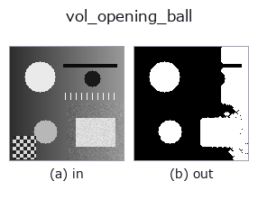
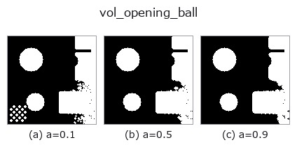
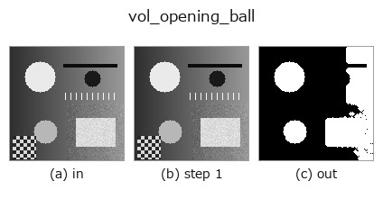
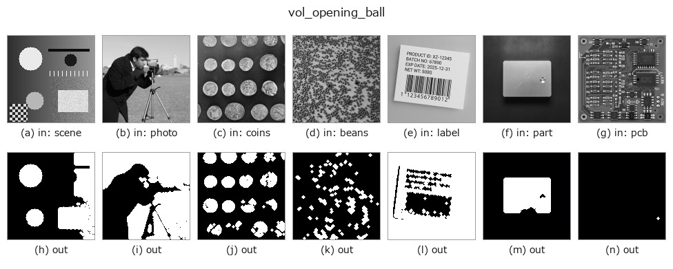
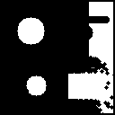

# vol_opening_ball — 2D `3d` op

- **データ種**: `volume` → `volume`
- **呼び出し**: `fullseye.apply(img, "vol_opening_ball", a=0.5, b=0.5)` (2-D は 1 画像 + 2 スカラつまみ `a,b∈[0,1]` のモデル)



*図は合成の入力 128×128 で実際に走らせた出力。左が入力、右が出力。点群は上から見た散布(明るさ = z)、1-D 列は折れ線、体積は z 方向の最大値投影、動画は中央フレーム、複素画像は振幅、絵にならない返り値は値そのもの。*

**つまみ a を振る**(0.1 / 0.5 / 0.9、もう一方は既定):



*つまみ b は出力を変えない(実測: 0.1 / 0.5 / 0.9 で同一)。*

**段階**(前置きの op → この op。左から順):



**別の画像でも**(合成シーン / 写真 / 硬貨。上段が入力、下段がその出力。つまみは既定):



**動き**(GIF: フレーム / 視点 / スライスを順に。静止の図が完成形で、GIF は補助):



## 使い方

球形構造要素による 3D 二値オープニング（侵食してから同じ球で膨張）。対応する HALCON op は指定されていない。

``a`` が球の半径を ``1〜4``（``1+int(3a)``）に振る。``b`` は未使用。侵食と膨張に同じ半径の球を使うため、球より小さい突起・細い連結だけを選択的に除去する。

## 詳しい使い方ガイド

- [gallery2d_physics_alife_3d ファミリ ガイド](../guides/gallery2d_physics_alife_3d.md)

## 参考(サンプルデータ・文献)

- [サンプルデータ カタログ(DL URL / ライセンス)](../../SAMPLES.md) — 2-D は skimage.data(BSD/public)+ 合成、3-D は実データ源(Stanford/PDS 等)の DL URL。
- [演算子の来歴・参考文献](../../../REFERENCES.md) — この op 族の元になった研究/手法の出典。
- アルゴリズムの正典(著者・年)と用途は上記**ファミリ使い方ガイド**に記載。

## Studio で試す

下のプログラムは実際に走ることを確かめてある(図と同じ入力)。Studio のヘルプではこのブロックがボタンになり、その場で読み込んで実行できる。

```program
img_to_volume 0.50 0.50
vol_opening_ball 0.50 0.50
```

## 実行できる例(この op を実際に呼ぶ検証済みサンプル)

- [gallery2d_physics_alife_3d](../../../../examples/gallery2d_physics_alife_3d.py) — `py -3.11 examples/gallery2d_physics_alife_3d.py`
- [poc_warehouse_flow](../../../../examples/poc_warehouse_flow.py) — `py -3.11 examples/poc_warehouse_flow.py`

## 型が繋がる次の op(`volume` を入力に取れる)

[identity](../misc/identity.md) · [vol_gaussian](vol_gaussian.md) · [vol_median](vol_median.md) · [vol_erode](vol_erode.md) · [vol_dilate](vol_dilate.md) · [vol_threshold](vol_threshold.md) · [vol_reg_dilate](vol_reg_dilate.md) · [vol_reg_erode](vol_reg_erode.md)

## 同カテゴリ(`3d`)

[vol_gaussian](vol_gaussian.md) · [vol_median](vol_median.md) · [vol_erode](vol_erode.md) · [vol_dilate](vol_dilate.md) · [vol_threshold](vol_threshold.md) · [vol_reg_dilate](vol_reg_dilate.md) · [vol_reg_erode](vol_reg_erode.md) · [vol_dilation_ball](vol_dilation_ball.md)

---
*Provenance: ops.py — 2D operator registry. この per-op ノートは `tools/opdocs.py md` が自動生成(手編集しない)。*

© 2026 Kazufumi Furuse — Fullseye operator documentation. Licensed under Apache-2.0.
