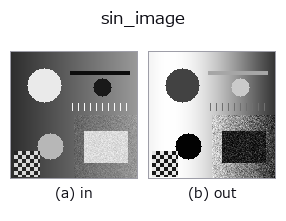
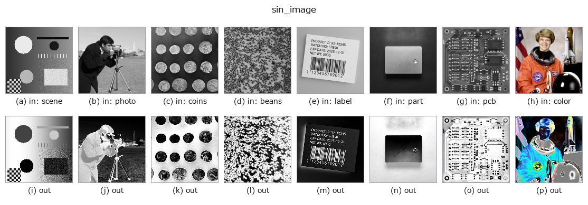

# sin_image — 2D `arithmetic` op

- **データ種**: `image` → `image`
- **呼び出し**: `fullseye.apply(img, "sin_image", a=0.5, b=0.5)` (2-D は 1 画像 + 2 スカラつまみ `a,b∈[0,1]` のモデル)
- **HALCON 相当**: `sin_image`(意味・パラメータは HALCON リファレンスが参考になる)



*図は合成の入力 128×128 で実際に走らせた出力。左が入力、右が出力。点群は上から見た散布(明るさ = z)、1-D 列は折れ線、体積は z 方向の最大値投影、動画は中央フレーム、複素画像は振幅、絵にならない返り値は値そのもの。*

*つまみ a は出力を変えない(実測: 0.1 / 0.5 / 0.9 で同一)。*

*つまみ b は出力を変えない(実測: 0.1 / 0.5 / 0.9 で同一)。*

**別の画像でも**(合成シーン / 写真 / 硬貨。上段が入力、下段がその出力。つまみは既定):



*4 列目はカラー (H,W,3) の入力。この op は色を跨がずに扱える(色チャネルを 3 本目の空間軸として畳み込まない)。*

## 使い方

``(sin(2πx) + 1) / 2`` で階調を正弦波状に折り返す周期 LUT。x=0 と x=1 で
0.5 に戻り、x=0.25/0.75 付近で 0/1 に達する ―― 単調増加ではなく**同じ出力を
複数の入力階調が共有する**非可逆変換になる。HALCON の ``sin_image``
（Calculate the sine of an image.）の代役。

``a``, ``b`` は未使用。周期や位相を変える調整点は無い。等高線状の疑似カラー
効果や階調の折返しを作る用途向けで、通常のコントラスト調整には向かない。

## 詳しい使い方ガイド

- [gallery2d_gray_arith ファミリ ガイド](../guides/gallery2d_gray_arith.md)

## 参考(サンプルデータ・文献)

- [サンプルデータ カタログ(DL URL / ライセンス)](../../SAMPLES.md) — 2-D は skimage.data(BSD/public)+ 合成、3-D は実データ源(Stanford/PDS 等)の DL URL。
- [演算子の来歴・参考文献](../../../REFERENCES.md) — この op 族の元になった研究/手法の出典。
- アルゴリズムの正典(著者・年)と用途は上記**ファミリ使い方ガイド**に記載。

## Studio で試す

下のプログラムは実際に走ることを確かめてある(図と同じ入力)。Studio のヘルプではこのブロックがボタンになり、その場で読み込んで実行できる。

```program
sin_image 0.50 0.50
```

## 実行できる例(この op を実際に呼ぶ検証済みサンプル)

- [gallery2d_gray_arith](../../../../examples/gallery2d_gray_arith.py) — `py -3.11 examples/gallery2d_gray_arith.py`

## 型が繋がる次の op(`image` を入力に取れる)

[identity](../misc/identity.md) · [gaussian](../smoothing/gaussian.md) · [mean_box](../smoothing/mean_box.md) · [bilateral](../smoothing/bilateral.md) · [unsharp](../smoothing/unsharp.md) · [median](../rank/median.md) · [min_filter](../rank/min_filter.md) · [max_filter](../rank/max_filter.md)

## 同カテゴリ(`arithmetic`)

[abs_image](abs_image.md) · [sqrt_image](sqrt_image.md) · [exp_image](exp_image.md) · [log_image](log_image.md) · [cos_image](cos_image.md) · [asin_image](asin_image.md) · [acos_image](acos_image.md) · [atan_image](atan_image.md)

---
*Provenance: ops.py — 2D operator registry. この per-op ノートは `tools/opdocs.py md` が自動生成(手編集しない)。*

© 2026 Kazufumi Furuse — Fullseye operator documentation. Licensed under Apache-2.0.
