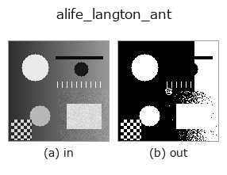
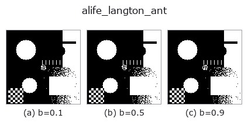
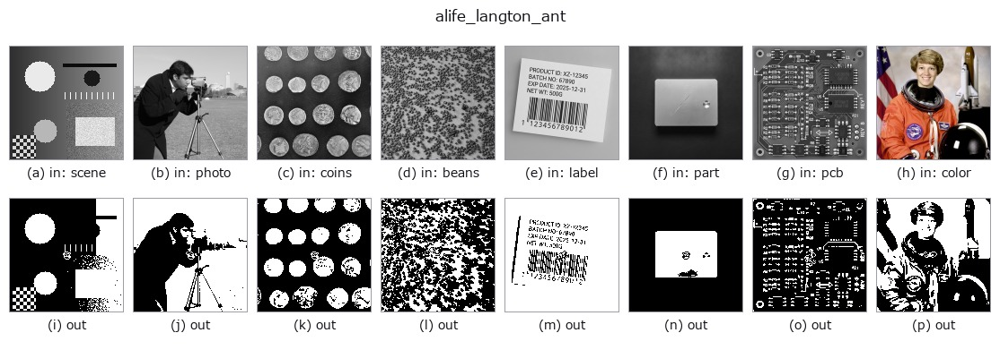

# alife_langton_ant — 2D `artificial-life` op

- **データ種**: `image` → `image`
- **呼び出し**: `fullseye.apply(img, "alife_langton_ant", a=0.5, b=0.5)` (2-D は 1 画像 + 2 スカラつまみ `a,b∈[0,1]` のモデル)



*図は合成の入力 128×128 で実際に走らせた出力。左が入力、右が出力。点群は上から見た散布(明るさ = z)、1-D 列は折れ線、体積は z 方向の最大値投影、動画は中央フレーム、複素画像は振幅、絵にならない返り値は値そのもの。*

**つまみ a を振る**(0.1 / 0.5 / 0.9、もう一方は既定):


**つまみ b を振る**(0.1 / 0.5 / 0.9、もう一方は既定):



**別の画像でも**(合成シーン / 写真 / 硬貨。上段が入力、下段がその出力。つまみは既定):



*4 列目はカラー (H,W,3) の入力。この op は色を跨がずに扱える(色チャネルを 3 本目の空間軸として畳み込まない)。*

## 使い方

Langton's ant (turmite) walking the thresholded image lattice.

Reimplements the two-colour turmite of C. G. Langton, "Studying artificial
life with cellular automata", Physica D 22, 120-149 (1986). Cell colours are
the 0.5-threshold of the image. A single ant starts at the grid centre and,
at every step, applies the RL rule:

  * on a **white** (0) cell: turn 90 degrees right, flip the cell to 1,
    step forward one cell;
  * on a **black** (1) cell: turn 90 degrees left, flip the cell to 0,
    step forward one cell.

Movement wraps toroidally. Because every visit flips the cell it stands on,
starting from an all-white lattice a cell is black exactly when the ant has
visited it an odd number of times.

``a`` sets the number of steps N = 1 + int(400a); ``b`` selects the initial
heading (up / right / down / left) which mirrors/rotates the whole
trajectory. Returns the final {0,1} colour field.

## 詳しい使い方ガイド

- [gallery2d_physics_alife_3d ファミリ ガイド](../guides/gallery2d_physics_alife_3d.md)

## 参考(サンプルデータ・文献)

- [サンプルデータ カタログ(DL URL / ライセンス)](../../SAMPLES.md) — 2-D は skimage.data(BSD/public)+ 合成、3-D は実データ源(Stanford/PDS 等)の DL URL。
- [演算子の来歴・参考文献](../../../REFERENCES.md) — この op 族の元になった研究/手法の出典。
- アルゴリズムの正典(著者・年)と用途は上記**ファミリ使い方ガイド**に記載。

## Studio で試す

下のプログラムは実際に走ることを確かめてある(図と同じ入力)。Studio のヘルプではこのブロックがボタンになり、その場で読み込んで実行できる。

```program
alife_langton_ant 0.50 0.50
```

## 実行できる例(この op を実際に呼ぶ検証済みサンプル)

- [gallery2d_physics_alife_3d](../../../../examples/gallery2d_physics_alife_3d.py) — `py -3.11 examples/gallery2d_physics_alife_3d.py`

## 型が繋がる次の op(`image` を入力に取れる)

[identity](../misc/identity.md) · [gaussian](../smoothing/gaussian.md) · [mean_box](../smoothing/mean_box.md) · [bilateral](../smoothing/bilateral.md) · [unsharp](../smoothing/unsharp.md) · [median](../rank/median.md) · [min_filter](../rank/min_filter.md) · [max_filter](../rank/max_filter.md)

## 同カテゴリ(`artificial-life`)

[alife_gray_scott](alife_gray_scott.md) · [alife_turing](alife_turing.md) · [alife_life_step](alife_life_step.md) · [alife_cyclic_ca](alife_cyclic_ca.md) · [alife_perona_malik](alife_perona_malik.md) · [alife_curvature_flow](alife_curvature_flow.md) · [alife_dla](alife_dla.md) · [alife_reaction_bz](alife_reaction_bz.md)

---
*Provenance: ops.py — 2D operator registry. この per-op ノートは `tools/opdocs.py md` が自動生成(手編集しない)。*

© 2026 Kazufumi Furuse — Fullseye operator documentation. Licensed under Apache-2.0.
