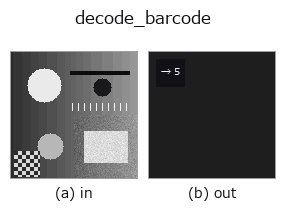

# decode_barcode — 2D `barcode` op

- **データ種**: `image` → `feature`
- **呼び出し**: `fullseye.apply(img, "decode_barcode", a=0.5, b=0.5)` (2-D は 1 画像 + 2 スカラつまみ `a,b∈[0,1]` のモデル)
- **HALCON 相当**: `find_bar_code`(意味・パラメータは HALCON リファレンスが参考になる)



*図は合成の入力 128×128 で実際に走らせた出力。左が入力、右が出力(絵にならない返り値は値そのもの)。*

## 使い方

中央走査線上の明暗の切り替わり回数を数える簡易バーコード風特徴量。HALCON の ``find_bar_code``（Detect and read bar code symbols in an image.）とは似て非なるもので、シンボル体系の判定やデータのデコードは一切行わない（バー「数」を数えるだけ）。

``a`` が「暗い」とみなすしきい値を ``0.3〜0.7`` に振る。``b`` は未使用。画像中央の行（``v.shape[0]//2``）だけを見て、``v < しきい値`` の画素を 1 とした列に対し、0→1 に立ち上がる回数（暗いバーの本数）を数える。実際のバーコードのデータ（数字・文字列）は得られない。

## 詳しい使い方ガイド

- [gallery2d_physics_alife_3d ファミリ ガイド](../guides/gallery2d_physics_alife_3d.md)

## 参考(サンプルデータ・文献)

- [サンプルデータ カタログ(DL URL / ライセンス)](../../SAMPLES.md) — 2-D は skimage.data(BSD/public)+ 合成、3-D は実データ源(Stanford/PDS 等)の DL URL。
- [演算子の来歴・参考文献](../../../REFERENCES.md) — この op 族の元になった研究/手法の出典。
- アルゴリズムの正典(著者・年)と用途は上記**ファミリ使い方ガイド**に記載。

## Studio で試す

下のプログラムは実際に走ることを確かめてある(図と同じ入力)。Studio のヘルプではこのブロックがボタンになり、その場で読み込んで実行できる。

```program
decode_barcode 0.50 0.50
```

## 実行できる例(この op を実際に呼ぶ検証済みサンプル)

- [gallery2d_physics_alife_3d](../../../../examples/gallery2d_physics_alife_3d.py) — `py -3.11 examples/gallery2d_physics_alife_3d.py`
- [poc_barcode_1d](../../../../examples/poc_barcode_1d.py) — `py -3.11 examples/poc_barcode_1d.py`

## 型が繋がる次の op(`feature` を入力に取れる)

[identity](../misc/identity.md)

## 同カテゴリ(`barcode`)

—

---
*Provenance: ops.py — 2D operator registry. この per-op ノートは `tools/opdocs.py md` が自動生成(手編集しない)。*

© 2026 Kazufumi Furuse — Fullseye operator documentation. Licensed under Apache-2.0.
