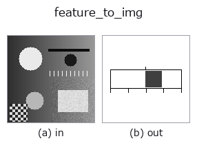
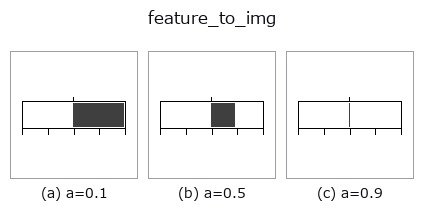
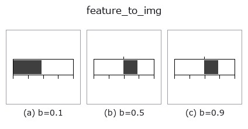
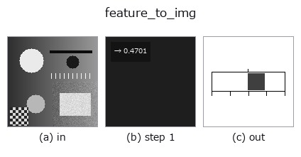
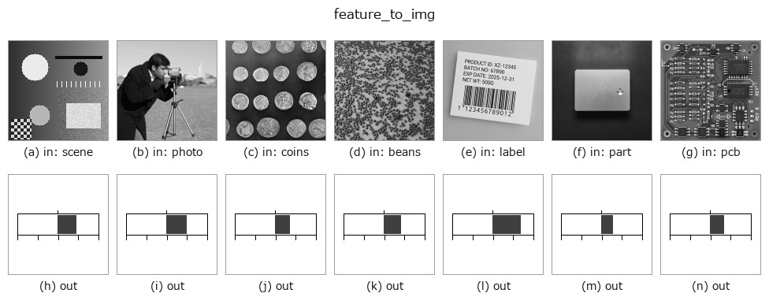

# feature_to_img — 2D `bridge` op

- **データ種**: `feature` → `image`
- **呼び出し**: `fullseye.apply(img, "feature_to_img", a=0.5, b=0.5)` (2-D は 1 画像 + 2 スカラつまみ `a,b∈[0,1]` のモデル)



*図は合成の入力 128×128 で実際に走らせた出力。左が入力、右が出力。点群は上から見た散布(明るさ = z)、1-D 列は折れ線、体積は z 方向の最大値投影、動画は中央フレーム、複素画像は振幅、絵にならない返り値は値そのもの。*

**つまみ a を振る**(0.1 / 0.5 / 0.9、もう一方は既定):



**つまみ b を振る**(0.1 / 0.5 / 0.9、もう一方は既定):



**段階**(前置きの op → この op。左から順):



**別の画像でも**(合成シーン / 写真 / 硬貨。上段が入力、下段がその出力。つまみは既定):



## 使い方

スカラの feature を**目盛りつきの帯**にして画像へ戻す —— 2-D 台帳で
**125 本の op が作るのに、画像に落とせる op が 1 本も無かった** sort。

★**数字そのものは描かない。** 文字を焼くと絵が**環境に入っている書体**で
変わり、同じ入力で同じ画素という契約が壊れる。描くのは値の**位置**で、
目盛り(0・1/4・1/2・3/4・1)が読みの手掛かりになる。数値が要るなら
``annotate_table`` / ``annotate_leader``(paper 族)に渡すこと。

- ``a`` → スケールの上限 ``hi = 10 ** (4a - 2)``(a=0 で 0.01、a=0.5 で **1.0**、
  a=1 で 100)。特徴量は桁がまちまちなので、見たい桁をここで選ぶ。
- ``b`` → 目盛りの張り方。``b < 0.5`` は **片側** ``[0, hi]``(左端が 0)、
  ``b >= 0.5`` は **両側** ``[-hi, +hi]``(**中央が 0**。相関・歪度など符号の
  ある量向け)。
- 上限を超える値は**端で止める**(帯が振り切れた状態 = 「スケールが小さい」の
  合図)。★NaN / Inf は**白紙**を返す(振り切れと区別する)。
- 返り値: ``(128, 128)`` float64、白地([0,1])。

## 詳しい使い方ガイド

- [gallery2d_bridge ファミリ ガイド](../guides/gallery2d_bridge.md)

## 参考(サンプルデータ・文献)

- [サンプルデータ カタログ(DL URL / ライセンス)](../../SAMPLES.md) — 2-D は skimage.data(BSD/public)+ 合成、3-D は実データ源(Stanford/PDS 等)の DL URL。
- [演算子の来歴・参考文献](../../../REFERENCES.md) — この op 族の元になった研究/手法の出典。
- アルゴリズムの正典(著者・年)と用途は上記**ファミリ使い方ガイド**に記載。

## Studio で試す

下のプログラムは実際に走ることを確かめてある(図と同じ入力)。Studio のヘルプではこのブロックがボタンになり、その場で読み込んで実行できる。

```program
intensity 0.50 0.50
feature_to_img 0.50 0.50
```

## 実行できる例(この op を実際に呼ぶ検証済みサンプル)

- [gallery2d_bridge](../../../../examples/gallery2d_bridge.py) — `py -3.11 examples/gallery2d_bridge.py`

## 型が繋がる次の op(`image` を入力に取れる)

[identity](../misc/identity.md) · [gaussian](../smoothing/gaussian.md) · [mean_box](../smoothing/mean_box.md) · [bilateral](../smoothing/bilateral.md) · [unsharp](../smoothing/unsharp.md) · [median](../rank/median.md) · [min_filter](../rank/min_filter.md) · [max_filter](../rank/max_filter.md)

## 同カテゴリ(`bridge`)

[img_to_points](img_to_points.md) · [img_to_keypoints](img_to_keypoints.md) · [img_to_signal](img_to_signal.md) · [img_to_projection_profile](img_to_projection_profile.md) · [img_to_counts](img_to_counts.md) · [img_to_matrix](img_to_matrix.md) · [img_to_video](img_to_video.md) · [img_to_volume](img_to_volume.md)

---
*Provenance: ops.py — 2D operator registry. この per-op ノートは `tools/opdocs.py md` が自動生成(手編集しない)。*

© 2026 Kazufumi Furuse — Fullseye operator documentation. Licensed under Apache-2.0.
