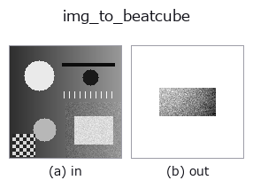
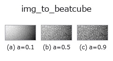
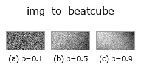
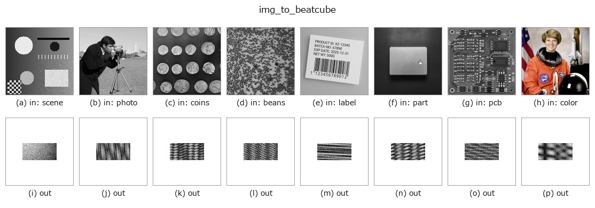

# img_to_beatcube — 2D `bridge` op

- **データ種**: `image` → `beatcube`
- **呼び出し**: `fullseye.apply(img, "img_to_beatcube", a=0.5, b=0.5)` (2-D は 1 画像 + 2 スカラつまみ `a,b∈[0,1]` のモデル)



*図は合成の入力 128×128 で実際に走らせた出力。左が入力、右が出力。点群は上から見た散布(明るさ = z)、1-D 列は折れ線、体積は z 方向の最大値投影、動画は中央フレーム、複素画像は振幅、絵にならない返り値は値そのもの。*

**つまみ a を振る**(0.1 / 0.5 / 0.9、もう一方は既定):



**つまみ b を振る**(0.1 / 0.5 / 0.9、もう一方は既定):



**別の画像でも**(合成シーン / 写真 / 硬貨。上段が入力、下段がその出力。つまみは既定):



*4 列目はカラー (H,W,3) の入力。この op は色を跨がずに扱える(色チャネルを 3 本目の空間軸として畳み込まない)。*

## 使い方

画像の明点を FMCW レーダーの標的(距離 = 列、速度 = 行)として読み、複素ビート立方体 (A,C,S) にする。

平滑化(σ=2)した画像の局所極大を値の降順に ``K`` 個拾い、各点を標的にする:
``range_m = 2 + 30 * col / W``、``velocity_ms = 15 * (2 * row / H - 1)``、
振幅 = 画素値。前方モデルは台帳の ``fmcw_beat_simulate``(``rangedoppler``)
そのもので、``n_samples = 64、n_chirps = 32、n_antennas = 4``(素子間隔は
既定の半波長、標的はすべて正面 = 到来角 0°)、その他は
同関数の既定(標本化 10 MHz、掃引 20 THz/s、チャープ周期 50 µs、波長 3.89 mm)。
この既定では **距離は 0〜37.5 m、速度は ±19.5 m/s が曖昧さの無い範囲** で、
上の写像はその内側に収まる。

- ``a`` → 複素白色雑音の σ ``= 0.5 * a``(a=0 で無雑音)。
- ``b`` → 標的数 ``K = 1 + int(b * 6)``(b=0.5 で 4。極大が足りなければその数)。
- 返り値: ``(4, 32, 64)`` complex128。``tb_range_doppler_map`` で 2-D FFT すると
  標的ごとの峰が「列 → 距離ビン、行 → ドップラービン」に立ち、
  ``tb_beamform_delay_sum`` は 4 素子で到来角 0° の峰を返す。
- 乱数 seed は 0 固定(決定的)。速度の符号は ``fmcw_beat_simulate`` の規約
  (**正 = 遠ざかる**)。

## 詳しい使い方ガイド

- [gallery2d_bridge ファミリ ガイド](../guides/gallery2d_bridge.md)

## 参考(サンプルデータ・文献)

- [サンプルデータ カタログ(DL URL / ライセンス)](../../SAMPLES.md) — 2-D は skimage.data(BSD/public)+ 合成、3-D は実データ源(Stanford/PDS 等)の DL URL。
- [演算子の来歴・参考文献](../../../REFERENCES.md) — この op 族の元になった研究/手法の出典。
- アルゴリズムの正典(著者・年)と用途は上記**ファミリ使い方ガイド**に記載。

## Studio で試す

下のプログラムは実際に走ることを確かめてある(図と同じ入力)。Studio のヘルプではこのブロックがボタンになり、その場で読み込んで実行できる。

```program
img_to_beatcube 0.50 0.50
```

## 実行できる例(この op を実際に呼ぶ検証済みサンプル)

- [gallery2d_bridge](../../../../examples/gallery2d_bridge.py) — `py -3.11 examples/gallery2d_bridge.py`

## 型が繋がる次の op(`beatcube` を入力に取れる)

[identity](../misc/identity.md) · [tb_fmcw_window_apply](../typed/tb_fmcw_window_apply.md) · [tb_range_doppler_map](../typed/tb_range_doppler_map.md) · [tb_fmcw_range_profile](../typed/tb_fmcw_range_profile.md) · [tb_beamform_delay_sum](../typed/tb_beamform_delay_sum.md)

## 同カテゴリ(`bridge`)

[img_to_points](img_to_points.md) · [img_to_keypoints](img_to_keypoints.md) · [img_to_signal](img_to_signal.md) · [img_to_counts](img_to_counts.md) · [img_to_matrix](img_to_matrix.md) · [img_to_video](img_to_video.md) · [img_to_volume](img_to_volume.md) · [img_to_lightfield](img_to_lightfield.md)

---
*Provenance: ops.py — 2D operator registry. この per-op ノートは `tools/opdocs.py md` が自動生成(手編集しない)。*

© 2026 Kazufumi Furuse — Fullseye operator documentation. Licensed under Apache-2.0.
