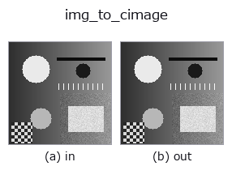
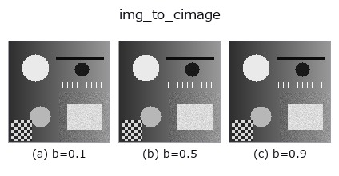
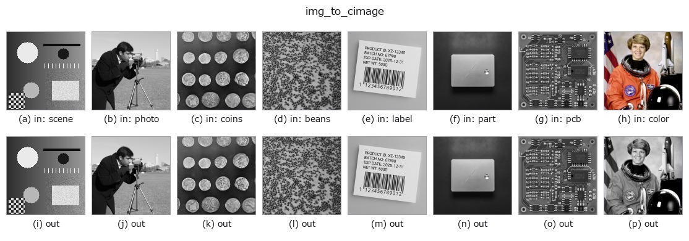

# img_to_cimage — 2D `bridge` op

- **データ種**: `image` → `cimage`
- **呼び出し**: `fullseye.apply(img, "img_to_cimage", a=0.5, b=0.5)` (2-D は 1 画像 + 2 スカラつまみ `a,b∈[0,1]` のモデル)



*図は合成の入力 128×128 で実際に走らせた出力。左が入力、右が出力。点群は上から見た散布(明るさ = z)、1-D 列は折れ線、体積は z 方向の最大値投影、動画は中央フレーム、複素画像は振幅、絵にならない返り値は値そのもの。*

**つまみ a を振る**(0.1 / 0.5 / 0.9、もう一方は既定):


**つまみ b を振る**(0.1 / 0.5 / 0.9、もう一方は既定):



**別の画像でも**(合成シーン / 写真 / 硬貨。上段が入力、下段がその出力。つまみは既定):



*4 列目はカラー (H,W,3) の入力。この op は色を跨がずに扱える(色チャネルを 3 本目の空間軸として畳み込まない)。*

## 使い方

画像を振幅とし、位相を画素値と傾きから与えた複素場 (H,W) complex128 にする。

``field = img * exp(i * (2π * a * img + 2π * (b - 0.5) * 8 * x / W))``。
振幅 = 画素値(透過率・開口として読む)、位相は **値に比例する成分**(位相物体
としての厚み)と **x 方向の線形な傾き**(平面波の入射角)の和。角スペクトル法
``tb_angular_spectrum_propagate`` や ``tb_cx_*`` の族が受ける複素画像の合成器。

- ``a`` → 位相の深さ ``2π * a * img``(a=0 で実場、a=0.5 で最大 π)。
- ``b`` → 傾き。``(b - 0.5) * 8`` 周期ぶんの線形位相を x 方向に掛ける
  (b=0.5 で傾き 0。8 は「128 px で 8 縞」の目安)。
- 返り値: ``(H, W)`` complex128。``|field| = img``、``arg`` は上式。
- 値 0 の画素は位相が定義できない(``0 * exp(iφ) = 0``)。

## 詳しい使い方ガイド

- [gallery2d_bridge ファミリ ガイド](../guides/gallery2d_bridge.md)

## 参考(サンプルデータ・文献)

- [サンプルデータ カタログ(DL URL / ライセンス)](../../SAMPLES.md) — 2-D は skimage.data(BSD/public)+ 合成、3-D は実データ源(Stanford/PDS 等)の DL URL。
- [演算子の来歴・参考文献](../../../REFERENCES.md) — この op 族の元になった研究/手法の出典。
- アルゴリズムの正典(著者・年)と用途は上記**ファミリ使い方ガイド**に記載。

## Studio で試す

下のプログラムは実際に走ることを確かめてある(図と同じ入力)。Studio のヘルプではこのブロックがボタンになり、その場で読み込んで実行できる。

```program
img_to_cimage 0.50 0.50
```

## 実行できる例(この op を実際に呼ぶ検証済みサンプル)

- [gallery2d_bridge](../../../../examples/gallery2d_bridge.py) — `py -3.11 examples/gallery2d_bridge.py`

## 型が繋がる次の op(`cimage` を入力に取れる)

[identity](../misc/identity.md) · [tb_cx_ifft](../typed/tb_cx_ifft.md) · [tb_cx_magnitude](../typed/tb_cx_magnitude.md) · [tb_cx_phase](../typed/tb_cx_phase.md) · [tb_cx_real](../typed/tb_cx_real.md) · [tb_cx_imag](../typed/tb_cx_imag.md) · [tb_cx_log_magnitude](../typed/tb_cx_log_magnitude.md) · [tb_cx_apply_transfer_function](../typed/tb_cx_apply_transfer_function.md)

## 同カテゴリ(`bridge`)

[img_to_points](img_to_points.md) · [img_to_keypoints](img_to_keypoints.md) · [img_to_signal](img_to_signal.md) · [img_to_counts](img_to_counts.md) · [img_to_matrix](img_to_matrix.md) · [img_to_video](img_to_video.md) · [img_to_volume](img_to_volume.md) · [img_to_lightfield](img_to_lightfield.md)

---
*Provenance: ops.py — 2D operator registry. この per-op ノートは `tools/opdocs.py md` が自動生成(手編集しない)。*

© 2026 Kazufumi Furuse — Fullseye operator documentation. Licensed under Apache-2.0.
