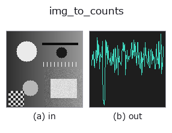
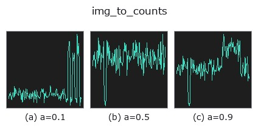
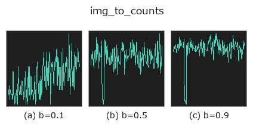
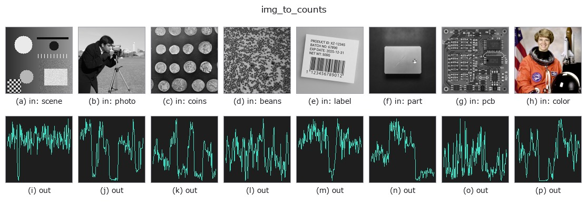

# img_to_counts — 2D `bridge` op

- **データ種**: `image` → `counts`
- **呼び出し**: `fullseye.apply(img, "img_to_counts", a=0.5, b=0.5)` (2-D は 1 画像 + 2 スカラつまみ `a,b∈[0,1]` のモデル)



*図は合成の入力 128×128 で実際に走らせた出力。左が入力、右が出力。点群は上から見た散布(明るさ = z)、1-D 列は折れ線、体積は z 方向の最大値投影、動画は中央フレーム、複素画像は振幅、絵にならない返り値は値そのもの。*

**つまみ a を振る**(0.1 / 0.5 / 0.9、もう一方は既定):



**つまみ b を振る**(0.1 / 0.5 / 0.9、もう一方は既定):



**別の画像でも**(合成シーン / 写真 / 硬貨。上段が入力、下段がその出力。つまみは既定):



*4 列目はカラー (H,W,3) の入力。この op は色を跨がずに扱える(色チャネルを 3 本目の空間軸として畳み込まない)。*

## 使い方

画像の 1 行(または 1 列)を光子の期待値として読み、Poisson 標本の 1-D カウント列にする。

``expected = profile * n_max`` を期待値とする Poisson 乱数(固定 seed 20260907)。
光子計数の族(``tb_counts_to_countrate`` / ``tb_spad_deadtime_apply`` /
``tb_tcspc_background_subtract`` …)が受ける **非負整数の 1-D 列** の合成器で、
``tcspc_simulate`` と同じく「期待値が既知」なのが検算の根拠になる。

- ``a`` → 行/列の位置(``img_to_signal`` と同じ規則。``b`` が向きも決める)。
- ``b`` → ``b < 0.5`` で行、``b ≥ 0.5`` で列。加えて **1 画素あたりの最大光子数**
  ``n_max = 10 ** (1 + 2 * b)``(b=0 で 10、b=0.5 で 100、b=1 で 1,000)。
  少ないほど散布雑音が目立つ。
- 返り値: 1-D ``int64``、非負。長さは行なら W、列なら H。
- 決定的(seed 固定)。同じ入力・同じノブなら同じ列。

注意: 期待値 0 の画素はカウント 0 になる(Poisson(0) は常に 0)。

## 詳しい使い方ガイド

- [gallery2d_bridge ファミリ ガイド](../guides/gallery2d_bridge.md)

## 参考(サンプルデータ・文献)

- [サンプルデータ カタログ(DL URL / ライセンス)](../../SAMPLES.md) — 2-D は skimage.data(BSD/public)+ 合成、3-D は実データ源(Stanford/PDS 等)の DL URL。
- [演算子の来歴・参考文献](../../../REFERENCES.md) — この op 族の元になった研究/手法の出典。
- アルゴリズムの正典(著者・年)と用途は上記**ファミリ使い方ガイド**に記載。

## Studio で試す

下のプログラムは実際に走ることを確かめてある(図と同じ入力)。Studio のヘルプではこのブロックがボタンになり、その場で読み込んで実行できる。

```program
img_to_counts 0.50 0.50
```

## 実行できる例(この op を実際に呼ぶ検証済みサンプル)

- [gallery2d_bridge](../../../../examples/gallery2d_bridge.py) — `py -3.11 examples/gallery2d_bridge.py`

## 型が繋がる次の op(`counts` を入力に取れる)

[identity](../misc/identity.md) · [tb_spad_deadtime_apply](../typed/tb_spad_deadtime_apply.md) · [tb_spad_deadtime_correct](../typed/tb_spad_deadtime_correct.md) · [tb_tcspc_coates_correct](../typed/tb_tcspc_coates_correct.md) · [tb_tcspc_irf_convolve](../typed/tb_tcspc_irf_convolve.md) · [tb_tcspc_background_subtract](../typed/tb_tcspc_background_subtract.md) · [tb_dtof_depth](../typed/tb_dtof_depth.md) · [tb_countrate_to_counts](../typed/tb_countrate_to_counts.md)

## 同カテゴリ(`bridge`)

[img_to_points](img_to_points.md) · [img_to_keypoints](img_to_keypoints.md) · [img_to_signal](img_to_signal.md) · [img_to_matrix](img_to_matrix.md) · [img_to_video](img_to_video.md) · [img_to_volume](img_to_volume.md) · [img_to_lightfield](img_to_lightfield.md) · [img_to_rgb](img_to_rgb.md)

---
*Provenance: ops.py — 2D operator registry. この per-op ノートは `tools/opdocs.py md` が自動生成(手編集しない)。*

© 2026 Kazufumi Furuse — Fullseye operator documentation. Licensed under Apache-2.0.
