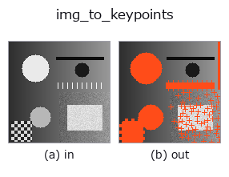
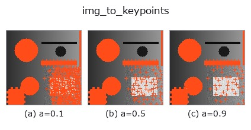
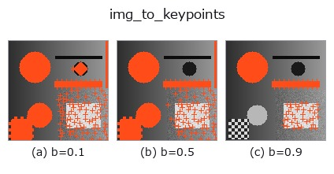
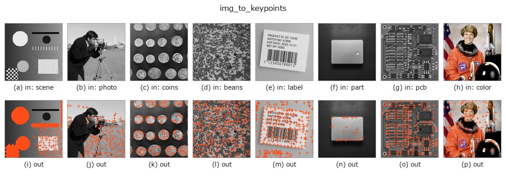

# img_to_keypoints — 2D `bridge` op

- **データ種**: `image` → `keypoints`
- **呼び出し**: `fullseye.apply(img, "img_to_keypoints", a=0.5, b=0.5)` (2-D は 1 画像 + 2 スカラつまみ `a,b∈[0,1]` のモデル)



*図は合成の入力 128×128 で実際に走らせた出力。左が入力、右が出力。点群は上から見た散布(明るさ = z)、1-D 列は折れ線、体積は z 方向の最大値投影、動画は中央フレーム、複素画像は振幅、絵にならない返り値は値そのもの。*

**つまみ a を振る**(0.1 / 0.5 / 0.9、もう一方は既定):



**つまみ b を振る**(0.1 / 0.5 / 0.9、もう一方は既定):



**別の画像でも**(合成シーン / 写真 / 硬貨。上段が入力、下段がその出力。つまみは既定):



*4 列目はカラー (H,W,3) の入力。この op は色を跨がずに扱える(色チャネルを 3 本目の空間軸として畳み込まない)。*

## 使い方

画像の局所極大を像面上の点 (u, v) = (col, row) の (N,2) にする。

``scipy.ndimage.maximum_filter`` で窓内最大と一致し、かつ値がしきい値以上の
画素を極大とする(同値の平坦部は全画素が極大になる —— 前段に ``gaussian``
を置くと減る)。

- ``a`` → 窓の一辺 ``k = 3 + 2 * int(a * 4)``(a=0.5 で 7。大きいほど疎)。
- ``b`` → しきい値 ``thr = b``(値 ≥ thr の極大だけ残す。b=0 で全極大)。
- 返り値: ``(N, 2)`` float64 の ``(u, v) = (col, row)``。値の降順、同値は
  行優先で並ぶ(決定的)。**極大が 1 つも無ければ (0, 2)** —— 空でも形の
  契約は満たすが、下流の op によっては空を拒否する。
- 画像の縁は ``mode="nearest"`` で処理するので縁の画素も極大になりうる。

使いどころ: ``tb_keypoints_to_image2d``(点を画像に戻す)、
``tb_keypoints_uv_to_points``(z=0 の点群にする)への入口。

## 詳しい使い方ガイド

- [gallery2d_bridge ファミリ ガイド](../guides/gallery2d_bridge.md)

## 参考(サンプルデータ・文献)

- [サンプルデータ カタログ(DL URL / ライセンス)](../../SAMPLES.md) — 2-D は skimage.data(BSD/public)+ 合成、3-D は実データ源(Stanford/PDS 等)の DL URL。
- [演算子の来歴・参考文献](../../../REFERENCES.md) — この op 族の元になった研究/手法の出典。
- アルゴリズムの正典(著者・年)と用途は上記**ファミリ使い方ガイド**に記載。

## Studio で試す

下のプログラムは実際に走ることを確かめてある(図と同じ入力)。Studio のヘルプではこのブロックがボタンになり、その場で読み込んで実行できる。

```program
img_to_keypoints 0.50 0.50
```

## 実行できる例(この op を実際に呼ぶ検証済みサンプル)

- [gallery2d_bridge](../../../../examples/gallery2d_bridge.py) — `py -3.11 examples/gallery2d_bridge.py`

## 型が繋がる次の op(`keypoints` を入力に取れる)

[identity](../misc/identity.md) · [tb_keypoints_uv_to_points](../typed/tb_keypoints_uv_to_points.md) · [tb_keypoints_to_image2d](../typed/tb_keypoints_to_image2d.md)

## 同カテゴリ(`bridge`)

[img_to_points](img_to_points.md) · [img_to_signal](img_to_signal.md) · [img_to_counts](img_to_counts.md) · [img_to_matrix](img_to_matrix.md) · [img_to_video](img_to_video.md) · [img_to_volume](img_to_volume.md) · [img_to_lightfield](img_to_lightfield.md) · [img_to_rgb](img_to_rgb.md)

---
*Provenance: ops.py — 2D operator registry. この per-op ノートは `tools/opdocs.py md` が自動生成(手編集しない)。*

© 2026 Kazufumi Furuse — Fullseye operator documentation. Licensed under Apache-2.0.
