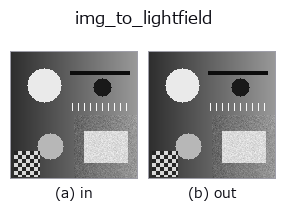
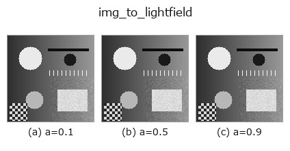
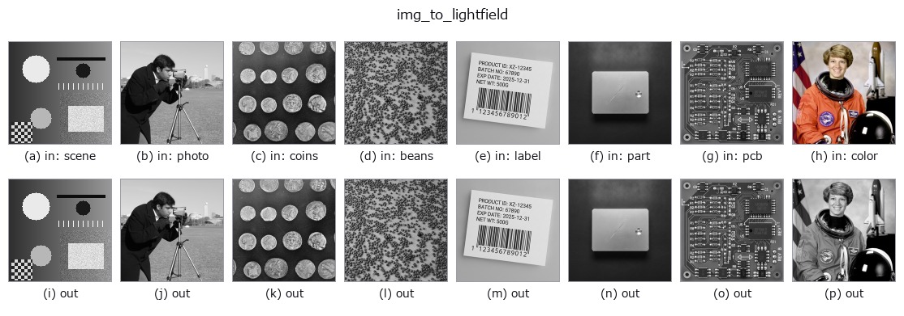
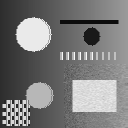

# img_to_lightfield — 2D `bridge` op

- **データ種**: `image` → `lightfield`
- **呼び出し**: `fullseye.apply(img, "img_to_lightfield", a=0.5, b=0.5)` (2-D は 1 画像 + 2 スカラつまみ `a,b∈[0,1]` のモデル)



*図は合成の入力 128×128 で実際に走らせた出力。左が入力、右が出力。点群は上から見た散布(明るさ = z)、1-D 列は折れ線、体積は z 方向の最大値投影、動画は中央フレーム、複素画像は振幅、絵にならない返り値は値そのもの。*

**つまみ a を振る**(0.1 / 0.5 / 0.9、もう一方は既定):



**つまみ b を振る**(0.1 / 0.5 / 0.9、もう一方は既定):


**別の画像でも**(合成シーン / 写真 / 硬貨。上段が入力、下段がその出力。つまみは既定):



*4 列目はカラー (H,W,3) の入力。この op は色を跨がずに扱える(色チャネルを 3 本目の空間軸として畳み込まない)。*

**動き**(GIF: フレーム / 視点 / スライスを順に。静止の図が完成形で、GIF は補助):



## 使い方

画像を前景/背景の 2 層に分け、視差つきの 4-D ライトフィールド (V,U,H,W) にする。

``lf_synthesize`` と同じ前方モデルの 2 層版: 視点 ``(v, u)`` は層ごとに
``(slope * (v - v_c), slope * (u - u_c))`` だけ画像をずらして見る(線形補間、
縁は最近傍)。背景層は傾き 0(無限遠)、前景層(しきい値以上の画素)は傾き
``slope`` で、前景が背景を**遮蔽**する(視点ごとにマスクもずらす)。
変位が角度インデックスに線形なので、EPI の傾き・リフォーカスの最良スロープ・
両端視点の視差 ``slope * (U - 1)`` がすべて閉形式で分かる。

- ``a`` → 前景の傾き ``slope = 1.5 * a`` 画素/視点(a=0.5 で 0.75。5×5 なら
  両端で 3 px)。
- ``b`` → 前景のしきい値 ``thr = b``(``img >= thr`` が前景。b=0.5 で明るい部分)。
- 角度サンプルは ``LF_ANGULAR = (5, 5)``。返り値 ``(5, 5, H, W)`` float64。
- 中央視点 ``(2, 2)`` は入力そのもの(ずれ 0)。

使いどころ: ``tb_lf_epi`` / ``tb_lf_refocus`` / ``tb_lf_depth_from_focus`` の入口。
深度推定の答えは「前景 = slope、背景 = 0」の 2 値。

## 詳しい使い方ガイド

- [gallery2d_bridge ファミリ ガイド](../guides/gallery2d_bridge.md)

## 参考(サンプルデータ・文献)

- [サンプルデータ カタログ(DL URL / ライセンス)](../../SAMPLES.md) — 2-D は skimage.data(BSD/public)+ 合成、3-D は実データ源(Stanford/PDS 等)の DL URL。
- [演算子の来歴・参考文献](../../../REFERENCES.md) — この op 族の元になった研究/手法の出典。
- アルゴリズムの正典(著者・年)と用途は上記**ファミリ使い方ガイド**に記載。

## Studio で試す

下のプログラムは実際に走ることを確かめてある(図と同じ入力)。Studio のヘルプではこのブロックがボタンになり、その場で読み込んで実行できる。

```program
img_to_lightfield 0.50 0.50
```

## 実行できる例(この op を実際に呼ぶ検証済みサンプル)

- [gallery2d_bridge](../../../../examples/gallery2d_bridge.py) — `py -3.11 examples/gallery2d_bridge.py`

## 型が繋がる次の op(`lightfield` を入力に取れる)

[identity](../misc/identity.md) · [tb_lf_to_mla](../typed/tb_lf_to_mla.md) · [tb_lf_subaperture](../typed/tb_lf_subaperture.md) · [tb_lf_center_view](../typed/tb_lf_center_view.md) · [tb_lf_epi](../typed/tb_lf_epi.md) · [tb_lf_refocus](../typed/tb_lf_refocus.md) · [tb_lf_synthetic_aperture](../typed/tb_lf_synthetic_aperture.md) · [tb_lf_depth_from_focus](../typed/tb_lf_depth_from_focus.md)

## 同カテゴリ(`bridge`)

[img_to_points](img_to_points.md) · [img_to_keypoints](img_to_keypoints.md) · [img_to_signal](img_to_signal.md) · [img_to_counts](img_to_counts.md) · [img_to_matrix](img_to_matrix.md) · [img_to_video](img_to_video.md) · [img_to_volume](img_to_volume.md) · [img_to_rgb](img_to_rgb.md)

---
*Provenance: ops.py — 2D operator registry. この per-op ノートは `tools/opdocs.py md` が自動生成(手編集しない)。*

© 2026 Kazufumi Furuse — Fullseye operator documentation. Licensed under Apache-2.0.
