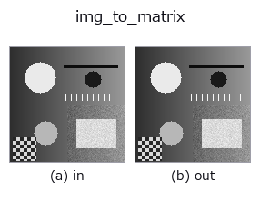
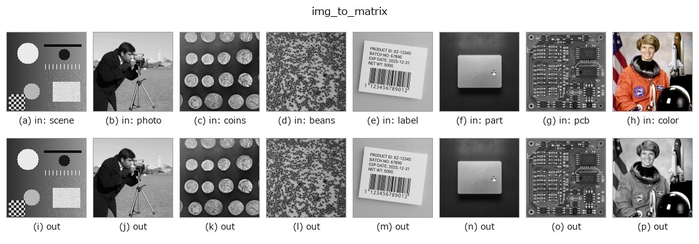

# img_to_matrix — 2D `bridge` op

- **データ種**: `image` → `matrix`
- **呼び出し**: `fullseye.apply(img, "img_to_matrix", a=0.5, b=0.5)` (2-D は 1 画像 + 2 スカラつまみ `a,b∈[0,1]` のモデル)



*図は合成の入力 128×128 で実際に走らせた出力。左が入力、右が出力。点群は上から見た散布(明るさ = z)、1-D 列は折れ線、体積は z 方向の最大値投影、動画は中央フレーム、複素画像は振幅、絵にならない返り値は値そのもの。*

*つまみ a は出力を変えない(実測: 0.1 / 0.5 / 0.9 で同一)。*

*つまみ b は出力を変えない(実測: 0.1 / 0.5 / 0.9 で同一)。*

**別の画像でも**(合成シーン / 写真 / 硬貨。上段が入力、下段がその出力。つまみは既定):



*4 列目はカラー (H,W,3) の入力。この op は色を跨がずに扱える(色チャネルを 3 本目の空間軸として畳み込まない)。*

## 使い方

画像 (H,W) をそのまま H×W の数値行列(sort ``matrix``)として扱う —— 純粋なキャスト。

値も形も変えない(``float64`` へのコピーのみ)。線形代数の族
(``tb_mat_cond`` / ``tb_mat_pinv`` / ``tb_stat_covariance`` …)に画像を渡す
ための型の読み替えで、**a, b は未使用**。

注意: 画像は一般に正則でも対称でもない。条件数は大きく(``tb_mat_cond``)、
共分散(``tb_stat_covariance``)は「行 = 標本、列 = 変数」として読まれる ——
つまり **各列(x 位置)を変数、各行を観測** とみなした統計になる。
転置して渡したいなら前段に ``transpose``(台帳)を置く。

## 詳しい使い方ガイド

- [gallery2d_bridge ファミリ ガイド](../guides/gallery2d_bridge.md)

## 参考(サンプルデータ・文献)

- [サンプルデータ カタログ(DL URL / ライセンス)](../../SAMPLES.md) — 2-D は skimage.data(BSD/public)+ 合成、3-D は実データ源(Stanford/PDS 等)の DL URL。
- [演算子の来歴・参考文献](../../../REFERENCES.md) — この op 族の元になった研究/手法の出典。
- アルゴリズムの正典(著者・年)と用途は上記**ファミリ使い方ガイド**に記載。

## Studio で試す

下のプログラムは実際に走ることを確かめてある(図と同じ入力)。Studio のヘルプではこのブロックがボタンになり、その場で読み込んで実行できる。

```program
img_to_matrix 0.50 0.50
```

## 実行できる例(この op を実際に呼ぶ検証済みサンプル)

- [gallery2d_bridge](../../../../examples/gallery2d_bridge.py) — `py -3.11 examples/gallery2d_bridge.py`

## 型が繋がる次の op(`matrix` を入力に取れる)

[identity](../misc/identity.md) · [tb_mat_pinv](../typed/tb_mat_pinv.md) · [tb_mat_cond](../typed/tb_mat_cond.md) · [tb_stat_covariance](../typed/tb_stat_covariance.md) · [tb_stat_correlation](../typed/tb_stat_correlation.md)

## 同カテゴリ(`bridge`)

[img_to_points](img_to_points.md) · [img_to_keypoints](img_to_keypoints.md) · [img_to_signal](img_to_signal.md) · [img_to_counts](img_to_counts.md) · [img_to_video](img_to_video.md) · [img_to_volume](img_to_volume.md) · [img_to_lightfield](img_to_lightfield.md) · [img_to_rgb](img_to_rgb.md)

---
*Provenance: ops.py — 2D operator registry. この per-op ノートは `tools/opdocs.py md` が自動生成(手編集しない)。*

© 2026 Kazufumi Furuse — Fullseye operator documentation. Licensed under Apache-2.0.
