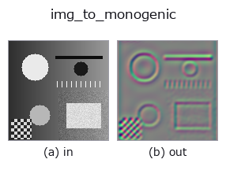
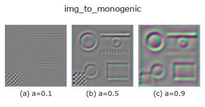
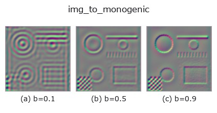
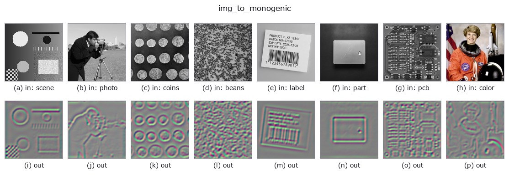

# img_to_monogenic — 2D `bridge` op

- **データ種**: `image` → `qimage`
- **呼び出し**: `fullseye.apply(img, "img_to_monogenic", a=0.5, b=0.5)` (2-D は 1 画像 + 2 スカラつまみ `a,b∈[0,1]` のモデル)



*図は合成の入力 128×128 で実際に走らせた出力。左が入力、右が出力。点群は上から見た散布(明るさ = z)、1-D 列は折れ線、体積は z 方向の最大値投影、動画は中央フレーム、複素画像は振幅、絵にならない返り値は値そのもの。*

**つまみ a を振る**(0.1 / 0.5 / 0.9、もう一方は既定):



**つまみ b を振る**(0.1 / 0.5 / 0.9、もう一方は既定):



**別の画像でも**(合成シーン / 写真 / 硬貨。上段が入力、下段がその出力。つまみは既定):



*4 列目はカラー (H,W,3) の入力。この op は色を跨がずに扱える(色チャネルを 3 本目の空間軸として畳み込まない)。*

## 使い方

画像の単一スケールのモノジェニック信号(四元数場 (H,W,4)、sort ``qimage``)を作る。

台帳の ``monogenic_signal``(Felsberg & Sommer 2001)そのもの: 対数放射状の
raised-cosine 帯域通過を掛け、その Riesz 対と組にして四元数
``(帯域通過像, R1, R2, 0)`` に詰める。``tb_monogenic_amplitude`` /
``tb_monogenic_phase`` / ``tb_monogenic_orientation`` は **この形の qimage
だけ** を受け付ける(色の四元数 ``tb_rgb_to_quaternion`` を渡すと
「モノジェニック信号ではない」と拒否する)ので、その族の入口はこちら。

- ``a`` → 中心波長 ``wavelength_px = 8 * (0.25 + 1.75 * a)`` 画素
  (a=0.5 で 9 px。小さいほど細かい構造に応答)。
- ``b`` → 帯域幅 ``bandwidth_octaves = 1.0 * (0.25 + 1.75 * b)`` オクターブ
  (b=0.5 で 1.125)。
- 返り値: ``(H, W, 4)`` float64。値域は入力に依存し [0,1] に収まらない
  (Riesz 対は符号つき)。

## 詳しい使い方ガイド

- [gallery2d_bridge ファミリ ガイド](../guides/gallery2d_bridge.md)

## 参考(サンプルデータ・文献)

- [サンプルデータ カタログ(DL URL / ライセンス)](../../SAMPLES.md) — 2-D は skimage.data(BSD/public)+ 合成、3-D は実データ源(Stanford/PDS 等)の DL URL。
- [演算子の来歴・参考文献](../../../REFERENCES.md) — この op 族の元になった研究/手法の出典。
- アルゴリズムの正典(著者・年)と用途は上記**ファミリ使い方ガイド**に記載。

## Studio で試す

下のプログラムは実際に走ることを確かめてある(図と同じ入力)。Studio のヘルプではこのブロックがボタンになり、その場で読み込んで実行できる。

```program
img_to_monogenic 0.50 0.50
```

## 実行できる例(この op を実際に呼ぶ検証済みサンプル)

- [gallery2d_bridge](../../../../examples/gallery2d_bridge.py) — `py -3.11 examples/gallery2d_bridge.py`

## 型が繋がる次の op(`qimage` を入力に取れる)

[identity](../misc/identity.md) · [tb_quaternion_to_rgb](../typed/tb_quaternion_to_rgb.md) · [tb_quat_norm](../typed/tb_quat_norm.md) · [tb_quat_conjugate_image](../typed/tb_quat_conjugate_image.md) · [tb_quat_normalize_image](../typed/tb_quat_normalize_image.md) · [tb_monogenic_amplitude](../typed/tb_monogenic_amplitude.md) · [tb_monogenic_phase](../typed/tb_monogenic_phase.md) · [tb_monogenic_orientation](../typed/tb_monogenic_orientation.md)

## 同カテゴリ(`bridge`)

[img_to_points](img_to_points.md) · [img_to_keypoints](img_to_keypoints.md) · [img_to_signal](img_to_signal.md) · [img_to_counts](img_to_counts.md) · [img_to_matrix](img_to_matrix.md) · [img_to_video](img_to_video.md) · [img_to_volume](img_to_volume.md) · [img_to_lightfield](img_to_lightfield.md)

---
*Provenance: ops.py — 2D operator registry. この per-op ノートは `tools/opdocs.py md` が自動生成(手編集しない)。*

© 2026 Kazufumi Furuse — Fullseye operator documentation. Licensed under Apache-2.0.
