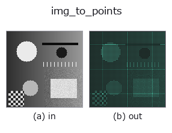
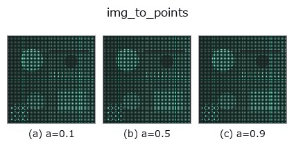
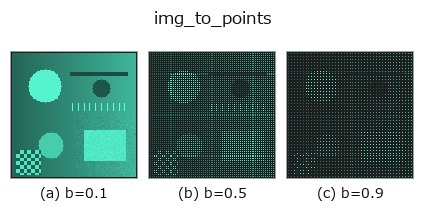
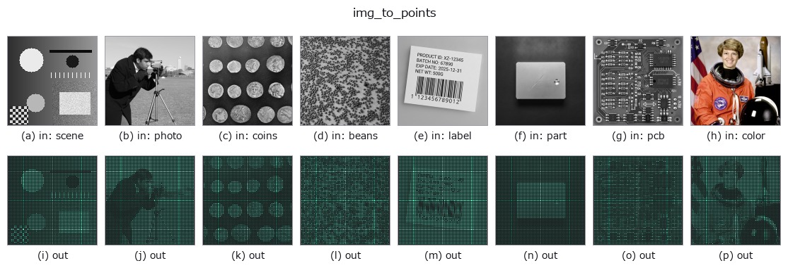

# img_to_points — 2D `bridge` op

- **データ種**: `image` → `points`
- **呼び出し**: `fullseye.apply(img, "img_to_points", a=0.5, b=0.5)` (2-D は 1 画像 + 2 スカラつまみ `a,b∈[0,1]` のモデル)



*図は合成の入力 128×128 で実際に走らせた出力。左が入力、右が出力。点群は上から見た散布(明るさ = z)、1-D 列は折れ線、体積は z 方向の最大値投影、動画は中央フレーム、複素画像は振幅、絵にならない返り値は値そのもの。*

**つまみ a を振る**(0.1 / 0.5 / 0.9、もう一方は既定):



**つまみ b を振る**(0.1 / 0.5 / 0.9、もう一方は既定):



**別の画像でも**(合成シーン / 写真 / 硬貨。上段が入力、下段がその出力。つまみは既定):



*4 列目はカラー (H,W,3) の入力。この op は色を跨がずに扱える(色チャネルを 3 本目の空間軸として畳み込まない)。*

## 使い方

画像を高さ場として読み、(x, y, z) の点群 (N,3) にする。

各画素 ``(row, col)`` を 1 点 ``(x, y, z) = (col * 10/W, row * 10/H, value * 10 * s)``
に写す —— 画像の幅・高さを **一辺 10 の箱** に正規化した座標(``POINTS_BOX``)。
点群 op の橋渡し(``tb_*``)が束縛している半径・境界箱・格子解像度はこの尺度
(連鎖ファザーの種 ``[0,10)^3``)を前提にしているので、画素座標のまま渡すと
半径系 op の近傍が空になり占有格子が全 0 になる(実測)。画素に戻すなら
``x * W / 10``、``y * H / 10``。列の規約は ``camera.depth_to_points`` と同じ
**(x, y, z)** —— ``reprconv`` の ``(z, y, x)`` とは逆なので、その族へ渡すときは
``tb_points_zyx_to_keypoints_uv`` 等の入口で読み替えること。

- ``a`` → 高さの倍率 ``s = 0.25 + 1.75 * a``(a=0.5 で 1.125。値域 [0,1] の画像なら
  z の範囲は x, y と同じ桁 [0, 11.25] になり、点群 op が「平面」でなく「地形」を見る)。
- ``b`` → 間引きの歩幅 ``stride = 1 + int(b * 3)``(b=0.5 で 2。128×128 なら
  4,096 点。b=0 で全画素、b=1 で 1/16)。
- 返り値: ``(N, 3)`` float64、``N = ceil(H/stride) * ceil(W/stride)``。空にはならない。
- 順序は行優先(row-major)で決定的。同じ入力なら同じ配列。

使いどころ: 点群 op(``tb_alpha_shape_boundary`` / ``tb_estimate_point_normals`` /
``tb_points_to_voxel`` …)を **1 枚の画像から** 試す入口。DEM(標高図)を
``value = 標高 / 最大標高`` に正規化して渡せば、そのまま地形の点群になる。

## 詳しい使い方ガイド

- [gallery2d_bridge ファミリ ガイド](../guides/gallery2d_bridge.md)

## 参考(サンプルデータ・文献)

- [サンプルデータ カタログ(DL URL / ライセンス)](../../SAMPLES.md) — 2-D は skimage.data(BSD/public)+ 合成、3-D は実データ源(Stanford/PDS 等)の DL URL。
- [演算子の来歴・参考文献](../../../REFERENCES.md) — この op 族の元になった研究/手法の出典。
- アルゴリズムの正典(著者・年)と用途は上記**ファミリ使い方ガイド**に記載。

## Studio で試す

下のプログラムは実際に走ることを確かめてある(図と同じ入力)。Studio のヘルプではこのブロックがボタンになり、その場で読み込んで実行できる。

```program
img_to_points 0.50 0.50
```

## 実行できる例(この op を実際に呼ぶ検証済みサンプル)

- [gallery2d_bridge](../../../../examples/gallery2d_bridge.py) — `py -3.11 examples/gallery2d_bridge.py`

## 型が繋がる次の op(`points` を入力に取れる)

[identity](../misc/identity.md) · [tb_points_to_voxel](../typed/tb_points_to_voxel.md) · [tb_estimate_point_normals](../typed/tb_estimate_point_normals.md) · [tb_iss_keypoints](../typed/tb_iss_keypoints.md) · [tb_project_points](../typed/tb_project_points.md) · [tb_render_point_depth](../typed/tb_render_point_depth.md) · [tb_statistical_outlier_removal](../typed/tb_statistical_outlier_removal.md) · [tb_radius_outlier_removal](../typed/tb_radius_outlier_removal.md)

## 同カテゴリ(`bridge`)

[img_to_keypoints](img_to_keypoints.md) · [img_to_signal](img_to_signal.md) · [img_to_counts](img_to_counts.md) · [img_to_matrix](img_to_matrix.md) · [img_to_video](img_to_video.md) · [img_to_volume](img_to_volume.md) · [img_to_lightfield](img_to_lightfield.md) · [img_to_rgb](img_to_rgb.md)

---
*Provenance: ops.py — 2D operator registry. この per-op ノートは `tools/opdocs.py md` が自動生成(手編集しない)。*

© 2026 Kazufumi Furuse — Fullseye operator documentation. Licensed under Apache-2.0.
