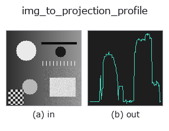
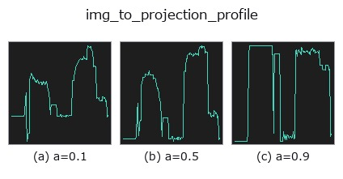
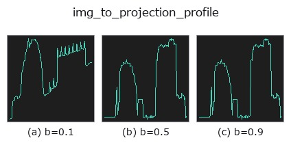
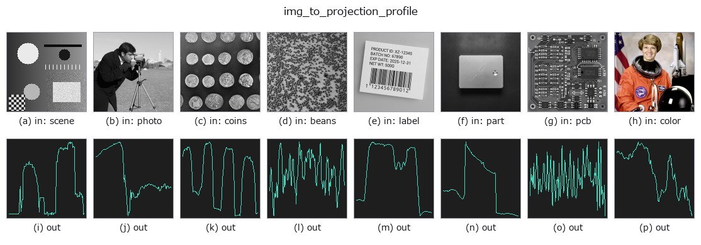

# img_to_projection_profile — 2D `bridge` op

- **データ種**: `image` → `signal`
- **呼び出し**: `fullseye.apply(img, "img_to_projection_profile", a=0.5, b=0.5)` (2-D は 1 画像 + 2 スカラつまみ `a,b∈[0,1]` のモデル)



*図は合成の入力 128×128 で実際に走らせた出力。左が入力、右が出力。点群は上から見た散布(明るさ = z)、1-D 列は折れ線、体積は z 方向の最大値投影、動画は中央フレーム、複素画像は振幅、絵にならない返り値は値そのもの。*

**つまみ a を振る**(0.1 / 0.5 / 0.9、もう一方は既定):



**つまみ b を振る**(0.1 / 0.5 / 0.9、もう一方は既定):



**別の画像でも**(合成シーン / 写真 / 硬貨。上段が入力、下段がその出力。つまみは既定):



*4 列目はカラー (H,W,3) の入力。この op は色を跨がずに扱える(色チャネルを 3 本目の空間軸として畳み込まない)。*

## 使い方

画像を 1 方向へ潰した**射影プロファイル**を 1-D の signal にする ―― 版面解析の基本量。

``img_to_signal`` が「1 本の行/列をそのまま読む」のに対し、こちらは**全行(全列)を
束ねて 1 本にまとめる**。文字列の切れ目・罫線・帯の境目は、1 本の走査線では雑音に
埋もれるが、潰すと谷として立ち上がる。

- ``b`` → 向き。``b < 0.5`` で**縦に潰して長さ W**(列ごとの代表値。横に並んだ字の
  切れ目が谷になる)、``b >= 0.5`` で**横に潰して長さ H**(行ごと。行間が谷になる)。
  ``img_to_signal`` と同じく ``b`` が向きを決めるが、``a`` の意味は違う。
- ``a`` → **上側トリム率**。潰す軸の値を大きい順に並べ、上位
  ``m = max(1, round((1-a) * N))`` 個だけを平均する。``a=0`` は**ただの平均射影**
  (古典的な projection profile そのもの)、``a=1`` は**最大値射影**(MIP)、
  その間は「外れ値だけを残して均す」連続的な折衷になる。
- 返り値: 1-D float64。**正規化しない**(値域は入力のまま。[0,1] の画像なら [0,1])。
  長さは向きで決まる(W または H)。空フレームは一定値の列になる。

**なぜノブがトリム率なのか**: 平均射影は雑音に強いが、細い線 1 本が背景に薄められて
消える。最大値射影は細い線を残すが、輝点 1 個で列全体が持ち上がる。どちらを選んでも
失うものがあるので、**どれだけ捨てるかをノブにして取引を明示した**。``a`` を上げると
細い構造が残り、下げると雑音が均される ―― 単調で、両端が古典的な 2 つの射影に一致する。

**暗い字には前段で反転を**。この op は**大きい方**を残すので、白地に黒字のまま渡すと
トリムが**背景**を拾う。``invert``(台帳)を挟めば、``a`` が「濃い字のところ」を残す。

**先行と対応**: 平均射影は文書解析の古典そのもの(Postl 1986 / Baird 1987 が傾き
推定に使った量)で、HALCON では ``gray_projections``(水平・垂直の濃淡射影)に
あたる —— 対応表で **`covered: false`** だった op を、これが埋める。上位トリムで
最大値射影へ連続に寄せる族は、蛍光顕微鏡の時間フレーム融合で使われる
**分位点射影**(上側 75 % 点を取る)と同じ発想だが、こちらは**上位 m 個の平均**
なので **両端が厳密に平均射影と最大値射影に一致し、その間が単調**になる。

使いどころ: 行の切り出し(横に潰して谷を探す)、字の切り出し(縦に潰す)、罫線検出、
帯の境目、``deskew`` が内部で使っている判定量の可視化。下流は 1-D 関数の族
(``tb_smooth_funct_1d_gauss`` / ``tb_local_min_funct_1d`` / ``tb_derivate_funct_1d``)。

## 詳しい使い方ガイド

- [gallery2d_bridge ファミリ ガイド](../guides/gallery2d_bridge.md)

## 参考(サンプルデータ・文献)

- [サンプルデータ カタログ(DL URL / ライセンス)](../../SAMPLES.md) — 2-D は skimage.data(BSD/public)+ 合成、3-D は実データ源(Stanford/PDS 等)の DL URL。
- [演算子の来歴・参考文献](../../../REFERENCES.md) — この op 族の元になった研究/手法の出典。
- アルゴリズムの正典(著者・年)と用途は上記**ファミリ使い方ガイド**に記載。

## Studio で試す

下のプログラムは実際に走ることを確かめてある(図と同じ入力)。Studio のヘルプではこのブロックがボタンになり、その場で読み込んで実行できる。

```program
img_to_projection_profile 0.50 0.50
```

## 実行できる例(この op を実際に呼ぶ検証済みサンプル)

- [gallery2d_bridge](../../../../examples/gallery2d_bridge.py) — `py -3.11 examples/gallery2d_bridge.py`

## 型が繋がる次の op(`signal` を入力に取れる)

[identity](../misc/identity.md) · [tb_create_funct_1d_array](../typed/tb_create_funct_1d_array.md) · [tb_smooth_funct_1d_gauss](../typed/tb_smooth_funct_1d_gauss.md) · [tb_smooth_funct_1d_mean](../typed/tb_smooth_funct_1d_mean.md) · [tb_derivate_funct_1d](../typed/tb_derivate_funct_1d.md) · [tb_integrate_funct_1d](../typed/tb_integrate_funct_1d.md) · [tb_zero_crossings_funct_1d](../typed/tb_zero_crossings_funct_1d.md) · [tb_abs_funct_1d](../typed/tb_abs_funct_1d.md)

## 同カテゴリ(`bridge`)

[img_to_points](img_to_points.md) · [img_to_keypoints](img_to_keypoints.md) · [img_to_signal](img_to_signal.md) · [img_to_counts](img_to_counts.md) · [img_to_matrix](img_to_matrix.md) · [img_to_video](img_to_video.md) · [img_to_volume](img_to_volume.md) · [img_to_lightfield](img_to_lightfield.md)

---
*Provenance: ops.py — 2D operator registry. この per-op ノートは `tools/opdocs.py md` が自動生成(手編集しない)。*

© 2026 Kazufumi Furuse — Fullseye operator documentation. Licensed under Apache-2.0.
