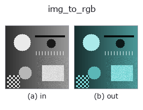
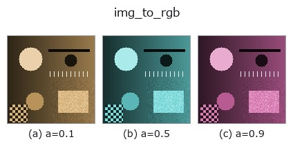
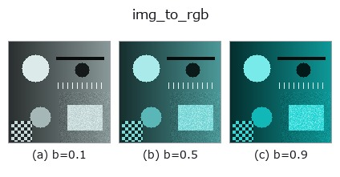
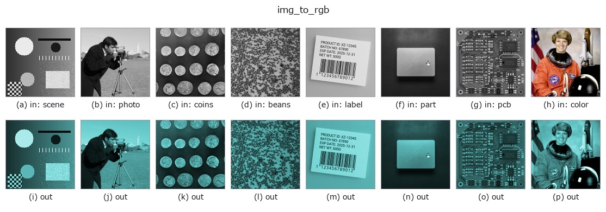

# img_to_rgb — 2D `bridge` op

- **データ種**: `image` → `rgbimage`
- **呼び出し**: `fullseye.apply(img, "img_to_rgb", a=0.5, b=0.5)` (2-D は 1 画像 + 2 スカラつまみ `a,b∈[0,1]` のモデル)



*図は合成の入力 128×128 で実際に走らせた出力。左が入力、右が出力。点群は上から見た散布(明るさ = z)、1-D 列は折れ線、体積は z 方向の最大値投影、動画は中央フレーム、複素画像は振幅、絵にならない返り値は値そのもの。*

**つまみ a を振る**(0.1 / 0.5 / 0.9、もう一方は既定):



**つまみ b を振る**(0.1 / 0.5 / 0.9、もう一方は既定):



**別の画像でも**(合成シーン / 写真 / 硬貨。上段が入力、下段がその出力。つまみは既定):



*4 列目はカラー (H,W,3) の入力。この op は色を跨がずに扱える(色チャネルを 3 本目の空間軸として畳み込まない)。*

## 使い方

グレー画像に色相・彩度を与え、(H,W,3) の RGB 画像(sort ``rgbimage``)にする。

二色性反射モデル(拡散 = 着色、鏡面 = 白)の形で作る:
``mix = (1 - sat) + sat * chroma``、``chroma = HSV(hue, 1, 1)``、
``spec = clip((gray - 0.75) / 0.25, 0, 1) ** 2``、
``rgb = gray * (mix * (1 - spec) + spec)``。
つまり暗〜中間の画素は色相で着色され、**明るさ 0.75 を超える画素ほど白(無彩色)に
戻る**。彩度 0 なら 3 チャンネル同値のグレー(``spec`` に依らず入力そのもの)。
どのチャンネルも入力以下なので値域は [0,1] に留まる。

- ``a`` → 色相 ``hue = a``(0 で赤、1/3 で緑、2/3 で青、1 で赤に戻る)。
- ``b`` → 彩度 ``sat = b``(b=0.5 で半分だけ着色)。
- 返り値: ``(H, W, 3)`` float64。
- 鏡面の膝 ``SPECULAR_KNEE = 0.75`` は固定(ノブにしていない)。

なぜ鏡面を入れるか(2026-09-07 実測): 単純な着色 ``gray * mix`` だと明るい部分も
同じ色相の飽和色になり、``tb_specular_coefficient_map`` / ``tb_specular_diffuse_split`` /
``tb_specular_free_transform`` が見る「無彩色のハイライト」が 1 画素も無く、
鏡面係数が全 0 の真っ黒な図になった。合成の入力側が族の前提(二色性)を満たす。

使いどころ: ``tb_rgb_to_quaternion``(→ qimage、四元数の色 op の入口)、
``tb_specular_free_transform`` / ``tb_wetness`` / ``tb_sensor_capture``。
自然画像の色を再現するものではない(単一色相の合成)。

## 詳しい使い方ガイド

- [gallery2d_bridge ファミリ ガイド](../guides/gallery2d_bridge.md)

## 参考(サンプルデータ・文献)

- [サンプルデータ カタログ(DL URL / ライセンス)](../../SAMPLES.md) — 2-D は skimage.data(BSD/public)+ 合成、3-D は実データ源(Stanford/PDS 等)の DL URL。
- [演算子の来歴・参考文献](../../../REFERENCES.md) — この op 族の元になった研究/手法の出典。
- アルゴリズムの正典(著者・年)と用途は上記**ファミリ使い方ガイド**に記載。

## Studio で試す

下のプログラムは実際に走ることを確かめてある(図と同じ入力)。Studio のヘルプではこのブロックがボタンになり、その場で読み込んで実行できる。

```program
img_to_rgb 0.50 0.50
```

## 実行できる例(この op を実際に呼ぶ検証済みサンプル)

- [gallery2d_bridge](../../../../examples/gallery2d_bridge.py) — `py -3.11 examples/gallery2d_bridge.py`

## 型が繋がる次の op(`rgbimage` を入力に取れる)

[identity](../misc/identity.md) · [tb_wetness](../typed/tb_wetness.md) · [tb_sensor_capture](../typed/tb_sensor_capture.md) · [tb_specular_diffuse_split](../typed/tb_specular_diffuse_split.md) · [tb_specular_coefficient_map](../typed/tb_specular_coefficient_map.md) · [tb_specular_free_transform](../typed/tb_specular_free_transform.md) · [tb_rgb_to_quaternion](../typed/tb_rgb_to_quaternion.md)

## 同カテゴリ(`bridge`)

[img_to_points](img_to_points.md) · [img_to_keypoints](img_to_keypoints.md) · [img_to_signal](img_to_signal.md) · [img_to_counts](img_to_counts.md) · [img_to_matrix](img_to_matrix.md) · [img_to_video](img_to_video.md) · [img_to_volume](img_to_volume.md) · [img_to_lightfield](img_to_lightfield.md)

---
*Provenance: ops.py — 2D operator registry. この per-op ノートは `tools/opdocs.py md` が自動生成(手編集しない)。*

© 2026 Kazufumi Furuse — Fullseye operator documentation. Licensed under Apache-2.0.
