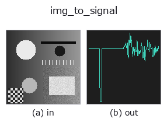
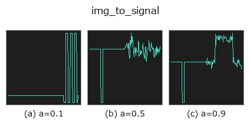
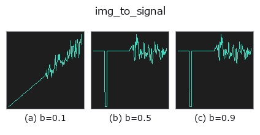
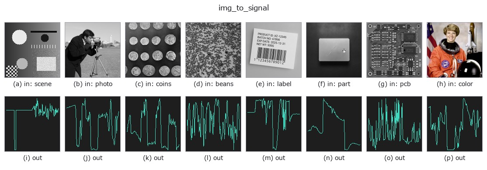

# img_to_signal — 2D `bridge` op

- **データ種**: `image` → `signal`
- **呼び出し**: `fullseye.apply(img, "img_to_signal", a=0.5, b=0.5)` (2-D は 1 画像 + 2 スカラつまみ `a,b∈[0,1]` のモデル)



*図は合成の入力 128×128 で実際に走らせた出力。左が入力、右が出力。点群は上から見た散布(明るさ = z)、1-D 列は折れ線、体積は z 方向の最大値投影、動画は中央フレーム、複素画像は振幅、絵にならない返り値は値そのもの。*

**つまみ a を振る**(0.1 / 0.5 / 0.9、もう一方は既定):



**つまみ b を振る**(0.1 / 0.5 / 0.9、もう一方は既定):



**別の画像でも**(合成シーン / 写真 / 硬貨。上段が入力、下段がその出力。つまみは既定):



*4 列目はカラー (H,W,3) の入力。この op は色を跨がずに扱える(色チャネルを 3 本目の空間軸として畳み込まない)。*

## 使い方

画像の 1 行(または 1 列)の濃度プロファイルを 1-D の signal にする。

- ``a`` → 位置。``b < 0.5`` なら行 ``r = round(a * (H-1))`` を横に読む(長さ W)、
  ``b ≥ 0.5`` なら列 ``c = round(a * (W-1))`` を縦に読む(長さ H)。a=0.5 は中央。
- 返り値: 1-D float64、値はそのまま(正規化しない。画像が [0,1] なら [0,1])。
- 補間はしない(画素の値をそのまま並べる)。斜めの線が要るなら ``line_profile``
  (台帳)を使う。

使いどころ: 1-D 関数の族(``tb_smooth_funct_1d_gauss`` / ``tb_derivate_funct_1d`` /
``tb_bandpass`` …)を画像の断面で試す入口。周期構造(市松・縞)を横切る行を
選ぶとスペクトル系 op の効果が見える。

## 詳しい使い方ガイド

- [gallery2d_bridge ファミリ ガイド](../guides/gallery2d_bridge.md)

## 参考(サンプルデータ・文献)

- [サンプルデータ カタログ(DL URL / ライセンス)](../../SAMPLES.md) — 2-D は skimage.data(BSD/public)+ 合成、3-D は実データ源(Stanford/PDS 等)の DL URL。
- [演算子の来歴・参考文献](../../../REFERENCES.md) — この op 族の元になった研究/手法の出典。
- アルゴリズムの正典(著者・年)と用途は上記**ファミリ使い方ガイド**に記載。

## Studio で試す

下のプログラムは実際に走ることを確かめてある(図と同じ入力)。Studio のヘルプではこのブロックがボタンになり、その場で読み込んで実行できる。

```program
img_to_signal 0.50 0.50
```

## 実行できる例(この op を実際に呼ぶ検証済みサンプル)

- [gallery2d_bridge](../../../../examples/gallery2d_bridge.py) — `py -3.11 examples/gallery2d_bridge.py`

## 型が繋がる次の op(`signal` を入力に取れる)

[identity](../misc/identity.md) · [tb_create_funct_1d_array](../typed/tb_create_funct_1d_array.md) · [tb_smooth_funct_1d_gauss](../typed/tb_smooth_funct_1d_gauss.md) · [tb_smooth_funct_1d_mean](../typed/tb_smooth_funct_1d_mean.md) · [tb_derivate_funct_1d](../typed/tb_derivate_funct_1d.md) · [tb_integrate_funct_1d](../typed/tb_integrate_funct_1d.md) · [tb_zero_crossings_funct_1d](../typed/tb_zero_crossings_funct_1d.md) · [tb_abs_funct_1d](../typed/tb_abs_funct_1d.md)

## 同カテゴリ(`bridge`)

[img_to_points](img_to_points.md) · [img_to_keypoints](img_to_keypoints.md) · [img_to_counts](img_to_counts.md) · [img_to_matrix](img_to_matrix.md) · [img_to_video](img_to_video.md) · [img_to_volume](img_to_volume.md) · [img_to_lightfield](img_to_lightfield.md) · [img_to_rgb](img_to_rgb.md)

---
*Provenance: ops.py — 2D operator registry. この per-op ノートは `tools/opdocs.py md` が自動生成(手編集しない)。*

© 2026 Kazufumi Furuse — Fullseye operator documentation. Licensed under Apache-2.0.
