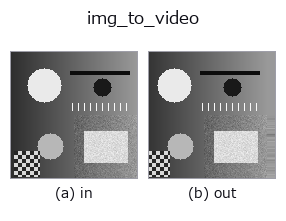
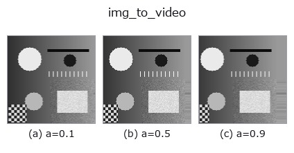
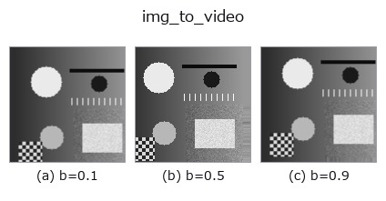
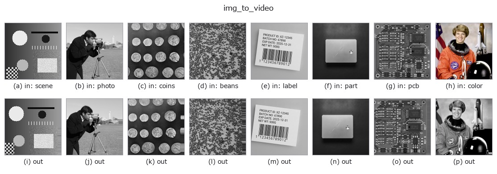
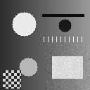

# img_to_video — 2D `bridge` op

- **データ種**: `image` → `video`
- **呼び出し**: `fullseye.apply(img, "img_to_video", a=0.5, b=0.5)` (2-D は 1 画像 + 2 スカラつまみ `a,b∈[0,1]` のモデル)



*図は合成の入力 128×128 で実際に走らせた出力。左が入力、右が出力。点群は上から見た散布(明るさ = z)、1-D 列は折れ線、体積は z 方向の最大値投影、動画は中央フレーム、複素画像は振幅、絵にならない返り値は値そのもの。*

**つまみ a を振る**(0.1 / 0.5 / 0.9、もう一方は既定):



**つまみ b を振る**(0.1 / 0.5 / 0.9、もう一方は既定):



**別の画像でも**(合成シーン / 写真 / 硬貨。上段が入力、下段がその出力。つまみは既定):



*4 列目はカラー (H,W,3) の入力。この op は色を跨がずに扱える(色チャネルを 3 本目の空間軸として畳み込まない)。*

**動き**(GIF: フレーム / 視点 / スライスを順に。静止の図が完成形で、GIF は補助):



## 使い方

画像を一定速度で平行移動させた T フレームの動画 (T,H,W) にする。

フレーム ``t`` は入力を ``(dy, dx) = t * step * (sin θ, cos θ)`` だけ動かしたもの
(``scipy.ndimage.shift``、線形補間、縁は最近傍で延長)。**変位が閉形式で
分かる**ので、動画の族(``tb_frame_difference_causal`` / ``tb_motion_energy_image`` /
``tb_background_subtraction_window`` …)の検算に使える。

- ``a`` → 1 フレームあたりの歩幅 ``step = 4 * a`` 画素(a=0.5 で 2 px/frame)。
- ``b`` → 移動方向 ``θ = 2π * b``(b=0 で +x、b=0.25 で +y(下)、b=0.5 で −x)。
- フレーム数 ``T = VIDEO_FRAMES``(8)。フレーム 0 は入力そのもの。
- 返り値: ``(T, H, W)`` float64、値域は入力と同じ([0,1] なら [0,1] のまま。
  線形補間は値域を広げない)。

注意: 動くのは**画面全体**(カメラのパン)であって、物体だけではない。
背景差分の族は「動かない背景」を仮定するので、全体パンでは前景が全画素に出る。

## 詳しい使い方ガイド

- [gallery2d_bridge ファミリ ガイド](../guides/gallery2d_bridge.md)

## 参考(サンプルデータ・文献)

- [サンプルデータ カタログ(DL URL / ライセンス)](../../SAMPLES.md) — 2-D は skimage.data(BSD/public)+ 合成、3-D は実データ源(Stanford/PDS 等)の DL URL。
- [演算子の来歴・参考文献](../../../REFERENCES.md) — この op 族の元になった研究/手法の出典。
- アルゴリズムの正典(著者・年)と用途は上記**ファミリ使い方ガイド**に記載。

## Studio で試す

下のプログラムは実際に走ることを確かめてある(図と同じ入力)。Studio のヘルプではこのブロックがボタンになり、その場で読み込んで実行できる。

```program
img_to_video 0.50 0.50
```

## 実行できる例(この op を実際に呼ぶ検証済みサンプル)

- [gallery2d_bridge](../../../../examples/gallery2d_bridge.py) — `py -3.11 examples/gallery2d_bridge.py`

## 型が繋がる次の op(`video` を入力に取れる)

[identity](../misc/identity.md) · [tb_temporal_bandpass](../typed/tb_temporal_bandpass.md) · [tb_temporal_band_power](../typed/tb_temporal_band_power.md) · [tb_temporal_median_window](../typed/tb_temporal_median_window.md) · [tb_moving_average_window](../typed/tb_moving_average_window.md) · [tb_background_subtraction_window](../typed/tb_background_subtraction_window.md) · [tb_frame_difference_causal](../typed/tb_frame_difference_causal.md) · [tb_exponential_background](../typed/tb_exponential_background.md)

## 同カテゴリ(`bridge`)

[img_to_points](img_to_points.md) · [img_to_keypoints](img_to_keypoints.md) · [img_to_signal](img_to_signal.md) · [img_to_counts](img_to_counts.md) · [img_to_matrix](img_to_matrix.md) · [img_to_volume](img_to_volume.md) · [img_to_lightfield](img_to_lightfield.md) · [img_to_rgb](img_to_rgb.md)

---
*Provenance: ops.py — 2D operator registry. この per-op ノートは `tools/opdocs.py md` が自動生成(手編集しない)。*

© 2026 Kazufumi Furuse — Fullseye operator documentation. Licensed under Apache-2.0.
