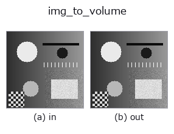
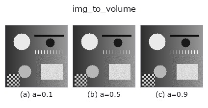
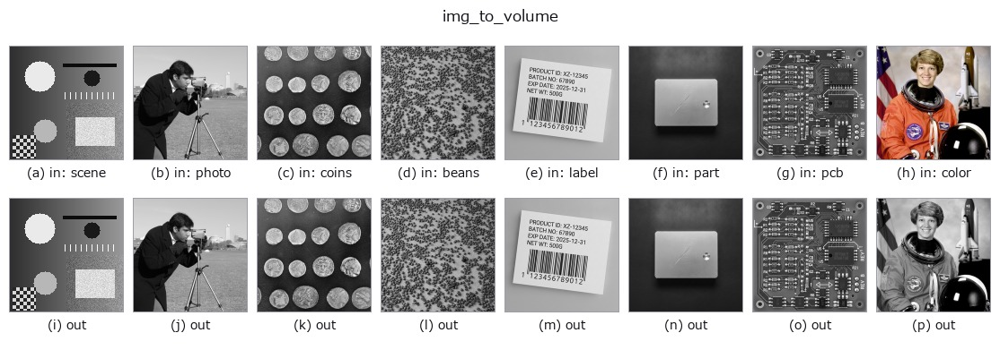
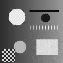

# img_to_volume — 2D `bridge` op

- **データ種**: `image` → `volume`
- **呼び出し**: `fullseye.apply(img, "img_to_volume", a=0.5, b=0.5)` (2-D は 1 画像 + 2 スカラつまみ `a,b∈[0,1]` のモデル)



*図は合成の入力 128×128 で実際に走らせた出力。左が入力、右が出力。点群は上から見た散布(明るさ = z)、1-D 列は折れ線、体積は z 方向の最大値投影、動画は中央フレーム、複素画像は振幅、絵にならない返り値は値そのもの。*

**つまみ a を振る**(0.1 / 0.5 / 0.9、もう一方は既定):



**つまみ b を振る**(0.1 / 0.5 / 0.9、もう一方は既定):


**別の画像でも**(合成シーン / 写真 / 硬貨。上段が入力、下段がその出力。つまみは既定):



*4 列目はカラー (H,W,3) の入力。この op は色を跨がずに扱える(色チャネルを 3 本目の空間軸として畳み込まない)。*

**動き**(GIF: フレーム / 視点 / スライスを順に。静止の図が完成形で、GIF は補助):



## 使い方

画像を高さ場として押し出し、(D,H,W) の体積(z 先頭)にする。

ボクセル ``(z, y, x)`` は、その高さが画素の高さ以下なら画素値、超えていれば 0:
``vol[z, y, x] = img[y, x] if z <= img[y, x] * s * (D - 1) else 0``。
つまり **高さ場の「中身が詰まった」固体**(地形・段差・押し出し部品)で、
体積の族(``vol_dilate`` / ``vol_erosion_ball`` / ``macro_vol_denoise`` …)を
1 枚の画像から試せる。軸順は 3-D 台帳の規約どおり **(depth, row, col)**。

- ``a`` → 高さの倍率 ``s = 0.25 + 1.75 * a``(a=0.5 で 1.125。1 を超えた分は
  最上段 ``D-1`` で頭打ち)。
- ``b`` → 段数 ``D = 8 + 2 * int(b * 28)``(b=0.5 で 36、b=0 で 8、b=1 で 64)。
- 返り値: ``(D, H, W)`` float64、値域は入力と同じ。**z=0 の底面は
  値 > 0 の画素がすべて詰まる**(高さ 0 でも底面には乗る)。

## 詳しい使い方ガイド

- [gallery2d_bridge ファミリ ガイド](../guides/gallery2d_bridge.md)

## 参考(サンプルデータ・文献)

- [サンプルデータ カタログ(DL URL / ライセンス)](../../SAMPLES.md) — 2-D は skimage.data(BSD/public)+ 合成、3-D は実データ源(Stanford/PDS 等)の DL URL。
- [演算子の来歴・参考文献](../../../REFERENCES.md) — この op 族の元になった研究/手法の出典。
- アルゴリズムの正典(著者・年)と用途は上記**ファミリ使い方ガイド**に記載。

## Studio で試す

下のプログラムは実際に走ることを確かめてある(図と同じ入力)。Studio のヘルプではこのブロックがボタンになり、その場で読み込んで実行できる。

```program
img_to_volume 0.50 0.50
```

## 実行できる例(この op を実際に呼ぶ検証済みサンプル)

- [gallery2d_bridge](../../../../examples/gallery2d_bridge.py) — `py -3.11 examples/gallery2d_bridge.py`

## 型が繋がる次の op(`volume` を入力に取れる)

[identity](../misc/identity.md) · [vol_gaussian](../3d/vol_gaussian.md) · [vol_median](../3d/vol_median.md) · [vol_erode](../3d/vol_erode.md) · [vol_dilate](../3d/vol_dilate.md) · [vol_threshold](../3d/vol_threshold.md) · [vol_reg_dilate](../3d/vol_reg_dilate.md) · [vol_reg_erode](../3d/vol_reg_erode.md)

## 同カテゴリ(`bridge`)

[img_to_points](img_to_points.md) · [img_to_keypoints](img_to_keypoints.md) · [img_to_signal](img_to_signal.md) · [img_to_counts](img_to_counts.md) · [img_to_matrix](img_to_matrix.md) · [img_to_video](img_to_video.md) · [img_to_lightfield](img_to_lightfield.md) · [img_to_rgb](img_to_rgb.md)

---
*Provenance: ops.py — 2D operator registry. この per-op ノートは `tools/opdocs.py md` が自動生成(手編集しない)。*

© 2026 Kazufumi Furuse — Fullseye operator documentation. Licensed under Apache-2.0.
