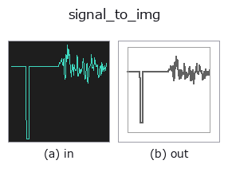
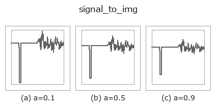
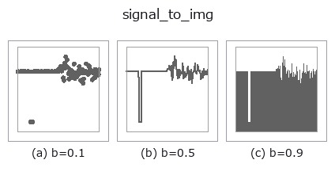
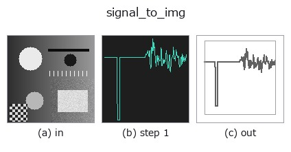
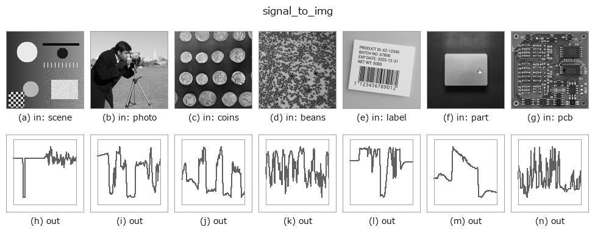

# signal_to_img — 2D `bridge` op

- **データ種**: `signal` → `image`
- **呼び出し**: `fullseye.apply(img, "signal_to_img", a=0.5, b=0.5)` (2-D は 1 画像 + 2 スカラつまみ `a,b∈[0,1]` のモデル)



*図は合成の入力 128×128 で実際に走らせた出力。左が入力、右が出力。点群は上から見た散布(明るさ = z)、1-D 列は折れ線、体積は z 方向の最大値投影、動画は中央フレーム、複素画像は振幅、絵にならない返り値は値そのもの。*

**つまみ a を振る**(0.1 / 0.5 / 0.9、もう一方は既定):



**つまみ b を振る**(0.1 / 0.5 / 0.9、もう一方は既定):



**段階**(前置きの op → この op。左から順):



**別の画像でも**(合成シーン / 写真 / 硬貨。上段が入力、下段がその出力。つまみは既定):



## 使い方

1-D の signal を**折れ線の図**にして画像へ戻す —— 「作った列を見る」入口。

行きの橋(``img_to_signal`` / ``img_to_projection_profile``)で画像から列を
作れるようになったが、**その列を見る登録 op が無かった**。signal を画像に
落とせる op は ``spectrogram`` の 2 本だけで、どちらも描くのは**スペクトル**
であって列そのものではない。図の生成器は 1-D を折れ線で描いているが、
それは**道具の中の実装**で、``fullseye.apply`` からも Studio からも呼べない。
この op がその穴を埋める。

- ``a`` → 縦軸の**余白** ``pad = 0.30 * a * (データの幅)``(a=0 でぴったり、
  a=1 で上下に 30 % の余白)。ぴったりだと端の点が枠に重なる。
- ``b`` → 描き方。``b < 1/3`` で**点**、``< 2/3`` で**折れ線**、それ以上で**棒**。
  ★並びは「**既定のノブ 0.5 がその型に素直な描き方になる**」ように決めてある
  —— 列は折れ線が素直なので真ん中が折れ線。
- 横軸は添字 ``0..N-1``、縦軸はデータの範囲(+ 余白)。**軸は閉形式**
  (``annotate.axes_transform``)なので、値が画素のどこに来るかは計算できる。
- 返り値: ``(128, 128)`` float64、白地に濃い線([0,1])。★**定数列は潰れた軸を
  ±0.5 開いて中央に水平線 1 本**を描く(``axes_transform`` は幅 0 の軸を
  ValueError で拒否するので、ここで開く)。空の列は白紙。

使いどころ: 射影プロファイルの谷を目で確かめる、1-D 関数族
(``tb_smooth_funct_1d_gauss`` / ``tb_derivate_funct_1d``)の効果を見る、
図・記事にそのまま貼る。

## 詳しい使い方ガイド

- [gallery2d_bridge ファミリ ガイド](../guides/gallery2d_bridge.md)

## 参考(サンプルデータ・文献)

- [サンプルデータ カタログ(DL URL / ライセンス)](../../SAMPLES.md) — 2-D は skimage.data(BSD/public)+ 合成、3-D は実データ源(Stanford/PDS 等)の DL URL。
- [演算子の来歴・参考文献](../../../REFERENCES.md) — この op 族の元になった研究/手法の出典。
- アルゴリズムの正典(著者・年)と用途は上記**ファミリ使い方ガイド**に記載。

## Studio で試す

下のプログラムは実際に走ることを確かめてある(図と同じ入力)。Studio のヘルプではこのブロックがボタンになり、その場で読み込んで実行できる。

```program
img_to_signal 0.50 0.50
signal_to_img 0.50 0.50
```

## 実行できる例(この op を実際に呼ぶ検証済みサンプル)

- [gallery2d_bridge](../../../../examples/gallery2d_bridge.py) — `py -3.11 examples/gallery2d_bridge.py`

## 型が繋がる次の op(`image` を入力に取れる)

[identity](../misc/identity.md) · [gaussian](../smoothing/gaussian.md) · [mean_box](../smoothing/mean_box.md) · [bilateral](../smoothing/bilateral.md) · [unsharp](../smoothing/unsharp.md) · [median](../rank/median.md) · [min_filter](../rank/min_filter.md) · [max_filter](../rank/max_filter.md)

## 同カテゴリ(`bridge`)

[img_to_points](img_to_points.md) · [img_to_keypoints](img_to_keypoints.md) · [img_to_signal](img_to_signal.md) · [img_to_projection_profile](img_to_projection_profile.md) · [img_to_counts](img_to_counts.md) · [img_to_matrix](img_to_matrix.md) · [img_to_video](img_to_video.md) · [img_to_volume](img_to_volume.md)

---
*Provenance: ops.py — 2D operator registry. この per-op ノートは `tools/opdocs.py md` が自動生成(手編集しない)。*

© 2026 Kazufumi Furuse — Fullseye operator documentation. Licensed under Apache-2.0.
