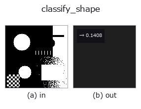
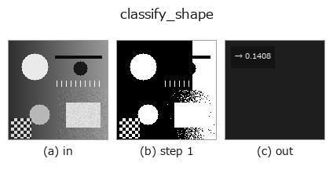

# classify_shape — 2D `classification` op

- **データ種**: `region` → `feature`
- **呼び出し**: `fullseye.apply(img, "classify_shape", a=0.5, b=0.5)` (2-D は 1 画像 + 2 スカラつまみ `a,b∈[0,1]` のモデル)



*図は合成の入力 128×128 で実際に走らせた出力。左が入力、右が出力。点群は上から見た散布(明るさ = z)、1-D 列は折れ線、体積は z 方向の最大値投影、動画は中央フレーム、複素画像は振幅、絵にならない返り値は値そのもの。*

*つまみ a は出力を変えない(実測: 0.1 / 0.5 / 0.9 で同一)。*

*つまみ b は出力を変えない(実測: 0.1 / 0.5 / 0.9 で同一)。*

**段階**(前置きの op → この op。左から順):



## 使い方

最大の連結領域について円形度（circularity）を計算する形状分類の基礎特徴量。対応する単体の HALCON op は指定されていない。

``a``, ``b`` は未使用。最大面積の連結成分について ``4π×面積 / 周長²`` を計算し、理想円で 1 になるよう ``min(1.0, ...)`` で頭打ちにする（数値誤差で 1 をわずかに超えるのを防ぐ）。周長は領域からその侵食を引いた境界画素数（``_region_boundary`` と同じ考え方）で近似するため、輪郭ベースの周長より粗い。前景が無ければ 0 を返す。コード中のコメントの通り、OCR・良否判定など「形状で分類する」処理の土台として使うことを想定している。

## 詳しい使い方ガイド

- [gallery2d_features ファミリ ガイド](../guides/gallery2d_features.md)

## 参考(サンプルデータ・文献)

- [サンプルデータ カタログ(DL URL / ライセンス)](../../SAMPLES.md) — 2-D は skimage.data(BSD/public)+ 合成、3-D は実データ源(Stanford/PDS 等)の DL URL。
- [演算子の来歴・参考文献](../../../REFERENCES.md) — この op 族の元になった研究/手法の出典。
- アルゴリズムの正典(著者・年)と用途は上記**ファミリ使い方ガイド**に記載。

## Studio で試す

下のプログラムは実際に走ることを確かめてある(図と同じ入力)。Studio のヘルプではこのブロックがボタンになり、その場で読み込んで実行できる。

```program
threshold 0.50 0.50
classify_shape 0.50 0.50
```

## 実行できる例(この op を実際に呼ぶ検証済みサンプル)

- [gallery2d_features](../../../../examples/gallery2d_features.py) — `py -3.11 examples/gallery2d_features.py`

## 型が繋がる次の op(`feature` を入力に取れる)

[identity](../misc/identity.md)

## 同カテゴリ(`classification`)

—

---
*Provenance: ops.py — 2D operator registry. この per-op ノートは `tools/opdocs.py md` が自動生成(手編集しない)。*

© 2026 Kazufumi Furuse — Fullseye operator documentation. Licensed under Apache-2.0.
