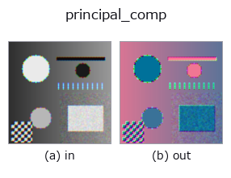
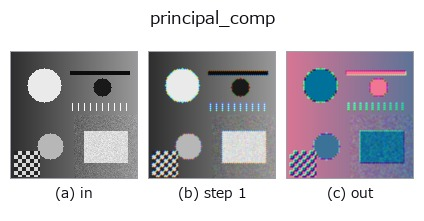
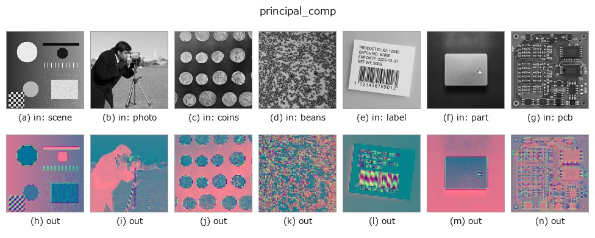

# principal_comp — 2D `color` op

- **データ種**: `color` → `color`
- **呼び出し**: `fullseye.apply(img, "principal_comp", a=0.5, b=0.5)` (2-D は 1 画像 + 2 スカラつまみ `a,b∈[0,1]` のモデル)
- **HALCON 相当**: `principal_comp`(意味・パラメータは HALCON リファレンスが参考になる)



*図は合成の入力 128×128 で実際に走らせた出力。左が入力、右が出力。点群は上から見た散布(明るさ = z)、1-D 列は折れ線、体積は z 方向の最大値投影、動画は中央フレーム、複素画像は振幅、絵にならない返り値は値そのもの。*

*つまみ a は出力を変えない(実測: 0.1 / 0.5 / 0.9 で同一)。*

*つまみ b は出力を変えない(実測: 0.1 / 0.5 / 0.9 で同一)。*

**段階**(前置きの op → この op。左から順):



**別の画像でも**(合成シーン / 写真 / 硬貨。上段が入力、下段がその出力。つまみは既定):



## 使い方

3 チャンネルの主成分分析（PCA）を行い、色空間を分散の大きい順に並べ替える。
HALCON の ``principal_comp``（多チャンネル画像の主成分を計算する）に相当。

画素を (H*W, 3) の行列とみなして平均を引き、共分散行列の固有値分解
（``np.linalg.eigh``）で固有ベクトルを求め、固有値の降順に射影する。
各成分は画像内で min-max により個別に [0,1] へ正規化するため、
出力の明るさは元画像のスケールと無関係になる（正規化後は毎回フルレンジ）。
a, b は未使用。

## 詳しい使い方ガイド

- [gallery2d_color_artistic ファミリ ガイド](../guides/gallery2d_color_artistic.md)

## 背景知識ガイド(この op の手前にある物理・規約)

- [colorimetry](../guides/colorimetry.md) — 測色と分光の知識 — 色は「分光 × 光源 × 観測者」でしか決まらない

## 参考(サンプルデータ・文献)

- [サンプルデータ カタログ(DL URL / ライセンス)](../../SAMPLES.md) — 2-D は skimage.data(BSD/public)+ 合成、3-D は実データ源(Stanford/PDS 等)の DL URL。
- [演算子の来歴・参考文献](../../../REFERENCES.md) — この op 族の元になった研究/手法の出典。
- アルゴリズムの正典(著者・年)と用途は上記**ファミリ使い方ガイド**に記載。

## Studio で試す

下のプログラムは実際に走ることを確かめてある(図と同じ入力)。Studio のヘルプではこのブロックがボタンになり、その場で読み込んで実行できる。

```program
cfa_to_rgb 0.50 0.50
principal_comp 0.50 0.50
```

## 実行できる例(この op を実際に呼ぶ検証済みサンプル)

- [gallery2d_color_artistic](../../../../examples/gallery2d_color_artistic.py) — `py -3.11 examples/gallery2d_color_artistic.py`

## 型が繋がる次の op(`color` を入力に取れる)

[identity](../misc/identity.md) · [trans_from_rgb](trans_from_rgb.md) · [trans_to_rgb](trans_to_rgb.md) · [linear_trans_color](linear_trans_color.md) · [rgb1_to_gray](rgb1_to_gray.md) · [rgb3_to_gray](rgb3_to_gray.md) · [access_channel](access_channel.md) · [edges_color](../edges/edges_color.md)

## 同カテゴリ(`color`)

[cfa_to_rgb](cfa_to_rgb.md) · [trans_from_rgb](trans_from_rgb.md) · [trans_to_rgb](trans_to_rgb.md) · [linear_trans_color](linear_trans_color.md) · [rgb1_to_gray](rgb1_to_gray.md) · [rgb3_to_gray](rgb3_to_gray.md) · [access_channel](access_channel.md)

---
*Provenance: ops.py — 2D operator registry. この per-op ノートは `tools/opdocs.py md` が自動生成(手編集しない)。*

© 2026 Kazufumi Furuse — Fullseye operator documentation. Licensed under Apache-2.0.
