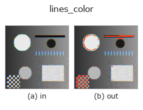
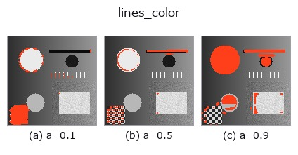
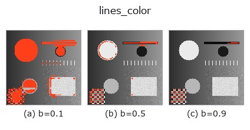
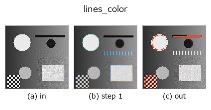
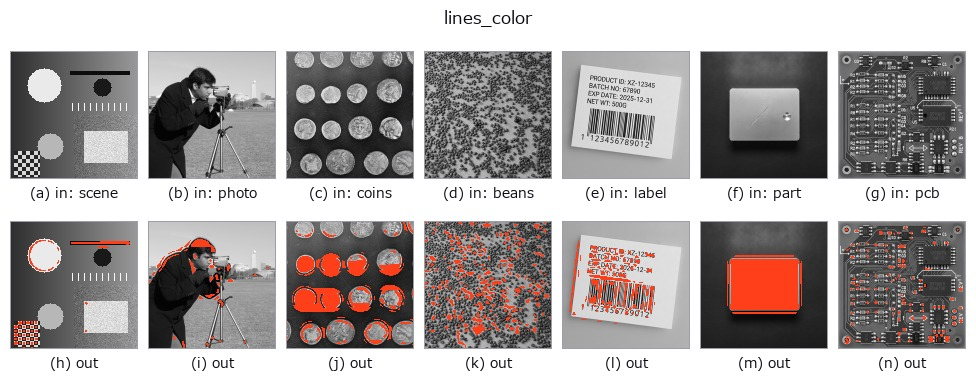

# lines_color — 2D `contour` op

- **データ種**: `color` → `contour`
- **呼び出し**: `fullseye.apply(img, "lines_color", a=0.5, b=0.5)` (2-D は 1 画像 + 2 スカラつまみ `a,b∈[0,1]` のモデル)
- **HALCON 相当**: `lines_color`(意味・パラメータは HALCON リファレンスが参考になる)



*図は合成の入力 128×128 で実際に走らせた出力。左が入力、右が出力。点群は上から見た散布(明るさ = z)、1-D 列は折れ線、体積は z 方向の最大値投影、動画は中央フレーム、複素画像は振幅、絵にならない返り値は値そのもの。*

**つまみ a を振る**(0.1 / 0.5 / 0.9、もう一方は既定):



**つまみ b を振る**(0.1 / 0.5 / 0.9、もう一方は既定):



**段階**(前置きの op → この op。左から順):



**別の画像でも**(合成シーン / 写真 / 硬貨。上段が入力、下段がその出力。つまみは既定):



## 使い方

カラー画像の線（リッジ）を検出する。HALCON の ``lines_color``（カラーの
線とその幅を検出する）に相当するとされるが、**線幅は推定しない**——輝度
画像上のガウシアン・ラプラシアン応答をしきい値二値化して連結成分を
輪郭として返すだけで、線幅（HALCON 側が返す値）に相当する出力は持たない。

``_rgb_to_gray`` で輝度化した後、``scipy.ndimage.gaussian_laplace`` を
シグマ ``0.5 + 2.5 * a`` でかけて絶対値を最大値正規化し、
``0.2 + 0.4 * b`` でしきい値二値化して 8 連結ラベリングする。
a はリッジの太さ（LoG のスケール）、b は検出しきい値を振る。
3 画素未満の成分は捨てる。

## 詳しい使い方ガイド

- [gallery2d_contour_measure ファミリ ガイド](../guides/gallery2d_contour_measure.md)

## 参考(サンプルデータ・文献)

- [サンプルデータ カタログ(DL URL / ライセンス)](../../SAMPLES.md) — 2-D は skimage.data(BSD/public)+ 合成、3-D は実データ源(Stanford/PDS 等)の DL URL。
- [演算子の来歴・参考文献](../../../REFERENCES.md) — この op 族の元になった研究/手法の出典。
- アルゴリズムの正典(著者・年)と用途は上記**ファミリ使い方ガイド**に記載。

## Studio で試す

下のプログラムは実際に走ることを確かめてある(図と同じ入力)。Studio のヘルプではこのブロックがボタンになり、その場で読み込んで実行できる。

```program
cfa_to_rgb 0.50 0.50
lines_color 0.50 0.50
```

## 実行できる例(この op を実際に呼ぶ検証済みサンプル)

- [gallery2d_contour_measure](../../../../examples/gallery2d_contour_measure.py) — `py -3.11 examples/gallery2d_contour_measure.py`

## 型が繋がる次の op(`contour` を入力に取れる)

[identity](../misc/identity.md) · [select_contours](select_contours.md) · [smooth_contours](smooth_contours.md) · [fit_line_contours](fit_line_contours.md) · [contours_to_region](contours_to_region.md) · [count_contours](../features/count_contours.md) · [total_length](../features/total_length.md) · [select_contours_xld](select_contours_xld.md)

## 同カテゴリ(`contour`)

[select_contours](select_contours.md) · [smooth_contours](smooth_contours.md) · [fit_line_contours](fit_line_contours.md) · [contours_to_region](contours_to_region.md) · [sk_find_contours](sk_find_contours.md) · [edges_sub_pix](edges_sub_pix.md) · [lines_gauss](lines_gauss.md) · [select_contours_xld](select_contours_xld.md)

---
*Provenance: ops.py — 2D operator registry. この per-op ノートは `tools/opdocs.py md` が自動生成(手編集しない)。*

© 2026 Kazufumi Furuse — Fullseye operator documentation. Licensed under Apache-2.0.
