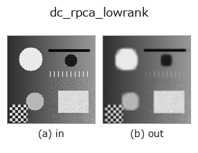
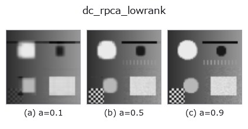
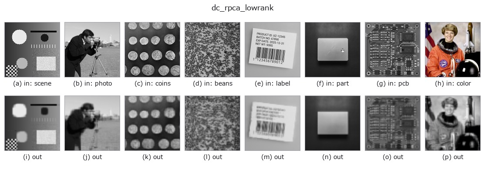

# dc_rpca_lowrank — 2D `decomposition` op

- **データ種**: `image` → `image`
- **呼び出し**: `fullseye.apply(img, "dc_rpca_lowrank", a=0.5, b=0.5)` (2-D は 1 画像 + 2 スカラつまみ `a,b∈[0,1]` のモデル)



*図は合成の入力 128×128 で実際に走らせた出力。左が入力、右が出力。点群は上から見た散布(明るさ = z)、1-D 列は折れ線、体積は z 方向の最大値投影、動画は中央フレーム、複素画像は振幅、絵にならない返り値は値そのもの。*

**つまみ a を振る**(0.1 / 0.5 / 0.9、もう一方は既定):



*つまみ b は出力を変えない(実測: 0.1 / 0.5 / 0.9 で同一)。*

**別の画像でも**(合成シーン / 写真 / 硬貨。上段が入力、下段がその出力。つまみは既定):



*4 列目はカラー (H,W,3) の入力。この op は色を跨がずに扱える(色チャネルを 3 本目の空間軸として畳み込まない)。*

## 使い方

Robust-PCA low-rank (background) part.

画像行列 ``M`` を ``M = L + S``(低ランク ``L`` + スパース ``S``)に分解する
Principal Component Pursuit を inexact ALM(Lin/Chen/Ma 2010)で解き、``L``
を返す。スパース項の重みは ``λ = (0.5 + 1.5*a) / sqrt(max(m, n))``(``m, n``
は分解時の行列寸法)で、``a`` が大きいほど ``S`` が疎になり、その分 ``L`` に
残る成分(ランク)が増える。``a=0`` では ``λ`` が小さく、ほとんどの変動が
``S`` に吸われて ``L`` はのっぺりする。``b`` は未使用。反復は最大 60 回、
収束判定は ``||M - L - S||_F <= 1e-7 * ||M||_F``。

長辺が 64 を超える画像は 64 に縮小して分解し、``L`` だけを線形補間で元の
大きさに戻す(低ランク部は縮小に耐えるため)。入力は [0,1] の 2 次元 float64
に揃え(3 次元はチャネル平均)、返り値も同形・[0,1] に clip。全零画像は入力を
そのまま返す。BLAS のスレッド数は分解中だけ ``fsthreads`` で絞る(小行列の
SVD ではスレッドが多いほど遅いため)。例外時は fail-soft で入力のクリップ版が
返り、台帳に記録される。

「行や列にわたって繰り返す構造」(縞、グラデーション、周期パターン)を背景と
みなす分解なので、単一の 2 次元画像でも織物・シート・ディスプレイ画素などの
周期背景から孤立欠陥を分離するのに向く。自然画像のような非周期背景では
``L`` は単なる低ランク近似で、意味のある背景にならない。対になる欠陥側は
``dc_rpca_sparse``(``L + (S - 0.5) == 入力``)。エッジ保存の平滑で構造を
取りたいなら ``dc_structure_texture``。

## 詳しい使い方ガイド

- [gallery2d_texture_freq ファミリ ガイド](../guides/gallery2d_texture_freq.md)

## 背景知識ガイド(この op の手前にある物理・規約)

- [blas_threads_and_memory](../../math/guides/blas_threads_and_memory.md) — 行列分解が遅い理由の知識 — BLAS スレッド・キャッシュ・メモリ配置

## 参考(サンプルデータ・文献)

- [サンプルデータ カタログ(DL URL / ライセンス)](../../SAMPLES.md) — 2-D は skimage.data(BSD/public)+ 合成、3-D は実データ源(Stanford/PDS 等)の DL URL。
- [演算子の来歴・参考文献](../../../REFERENCES.md) — この op 族の元になった研究/手法の出典。
- アルゴリズムの正典(著者・年)と用途は上記**ファミリ使い方ガイド**に記載。

## Studio で試す

下のプログラムは実際に走ることを確かめてある(図と同じ入力)。Studio のヘルプではこのブロックがボタンになり、その場で読み込んで実行できる。

```program
dc_rpca_lowrank 0.50 0.50
```

## 実行できる例(この op を実際に呼ぶ検証済みサンプル)

- [blas_thread_budget](../../../../examples/blas_thread_budget.py) — `py -3.11 examples/blas_thread_budget.py`
- [gallery2d_texture_freq](../../../../examples/gallery2d_texture_freq.py) — `py -3.11 examples/gallery2d_texture_freq.py`

## 型が繋がる次の op(`image` を入力に取れる)

[identity](../misc/identity.md) · [gaussian](../smoothing/gaussian.md) · [mean_box](../smoothing/mean_box.md) · [bilateral](../smoothing/bilateral.md) · [unsharp](../smoothing/unsharp.md) · [median](../rank/median.md) · [min_filter](../rank/min_filter.md) · [max_filter](../rank/max_filter.md)

## 同カテゴリ(`decomposition`)

[dc_structure_texture](dc_structure_texture.md) · [dc_texture_residual](dc_texture_residual.md) · [dc_rpca_sparse](dc_rpca_sparse.md) · [dc_retinex](dc_retinex.md) · [dc_local_contrast_norm](dc_local_contrast_norm.md) · [dc_homomorphic](dc_homomorphic.md)

---
*Provenance: ops.py — 2D operator registry. この per-op ノートは `tools/opdocs.py md` が自動生成(手編集しない)。*

© 2026 Kazufumi Furuse — Fullseye operator documentation. Licensed under Apache-2.0.
