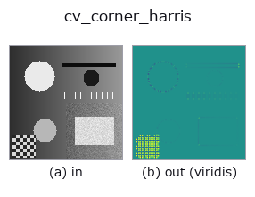
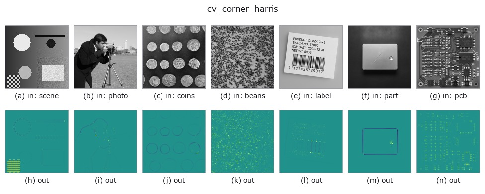

# cv_corner_harris — 2D `edges` op

- **データ種**: `image` → `image`
- **呼び出し**: `fullseye.apply(img, "cv_corner_harris", a=0.5, b=0.5)` (2-D は 1 画像 + 2 スカラつまみ `a,b∈[0,1]` のモデル)
- **HALCON 相当**: `points_harris`(意味・パラメータは HALCON リファレンスが参考になる)



*図は合成の入力 128×128 で実際に走らせた出力。左が入力、右が出力。点群は上から見た散布(明るさ = z)、1-D 列は折れ線、体積は z 方向の最大値投影、動画は中央フレーム、複素画像は振幅、絵にならない返り値は値そのもの。*

*出力は viridis 風の疑似カラー(暗い紫 = 小、黄 = 大)。距離・位相・向き・深度のような「量の場」を読むため。*

*つまみ a は出力を変えない(実測: 0.1 / 0.5 / 0.9 で同一)。*

*つまみ b は出力を変えない(実測: 0.1 / 0.5 / 0.9 で同一)。*

**別の画像でも**(合成シーン / 写真 / 硬貨。上段が入力、下段がその出力。つまみは既定):



*4 列目はカラー (H,W,3) の入力。この op は色を跨がずに扱える(色チャネルを 3 本目の空間軸として畳み込まない)。*

## 使い方

Harris コーナー応答(OpenCV 実装)。sk_corner_harris と同じ Harris の考え方だが、勾配計算・平滑化のブロックサイズなどを固定パラメータで計算するOpenCV 版。

HALCON の `points_harris` に相当(近似)。実装は ``cv2.cornerHarris(v, blockSize=2, ksize=3, k=0.04)`` を ``signed01`` で ``[0,1]`` へ写した値 —— blockSize(近傍サイズ)・ksize(Sobel 開口)・k(Harris の自由パラメータ)はすべて固定。a, b は未使用 —— skimage 版と違いスケールを振る仕組みが無い、素の Harris 応答。

## 詳しい使い方ガイド

- [gallery2d_edges ファミリ ガイド](../guides/gallery2d_edges.md)

## 参考(サンプルデータ・文献)

- [サンプルデータ カタログ(DL URL / ライセンス)](../../SAMPLES.md) — 2-D は skimage.data(BSD/public)+ 合成、3-D は実データ源(Stanford/PDS 等)の DL URL。
- [演算子の来歴・参考文献](../../../REFERENCES.md) — この op 族の元になった研究/手法の出典。
- アルゴリズムの正典(著者・年)と用途は上記**ファミリ使い方ガイド**に記載。

## Studio で試す

下のプログラムは実際に走ることを確かめてある(図と同じ入力)。Studio のヘルプではこのブロックがボタンになり、その場で読み込んで実行できる。

```program
cv_corner_harris 0.40 0.50
```

## 実行できる例(この op を実際に呼ぶ検証済みサンプル)

- [gallery2d_edges](../../../../examples/gallery2d_edges.py) — `py -3.11 examples/gallery2d_edges.py`

## 型が繋がる次の op(`image` を入力に取れる)

[identity](../misc/identity.md) · [gaussian](../smoothing/gaussian.md) · [mean_box](../smoothing/mean_box.md) · [bilateral](../smoothing/bilateral.md) · [unsharp](../smoothing/unsharp.md) · [median](../rank/median.md) · [min_filter](../rank/min_filter.md) · [max_filter](../rank/max_filter.md)

## 同カテゴリ(`edges`)

[sobel_mag](sobel_mag.md) · [prewitt_mag](prewitt_mag.md) · [roberts_mag](roberts_mag.md) · [dog](dog.md) · [grad_dir](grad_dir.md) · [log](log.md) · [corner_response](corner_response.md) · [sk_scharr](sk_scharr.md)

---
*Provenance: ops.py — 2D operator registry. この per-op ノートは `tools/opdocs.py md` が自動生成(手編集しない)。*

© 2026 Kazufumi Furuse — Fullseye operator documentation. Licensed under Apache-2.0.
