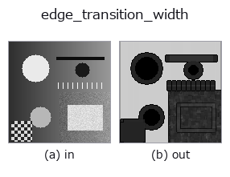
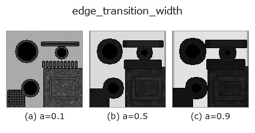
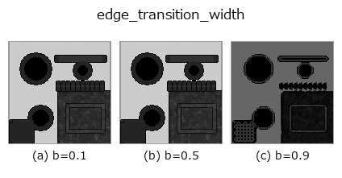
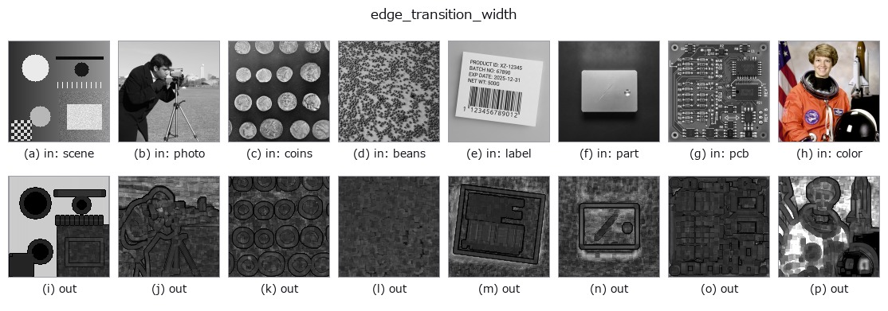

# edge_transition_width — 2D `edges` op

- **データ種**: `image` → `image`
- **呼び出し**: `fullseye.apply(img, "edge_transition_width", a=0.5, b=0.5)` (2-D は 1 画像 + 2 スカラつまみ `a,b∈[0,1]` のモデル)



*図は合成の入力 128×128 で実際に走らせた出力。左が入力、右が出力。点群は上から見た散布(明るさ = z)、1-D 列は折れ線、体積は z 方向の最大値投影、動画は中央フレーム、複素画像は振幅、絵にならない返り値は値そのもの。*

**つまみ a を振る**(0.1 / 0.5 / 0.9、もう一方は既定):



**つまみ b を振る**(0.1 / 0.5 / 0.9、もう一方は既定):



**別の画像でも**(合成シーン / 写真 / 硬貨。上段が入力、下段がその出力。つまみは既定):



*4 列目はカラー (H,W,3) の入力。この op は色を跨がずに扱える(色チャネルを 3 本目の空間軸として畳み込まない)。*

## 使い方

**エッジの遷移幅**(= その場の実効 PSF の広がり)を画素単位で測る。

``a`` が測定窓の一辺を ``3,5,7,9``(``_k(a)``)に振る。``b`` が振幅と勾配の推定量を
選ぶ: ``b <= 0.5`` は窓内の**最大 − 最小**(素直・鋭いが外れ値に弱い)、
``b > 0.5`` は**分位点**で、``b`` を上げるほど分位が 90/10 から 60/40 へ寄って
雑音に鈍くなる(そのぶん段差も丸まる = 取引になっている)。

幅 ≒ 局所の振幅 ÷ 局所の最大勾配。段差が 1 画素で立ち上がれば幅は 1 付近、
ぼけて 5 画素かけて立ち上がれば 5 付近になる。ぼけを**作る** ``simulate_defocus``
の対で、こちらは**測る**側。合焦判定・モーションブラー量・解像限界・
文字が読める大きさかの判定に使える。

**窓が遷移より狭いと過小評価になる**(窓の中に振幅の全部が入らないため)。
出力が 0.7 を超えたら ``a`` を上げて測り直すのが実用則。

**正規化は画像ごとではない**(窓の一辺という定数で割るだけ)ので、**値は画像間で
比較できる**。出力 1.0 は「遷移幅が窓と同じ = 窓より広いかもしれず**測り切れていない**」
の意味で、``a`` を上げて測り直す合図。平坦部やエッジの無い場所は 0。

★**空フレームでは全 0 を返す**(「端が無い」)。床を画像自身の振幅に対する相対量
だけで置くと、一様な画像では基準まで丸め屑になり、屑どうしの比が構造に化ける ——
実測で 0.5 一色に 1e-12 の雑音を乗せただけの画像が幅 3.49(= 窓の半分)を返した。
**振幅そのものが絶対床 1e-6 に届かない画像には端が無い**と言い切る。
端の扱いは ``scipy.ndimage`` の既定 ``reflect``。内部で 8 bit に落とす処理は無い。

## 詳しい使い方ガイド

- [gallery2d_edges ファミリ ガイド](../guides/gallery2d_edges.md)

## 参考(サンプルデータ・文献)

- [サンプルデータ カタログ(DL URL / ライセンス)](../../SAMPLES.md) — 2-D は skimage.data(BSD/public)+ 合成、3-D は実データ源(Stanford/PDS 等)の DL URL。
- [演算子の来歴・参考文献](../../../REFERENCES.md) — この op 族の元になった研究/手法の出典。
- アルゴリズムの正典(著者・年)と用途は上記**ファミリ使い方ガイド**に記載。

## Studio で試す

下のプログラムは実際に走ることを確かめてある(図と同じ入力)。Studio のヘルプではこのブロックがボタンになり、その場で読み込んで実行できる。

```program
edge_transition_width 0.40 0.50
```

## 実行できる例(この op を実際に呼ぶ検証済みサンプル)

- [gallery2d_edges](../../../../examples/gallery2d_edges.py) — `py -3.11 examples/gallery2d_edges.py`

## 型が繋がる次の op(`image` を入力に取れる)

[identity](../misc/identity.md) · [gaussian](../smoothing/gaussian.md) · [mean_box](../smoothing/mean_box.md) · [bilateral](../smoothing/bilateral.md) · [unsharp](../smoothing/unsharp.md) · [median](../rank/median.md) · [min_filter](../rank/min_filter.md) · [max_filter](../rank/max_filter.md)

## 同カテゴリ(`edges`)

[sobel_mag](sobel_mag.md) · [prewitt_mag](prewitt_mag.md) · [roberts_mag](roberts_mag.md) · [dog](dog.md) · [grad_dir](grad_dir.md) · [log](log.md) · [corner_response](corner_response.md) · [sk_scharr](sk_scharr.md)

---
*Provenance: ops.py — 2D operator registry. この per-op ノートは `tools/opdocs.py md` が自動生成(手編集しない)。*

© 2026 Kazufumi Furuse — Fullseye operator documentation. Licensed under Apache-2.0.
