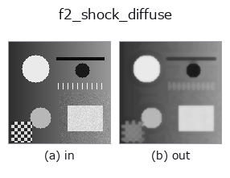
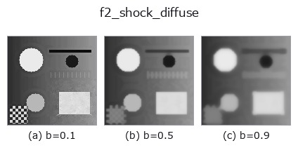
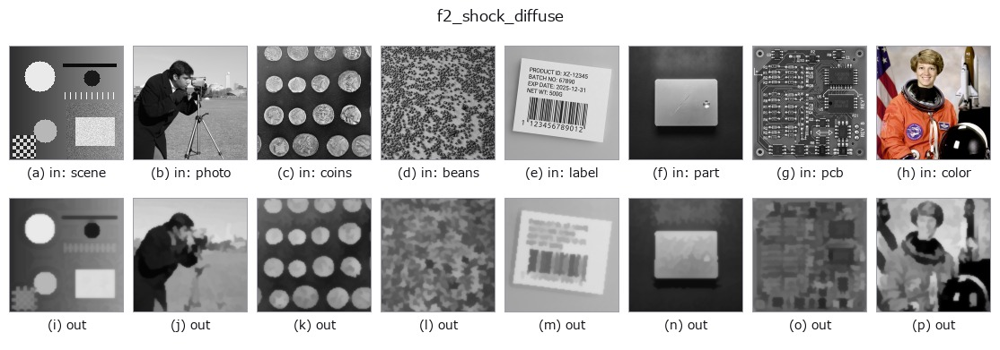

# f2_shock_diffuse — 2D `edges` op

- **データ種**: `image` → `image`
- **呼び出し**: `fullseye.apply(img, "f2_shock_diffuse", a=0.5, b=0.5)` (2-D は 1 画像 + 2 スカラつまみ `a,b∈[0,1]` のモデル)



*図は合成の入力 128×128 で実際に走らせた出力。左が入力、右が出力。点群は上から見た散布(明るさ = z)、1-D 列は折れ線、体積は z 方向の最大値投影、動画は中央フレーム、複素画像は振幅、絵にならない返り値は値そのもの。*

**つまみ a を振る**(0.1 / 0.5 / 0.9、もう一方は既定):


**つまみ b を振る**(0.1 / 0.5 / 0.9、もう一方は既定):



**別の画像でも**(合成シーン / 写真 / 硬貨。上段が入力、下段がその出力。つまみは既定):



*4 列目はカラー (H,W,3) の入力。この op は色を跨がずに扱える(色チャネルを 3 本目の空間軸として畳み込まない)。*

## 使い方

Regularised shock filter: diffuse, then shock, repeated (Alvarez-Mazorra).

``f2_shock`` is the pure Osher-Rudin shock — *contraction only*. It takes the
sign of the Laplacian of the raw image, so every noise bump is a zero crossing
and becomes its own shock: on a blurred edge with sigma 0.02 noise it raises
the flat-area noise from 0.020 to 0.050 (**2.5x**) and pushes the edge step to
0.539 — **past the true step of 0.500**, which is the noise being promoted to
structure rather than the edge being recovered.

The remedy is to alternate the two flows: **expand** (a Gaussian diffusion)
and **contract** (the shock), taking both the sign *and* the dilation/erosion
from the smoothed copy, so the contraction can only act on structure the
diffusion left standing.

``a`` sets the number of diffuse/shock pairs (1..10); ``b`` sets the diffusion
width sigma (0.4..2.0) and is **the trade-off knob**. Measured on that same
blurred noisy edge (input: step 0.112, flat noise 0.0201):

    b = 0.00 (sigma 0.40)   step 0.407   noise 0.0245  (x1.2)
    b = 0.10 (sigma 0.56)   step 0.272   noise 0.0091  (x0.45 - noise falls)
    b = 0.25 (sigma 0.80)   step 0.218   noise 0.0054
    b = 0.50 (sigma 1.20)   step 0.187   noise 0.0032
    b = 1.00 (sigma 2.00)   step 0.099   noise 0.0016

So ``b`` near 0 keeps most of the sharpening with almost none of the noise
amplification; from ``b`` about 0.1 upward the filter **removes** noise while
still more than doubling the input's edge step.

**Applicability.** (1) It sharpens what is already there — it cannot recover
detail the blur destroyed, and the step never reaches the true 0.500 here.
(2) Every iteration is a morphological max/min, so thin bright lines thicken
and thin dark lines are eaten; count the iterations you can afford.
(3) With ``b`` large the diffusion dominates and the result approaches a plain
Gaussian blur — check that the step is still above the input's.

## 詳しい使い方ガイド

- [gallery2d_edges ファミリ ガイド](../guides/gallery2d_edges.md)

## 参考(サンプルデータ・文献)

- [サンプルデータ カタログ(DL URL / ライセンス)](../../SAMPLES.md) — 2-D は skimage.data(BSD/public)+ 合成、3-D は実データ源(Stanford/PDS 等)の DL URL。
- [演算子の来歴・参考文献](../../../REFERENCES.md) — この op 族の元になった研究/手法の出典。
- アルゴリズムの正典(著者・年)と用途は上記**ファミリ使い方ガイド**に記載。

## Studio で試す

下のプログラムは実際に走ることを確かめてある(図と同じ入力)。Studio のヘルプではこのブロックがボタンになり、その場で読み込んで実行できる。

```program
f2_shock_diffuse 0.40 0.50
```

## 実行できる例(この op を実際に呼ぶ検証済みサンプル)

- [gallery2d_edges](../../../../examples/gallery2d_edges.py) — `py -3.11 examples/gallery2d_edges.py`

## 型が繋がる次の op(`image` を入力に取れる)

[identity](../misc/identity.md) · [gaussian](../smoothing/gaussian.md) · [mean_box](../smoothing/mean_box.md) · [bilateral](../smoothing/bilateral.md) · [unsharp](../smoothing/unsharp.md) · [median](../rank/median.md) · [min_filter](../rank/min_filter.md) · [max_filter](../rank/max_filter.md)

## 同カテゴリ(`edges`)

[sobel_mag](sobel_mag.md) · [prewitt_mag](prewitt_mag.md) · [roberts_mag](roberts_mag.md) · [dog](dog.md) · [edge_transition_width](edge_transition_width.md) · [grad_dir](grad_dir.md) · [log](log.md) · [corner_response](corner_response.md)

---
*Provenance: ops.py — 2D operator registry. この per-op ノートは `tools/opdocs.py md` が自動生成(手編集しない)。*

© 2026 Kazufumi Furuse — Fullseye operator documentation. Licensed under Apache-2.0.
