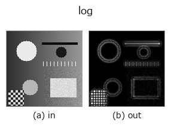
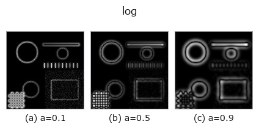
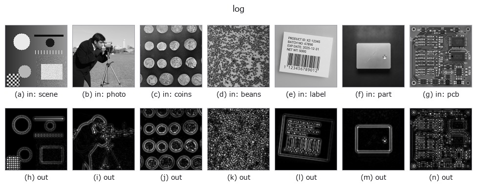

# log — 2D `edges` op

- **データ種**: `image` → `image`
- **呼び出し**: `fullseye.apply(img, "log", a=0.5, b=0.5)` (2-D は 1 画像 + 2 スカラつまみ `a,b∈[0,1]` のモデル)
- **HALCON 相当**: `laplace_of_gauss`(意味・パラメータは HALCON リファレンスが参考になる)



*図は合成の入力 128×128 で実際に走らせた出力。左が入力、右が出力。点群は上から見た散布(明るさ = z)、1-D 列は折れ線、体積は z 方向の最大値投影、動画は中央フレーム、複素画像は振幅、絵にならない返り値は値そのもの。*

**つまみ a を振る**(0.1 / 0.5 / 0.9、もう一方は既定):



*つまみ b は出力を変えない(実測: 0.1 / 0.5 / 0.9 で同一)。*

**別の画像でも**(合成シーン / 写真 / 硬貨。上段が入力、下段がその出力。つまみは既定):



*カラー (H,W,3) の入力は載せていない: この op は色チャネルを 3 本目の空間軸として扱う(色を跨ぐ)ため。チャネルごとに分けて呼ぶこと。*

## 使い方

ラプラシアン・オブ・ガウシアン（LoG）フィルタ。HALCON の ``laplace_of_gauss``（LoG-Operator (Laplace of Gaussian).）に相当。

``a`` がガウシアンの標準偏差 σ を ``0.5〜3.0`` に振る。``b`` は未使用。``scipy.ndimage.gaussian_laplace`` の絶対値を ``_norm`` で正規化する（符号を捨てているため、暗背景上の明斑点と明背景上の暗斑点を区別できない）。ブロブ（斑点状構造）検出やエッジ検出に使う。

## 詳しい使い方ガイド

- [gallery2d_edges ファミリ ガイド](../guides/gallery2d_edges.md)

## 参考(サンプルデータ・文献)

- [サンプルデータ カタログ(DL URL / ライセンス)](../../SAMPLES.md) — 2-D は skimage.data(BSD/public)+ 合成、3-D は実データ源(Stanford/PDS 等)の DL URL。
- [演算子の来歴・参考文献](../../../REFERENCES.md) — この op 族の元になった研究/手法の出典。
- アルゴリズムの正典(著者・年)と用途は上記**ファミリ使い方ガイド**に記載。

## Studio で試す

下のプログラムは実際に走ることを確かめてある(図と同じ入力)。Studio のヘルプではこのブロックがボタンになり、その場で読み込んで実行できる。

```program
log 0.40 0.50
```

## 実行できる例(この op を実際に呼ぶ検証済みサンプル)

- [gallery2d_edges](../../../../examples/gallery2d_edges.py) — `py -3.11 examples/gallery2d_edges.py`
- [poc_colormap_readability](../../../../examples/poc_colormap_readability.py) — `py -3.11 examples/poc_colormap_readability.py`
- [poc_datacenter_thermal_field](../../../../examples/poc_datacenter_thermal_field.py) — `py -3.11 examples/poc_datacenter_thermal_field.py`

## 型が繋がる次の op(`image` を入力に取れる)

[identity](../misc/identity.md) · [gaussian](../smoothing/gaussian.md) · [mean_box](../smoothing/mean_box.md) · [bilateral](../smoothing/bilateral.md) · [unsharp](../smoothing/unsharp.md) · [median](../rank/median.md) · [min_filter](../rank/min_filter.md) · [max_filter](../rank/max_filter.md)

## 同カテゴリ(`edges`)

[sobel_mag](sobel_mag.md) · [prewitt_mag](prewitt_mag.md) · [roberts_mag](roberts_mag.md) · [dog](dog.md) · [grad_dir](grad_dir.md) · [corner_response](corner_response.md) · [sk_scharr](sk_scharr.md) · [sk_farid](sk_farid.md)

---
*Provenance: ops.py — 2D operator registry. この per-op ノートは `tools/opdocs.py md` が自動生成(手編集しない)。*

© 2026 Kazufumi Furuse — Fullseye operator documentation. Licensed under Apache-2.0.
