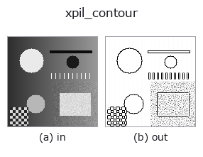
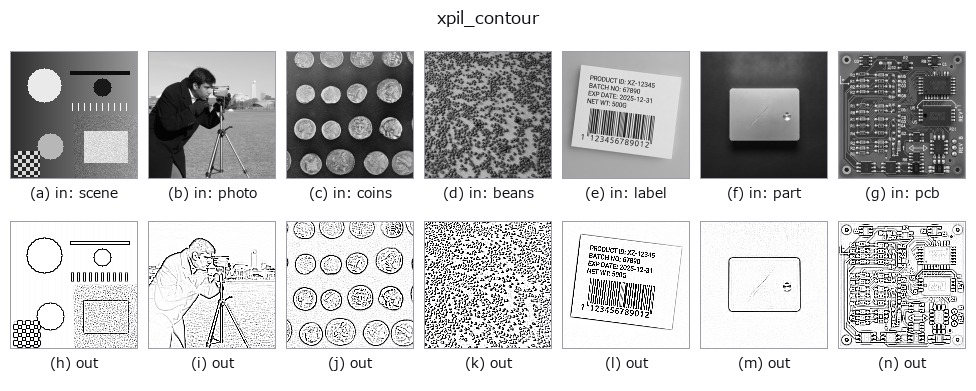

# xpil_contour — 2D `edges` op

- **データ種**: `image` → `image`
- **呼び出し**: `fullseye.apply(img, "xpil_contour", a=0.5, b=0.5)` (2-D は 1 画像 + 2 スカラつまみ `a,b∈[0,1]` のモデル)



*図は合成の入力 128×128 で実際に走らせた出力。左が入力、右が出力。点群は上から見た散布(明るさ = z)、1-D 列は折れ線、体積は z 方向の最大値投影、動画は中央フレーム、複素画像は振幅、絵にならない返り値は値そのもの。*

*つまみ a は出力を変えない(実測: 0.1 / 0.5 / 0.9 で同一)。*

*つまみ b は出力を変えない(実測: 0.1 / 0.5 / 0.9 で同一)。*

**別の画像でも**(合成シーン / 写真 / 硬貨。上段が入力、下段がその出力。つまみは既定):



*4 列目はカラー (H,W,3) の入力。この op は色を跨がずに扱える(色チャネルを 3 本目の空間軸として畳み込まない)。*

## 使い方

Pillow の輪郭抽出フィルタ。``PIL.ImageFilter.CONTOUR`` の固定カーネルで輪郭線だけを白背景に黒線で残すような効果を作る（ペン画・線画調のエフェクト）。

a, b は未使用（固定カーネル）。

カーネルは 3x3 の ``[-1,-1,-1; -1,8,-1; -1,-1,-1]``（scale 1、offset 255）で、出力は ``255 + (8*中心 - 8 近傍の和)`` を 0〜255 に飽和させたもの。平坦部は255（白）、周囲より暗い画素は暗く、周囲より明るい画素は 255 で飽和する。つまり段差の「暗い側」に 1 画素幅の黒線が乗り、明るい側は白のまま（``xpil_find_edges`` は同じカーネルで offset 0 なので両側が明るく出る）。

入力は [0,1] に clip して ``*255`` の切り捨てで 8 ビットの L 画像にし、出力を ``/255`` で [0,1] に戻す（1/255 の量子化が入る）。画像の最外周1 画素は Pillow がフィルタせず入力値のまま返す。0 サイズの画像はValueError で拒否され、fail-soft で入力のクリップ版に落ちる（台帳に記録）。ノイズにも反応するので、前段に ``xpil_smooth_more`` や ``median`` を置くと線が整理される。線を領域として使うなら ``invert`` で黒線側を明るくしてから ``threshold`` に繋ぐ。

## 詳しい使い方ガイド

- [gallery2d_edges ファミリ ガイド](../guides/gallery2d_edges.md)

## 参考(サンプルデータ・文献)

- [サンプルデータ カタログ(DL URL / ライセンス)](../../SAMPLES.md) — 2-D は skimage.data(BSD/public)+ 合成、3-D は実データ源(Stanford/PDS 等)の DL URL。
- [演算子の来歴・参考文献](../../../REFERENCES.md) — この op 族の元になった研究/手法の出典。
- アルゴリズムの正典(著者・年)と用途は上記**ファミリ使い方ガイド**に記載。

## Studio で試す

下のプログラムは実際に走ることを確かめてある(図と同じ入力)。Studio のヘルプではこのブロックがボタンになり、その場で読み込んで実行できる。

```program
xpil_contour 0.40 0.50
```

## 実行できる例(この op を実際に呼ぶ検証済みサンプル)

- [gallery2d_edges](../../../../examples/gallery2d_edges.py) — `py -3.11 examples/gallery2d_edges.py`

## 型が繋がる次の op(`image` を入力に取れる)

[identity](../misc/identity.md) · [gaussian](../smoothing/gaussian.md) · [mean_box](../smoothing/mean_box.md) · [bilateral](../smoothing/bilateral.md) · [unsharp](../smoothing/unsharp.md) · [median](../rank/median.md) · [min_filter](../rank/min_filter.md) · [max_filter](../rank/max_filter.md)

## 同カテゴリ(`edges`)

[sobel_mag](sobel_mag.md) · [prewitt_mag](prewitt_mag.md) · [roberts_mag](roberts_mag.md) · [dog](dog.md) · [grad_dir](grad_dir.md) · [log](log.md) · [corner_response](corner_response.md) · [sk_scharr](sk_scharr.md)

---
*Provenance: ops.py — 2D operator registry. この per-op ノートは `tools/opdocs.py md` が自動生成(手編集しない)。*

© 2026 Kazufumi Furuse — Fullseye operator documentation. Licensed under Apache-2.0.
