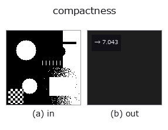
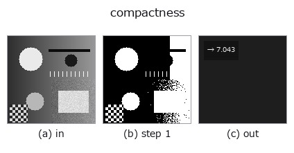

# compactness — 2D `features` op

- **データ種**: `region` → `feature`
- **呼び出し**: `fullseye.apply(img, "compactness", a=0.5, b=0.5)` (2-D は 1 画像 + 2 スカラつまみ `a,b∈[0,1]` のモデル)
- **HALCON 相当**: `compactness`(意味・パラメータは HALCON リファレンスが参考になる)



*図は合成の入力 128×128 で実際に走らせた出力。左が入力、右が出力。点群は上から見た散布(明るさ = z)、1-D 列は折れ線、体積は z 方向の最大値投影、動画は中央フレーム、複素画像は振幅、絵にならない返り値は値そのもの。*

*つまみ a は出力を変えない(実測: 0.1 / 0.5 / 0.9 で同一)。*

*つまみ b は出力を変えない(実測: 0.1 / 0.5 / 0.9 で同一)。*

**段階**(前置きの op → この op。左から順):



## 使い方

コンパクトさ ``周囲長² / (4π・面積)``。円で 1、細長い/ぎざぎざ/穴が多いほど
大きくなり、**上限は無い**。HALCON の ``compactness``（Shape factor for the
compactness of a region.）と同じ量。

★2026-09-26 まで ``/10`` して ``min(1.0, ...)`` で切っていた —— 値を [0,1] に
収めるための便宜だったが、``周囲長²/(4π・面積)`` が 10 を超える形(幅 2 px なら
長さ 80 以上の傷)を**全部 1.0 に潰していた**。傷や割れという、いちばん見たい
領域で「形が違うのに同じ数」が返っていたことになる。値域 [0,1] はそもそも
feature の契約ではない(``elliptic_axis`` は 6.35、``r3_region_features`` は
18.1 を返す)ので、潰す理由が無かった ――
``docs/hardening/compactness-saturated-at-one.md``。

HALCON は ``max(1, C)`` と**下で**切る(画素近似で 1 を下回りうるため)が、
ここでは切らない。1 を下回る値は「領域が小さすぎて近似が効いていない」と
いう情報そのもので、必要なら呼ぶ側で切れる。

``a``, ``b`` は未使用。

## 詳しい使い方ガイド

- [gallery2d_features ファミリ ガイド](../guides/gallery2d_features.md)

## 参考(サンプルデータ・文献)

- [サンプルデータ カタログ(DL URL / ライセンス)](../../SAMPLES.md) — 2-D は skimage.data(BSD/public)+ 合成、3-D は実データ源(Stanford/PDS 等)の DL URL。
- [演算子の来歴・参考文献](../../../REFERENCES.md) — この op 族の元になった研究/手法の出典。
- アルゴリズムの正典(著者・年)と用途は上記**ファミリ使い方ガイド**に記載。

## Studio で試す

下のプログラムは実際に走ることを確かめてある(図と同じ入力)。Studio のヘルプではこのブロックがボタンになり、その場で読み込んで実行できる。

```program
threshold 0.50 0.50
compactness 0.50 0.50
```

## 実行できる例(この op を実際に呼ぶ検証済みサンプル)

- [gallery2d_features](../../../../examples/gallery2d_features.py) — `py -3.11 examples/gallery2d_features.py`
- [shape_factors_closed_form](../../../../examples/shape_factors_closed_form.py) — `py -3.11 examples/shape_factors_closed_form.py`

## 型が繋がる次の op(`feature` を入力に取れる)

[identity](../misc/identity.md) · [feature_to_img](../bridge/feature_to_img.md)

## 同カテゴリ(`features`)

[effective_bit_depth](effective_bit_depth.md) · [blob_count](blob_count.md) · [area_frac](area_frac.md) · [count_contours](count_contours.md) · [total_length](total_length.md) · [vol_count](vol_count.md) · [sk_euler](sk_euler.md) · [sk_entropy_feat](sk_entropy_feat.md)

---
*Provenance: ops.py — 2D operator registry. この per-op ノートは `tools/opdocs.py md` が自動生成(手編集しない)。*

© 2026 Kazufumi Furuse — Fullseye operator documentation. Licensed under Apache-2.0.
