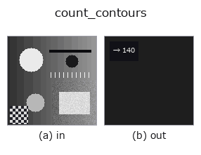
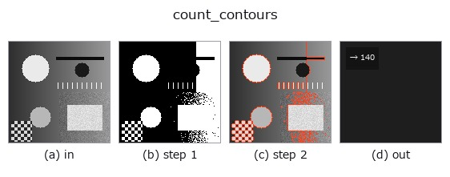

# count_contours — 2D `features` op

- **データ種**: `contour` → `feature`
- **呼び出し**: `fullseye.apply(img, "count_contours", a=0.5, b=0.5)` (2-D は 1 画像 + 2 スカラつまみ `a,b∈[0,1]` のモデル)
- **HALCON 相当**: `count_obj`(意味・パラメータは HALCON リファレンスが参考になる)



*図は合成の入力 128×128 で実際に走らせた出力。左が入力、右が出力。点群は上から見た散布(明るさ = z)、1-D 列は折れ線、体積は z 方向の最大値投影、動画は中央フレーム、複素画像は振幅、絵にならない返り値は値そのもの。*

*つまみ a は出力を変えない(実測: 0.1 / 0.5 / 0.9 で同一)。*

*つまみ b は出力を変えない(実測: 0.1 / 0.5 / 0.9 で同一)。*

**段階**(前置きの op → この op。左から順):



## 使い方

輪郭（オブジェクト）の本数を返す特徴量。HALCON の ``count_obj``（Number of objects in a tuple.）に相当。

``a``, ``b`` は未使用。輪郭リストの長さをそのまま返すだけ。

- 入力は XLD 輪郭 dict ``{"shape": (H, W), "cs": [(N_i, 2), ...]}``。数えるのは ``cs`` の要素数で、各輪郭の点数・長さ・閉じているかは見ない(点が 1 つの輪郭も 1 本)。
- 返り値は ``np.float64``(sort ``feature``)。0 本なら 0.0。
- 前段の輪郭抽出(``sk_find_contours`` / ``edges_sub_pix`` / ``hx_gen_contours_skeleton``)がどう分割するかで値が決まる —— 同じ形でも 1 画素の切れ目で本数が増える。本数を安定させたいなら ``select_contours``(長さでの選別)や ``hx_union_adjacent_contours`` を間に置く。
- 「物体の数」として使うなら ``connection``(region の連結成分)+ ``count_regions`` 相当のほうが切れ目に強い。

## 詳しい使い方ガイド

- [gallery2d_features ファミリ ガイド](../guides/gallery2d_features.md)

## 参考(サンプルデータ・文献)

- [サンプルデータ カタログ(DL URL / ライセンス)](../../SAMPLES.md) — 2-D は skimage.data(BSD/public)+ 合成、3-D は実データ源(Stanford/PDS 等)の DL URL。
- [演算子の来歴・参考文献](../../../REFERENCES.md) — この op 族の元になった研究/手法の出典。
- アルゴリズムの正典(著者・年)と用途は上記**ファミリ使い方ガイド**に記載。

## Studio で試す

下のプログラムは実際に走ることを確かめてある(図と同じ入力)。Studio のヘルプではこのブロックがボタンになり、その場で読み込んで実行できる。

```program
threshold 0.50 0.50
sk_find_contours 0.50 0.50
count_contours 0.50 0.50
```

## 実行できる例(この op を実際に呼ぶ検証済みサンプル)

- [gallery2d_features](../../../../examples/gallery2d_features.py) — `py -3.11 examples/gallery2d_features.py`

## 型が繋がる次の op(`feature` を入力に取れる)

[identity](../misc/identity.md)

## 同カテゴリ(`features`)

[blob_count](blob_count.md) · [area_frac](area_frac.md) · [total_length](total_length.md) · [vol_count](vol_count.md) · [sk_euler](sk_euler.md) · [sk_entropy_feat](sk_entropy_feat.md) · [sk_blur_effect](sk_blur_effect.md) · [cv_cc_count](cv_cc_count.md)

---
*Provenance: ops.py — 2D operator registry. この per-op ノートは `tools/opdocs.py md` が自動生成(手編集しない)。*

© 2026 Kazufumi Furuse — Fullseye operator documentation. Licensed under Apache-2.0.
