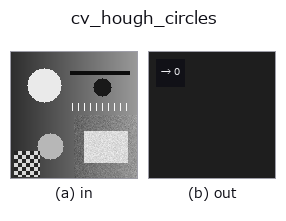

# cv_hough_circles — 2D `features` op

- **データ種**: `image` → `feature`
- **呼び出し**: `fullseye.apply(img, "cv_hough_circles", a=0.5, b=0.5)` (2-D は 1 画像 + 2 スカラつまみ `a,b∈[0,1]` のモデル)
- **HALCON 相当**: `hough_circles`(意味・パラメータは HALCON リファレンスが参考になる)



*図は合成の入力 128×128 で実際に走らせた出力。左が入力、右が出力。点群は上から見た散布(明るさ = z)、1-D 列は折れ線、体積は z 方向の最大値投影、動画は中央フレーム、複素画像は振幅、絵にならない返り値は値そのもの。*

*つまみ a は出力を変えない(実測: 0.1 / 0.5 / 0.9 で同一)。*

*つまみ b は出力を変えない(実測: 0.1 / 0.5 / 0.9 で同一)。*

## 使い方

Hough 変換による円検出(1 スカラー特徴量、OpenCV 実装)。エッジの勾配情報を使う HOUGH_GRADIENT 法で円の中心・半径を投票検出する —— ここでは検出できた円の個数だけを返す(0 個なら 0)。

HALCON の `hough_circles`(Detect centers of circles for a specific radius using the Hough transform.)に相当(近似。中心座標ではなく本数のみ)。実装は ``cv2.HoughCircles(_u8(v), HOUGH_GRADIENT, dp=1, minDist=10+int(a*20), param1=100, param2=20+int(b*20), minRadius=3, maxRadius=20)`` —— a は検出する円同士の最小中心間距離を 10〜30 に、b は中心検出の投票しきい値 param2(小さいほど誤検出が増える)を 20〜40 に振る。param1(内部の Canny 高しきい値)と半径範囲(3〜20)は固定。

## 詳しい使い方ガイド

- [gallery2d_features ファミリ ガイド](../guides/gallery2d_features.md)

## 参考(サンプルデータ・文献)

- [サンプルデータ カタログ(DL URL / ライセンス)](../../SAMPLES.md) — 2-D は skimage.data(BSD/public)+ 合成、3-D は実データ源(Stanford/PDS 等)の DL URL。
- [演算子の来歴・参考文献](../../../REFERENCES.md) — この op 族の元になった研究/手法の出典。
- アルゴリズムの正典(著者・年)と用途は上記**ファミリ使い方ガイド**に記載。

## Studio で試す

下のプログラムは実際に走ることを確かめてある(図と同じ入力)。Studio のヘルプではこのブロックがボタンになり、その場で読み込んで実行できる。

```program
cv_hough_circles 0.50 0.50
```

## 実行できる例(この op を実際に呼ぶ検証済みサンプル)

- [gallery2d_features](../../../../examples/gallery2d_features.py) — `py -3.11 examples/gallery2d_features.py`

## 型が繋がる次の op(`feature` を入力に取れる)

[identity](../misc/identity.md)

## 同カテゴリ(`features`)

[blob_count](blob_count.md) · [area_frac](area_frac.md) · [count_contours](count_contours.md) · [total_length](total_length.md) · [vol_count](vol_count.md) · [sk_euler](sk_euler.md) · [sk_entropy_feat](sk_entropy_feat.md) · [sk_blur_effect](sk_blur_effect.md)

---
*Provenance: ops.py — 2D operator registry. この per-op ノートは `tools/opdocs.py md` が自動生成(手編集しない)。*

© 2026 Kazufumi Furuse — Fullseye operator documentation. Licensed under Apache-2.0.
