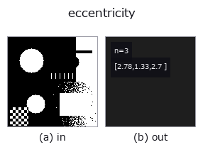
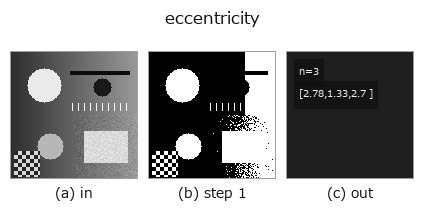

# eccentricity — 2D `features` op

- **データ種**: `region` → `match`
- **呼び出し**: `fullseye.apply(img, "eccentricity", a=0.5, b=0.5)` (2-D は 1 画像 + 2 スカラつまみ `a,b∈[0,1]` のモデル)
- **HALCON 相当**: `eccentricity`(意味・パラメータは HALCON リファレンスが参考になる)



*図は合成の入力 128×128 で実際に走らせた出力。左が入力、右が出力。点群は上から見た散布(明るさ = z)、1-D 列は折れ線、体積は z 方向の最大値投影、動画は中央フレーム、複素画像は振幅、絵にならない返り値は値そのもの。*

*つまみ a は出力を変えない(実測: 0.1 / 0.5 / 0.9 で同一)。*

*つまみ b は出力を変えない(実測: 0.1 / 0.5 / 0.9 で同一)。*

**段階**(前置きの op → この op。左から順):



## 使い方

楕円パラメータ由来の 3 つの形状指標 ``(Anisometry, Bulkiness, StructureFactor)``
を、``match`` ソートの 3 成分ベクトルで返す(1 スカラーでは 3 値を表せないため、
``area_center`` と同じ形)。

``Ra``/``Rb`` を同じモーメントを持つ楕円の半径、``A`` を面積として

  ``Anisometry = Ra/Rb``(細長さ。円で 1、下限 1)
  ``Bulkiness = π·Ra·Rb / A``(楕円をどれだけ埋めていないか。円で 1)
  ``StructureFactor = Anisometry·Bulkiness - 1``(円で 0)

HALCON の ``eccentricity``（Shape features derived from the ellipse
parameters.）**と同じ 3 値・同じ式**。3 つとも無次元なので正規化していない。

★2026-09-26 まで skimage の離心率 ``sqrt(1-(b/a)²)`` という**3 つのどれでもない
量**を 1 スカラーで返していた(円で 0.0 対 HALCON の 1.0、4x80 の棒で 0.999 対
20.65)。1 スカラーでは 3 値を表せないため、``area_center`` と同じ ``match``
ソートに変えた。``docs/hardening/halcon-named-shape-factors.md``。

領域が空のときは円の値 ``(1, 1, 0)`` を返す fail-soft 仕様(成分数は入力で
変わらない)。``a``, ``b`` は未使用。

## 詳しい使い方ガイド

- [gallery2d_features ファミリ ガイド](../guides/gallery2d_features.md)

## 参考(サンプルデータ・文献)

- [サンプルデータ カタログ(DL URL / ライセンス)](../../SAMPLES.md) — 2-D は skimage.data(BSD/public)+ 合成、3-D は実データ源(Stanford/PDS 等)の DL URL。
- [演算子の来歴・参考文献](../../../REFERENCES.md) — この op 族の元になった研究/手法の出典。
- アルゴリズムの正典(著者・年)と用途は上記**ファミリ使い方ガイド**に記載。

## Studio で試す

下のプログラムは実際に走ることを確かめてある(図と同じ入力)。Studio のヘルプではこのブロックがボタンになり、その場で読み込んで実行できる。

```program
threshold 0.50 0.50
eccentricity 0.50 0.50
```

## 実行できる例(この op を実際に呼ぶ検証済みサンプル)

- [gallery2d_features](../../../../examples/gallery2d_features.py) — `py -3.11 examples/gallery2d_features.py`
- [poc_rotation_invariance_audit](../../../../examples/poc_rotation_invariance_audit.py) — `py -3.11 examples/poc_rotation_invariance_audit.py`

## 型が繋がる次の op(`match` を入力に取れる)

[identity](../misc/identity.md)

## 同カテゴリ(`features`)

[effective_bit_depth](effective_bit_depth.md) · [blob_count](blob_count.md) · [area_frac](area_frac.md) · [count_contours](count_contours.md) · [total_length](total_length.md) · [vol_count](vol_count.md) · [sk_euler](sk_euler.md) · [sk_entropy_feat](sk_entropy_feat.md)

---
*Provenance: ops.py — 2D operator registry. この per-op ノートは `tools/opdocs.py md` が自動生成(手編集しない)。*

© 2026 Kazufumi Furuse — Fullseye operator documentation. Licensed under Apache-2.0.
