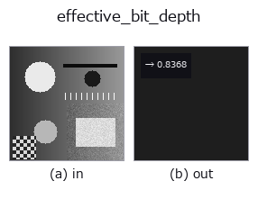

# effective_bit_depth — 2D `features` op

- **データ種**: `image` → `feature`
- **呼び出し**: `fullseye.apply(img, "effective_bit_depth", a=0.5, b=0.5)` (2-D は 1 画像 + 2 スカラつまみ `a,b∈[0,1]` のモデル)



*図は合成の入力 128×128 で実際に走らせた出力。左が入力、右が出力。点群は上から見た散布(明るさ = z)、1-D 列は折れ線、体積は z 方向の最大値投影、動画は中央フレーム、複素画像は振幅、絵にならない返り値は値そのもの。*

*つまみ a は出力を変えない(実測: 0.1 / 0.5 / 0.9 で同一)。*

*つまみ b は出力を変えない(実測: 0.1 / 0.5 / 0.9 で同一)。*

## 使い方

画像が**実際に**使っているビット数を推定して ``[0,1]`` に写して返す(feature)。

``8`` ビットの器に入っていても、中身が ``6`` ビット相当しかないことはよくある ——
低ビットのセンサを引き伸ばした、一度 JPEG を通した、ガンマを掛けた、など。
ここでは占有している階調の**実際の間隔**から実効ビット数を推定する:
出現した画素値を並べ、隣り合う値の差の**最頻値**を刻み ``Δ`` とみて
``bits = log2(1 + 1/Δ)``。返り値は ``bits / 16`` (``a``/``b`` は未使用)。

**適用条件と外れ方**: (1) ★**画素数が上限を決める**。階調がほぼ連続(浮動小数の
まま処理した画像)では、最小の刻みは「値が N 個あるときの平均間隔 ~1/N」なので、
推定は ``log2(N)`` 付近で頭打ちになる —— 128x128(N=16384)の連続画像で実測
**13.7 bit**。16 に飽和するわけではないので、**「これ以上は測れない」線を
画素数から先に引いておくこと**(小さな切り抜きで測ると低く出る)。(2) 非線形な変換(ガンマ・対数)を通った後は
刻みが場所によって違うので、最頻値は「代表的な刻み」であって一様な刻みではない。
(3) ディザが掛かっている画像では階調が埋まるので、実効ビット数は**高く**出る ——
それは「情報として何ビット分あるか」ではなく「何段使っているか」の答え。

## 詳しい使い方ガイド

- [gallery2d_features ファミリ ガイド](../guides/gallery2d_features.md)

## 参考(サンプルデータ・文献)

- [サンプルデータ カタログ(DL URL / ライセンス)](../../SAMPLES.md) — 2-D は skimage.data(BSD/public)+ 合成、3-D は実データ源(Stanford/PDS 等)の DL URL。
- [演算子の来歴・参考文献](../../../REFERENCES.md) — この op 族の元になった研究/手法の出典。
- アルゴリズムの正典(著者・年)と用途は上記**ファミリ使い方ガイド**に記載。

## Studio で試す

下のプログラムは実際に走ることを確かめてある(図と同じ入力)。Studio のヘルプではこのブロックがボタンになり、その場で読み込んで実行できる。

```program
effective_bit_depth 0.50 0.50
```

## 実行できる例(この op を実際に呼ぶ検証済みサンプル)

- [gallery2d_features](../../../../examples/gallery2d_features.py) — `py -3.11 examples/gallery2d_features.py`

## 型が繋がる次の op(`feature` を入力に取れる)

[identity](../misc/identity.md)

## 同カテゴリ(`features`)

[blob_count](blob_count.md) · [area_frac](area_frac.md) · [count_contours](count_contours.md) · [total_length](total_length.md) · [vol_count](vol_count.md) · [sk_euler](sk_euler.md) · [sk_entropy_feat](sk_entropy_feat.md) · [sk_blur_effect](sk_blur_effect.md)

---
*Provenance: ops.py — 2D operator registry. この per-op ノートは `tools/opdocs.py md` が自動生成(手編集しない)。*

© 2026 Kazufumi Furuse — Fullseye operator documentation. Licensed under Apache-2.0.
