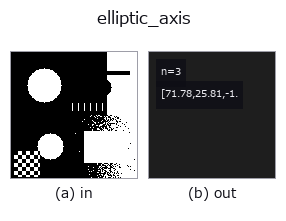
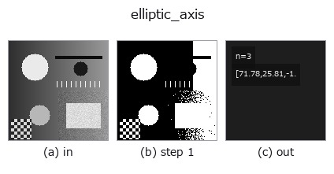

# elliptic_axis — 2D `features` op

- **データ種**: `region` → `match`
- **呼び出し**: `fullseye.apply(img, "elliptic_axis", a=0.5, b=0.5)` (2-D は 1 画像 + 2 スカラつまみ `a,b∈[0,1]` のモデル)
- **HALCON 相当**: `elliptic_axis`(意味・パラメータは HALCON リファレンスが参考になる)



*図は合成の入力 128×128 で実際に走らせた出力。左が入力、右が出力。点群は上から見た散布(明るさ = z)、1-D 列は折れ線、体積は z 方向の最大値投影、動画は中央フレーム、複素画像は振幅、絵にならない返り値は値そのもの。*

*つまみ a は出力を変えない(実測: 0.1 / 0.5 / 0.9 で同一)。*

*つまみ b は出力を変えない(実測: 0.1 / 0.5 / 0.9 で同一)。*

**段階**(前置きの op → この op。左から順):



## 使い方

領域に等価な楕円(equivalent ellipse、慣性モーメントが一致する楕円)の``(Ra, Rb, Phi)`` を ``match`` ソートの 3 成分ベクトルで返す —— ``Ra``/``Rb`` は長半径・短半径(**画素**)、``Phi`` は主軸の角(ラジアン、列軸から反時計回り)。HALCON の ``elliptic_axis`` (Calculate the parameters of the equivalent ellipse.)と同じ 3 値。

★2026-09-26 まで ``Ra/Rb``(= **別の演算子 `eccentricity` の出力** Anisometry)を 10 で割った 1 スカラーを返していた —— 名前が約束している量ではなかった。docs/hardening/halcon-named-shape-factors.md。

``a``, ``b`` は未使用。

## 詳しい使い方ガイド

- [gallery2d_features ファミリ ガイド](../guides/gallery2d_features.md)

## 参考(サンプルデータ・文献)

- [サンプルデータ カタログ(DL URL / ライセンス)](../../SAMPLES.md) — 2-D は skimage.data(BSD/public)+ 合成、3-D は実データ源(Stanford/PDS 等)の DL URL。
- [演算子の来歴・参考文献](../../../REFERENCES.md) — この op 族の元になった研究/手法の出典。
- アルゴリズムの正典(著者・年)と用途は上記**ファミリ使い方ガイド**に記載。

## Studio で試す

下のプログラムは実際に走ることを確かめてある(図と同じ入力)。Studio のヘルプではこのブロックがボタンになり、その場で読み込んで実行できる。

```program
threshold 0.50 0.50
elliptic_axis 0.50 0.50
```

## 実行できる例(この op を実際に呼ぶ検証済みサンプル)

- [gallery2d_features](../../../../examples/gallery2d_features.py) — `py -3.11 examples/gallery2d_features.py`

## 型が繋がる次の op(`match` を入力に取れる)

[identity](../misc/identity.md)

## 同カテゴリ(`features`)

[effective_bit_depth](effective_bit_depth.md) · [blob_count](blob_count.md) · [area_frac](area_frac.md) · [count_contours](count_contours.md) · [total_length](total_length.md) · [vol_count](vol_count.md) · [sk_euler](sk_euler.md) · [sk_entropy_feat](sk_entropy_feat.md)

---
*Provenance: ops.py — 2D operator registry. この per-op ノートは `tools/opdocs.py md` が自動生成(手編集しない)。*

© 2026 Kazufumi Furuse — Fullseye operator documentation. Licensed under Apache-2.0.
