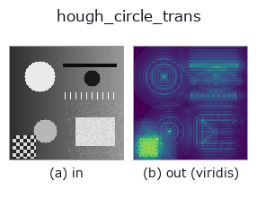
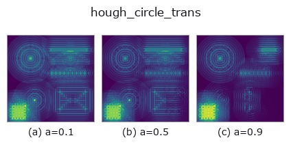
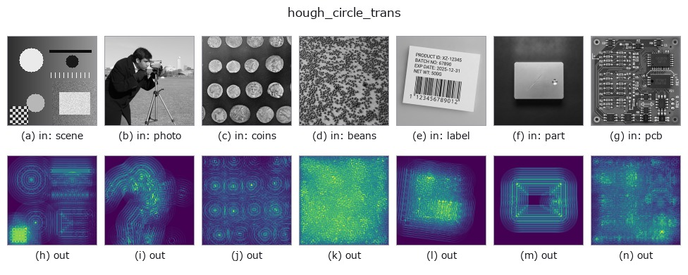

# hough_circle_trans — 2D `features` op

- **データ種**: `image` → `image`
- **呼び出し**: `fullseye.apply(img, "hough_circle_trans", a=0.5, b=0.5)` (2-D は 1 画像 + 2 スカラつまみ `a,b∈[0,1]` のモデル)
- **HALCON 相当**: `hough_circle_trans`(意味・パラメータは HALCON リファレンスが参考になる)



*図は合成の入力 128×128 で実際に走らせた出力。左が入力、右が出力。点群は上から見た散布(明るさ = z)、1-D 列は折れ線、体積は z 方向の最大値投影、動画は中央フレーム、複素画像は振幅、絵にならない返り値は値そのもの。*

*出力は viridis 風の疑似カラー(暗い紫 = 小、黄 = 大)。距離・位相・向き・深度のような「量の場」を読むため。*

**つまみ a を振る**(0.1 / 0.5 / 0.9、もう一方は既定):



*つまみ b は出力を変えない(実測: 0.1 / 0.5 / 0.9 で同一)。*

**別の画像でも**(合成シーン / 写真 / 硬貨。上段が入力、下段がその出力。つまみは既定):



*4 列目はカラー (H,W,3) の入力。この op は色を跨がずに扱える(色チャネルを 3 本目の空間軸として畳み込まない)。*

## 使い方

円検出のための Hough 変換。エッジマスクに対して半径 4〜19(3 刻み)の
円テンプレート群で ``skimage.transform.hough_circle`` を計算し、全半径での
最大応答を [0,1] に正規化して返す。HALCON の ``hough_circle_trans``
（Return the Hough-Transform for circles with a given radius.）に相当
(HALCON は半径を明示指定するが、ここでは固定レンジを総当たりする近似)。

``a`` がエッジ抽出の閾値を振り、``b`` が探索する半径の上限を決める
(``radii = arange(4, max(7, round(4 + 32*b)), 3)``。既定の ``b=0.5`` は
従来どおり半径 4〜19)。★**対象より小さい半径しか探していないと、この op は
落ちずに意味の無い累算器を返す**。実写のコイン 24 枚(半径 19〜31 px)で
非極大抑制して数えると ``b=0.5`` で 13 峰、上限まで広げた ``b=1.0`` でも
19 峰にしかならない ―― 半径の刻みが 3 で、しかも全半径の最大に潰して
いるため。**半径を明示できる HALCON の同名 op の代わりにはならない**
(``examples/poc_real_coin_metrology.py`` が数字で示す)。

## 詳しい使い方ガイド

- [gallery2d_features ファミリ ガイド](../guides/gallery2d_features.md)

## 参考(サンプルデータ・文献)

- [サンプルデータ カタログ(DL URL / ライセンス)](../../SAMPLES.md) — 2-D は skimage.data(BSD/public)+ 合成、3-D は実データ源(Stanford/PDS 等)の DL URL。
- [演算子の来歴・参考文献](../../../REFERENCES.md) — この op 族の元になった研究/手法の出典。
- アルゴリズムの正典(著者・年)と用途は上記**ファミリ使い方ガイド**に記載。

## Studio で試す

下のプログラムは実際に走ることを確かめてある(図と同じ入力)。Studio のヘルプではこのブロックがボタンになり、その場で読み込んで実行できる。

```program
hough_circle_trans 0.50 0.50
```

## 実行できる例(この op を実際に呼ぶ検証済みサンプル)

- [gallery2d_features](../../../../examples/gallery2d_features.py) — `py -3.11 examples/gallery2d_features.py`
- [poc_real_coin_metrology](../../../../examples/poc_real_coin_metrology.py) — `py -3.11 examples/poc_real_coin_metrology.py`

## 型が繋がる次の op(`image` を入力に取れる)

[identity](../misc/identity.md) · [gaussian](../smoothing/gaussian.md) · [mean_box](../smoothing/mean_box.md) · [bilateral](../smoothing/bilateral.md) · [unsharp](../smoothing/unsharp.md) · [median](../rank/median.md) · [min_filter](../rank/min_filter.md) · [max_filter](../rank/max_filter.md)

## 同カテゴリ(`features`)

[blob_count](blob_count.md) · [area_frac](area_frac.md) · [count_contours](count_contours.md) · [total_length](total_length.md) · [vol_count](vol_count.md) · [sk_euler](sk_euler.md) · [sk_entropy_feat](sk_entropy_feat.md) · [sk_blur_effect](sk_blur_effect.md)

---
*Provenance: ops.py — 2D operator registry. この per-op ノートは `tools/opdocs.py md` が自動生成(手編集しない)。*

© 2026 Kazufumi Furuse — Fullseye operator documentation. Licensed under Apache-2.0.
