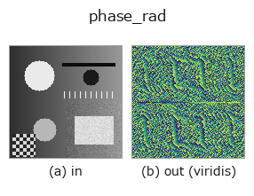
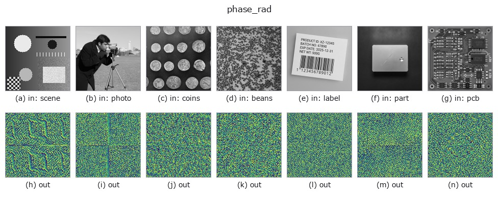

# phase_rad — 2D `frequency` op

- **データ種**: `image` → `image`
- **呼び出し**: `fullseye.apply(img, "phase_rad", a=0.5, b=0.5)` (2-D は 1 画像 + 2 スカラつまみ `a,b∈[0,1]` のモデル)
- **HALCON 相当**: `phase_rad`(意味・パラメータは HALCON リファレンスが参考になる)



*図は合成の入力 128×128 で実際に走らせた出力。左が入力、右が出力。点群は上から見た散布(明るさ = z)、1-D 列は折れ線、体積は z 方向の最大値投影、動画は中央フレーム、複素画像は振幅、絵にならない返り値は値そのもの。*

*出力は viridis 風の疑似カラー(暗い紫 = 小、黄 = 大)。距離・位相・向き・深度のような「量の場」を読むため。*

*つまみ a は出力を変えない(実測: 0.1 / 0.5 / 0.9 で同一)。*

*つまみ b は出力を変えない(実測: 0.1 / 0.5 / 0.9 で同一)。*

**別の画像でも**(合成シーン / 写真 / 硬貨。上段が入力、下段がその出力。つまみは既定):



*カラー (H,W,3) の入力は載せていない: この op は色チャネルを 3 本目の空間軸として扱う(色を跨ぐ)ため。チャネルごとに分けて呼ぶこと。*

## 使い方

FFT の位相 ``angle(F)`` をラジアンから [0,1] に線形写像したもの(0=−π,
1=+π)。パワースペクトルが失う位相情報(構造の空間的な位置情報の大半を
担う)を可視化する。HALCON の ``phase_rad``（Return the phase of a complex
image in radians.）に相当。

``a``, ``b`` は未使用。位相はノイズにきわめて敏感で、平坦な領域ではほぼ
無意味な値になる点に注意。

## 詳しい使い方ガイド

- [gallery2d_texture_freq ファミリ ガイド](../guides/gallery2d_texture_freq.md)

## 参考(サンプルデータ・文献)

- [サンプルデータ カタログ(DL URL / ライセンス)](../../SAMPLES.md) — 2-D は skimage.data(BSD/public)+ 合成、3-D は実データ源(Stanford/PDS 等)の DL URL。
- [演算子の来歴・参考文献](../../../REFERENCES.md) — この op 族の元になった研究/手法の出典。
- アルゴリズムの正典(著者・年)と用途は上記**ファミリ使い方ガイド**に記載。

## Studio で試す

下のプログラムは実際に走ることを確かめてある(図と同じ入力)。Studio のヘルプではこのブロックがボタンになり、その場で読み込んで実行できる。

```program
phase_rad 0.40 0.50
```

## 実行できる例(この op を実際に呼ぶ検証済みサンプル)

- [acoustic_condition_monitoring](../../../../examples/acoustic_condition_monitoring.py) — `py -3.11 examples/acoustic_condition_monitoring.py`
- [gallery2d_texture_freq](../../../../examples/gallery2d_texture_freq.py) — `py -3.11 examples/gallery2d_texture_freq.py`
- [poc_leak_localization](../../../../examples/poc_leak_localization.py) — `py -3.11 examples/poc_leak_localization.py`

## 型が繋がる次の op(`image` を入力に取れる)

[identity](../misc/identity.md) · [gaussian](../smoothing/gaussian.md) · [mean_box](../smoothing/mean_box.md) · [bilateral](../smoothing/bilateral.md) · [unsharp](../smoothing/unsharp.md) · [median](../rank/median.md) · [min_filter](../rank/min_filter.md) · [max_filter](../rank/max_filter.md)

## 同カテゴリ(`frequency`)

[lowpass](lowpass.md) · [highpass](highpass.md) · [sk_butterworth](sk_butterworth.md) · [fft_image](fft_image.md) · [power_real](power_real.md) · [power_byte](power_byte.md) · [highpass_image](highpass_image.md) · [bandpass_image](bandpass_image.md)

---
*Provenance: ops.py — 2D operator registry. この per-op ノートは `tools/opdocs.py md` が自動生成(手編集しない)。*

© 2026 Kazufumi Furuse — Fullseye operator documentation. Licensed under Apache-2.0.
