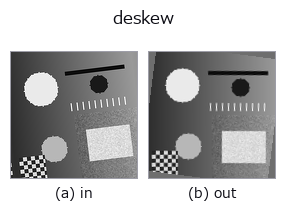
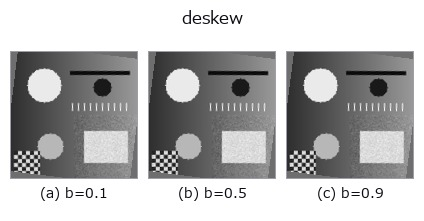
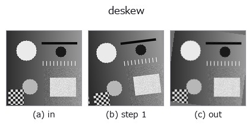
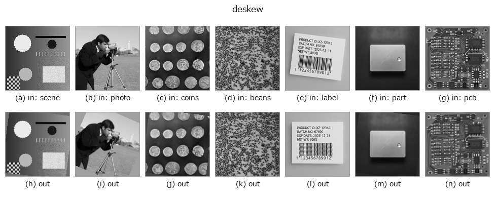

# deskew — 2D `geometry` op

- **データ種**: `image` → `image`
- **呼び出し**: `fullseye.apply(img, "deskew", a=0.5, b=0.5)` (2-D は 1 画像 + 2 スカラつまみ `a,b∈[0,1]` のモデル)



*図は合成の入力 128×128 で実際に走らせた出力。左が入力、右が出力。点群は上から見た散布(明るさ = z)、1-D 列は折れ線、体積は z 方向の最大値投影、動画は中央フレーム、複素画像は振幅、絵にならない返り値は値そのもの。*

**つまみ a を振る**(0.1 / 0.5 / 0.9、もう一方は既定):


**つまみ b を振る**(0.1 / 0.5 / 0.9、もう一方は既定):



**段階**(前置きの op → この op。左から順):



**別の画像でも**(合成シーン / 写真 / 硬貨。上段が入力、下段がその出力。つまみは既定):



*カラー (H,W,3) の入力は載せていない: この op は色チャネルを 3 本目の空間軸として扱う(色を跨ぐ)ため。チャネルごとに分けて呼ぶこと。*

## 使い方

**傾きを測って起こす**(deskew)。角度をノブで与えるのではなく、画像から推定する。

``a`` が探索の範囲 ``±(2 + 43a)°`` を振る(a=0 で ±2°、a=1 で ±45°)。``b`` が
精緻化の刻み ``1/(1 + round(9b))°`` を振る(b=0 で 1° 刻み、b=1 で 0.1° 刻み。
細かいほど遅い ―― ここが取引になっている)。

判定量は**横方向の射影プロファイルの差分二乗和**。ある角度で回したときに行が
揃うと、行方向に潰した濃度の折れ線が最も激しく上下する。1° 刻みで粗く探し、
最良の ±1° を ``b`` の刻みで詰める。同点なら**角度の小さい方**を採るので、
構造の無い画像・空フレームでは 0°(= 入力をそのまま返す)に落ちる。

* 探索は**長辺 256 画素に間引いた写し**で行う(角度は間引きで変わらない)。
  原寸で回すのは最後の 1 回だけ。512x512 で最も広い探索でも実測 121 ms。
* 点数は回転後の**中央の正方形**(一辺 = ``min(H,W)/sqrt(2)``)だけで取る ――
  どの角度でも枠内に収まる範囲なので、角の埋めかたが点数に混ざらない。
* **枠外は縁の中央値で埋める**(``mode="constant"``)。既存の ``rotate_image`` は
  鏡映で埋めるため、帳票を起こすと**四隅に鏡文字が写り込む**(向こうの docstring が
  自ら「枠外を背景色で埋めたい用途には向かない」と認めている)。起こしたものを
  そのまま OCR・切り出しへ渡せるのが、この op の足し前。

**実測の精度と限界**(行間 14 画素・幅 384 画素の合成頁): ``b=1``(0.1° 刻み)で
1 / 2 / 3.7 / 5 / 12 / 20° のいずれも**誤差 0.00°**。ただし **0.6° 未満の傾きは
0 を返す** ―― 頁の幅いっぱいでも行のずれが 1 画素に届かず、射影の鋭さが補間の
丸まりに埋もれるため。細かく測りたければ入力を大きくする(判定量は幅に比例する)。

**先行研究**: 射影プロファイルで傾きを測るのは古典で、Postl (1986) が**分散**を、
Baird (1987) が**二乗和 + 粗密の角度探索**を判定量にした。この op は Baird の系譜で、
新しいのは手法ではなく**縁の扱い**である(下記)。

★**以前は差分基準が +3.0 度 ずれていた。その原因が確定した。** 2026-09-17 の事前測定で、
真値 −7/−3/+3/+7 度 に対し分散基準は誤差 0.0 度、差分基準は 4 本すべて +3.0 度 ずれ、原因は
``ndimage.rotate`` が作る縁の人工物だろうが「``mode="constant"`` で消えるかは未検証」と
記録していた。**塗り方ではなく見る範囲が原因だった** —— 回転後の内接正方形だけで点を
取ると、差分基準でも 1/2/3.7/5/12/20 度 のすべてで誤差 0.00 度 になる(実測)。

**値域は入力のまま**(線形補間と縁の中央値はどちらも値域を広げない)。★空フレーム
(値域 1e-9 未満)と 8 画素未満の入力はそのまま返す。★**タイル分割してはいけない**
―― 角度は画像全体から 1 つ決まるもので、タイルごとに測ると各タイルが別々の角度で
回る(``scale.py`` に理由つきで登録済み)。

## 詳しい使い方ガイド

- [gallery2d_geometry ファミリ ガイド](../guides/gallery2d_geometry.md)

## 参考(サンプルデータ・文献)

- [サンプルデータ カタログ(DL URL / ライセンス)](../../SAMPLES.md) — 2-D は skimage.data(BSD/public)+ 合成、3-D は実データ源(Stanford/PDS 等)の DL URL。
- [演算子の来歴・参考文献](../../../REFERENCES.md) — この op 族の元になった研究/手法の出典。
- アルゴリズムの正典(著者・年)と用途は上記**ファミリ使い方ガイド**に記載。

## Studio で試す

下のプログラムは実際に走ることを確かめてある(図と同じ入力)。Studio のヘルプではこのブロックがボタンになり、その場で読み込んで実行できる。

```program
rotate_img 0.58 0.50
deskew 0.50 0.50
```

## 実行できる例(この op を実際に呼ぶ検証済みサンプル)

- [gallery2d_geometry](../../../../examples/gallery2d_geometry.py) — `py -3.11 examples/gallery2d_geometry.py`

## 型が繋がる次の op(`image` を入力に取れる)

[identity](../misc/identity.md) · [gaussian](../smoothing/gaussian.md) · [mean_box](../smoothing/mean_box.md) · [bilateral](../smoothing/bilateral.md) · [unsharp](../smoothing/unsharp.md) · [median](../rank/median.md) · [min_filter](../rank/min_filter.md) · [max_filter](../rank/max_filter.md)

## 同カテゴリ(`geometry`)

[rotate_img](rotate_img.md) · [rescale_img](rescale_img.md) · [affine_warp](affine_warp.md) · [sk_swirl](sk_swirl.md) · [mirror_image](mirror_image.md) · [transpose_region](transpose_region.md) · [rotate_image](rotate_image.md) · [zoom_image_factor](zoom_image_factor.md)

---
*Provenance: ops.py — 2D operator registry. この per-op ノートは `tools/opdocs.py md` が自動生成(手編集しない)。*

© 2026 Kazufumi Furuse — Fullseye operator documentation. Licensed under Apache-2.0.
