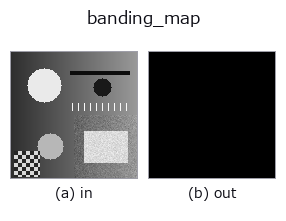
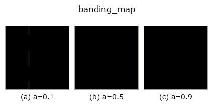
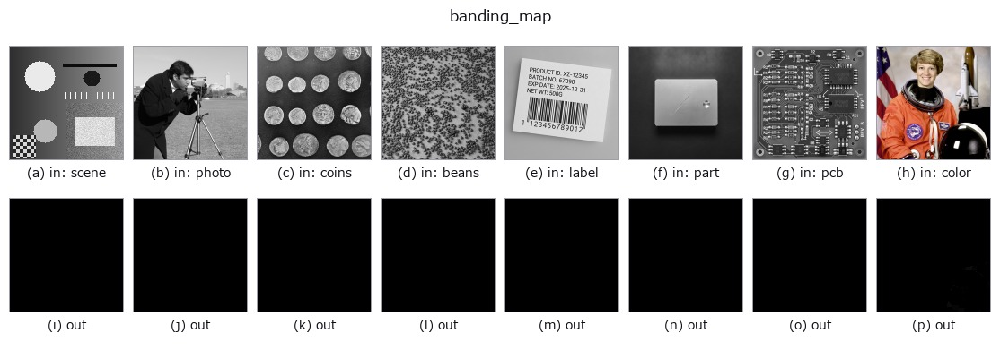

# banding_map — 2D `gray` op

- **データ種**: `image` → `image`
- **呼び出し**: `fullseye.apply(img, "banding_map", a=0.5, b=0.5)` (2-D は 1 画像 + 2 スカラつまみ `a,b∈[0,1]` のモデル)



*図は合成の入力 128×128 で実際に走らせた出力。左が入力、右が出力。点群は上から見た散布(明るさ = z)、1-D 列は折れ線、体積は z 方向の最大値投影、動画は中央フレーム、複素画像は振幅、絵にならない返り値は値そのもの。*

**つまみ a を振る**(0.1 / 0.5 / 0.9、もう一方は既定):



*つまみ b は出力を変えない(実測: 0.1 / 0.5 / 0.9 で同一)。*

**別の画像でも**(合成シーン / 写真 / 硬貨。上段が入力、下段がその出力。つまみは既定):



*4 列目はカラー (H,W,3) の入力。この op は色を跨がずに扱える(色チャネルを 3 本目の空間軸として畳み込まない)。*

## 使い方

階調の**段差(バンディング)が見えている場所**を返す。``a`` がビット数、``b`` が窓。

段差が「見える」条件は 3 つそろったときで、この op はその 3 つを順に掛ける。

1. **刻みの上に乗っている** —— 値が ``k*Δ`` の格子にある。量子化していない画像に
   バンディングは無い(浮動小数の雑音はここで落ちる)。
2. **窓の中がちょうど 1 刻みだけ動く** —— 窓内の最大と最小の差(peak-to-peak)が
   ``Δ`` の 1 倍。0 倍(平坦)でも 2 倍以上(本物の輪郭)でもない。
3. **まばらな線である** —— 段差は等高線に沿った細い線として出る。広い範囲が一斉に
   反応しているなら、それは段差ではなく**ディザや細かい模様**。

``a`` は量子化のビット数 1〜8(入力が既に量子化済みなら、その段数を指定する)。
``b`` は窓の広さ(3〜9 画素)。

**この 3 段にした理由(実測)**: peak-to-peak だけで判定したところ、白色雑音で
画素の **41.7 %**、順序ディザ済みの画像で **97.7 %** が「段差」と出た —— 局所の
ptp がたまたま ``Δ`` になるだけで条件を満たしてしまうため。条件 1 が雑音を、
条件 3 がディザを落とす。3-bit に量子化した傾斜では **7.0 %**(段差の線そのもの)
が残る。

**適用条件**: (1) 入力のビット数を間違えると全く効かない —— 分からないときは
``effective_bit_depth`` で先に測る。(2) 入力が一度でも滑らかに補間・再標本化
されていると条件 1 が崩れる(格子から外れる)。段差を測るなら**量子化した直後の
画像に当てる**こと。

## 詳しい使い方ガイド

- [gallery2d_gray_arith ファミリ ガイド](../guides/gallery2d_gray_arith.md)

## 参考(サンプルデータ・文献)

- [サンプルデータ カタログ(DL URL / ライセンス)](../../SAMPLES.md) — 2-D は skimage.data(BSD/public)+ 合成、3-D は実データ源(Stanford/PDS 等)の DL URL。
- [演算子の来歴・参考文献](../../../REFERENCES.md) — この op 族の元になった研究/手法の出典。
- アルゴリズムの正典(著者・年)と用途は上記**ファミリ使い方ガイド**に記載。

## Studio で試す

下のプログラムは実際に走ることを確かめてある(図と同じ入力)。Studio のヘルプではこのブロックがボタンになり、その場で読み込んで実行できる。

```program
banding_map 0.50 0.50
```

## 実行できる例(この op を実際に呼ぶ検証済みサンプル)

- [gallery2d_gray_arith](../../../../examples/gallery2d_gray_arith.py) — `py -3.11 examples/gallery2d_gray_arith.py`

## 型が繋がる次の op(`image` を入力に取れる)

[identity](../misc/identity.md) · [gaussian](../smoothing/gaussian.md) · [mean_box](../smoothing/mean_box.md) · [bilateral](../smoothing/bilateral.md) · [unsharp](../smoothing/unsharp.md) · [median](../rank/median.md) · [min_filter](../rank/min_filter.md) · [max_filter](../rank/max_filter.md)

## 同カテゴリ(`gray`)

[gamma](gamma.md) · [quantize_uniform](quantize_uniform.md) · [quantize_lloyd_max](quantize_lloyd_max.md) · [quantization_error](quantization_error.md) · [dither_ordered](dither_ordered.md) · [dither_floyd_steinberg](dither_floyd_steinberg.md) · [companding_mu_law](companding_mu_law.md) · [invert](invert.md)

---
*Provenance: ops.py — 2D operator registry. この per-op ノートは `tools/opdocs.py md` が自動生成(手編集しない)。*

© 2026 Kazufumi Furuse — Fullseye operator documentation. Licensed under Apache-2.0.
