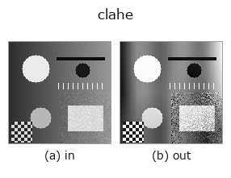
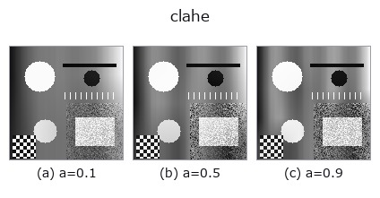
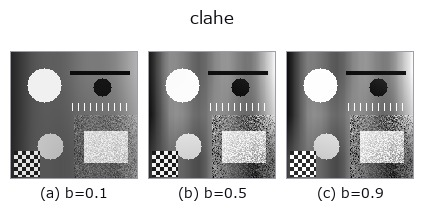
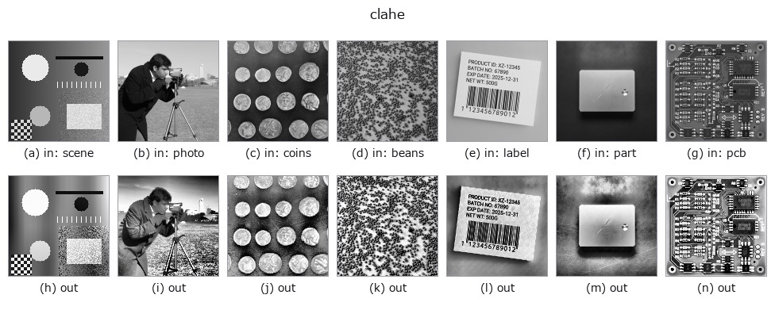

# clahe — 2D `gray` op

- **データ種**: `image` → `image`
- **呼び出し**: `fullseye.apply(img, "clahe", a=0.5, b=0.5)` (2-D は 1 画像 + 2 スカラつまみ `a,b∈[0,1]` のモデル)



*図は合成の入力 128×128 で実際に走らせた出力。左が入力、右が出力。点群は上から見た散布(明るさ = z)、1-D 列は折れ線、体積は z 方向の最大値投影、動画は中央フレーム、複素画像は振幅、絵にならない返り値は値そのもの。*

**つまみ a を振る**(0.1 / 0.5 / 0.9、もう一方は既定):



**つまみ b を振る**(0.1 / 0.5 / 0.9、もう一方は既定):



**別の画像でも**(合成シーン / 写真 / 硬貨。上段が入力、下段がその出力。つまみは既定):



*4 列目はカラー (H,W,3) の入力。この op は色を跨がずに扱える(色チャネルを 3 本目の空間軸として畳み込まない)。*

## 使い方

Contrast-Limited Adaptive Histogram Equalization (tiled, bilinearly blended).

- ``a`` — タイル数 ``nb = 2 + int(3a)`` (画像を nb×nb に分割)
- ``b`` — **clip limit**。ビン平均カウントに対する倍率 ``256**b`` で与える
  (``b=0`` → 1 倍 = 完全に平坦化されたヒストグラム = トーンマップ直線 =
  強調ゼロ、``b=1`` → 256 倍 = 1 ビンが取り得る最大値なので切り取りが
  効かない = 素の AHE、``b=0.5`` → 16 倍。OpenCV の既定 ``clipLimit=40`` は
  おおよそ ``b=0.665``)。

★2026-09-02(この修正): それまで ``b`` は **完全に死んでいた**(実測:
``max|clahe(x,0.5,0.0) - clahe(x,0.5,1.0)| == 0.0`` きっかり)。CLAHE の
"C" は contrast **limited** の C であり、clip limit こそが AHE と CLAHE を
分ける当のものなので、**実装は AHE であって CLAHE ではなかった** ——
名前が嘘をついていた。ここで clip limit を実装して ``b`` に割り当て、
``b=1`` が旧実装とビット一致する端になるよう倍率を選んである
(切り取りが起きない上限 = ビン数 256 倍)。

Tiles PARTITION the image (linspace boundaries, so the last tile absorbs the
H % nb / W % nb remainder), each tile's clip-limited CDF is its local tone map,
and every pixel blends the maps of its (up to) 4 nearest tile centres with
bilinear weights — the standard CLAHE interpolation (Zuiderveld 1994).

2026-08-30: 補間を追加(KNOWN_ISSUES #4 — 旧実装はタイルごとに独立に平坦化
しており、タイル境界に不連続(肉眼で見える格子)が出ていた)。タイル中心の
近傍領域ではそのタイルの CDF がそのまま支配的なので、旧実装と同じ写像族の
連続版になっている。

## 詳しい使い方ガイド

- [gallery2d_gray_arith ファミリ ガイド](../guides/gallery2d_gray_arith.md)

## 参考(サンプルデータ・文献)

- [サンプルデータ カタログ(DL URL / ライセンス)](../../SAMPLES.md) — 2-D は skimage.data(BSD/public)+ 合成、3-D は実データ源(Stanford/PDS 等)の DL URL。
- [演算子の来歴・参考文献](../../../REFERENCES.md) — この op 族の元になった研究/手法の出典。
- アルゴリズムの正典(著者・年)と用途は上記**ファミリ使い方ガイド**に記載。

## Studio で試す

下のプログラムは実際に走ることを確かめてある(図と同じ入力)。Studio のヘルプではこのブロックがボタンになり、その場で読み込んで実行できる。

```program
clahe 0.50 0.50
```

## 実行できる例(この op を実際に呼ぶ検証済みサンプル)

- [gallery2d_gray_arith](../../../../examples/gallery2d_gray_arith.py) — `py -3.11 examples/gallery2d_gray_arith.py`
- [poc_dehazing](../../../../examples/poc_dehazing.py) — `py -3.11 examples/poc_dehazing.py`

## 型が繋がる次の op(`image` を入力に取れる)

[identity](../misc/identity.md) · [gaussian](../smoothing/gaussian.md) · [mean_box](../smoothing/mean_box.md) · [bilateral](../smoothing/bilateral.md) · [unsharp](../smoothing/unsharp.md) · [median](../rank/median.md) · [min_filter](../rank/min_filter.md) · [max_filter](../rank/max_filter.md)

## 同カテゴリ(`gray`)

[gamma](gamma.md) · [invert](invert.md) · [scale_clip](scale_clip.md) · [equalize](equalize.md) · [sigmoid](sigmoid.md) · [sk_adapthist](sk_adapthist.md) · [sk_enhance_contrast](sk_enhance_contrast.md) · [sk_autolevel](sk_autolevel.md)

---
*Provenance: ops.py — 2D operator registry. この per-op ノートは `tools/opdocs.py md` が自動生成(手編集しない)。*

© 2026 Kazufumi Furuse — Fullseye operator documentation. Licensed under Apache-2.0.
