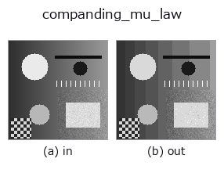
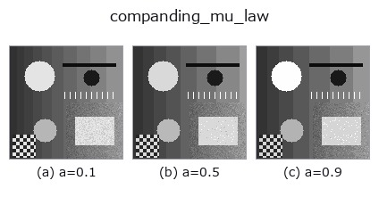
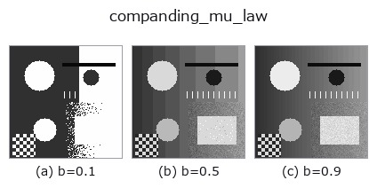
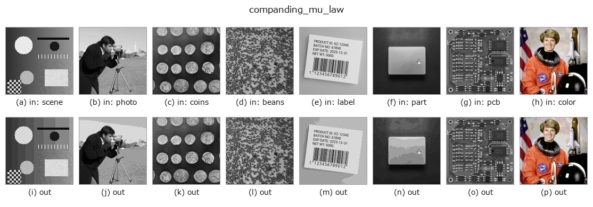

# companding_mu_law — 2D `gray` op

- **データ種**: `image` → `image`
- **呼び出し**: `fullseye.apply(img, "companding_mu_law", a=0.5, b=0.5)` (2-D は 1 画像 + 2 スカラつまみ `a,b∈[0,1]` のモデル)



*図は合成の入力 128×128 で実際に走らせた出力。左が入力、右が出力。点群は上から見た散布(明るさ = z)、1-D 列は折れ線、体積は z 方向の最大値投影、動画は中央フレーム、複素画像は振幅、絵にならない返り値は値そのもの。*

**つまみ a を振る**(0.1 / 0.5 / 0.9、もう一方は既定):



**つまみ b を振る**(0.1 / 0.5 / 0.9、もう一方は既定):



**別の画像でも**(合成シーン / 写真 / 硬貨。上段が入力、下段がその出力。つまみは既定):



*4 列目はカラー (H,W,3) の入力。この op は色を跨がずに扱える(色チャネルを 3 本目の空間軸として畳み込まない)。*

## 使い方

μ 則の圧伸(compand = compress + expand)。``a`` が μ、``b`` がビット数。

``F(x) = ln(1 + mu*x) / ln(1 + mu)`` で暗部を伸ばしてから量子化し、逆変換で戻す。
結果として**刻みが暗部で細かく明部で粗くなる** —— 目も撮像系も暗部の差に敏感なので、
同じビット数で見た目の劣化が小さい。電話の音声符号化(G.711)と同じ原理で、
画像では対数的な階調割り当てにあたる。

``a`` は ``mu = 1 + 254*a``(1〜255、``a=0`` で実質そのまま)、``b`` がビット数 1〜8。

**Lloyd–Max との違い**: あちらは**その画像の分布**に合わせるので符号表が画像ごとに
変わる。こちらは**固定の曲線**なので、別の画像・別の装置と値をそのまま比べられる。
分布が対数的に偏っているという仮定が当たっていれば近い性能が出て、外れていれば
Lloyd–Max のほうが良い。

**適用条件(実測つき)**: 入力が ``[0,1]`` で、**0 付近に画素が集中している**とき。
指数分布の合成画像で一様量子化と比べると、暗部集中なら二乗誤差は ``0.57`` 倍
(3 bit)・``0.51`` 倍(5 bit)に下がる。**明部集中では逆に ``7.7`` 倍(3 bit)・
``18`` 倍(5 bit)悪化する** —— 白地に暗い傷、という検査画像はまさにこれなので、
そのときは ``1 - x`` を通してから当てること。段数が非常に少ないとき(2 bit)は
曲線が強すぎて偏った分布でも一様量子化に負ける(実測 1.17 倍)。

## 詳しい使い方ガイド

- [gallery2d_gray_arith ファミリ ガイド](../guides/gallery2d_gray_arith.md)

## 参考(サンプルデータ・文献)

- [サンプルデータ カタログ(DL URL / ライセンス)](../../SAMPLES.md) — 2-D は skimage.data(BSD/public)+ 合成、3-D は実データ源(Stanford/PDS 等)の DL URL。
- [演算子の来歴・参考文献](../../../REFERENCES.md) — この op 族の元になった研究/手法の出典。
- アルゴリズムの正典(著者・年)と用途は上記**ファミリ使い方ガイド**に記載。

## Studio で試す

下のプログラムは実際に走ることを確かめてある(図と同じ入力)。Studio のヘルプではこのブロックがボタンになり、その場で読み込んで実行できる。

```program
companding_mu_law 0.50 0.50
```

## 実行できる例(この op を実際に呼ぶ検証済みサンプル)

- [gallery2d_gray_arith](../../../../examples/gallery2d_gray_arith.py) — `py -3.11 examples/gallery2d_gray_arith.py`

## 型が繋がる次の op(`image` を入力に取れる)

[identity](../misc/identity.md) · [gaussian](../smoothing/gaussian.md) · [mean_box](../smoothing/mean_box.md) · [bilateral](../smoothing/bilateral.md) · [unsharp](../smoothing/unsharp.md) · [median](../rank/median.md) · [min_filter](../rank/min_filter.md) · [max_filter](../rank/max_filter.md)

## 同カテゴリ(`gray`)

[gamma](gamma.md) · [quantize_uniform](quantize_uniform.md) · [quantize_lloyd_max](quantize_lloyd_max.md) · [quantization_error](quantization_error.md) · [dither_ordered](dither_ordered.md) · [dither_floyd_steinberg](dither_floyd_steinberg.md) · [banding_map](banding_map.md) · [invert](invert.md)

---
*Provenance: ops.py — 2D operator registry. この per-op ノートは `tools/opdocs.py md` が自動生成(手編集しない)。*

© 2026 Kazufumi Furuse — Fullseye operator documentation. Licensed under Apache-2.0.
