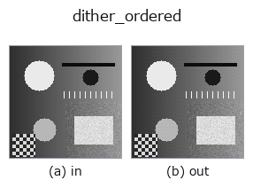
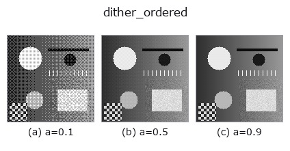
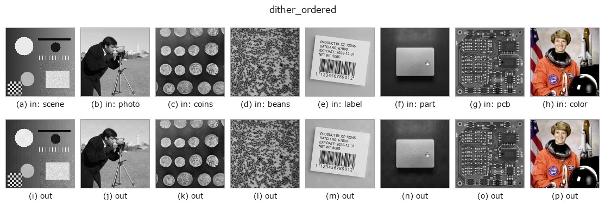

# dither_ordered — 2D `gray` op

- **データ種**: `image` → `image`
- **呼び出し**: `fullseye.apply(img, "dither_ordered", a=0.5, b=0.5)` (2-D は 1 画像 + 2 スカラつまみ `a,b∈[0,1]` のモデル)



*図は合成の入力 128×128 で実際に走らせた出力。左が入力、右が出力。点群は上から見た散布(明るさ = z)、1-D 列は折れ線、体積は z 方向の最大値投影、動画は中央フレーム、複素画像は振幅、絵にならない返り値は値そのもの。*

**つまみ a を振る**(0.1 / 0.5 / 0.9、もう一方は既定):



**つまみ b を振る**(0.1 / 0.5 / 0.9、もう一方は既定):


**別の画像でも**(合成シーン / 写真 / 硬貨。上段が入力、下段がその出力。つまみは既定):



*4 列目はカラー (H,W,3) の入力。この op は色を跨がずに扱える(色チャネルを 3 本目の空間軸として畳み込まない)。*

## 使い方

順序ディザ(Bayer 行列)で量子化する。``a`` がビット数 1〜8、``b`` が行列の大きさ。

量子化の**前に**、画素位置で決まる決まった量(Bayer 行列、``b`` が 2x2 / 4x4 / 8x8 を
振る)を足してから丸める。平坦部の誤差が画素ごとに散るので、段差が細かい市松に化けて
**縞が見えなくなる**。誤差そのものは減らない —— 見え方を変えているだけで、
平均二乗誤差はむしろ ``_quantize_uniform`` よりわずかに大きい。

**誤差拡散(``dither_floyd_steinberg``)との使い分け**: 順序ディザは
**画素ごとに独立**なので、タイル分割しても継ぎ目が出ず、並列化も自由、
同じ入力に必ず同じ出力を返す。誤差拡散のほうが見た目は滑らかだが、
走査順に依存するので**切り出す位置を変えると結果が変わる**。

## 詳しい使い方ガイド

- [gallery2d_gray_arith ファミリ ガイド](../guides/gallery2d_gray_arith.md)

## 参考(サンプルデータ・文献)

- [サンプルデータ カタログ(DL URL / ライセンス)](../../SAMPLES.md) — 2-D は skimage.data(BSD/public)+ 合成、3-D は実データ源(Stanford/PDS 等)の DL URL。
- [演算子の来歴・参考文献](../../../REFERENCES.md) — この op 族の元になった研究/手法の出典。
- アルゴリズムの正典(著者・年)と用途は上記**ファミリ使い方ガイド**に記載。

## Studio で試す

下のプログラムは実際に走ることを確かめてある(図と同じ入力)。Studio のヘルプではこのブロックがボタンになり、その場で読み込んで実行できる。

```program
dither_ordered 0.50 0.50
```

## 実行できる例(この op を実際に呼ぶ検証済みサンプル)

- [gallery2d_gray_arith](../../../../examples/gallery2d_gray_arith.py) — `py -3.11 examples/gallery2d_gray_arith.py`

## 型が繋がる次の op(`image` を入力に取れる)

[identity](../misc/identity.md) · [gaussian](../smoothing/gaussian.md) · [mean_box](../smoothing/mean_box.md) · [bilateral](../smoothing/bilateral.md) · [unsharp](../smoothing/unsharp.md) · [median](../rank/median.md) · [min_filter](../rank/min_filter.md) · [max_filter](../rank/max_filter.md)

## 同カテゴリ(`gray`)

[gamma](gamma.md) · [quantize_uniform](quantize_uniform.md) · [quantize_lloyd_max](quantize_lloyd_max.md) · [quantization_error](quantization_error.md) · [dither_floyd_steinberg](dither_floyd_steinberg.md) · [companding_mu_law](companding_mu_law.md) · [banding_map](banding_map.md) · [invert](invert.md)

---
*Provenance: ops.py — 2D operator registry. この per-op ノートは `tools/opdocs.py md` が自動生成(手編集しない)。*

© 2026 Kazufumi Furuse — Fullseye operator documentation. Licensed under Apache-2.0.
