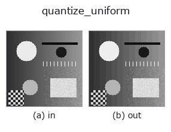
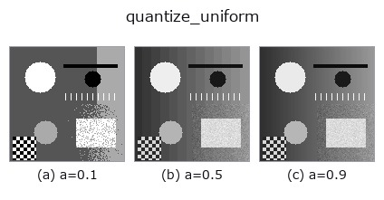
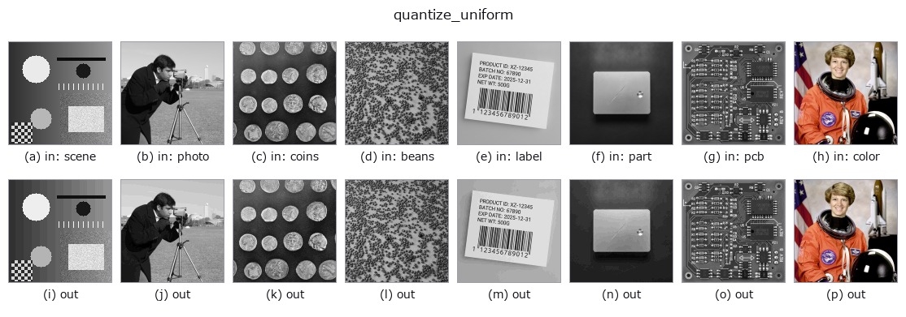

# quantize_uniform — 2D `gray` op

- **データ種**: `image` → `image`
- **呼び出し**: `fullseye.apply(img, "quantize_uniform", a=0.5, b=0.5)` (2-D は 1 画像 + 2 スカラつまみ `a,b∈[0,1]` のモデル)



*図は合成の入力 128×128 で実際に走らせた出力。左が入力、右が出力。点群は上から見た散布(明るさ = z)、1-D 列は折れ線、体積は z 方向の最大値投影、動画は中央フレーム、複素画像は振幅、絵にならない返り値は値そのもの。*

**つまみ a を振る**(0.1 / 0.5 / 0.9、もう一方は既定):



*つまみ b は出力を変えない(実測: 0.1 / 0.5 / 0.9 で同一)。*

**別の画像でも**(合成シーン / 写真 / 硬貨。上段が入力、下段がその出力。つまみは既定):



*4 列目はカラー (H,W,3) の入力。この op は色を跨がずに扱える(色チャネルを 3 本目の空間軸として畳み込まない)。*

## 使い方

一様量子化器(**丸め**)。``a`` がビット数 1〜8、``b`` は未使用。

``round(x * (L-1)) / (L-1)``、``L = 2**bits``。刻みは ``Δ = 1/(L-1)``。

**``xpil_posterize`` との違いはここで、無視できない**: あちらは PIL の実装で
**下位ビットを切り捨てる**ので、出力の平均が入力より ``Δ/2`` だけ低い。
一様分布の入力で実測すると、bits=4 で平均誤差 ``-0.0312``(理論 ``-Δ/2 = -0.03125``)。
分散はどちらも ``Δ²/12`` で同じだが、偏りがある分だけ二乗誤差が

    切り捨て: Δ²/12 + (Δ/2)² = Δ²/3     丸め: Δ²/12

と **4 倍**ちがう。明るさを測る前段に置くなら丸めでなければならない。

**適用条件と誤差(閉形式)**: 入力が刻みに対して十分ばらついている(量子化雑音が
入力と無相関とみなせる)とき、誤差は ``[-Δ/2, +Δ/2]`` の一様分布で、平均 0・
分散 ``Δ²/12``。**この仮定が崩れるのは平坦部**で、そこでは誤差が信号と相関して
縞(バンディング)になる —— 誤差を雑音として扱いたいなら ``dither_ordered`` か
``dither_floyd_steinberg`` を通すこと。段差が見えているかは ``banding_map`` で測れる。

## 詳しい使い方ガイド

- [gallery2d_gray_arith ファミリ ガイド](../guides/gallery2d_gray_arith.md)

## 参考(サンプルデータ・文献)

- [サンプルデータ カタログ(DL URL / ライセンス)](../../SAMPLES.md) — 2-D は skimage.data(BSD/public)+ 合成、3-D は実データ源(Stanford/PDS 等)の DL URL。
- [演算子の来歴・参考文献](../../../REFERENCES.md) — この op 族の元になった研究/手法の出典。
- アルゴリズムの正典(著者・年)と用途は上記**ファミリ使い方ガイド**に記載。

## Studio で試す

下のプログラムは実際に走ることを確かめてある(図と同じ入力)。Studio のヘルプではこのブロックがボタンになり、その場で読み込んで実行できる。

```program
quantize_uniform 0.50 0.50
```

## 実行できる例(この op を実際に呼ぶ検証済みサンプル)

- [gallery2d_gray_arith](../../../../examples/gallery2d_gray_arith.py) — `py -3.11 examples/gallery2d_gray_arith.py`

## 型が繋がる次の op(`image` を入力に取れる)

[identity](../misc/identity.md) · [gaussian](../smoothing/gaussian.md) · [mean_box](../smoothing/mean_box.md) · [bilateral](../smoothing/bilateral.md) · [unsharp](../smoothing/unsharp.md) · [median](../rank/median.md) · [min_filter](../rank/min_filter.md) · [max_filter](../rank/max_filter.md)

## 同カテゴリ(`gray`)

[gamma](gamma.md) · [quantize_lloyd_max](quantize_lloyd_max.md) · [quantization_error](quantization_error.md) · [dither_ordered](dither_ordered.md) · [dither_floyd_steinberg](dither_floyd_steinberg.md) · [companding_mu_law](companding_mu_law.md) · [banding_map](banding_map.md) · [invert](invert.md)

---
*Provenance: ops.py — 2D operator registry. この per-op ノートは `tools/opdocs.py md` が自動生成(手編集しない)。*

© 2026 Kazufumi Furuse — Fullseye operator documentation. Licensed under Apache-2.0.
