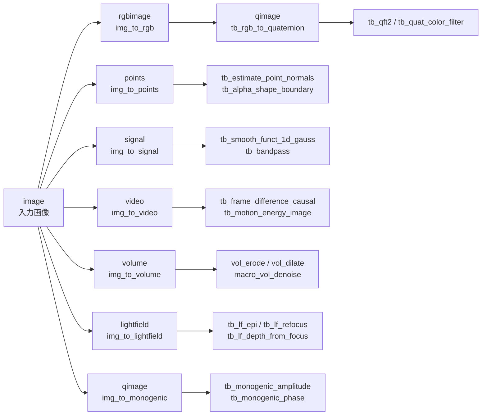

# 入口 op（img_to_*、category=bridge） — 使い方ガイド

## この族は何をする道具箱か

fullseye の 2-D レジストリには、**画像以外の「種」を受ける op が 161 本**ある —— 点群
(`points`)、1-D 信号(`signal`)、動画(`video`)、体積(`volume`)、4-D ライトフィールド
(`lightfield`)、複素場(`cimage`)、光子カウント列(`counts`)、FMCW レーダーのビート立方体
(`beatcube`)、行列(`matrix`)、像面上の点(`keypoints`)、四元数画像(`qimage`)、RGB 画像
(`rgbimage`)。ところが 2026-09-06 までは **画像からそれらの種を作る登録 op が無かった**。
Studio の「1 枚の画像 + つまみ 2 つ」のプログラムからは一度も呼べず、op ノートには
「図なし: 型が届かない」としか書けなかった。

`img_to_*` はその入口。**画像を、各 sort の意味のある値として読み替える**:

| op | 画像をどう読むか | 出力 |
|---|---|---|
| `img_to_points` | 高さ場(一辺 10 の箱、z = 値 × 10 × s) | `(N,3)` の (x, y, z) |
| `img_to_keypoints` | 局所極大 | `(N,2)` の (u, v) = (列, 行) |
| `img_to_signal` | 1 行 / 1 列の濃度プロファイル | 1-D |
| `img_to_counts` | プロファイルを光子の期待値と見て Poisson 標本 | 1-D `int64` |
| `img_to_matrix` | そのまま H×W 行列(純粋なキャスト) | `(H,W)` |
| `img_to_video` | 一定速度でパンする T フレーム | `(T,H,W)` |
| `img_to_volume` | 高さ場を押し出した固体 | `(D,H,W)`(z 先頭) |
| `img_to_lightfield` | 前景/背景 2 層に視差 | `(V,U,H,W)` |
| `img_to_rgb` | 色相・彩度を与える(明部 0.75 超は白の鏡面に戻す二色性モデル) | `(H,W,3)` |
| `img_to_cimage` | 振幅 = 値、位相 = 値に比例 + 傾き | `(H,W)` complex |
| `img_to_beatcube` | 明点を標的(距離 = 列、速度 = 行) | `(A,C,S)` complex |
| `img_to_monogenic` | 単一スケールのモノジェニック信号 | `(H,W,4)` |

**進化には見えない**のがこの族の要点。`ops._candidates` は category `bridge` を候補から
除く —— 入れると image の候補リストが伸び、既存のゲノムが別の op に写ってしまう
(`docs/WAVE0_STABLE_SLOTS.md`)。名前で呼ぶ経路(`fullseye.apply` / Studio のプログラム /
op ごとの図)にだけ見える。

> 契約の根拠: 検証済みサンプル `examples/gallery2d_bridge.py` が全 12 op を叩き、(1) 宣言
> out_sort の形(`backends_typed._SHAPE_OK`)(2) 有限性(3) 決定性(2 回でビット一致)(4) ノブ
> の効き、に加えて **op ごとの閉形式**(z = 値×10×s、フレーム t の変位 = t·step、体積の
> 最上段 = floor(値·s·(D−1))、中央視点 = 入力、|field| = 入力、距離ビン = 2SR/c/f_s·N …)
> を突き合わせる。

## 代表的なパイプライン（op の繋がり）



## 使い方（op グループ別）

### A. 幾何の種を作る（points / keypoints）

- `img_to_points`: `a` が高さの倍率 `s = 0.25 + 1.75a`、`b` が間引き `stride = 1 + int(3b)`。列は
  **(x, y, z) = (列, 行, 高さ)** で、座標は画像の幅・高さを **一辺 10 の箱** に正規化したもの
  (`tb_*` の点群 op が束縛している半径 2.0・境界箱 0〜10 と同じ尺度。画素座標のままだと
  半径系 op の近傍が空になり、占有格子が全 0 になる —— 2026-09-07 実測)。`reprconv` 系(`tb_points_zyx_to_keypoints_uv`)は (z, y, x) を
  期待するので、その族へ渡すときは読み替えが要る(既知の規約混在、`docs/KNOWN_ISSUES.md`)。
- `img_to_keypoints`: `a` が窓 `k = 3 + 2·int(4a)`、`b` がしきい値。平坦部は全画素が極大に
  なるので、前段に `gaussian` を置くと減る。

### B. 1-D の種を作る（signal / counts / matrix）

- `img_to_signal` / `img_to_counts`: `a` が位置、`b < 0.5` で行・`b ≥ 0.5` で列。`counts` は
  さらに `b` が最大光子数 `10^(1+2b)` を決める(少ないほど散布雑音が目立つ)。
- `img_to_matrix` は純粋なキャストで `a, b` は未使用。共分散(`tb_stat_covariance`)は
  「行 = 標本、列 = 変数」として読まれる。

### C. 時間・空間の種を作る（video / volume / lightfield）

- `img_to_video`: 画面全体がパンする(カメラ移動)。背景差分の族は「動かない背景」を
  仮定するので、全体パンでは前景が全画素に出る —— それ自体が族の性質の実演になる。
- `img_to_volume`: z=0 の底面には値 > 0 の画素がすべて乗る(高さ 0 でも底面には乗る)。
- `img_to_lightfield`: 傾き `slope = 1.5a` 画素/視点、前景は `img ≥ b`。深度推定の答えは
  「前景 = slope、背景 = 0」の 2 値。

### D. 色・複素・レーダーの種を作る（rgbimage / qimage / cimage / beatcube）

- `img_to_rgb`: 単一色相の着色 + 明部を白へ戻す鏡面(二色性反射モデル)。鏡面を入れないと
  `tb_specular_coefficient_map` が全 0 になる(実測)。自然画像の色を再現するものではない。
  四元数の色 op には `tb_rgb_to_quaternion` を続ける。
- `img_to_monogenic`: `tb_monogenic_*` は **この形の qimage だけ**受け付ける(色の四元数は
  拒否される)。
- `img_to_cimage`: `a = 0, b = 0.5` で実場。値 0 の画素は位相が定義できない。
- `img_to_beatcube`: 台帳の `fmcw_beat_simulate` を呼ぶ。既定では距離 0〜37.5 m、速度
  ±19.5 m/s が曖昧さの無い範囲で、写像はその内側。4 素子なので `tb_beamform_delay_sum` も通る。

## 動く最小例（検証済み gallery2d_bridge から）

```python
# repo 直下で: py -3.11 this_file.py
import numpy as np
import fullseye as fs

img = np.clip(np.random.default_rng(0).random((64, 64)), 0, 1)
pts = fs.apply(img, "img_to_points", 0.5, 0.5, on_error="raise")     # (1024, 3)
assert pts.shape == (32 * 32, 3)
assert np.allclose(pts[:, 2], (img[::2, ::2] * 10 * (0.25 + 1.75 * 0.5)).ravel())

vid = fs.apply(img, "img_to_video", 0.5, 0.0, on_error="raise")      # (8, 64, 64)、2 px/frame で +x
assert np.array_equal(vid[0], img)

lf = fs.apply(img, "img_to_lightfield", 0.5, 0.5, on_error="raise")  # (5, 5, 64, 64)
assert np.array_equal(lf[2, 2], img)                                 # 中央視点は入力そのもの
print("PASS")
```

Studio では次のプログラムがそのまま走る(op ノートの `sample:` ボタンと同じ):

```
img_to_points 0.50 0.50
tb_estimate_point_normals 0.50 0.50
```

## 数式（必要な op のみ）

- 点群: `(x, y, z) = (col · 10/W, row · 10/H, v[row, col] · 10 · s)`、`s = 0.25 + 1.75a`
- 動画: フレーム `t` の変位 `(dy, dx) = t · 4a · (sin 2πb, cos 2πb)`
- 体積: `vol[z, y, x] = v[y, x]` if `z ≤ v[y, x] · s · (D − 1)` else 0、`D = 8 + 2·int(28b)`
- ライトフィールド: 視点 `(v, u)` の前景のずれ `= slope · (v − v_c, u − u_c)`、`slope = 1.5a`
- 複素場: `field = v · exp(i(2πa·v + 2π(b − 0.5)·8·x/W))`
- ビート立方体: 標的 `t` の寄与 `a_t · exp(i(2π f_b n/f_s + 2π f_d m T_c + 2π d k sinθ/λ))`、
  `f_b = 2SR/c`、`f_d = 2v/λ`(`rangedoppler.fmcw_beat_simulate` の前方モデル)

## サンプルデータ

合成のみ(`examples/gallery2d_bridge.py` の `_image()`)。自分の画像で試すなら
`fullseye.read_image` の結果をそのまま渡せばよい(値域 [0,1] の 2-D)。

## 参考文献（正典）

- Felsberg, M. & Sommer, G. (2001). *The monogenic signal.* IEEE TSP 49(12) —— `img_to_monogenic`。
- Sangwine, S. J. (1996). *Fourier transforms of colour images using quaternion or hypercomplex numbers.* Electronics Letters —— `tb_rgb_to_quaternion` が続く色の四元数。
- Ng, R. (2005). *Fourier slice photography.* SIGGRAPH —— ライトフィールドのリフォーカスの根拠。
- Richards, M. A. (2014). *Fundamentals of Radar Signal Processing* (2nd ed.) —— FMCW のビート周波数とドップラー。
