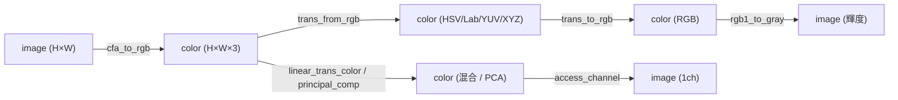

# 色・芸術・拡張 — 使い方ガイド

## この族は何をする道具箱か

この族は「白黒 1 枚」の外側に踏み出す 4 系統の 2-D オペレータ箱です。(1) **color** は 1 チャンネルの `image (H×W)` を第一級の `color (H×W×3, RGB, [0,1])` sort に持ち上げて扱う HALCON 由来の色オペ群 — 色空間変換・3×3 チャンネル混合・チャンネル PCA・輝度化・チャンネル取り出し。gray から color への橋渡しは `cfa_to_rgb`(Bayer デモザイク)が一手に担い、`rgb1_to_gray` / `access_channel` が color を gray に戻します。(2) **artistic** は非写実(NPR)フィルタ(OpenCV の stylization / pencil sketch、PIL の emboss)。(3) **augmentation**(`aug_`)は理想画像を「実カメラが吐く画像」に劣化させる sim-to-real / ドメインランダム化 — ショット/読み出し/固定パターンノイズ、モーションブラー、周辺減光、色収差、ローリングシャッター、JPEG ブロック、cutout、レンズ歪み。(4) **extra**(`xsitk_`)は SimpleITK 由来で HALCON に無い曲率フロー拡散・再構成モルフォロジ・領域拡張/エントロピー閾値・符号付き距離場。

呼び出しは全 op 共通で「1 枚の配列 + 2 つのスカラつまみ `a, b ∈ [0,1]`」: `fullseye.apply(img, "op名", a, b)`。ただし **sort(型)は繋げると変わります** — `image → color`(`cfa_to_rgb`)、`color → image`(`rgb1_to_gray`)、`image → region`(`xsitk_maxentropy_thresh`)、`region → image`(`xsitk_signed_maurer_dist`)。augmentation は入出力とも `image`。augmentation/extra のノイズ・パターン・位置は **つまみ (a,b) からシードされた固定実現**で、同一入力なら 2 回呼んでも bit 完全一致します(再現可能ホールドアウト評価のための registry 契約。1 回の呼び出しは 1 つの固定実現なので、ノイズ集合を見たければつまみを掃引します)。

## 代表的なパイプライン(op の繋がり)

色 sort への持ち上げ → 色空間で加工 → gray へ戻す、という色の道筋:



理想画像を実カメラ風に劣化させ(sim-to-real)、拡張スムージングで整え、閾値で前景を切り、距離場にする道筋:

```mermaid
flowchart LR
  S["image (理想 / 合成)"] -->|aug_motion_blur| A1["image"]
  A1 -->|aug_shot_noise| A2["image"]
  A2 -->|aug_vignette| A3["image (実カメラ風)"]
  A3 -->|xsitk_curvature_flow| E1["image (エッジ保存平滑)"]
  E1 -->|xsitk_maxentropy_thresh| R["region (二値前景)"]
  R -->|xsitk_signed_maurer_dist| D["image (符号付き距離)"]
```



## 使い方(op グループ別)

各行 = op名 — 何をするか — 呼び出し例。つまみの意味は grounded(実装準拠)。

### color(8): image ⇄ color の橋渡しと色加工

- `cfa_to_rgb` — 1 枚のグレー画像を Bayer デモザイクして `color` に持ち上げる橋渡し(`a` が BG/GB/RG/GR の並びを選択、`b` 未使用) — `fullseye.apply(img, "cfa_to_rgb", 0.0, 0.0)`
- `trans_from_rgb` — RGB を HSV/Lab/YUV/XYZ へ色空間変換(`a` が行き先を選択)、結果は選んだ空間の H×W×3 を [0,1] に正規化 — `fullseye.apply(col, "trans_from_rgb", 0.25, 0.0)`
- `trans_to_rgb` — HSV → RGB の逆変換で色空間から RGB に戻す — `fullseye.apply(col, "trans_to_rgb", 0.5, 0.4)`
- `linear_trans_color` — 3×3 チャンネル混合行列を掛ける(`a=πθ` で対角の混合係数を回す、行和で正規化) — `fullseye.apply(col, "linear_trans_color", 0.6, 0.0)`
- `principal_comp` — 3 チャンネルの共分散を固有分解し主成分軸へ射影(成分ごと min-max 正規化)= 色の脱相関 — `fullseye.apply(col, "principal_comp", 0.5, 0.4)`
- `rgb1_to_gray` — BT.601 輝度 `0.299R+0.587G+0.114B` で gray 化(`color → image`) — `fullseye.apply(col, "rgb1_to_gray", 0.5, 0.4)`
- `rgb3_to_gray` — `rgb1_to_gray` と同一の輝度化(HALCON 別名エントリ) — `fullseye.apply(col, "rgb3_to_gray", 0.5, 0.4)`
- `access_channel` — 1 チャンネルを取り出す(`a` で 0/1/2 を選択、`color → image`) — `fullseye.apply(col, "access_channel", 1.0, 0.0)`

### artistic(3): 非写実(NPR)フィルタ

- `xcv_stylization` — OpenCV の edge-aware stylization(カートゥーン調の平滑化、`a=sigma_s`・`b=sigma_r`)を gray で返す — `fullseye.apply(img, "xcv_stylization", 0.6, 0.4)`
- `xcv_pencil_sketch` — OpenCV の pencil sketch(鉛筆デッサン調、gray 出力) — `fullseye.apply(img, "xcv_pencil_sketch", 0.6, 0.4)`
- `xpil_emboss` — PIL の EMBOSS(3×3 エンボス畳み込み)で平坦面は一様・エッジは浮き彫りになる — `fullseye.apply(img, "xpil_emboss", 0.5, 0.4)`

### augmentation(10): 実カメラ劣化の合成(sim-to-real)

- `aug_shot_noise` — ポアソン(光子)ショットノイズ `Poisson(vK)/K`、光子スケール `K=5+250(1−a)`(a=0 で near-clean、a=1 で光子欠乏)、`b` は暗電流ペデスタル — `fullseye.apply(img, "aug_shot_noise", 0.5, 0.0)`
- `aug_read_noise` — 加算ガウス読み出しノイズ `σ=0.005+0.15a`、`b` で行相関成分(水平バンディング)を混合 — `fullseye.apply(img, "aug_read_noise", 0.4, 0.2)`
- `aug_fixed_pattern` — 固定パターンノイズ(FPN/PRNU)= フレーム間で不変な列+行オフセット(`a` 振幅、`b` がどのパターンか) — `fullseye.apply(img, "aug_fixed_pattern", 0.5, 0.3)`
- `aug_motion_blur` — 線形モーションブラー(正規化ライン核との畳み込み、`a` が streak 長 `L=3+20a`、`b` が角度) — `fullseye.apply(img, "aug_motion_blur", 0.6, 0.3)`
- `aug_vignette` — cos⁴ 周辺減光(`a` 強度、`b` 減光半径 R)、中心が最も明るく隅が暗い — `fullseye.apply(img, "aug_vignette", 1.0, 0.5)`
- `aug_chromatic` — 横色収差プロキシ(ハイパス成分を `1+int(4a)` px ずらして加算)、平坦部は不変でエッジのみフリンジ — `fullseye.apply(img, "aug_chromatic", 0.5, 0.5)`
- `aug_rolling_shutter` — ローリングシャッター歪み(行番号に比例した水平シアー、`a` 最大シフト、`b` 向き) — `fullseye.apply(img, "aug_rolling_shutter", 0.5, 0.3)`
- `aug_jpeg_blocks` — JPEG ブロック/リンギング(8×8 DCT を標準 Annex-K 輝度量子化表で量子化、`a` 量子化強度、`b` ブロック格子位相) — `fullseye.apply(img, "aug_jpeg_blocks", 0.6, 0.0)`
- `aug_cutout` — cutout / random erasing(1 辺 `a·min(H,W)` の矩形を消去、`b≤0.5` で黒・`b>0.5` で中間灰) — `fullseye.apply(img, "aug_cutout", 0.4, 0.3)`
- `aug_barrel` — 樽型/糸巻き型レンズ歪み `r'=r(1+k r²)`、`k=0.6a`(`b<0.5` 樽型・`b≥0.5` 糸巻き型) — `fullseye.apply(img, "aug_barrel", 0.5, 0.2)`

### extra(14): SimpleITK 由来(HALCON に無い拡張)

エッジ保存平滑・再構成モルフォロジ(`image → image`):

- `xsitk_curvature_flow` — 曲率フロー平滑化(レベルセット、`a` が反復数)、エッジを残しつつ平滑 — `fullseye.apply(img, "xsitk_curvature_flow", 0.5, 0.4)`
- `xsitk_minmax_curv_flow` — min/max 曲率フロー(小構造を選択的に抑える、`a` 反復・`b` 半径) — `fullseye.apply(img, "xsitk_minmax_curv_flow", 0.5, 0.4)`
- `xsitk_curv_aniso_diff` — 曲率型異方性拡散(`a` conductance・`b` 反復)、エッジ保存平滑の Perona-Malik 系 — `fullseye.apply(img, "xsitk_curv_aniso_diff", 0.5, 0.4)`
- `xsitk_laplacian_sharpen` — ラプラシアン鮮鋭化(結果を min-max 正規化) — `fullseye.apply(img, "xsitk_laplacian_sharpen", 0.5, 0.4)`
- `xsitk_grayscale_fillhole` — グレースケール穴埋め(周囲より暗い極小領域を埋める再構成) — `fullseye.apply(img, "xsitk_grayscale_fillhole", 0.5, 0.4)`
- `xsitk_grayscale_grindpeak` — グレースケールピーク削り(周囲より明るい極大を削る、fillhole の双対) — `fullseye.apply(img, "xsitk_grayscale_grindpeak", 0.5, 0.4)`
- `xsitk_opening_by_recon` — 再構成オープニング(`a` の SE より小さい明構造を除去しつつ形状を保存) — `fullseye.apply(img, "xsitk_opening_by_recon", 0.5, 0.4)`
- `xsitk_closing_by_recon` — 再構成クロージング(opening の双対、暗構造側) — `fullseye.apply(img, "xsitk_closing_by_recon", 0.5, 0.4)`

閾値・領域拡張(`image → region`)と距離場(`region → image`):

- `xsitk_maxentropy_thresh` — 最大エントロピー閾値(Kapur、`a` で探索上限)で二値前景を切る — `fullseye.apply(img, "xsitk_maxentropy_thresh", 0.5, 0.4)`
- `xsitk_moments_thresh` — モーメント保存閾値(Tsai、原画の 1〜3 次モーメントを保つ閾値) — `fullseye.apply(img, "xsitk_moments_thresh", 0.5, 0.4)`
- `xsitk_huang_thresh` — Huang 閾値(ファジィ度最小化) — `fullseye.apply(img, "xsitk_huang_thresh", 0.5, 0.4)`
- `xsitk_connected_threshold` — 連結閾値領域拡張(中心画素をシードに、その値 ±(a,b) の帯で連結成長) — `fullseye.apply(img, "xsitk_connected_threshold", 0.3, 0.3)`
- `xsitk_confidence_connected` — 信頼度連結領域拡張(シード近傍の平均±k·標準偏差で成長、`a` 反復・`b` 乗数 k) — `fullseye.apply(img, "xsitk_confidence_connected", 0.4, 0.3)`
- `xsitk_signed_maurer_dist` — 符号付き Maurer 距離場(`region → image`)、領域内が負(→0.5 未満)・外が正(→0.5 超)、`a` が tanh 圧縮スケール — `fullseye.apply(reg, "xsitk_signed_maurer_dist", 0.5, 0.4)`

## 動く最小例(検証済み gallery2d_color_artistic から)

repo 直下で `py -3.11 this.py`。検証済みギャラリーの GT を凝縮した自己完結・GT アサート付きスニペット(sort の橋渡し・BT.601 輝度の厳密一致・チャンネル選択・cos⁴ 減光・cutout・最大エントロピー閾値を確認):

```python
# repo 直下で: py -3.11 this.py
import numpy as np
import fullseye

_N = 48

def make_image(n=_N):
    yy, xx = np.mgrid[0:n, 0:n].astype(np.float64)
    grad = xx / (n - 1)
    disk = ((yy - n * 0.35) ** 2 + (xx - n * 0.4) ** 2) < (n * 0.18) ** 2
    checker = ((xx.astype(int) // 6 + yy.astype(int) // 6) % 2) * 0.15
    return np.clip(0.35 * grad + 0.45 * disk + checker, 0.0, 1.0)

def make_color(n=_N):
    g = make_image(n)
    return np.clip(np.stack([g, 0.7 * g + 0.1, 1.0 - g], -1), 0.0, 1.0)

img = make_image()
col = make_color()

# 1) cfa_to_rgb: 1 枚のグレー画像 (H,W) から色 sort (H,W,3) への橋渡し
rgb = fullseye.apply(img, "cfa_to_rgb", 0.0, 0.0)
assert rgb.ndim == 3 and rgb.shape[-1] == 3, "cfa_to_rgb must yield H x W x 3"
assert rgb.min() >= -1e-6 and rgb.max() <= 1 + 1e-6, "color stays in [0,1]"

# 2) rgb1_to_gray: 輝度 0.299R + 0.587G + 0.114B に厳密一致 (BT.601)
gray = fullseye.apply(col, "rgb1_to_gray", 0.5, 0.4)
expected = 0.299 * col[..., 0] + 0.587 * col[..., 1] + 0.114 * col[..., 2]
assert np.allclose(gray, expected, atol=1e-12), "luminance must be exact BT.601"

# 3) access_channel: つまみ a でチャンネルを選ぶ (a=0->ch0, a=1->ch2)
ch0 = fullseye.apply(col, "access_channel", 0.0, 0.0)
ch2 = fullseye.apply(col, "access_channel", 1.0, 0.0)
assert np.array_equal(ch0, col[..., 0]) and np.array_equal(ch2, col[..., 2])
assert not np.array_equal(ch0, ch2), "different channels must differ"

# 4) aug_vignette: cos^4 減光 — 隅は中心よりはっきり暗い(一様入力で透過率を可視化)
one = np.ones((_N, _N), np.float64)
vig = fullseye.apply(one, "aug_vignette", 1.0, 0.5)
center, corner = float(vig[_N // 2, _N // 2]), float(vig[0, 0])
assert corner < 0.5 * center, "vignette corner must be darker than centre"

# 5) aug_cutout: 矩形オクルージョンで零画素が増える(b<=0.5 -> 黒で消去)
cut = fullseye.apply(img, "aug_cutout", 0.4, 0.3)
assert int((cut == 0.0).sum()) > int((img == 0.0).sum()) + 100

# 6) xsitk_maxentropy_thresh: 二値かつ前景/背景を分離(自明な全0/全1でない)
seg = fullseye.apply(img, "xsitk_maxentropy_thresh", 0.5, 0.4)
uniq = np.unique(seg)
assert np.all((uniq == 0.0) | (uniq == 1.0)), "threshold output must be binary"
assert 0.0 < float(seg.mean()) < 1.0, "must separate foreground from background"

print("PASS")
```

## 数式(必要な op のみ)

輝度化 `rgb1_to_gray` / `rgb3_to_gray`(BT.601)。ギャラリーは `atol=1e-12` で厳密一致を課します:

$$Y = 0.299\,R + 0.587\,G + 0.114\,B$$

周辺減光 `aug_vignette`。正規化半径 $r$(中心 0・隅 1)と減光半径 $R=0.35+1.15b$ で、透過率は自然な cos⁴ 則、これを強度 $a$ でブレンド:

$$t(r) = \cos^4\!\big(\arctan(r/R)\big) = \frac{1}{\big(1+(r/R)^2\big)^2}, \qquad \text{out} = v\,\big(1 - a + a\,t(r)\big)$$

ショットノイズ `aug_shot_noise`。画像を光子率とみなし、光子スケール $K=5+250(1-a)$ でポアソン標本化して戻す(SNR $\sim\sqrt{K}$):

$$\tilde v = \frac{\mathrm{Poisson}(vK)}{K}$$

レンズ歪み `aug_barrel`。正規化半径 $r$(隅 1)に多項式歪み、$k=0.6a$($b<0.5$ で $+k$= 樽型、$b\ge0.5$ で $-k$= 糸巻き型):

$$r_{\text{src}} = r\,\big(1 + k\,r^2\big)$$

符号付き距離場 `xsitk_signed_maurer_dist`。符号付き Euclidean 距離 $d$(領域内で負)を tanh で [0,1] に圧縮(スケール $a$)、内部 $<0.5<$ 外部:

$$\text{out} = 0.5 + 0.5\,\tanh\!\Big(\frac{d}{1 + 9a}\Big)$$

## サンプルデータ

デバッグ用の 2-D 画像源は [`../../SAMPLES.md`](../../SAMPLES.md) を参照(同梱せずユーザー DL 方式、fail-closed)。この族には合成の `checker_noisy` / `gradient`(色の橋渡しやノイズ拡張の効きを可視化しやすい)と、`skimage.data` の `coins` / `camera`(NPR フィルタ・閾値・領域拡張の実写題材)が向きます — `import sample_images; sample_images.load("camera")`。cfa_to_rgb 以降の color op は 1 枚の gray からその場で色 sort を作れるので、追加素材なしでも動きます。

## 参考文献(正典)

台帳は [`../../../REFERENCES.md`](../../../REFERENCES.md)。この族のアルゴリズムの古典:

- **色空間・輝度**: ITU-R Recommendation BT.601 (1982), "Studio encoding parameters of digital television for standard 4:3 and wide-screen 16:9 aspect ratios."(`rgb1_to_gray` / `rgb3_to_gray` の 0.299/0.587/0.114 荷重)
- **Bayer デモザイク**: Bayer, B. E. (1976), "Color Imaging Array," U.S. Patent 3,971,065.(`cfa_to_rgb`)
- **主成分分析**: Pearson, K. (1901), "On Lines and Planes of Closest Fit to Systems of Points in Space," Philosophical Magazine.(`principal_comp`)
- **エッジ保存 NPR**: Gastal, E. S. L. & Oliveira, M. M. (2011), "Domain Transform for Edge-Aware Image and Video Processing," ACM SIGGRAPH.(`xcv_stylization` / `xcv_pencil_sketch`)
- **エンボス/画像復元モデル**: Gonzalez, R. C. & Woods, R. E., "Digital Image Processing."(`xpil_emboss` の畳み込み、`aug_motion_blur` の PSF 劣化モデル)
- **センサーノイズ**: Healey, G. & Kondepudy, R. (1994), "Radiometric CCD Camera Calibration and Noise Estimation," IEEE TPAMI.(`aug_shot_noise` / `aug_read_noise` / `aug_fixed_pattern`)
- **周辺減光**: Goldman, D. B. (2010), "Vignette and Exposure Calibration and Compensation," IEEE TPAMI.(`aug_vignette`)
- **ローリングシャッター**: Liang, C.-K., Chang, L.-W. & Chen, H. H. (2008), "Analysis and Compensation of Rolling Shutter Effect," IEEE Transactions on Image Processing.(`aug_rolling_shutter`)
- **JPEG**: Wallace, G. K. (1992), "The JPEG Still Picture Compression Standard," IEEE Transactions on Consumer Electronics.(`aug_jpeg_blocks`)
- **レンズ歪み**: Brown, D. C. (1966), "Decentering Distortion of Lenses," Photogrammetric Engineering.(`aug_barrel` の Brown–Conrady 半径歪み)
- **Cutout / Random Erasing**: DeVries, T. & Taylor, G. W. (2017), "Improved Regularization of Convolutional Neural Networks with Cutout," arXiv:1708.04552; Zhong, Z. et al. (2020), "Random Erasing Data Augmentation," AAAI.(`aug_cutout`)
- **曲率フロー / 異方性拡散**: Malladi, R. & Sethian, J. A. (1995), "Image Processing via Level Set Curvature Flow," PNAS; Perona, P. & Malik, J. (1990), "Scale-Space and Edge Detection Using Anisotropic Diffusion," IEEE TPAMI.(`xsitk_curvature_flow` / `xsitk_minmax_curv_flow` / `xsitk_curv_aniso_diff`)
- **グレースケール再構成モルフォロジ**: Vincent, L. (1993), "Morphological Grayscale Reconstruction in Image Analysis," IEEE Transactions on Image Processing.(`xsitk_grayscale_fillhole` / `xsitk_grayscale_grindpeak` / `xsitk_opening_by_recon` / `xsitk_closing_by_recon`)
- **距離変換**: Maurer, C. R., Qi, R. & Raghavan, V. (2003), "A Linear Time Algorithm for Computing Exact Euclidean Distance Transforms," IEEE TPAMI.(`xsitk_signed_maurer_dist`)
- **領域拡張**: Adams, R. & Bischof, L. (1994), "Seeded Region Growing," IEEE TPAMI.(`xsitk_connected_threshold` / `xsitk_confidence_connected`)
- **閾値法**: Kapur, J. N., Sahoo, P. K. & Wong, A. K. C. (1985), "A New Method for Gray-Level Picture Thresholding Using the Entropy of the Histogram," CVGIP; Tsai, W.-H. (1985), "Moment-Preserving Thresholding," CVGIP; Huang, L.-K. & Wang, M.-J. J. (1995), "Image Thresholding by Minimizing the Measures of Fuzziness," Pattern Recognition.(`xsitk_maxentropy_thresh` / `xsitk_moments_thresh` / `xsitk_huang_thresh`)

---
© 2026 Kazufumi Furuse — Fullseye operator documentation. Licensed under Apache-2.0.
